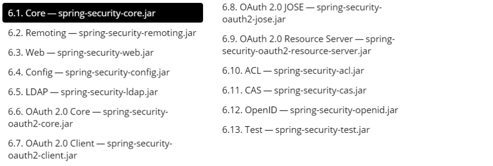

# SpringSecurity安全认证

> 课程名称:  尚硅谷SpringSecurity框架教程（spring security源码剖析从入门到精通）
>
> 课程概述: 教程分为五大部分：Spring Security框架概述、Spring Security入门和基本原理、Spring Security基于Web的权限方案、Spring Security基于微服务的权限方案、Spring Security源码剖析，详细讲解了Spring Security框架，内容由浅入深，理论实践相结合，更深入源码级学习。
>
> 课程地址: https://www.bilibili.com/video/BV15a411A7kP
>
> 讲述人: 王泽
>
> 前置知识:
>
> 1. 掌握Spring框架
>
> 2. 掌握SpringBoot使用
>
> 3. 掌握JavaWEB技术

## 第 1 章: 权限框架简介

### 1.1 概要

Spring 是非常流行和成功的 Java 应用开发框架，Spring Security 正是 Spring 家族中的成员。Spring Security 基于 Spring 框架，提供了一套 Web 应用安全性的完整解决方案。

正如你可能知道的关于安全方面的两个主要区域是 **"认证"** 和 **"授权"** （或者访问控制），一般来说， Web应用的安全性包括<u>用户认证</u>
（Authentication）和<u>用户授权</u>（Authorization ）两个部分，这两点也是Spring Security重要核心功能。

**用户认证指的是:** 验证某个用户是否为系统中的合法主体，也就是说用户能否访问该系统。用户认证一般要求用户提供用户名和密码。系统通过校验用户名和密码来完成认证过程。**通俗点说就是系统认为用户是否能登录**

**用户授权指的是:**
是验证某个用户是否有权限执行某个操作。在一个系统中，不同用户所具有的权限是不同的。比如对一个文件来说，有的用户只能进行读取，而有的用户可以进行修改。一般来说，系统会为不同的用户分配不同的角色，而每个角色则对应一系列的权限。**
通俗点讲就是系统判断用户是否有权限去做某些事情。**

### 1.2 Security历史

"Spring Security开始于2003年年底"spring的acegi安全系统"。起因是Spring开发者邮件列表中的一个问题，有人提问是否考虑提供一个基于spring的安全实现。

---

Spring Security以"The Acegi Secutity System for Spring"
的名字始于2013年晚些时候。一个问题提交到Spring开发者的邮件列表，询问是否已经有考虑一个机遇Spring的安全性社区实现。那时候Spring的社区相对较小（相对现在）。实际上Spring自己在2013年只是一个存在于ScourseForge的项目，这个问题的回答是一个值得研究的领域，虽然目前时间的缺乏组织了我们对它的探索。

---

考虑到这一点，一个简单的安全实现建成但是并没有发布。几周后，Spring社区的其他成员询问了安全性，这次这个代码被发送给他们。其他几个请求也跟随而来。到2014年一月大约有20万人使用了这个代码。这些创业者的人提出一个SourceForge项目加入是为了，这是在2004三月正式成立。

---

在早些时候，这个项目没有任何自己的验证模块，身份验证过程依赖于容器管理的安全性和Acegi安全性。而不是专注于授权。开始的时候这很适合，但是越来越多的用户请求额外的容器支持。容器特定的认证领域接口的基本限制变得清晰。还有一个相关的问题增加新的容器的路径，这是最终用户的困惑和错误配置的常见问题。

---

Acegi安全特定的认证服务介绍。大约一年后，Acegi安全正式成为了Spring框架的子项目。1.0.0最终版本是出版于2006-在超过两年半的大量生产的软件项目和数以百计的改进和积极利用社区的贡献。

---

Acegi安全2007年底正式成为了Spring组合项目，更名为"Spring Security".

### 1.3 权限类框架产品对比

#### 1.3.1 Spring Security

SpringSecurity权限框架是Spring 技术栈的组成部分。通过提供完整可扩展的认证和授权支持保护你的应用程序。官网: https://spring.io/projects/spring-security

**SpringSecurity 特点:**

1. 和Spring无缝整合。
2. 全面的权限控制。
3. 专门为Web开发而设计。
    - 旧版本不能脱离Web环境使用。
    - 新版本对整个框架进行了分层抽取，分成了核心模块和Web模块。单独引入核心模块就可以脱离Web环境。
4. 重量级。

#### 1.3.2 Shiro

Shiro权限框架是Apache 旗下的轻量级权限控制框架。

**Shiro特点:**

1. 轻量级。Shiro主张的理念是把复杂的事情变简单。针对对性能有更高要求的互联网应用有更好表现。
2. 通用性。
    - 好处：不局限于Web环境，可以脱离Web环境使用。
    - 缺陷：在Web环境下一些特定的需求需要手动编写代码定制。

#### 1.3.3 SpringSecurity与Shiro的选择

Spring Security是Spring家族中的一个安全管理框架，实际上，在Spring Boot出现之前， Spring Security就已经发展了多年了，但是使用的并不多，安全管理这个领域，一直是Shiro的天下。

---

相对于Shiro，在SSM中整合Spring Security都是比较麻烦的操作，所以， SpringSecurity虽然功能比Shiro强大，但是使用反而没有Shiro多（ Shiro虽然功能没有Spring
Security多，但是对于大部分项目而言， Shiro也够用了）。自从有了Spring Boot之后， Spring Boot对于Spring Security提供了自动化配置方案，可以使用更少的配置来使用Spring Security.

---

因此，一般来说，常见的安全管理技术栈的组合是这样的：

- SSM + Shiro

- Spring Boot/Spring Cloud + Spring Security

*ps: 以上只是一个推荐的组合而已，如果单纯从技术上来说，无论怎么组合，都是可以运行的。*

### 1.4 模块划分

## 第 2 章: 入门案例

### 2.1 创建一个项目

### 2.2 运行这个项目

### 2.3 权限管理相关概念

### 2.4 添加一个控制器进行访问

### 2.5 SpringSecurity基本原理

### 2.6 UserDetailsService接口讲解

### 2.7 PasswordEncoder接口讲解

### 2.8 SpringBoot对Security的自动配置

https://docs.spring.io/spring-security/site/docs/5.3.4.RELEASE/reference/html5/#servlet-hello

## 第 3 章: Web权限方案

## 第 4 章: 微服务权限方案

## 第 5 章: 源码解析

> 学习地址:
>
>  本视频为1024专属视频，需提前学习请前往尚硅谷官网：www.atguigu.com，B站预计11中旬完结。 

