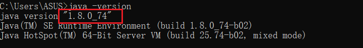
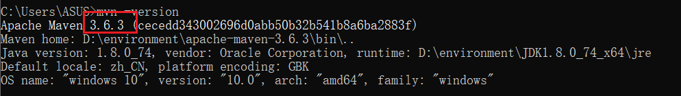

# SpringBoot2


## 笔记

```
- [ ] [](尚硅谷)
```


## 参考

> 视频地址: https://www.bilibili.com/video/BV19K4y1L7MT
>
> 文档地址: https://www.yuque.com/atguigu/springboot
>
> 代码地址:https://gitee.com/leifengyang/springboot2

## 前置知识和环境说明

> SpringBoot2的学习要求:
>
> - 熟悉Spring基础
> - 熟悉Maven使用
>
> 环境要求:
>
> - Java8及以上
>
>   
>
> - Maven 3.3及以上：https://docs.spring.io/spring-boot/docs/current/reference/html/getting-started.html#getting-started-system-requirements
>
>   
>
>   