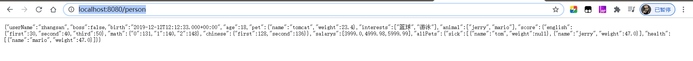

# 配置文件

*springboot应有除了使用application.properties文件,还可以使用application.yml文件*

*这种文件的好处在于结构更加的清楚~*

## 1. 文件类型

### 1.1 properties

同以前的properties用法

### 1.2 yaml

#### 1.2.1 简介

YAML 是 "YAML Ain't Markup Language"（YAML 不是一种标记语言）的递归缩写。在开发的这种语言时，YAML 的意思其实是："Yet Another Markup Language"（仍是一种标记语言）。 

非常适合用来做以数据为中心的配置文件

#### 1.2.2 基本语法

- key: value；kv之间有空格
- 大小写敏感
- 使用缩进表示层级关系
- 缩进不允许使用tab，只允许空格
- 缩进的空格数不重要，只要相同层级的元素左对齐即可
- '#'表示注释
- 字符串无需加引号，如果要加，''与""表示字符串内容 会被 转义/不转义

#### 1.2.3 数据类型

- 字面量：单个的、不可再分的值。date、boolean、string、number、null

  ```yaml
  k: v
  ```

- 对象：键值对的集合。map、hash、set、object 

  ```yaml
  # 行内写法： 
  k: {k1:v1,k2:v2,k3:v3}
  
  # 或
  
  # 非行内写法
  k: 
    k1: v1
    k2: v2
    k3: v3
  ```

- 数组：一组按次序排列的值。array、list、queue

  ```yaml
  # 行内写法：  
  k: [v1,v2,v3]
  
  #或
  
  #非行内写法
  k:
   - v1
   - v2
   - v3
  ```

  

#### 1.2.4 yaml编写示例

**需求**: 在配置文件application.yml文件中编写一些数据,将数据关联到javabean对象中,然后将yml中的数据显示到浏览器

javabean对象 : Person 丶Pet

```java
@ConfigurationProperties(prefix = "person")
@Component
@Data
@ToString
public class Person {
    private String userName;
    private Boolean boss;
    private Date birth;
    private Integer age;
    private Pet pet;
    private String[] interests;
    private List<String> animal;
    private Map<String, Object> score;
    private Set<Double> salarys;
    private Map<String, List<Pet>> allPets;
}
```

```java
@Component
@ToString
@Data
public class Pet {
    private String name;
    private Double weight;
}
```


applcation.xml

```yaml
# yaml表示以上对象
person:
  userName: zhangsan #生日
  boss: false #是否是老板
  birth: 2019/12/12 20:12:33 #生日
  age: 18 #年龄
  pet: #宠物
    name: tomcat #猫
    weight: 23.4 #体重
  interests: [篮球,游泳] #兴趣爱好
  animal:
    - jerry
    - mario
  score: # 成绩
    english: #英语成绩
      first: 30
      second: 40
      third: 50
    math: [131,140,148] # 分数成绩
    chinese: {first: 128,second: 136} # 语文成绩
  salarys: [3999,4999.98,5999.99]
  allPets:
    sick: # 生病的动物
      - {name: tom}
      - {name: jerry,weight: 47}
    health: [{name: mario,weight: 47}] #健康的动物
```

测试结果:



**ps:** yml语法格式简单,体积更小,结构化更清楚,所以SpringBoot的一些配置就推荐使用yml来进行配置

#### 1.2.5 两种配置文件

直接创建springboot项目,默认会有一个application.properties文件,我们为了编写方便一般会新建一个application.yml文件,他们都可以用于做应用的配置;他们的注意点如下

1. 会加载两个application文件,properties文件和yml文件中的内容都会合并加载
2. 如果properties和yml中的配置冲突了,会议properties中的配置为准

## 2. 配置提示

*在使用原生的spring相关的配置的时候是有提示的,但是我们自定义的类和配置文件绑定一般没有提示。可以引入一些依赖,编写的时候就有提示了*


导入依赖

```xml
<dependency>
    <groupId>org.springframework.boot</groupId>
    <artifactId>spring-boot-configuration-processor</artifactId>
    <optional>true</optional>
</dependency>
```

```xml
<build>
    <plugins>
        <plugin>
            <groupId>org.springframework.boot</groupId>
            <artifactId>spring-boot-maven-plugin</artifactId>
            <configuration>
                <excludes>
                    <!--默认需要添加,打包使用的,防止一些冗余的对功能无效的bean类也被打包,减少jvm的开支-->
                    <exclude>
                        <groupId>org.springframework.boot</groupId>
                        <artifactId>spring-boot-configuration-processor</artifactId>
                    </exclude>
                </excludes>
            </configuration>
        </plugin>
    </plugins>
</build>
```

需要先启动一次程序,然后关闭程序,编写yml的提示效果如下

