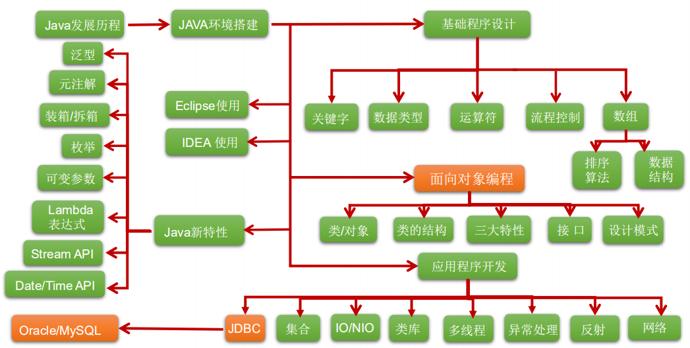

# Java核心技术

> 课程名称: 尚硅谷_Java零基础教程-java入门必备-适合初学者的全套完整版教程(宋红康主讲)
>
> 课程概述:
>
> - 适合零基础学员： 从Java语言起源开始，循序渐进，知识点剖析细致且每章配备大量随堂练习
> - 课程内容推陈出新： 基于JDK 11，将Java8、Java9、Java10、Java11新特性一网打尽 课程中，Eclipse和IDEA都使用到
> - 技术讲解更深入、更全面： 课程共30天，715个小节，涉及主流Java方方面面 内容涵盖数据结构、设计模式、JVM内存结构等深度技术
> - 代码量更大、案例更丰富、更贴近实战
>
> 课程地址: https://www.bilibili.com/video/BV1Kb411W75N
>
> 讲述人 :  宋红康

Java基础编程

- [ ] [第 1 章: Java语言概述](尚硅谷学习笔记/尚硅谷Java学科/01-基础必备/尚硅谷_宋红康_JDBC核心技术(2019新版)/01-Java语言概述.md)
- [ ] [第 2 章: 基本语法](尚硅谷学习笔记/尚硅谷Java学科/01-基础必备/尚硅谷_宋红康_JDBC核心技术(2019新版)/02-基本语法.md)
- [ ] [第 3 章: 数组](尚硅谷学习笔记/尚硅谷Java学科/01-基础必备/尚硅谷_宋红康_JDBC核心技术(2019新版)/03-数组.md)
- [ ] [第 4 章: 面向对象(上)](尚硅谷学习笔记/尚硅谷Java学科/01-基础必备/尚硅谷_宋红康_JDBC核心技术(2019新版)/04-面向对象-上.md)
- [ ] [第 5 章: 面向对象(中)](尚硅谷学习笔记/尚硅谷Java学科/01-基础必备/尚硅谷_宋红康_JDBC核心技术(2019新版)/06-面向对象-中.md)
- [ ] [第 6 章: 面向对象(下)](尚硅谷学习笔记/尚硅谷Java学科/01-基础必备/尚硅谷_宋红康_JDBC核心技术(2019新版)/05-面向对象-下.md)
- [ ] [第 7 章: 异常处理](尚硅谷学习笔记/尚硅谷Java学科/01-基础必备/尚硅谷_宋红康_JDBC核心技术(2019新版)/07-异常处理.md)

Java高级编程

- [ ] [第 8 章: 多线程](尚硅谷学习笔记/尚硅谷Java学科/01-基础必备/尚硅谷_宋红康_JDBC核心技术(2019新版)/08-多线程.md)
- [ ] [第 9 章: Java常用类](尚硅谷学习笔记/尚硅谷Java学科/01-基础必备/尚硅谷_宋红康_JDBC核心技术(2019新版)/09-常用类.md)
- [ ] [第 10 章: 枚举 & 注解](尚硅谷学习笔记/尚硅谷Java学科/01-基础必备/尚硅谷_宋红康_JDBC核心技术(2019新版)/10-枚举与注解.md)
- [ ] [第 11 章: Java集合](尚硅谷学习笔记/尚硅谷Java学科/01-基础必备/尚硅谷_宋红康_JDBC核心技术(2019新版)/11-集合框架.md)
- [ ] [第 12 章: 泛型](尚硅谷学习笔记/尚硅谷Java学科/01-基础必备/尚硅谷_宋红康_JDBC核心技术(2019新版)/12-泛型.md)
- [ ] [第 13 章: IO流](尚硅谷学习笔记/尚硅谷Java学科/01-基础必备/尚硅谷_宋红康_JDBC核心技术(2019新版)/13-IO流.md)
- [ ] [第 14 章: 网络编程](尚硅谷学习笔记/尚硅谷Java学科/01-基础必备/尚硅谷_宋红康_JDBC核心技术(2019新版)/14-网络编程.md)
- [ ] [第 15 章: Java反射机制](尚硅谷学习笔记/尚硅谷Java学科/01-基础必备/尚硅谷_宋红康_JDBC核心技术(2019新版)/15-反射.md)
- [ ] [第 16 章: Java8的其他新特性](尚硅谷学习笔记/尚硅谷Java学科/01-基础必备/尚硅谷_宋红康_JDBC核心技术(2019新版)/16-java8的其他新特性.md)
- [ ] [第 17 章: Java9 & 10 & 11新特性](尚硅谷学习笔记/尚硅谷Java学科/01-基础必备/尚硅谷_宋红康_JDBC核心技术(2019新版)/17-Java9&10&11新特性.md)

