# 项目介绍与MyBatisPlus

## 一丶尚医通介绍

### 1. 简介

尚医通即为网上预约挂号系统，网上预约挂号是近年来开展的一项便民就医服务，旨在缓解看病难、挂号难的就医难题，许多患者为看一次病要跑很多次医院，最终还不一定能保证看得上医生。网上预约挂号全面提供的预约挂号业务从根本上解决了这一就医难题。随时随地轻松挂号！不用排长队！


**学习本项目之前你应该先具备下面的知识:**

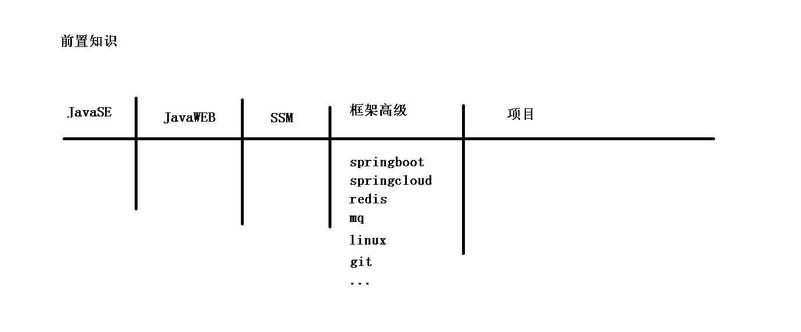

**本系统分为两个系统: `管理员系统` `用户系统`**

- 内部供管理员使用的管理员系统
- 供外部用户使用的用户系统


### 2. 我们能从这个项目中学到什么？

**2.1 巩固以前知识，学习技术点与技术点应用场景，掌握预约挂号业务流程** 

**2.2 核心技术**

| 核心技术     | 说明                                                         |
| ------------ | ------------------------------------------------------------ |
| SpringBoot   | 简化新Spring应用的初始搭建以及开发过程                       |
| SpringCloud  | 基于Spring Boot实现的云原生应用开发工具，SpringCloud使用的技术：（SpringCloudGateway、Spring Cloud Alibaba Nacos、Spring Cloud AlibabaSentinel、SpringCloud Task和SpringCloudFeign等） |
| MyBatis-Plus | 持久层框架                                                   |
| Redis        | 内存缓存                                                     |
| RabbitMQ     | 消息中间件                                                   |
| HTTPClient   | Http协议客户端                                               |
| Swagger2     | Api接口文档工具                                              |
| Nginx        | 负载均衡                                                     |
| Lombok       | 实体映射工具                                                 |
| Mysql        | 关系型数据库                                                 |
| MongoDB      | 面向文档的NoSQL数据库                                        |
| Vue.js       | web 界面的渐进式框架                                         |
| Node.js      | JavaScript 运行环境                                          |
| Axios        | Axios 是一个基于 promise 的 HTTP 库                          |
| NPM          | 包管理器                                                     |
| Babel        | 转码器                                                       |
| Webpack      | 打包工具                                                     |
| Docker       | 容器技术                                                     |
| Git          | 代码管理工具                                                 |


### 3. 业务流程

浏览器中查看原图：[尚医通业务流程](尚医通业务流程图/index.htm)（按住Ctrl，点击链接“[尚医通业务流程](尚医通业务流程图/index.htm)”，即可打开）


### 4. 服务架构

浏览器中查看原图：[尚医通服务架构](尚医通架构图/index.htm)（按住Ctrl，点击链接“[尚医通服务架构](尚医通架构图/index.htm)”，即可打开）

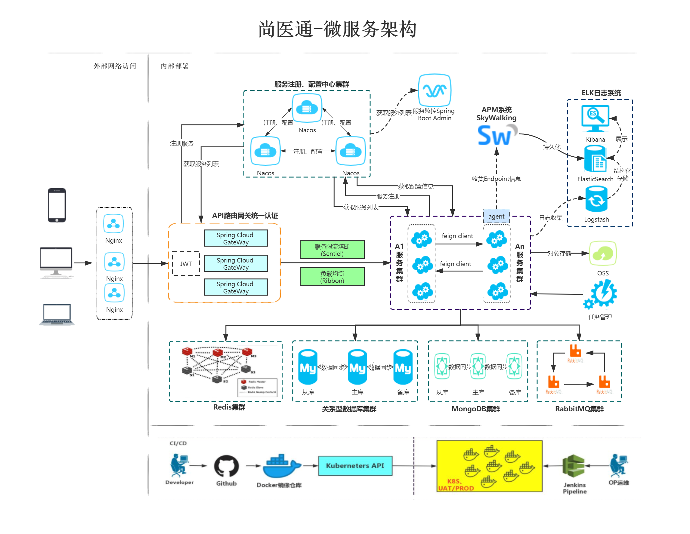

## 二丶MyBatisPlus入门

### 1. 简介

MyBatis-Plus（简称 MP）是一个 MyBatis 的增强工具，在 MyBatis 的基础上只做增强不做改变，为简化开发、提高效率而生。

润物无声  

只做增强不做改变，引入它不会对现有工程产生影响，如丝般顺滑。

效率至上

只需简单配置，即可快速进行 CRUD 操作，从而节省大量时间。

丰富功能

热加载、代码生成、分页、性能分析等功能一应俱全。

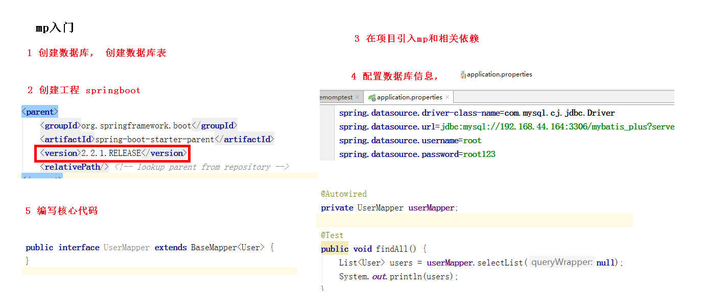

### 2. 创建并初始化数据库

#### 2.1 创建数据库

数据库名: `mybatis_plus`

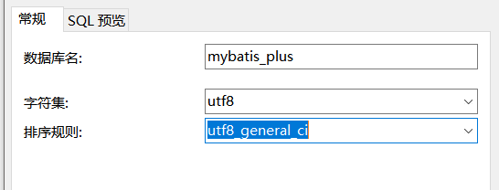

#### 2.2 创建User表

其对应的数据库 Schema 脚本如下：

```sql
CREATE TABLE USER
(
    id BIGINT(20)NOT NULL COMMENT '主键ID',
    NAME VARCHAR(30)NULL DEFAULT NULL COMMENT '姓名',
    age INT(11)NULL DEFAULT NULL COMMENT '年龄',
    email VARCHAR(50)NULL DEFAULT NULL COMMENT '邮箱',
    PRIMARY KEY (id)
);
```

其对应的数据库 Data 脚本如下：

```sql
INSERT INTO user (id, name, age, email)VALUES
(1, 'Jone', 18, 'test1@baomidou.com'),
(2, 'Jack', 20, 'test2@baomidou.com'),
(3, 'Tom', 28, 'test3@baomidou.com'),
(4, 'Sandy', 21, 'test4@baomidou.com'),
(5, 'Billie', 24, 'test5@baomidou.com');
```

### 3. 确认idea配置

#### 3.1 打开配置

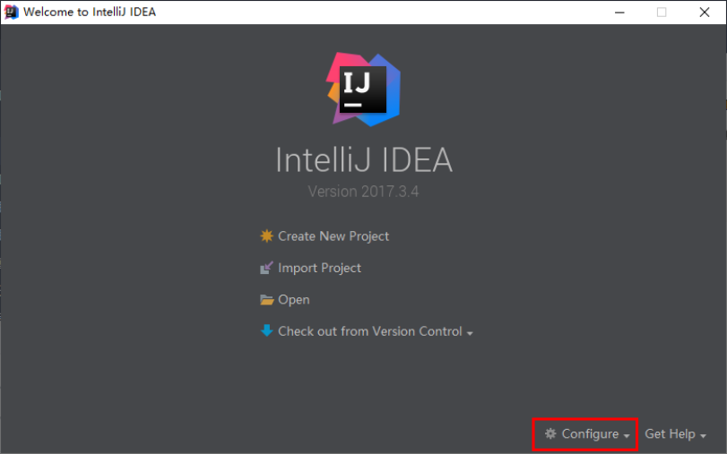

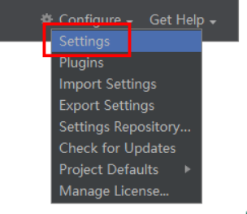


#### 3.2 Java编译器

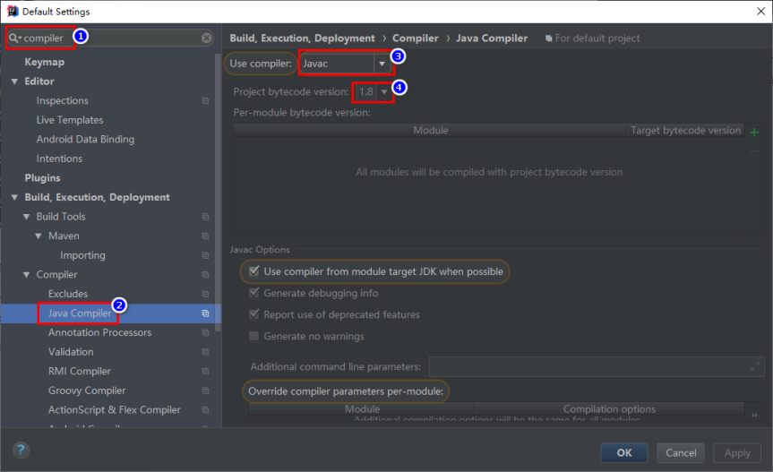

#### 3.3 项目和文件编码

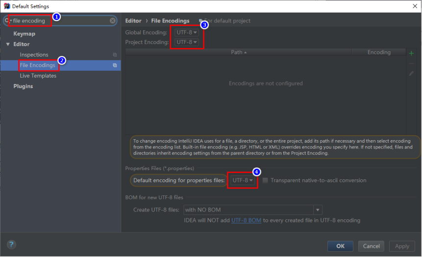


#### 3.4 Maven配置

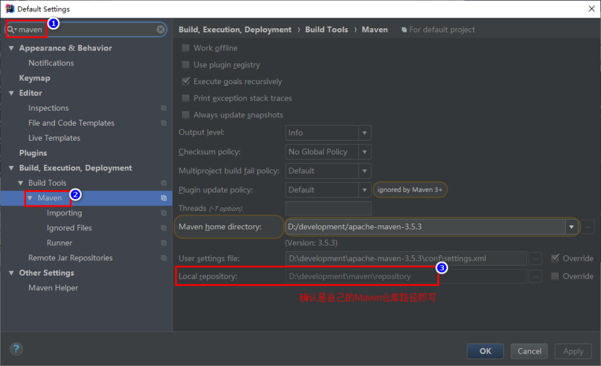

### 4. 创建项目

#### 4.1 初始化工程

使用 Spring Initializr 快速初始化一个 Spring Boot 工程

Group：`com.atguigu`

Artifact：`mybatis_plus`

版本：`2.2.1.RELEASE`

#### 4.2 引入依赖

注意：<span style="color:blue">引入 MyBatis-Plus 之后请不要再次引入 MyBatis，以避免因版本差异导致的问题。</span>

```xml
    <dependencies>
        <dependency>
            <groupId>org.springframework.boot</groupId>
            <artifactId>spring-boot-starter</artifactId>
        </dependency>
        <dependency>
            <groupId>org.springframework.boot</groupId>
            <artifactId>spring-boot-starter-test</artifactId>
            <scope>test</scope>
            <exclusions>
                <exclusion>
                    <groupId>org.junit.vintage</groupId>
                    <artifactId>junit-vintage-engine</artifactId>
                </exclusion>
            </exclusions>
        </dependency>
        <!--mybatis-plus-->
        <dependency>
            <groupId>com.baomidou</groupId>
            <artifactId>mybatis-plus-boot-starter</artifactId>
            <version>3.3.1</version>
        </dependency>

        <!--mysql依赖-->
        <dependency>
            <groupId>mysql</groupId>
            <artifactId>mysql-connector-java</artifactId>
        </dependency>
        <!--lombok用来简化实体类-->
        <dependency>
            <groupId>org.projectlombok</groupId>
            <artifactId>lombok</artifactId>
            <optional>true</optional>
        </dependency>
    </dependencies>
```


#### 4.3 idea中安装lombok插件

ps: idea2020内置了lombok插件

##### 4.3.1 idea2019版本


##### 4.3.2 idea2018版本

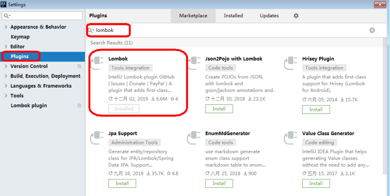

### 5. 编写代码

#### 5.1 配置

在 application.properties 配置文件中添加 MySQL 数据库的相关配置：

spring boot 2.0（内置jdbc5驱动）

```properties
#mysql数据库连接
spring.datasource.driver-class-name=com.mysql.jdbc.Driver
spring.datasource.url=jdbc:mysql://localhost:3306/mybatis_plus?characterEncoding=utf-8&useSSL=false
spring.datasource.username=root
spring.datasource.password=root
```

spring boot 2.1及以上（内置jdbc8驱动）

注意：driver和url的变化

```properties
spring.datasource.driver-class-name=com.mysql.cj.jdbc.Driver
spring.datasource.url=jdbc:mysql://localhost:3306/mybatis_plus?serverTimezone=GMT%2B8
spring.datasource.username=root
spring.datasource.password=root
```

注意:

1. 这里的 url 使用了 ?serverTimezone=GMT%2B8 后缀，因为8.0版本的jdbc驱动需要添加这个后缀，否则运行测试用例报告如下错误：

   ```
   java.sql.SQLException: The server time zone value 'Öйú±ê׼ʱ¼ä' is unrecognized or represents more 
   ```

2. 这里的 driver-class-name 使用了  com.mysql.cj.jdbc.Driver ，在 jdbc 8 中 建议使用这个驱动，否则运行测试用例的时候会有 WARN 信息

#### 5.2 启动类

在 Spring Boot 启动类中添加 @MapperScan 注解，扫描 Mapper 文件夹

```java
@SpringBootApplication
@MapperScan("com.atguigu.demomptest.mapper")
public class DemomptestApplication {

    public static void main(String[] args) {
        SpringApplication.run(DemomptestApplication.class, args);
    }

}
```

#### 5.3 添加实体

创建包 entity 编写实体类 User.java（此处使用了 Lombok 简化代码）

```java
@Data
public class User {
    private Long id;
    private String name;
    private Integer age;
    private String email;
}
```

查看编译结果


#### 5.4 添加mapper

创建包 mapper 编写Mapper 接口： UserMapper.java

```java
@Repository //持久层框架 防止@Autowired时爆红!
public interface UserMapper extends BaseMapper<User> {
}
```

#### 5.5 测试

添加测试类，进行功能测试：

```java
@SpringBootTest
class DemomptestApplicationTests {

    @Autowired
    private UserMapper userMapper;
    @Test
    public void findAll() {
        List<User> users = userMapper.selectList(null);
        users.forEach(System.out::println);
    }
}
```

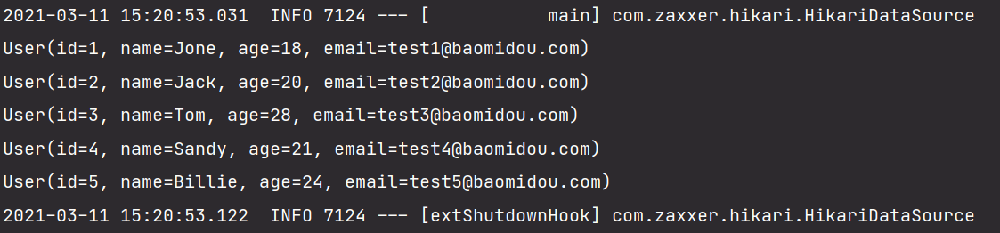

注意：

IDEA在 userMapper 处报错，因为找不到注入的对象，因为类是动态创建的，但是程序可以正确的执行。

为了避免报错，可以在 dao 层 的接口上添加 `@Repository `注解

通过以上几个简单的步骤，我们就实现了 User 表的 CRUD 功能，甚至连 XML 文件都不用编写！

查看控制台输出：


#### 5.6 查看sql输出日志

application.properties配置文件添加sql日志配置

```properties
#mybatisplus sql日志
mybatis-plus.configuration.log-impl=org.apache.ibatis.logging.stdout.StdOutImpl
```

执行上面的测试方法`findAll()`控制台就会出现如下的sql日志了

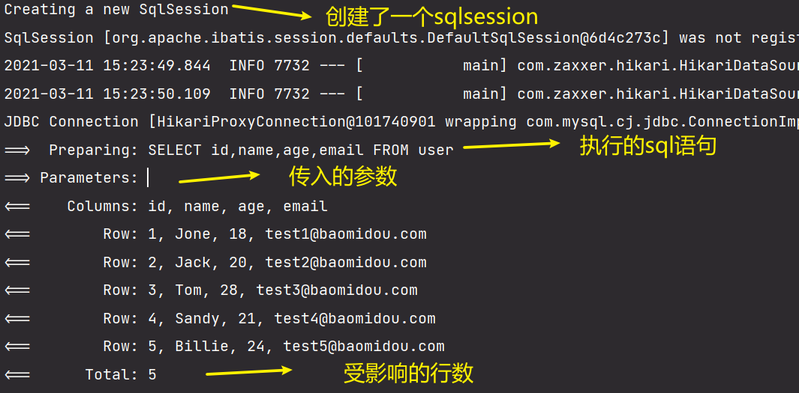

## 三丶主键策略

### 1. 插入操作

```java
//添加
@Test
public void testAdd() {
    User user = new User();
    user.setName("lucy");
    user.setAge(20);
    user.setEmail("1243@qq.com");
    //并没有设置id值 但是通过我们查看数据库生成了一个id值 与主键策略有关
    int insert = userMapper.insert(user);
    System.out.println(insert);
}
```

注意：数据库插入id值默认为：全局唯一id

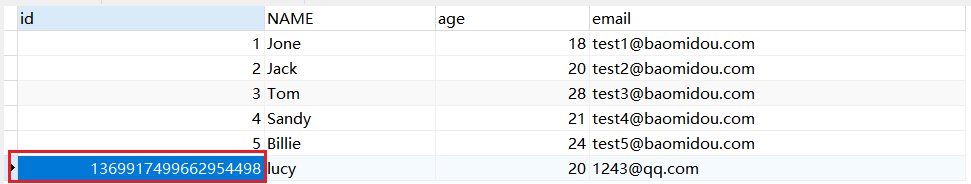

### 2. MP的主键策略

标红的两种策略是项目中常用的 

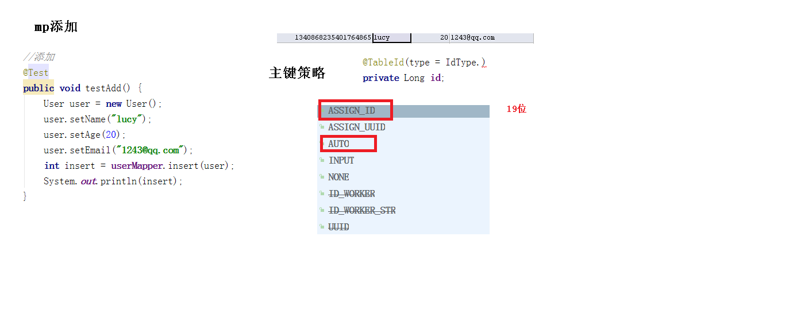

#### 2.1 ASSIGN_ID

MyBatis-Plus默认的主键策略是：ASSIGN_ID （使用了雪花算法）

```java
@TableId(type = IdType.ASSIGN_ID) //会生成一个19位的随机不唯一值
private String id;
```

<span style="color:red">雪花算法：分布式ID生成器</span>

雪花算法是由Twitter公布的分布式主键生成算法，它能够保证不同表的主键的不重复性，以及相同表的主键的有序性。

**核心思想:**

长度共64bit（一个long型）。

首先是一个符号位，1bit标识，由于long基本类型在Java中是带符号的，最高位是符号位，正数是0，负数是1，所以id一般是正数，最高位是0。

41bit时间截(毫秒级)，存储的是时间截的差值（当前时间截 - 开始时间截)，结果约等于69.73年。

10bit作为机器的ID（5个bit是数据中心，5个bit的机器ID，可以部署在1024个节点）。

12bit作为毫秒内的流水号（意味着每个节点在每毫秒可以产生 4096 个 ID）。

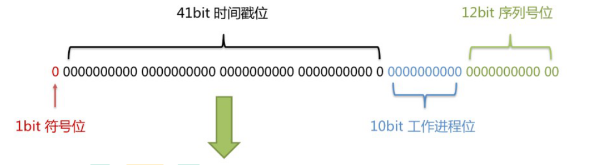

优点：整体上按照时间自增排序，并且整个分布式系统内不会产生ID碰撞，并且效率较高。

#### 2.2 AUTO 自增策略

需要在创建数据表的时候设置主键自增 然后生成的id就是自动增长了

实体字段中配置 `@TableId(type = IdType.AUTO)`

```java
@TableId(type = IdType.AUTO)
private Long id;
```

要想影响所有实体的配置，可以设置全局主键配置

```properties
#全局设置主键生成策略 这样的话默认都是AUTO
mybatis-plus.global-config.db-config.id-type=auto
```

```
其他几种策略的意思:
INPUT: 需要自己手动设置id
NONE: 
```


## 四丶自动填充和乐观锁

### 1. 更新操作

注意：update时生成的sql自动是动态sql：`UPDATE user SET age=? WHERE id=? `

```java
//修改
@Test
public void testUpdate() {
    User user = new User();
    user.setId(1369917499662954498L); //这一步不是真正的设置值而是相当于通过id来进行查询数据的    值太长需要加 L
	//后面这些set才是真正的更新操作
    user.setName("lucymary");
    int count = userMapper.updateById(user);
    System.out.println(count);
}
```

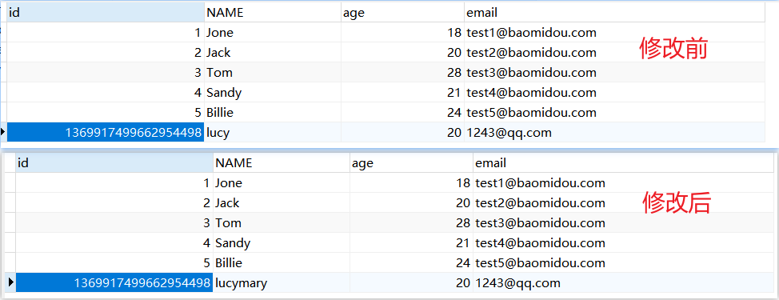

### 2. 自动填充

需求描述：

项目中经常会遇到一些数据，每次都使用相同的方式填充，例如记录的创建时间，更新时间等。

我们可以使用MyBatis Plus的自动填充功能，完成这些字段的赋值工作


#### 1.1 数据库修改

在User表中添加datetime类型的新的字段 `create_time`、`update_time`

#### 1.2 实体修改

实体上增加字段并添加自动填充注解

```java
    @TableField(fill = FieldFill.INSERT)
    private Date createTime; //create_time

    //@TableField(fill = FieldFill.UPDATE) //第一次插入的时候没有值的
    @TableField(fill = FieldFill.INSERT_UPDATE)
    private Date updateTime; //update_time
```

#### 1.3 实现元对象处理接口

创建handler包,创建MyMetaObjectHandler类实现MetaObjectHandler类重写`insertFill()`和`updateFill()`

这个类的作用是在执行的时候, 所设置的值

注意：不要忘记添加 @Component 注解

```java
@Component
public class MyMetaObjectHandler implements MetaObjectHandler {

    //mp执行添加操作，这个方法执行
    @Override
    public void insertFill(MetaObject metaObject) {
        // 参数1: 属性 参数2: 设置的值 参数3: 当前的metaObject对象
        this.setFieldValByName("createTime",new Date(),metaObject);
        this.setFieldValByName("updateTime",new Date(),metaObject);
    }

    //mp执行修改操作，这个方法执行
    @Override
    public void updateFill(MetaObject metaObject) {
        this.setFieldValByName("updateTime",new Date(),metaObject);
    }
}
```

测试:

1. 执行前面的`testAdd()`方法;发现更新时间和创建时间已经自动填充到数据表里面了

   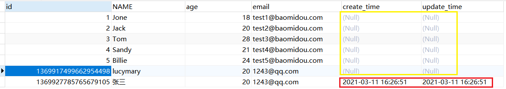

2. 执行前面的`testUpdate()`方法; 发现更新的时间已经填充到数据表里面了

   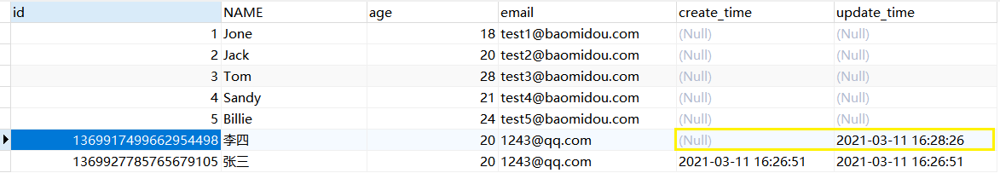

### 3. 乐观锁


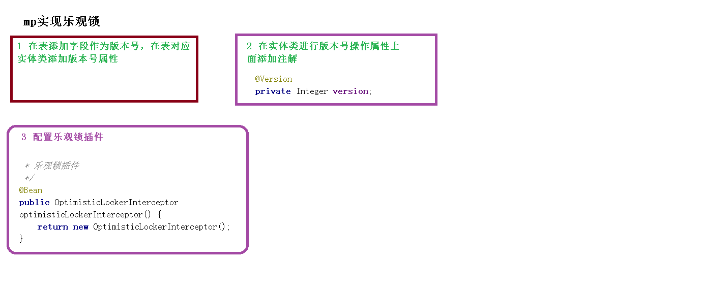

#### 3.1 场景

**主要适用场景**：当要更新一条记录的时候，希望这条记录没有被别人更新，也就是说实现线程安全的数据更新

**乐观锁实现方式**： 

- 取出记录时，获取当前version

- 更新时，带上这个version

- 执行更新时， set version = newVersion where version = oldVersion

- 如果version不对，就更新失败

- 接下来介绍如何在Mybatis-Plus项目中，使用乐观锁：

### 4. 乐观锁实现流程

#### 4.1 修改实体类

添加 @Version 注解

```java
@Version
private Integer version;
```

#### 4.2 创建配置文件

创建包config，创建文件MybatisPlusConfig.java

此时可以删除主类中的 @MapperScan 扫描注解

```java
@Configuration
@MapperScan("com.atguigu.demomptest.mapper")
public class MpConfig {
    /**
     * 乐观锁插件
     */
    @Bean
    public OptimisticLockerInterceptor optimisticLockerInterceptor() {
        return new OptimisticLockerInterceptor();
    }
}
```

#### 4.3 注册乐观锁插件

在 MybatisPlusConfig 中注册 Bean

```java
/**
* 乐观锁插件
*/
@Bean
public OptimisticLockerInterceptor optimisticLockerInterceptor() {
return new OptimisticLockerInterceptor();
}
```


## 五丶查询

### 1. 查询

#### 1.1 通过多个id批量查询

完成了动态sql的foreach的功能  

```java
//多个id批量查询
@Test
public void testSelect1() {
    List<User> users = userMapper.selectBatchIds(Arrays.asList(1, 2, 3));
    System.out.println(users);
}
```

#### 1.2 简单条件查询

通过map封装查询条件

注意：map中的key对应数据库中的列名。如：数据库user_id，实体类是userId，这时map的key需要填写user_id

```java
//简单条件查询
@Test
public void testSelect2() {
    Map<String, Object> columnMap = new HashMap<>();
    columnMap.put("name","Jack");
    columnMap.put("age",20);
    List<User> users = userMapper.selectByMap(columnMap);
    System.out.println(users);
}
```

### 2. 分页

#### 2.1 分页插件

MyBatis Plus自带分页插件，只要简单的配置即可实现分页功能

##### 2.1.1 添加分页插件

配置类中添加@Bean配置

```java
/**
 * 分页插件
 */
@Bean
public PaginationInterceptor paginationInterceptor() {
    return new PaginationInterceptor();
}
```

##### 2.1.2 测试selectPage分页

测试：最终通过page对象获取相关数据

```java
//分页查询
@Test
public void testSelectPage() {
    Page<User> page = new Page(1,3);
    Page<User> userPage = userMapper.selectPage(page, null);
    //返回对象得到分页所有数据
    long pages = userPage.getPages(); //总页数
    long current = userPage.getCurrent(); //当前页
    List<User> records = userPage.getRecords(); //查询数据集合
    long total = userPage.getTotal(); //总记录数
    boolean hasNext = userPage.hasNext();  //下一页
    boolean hasPrevious = userPage.hasPrevious(); //上一页

    System.out.println(pages);
    System.out.println(current);
    System.out.println(records);
    System.out.println(total);
    System.out.println(hasNext);
    System.out.println(hasPrevious);
}
```

#### 2.2  测试selectMapPage分页

当指定了特定的查询列时，希望分页结果列表只返回被查询的列，而不是很多null值

测试selectMapsPage分页：结果集是Map

```java
@Test
public void testSelectMapsPage() {
    //Page不需要泛型
    Page<Map<String, Object>> page = newPage<>(1, 5);
    Page<Map<String, Object>> pageParam = userMapper.selectMapsPage(page, null);
    List<Map<String, Object>> records = pageParam.getRecords();
    records.forEach(System.out::println);
    System.out.println(pageParam.getCurrent());
    System.out.println(pageParam.getPages());
    System.out.println(pageParam.getSize());
    System.out.println(pageParam.getTotal());
    System.out.println(pageParam.hasNext());
    System.out.println(pageParam.hasPrevious());
}
```


## 六丶删除与逻辑删除

### 1. 删除

#### 1.1 根据id删除

```java
@Test
public void testDeleteById(){
    int result = userMapper.deleteById(5L);
	system.out.println(result);
}
```

#### 1.2 批量删除

```java
@Test
public void testDeleteBatchIds() {
    int result = userMapper.deleteBatchIds(Arrays.asList(8, 9, 10));
	system.out.println(result);
}
```

#### 1.3 简单条件删除

```java
@Test
public void testDeleteByMap() {
    HashMap<String, Object> map = new HashMap<>();
    map.put("name", "Helen");
    map.put("age", 18);
    int result = userMapper.deleteByMap(map);
    system.out.println(result);
}
```

### 2. 逻辑删除

#### 2.1 物理删除与逻辑删除

<span style="color:red">物理删除：真实删除</span>，将对应数据从数据库中删除，之后查询不到此条被删除数据

<span style="color:red">逻辑删除：假删除</span>，将对应数据中代表是否被删除字段状态修改为“被删除状态”，之后在数据库中仍旧能看到此条数据记录

**逻辑删除的使用场景:**

可以进行数据恢复

有关联数据,不便删除

#### 2.2 逻辑删除实现流程

##### 2.2.1 数据库字段修改

添加 deleted字段

```sql
ALTERTABLE `user` ADD COLUMN `deleted` boolean DEFAULT false
```

##### 2.2.2 实体类修改

添加deleted 字段，并加上 @TableLogic 注解 

```java
@TableLogic
private Integer deleted;
```

##### 2.2.3 配置(可选)

application.properties 加入以下配置，此为默认值，如果你的默认值和mp默认的一样,该配置可无

```properties
# 删除的状态
mybatis-plus.global-config.db-config.logic-delete-value=1  
# 没有删除的状态
mybatis-plus.global-config.db-config.logic-not-delete-value=0
```

##### 2.2.4 测试

测试后发现，数据并没有被删除，deleted字段的值由0变成了1

测试后分析打印的sql语句，是一条update

注意：被删除前，数据的deleted 字段的值必须是 0，才能被选取出来执行逻辑删除的操作

```java
@Test
public void testLogicDelete() {
    int result = userMapper.deleteById(1L);
	system.out.println(result);
}
```

##### 2.2.5 测试逻辑删除后的查询

MyBatis Plus中查询操作也会自动添加逻辑删除字段的判断

```java
@Test
public void testLogicDeleteSelect() {
    List<User> users = userMapper.selectList(null);
    users.forEach(System.out::println);
}
```


## 七丶条件构造器和常用接口

### 1. wapper介绍

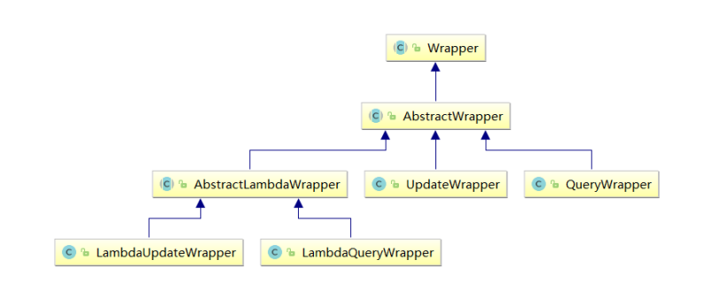

```java
Wrapper ： 条件构造抽象类，最顶端父类
     AbstractWrapper ： 用于查询条件封装，生成 sql 的 where 条件
        QueryWrapper ： 查询条件封装
        UpdateWrapper ： Update 条件封装
    AbstractLambdaWrapper ： 使用Lambda 语法
        LambdaQueryWrapper ：用于Lambda语法使用的查询Wrapper
    	LambdaUpdateWrapper ： Lambda 更新封装Wrapper
```

```java
@SpringBootTest
publicclassQueryWrapperTests {

@Autowired
privateUserMapperuserMapper;
}
```

### 2. 测试用例

#### 2.1 ge、gt、le、lt、isNull、isNotNull

```java
@Test
public void testQuery() {
QueryWrapper<User>queryWrapper = newQueryWrapper<>();
queryWrapper
        .isNull("name")
        .ge("age", 12)
        .isNotNull("email");
    int result = userMapper.delete(queryWrapper);
System.out.println("delete return count = " + result);
}
```

#### 2.2 eq、ne

注意：seletOne()返回的是一条实体记录，当出现多条时会报错

```java
@Test
public void testSelectOne() {
QueryWrapper<User>queryWrapper = newQueryWrapper<>();
queryWrapper.eq("name", "Tom");
Useruser = userMapper.selectOne(queryWrapper);//只能返回一条记录，多余一条则抛出异常
System.out.println(user);
}
```

#### 2.3  between、notBetween

包含大小边界

```java
@Test
public void testSelectCount() {
QueryWrapper<User>queryWrapper = newQueryWrapper<>();
queryWrapper.between("age", 20, 30);
    Integer count = userMapper.selectCount(queryWrapper); //返回数据数量
System.out.println(count);
}
```

#### 2.4 like、notLike、likeLeft、likeRight

selectMaps()返回Map集合列表，通常配合select()使用

```java
@Test
public void testSelectMaps() {
QueryWrapper<User>queryWrapper = newQueryWrapper<>();
queryWrapper
        .select("name", "age")
        .like("name", "e")
        .likeRight("email", "5");
List<Map<String, Object>>maps = userMapper.selectMaps(queryWrapper);//返回值是Map列表
maps.forEach(System.out::println);
}
```

#### 2.5 orderBy、orderByDesc、orderByAsc

```java
@Test
public void testSelectListOrderBy() {
QueryWrapper<User>queryWrapper = newQueryWrapper<>();
queryWrapper.orderByDesc("age", "id");
List<User>users = userMapper.selectList(queryWrapper);
users.forEach(System.out::println);
}
```

### 3. 查询方式

| 查询方式     | 说明                              |
| ------------ | --------------------------------- |
| setSqlSelect | 设置 SELECT 查询字段              |
| where        | WHERE 语句，拼接 + WHERE 条件     |
| and          | AND 语句，拼接 + AND 字段=值      |
| andNew       | AND 语句，拼接 + AND (字段=值)    |
| or           | OR 语句，拼接 + OR 字段=值        |
| orNew        | OR 语句，拼接 + OR (字段=值)      |
| eq           | 等于=                             |
| allEq        | 基于 map 内容等于=                |
| ne           | 不等于<>                          |
| gt           | 大于>                             |
| ge           | 大于等于>=                        |
| lt           | 小于<                             |
| le           | 小于等于<=                        |
| like         | 模糊查询 LIKE                     |
| notLike      | 模糊查询 NOT LIKE                 |
| in           | IN 查询                           |
| notIn        | NOT IN 查询                       |
| isNull       | NULL 值查询                       |
| isNotNull    | IS NOT NULL                       |
| groupBy      | 分组 GROUP BY                     |
| having       | HAVING 关键词                     |
| orderBy      | 排序 ORDER BY                     |
| orderAsc     | ASC 排序 ORDER BY                 |
| orderDesc    | DESC 排序 ORDER BY                |
| exists       | EXISTS 条件语句                   |
| notExists    | NOT EXISTS 条件语句               |
| between      | BETWEEN 条件语句                  |
| notBetween   | NOT BETWEEN 条件语句              |
| addFilter    | 自由拼接 SQL                      |
| last         | 拼接在最后，例如：last(“LIMIT 1”) |