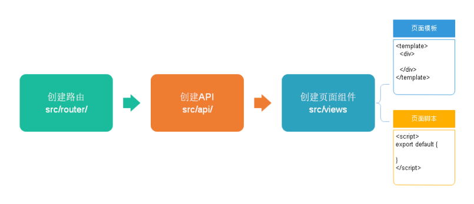
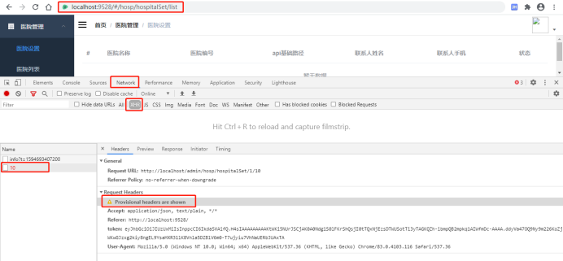

# 平台管理前端搭建

## 一丶管理平台前端搭建

### 1. 项目名称

解压vue-admin-template-master.zip，项目重命名：yygh-admin


### 2. 修改package.json

```json
{
"name": "yygh-admin",
"version": "3.8.0",
"license": "MIT",
"description": "尚医通管理平台系统",
"author": "493111402@qq.com",
...
}
```


### 3. 如果需要修改端口号

config/index.js中修改

port: 9528

### 4. 项目的目录结构

```
. 
├── build // 构建脚本
├── config // 全局配置 
├── node_modules // 项目依赖模块
├── src //项目源代码
├── static // 静态资源
└── package.jspon // 项目信息和依赖配置
 
src 
├── api // 各种接口 
├── assets // 图片等资源 
├── components // 各种公共组件，非公共组件在各自view下维护 
├── icons //svg icon 
├── router // 路由表 
├── store // 存储 
├── styles // 各种样式 
├── utils // 公共工具，非公共工具，在各自view下维护 
├── views // 各种layout
├── App.vue //***项目顶层组件*** 
├── main.js //***项目入口文件***
└── permission.js //认证入口
```


### 5. 运行项目

```shell
npm insall
npm run dev
```


### 6. 登录页修改

将登陆相关请求接口改为静态数据，不请求接口

修改文件：\src\store\modules\user.js

注释掉：Login、GetInfo、LogOut三个方法，替换为如下代码：

```javascript
Login({ commit }) {
const data = {
'token': 'admin'
}
setToken(data.token)// 将token存储在cookie中
commit('SET_TOKEN', data.token)
},

GetInfo({ commit }) {
const data = {
'roles': [
'admin'
],
'name': 'admin',
'avatar': 'https://wpimg.wallstcn.com/f778738c-e4f8-4870-b634-56703b4acafe.gif'
}
if (data.roles &&data.roles.length >0) { // 验证返回的roles是否是一个非空数组
commit('SET_ROLES', data.roles)
  }
  commit('SET_NAME', data.name)
  commit('SET_AVATAR', data.avatar)
},

// 登出
LogOut({ commit, state }) {
return new Promise((resolve, reject) => {
    commit('SET_TOKEN', '')
    commit('SET_ROLES', [])
    removeToken()
    resolve()
  })
}
```


<span style="color:red">说明：token是我们手动配置的，如果过期后续自行生成，后续会有TokenHelper类生成token，在此不用关注</span>

修改\src\util\request.js

```javascript
config.headers['token'] = getToken()
```


### 7. 页面零星修改

#### 7.1 标题

index.html（项目的html入口）

```html
<title>尚医通管理平台系统</title>
```


#### 7.2 国际化设置

打开 src/main.js（项目的js入口），第7行，修改语言为 zh-CN，使用中文语言环境，例如：日期时间组件

```javascript
import locale from 'element-ui/lib/locale/lang/zh-CN' // lang i18n
```


#### 7.3 导航栏文字

src/views/layout/components（当前项目的布局组件）

src/views/layout/components/Navbar.vue

```html
<!--13行 -->
<el-dropdown-item>
    首页
</el-dropdown-item>
<!--17行 -->
<span style="display:block;" @click="logout">退出</span>
```


#### 7.4 面包屑文字

src/components（可以在很多项目中复用的通用组件）

src/components/Breadcrumb/index.vue

```html
<!--38行-->
meta: { title: '首页' }
```


#### 7.5 关闭校验

打开 config/index.js，配置是否开启语法检查

```javascript
useEslint: false,
```


#### 7.6 复制icon图标

将vue-element-admin/src/icons/svg 中的图标复制到 guli-admin项目中


### 8. 路由分析

#### 8.1 入口文件中调用路由

src/main.js

```javascript
...
import router from './router'//引入路由模块
...
new Vue({
  el: '#app',
  router,
  store,
  render: h => h(App)
})
```


#### 8.2 路由模块中定义路由

src/router/index.js

```javascript
...
export const constantRouterMap = [
...

  { path: '*', redirect: '/404', hidden: true }
]

export default new Router({
// mode: 'history', //后端支持可开
scrollBehavior: () => ({ y: 0 }),
routes: constantRouterMap
})
```

说明：我们后续菜单路由就在此配置

## 二丶医院设置管理
### 1. 项目开发流程



#### 1.1 定义路由模块

src/router/index.js

配置医院设置管理相关路由

```javascript
{
path: '/hosp',
component: Layout,
redirect: '/hosp/hospital/list',
name: 'hospital',
meta: { title: '医院管理', icon: 'table' },
children: [
    {
path: 'hospitalSet/list',
name: '医院设置',
component: () =>import('@/views/hosp/hospitalSet/list'),
meta: { title: '医院设置' }
    },
    {
path: 'hospitalSet/add',
name: 'EduTeacherCreate',
component: () =>import('@/views/hosp/hospitalSet/form'),
meta: { title: '添加' },
hidden: true
},
    {
path: 'hospitalSet/edit/:id',
name: 'EduTeacherEdit',
component: () =>import('@/views/hosp/hospitalSet/form'),
meta: { title: '编辑', noCache: true },
hidden: true
}
  ]
}
```


#### 1.2 定义api模块

创建文件 src/api/hosp/hospitalSet.js

```javascript
import request from '@/utils/request'

const api_name = '/admin/hosp/hospitalSet'

export default {

getPageList(page, limit, searchObj) {
return request({
url: `${api_name}/${page}/${limit}`,
method: 'get',
params: searchObj
    })
  }
}
```


#### 1.3 定义页面组件脚本

src/views/hosp/hospitalSet/list.vue

```html
<script>
import hospitalSetApi from '@/api/hosp/hospitalSet'

export default {
// 定义数据模型
data() {
return {
list: null // 列表
}
  },

// 页面渲染成功后获取数据
created() {
this.fetchData()
  },

methods: {

// 加载列表数据
fetchData(page = 1) {
console.log('翻页。。。' + page)
// 异步获取远程数据（ajax）
this.page = page

      hospitalSetApi.getPageList(1, 10, null).then(
        response => {
this.list = response.data.records
}
      )
    }
  }
}
</script>
```


#### 1.4 定义页面组件模板

```html
<template>
<div class="app-container">

<!-- banner列表 -->
<el-table
:data="list"
stripe
      style="width: 100%">

<el-table-column type="index" width="50"/>
<el-table-column prop="hosname" label="医院名称"/>
<el-table-column prop="hoscode" label="医院编号"/>
<el-table-column prop="apiUrl" label="api基础路径"width="200"/>
<el-table-column prop="contactsName" label="联系人姓名"/>
<el-table-column prop="contactsPhone" label="联系人手机"/>
<el-table-column label="状态" width="80">
<template slot-scope="scope">
          {{ scope.row.status === 1 ? '可用' : '不可用' }}
</template>
</el-table-column>
</el-table>
</div>
</template>
```


#### 1.5 测试数据通信

启动项目

命令行执行：`npm run dev`

打开浏览器调试状态



测试失败，接口请求了，但是没有返回结果，这是为什么呢？其实这就是跨域的问题，


#### 1.6 跨域处理

跨域：浏览器对于javascript的同源策略的限制 。

以下情况都属于跨域：

| 跨域原因说明       | 示例                                   |
| ------------------ | -------------------------------------- |
| 域名不同           | `www.jd.com` 与 `www.taobao.com`       |
| 域名相同，端口不同 | `www.jd.com:8080` 与 `www.jd.com:8081` |
| 二级域名不同       | `item.jd.com` 与 `miaosha.jd.com`      |

如果域名和端口都相同，但是请求路径不同，不属于跨域，如：

`www.jd.com/item `

`www.jd.com/goods`

`http`和`https`也属于跨域

而我们刚才是从`localhost:3000`去访问`localhost:8201`，这属于端口不同，跨域了。

如何解决呢？


Spring早就给我们提供了解决方案，我们只需要在对应controller上添加一个标签就可以了（`@CrossOrigin //跨域`）。

我们在HospitalSetController类上添加跨域标签`@CrossOrigin`，再进行测试，则测试成功！

### 2. 分页查询

#### 2.1 定义页面组件脚本

src/views/hosp/hospitalSet/list.vue

```html
<script>
//引入接口定义的js文件
import hospset from '@/api/hospset'

export default {
   //定义变量和初始值
   data() {
      return {
         current:1, //当前页
         limit:3, //每页显示记录数
         searchObj:{}, //条件封装对象
         list:[], //每页数据集合
         total:0 //总记录数
      }
   },
   created() { //在页面渲染之前执行
      //一般调用methods定义的方法，得到数据
      this.getList()
   },
   methods: {//定义方法，进行请求接口调用
      //医院设置列表
      getList(page=1) { //添加当前页参数
         this.current = page
         hospset.getHospSetList(this.current,this.limit,this.searchObj)
            .then(response => { //请求成功response是接口返回数据
               //返回集合赋值list
               this.list = response.data.records
               //总记录数
               this.total = response.data.total
            })
            .catch(error => {//请求失败
               console.log(error)
            })
      }
   }
}
</script>
```


#### 2.2 定义页面组件模板

在table组件下面添加分页组件

```html
<!-- 分页 -->
<el-pagination
  :current-page="page"
  :page-size="limit"
  :total="total"
  style="padding: 30px 0; text-align: center;"
  layout="total, prev, pager, next, jumper"
  @current-change="fetchData"
/>
```


#### 2.3 表单查询

```html
<el-form :inline="true" class="demo-form-inline">
   <el-form-item>
      <el-input  v-model="searchObj.hosname" placeholder="医院名称"/>
   </el-form-item>
   <el-form-item>
      <el-input v-model="searchObj.hoscode" placeholder="医院编号"/>
   </el-form-item>
   <el-button type="primary" icon="el-icon-search" @click="getList()">查询</el-button>
</el-form>
```


### 3. 删除

#### 3.1 定义api模块

在 src/api/hosp/hospitalSet.js添加方法

```javascript
//删除医院设置
deleteHospSet(id) {
  return request ({
    url: `/admin/hosp/hospitalSet/${id}`,
    method: 'delete'
  })
}
```


#### 3.2 定义页面组件模板

在table组件中添加删除列

```html
<el-table-column label="操作" width="280" align="center">
   <template slot-scope="scope">
      <el-button type="danger" size="mini" 
         icon="el-icon-delete" @click="removeDataById(scope.row.id)"> </el-button>
   </template>
</el-table-column>
```


#### 3.3 定义页面组件脚本

```javascript
//删除医院设置的方法
removeDataById(id) {
   this.$confirm('此操作将永久删除医院是设置信息, 是否继续?', '提示', {
      confirmButtonText: '确定',
      cancelButtonText: '取消',
      type: 'warning'
   }).then(() => { //确定执行then方法
      //调用接口
      hospset.deleteHospSet(id)
         .then(response => {
            //提示
            this.$message({
               type: 'success',
               message: '删除成功!'
            })
            //刷新页面
            this.getList(1)
         })
   })
}
```


### 4. axios响应拦截器

#### 4.1 关于code===200

```javascript
if (res.code !== 200) {
return Promise.reject('error')
}
```


#### 4.2 关于response

code===200时放行，前端页面接收到response.data的值，而不是response

```javascript
if (res.code !== 200) {
return Promise.reject('error')
}
```


#### 4.3 关于error

统一处理错误结果，显示错误消息


### 5. 批星删除

#### 5.1 定义api模块

在 src/api/hosp/hospitalSet.js添加方法

```javascript
removeRows(idList) {
return request({
url: `${api_name}/batchRemove`,
method: 'delete',
data: idList
  })
}
```


#### 5.2 定义页面组件模板

在table组件上添加批量删除

```html
<!-- 工具条 -->
<div>
   <el-button type="danger" size="mini" @click="removeRows()">批量删除</el-button>
</div>
```

在table组件上添加复选框

```html
<el-table
:data="list" stripe style="width: 100%" @selection-change="handleSelectionChange">
   <el-table-column type="selection" width="55"/>
```


#### 5.3 定义页面组件脚本

1，Data定义数据

```javascript
multipleSelection: [] // 批量选择中选择的记录列表
```

2，定义方法

```javascript
// 当表格复选框选项发生变化的时候触发
handleSelectionChange(selection) {
  this.multipleSelection = selection
},
```

3，定义删除方法

```javascript
//批量删除
removeRows() {
   this.$confirm('此操作将永久删除医院是设置信息, 是否继续?', '提示', {
      confirmButtonText: '确定',
      cancelButtonText: '取消',
      type: 'warning'
   }).then(() => { //确定执行then方法
      var idList = []
      //遍历数组得到每个id值，设置到idList里面
      for(var i=0;i<this.multipleSelection.length;i++) {
         var obj = this.multipleSelection[i]
         var id = obj.id
         idList.push(id)
      }
      //调用接口
      hospset.batchRemoveHospSet(idList)
         .then(response => {
            //提示
            this.$message({
               type: 'success',
               message: '删除成功!'
            })
            //刷新页面
            this.getList(1)
         })
   })
}
```


### 6. 锁定与取消锁定

#### 6.1 定义api模块

在 src/api/hosp/hospitalSet.js添加方法

```javascript
//锁定和取消锁定
lockHospSet(id,status) {
  return request ({
    url: `/admin/hosp/hospitalSet/lockHospitalSet/${id}/${status}`,
    method: 'put'
  })
}
```


#### 6.2 定义页面组件模板

在table组件上添加按钮

```html
<el-table-column label="操作" width="280" align="center">
   <template slot-scope="scope">
      <el-button type="danger" size="mini" 
         icon="el-icon-delete" @click="removeDataById(scope.row.id)">删除</el-button>
      <el-button v-if="scope.row.status==1" type="primary" size="mini" 
         icon="el-icon-delete" @click="lockHostSet(scope.row.id,0)">锁定</el-button>
      <el-button v-if="scope.row.status==0" type="danger" size="mini" 
         icon="el-icon-delete" @click="lockHostSet(scope.row.id,1)">取消锁定</el-button>
   </template>
</el-table-column>
```


#### 6.3 定义页面组件脚本

```javascript
//锁定和取消锁定
lockHostSet(id,status) {
   hospset.lockHospSet(id,status)
      .then(response => {
         //刷新
         this.getList()
      })
},
```


### 7. 添加医院设置

#### 7.1 定义api模块

在 src/api/hosp/hospitalSet.js添加方法

```javascript
  //添加医院设置
  saveHospSet(hospitalSet) {
    return request ({
      url: `/admin/hosp/hospitalSet/saveHospitalSet`,
      method: 'post',
      data: hospitalSet
    })
  }
```


#### 7.2 定义页面组件脚本

src/views/hosp/hospitalSet/form.vue，完善data定义

```javascript
export default {
data() {
      return {
         hospitalSet:{} 
      }
   }
```


#### 7.3 定义页面组件模板

src/views/hosp/hospitalSet/form.vue

```html
<template>
  <div class="app-container">
      医院设置添加
      <el-form label-width="120px">
         <el-form-item label="医院名称">
            <el-input v-model="hospitalSet.hosname"/>
         </el-form-item>
         <el-form-item label="医院编号">
            <el-input v-model="hospitalSet.hoscode"/>
         </el-form-item>
         <el-form-item label="api基础路径">
            <el-input v-model="hospitalSet.apiUrl"/>
         </el-form-item>
         <el-form-item label="联系人姓名">
            <el-input v-model="hospitalSet.contactsName"/>
         </el-form-item>
         <el-form-item label="联系人手机">
            <el-input v-model="hospitalSet.contactsPhone"/>
         </el-form-item>
         <el-form-item>
            <el-button type="primary" @click="saveOrUpdate">保存</el-button>
         </el-form-item>
      </el-form>
   </div>
</template>
```


#### 7.4 实现新增功能

```javascript
<script>
import hospset from '@/api/hospset'
export default {
   data() {
      return {
         hospitalSet:{} 
      }
   },
   created() {
   },
   methods: {
      //添加
      saveOrUpdate() {
         hospset.saveHospSet(this.hospitalSet)
            .then(response => {
               //提示
               this.$message({
                  type: 'success',
                  message: '添加成功!'
               })
               //跳转列表页面，使用路由跳转方式实现
               this.$router.push({path:'/hospSet/list'})
            })
      }
   }
}
</script>
```


### 8. 显示医院设置

#### 8.1 定义api模块

在 src/api/hosp/hospitalSet.js添加方法

```javascript
  //院设置id查询
  getHospSet(id) {
    return request ({
      url: `/admin/hosp/hospitalSet/getHospSet/${id}`,
      method: 'get'
    })
  },
```


#### 8.2 定义页面组件脚本

src/views/hosp/hospitalSet/form.vue，methods中定义回显方法

```javascript
//根据id查询
      getHostSet(id) {
         hospset.getHospSet(id) 
            .then(response => {
               this.hospitalSet = response.data
            })
      },
```

页面渲染成功后获取数据

因为已在路由中定义如下内容：`path: 'edit/:id'`，因此可以使用 `this.$route.params.id `获取路由中的id

```javascript
created() {//页面渲染之前执行
      //获取路由id值 调用接口得到医院设置信息
      if(this.$route.params && this.$route.params.id) {
         const id = this.$route.params.id
         this.getHostSet(id)
      }
   },
```


#### 8.3 定义页面组件模板

src/views/hosp/hospitalSet/list.vue

```html
<router-link :to="'/hospSet/edit/'+scope.row.id">
   <el-button type="primary" size="mini" icon="el-icon-edit"></el-button>
</router-link>
```


### 9. 更新医院设置

#### 9.1 定义api模块

在 src/api/hosp/hospitalSet.js添加方法

```javascript
  //修改医院设置
  updateHospSet(hospitalSet) {
    return request ({
      url: `/admin/hosp/hospitalSet/updateHospitalSet`,
      method: 'post',
      data: hospitalSet
    })
  }
```


#### 9.2 定义页面组件脚本

src/views/hosp/hospitalSet/form.vue，methods中定义updateData

```javascript
//修改
      update() {
         hospset.updateHospSet(this.hospitalSet)
            .then(response => {
               //提示
               this.$message({
                  type: 'success',
                  message: '修改成功!'
               })
               //跳转列表页面，使用路由跳转方式实现
               this.$router.push({path:'/hospSet/list'})
            })
      },
```

完善saveOrUpdate方法

```javascript
saveOrUpdate() {
   //判断添加还是修改
   if(!this.hospitalSet.id) { //没有id，做添加
      this.save();
   } else {//修改
      this.update()
   }
}
```


### 10. 组件重用问题

**问题**：vue-router导航切换 时，如果两个路由都渲染同个组件，组件的生命周期方法（created或者mounted）不会再被调用, 组件会被重用，显示上一个路由渲染出来的自建

**解决方案**：可以简单的在 router-view上加上一个唯一的key，来保证路由切换时都会重新触发生命周期方法，确保组件被重新初始化。

<span style="color:red">修改 src/views/layout/components/AppMain.vue 文件如下：</span>

```html
<router-view:key="key"></router-view>
```

```javascript
computed: {
key() {
returnthis.$route.name !== undefined? this.$route.name + +newDate(): this.$route + +newDate()
    }
 }
```


### 11. 配置nginx

由于我们后端有很多服务模块，每个模块都有对应的访问路径与端口，为了提供统一的api接口，所以使用nginx作为反向代理服务器；

反向代理，其实客户端对代理是无感知的，因为客户端不需要任何配置就可以访问，我们只需要将请求发送到反向代理服务器，由反向代理服务器去选择目标服务器获取数据后，在返回给客户端，此时反向代理服务器和目标服务器对外就是一个服务器，暴露的是代理服务器地址，隐藏了真实服务器IP地址

1. 下载安装nginx（window版）

2. 配置nginx

   ```json
   server {
   	listen 80;
   	server_name localhost;
   	location /api/hosp/ {           
   		proxy_pass http://localhost:8201;
   	}
   	location /api/cmn/ {           
   		proxy_pass http://localhost:8205;
   	}
   ...
   }
   ```

3. 调整/config/dev.env.js中的BASE_API 

   `BASE_API: 'http://localhost'`

   说明：

   1. 后续添加service模块自行添加nginx配置，不做说明
   2. 后续我们将了Spring Cloud Gateway网关，将替代nginx网关


