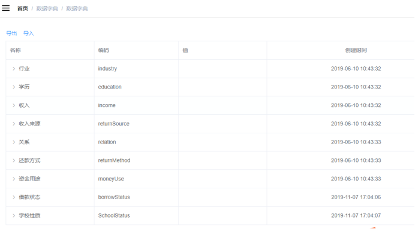
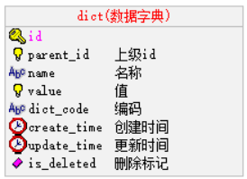
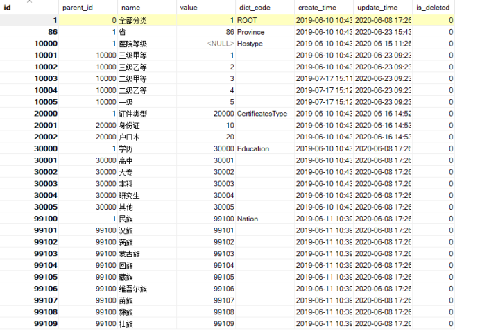
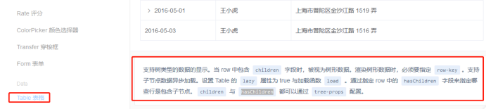

# 数据字典

## 一丶数据字典介绍

何为数据字典？数据字典就是管理系统常用的分类数据或者一些固定数据，例如：省市区三级联动数据、民族数据、行业数据、学历数据等，由于该系统大量使用这种数据，所以我们要做一个数据管理方便管理系统数据，一般系统基本都会做数据管理。


### 1. 页面效果



### 2. 表设计



### 3. 数据分析



`parent_id：`上级id，通过id与parent_id构建上下级关系，例如：我们要获取所有行业数据，那么只需要查询parent_id=20000的数据

`name：`名称，例如：填写用户信息，我们要select标签选择民族，“汉族”就是数据字典的名称

`value：`值，例如：填写用户信息，我们要select标签选择民族，“1”（汉族的标识）就是数据字典的值

`dict_code：`编码，编码是我们自定义的，全局唯一，例如：我们要获取行业数据，我们可以通过parent_id获取，但是parent_id是不确定的，所以我们可以根据编码来获取行业数据

说明：系统中会使用省市区三级联动数据，该数据我们来自“国家统计局”官方数据，地址：http://www.stats.gov.cn/tjsj/tjbz/tjyqhdmhcxhfdm/2019/index.html


### 4. 根据页面效果分析数据接口

数据字典是树形展示，由于数据众多，我们使用“树形数据与懒加载”的方式展现数据列表，其他就是对数据的新增、修改与删除操作，因此需要提供的接口如下：

1，根据上级id获取下级数据（构造树形数据），参考文档：[https://element.eleme.cn/#/zh-CN/component/table](#/zh-CN/component/table)，页面搜索：树形数据与懒加载

2，导入接口

3，导出接口

接下来我们封装服务器端数据接口，接口测试通过后再做页面渲染

## 二丶数据字典开发

### 1. 搭建 service-cmn模块

#### 1.1 搭建service-cmn模块

搭建过程参考service-hosp模块

#### 1.2 修改配置

修改pom.xml

```xml
<?xml version="1.0"encoding="UTF-8"?>
<project xmlns="http://maven.apache.org/POM/4.0.0"xmlns:xsi="http://www.w3.org/2001/XMLSchema-instance"
xsi:schemaLocation="http://maven.apache.org/POM/4.0.0 https://maven.apache.org/xsd/maven-4.0.0.xsd">
<modelVersion>4.0.0</modelVersion>
<parent>
<groupId>com.atguigu.yygh</groupId>
<artifactId>service</artifactId>
<version>1.0</version>
</parent>

<version>1.0</version>
<artifactId>service-cmn</artifactId>
<packaging>jar</packaging>
<name>service-cmn</name>
<description>service-cmn</description>

<dependencies>
</dependencies>

<build>
<finalName>service-cmn</finalName>
<plugins>
<plugin>
<groupId>org.springframework.boot</groupId>
<artifactId>spring-boot-maven-plugin</artifactId>
</plugin>
</plugins>
</build>

</project>
```

添加配置文件application.properties

```properties
# 服务端口
server.port=8202
# 服务名
spring.application.name=service-cmn

# 环境设置：dev、test、prod
spring.profiles.active=dev

# mysql数据库连接
spring.datasource.driver-class-name=com.mysql.jdbc.Driver
spring.datasource.url=jdbc:mysql://192.168.44.165:3306/yygh_cmn?characterEncoding=utf-8&useSSL=false
spring.datasource.username=root
spring.datasource.password=root123

#返回json的全局时间格式
spring.jackson.date-format=yyyy-MM-dd HH:mm:ss
spring.jackson.time-zone=GMT+8
```


#### 1.3 启动类

```java
package com.atguigu.yygh;

@SpringBootApplication
public class ServiceCmnApplication {
public static void main(String[] args) {
      SpringApplication.run(ServiceCmnApplication.class, args);
   }
}
```


### 2. 数据字典列表

根据element组件要求，返回列表数据必须包含hasChildren字典，如图：

`https://element.eleme.cn/#/zh-CN/component/table`



#### 2.1 数据字典列表接口

##### 2.1.1 model模块添加数据字典实体

在model模块查看实体：com.atguigu.yygh.model.cmn.Dict

```java
@Data
@ApiModel(description = "数据字典")
@TableName("dict")
public class Dict extends BaseEntity {

    private static final long serialVersionUID = 1L;

    @ApiModelProperty(value = "上级id")
    @TableField("parent_id")
    private Long parentId;

    @ApiModelProperty(value = "名称")
    @TableField("name")
    private String name;

    @ApiModelProperty(value = "值")
    @TableField("value")
    private String value;

    @ApiModelProperty(value = "编码")
    @TableField("dict_code")
    private String dictCode;

    @ApiModelProperty(value = "是否包含子节点")
    @TableField(exist = false)
    private boolean hasChildren;
}
```

说明：hasChildren为树形组件所需字典，标识为数据库表不存在该字段


##### 2.1.2 添加数据字典mapper

添加com.atguigu.yygh.cmn.mapper.DictMapper

```java
public interface DictMapper extends BaseMapper<Dict> {
}
```


##### 2.1.3 添加数据字典service

1. 添加com.atguigu.yygh.cmn.service.DictService

   ```java
   public interface DictService extends IService<Dict> {
       //根据数据id查询子数据列表
       List<Dict> findChlidData(Long id);
   }
   ```

2. 添加com.atguigu.yygh.cmn.service.impl.DictServiceImpl接口实现

   ```java
   @Service
   public class DictServiceImpl extends ServiceImpl<DictMapper, Dict> implements DictService {
       //根据数据id查询子数据列表
       @Override
       public List<Dict> findChlidData(Long id) {
           QueryWrapper<Dict> wrapper = new QueryWrapper<>();
           wrapper.eq("parent_id",id);
           List<Dict> dictList = baseMapper.selectList(wrapper);
           //向list集合每个dict对象中设置hasChildren
           for (Dict dict:dictList) {
               Long dictId = dict.getId();
               boolean isChild = this.isChildren(dictId);
               dict.setHasChildren(isChild);
           }
           return dictList;
       }
       //判断id下面是否有子节点
       private boolean isChildren(Long id) {
           QueryWrapper<Dict> wrapper = new QueryWrapper<>();
           wrapper.eq("parent_id",id);
           Integer count = baseMapper.selectCount(wrapper);
           // 0>0    1>0
           return count>0;
       }
   }
   ```

   

##### 2.1.4 添加数据字典controller

添加com.atguigu.yygh.cmn.controller.DictController

```java
@Api(description = "数据字典接口")
@RestController
@RequestMapping("/admin/cmn/dict")
public class DictController {

    @Autowired
    private DictService dictService;

    //根据数据id查询子数据列表
    @ApiOperation(value = "根据数据id查询子数据列表")
    @GetMapping("findChildData/{id}")
    public Result findChildData(@PathVariable Long id) {
        List<Dict> list = dictService.findChlidData(id);
        return Result.ok(list);
    }
}
```


#### 2.2 数据字典列表前端

##### 2.2.1 添力路由

在 src/router/index.js 文件添加路由

```javascript
  {
    path: '/cmn',
    component: Layout,
    redirect: '/cmn/list',
    name: '数据管理',
    alwaysShow: true,
    meta: { title: '数据管理', icon: 'example' },
    children: [
      {
        path: 'list',
        name: '数据字典',
        component: () => import('@/views/dict/list'),
        meta: { title: '数据字典', icon: 'table' }
      }
    ]
  },
```

说明：列表与查看都添加了

##### 2.2.2 定义api

创建文件 src/api/cmn/dict.js

```javascript
export default {
  dictList(id) {//数据字典列表
    return request ({
      url: `/admin/cmn/dict/findChildData/${id}`,
      method: 'get'
    })
  }
}
```


##### 2.2.3 方法调用

```html
<script>
import dict from '@/api/dict'
export default {
    data() {
        return {
            list:[] //数据字典列表数组
        }
    },
    created() {
        this.getDictList(1)
    },
    methods: {
        //数据字典列表
        getDictList(id) {
            dict.dictList(id)
                .then(response => {
                    this.list = response.data
                })
        },
        getChildrens(tree, treeNode, resolve) {
            dict.dictList(tree.id).then(response => {
                resolve(response.data)
            })
        }
    }
}
</script>
```


##### 2.2.4 表格渲染

```html
<template>
    <div class="app-container">
        <el-table
        :data="list"
        style="width: 100%"
        row-key="id"
        border
        lazy
        :load="getChildrens"
        :tree-props="{children: 'children', hasChildren: 'hasChildren'}">
            <el-table-column label="名称" width="230" align="left">
            <template slot-scope="scope">
            <span>{{ scope.row.name }}</span>
            </template>
            </el-table-column>

            <el-table-column label="编码" width="220">
            <template slot-scope="{row}">
                    {{ row.dictCode }}
            </template>
            </el-table-column>
            <el-table-column label="值" width="230" align="left">
            <template slot-scope="scope">
            <span>{{ scope.row.value }}</span>
            </template>
            </el-table-column>
            <el-table-column label="创建时间" align="center">
            <template slot-scope="scope">
            <span>{{ scope.row.createTime }}</span>
            </template>
            </el-table-column>
        </el-table>
    </div>
</template>
```


### 3. EasyExcel 介绍

Java解析、生成Excel比较有名的框架有Apache poi、jxl。但他们都存在一个严重的问题就是非常的耗内存，poi有一套SAX模式的API可以一定程度的解决一些内存溢出的问题，但POI还是有一些缺陷，比如07版Excel解压缩以及解压后存储都是在内存中完成的，内存消耗依然很大。easyexcel重写了poi对07版Excel的解析，能够原本一个3M的excel用POI sax依然需要100M左右内存降低到几M，并且再大的excel不会出现内存溢出，03版依赖POI的sax模式。在上层做了模型转换的封装，让使用者更加简单方便。

EasyExcel是一个基于Java的简单、省内存的读写Excel的开源项目。在尽可能节约内存的情况下支持读写百M的Excel。

文档地址：https://alibaba-easyexcel.github.io/index.html

github地址：https://github.com/alibaba/easyexcel

#### 3.1 导出示例

示例链接：https://alibaba-easyexcel.github.io/quickstart/write.html

#### 3.2 导入示例

示例链接：https://alibaba-easyexcel.github.io/quickstart/read.html

#### 3.3 EasyExcel集成

##### 3.3.1 添加依赖

1. 添加依赖

   ```xml
   <dependencies>
       <!-- https://mvnrepository.com/artifact/com.alibaba/easyexcel -->
       <dependency>
           <groupId>com.alibaba</groupId>
           <artifactId>easyexcel</artifactId>
           <version>2.1.1</version>
       </dependency>
   </dependencies>
   ```

   说明：我们已经在yygh-parent中的pom.xml中添加了所有依赖管理

2. 导入导出需要定义对象，对象上需要引用easyexcel标签，所以model模块需要引入，scope：provided 

   ```xml
   <dependency>
   <groupId>com.alibaba</groupId>
   <artifactId>easyexcel</artifactId>
   <scope>provided </scope>
   </dependency>
   ```

3. 导入导出我们会把它封装成工具类，放在common-util中，所有模块公用，所以该模块也得引入

   ```xml
   <dependency>
   <groupId>com.alibaba</groupId>
   <artifactId>easyexcel</artifactId>
   </dependency>
   ```

   


### 4. 数据字典导出

#### 4.1 导出接口封装

##### 4.1.1 在model模块添加导出实体

在model模块查看实体：com.atguigu.yygh.vo.cmn.DictEeVo

```java
package com.atguigu.yygh.vo.cmn;

@Data
public class DictEeVo {

@ExcelProperty(value = "id",index = 0)
private Long id;

@ExcelProperty(value = "上级id",index = 1)
private Long parentId;

@ExcelProperty(value = "名称",index = 2)
private String name;

@ExcelProperty(value = "值",index = 3)
private String value;

@ExcelProperty(value = "编码",index = 4)
private String dictCode;

}
```


##### 4.1.2 在service-cmn模块添加service方法

1. 在DictService类添加接口

   ```java
   /**
    * 导出
    * @param response
   */
   void exportData(HttpServletResponse response);
   ```

2. 在DictServiceImpl类添加接口实现类

   ```java
   @Override
   public void exportData(HttpServletResponse response) {
   try {
         response.setContentType("application/vnd.ms-excel");
         response.setCharacterEncoding("utf-8");
   // 这里URLEncoder.encode可以防止中文乱码 当然和easyexcel没有关系
   String fileName = URLEncoder.encode("数据字典", "UTF-8");
         response.setHeader("Content-disposition", "attachment;filename="+ fileName + ".xlsx");
   
         List<Dict> dictList = dictMapper.selectList(null);
         List<DictEeVo> dictVoList = new ArrayList<>(dictList.size());
   for(Dict dict : dictList) {
            DictEeVo dictVo = new DictEeVo();
            BeanUtils.copyBean(dict, dictVo, DictEeVo.class);
            dictVoList.add(dictVo);
         }
   
         EasyExcel.write(response.getOutputStream(), DictEeVo.class).sheet("数据字典").doWrite(dictVoList);
      } catch (IOException e) {
         e.printStackTrace();
      }
   }
   ```

   说明：直接复制示例代码中的“web中的写”，改造即可

   

##### 4.1.3 在service-cmn模块添加controller方法

在DictController类添加方法

```java
@ApiOperation(value="导出")
@GetMapping(value = "/exportData")
public void exportData(HttpServletResponse response) {
dictService.exportData(response);
}
```


##### 4.1.4 测试

直接通过浏览器导出数据：[http://localhost:8202/admin/cmn/dict/exportData](http://localhost:8201/admin/cmn/dict/exportData)


#### 4.2 导出前端实现

##### 4.2.1 列表页面添加导出按钮

src/views/cmn/dict/list.vue

```html
<div class="el-toolbar">
<div class="el-toolbar-body"style="justify-content: flex-start;">
<el-button type="text"@click="exportData"><i class="fa fa-plus"/> 导出</el-button>
</div>
</div>
```


##### 4.2.2 添加导出方法

```javascript
exportData() {
window.location.href = 'http://localhost:8202/admin/cmn/dict/exportData'
}
```


##### 4.2.3 测试


### 5. 数据字典导入

#### 5.1 导入接口封装

##### 5.1.1 创建回调监听器

```java
public class DictListener extends AnalysisEventListener<DictEeVo> {

    private DictMapper dictMapper;
    public DictListener(DictMapper dictMapper) {
        this.dictMapper = dictMapper;
    }

    //一行一行读取
    @Override
    public void invoke(DictEeVo dictEeVo, AnalysisContext analysisContext) {
        //调用方法添加数据库
        Dict dict = new Dict();
        BeanUtils.copyProperties(dictEeVo,dict);
        dictMapper.insert(dict);
    }
    @Override
    public void doAfterAllAnalysed(AnalysisContext analysisContext) {

    }
}
```


##### 5.1.2 在service-cmn模块添加service方法

```java
//导入数据字典
@Override
public void importDictData(MultipartFile file) {
    try {
        EasyExcel.read(file.getInputStream(),DictEeVo.class,new DictListener(baseMapper)).sheet().doRead();
    } catch (IOException e) {
        e.printStackTrace();
    }
}
```


##### 5.1.3 在service-cmn模块添加controller方法

在DictController类添加方法

```java
@ApiOperation(value = "导入")
@PostMapping("importData")
public Result importData(MultipartFile file) {
 dictService.importData(file);
 return Result.ok();
}
```


#### 5.2 导入前端实现

##### 5.2.1 列表页面添加导入按钮

src/views/cmn/dict/list.vue

```html
<el-button type="text"@click="importData"><i class="fa fa-plus"/> 导入</el-button>
```

说明：按钮位置与导出并列


##### 5.2.2 添加导入弹出层

```java
<el-dialog title="导入":visible.sync="dialogImportVisible"width="480px">
<el-form label-position="right"label-width="170px">

<el-form-item label="文件">
<el-upload
:multiple="false"
:on-success="onUploadSuccess"
:action="'http://localhost:8202/admin/cmn/dict/importData'"
class="upload-demo">
<el-button size="small"type="primary">点击上传</el-button>
<div slot="tip"class="el-upload__tip">只能上传xls文件，且不超过500kb</div>
</el-upload>
</el-form-item>

</el-form>
<div slot="footer"class="dialog-footer">
<el-button @click="dialogImportVisible = false">
      取消
</el-button>
</div>
</el-dialog>
```


##### 5.2.3 添加弹出可见模型

```javascript
// 定义数据
data() {
return {
list: [],
listLoading: true,
dialogImportVisible: false
}
}
```


##### 5.2.4 添加方法

```javascript
importData() {
this.dialogImportVisible = true
},

onUploadSuccess(response, file) {
this.$message.info('上传成功')
this.dialogImportVisible = false
  this.fetchData()
}
```


## 三丶SpringCache+Redis缓存数据

Spring Cache 是一个非常优秀的缓存组件。自Spring 3.1起，提供了类似于@Transactional注解事务的注解Cache支持，且提供了Cache抽象，方便切换各种底层Cache（如：redis）

使用Spring Cache的好处：

1. 提供基本的Cache抽象，方便切换各种底层Cache；
2. 通过注解Cache可以实现类似于事务一样，缓存逻辑透明的应用到我们的业务代码上，且只需要更少的代码就可以完成；
3. 提供事务回滚时也自动回滚缓存；
4. 支持比较复杂的缓存逻辑；

### 1. 项目集成Spring Cache + Redis

#### 1.1 service-util添加依赖

在service-util模块的pom.xml添加依赖

```xml
<!-- redis -->
<dependency>
<groupId>org.springframework.boot</groupId>
<artifactId>spring-boot-starter-data-redis</artifactId>
</dependency>

<!-- spring2.X集成redis所需common-pool2-->
<dependency>
<groupId>org.apache.commons</groupId>
<artifactId>commons-pool2</artifactId>
<version>2.6.0</version>
</dependency>
```


#### 1.2 service-util添加配置类

创建com.atguigu.yygh.common.config.RedisConfig

```java
package com.atguigu.yygh.common.config;

@Configuration
@EnableCaching
public class RedisConfig {

/**
     * 自定义key规则
     * @return
*/
@Bean
public KeyGenerator keyGenerator() {
return new KeyGenerator() {
@Override
public Object generate(Object target, Method method, Object... params) {
                StringBuilder sb = new StringBuilder();
                sb.append(target.getClass().getName());
                sb.append(method.getName());
for (Object obj : params) {
                    sb.append(obj.toString());
                }
return sb.toString();
            }
        };
    }

/**
     * 设置RedisTemplate规则
     * @param redisConnectionFactory
* @return
*/
@Bean
public RedisTemplate<Object, Object> redisTemplate(RedisConnectionFactory redisConnectionFactory) {
        RedisTemplate<Object, Object> redisTemplate = new RedisTemplate<>();
        redisTemplate.setConnectionFactory(redisConnectionFactory);
        Jackson2JsonRedisSerializer jackson2JsonRedisSerializer = new Jackson2JsonRedisSerializer(Object.class);

//解决查询缓存转换异常的问题
ObjectMapper om = new ObjectMapper();
// 指定要序列化的域，field,get和set,以及修饰符范围，ANY是都有包括private和public
om.setVisibility(PropertyAccessor.ALL, JsonAutoDetect.Visibility.ANY);
// 指定序列化输入的类型，类必须是非final修饰的，final修饰的类，比如String,Integer等会跑出异常
om.enableDefaultTyping(ObjectMapper.DefaultTyping.NON_FINAL);
        jackson2JsonRedisSerializer.setObjectMapper(om);

//序列号key value
redisTemplate.setKeySerializer(new StringRedisSerializer());
        redisTemplate.setValueSerializer(jackson2JsonRedisSerializer);
        redisTemplate.setHashKeySerializer(new StringRedisSerializer());
        redisTemplate.setHashValueSerializer(jackson2JsonRedisSerializer);

        redisTemplate.afterPropertiesSet();
return redisTemplate;
    }

/**
     * 设置CacheManager缓存规则
     * @param factory
* @return
*/
@Bean
public CacheManager cacheManager(RedisConnectionFactory factory) {
        RedisSerializer<String> redisSerializer = new StringRedisSerializer();
        Jackson2JsonRedisSerializer jackson2JsonRedisSerializer = new Jackson2JsonRedisSerializer(Object.class);

//解决查询缓存转换异常的问题
ObjectMapper om = new ObjectMapper();
        om.setVisibility(PropertyAccessor.ALL, JsonAutoDetect.Visibility.ANY);
        om.enableDefaultTyping(ObjectMapper.DefaultTyping.NON_FINAL);
        jackson2JsonRedisSerializer.setObjectMapper(om);

// 配置序列化（解决乱码的问题）,过期时间600秒
RedisCacheConfiguration config = RedisCacheConfiguration.defaultCacheConfig()
                .entryTtl(Duration.ofSeconds(600))
                .serializeKeysWith(RedisSerializationContext.SerializationPair.fromSerializer(redisSerializer))
                .serializeValuesWith(RedisSerializationContext.SerializationPair.fromSerializer(jackson2JsonRedisSerializer))
                .disableCachingNullValues();

        RedisCacheManager cacheManager = RedisCacheManager.builder(factory)
                .cacheDefaults(config)
                .build();
return cacheManager;
    }
}
```

说明：

`@EnableCaching`：标记注解 @EnableCaching，开启缓存，并配置Redis缓存管理器。[@EnableCaching](https://docs.spring.io/spring/docs/current/javadoc-api/org/springframework/cache/annotation/EnableCaching.html) 注释触发后置处理器, 检查每一个Spring bean 的 public 方法是否存在缓存注解。如果找到这样的一个注释, 自动创建一个代理拦截方法调用和处理相应的缓存行为。

#### 1.3 service-cmn添加redis配置

```properties
spring.redis.host=192.168.44.165
spring.redis.port=6379
spring.redis.database= 0
spring.redis.timeout=1800000

spring.redis.lettuce.pool.max-active=20
spring.redis.lettuce.pool.max-wait=-1
#最大阻塞等待时间(负数表示没限制)
spring.redis.lettuce.pool.max-idle=5
spring.redis.lettuce.pool.min-idle=0
```


### 2. 使用Spring Cache

#### 2.1 常用缓存标签

##### 2.1.1 缓存@Cacheable

根据方法对其返回结果进行缓存，下次请求时，如果缓存存在，则直接读取缓存数据返回；如果缓存不存在，则执行方法，并把返回的结果存入缓存中。一般用在查询方法上。

查看源码，属性值如下：

| 属性/方法名 | 解释                                             |
| ----------- | ------------------------------------------------ |
| value       | 缓存名，必填，它指定了你的缓存存放在哪块命名空间 |
| cacheNames  | 与 value 差不多，二选一即可                      |
| key         | 可选属性，可以使用 SpEL 标签自定义缓存的key      |

##### 2.1.2 缓存@CachePut

使用该注解标志的方法，每次都会执行，并将结果存入指定的缓存中。其他方法可以直接从响应的缓存中读取缓存数据，而不需要再去查询数据库。一般用在新增方法上。

查看源码，属性值如下：

| 属性/方法名 | 解释                                             |
| ----------- | ------------------------------------------------ |
| value       | 缓存名，必填，它指定了你的缓存存放在哪块命名空间 |
| cacheNames  | 与 value 差不多，二选一即可                      |
| key         | 可选属性，可以使用 SpEL 标签自定义缓存的key      |

##### 2.1.3 缓存@CacheEvict

使用该注解标志的方法，会清空指定的缓存。一般用在更新或者删除方法上

查看源码，属性值如下：

| 属性/方法名      | 解释                                                         |
| ---------------- | ------------------------------------------------------------ |
| value            | 缓存名，必填，它指定了你的缓存存放在哪块命名空间             |
| cacheNames       | 与 value 差不多，二选一即可                                  |
| key              | 可选属性，可以使用 SpEL 标签自定义缓存的key                  |
| allEntries       | 是否清空所有缓存，默认为 false。如果指定为 true，则方法调用后将立即清空所有的缓存 |
| beforeInvocation | 是否在方法执行前就清空，默认为 false。如果指定为 true，则在方法执行前就会清空缓存 |

 

#### 2.2 数据字典应用

改造com.atguigu.yygh.cmn.service.impl.DictServiceImpl类方法

```java
/**
 * 根据上级id获取子节点数据列表
 * @param parentId
*/
@Cacheable(value = "dict",keyGenerator = "keyGenerator")
@Override
public List<Dict> findByParentId(Long parentId) {
       List<Dict> dictList = dictMapper.selectList(new QueryWrapper<Dict>().eq("parent_id", parentId));
       dictList.stream().forEach(dict -> {
boolean isHasChildren = this.isHasChildren(dict.getId());
           dict.setHasChildren(isHasChildren);
       });
return dictList;
}
/**
 * 导入
 * allEntries = true: 方法调用后清空所有缓存
 * @param file
*/
@CacheEvict(value = "dict", allEntries=true)
@Override
public void importData(MultipartFile file) {
   ExcelHelper fileHelper = new ExcelHelper(DictEeVo.class);
   List<DictEeVo> dictVoList = fileHelper.importExcel(file);
if(!CollectionUtils.isEmpty(dictVoList)) {
dictMapper.insertBatch(dictVoList);
   }
}
```

