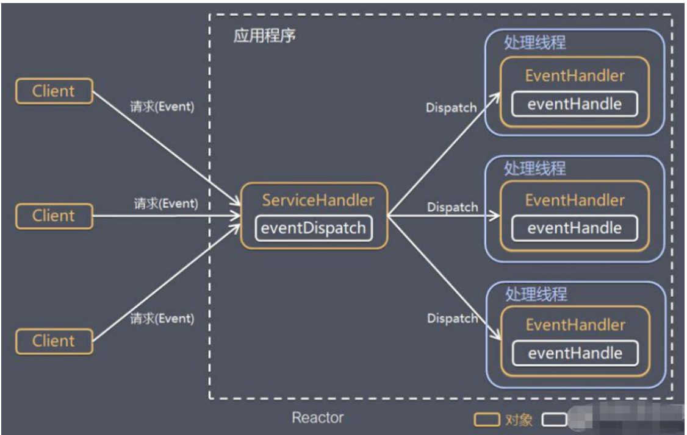
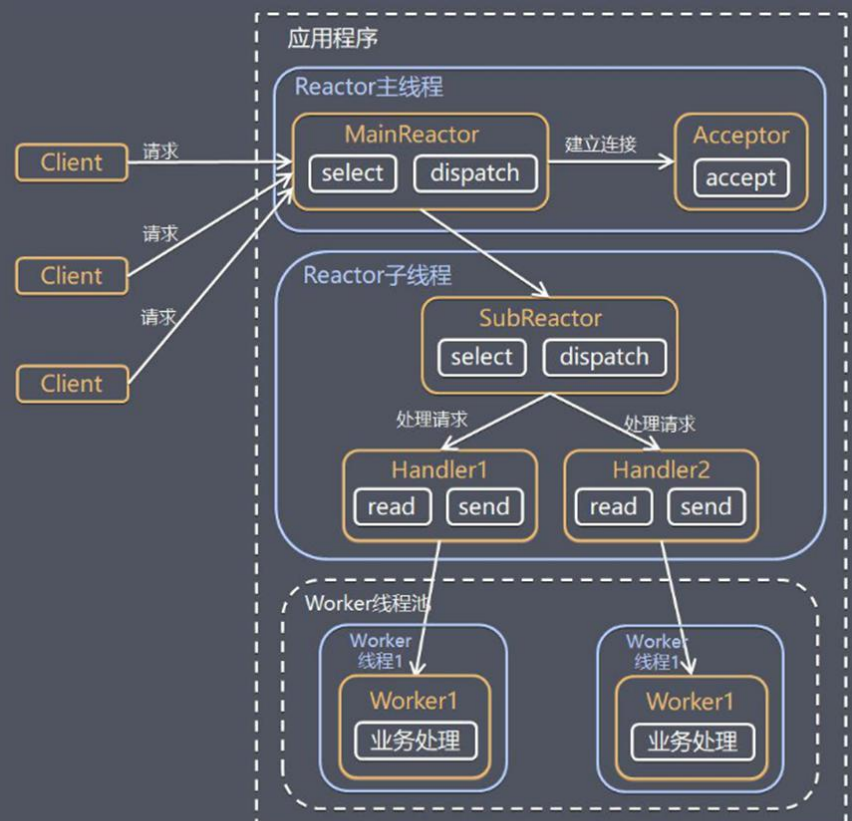
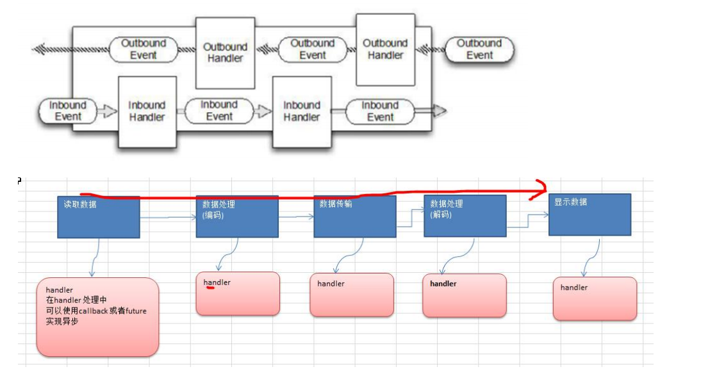
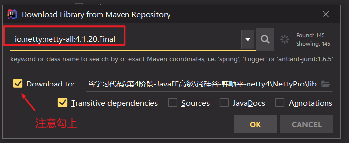

## 第 5 章:  Netty高性能架构设计

### 5.1 线程模型基本介绍


1. 不同的线程模式，对程序的性能有很大影响，为了搞清 Netty 线程模式，我们来系统的讲解下 各个线程模式， 最后看看 Netty 线程模型有什么优越性.
2. 目前存在的线程模型有：
   - 传统阻塞 I/O 服务模型
   - Reactor 模式
3. 根据 Reactor 的数量和处理资源池线程的数量不同，有 3 种典型的实现
   - 单 Reactor 单线程；
   - 单 Reactor 多线程；
   - 主从 Reactor 多线程
4. Netty 线程模式(Netty 主要基于主从 Reactor 多线程模型做了一定的改进，其中主从 Reactor 多线程模型有多 个 Reactor)

### 5.2 传统阻塞 I/O 服务模型

**传统阻塞I/O服务模型工作原理图**

*ps: 黄色的框表示对象， 蓝色的框表示线程,白色的框表示方法(API)*


**模型特点**

1. 采用阻塞 IO 模式获取输入的数据
2. 每个连接都需要独立的线程完成数据的输入，业务处理, 数据返回

**问题分析**

1. 当并发数很大，就会创建大量的线程，占用很大系统资源
2. 连接创建后，如果当前线程暂时没有数据可读，该线程 会阻塞在 read 操作，造成线程资源浪费

### 5.3 Reactor 模式

**针对传统阻塞 I/O 服务模型的 2 个缺点，解决方案：**

1. 基于 I/O 复用模型：多个连接共用一个阻塞对象，应用程序只需要在一个阻塞对象等待，无需阻塞等待所有连接。当某个连接有新的数据可以处理时，操作系统通知应用程序，线程从阻塞状态返回，开始进行业务处理Reactor 对应的叫法: 1.
   反应器模式 2. 分发者模式(Dispatcher) 3. 通知者模式(notifier)
2. 基于线程池复用线程资源：不必再为每个连接创建线程，将连接完成后的业务处理任务分配给线程进行处理,一个线程可以处理多个连接的业务。


**I/O 复用结合线程池，就是 Reactor 模式基本设计思想，如图**



**对上图解读:**

1. Reactor 模式，通过一个或多个输入同时传递给服务处理器的模式(基于事件驱动)
2. 服务器端程序处理传入的多个请求,并将它们同步分派到相应的处理线程， 因此 Reactor 模式也叫 Dispatcher模式
3. Reactor 模式使用 IO 复用监听事件, 收到事件后，分发给某个线程(进程), 这点就是网络服务器高并发处理关键

**Reactor 模式中 核心组成：**

1. Reactor：Reactor 在一个单独的线程中运行，负责监听和分发事件，分发给适当的处理程序来对 IO 事件做出反应。 它就像公司的电话接线员，它接听来自客户的电话并将线路转移到适当的联系人；
2. Handlers：处理程序执行 I/O 事件要完成的实际事件，类似于客户想要与之交谈的公司中的实际官员。Reactor通过调度适当的处理程序来响应 I/O 事件，处理程序执行非阻塞操作。

**Reactor 模式分类：**

*根据 Reactor 的数量和处理资源池线程的数量不同，有 3 种典型的实现*

- 单 Reactor 单线程
- 单 Reactor 多线程
- 主从 Reactor 多线程

#### 5.3.1 单 Reactor 单线程

*原理图，并使用 NIO 群聊系统验证*


**对上图解读**

1. Select 是前面 I/O 复用模型介绍的标准网络编程 API，可以实现应用程序通过一个阻塞对象监听多路连接请求
2. Reactor 对象通过 Select 监控客户端请求事件，收到事件后通过 Dispatch 进行分发
3. 如果是建立连接请求事件，则由 Acceptor 通过 Accept 处理连接请求，然后创建一个 Handler 对象处理连接完成后的后续业务处理
4. 如果不是建立连接事件，则 Reactor 会分发调用连接对应的 Handler 来响应
5. Handler 会完成 Read→业务处理→Send 的完整业务流程

结合实例：服务器端用一个线程通过多路复用搞定所有的 IO 操作（包括连接，读、写等），编码简单，清晰明了,但是如果客户端连接数量较多，将无法支撑，前面的 NIO 案例就属于这种模型。

**单Reactor单线程模型优缺点分析**

优点：模型简单，没有多线程、进程通信、竞争的问题，全部都在一个线程中完成

缺点：性能问题，只有一个线程，无法完全发挥多核 CPU 的性能。Handler 在处理某个连接上的业务时，整个进程无法处理其他连接事件，很容易导致性能瓶颈

缺点：可靠性问题，线程意外终止，或者进入死循环，会导致整个系统通信模块不可用，不能接收和处理外部消息，造成节点故障

使用场景：客户端的数量有限，业务处理非常快速，比如 Redis 在业务处理的时间复杂度 O(1) 的情况

#### 5.3.2 单 Reactor 多线程 🚩

**单Reactor多线程原理图**


**对上图解读**

1. Reactor 对象通过 select 监控客户端请求 事件, 收到事件后，通过 dispatch 进行分发
2. 如果建立连接请求, 则由 Acceptor 通过 accept 处理连接请求, 然后创建一个 Handler 对象处理完成连接后的各种事件
3. 如果不是连接请求，则由 reactor 分发调用连接对应的 handler 来处理
4. handler 只负责响应事件，不做具体的业务处理, 通过 read 读取数据后，会分发给后面的 worker 线程池的某个 线程处理业务
5. worker 线程池会分配独立线程完成真正的业务，并将结果返回给 handler
6. handler 收到响应后，通过 send 将结果返回给 client

**单Reactor多线程优缺点分析：**

优点：可以充分的利用多核 cpu 的处理能力

缺点：多线程数据共享和访问比较复杂， reactor 处理所有的事件的监听和响应，在单线程运行， 在高并发场景容易出现性能瓶颈

#### 5.3.3 主从 Reactor 多线程

**主从Reactor多线程原理图**

针对单 Reactor 多线程模型中，Reactor 在单线程中运行，高并发场景下容易成为性能瓶颈，可以让 Reactor 在多线程中运行



**对上图解读**

1. Reactor 主线程 MainReactor 对象通过 select 监听连接事件, 收到事件后，通过 Acceptor 处理连接事件
2. 当 Acceptor 处理连接事件后，MainReactor 将连接分配给 SubReactor
3. subreactor 将连接加入到连接队列进行监听,并创建 handler 进行各种事件处理
4. 当有新事件发生时， subreactor 就会调用对应的 handler 处理
5. handler 通过 read 读取数据，分发给后面的 worker 线程处理
6. worker 线程池分配独立的 worker 线程进行业务处理，并返回结果
7. handler 收到响应的结果后，再通过 send 将结果返回给 client
8. Reactor 主线程可以对应多个 Reactor 子线程, 即 MainRecator 可以关联多个 SubReactor

**Scalable IO in Java 对 Multiple Reactors 的原理图解：**

**主重Reactor多线程优缺点分析**

优点：父线程与子线程的数据交互简单职责明确，父线程只需要接收新连接，子线程完成后续的业务处理。 优点：父线程与子线程的数据交互简单，Reactor 主线程只需要把新连接传给子线程，子线程无需返回数据。 缺点：编程复杂度较高
结合实例：这种模型在许多项目中广泛使用，包括 Nginx 主从 Reactor 多进程模型，Memcached 主从多线程， Netty 主从多线程模型的支持

### 5.4 Reactor 模式小结

**3种模式用生活案例来理解**

1. 单 Reactor 单线程，前台接待员和服务员是同一个人，全程为顾客服
2. 单 Reactor 多线程，1 个前台接待员，多个服务员，接待员只负责接待
3. 主从 Reactor 多线程，多个前台接待员，多个服务生

**Reactor 模式具有如下的优点：**

1. 响应快，不必为单个同步时间所阻塞，虽然 Reactor 本身依然是同步的
2. 可以最大程度的避免复杂的多线程及同步问题，并且避免了多线程/进程的切换开销
3. 扩展性好，可以方便的通过增加 Reactor 实例个数来充分利用 CPU 资源
4. 复用性好，Reactor 模型本身与具体事件处理逻辑无关，具有很高的复用性

### 5.5 Netty 模型

#### 5.5.1 工作原理示意图 1-简单版

*Netty 主要基于主从 Reactors 多线程模型（如图）做了一定的改进，其中主从 Reactor 多线程模型有多个 Reactor*


**对上图分析**

1. BossGroup 线程维护 Selector , 只关注 Accecpt
2. 当接收到 Accept 事件，获取到对应的 SocketChannel, 封装成 NIOScoketChannel 并注册到 Worker 线程(事件循 环), 并进行维护
3. 当 Worker 线程监听到 selector 中通道发生自己感兴趣的事件后，就进行处理(就由 handler)， 注意 handler 已 经加入到通道

#### 5.5.2 工作原理示意图 2-进阶版


#### 5.5.3 工作原理示意图-详细版


**对上图的分析**

1. Netty 抽象出两组线程池 BossGroup 专门负责接收客户端的连接, WorkerGroup 专门负责网络的读写
2. BossGroup 和 WorkerGroup 类型都是 NioEventLoopGroup
3. NioEventLoopGroup 相当于一个事件循环组, 这个组中含有多个事件循环 ，每一个事件循环是 NioEventLoop
4. NioEventLoop 表示一个不断循环的执行处理任务的线程， 每个 NioEventLoop 都有一个 selector , 用于监听绑 定在其上的 socket 的网络通讯
5. NioEventLoopGroup 可以有多个线程, 即可以含有多个 NioEventLoop
6. 每个 Boss NioEventLoop 循环执行的步骤有 3 步
   - 轮询 accept 事件
   - 处理 accept 事件 , 与 client 建立连接 , 生成 NioScocketChannel , 并将其注册到某个 worker NIOEventLoop 上 的 selector
   - 处理任务队列的任务 ， 即 runAllTasks
7. 每个 Worker NIOEventLoop 循环执行的步骤
   - 轮询 read, write 事件
   - 处理 i/o 事件， 即 read , write 事件，在对应 NioScocketChannel 处理
   - 处理任务队列的任务 ， 即 runAllTasks
8. 每个Worker NIOEventLoop 处理业务时，会使用pipeline(管道), pipeline 中包含了 channel , 即通过pipeline 可以获取到对应通道, 管道中维护了很多的 处理器

#### 5.5.4 Netty 快速入门实例-TCP 服务

```markdown
实例要求：使用 IDEA 创建 Netty 项目
说明: 创建 Maven 项目，并引入 Netty 包*

1. Netty 服务器在 6668 端口监听，客户端能发送消息给服务器 "hello, 服务器~"
2. 服务器可以回复消息给客户端 "hello, 客户端~"
3. 目的：对 Netty 线程模型 有一个初步认识, 便于理解 Netty 模型理论
```

```java
NettyServer.java package com.atguigu.netty.simple;import io.netty.bootstrap.ServerBootstrap; import io.netty.channel.ChannelFuture; import io.netty.channel.ChannelInitializer; import io.netty.channel.ChannelOption; import io.netty.channel.EventLoopGroup; import io.netty.channel.nio.NioEventLoopGroup; import io.netty.channel.socket.SocketChannel; import io.netty.channel.socket.nio.NioServerSocketChannel; import io.netty.channel.socket.nio.NioSocketChannel; public class NettyServer { public static void main(String[] args) throws Exception { //创建 BossGroup 和 WorkerGroup //说明 //1. 创建两个线程组 bossGroup 和 workerGroup //2. bossGroup 只是处理连接请求 , 真正的和客户端业务处理，会交给 workerGroup 完成 //3. 两个都是无限循环 //4. bossGroup 和 workerGroup 含有的子线程(NioEventLoop)的个数 // 默认实际 cpu 核数 * 2 EventLoopGroup bossGroup = new NioEventLoopGroup(1); EventLoopGroup workerGroup = new NioEventLoopGroup(); try {//创建服务器端的启动对象，配置参数 ServerBootstrap bootstrap = new ServerBootstrap(); //使用链式编程来进行设置 bootstrap.group(bossGroup, workerGroup) //设置两个线程组 .channel(NioServerSocketChannel.class) //使用 NioSocketChannel 作为服务器的通道实现 .option(ChannelOption.SO_BACKLOG, 128) // 设置线程队列得到连接个数 .childOption(ChannelOption.SO_KEEPALIVE, true) //设置保持活动连接状态 .childHandler(new ChannelInitializer<SocketChannel>() {//创建一个通道测试对象(匿名对象) //给 pipeline 设置处理器 @Override protected void initChannel(SocketChannel ch) throws Exception { ch.pipeline().addLast(new NettyServerHandler()); } }); // 给我们的 workerGroup 的 EventLoop 对应的管道设置处理器 System.out.println(".....服务器 is ready..."); //绑定一个端口并且同步, 生成了一个 ChannelFuture 对象 //启动服务器(并绑定端口) ChannelFuture cf = bootstrap.bind(6668).sync(); //对关闭通道进行监听 cf.channel().closeFuture().sync(); }finally { bossGroup.shutdownGracefully();workerGroup.shutdownGracefully(); } } }
```

```java
NettyServerHandler.java package com.atguigu.netty.simple; import io.netty.buffer.ByteBuf; import io.netty.buffer.Unpooled; import io.netty.channel.Channel; import io.netty.channel.ChannelHandlerContext; import io.netty.channel.ChannelInboundHandlerAdapter; import io.netty.channel.ChannelPipeline; import io.netty.util.CharsetUtil; /*说明1. 我们自定义一个 Handler 需要继续 netty 规定好的某个 HandlerAdapter(规范) 2. 这时我们自定义一个 Handler , 才能称为一个 handler */ public class NettyServerHandler extends ChannelInboundHandlerAdapter { //读取数据实际(这里我们可以读取客户端发送的消息)/*1. ChannelHandlerContext ctx:上下文对象, 含有 管道 pipeline , 通道 channel, 地址 2. Object msg: 就是客户端发送的数据 默认 Object */ @Override public void channelRead(ChannelHandlerContext ctx, Object msg) throws Exception { System.out.println("服务器读取线程 " + Thread.currentThread().getName()); System.out.println("server ctx =" + ctx); System.out.println("看看 channel 和 pipeline 的关系"); Channel channel = ctx.channel(); ChannelPipeline pipeline = ctx.pipeline(); //本质是一个双向链接, 出站入站 //将 msg 转成一个 ByteBuf //ByteBuf 是 Netty 提供的，不是 NIO 的 ByteBuffer. ByteBuf buf = (ByteBuf) msg; System.out.println("客户端发送消息是:" + buf.toString(CharsetUtil.UTF_8)); System.out.println("客户端地址:" + channel.remoteAddress()); }//数据读取完毕 @Override public void channelReadComplete(ChannelHandlerContext ctx) throws Exception { //writeAndFlush 是 write + flush//将数据写入到缓存，并刷新 //一般讲，我们对这个发送的数据进行编码 ctx.writeAndFlush(Unpooled.copiedBuffer("hello, 客户端~(>^ω^<)喵", CharsetUtil.UTF_8)); }//处理异常, 一般是需要关闭通道 @Override public void exceptionCaught(ChannelHandlerContext ctx, Throwable cause) throws Exception { ctx.close(); } }
```

```java
NettyClient.java package com.atguigu.netty.simple; import io.netty.bootstrap.Bootstrap; import io.netty.channel.ChannelFuture; import io.netty.channel.ChannelInitializer; import io.netty.channel.EventLoopGroup; import io.netty.channel.nio.NioEventLoopGroup; import io.netty.channel.socket.SocketChannel; import io.netty.channel.socket.nio.NioSocketChannel; public class NettyClient { public static void main(String[] args) throws Exception {//客户端需要一个事件循环组 EventLoopGroup group = new NioEventLoopGroup(); try { //创建客户端启动对象 //注意客户端使用的不是 ServerBootstrap 而是 Bootstrap Bootstrap bootstrap = new Bootstrap(); //设置相关参数 bootstrap.group(group) //设置线程组 .channel(NioSocketChannel.class) // 设置客户端通道的实现类(反射) .handler(new ChannelInitializer<SocketChannel>() { @Override protected void initChannel(SocketChannel ch) throws Exception { ch.pipeline().addLast(new NettyClientHandler()); //加入自己的处理器 } }); System.out.println("客户端 ok.."); //启动客户端去连接服务器端 //关于 ChannelFuture 要分析，涉及到 netty 的异步模型 ChannelFuture channelFuture = bootstrap.connect("127.0.0.1", 6668).sync(); //给关闭通道进行监听channelFuture.channel().closeFuture().sync(); }finally { group.shutdownGracefully(); } } }
```

```java
NettyClientHandler.java package com.atguigu.netty.simple; import io.netty.buffer.ByteBuf; import io.netty.buffer.Unpooled; import io.netty.channel.ChannelHandlerContext; import io.netty.channel.ChannelInboundHandlerAdapter; import io.netty.util.CharsetUtil; public class NettyClientHandler extends ChannelInboundHandlerAdapter { //当通道就绪就会触发该方法 @Override public void channelActive(ChannelHandlerContext ctx) throws Exception { System.out.println("client " + ctx); ctx.writeAndFlush(Unpooled.copiedBuffer("hello, server: (>^ω^<)喵", CharsetUtil.UTF_8)); }//当通道有读取事件时，会触发 @Override public void channelRead(ChannelHandlerContext ctx, Object msg) throws Exception { ByteBuf buf = (ByteBuf) msg; System.out.println("服务器回复的消息:" + buf.toString(CharsetUtil.UTF_8)); System.out.println("服务器的地址： "+ ctx.channel().remoteAddress()); }@Override public void exceptionCaught(ChannelHandlerContext ctx, Throwable cause) throws Exception { cause.printStackTrace(); ctx.close(); } }
```

#### 5.5.5 任务队列中的 Task 有 3 种典型使用场景

```markdown
1) 用户程序自定义的普通任务 [举例说明] 
2) 用户自定义定时任务 
3) 非当前 Reactor 线程调用 Channel 的各种方法 
例如在推送系统的业务线程里面，根据用户的标识，找到对应的 Channel 引用，然后调用 Write 类方法向该用户推送消息，就会进入到这种场景。最终的 Write 会提交到任务队列中后被异步消费
```

```java
package com.atguigu.netty.simple; import io.netty.buffer.ByteBuf; import io.netty.buffer.Unpooled; import io.netty.channel.Channel; import io.netty.channel.ChannelHandlerContext; import io.netty.channel.ChannelInboundHandlerAdapter; import io.netty.channel.ChannelPipeline; import io.netty.util.CharsetUtil; import java.util.concurrent.TimeUnit; /*说明1. 我们自定义一个 Handler 需要继续 netty 规定好的某个 HandlerAdapter(规范) 2. 这时我们自定义一个 Handler , 才能称为一个 handler */ public class NettyServerHandler extends ChannelInboundHandlerAdapter { //读取数据实际(这里我们可以读取客户端发送的消息) /*1. ChannelHandlerContext ctx:上下文对象, 含有 管道 pipeline , 通道 channel, 地址 2. Object msg: 就是客户端发送的数据 默认 Object */@Override public void channelRead(ChannelHandlerContext ctx, Object msg) throws Exception { //比如这里我们有一个非常耗时长的业务-> 异步执行 -> 提交该 channel 对应的 //NIOEventLoop 的 taskQueue 中, //解决方案 1 用户程序自定义的普通任务 ctx.channel().eventLoop().execute(new Runnable() { @Override public void run() { try {Thread.sleep(5 * 1000); ctx.writeAndFlush(Unpooled.copiedBuffer("hello, 客户端~(>^ω^<)喵 2", CharsetUtil.UTF_8)); System.out.println("channel code=" + ctx.channel().hashCode()); } catch (Exception ex) { System.out.println("发生异常" + ex.getMessage()); } } }); ctx.channel().eventLoop().execute(new Runnable() { @Override public void run() {try {Thread.sleep(5 * 1000); ctx.writeAndFlush(Unpooled.copiedBuffer("hello, 客户端~(>^ω^<)喵 3", CharsetUtil.UTF_8)); System.out.println("channel code=" + ctx.channel().hashCode()); } catch (Exception ex) { System.out.println("发生异常" + ex.getMessage()); } } }); //解决方案 2 : 用户自定义定时任务 -》 该任务是提交到 scheduledTaskQueue 中 ctx.channel().eventLoop().schedule(new Runnable() { @Override public void run() { try {Thread.sleep(5 * 1000); ctx.writeAndFlush(Unpooled.copiedBuffer("hello, 客户端~(>^ω^<)喵 4", CharsetUtil.UTF_8)); System.out.println("channel code=" + ctx.channel().hashCode()); } catch (Exception ex) { System.out.println("发生异常" + ex.getMessage()); } } }, 5, TimeUnit.SECONDS);System.out.println("go on ..."); // System.out.println("服务器读取线程 " + Thread.currentThread().getName()); // System.out.println("server ctx =" + ctx); // System.out.println("看看 channel 和 pipeline 的关系"); // Channel channel = ctx.channel(); // ChannelPipeline pipeline = ctx.pipeline(); //本质是一个双向链接, 出站入站 ////// //将 msg 转成一个 ByteBuf // //ByteBuf 是 Netty 提供的，不是 NIO 的 ByteBuffer. // ByteBuf buf = (ByteBuf) msg; // System.out.println("客户端发送消息是:" + buf.toString(CharsetUtil.UTF_8)); // System.out.println("客户端地址:" + channel.remoteAddress()); }//数据读取完毕 @Override public void channelReadComplete(ChannelHandlerContext ctx) throws Exception { //writeAndFlush 是 write + flush //将数据写入到缓存，并刷新//一般讲，我们对这个发送的数据进行编码 ctx.writeAndFlush(Unpooled.copiedBuffer("hello, 客户端~(>^ω^<)喵 1", CharsetUtil.UTF_8)); }//处理异常, 一般是需要关闭通道 @Override public void exceptionCaught(ChannelHandlerContext ctx, Throwable cause) throws Exception { ctx.close(); } }
```

#### 5.5.6 方案再说明

1. Netty 抽象出两组线程池，BossGroup 专门负责接收客户端连接，WorkerGroup 专门负责网络读写操作。
2. NioEventLoop 表示一个不断循环执行处理任务的线程，每个 NioEventLoop 都有一个 selector，用于监听绑定 在其上的 socket 网络通道。
3. NioEventLoop 内部采用串行化设计，从消息的读取->解码->处理->编码->发送，始终由 IO 线程 NioEventLoop 负责

NioEventLoopGroup 下包含多个 NioEventLoop

- 每个 NioEventLoop 中包含有一个 Selector，一个 taskQueue
- 每个 NioEventLoop 的 Selector 上可以注册监听多个 NioChannel
- 每个 NioChannel 只会绑定在唯一的 NioEventLoop 上
- 每个 NioChannel 都绑定有一个自己的 ChannelPipeline

### 5.6 异步模型

#### 5.6.1 基本介绍

1. 异步的概念和同步相对。当一个异步过程调用发出后，调用者不能立刻得到结果。实际处理这个调用的组件在 完成后，通过状态、通知和回调来通知调用者。
2. Netty 中的 I/O 操作是异步的，包括 Bind、Write、Connect 等操作会简单的返回一个 ChannelFuture。
3. 调用者并不能立刻获得结果，而是通过 Future-Listener 机制，用户可以方便的主动获取或者通过通知机制获得 IO 操作结果
4. Netty 的异步模型是建立在 future 和 callback 的之上的。callback 就是回调。重点说 Future，它的核心思想 是：假设一个方法 fun，计算过程可能非常耗时，等待 fun 返回显然不合适。那么可以在调用
   fun 的时候，立 马返回一个 Future，后续可以通过 Future 去监控方法 fun 的处理过程(即 ： Future-Listener 机制)

#### 5.6.2 Future 说明

1. 表示**异步的执行结果**, 可以通过它提供的方法来检测执行是否完成，比如检索计算等等
2. ChannelFuture 是一个接口 ： `public interface ChannelFuture extends Future<Void>` 我们可以添**加监听器，当监听的事件发生时，就会通知到监听器**. 案例说明

#### 5.6.3 工作原理示意图



说明:

1. 在使用 Netty 进行编程时，拦截操作和转换出入站数据只需要您提供 callback 或利用 future 即可。这使得链 式操作简单、高效, 并有利于编写可重用的、通用的代码。
2. Netty 框架的目标就是让你的业务逻辑从网络基础应用编码中分离出来、解脱出来

#### 5.6.4 Future-Listener 机制

1. 当 Future 对象刚刚创建时，处于非完成状态，调用者可以通过返回的 ChannelFuture 来获取操作执行的状态， 注册监听函数来执行完成后的操作。
2. 常见有如下操作
   - 通过 isDone 方法来判断当前操作是否完成；
   - 通过 isSuccess 方法来判断已完成的当前操作是否成功；
   - 通过 getCause 方法来获取已完成的当前操作失败的原因；
   - 通过 isCancelled 方法来判断已完成的当前操作是否被取消；
   - 通过 addListener 方法来注册监听器，当操作已完成(isDone 方法返回完成)，将会通知指定的监听器；如果 Future 对象已完成，则通知指定的监听器

```markdown
# 绑定端口是异步操作，当绑定操作处理完，将会调用相应的监听器处理逻辑
```

```java
//绑定一个端口并且同步, 生成了一个 ChannelFuture 对象 //启动服务器(并绑定端口) ChannelFuture cf = bootstrap.bind(6668).sync(); //给 cf 注册监听器，监控我们关心的事件 cf.addListener(new ChannelFutureListener() { @Override public void operationComplete(ChannelFuture future) throws Exception { if (cf.isSuccess()) { System.out.println("监听端口 6668 成功"); } else {System.out.println("监听端口 6668 失败"); } } });
```

### 5.7 快速入门实例-HTTP 服务

**实验要求:**

```markdown
1) 使用 IDEA 创建 Netty 项目 
2) Netty 服务器在 6668 端口监听，浏览器发出请求 "http://localhost:6668/ " 
3) 服务器可以回复消息给客户端 "Hello! 我是服务器 5 " , 并对特定请求资源进行过滤.
4) 目的：Netty 可以做 Http 服务开发，并且理解 Handler 实例和客户端及其请求的关系.
```

**idea引入nettyjar包**

1. ctrl+shift+al+s

   

2. 然后从maven下载netty; 注意第2个图需要勾选上lib

   

   

```java
//TestServer.java 
package com.atguigu.netty.http;
import io.netty.bootstrap.ServerBootstrap;
import io.netty.channel.ChannelFuture;
import io.netty.channel.EventLoopGroup;
import io.netty.channel.nio.NioEventLoopGroup;
import io.netty.channel.socket.nio.NioServerSocketChannel;
public class TestServer {
    public static void main(String[] args) throws Exception {
        EventLoopGroup bossGroup = new NioEventLoopGroup(1);
        EventLoopGroup workerGroup = new NioEventLoopGroup();
        try {
            ServerBootstrap serverBootstrap = new ServerBootstrap();
            serverBootstrap.group(bossGroup, workerGroup)
                           .channel(NioServerSocketChannel.class)
                           .childHandler(new TestServerInitializer());

            ChannelFuture channelFuture = serverBootstrap.bind(6668).sync();
            channelFuture.channel().closeFuture().sync();
        } finally {
            bossGroup.shutdownGracefully();
            workerGroup.shutdownGracefully();
        }
    }
}
```

```java
//TestServerInitializer.java 
package com.atguigu.netty.http; 
import io.netty.channel.ChannelInitializer;
import io.netty.channel.ChannelPipeline;
import io.netty.channel.socket.SocketChannel;
import io.netty.handler.codec.http.HttpServerCodec; 
public class TestServerInitializer extends ChannelInitializer<SocketChannel> {
    @Override 
    protected void initChannel(SocketChannel ch) throws Exception { 
        //向管道加入处理器 
        //得到管道
        ChannelPipeline pipeline = ch.pipeline(); 
        //加入一个 netty 提供的 httpServerCodec codec =>[coder - decoder] //HttpServerCodec 说明 //1. HttpServerCodec 是 netty 提供的处理 http 的 编-解码器 pipeline.addLast("MyHttpServerCodec",new HttpServerCodec()); //2. 增加一个自定义的 handler pipeline.addLast("MyTestHttpServerHandler", new TestHttpServerHandler()); } }
```

```java
//TestHttpServerHandler.java 
package com.atguigu.netty.http; 
import io.netty.buffer.ByteBuf; 
import io.netty.buffer.Unpooled; 
import io.netty.channel.ChannelHandlerContext; 
import io.netty.channel.SimpleChannelInboundHandler;
import io.netty.handler.codec.http.*; 
import io.netty.util.CharsetUtil; 
import java.net.URI; 
/*说明
1. SimpleChannelInboundHandler 是 ChannelInboundHandlerAdapter
2. HttpObject 客户端和服务器端相互通讯的数据被封装成 HttpObject */ 
public class TestHttpServerHandler extends SimpleChannelInboundHandler<HttpObject> { 
    //channelRead0 读取客户端数据 
    @Override protected void channelRead0(ChannelHandlerContext ctx, HttpObject msg) throws Exception { //判断 msg 是不是 httprequest 请求 if(msg instanceof HttpRequest) { System.out.println("pipeline hashcode" + ctx.pipeline().hashCode() + " TestHttpServerHandler hash=" + this.hashCode()); System.out.println("msg 类型=" + msg.getClass()); System.out.println("客户端地址" + ctx.channel().remoteAddress());//获取到 HttpRequest httpRequest = (HttpRequest) msg; //获取 uri, 过滤指定的资源 URI uri = new URI(httpRequest.uri()); if("/favicon.ico".equals(uri.getPath())) { System.out.println("请求了 favicon.ico, 不做响应"); return; }//回复信息给浏览器 [http 协议] ByteBuf content = Unpooled.copiedBuffer("hello, 我是服务器", CharsetUtil.UTF_8); //构造一个 http 的相应，即 httpresponse FullHttpResponse response = new DefaultFullHttpResponse(HttpVersion.HTTP_1_1, HttpResponseStatus.OK, content); response.headers().set(HttpHeaderNames.CONTENT_TYPE, "text/plain"); response.headers().set(HttpHeaderNames.CONTENT_LENGTH, content.readableBytes()); //将构建好 response 返回 ctx.writeAndFlush(response); } }}
```


