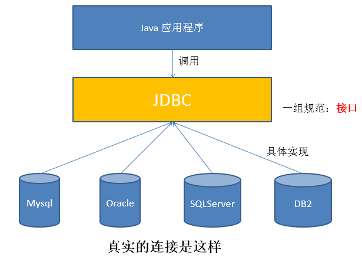
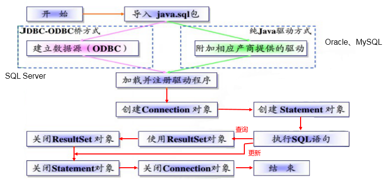
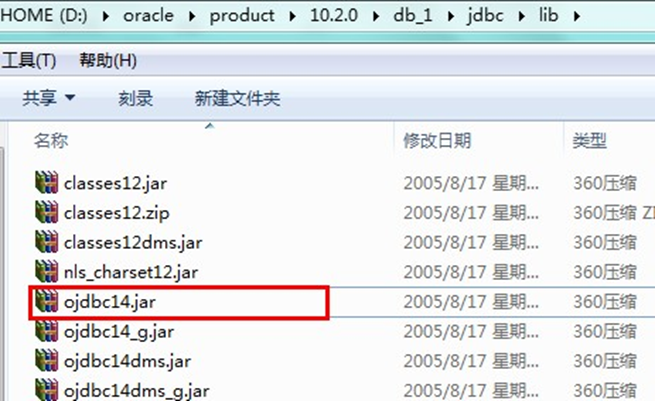
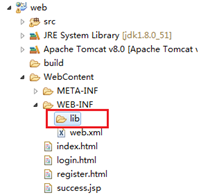
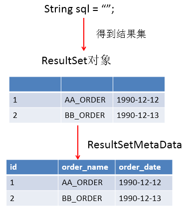
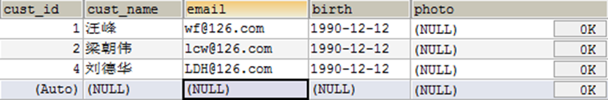
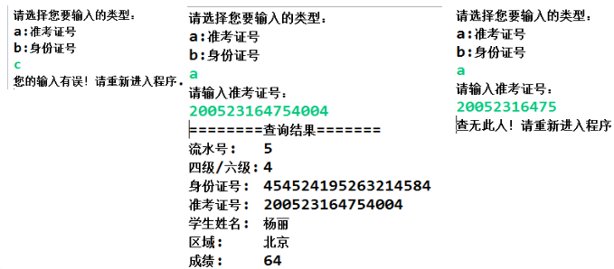
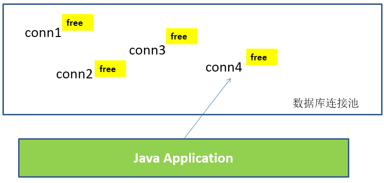

# JDBC核心技术

> 课程名称: [尚硅谷JDBC核心技术(新版jdbc)](https://www.bilibili.com/video/BV1eJ411c7rf)
>
> 课程概述: 
>
> - 本套教程涵盖JDBC的方方面面，包括手动获取数据库连接的多种方式、使用数据库连接池获取连接、Statement与PreparedStatement的对比使用、sql注入问题讲解、Blob字段的操作、高效的批量插入、DAO设计模式、使用dbutils提供的相关工具类等。
> - 此外还对数据库事务进行详解，利用反射及JDBC元数据编写通用的查询方法等企业级开发内容。
>
> 讲述人: 宋红康


## 第1章：JDBC概述 🚩

### 1.1 数据的持久化

- 持久化(persistence)：**把数据保存到可掉电式存储设备中以供之后使用**。大多数情况下，特别是企业级应用，**数据持久化意味着将内存中的数据保存到硬盘**上加以”固化”**，而持久化的实现过程大多通过各种关系数据库来完成**。

- 持久化的主要应用是将内存中的数据存储在关系型数据库中，当然也可以存储在磁盘文件、XML数据文件中。

  

### 1.2 Java中的数据存储技术

- 在Java中，数据库存取技术可分为如下几类：

  - **JDBC**直接访问数据库

  - JDO (Java Data Object )技术

  - **第三方O/R工具**，如Hibernate, Mybatis 等

- JDBC是java访问数据库的基石，JDO、Hibernate、MyBatis等只是更好的封装了JDBC。


### 1.3 JDBC介绍

- JDBC(Java Database Connectivity)是一个**独立于特定数据库管理系统、通用的SQL数据库存取和操作的公共接口**（一组API），定义了用来访问数据库的标准Java类库，（**java.sql,javax.sql**）使用这些类库可以以一种**标准**的方法、方便地访问数据库资源。

- JDBC为访问不同的数据库提供了一种**统一的途径**，为开发者屏蔽了一些细节问题。

- JDBC的目标是使Java程序员使用JDBC可以连接任何**提供了JDBC驱动程序**的数据库系统，这样就使得程序员无需对特定的数据库系统的特点有过多的了解，从而大大简化和加快了开发过程。

  

**如果没有JDBC，那么Java程序访问数据库时是这样的：**


**有了JDBC，Java程序访问数据库时是这样的：**




**总结如下：**


### 1.4 JDBC体系结构

- JDBC接口（API）包括两个层次：
  - **面向应用的API**：Java API，抽象接口，供应用程序开发人员使用（连接数据库，执行SQL语句，获得结果）。
  - **面向数据库的API**：Java Driver API，供开发商开发数据库驱动程序用。

> **JDBC是sun公司提供一套用于数据库操作的接口，java程序员只需要面向这套接口编程即可。**
>
> **不同的数据库厂商，需要针对这套接口，提供不同实现。不同的实现的集合，即为不同数据库的驱动。																————面向接口编程**

### 1.5 JDBC程序编写步骤



> 补充：ODBC(**Open Database Connectivity**，开放式数据库连接)，是微软在Windows平台下推出的。使用者在程序中只需要调用ODBC API，由 ODBC 驱动程序将调用转换成为对特定的数据库的调用请求。

## 第2章：获取数据库连接

### 2.1 要素一：Driver接口实现类

#### 2.1.1 Driver接口介绍

- java.sql.Driver 接口是所有 JDBC 驱动程序需要实现的接口。这个接口是提供给数据库厂商使用的，不同数据库厂商提供不同的实现。

- 在程序中不需要直接去访问实现了 Driver 接口的类，而是由驱动程序管理器类(java.sql.DriverManager)去调用这些Driver实现。
  - Oracle的驱动：**oracle.jdbc.driver.OracleDriver**
  - mySql的驱动： **com.mysql.jdbc.Driver**




将上述jar包拷贝到Java工程的一个目录中，习惯上新建一个lib文件夹。


 

在驱动jar上右键-->Build Path-->Add to Build Path


注意：如果是Dynamic Web Project（动态的web项目）话，则是把驱动jar放到WebContent（有的开发工具叫WebRoot）目录中的WEB-INF目录中的lib目录下即可




#### 2.1.2 加载与注册JDBC驱动

- 加载驱动：加载 JDBC 驱动需调用 Class 类的静态方法 forName()，向其传递要加载的 JDBC 驱动的类名

  - **Class.forName(“com.mysql.jdbc.Driver”);**

- 注册驱动：DriverManager 类是驱动程序管理器类，负责管理驱动程序

  - **使用DriverManager.registerDriver(com.mysql.jdbc.Driver)来注册驱动**

  - 通常不用显式调用 DriverManager 类的 registerDriver() 方法来注册驱动程序类的实例，因为 Driver 接口的驱动程序类**都**包含了静态代码块，在这个静态代码块中，会调用 DriverManager.registerDriver() 方法来注册自身的一个实例。下图是MySQL的Driver实现类的源码：

    

### 2.2 要素二：URL

- JDBC URL 用于标识一个被注册的驱动程序，驱动程序管理器通过这个 URL 选择正确的驱动程序，从而建立到数据库的连接。

- JDBC URL的标准由三部分组成，各部分间用冒号分隔。 

  - **jdbc:子协议:子名称**
  - **协议**：JDBC URL中的协议总是jdbc 
  - **子协议**：子协议用于标识一个数据库驱动程序
  - **子名称**：一种标识数据库的方法。子名称可以依不同的子协议而变化，用子名称的目的是为了**定位数据库**提供足够的信息。包含**主机名**(对应服务端的ip地址)**，端口号，数据库名**

- 举例：

  

- **几种常用数据库的 JDBC URL**

  - MySQL的连接URL编写方式：

    - jdbc:mysql://主机名称:mysql服务端口号/数据库名称?参数=值&参数=值
    - jdbc:mysql://localhost:3306/atguigu
    - jdbc:mysql://localhost:3306/atguigu**?useUnicode=true&characterEncoding=utf8**（如果JDBC程序与服务器端的字符集不一致，会导致乱码，那么可以通过参数指定服务器端的字符集）
    - jdbc:mysql://localhost:3306/atguigu?user=root&password=123456

  - Oracle 9i的连接URL编写方式：

    - jdbc:oracle:thin:@主机名称:oracle服务端口号:数据库名称
    - jdbc:oracle:thin:@localhost:1521:atguigu

  - SQLServer的连接URL编写方式：

    - jdbc:sqlserver://主机名称:sqlserver服务端口号:DatabaseName=数据库名称

    - jdbc:sqlserver://localhost:1433:DatabaseName=atguigu

### 2.3 要素三：用户名和密码

- user,password可以用“属性名=属性值”方式告诉数据库
- 可以调用 DriverManager 类的 getConnection() 方法建立到数据库的连接

### 2.4 数据库连接方式举例

#### 2.4.1 连接方式一

```java
	@Test
    public void testConnection1() {
        try {
            //1.提供java.sql.Driver接口实现类的对象
            Driver driver = null;
            driver = new com.mysql.jdbc.Driver();

            //2.提供url，指明具体操作的数据
            String url = "jdbc:mysql://localhost:3306/test";

            //3.提供Properties的对象，指明用户名和密码
            Properties info = new Properties();
            info.setProperty("user", "root");
            info.setProperty("password", "abc123");

            //4.调用driver的connect()，获取连接
            Connection conn = driver.connect(url, info);
            System.out.println(conn);
        } catch (SQLException e) {
            e.printStackTrace();
        }
    }
```

> 说明：上述代码中显式出现了第三方数据库的API

#### 2.4.2 连接方式二

```java
	@Test
    public void testConnection2() {
        try {
            //1.实例化Driver
            String className = "com.mysql.jdbc.Driver";
            Class clazz = Class.forName(className);
            Driver driver = (Driver) clazz.newInstance();

            //2.提供url，指明具体操作的数据
            String url = "jdbc:mysql://localhost:3306/test";

            //3.提供Properties的对象，指明用户名和密码
            Properties info = new Properties();
            info.setProperty("user", "root");
            info.setProperty("password", "abc123");

            //4.调用driver的connect()，获取连接
            Connection conn = driver.connect(url, info);
            System.out.println(conn);

        } catch (Exception e) {
            e.printStackTrace();
        }
    }
```

> 说明：相较于方式一，这里使用反射实例化Driver，不在代码中体现第三方数据库的API。体现了面向接口编程思想。

#### 2.4.3 连接方式三

```java
	@Test
    public void testConnection3() {
        try {
            //1.数据库连接的4个基本要素：
            String url = "jdbc:mysql://localhost:3306/test";
            String user = "root";
            String password = "abc123";
            String driverName = "com.mysql.jdbc.Driver";

            //2.实例化Driver
            Class clazz = Class.forName(driverName);
            Driver driver = (Driver) clazz.newInstance();
            //3.注册驱动
            DriverManager.registerDriver(driver);
            //4.获取连接
            Connection conn = DriverManager.getConnection(url, user, password);
            System.out.println(conn);
        } catch (Exception e) {
            e.printStackTrace();
        }

    }
```

> 说明：使用DriverManager实现数据库的连接。体会获取连接必要的4个基本要素。

#### 2.4.4 连接方式四

```java
	@Test
    public void testConnection4() {
        try {
            //1.数据库连接的4个基本要素：
            String url = "jdbc:mysql://localhost:3306/test";
            String user = "root";
            String password = "abc123";
            String driverName = "com.mysql.jdbc.Driver";

            //2.加载驱动 （①实例化Driver ②注册驱动）
            Class.forName(driverName);


            //Driver driver = (Driver) clazz.newInstance();
            //3.注册驱动
            //DriverManager.registerDriver(driver);
            /*
            可以注释掉上述代码的原因，是因为在mysql的Driver类中声明有：
            static {
                try {
                    DriverManager.registerDriver(new Driver());
                } catch (SQLException var1) {
                    throw new RuntimeException("Can't register driver!");
                }
            }

             */


            //3.获取连接
            Connection conn = DriverManager.getConnection(url, user, password);
            System.out.println(conn);
        } catch (Exception e) {
            e.printStackTrace();
        }

    }
```

> 说明：不必显式的注册驱动了。因为在DriverManager的源码中已经存在静态代码块，实现了驱动的注册。

#### 2.4.5 连接方式五(最终版)

```java
	@Test
    public  void testConnection5() throws Exception {
    	//1.加载配置文件
        InputStream is = ConnectionTest.class.getClassLoader().getResourceAsStream("jdbc.properties");
        Properties pros = new Properties();
        pros.load(is);
        
        //2.读取配置信息
        String user = pros.getProperty("user");
        String password = pros.getProperty("password");
        String url = pros.getProperty("url");
        String driverClass = pros.getProperty("driverClass");

        //3.加载驱动
        Class.forName(driverClass);

        //4.获取连接
        Connection conn = DriverManager.getConnection(url,user,password);
        System.out.println(conn);

    }
```

其中，配置文件声明在工程的src目录下：【jdbc.properties】

```properties
user=root
password=abc123
url=jdbc:mysql://localhost:3306/test
driverClass=com.mysql.jdbc.Driver
```

> 说明：使用配置文件的方式保存配置信息，在代码中加载配置文件
>
> **使用配置文件的好处：**
>
> ①实现了代码和数据的分离，如果需要修改配置信息，直接在配置文件中修改，不需要深入代码
> ②如果修改了配置信息，省去重新编译的过程。

## 第3章：使用PreparedStatement实现CRUD操作

### 3.1 操作和访问数据库

- 数据库连接被用于向数据库服务器发送命令和 SQL 语句，并接受数据库服务器返回的结果。其实一个数据库连接就是一个Socket连接。

- 在 java.sql 包中有 3 个接口分别定义了对数据库的调用的不同方式：

  - Statement：用于执行静态 SQL 语句并返回它所生成结果的对象。 
  - PrepatedStatement：SQL 语句被预编译并存储在此对象中，可以使用此对象多次高效地执行该语句。
  - CallableStatement：用于执行 SQL 存储过程

  

### 3.2 使用Statement操作数据表的弊端

- 通过调用 Connection 对象的 createStatement() 方法创建该对象。该对象用于执行静态的 SQL 语句，并且返回执行结果。

- Statement 接口中定义了下列方法用于执行 SQL 语句：

  ```sql
  int excuteUpdate(String sql)：执行更新操作INSERT、UPDATE、DELETE
  ResultSet executeQuery(String sql)：执行查询操作SELECT
  ```

- 但是使用Statement操作数据表存在弊端：

  - **问题一：存在拼串操作，繁琐**
  - **问题二：存在SQL注入问题**

- SQL 注入是利用某些系统没有对用户输入的数据进行充分的检查，而在用户输入数据中注入非法的 SQL 语句段或命令(如：SELECT user, password FROM user_table WHERE user='a' OR 1 = ' AND password = ' OR '1' = '1') ，从而利用系统的 SQL 引擎完成恶意行为的做法。

- 对于 Java 而言，要防范 SQL 注入，只要用 PreparedStatement(从Statement扩展而来) 取代 Statement 就可以了。

- 代码演示：

```java
public class StatementTest {

	// 使用Statement的弊端：需要拼写sql语句，并且存在SQL注入的问题
	@Test
	public void testLogin() {
		Scanner scan = new Scanner(System.in);

		System.out.print("用户名：");
		String userName = scan.nextLine();
		System.out.print("密   码：");
		String password = scan.nextLine();

		// SELECT user,password FROM user_table WHERE USER = '1' or ' AND PASSWORD = '='1' or '1' = '1';
		String sql = "SELECT user,password FROM user_table WHERE USER = '" + userName + "' AND PASSWORD = '" + password
				+ "'";
		User user = get(sql, User.class);
		if (user != null) {
			System.out.println("登陆成功!");
		} else {
			System.out.println("用户名或密码错误！");
		}
	}

	// 使用Statement实现对数据表的查询操作
	public <T> T get(String sql, Class<T> clazz) {
		T t = null;

		Connection conn = null;
		Statement st = null;
		ResultSet rs = null;
		try {
			// 1.加载配置文件
			InputStream is = StatementTest.class.getClassLoader().getResourceAsStream("jdbc.properties");
			Properties pros = new Properties();
			pros.load(is);

			// 2.读取配置信息
			String user = pros.getProperty("user");
			String password = pros.getProperty("password");
			String url = pros.getProperty("url");
			String driverClass = pros.getProperty("driverClass");

			// 3.加载驱动
			Class.forName(driverClass);

			// 4.获取连接
			conn = DriverManager.getConnection(url, user, password);

			st = conn.createStatement();

			rs = st.executeQuery(sql);

			// 获取结果集的元数据
			ResultSetMetaData rsmd = rs.getMetaData();

			// 获取结果集的列数
			int columnCount = rsmd.getColumnCount();

			if (rs.next()) {

				t = clazz.newInstance();

				for (int i = 0; i < columnCount; i++) {
					// //1. 获取列的名称
					// String columnName = rsmd.getColumnName(i+1);

					// 1. 获取列的别名
					String columnName = rsmd.getColumnLabel(i + 1);

					// 2. 根据列名获取对应数据表中的数据
					Object columnVal = rs.getObject(columnName);

					// 3. 将数据表中得到的数据，封装进对象
					Field field = clazz.getDeclaredField(columnName);
					field.setAccessible(true);
					field.set(t, columnVal);
				}
				return t;
			}
		} catch (Exception e) {
			e.printStackTrace();
		} finally {
			// 关闭资源
			if (rs != null) {
				try {
					rs.close();
				} catch (SQLException e) {
					e.printStackTrace();
				}
			}
			if (st != null) {
				try {
					st.close();
				} catch (SQLException e) {
					e.printStackTrace();
				}
			}

			if (conn != null) {
				try {
					conn.close();
				} catch (SQLException e) {
					e.printStackTrace();
				}
			}
		}

		return null;
	}
}
```

综上：


### 3.3 PreparedStatement的使用

#### 3.3.1 PreparedStatement介绍

- 可以通过调用 Connection 对象的 **preparedStatement(String sql)** 方法获取 PreparedStatement 对象

- **PreparedStatement 接口是 Statement 的子接口，它表示一条预编译过的 SQL 语句**

- PreparedStatement 对象所代表的 SQL 语句中的参数用问号(?)来表示，调用 PreparedStatement 对象的 setXxx() 方法来设置这些参数. setXxx() 方法有两个参数，第一个参数是要设置的 SQL 语句中的参数的索引(从 1 开始)，第二个是设置的 SQL 语句中的参数的值

#### 3.3.2 PreparedStatement vs Statement

- 代码的可读性和可维护性。

- **PreparedStatement 能最大可能提高性能：**
  - DBServer会对**预编译**语句提供性能优化。因为预编译语句有可能被重复调用，所以<u>语句在被DBServer的编译器编译后的执行代码被缓存下来，那么下次调用时只要是相同的预编译语句就不需要编译，只要将参数直接传入编译过的语句执行代码中就会得到执行。</u>
  - 在statement语句中,即使是相同操作但因为数据内容不一样,所以整个语句本身不能匹配,没有缓存语句的意义.事实是没有数据库会对普通语句编译后的执行代码缓存。这样<u>每执行一次都要对传入的语句编译一次。</u>
  - (语法检查，语义检查，翻译成二进制命令，缓存)

- PreparedStatement 可以防止 SQL 注入 

#### 3.3.3 Java与SQL对应数据类型转换表

| Java类型           | SQL类型                  |
| ------------------ | ------------------------ |
| boolean            | BIT                      |
| byte               | TINYINT                  |
| short              | SMALLINT                 |
| int                | INTEGER                  |
| long               | BIGINT                   |
| String             | CHAR,VARCHAR,LONGVARCHAR |
| byte   array       | BINARY  ,    VAR BINARY  |
| java.sql.Date      | DATE                     |
| java.sql.Time      | TIME                     |
| java.sql.Timestamp | TIMESTAMP                |

#### 3.3.4 使用PreparedStatement实现增、删、改操作

```java
	//通用的增、删、改操作（体现一：增、删、改 ； 体现二：针对于不同的表）
	public void update(String sql,Object ... args){
		Connection conn = null;
		PreparedStatement ps = null;
		try {
			//1.获取数据库的连接
			conn = JDBCUtils.getConnection();
			
			//2.获取PreparedStatement的实例 (或：预编译sql语句)
			ps = conn.prepareStatement(sql);
			//3.填充占位符
			for(int i = 0;i < args.length;i++){
				ps.setObject(i + 1, args[i]);
			}
			
			//4.执行sql语句
			ps.execute();
		} catch (Exception e) {
			
			e.printStackTrace();
		}finally{
			//5.关闭资源
			JDBCUtils.closeResource(conn, ps);
			
		}
	}
```


#### 3.3.5 使用PreparedStatement实现查询操作

```java
	// 通用的针对于不同表的查询:返回一个对象 (version 1.0)
	public <T> T getInstance(Class<T> clazz, String sql, Object... args) {

		Connection conn = null;
		PreparedStatement ps = null;
		ResultSet rs = null;
		try {
			// 1.获取数据库连接
			conn = JDBCUtils.getConnection();

			// 2.预编译sql语句，得到PreparedStatement对象
			ps = conn.prepareStatement(sql);

			// 3.填充占位符
			for (int i = 0; i < args.length; i++) {
				ps.setObject(i + 1, args[i]);
			}

			// 4.执行executeQuery(),得到结果集：ResultSet
			rs = ps.executeQuery();

			// 5.得到结果集的元数据：ResultSetMetaData
			ResultSetMetaData rsmd = rs.getMetaData();

			// 6.1通过ResultSetMetaData得到columnCount,columnLabel；通过ResultSet得到列值
			int columnCount = rsmd.getColumnCount();
			if (rs.next()) {
				T t = clazz.newInstance();
				for (int i = 0; i < columnCount; i++) {// 遍历每一个列

					// 获取列值
					Object columnVal = rs.getObject(i + 1);
					// 获取列的别名:列的别名，使用类的属性名充当
					String columnLabel = rsmd.getColumnLabel(i + 1);
					// 6.2使用反射，给对象的相应属性赋值
					Field field = clazz.getDeclaredField(columnLabel);
					field.setAccessible(true);
					field.set(t, columnVal);

				}

				return t;

			}
		} catch (Exception e) {

			e.printStackTrace();
		} finally {
			// 7.关闭资源
			JDBCUtils.closeResource(conn, ps, rs);
		}

		return null;

	}
```

> 说明：使用PreparedStatement实现的查询操作可以替换Statement实现的查询操作，解决Statement拼串和SQL注入问题。

### 3.4 ResultSet与ResultSetMetaData

#### 3.4.1 ResultSet

- 查询需要调用PreparedStatement 的 executeQuery() 方法，查询结果是一个ResultSet 对象

- ResultSet 对象以逻辑表格的形式封装了执行数据库操作的结果集，ResultSet 接口由数据库厂商提供实现

- ResultSet 返回的实际上就是一张数据表。有一个指针指向数据表的第一条记录的前面。

- ResultSet 对象维护了一个指向当前数据行的**游标**，初始的时候，游标在第一行之前，可以通过 ResultSet 对象的 next() 方法移动到下一行。调用 next()方法检测下一行是否有效。若有效，该方法返回 true，且指针下移。相当于Iterator对象的 hasNext() 和 next() 方法的结合体。

- 当指针指向一行时, 可以通过调用 getXxx(int index) 或 getXxx(int columnName) 获取每一列的值。

  - 例如: getInt(1), getString("name")
  - **注意：Java与数据库交互涉及到的相关Java API中的索引都从1开始。**

- ResultSet 接口的常用方法：

  - boolean next()

  - getString()
  - …

  

#### 3.4.2 ResultSetMetaData

- 可用于获取关于 ResultSet 对象中列的类型和属性信息的对象

- ResultSetMetaData meta = rs.getMetaData();
  - **getColumnName**(int column)：获取指定列的名称
  - **getColumnLabel**(int column)：获取指定列的别名
  - **getColumnCount**()：返回当前 ResultSet 对象中的列数。 

  - getColumnTypeName(int column)：检索指定列的数据库特定的类型名称。 
  - getColumnDisplaySize(int column)：指示指定列的最大标准宽度，以字符为单位。 
  - **isNullable**(int column)：指示指定列中的值是否可以为 null。 

  - isAutoIncrement(int column)：指示是否自动为指定列进行编号，这样这些列仍然是只读的。 



**问题1：得到结果集后, 如何知道该结果集中有哪些列 ？ 列名是什么？**

​     需要使用一个描述 ResultSet 的对象， 即 ResultSetMetaData

**问题2：关于ResultSetMetaData**

1. **如何获取 ResultSetMetaData**： 调用 ResultSet 的 getMetaData() 方法即可
2. **获取 ResultSet 中有多少列**：调用 ResultSetMetaData 的 getColumnCount() 方法
3. **获取 ResultSet 每一列的列的别名是什么**：调用 ResultSetMetaData 的getColumnLabel() 方法


### 3.5 资源的释放

- 释放ResultSet, Statement,Connection。
- 数据库连接（Connection）是非常稀有的资源，用完后必须马上释放，如果Connection不能及时正确的关闭将导致系统宕机。Connection的使用原则是**尽量晚创建，尽量早的释放。**
- 可以在finally中关闭，保证及时其他代码出现异常，资源也一定能被关闭。


### 3.6 JDBC API小结

- 两种思想

  - 面向接口编程的思想

  - ORM思想(object relational mapping)
    - 一个数据表对应一个java类
    - 表中的一条记录对应java类的一个对象
    - 表中的一个字段对应java类的一个属性

  > sql是需要结合列名和表的属性名来写。注意起别名。

- 两种技术

  - JDBC结果集的元数据：ResultSetMetaData
    - 获取列数：getColumnCount()
    - 获取列的别名：getColumnLabel()
  - 通过反射，创建指定类的对象，获取指定的属性并赋值


***

## 章节练习

**练习题1：从控制台向数据库的表customers中插入一条数据，表结构如下：**




**练习题2：创立数据库表 examstudent，表结构如下：**


向数据表中添加如下数据：


**代码实现1：插入一个新的student 信息**

请输入考生的详细信息

Type: 
IDCard:
ExamCard:
StudentName:
Location:
Grade:

信息录入成功!

**代码实现2：在 eclipse中建立 java 程序：输入身份证号或准考证号可以查询到学生的基本信息。结果如下：**



**代码实现3：完成学生信息的删除功能**


***


## 第4章 操作BLOB类型字段

### 4.1 MySQL BLOB类型

- MySQL中，BLOB是一个二进制大型对象，是一个可以存储大量数据的容器，它能容纳不同大小的数据。
- 插入BLOB类型的数据必须使用PreparedStatement，因为BLOB类型的数据无法使用字符串拼接写的。

- MySQL的四种BLOB类型(除了在存储的最大信息量上不同外，他们是等同的)


- 实际使用中根据需要存入的数据大小定义不同的BLOB类型。
- 需要注意的是：如果存储的文件过大，数据库的性能会下降。
- 如果在指定了相关的Blob类型以后，还报错：xxx too large，那么在mysql的安装目录下，找my.ini文件加上如下的配置参数： **max_allowed_packet=16M**。同时注意：修改了my.ini文件之后，需要重新启动mysql服务。

### 4.2 向数据表中插入大数据类型

```java
//获取连接
Connection conn = JDBCUtils.getConnection();
		
String sql = "insert into customers(name,email,birth,photo)values(?,?,?,?)";
PreparedStatement ps = conn.prepareStatement(sql);

// 填充占位符
ps.setString(1, "徐海强");
ps.setString(2, "xhq@126.com");
ps.setDate(3, new Date(new java.util.Date().getTime()));
// 操作Blob类型的变量
FileInputStream fis = new FileInputStream("xhq.png");
ps.setBlob(4, fis);
//执行
ps.execute();
		
fis.close();
JDBCUtils.closeResource(conn, ps);

```


### 4.3 修改数据表中的Blob类型字段

```java
Connection conn = JDBCUtils.getConnection();
String sql = "update customers set photo = ? where id = ?";
PreparedStatement ps = conn.prepareStatement(sql);

// 填充占位符
// 操作Blob类型的变量
FileInputStream fis = new FileInputStream("coffee.png");
ps.setBlob(1, fis);
ps.setInt(2, 25);

ps.execute();

fis.close();
JDBCUtils.closeResource(conn, ps);
```


### 4.4 从数据表中读取大数据类型

```java
String sql = "SELECT id, name, email, birth, photo FROM customer WHERE id = ?";
conn = getConnection();
ps = conn.prepareStatement(sql);
ps.setInt(1, 8);
rs = ps.executeQuery();
if(rs.next()){
	Integer id = rs.getInt(1);
    String name = rs.getString(2);
	String email = rs.getString(3);
    Date birth = rs.getDate(4);
	Customer cust = new Customer(id, name, email, birth);
    System.out.println(cust); 
    //读取Blob类型的字段
	Blob photo = rs.getBlob(5);
	InputStream is = photo.getBinaryStream();
	OutputStream os = new FileOutputStream("c.jpg");
	byte [] buffer = new byte[1024];
	int len = 0;
	while((len = is.read(buffer)) != -1){
		os.write(buffer, 0, len);
	}
    JDBCUtils.closeResource(conn, ps, rs);
		
	if(is != null){
		is.close();
	}
		
	if(os !=  null){
		os.close();
	}
    
}

```


## 第5章 批量插入

### 5.1 批量执行SQL语句

当需要成批插入或者更新记录时，可以采用Java的批量**更新**机制，这一机制允许多条语句一次性提交给数据库批量处理。通常情况下比单独提交处理更有效率

JDBC的批量处理语句包括下面三个方法：

- **addBatch(String)：添加需要批量处理的SQL语句或是参数；**
- **executeBatch()：执行批量处理语句；**
- **clearBatch():清空缓存的数据**

通常我们会遇到两种批量执行SQL语句的情况：

- 多条SQL语句的批量处理；
- 一个SQL语句的批量传参；


### 5.2 高效的批量插入

举例：向数据表中插入20000条数据

- 数据库中提供一个goods表。创建如下：

```sql
CREATE TABLE goods(
id INT PRIMARY KEY AUTO_INCREMENT,
NAME VARCHAR(20)
);
```


#### 5.2.1 实现层次一：使用Statement

```java
Connection conn = JDBCUtils.getConnection();
Statement st = conn.createStatement();
for(int i = 1;i <= 20000;i++){
	String sql = "insert into goods(name) values('name_' + "+ i +")";
	st.executeUpdate(sql);
}
```


#### 5.2.2 实现层次二：使用PreparedStatement

```java
long start = System.currentTimeMillis();
		
Connection conn = JDBCUtils.getConnection();
		
String sql = "insert into goods(name)values(?)";
PreparedStatement ps = conn.prepareStatement(sql);
for(int i = 1;i <= 20000;i++){
	ps.setString(1, "name_" + i);
	ps.executeUpdate();
}
		
long end = System.currentTimeMillis();
System.out.println("花费的时间为：" + (end - start));//82340
		
		
JDBCUtils.closeResource(conn, ps);
```

#### 5.2.3 实现层次三

```java
/*
 * 修改1： 使用 addBatch() / executeBatch() / clearBatch()
 * 修改2：mysql服务器默认是关闭批处理的，我们需要通过一个参数，让mysql开启批处理的支持。
 * 		 ?rewriteBatchedStatements=true 写在配置文件的url后面
 * 修改3：使用更新的mysql 驱动：mysql-connector-java-5.1.37-bin.jar
 * 
 */
@Test
public void testInsert1() throws Exception{
	long start = System.currentTimeMillis();
		
	Connection conn = JDBCUtils.getConnection();
		
	String sql = "insert into goods(name)values(?)";
	PreparedStatement ps = conn.prepareStatement(sql);
		
	for(int i = 1;i <= 1000000;i++){
		ps.setString(1, "name_" + i);
			
		//1.“攒”sql
		ps.addBatch();
		if(i % 500 == 0){
			//2.执行
			ps.executeBatch();
			//3.清空
			ps.clearBatch();
		}
	}
		
	long end = System.currentTimeMillis();
	System.out.println("花费的时间为：" + (end - start));//20000条：625                                                                         //1000000条:14733  
		
	JDBCUtils.closeResource(conn, ps);
}
```

#### 5.2.4 实现层次四

```java
/*
* 层次四：在层次三的基础上操作
* 使用Connection 的 setAutoCommit(false)  /  commit()
*/
@Test
public void testInsert2() throws Exception{
	long start = System.currentTimeMillis();
		
	Connection conn = JDBCUtils.getConnection();
		
	//1.设置为不自动提交数据
	conn.setAutoCommit(false);
		
	String sql = "insert into goods(name)values(?)";
	PreparedStatement ps = conn.prepareStatement(sql);
		
	for(int i = 1;i <= 1000000;i++){
		ps.setString(1, "name_" + i);
			
		//1.“攒”sql
		ps.addBatch();
			
		if(i % 500 == 0){
			//2.执行
			ps.executeBatch();
			//3.清空
			ps.clearBatch();
		}
	}
		
	//2.提交数据
	conn.commit();
		
	long end = System.currentTimeMillis();
	System.out.println("花费的时间为：" + (end - start));//1000000条:4978 
		
	JDBCUtils.closeResource(conn, ps);
}
```


## 第6章： 数据库事务

### 6.1 数据库事务介绍

- **事务：一组逻辑操作单元,使数据从一种状态变换到另一种状态。**

- **事务处理（事务操作）：**保证所有事务都作为一个工作单元来执行，即使出现了故障，都不能改变这种执行方式。当在一个事务中执行多个操作时，要么所有的事务都**被提交(commit)**，那么这些修改就永久地保存下来；要么数据库管理系统将放弃所作的所有修改，整个事务**回滚(rollback)**到最初状态。

- 为确保数据库中数据的**一致性**，数据的操纵应当是离散的成组的逻辑单元：当它全部完成时，数据的一致性可以保持，而当这个单元中的一部分操作失败，整个事务应全部视为错误，所有从起始点以后的操作应全部回退到开始状态。 

### 6.2 JDBC事务处理

- 数据一旦提交，就不可回滚。

- 数据什么时候意味着提交？

  - **当一个连接对象被创建时，默认情况下是自动提交事务**：每次执行一个 SQL 语句时，如果执行成功，就会向数据库自动提交，而不能回滚。
  - **关闭数据库连接，数据就会自动的提交。**如果多个操作，每个操作使用的是自己单独的连接，则无法保证事务。即同一个事务的多个操作必须在同一个连接下。

- **JDBC程序中为了让多个 SQL 语句作为一个事务执行：**

  - 调用 Connection 对象的 **setAutoCommit(false);** 以取消自动提交事务
  - 在所有的 SQL 语句都成功执行后，调用 **commit();** 方法提交事务
  - 在出现异常时，调用 **rollback();** 方法回滚事务

  > 若此时 Connection 没有被关闭，还可能被重复使用，则需要恢复其自动提交状态 setAutoCommit(true)。尤其是在使用数据库连接池技术时，执行close()方法前，建议恢复自动提交状态。

【案例：用户AA向用户BB转账100】

```java
public void testJDBCTransaction() {
	Connection conn = null;
	try {
		// 1.获取数据库连接
		conn = JDBCUtils.getConnection();
		// 2.开启事务
		conn.setAutoCommit(false);
		// 3.进行数据库操作
		String sql1 = "update user_table set balance = balance - 100 where user = ?";
		update(conn, sql1, "AA");

		// 模拟网络异常
		//System.out.println(10 / 0);

		String sql2 = "update user_table set balance = balance + 100 where user = ?";
		update(conn, sql2, "BB");
		// 4.若没有异常，则提交事务
		conn.commit();
	} catch (Exception e) {
		e.printStackTrace();
		// 5.若有异常，则回滚事务
		try {
			conn.rollback();
		} catch (SQLException e1) {
			e1.printStackTrace();
		}
    } finally {
        try {
			//6.恢复每次DML操作的自动提交功能
			conn.setAutoCommit(true);
		} catch (SQLException e) {
			e.printStackTrace();
		}
        //7.关闭连接
		JDBCUtils.closeResource(conn, null, null); 
    }  
}

```

其中，对数据库操作的方法为：

```java
//使用事务以后的通用的增删改操作（version 2.0）
public void update(Connection conn ,String sql, Object... args) {
	PreparedStatement ps = null;
	try {
		// 1.获取PreparedStatement的实例 (或：预编译sql语句)
		ps = conn.prepareStatement(sql);
		// 2.填充占位符
		for (int i = 0; i < args.length; i++) {
			ps.setObject(i + 1, args[i]);
		}
		// 3.执行sql语句
		ps.execute();
	} catch (Exception e) {
		e.printStackTrace();
	} finally {
		// 4.关闭资源
		JDBCUtils.closeResource(null, ps);

	}
}
```


### 6.3 事务的ACID属性    

1. **原子性（Atomicity）**
   原子性是指事务是一个不可分割的工作单位，事务中的操作要么都发生，要么都不发生。 

2. **一致性（Consistency）**
   事务必须使数据库从一个一致性状态变换到另外一个一致性状态。

3. **隔离性（Isolation）**
   事务的隔离性是指一个事务的执行不能被其他事务干扰，即一个事务内部的操作及使用的数据对并发的其他事务是隔离的，并发执行的各个事务之间不能互相干扰。

4. **持久性（Durability）**
   持久性是指一个事务一旦被提交，它对数据库中数据的改变就是永久性的，接下来的其他操作和数据库故障不应该对其有任何影响。

#### 6.3.1 数据库的并发问题

- 对于同时运行的多个事务, 当这些事务访问数据库中相同的数据时, 如果没有采取必要的隔离机制, 就会导致各种并发问题:
  - **脏读**: 对于两个事务 T1, T2, T1 读取了已经被 T2 更新但还**没有被提交**的字段。之后, 若 T2 回滚, T1读取的内容就是临时且无效的。
  - **不可重复读**: 对于两个事务T1, T2, T1 读取了一个字段, 然后 T2 **更新**了该字段。之后, T1再次读取同一个字段, 值就不同了。
  - **幻读**: 对于两个事务T1, T2, T1 从一个表中读取了一个字段, 然后 T2 在该表中**插入**了一些新的行。之后, 如果 T1 再次读取同一个表, 就会多出几行。

- **数据库事务的隔离性**: 数据库系统必须具有隔离并发运行各个事务的能力, 使它们不会相互影响, 避免各种并发问题。

- 一个事务与其他事务隔离的程度称为隔离级别。数据库规定了多种事务隔离级别, 不同隔离级别对应不同的干扰程度, **隔离级别越高, 数据一致性就越好, 但并发性越弱。**

#### 6.3.2 四种隔离级别

- 数据库提供的4种事务隔离级别：

  

- Oracle 支持的 2 种事务隔离级别：**READ COMMITED**, SERIALIZABLE。 Oracle 默认的事务隔离级别为: **READ COMMITED** 。


- Mysql 支持 4 种事务隔离级别。Mysql 默认的事务隔离级别为: **REPEATABLE READ。**


#### 6.3.3 在MySql中设置隔离级别

- 每启动一个 mysql 程序, 就会获得一个单独的数据库连接. 每个数据库连接都有一个全局变量 @@tx_isolation, 表示当前的事务隔离级别。

- 查看当前的隔离级别: 

  ```mysql
  SELECT @@tx_isolation;
  ```

- 设置当前 mySQL 连接的隔离级别:  

  ```mysql
  set  transaction isolation level read committed;
  ```

- 设置数据库系统的全局的隔离级别:

  ```mysql
  set global transaction isolation level read committed;
  ```

- 补充操作：

  - 创建mysql数据库用户：

    ```mysql
    create user tom identified by 'abc123';
    ```

  - 授予权限

    ```mysql
    #授予通过网络方式登录的tom用户，对所有库所有表的全部权限，密码设为abc123.
    grant all privileges on *.* to tom@'%'  identified by 'abc123'; 
    
     #给tom用户使用本地命令行方式，授予atguigudb这个库下的所有表的插删改查的权限。
    grant select,insert,delete,update on atguigudb.* to tom@localhost identified by 'abc123'; 
    
    ```

    

## 第7章：DAO及相关实现类

- DAO：Data Access Object访问数据信息的类和接口，包括了对数据的CRUD（Create、Retrival、Update、Delete），而不包含任何业务相关的信息。有时也称作：BaseDAO
- 作用：为了实现功能的模块化，更有利于代码的维护和升级。
- 下面是尚硅谷JavaWeb阶段书城项目中DAO使用的体现：


- 层次结构：


### 【BaseDAO.java】

```java
package com.atguigu.bookstore.dao;

import java.lang.reflect.ParameterizedType;
import java.lang.reflect.Type;
import java.sql.Connection;
import java.sql.SQLException;
import java.util.List;

import org.apache.commons.dbutils.QueryRunner;
import org.apache.commons.dbutils.handlers.BeanHandler;
import org.apache.commons.dbutils.handlers.BeanListHandler;
import org.apache.commons.dbutils.handlers.ScalarHandler;


/**
 * 定义一个用来被继承的对数据库进行基本操作的Dao
 * 
 * @author HanYanBing
 *
 * @param <T>
 */
public abstract class BaseDao<T> {
	private QueryRunner queryRunner = new QueryRunner();
	// 定义一个变量来接收泛型的类型
	private Class<T> type;

	// 获取T的Class对象，获取泛型的类型，泛型是在被子类继承时才确定
	public BaseDao() {
		// 获取子类的类型
		Class clazz = this.getClass();
		// 获取父类的类型
		// getGenericSuperclass()用来获取当前类的父类的类型
		// ParameterizedType表示的是带泛型的类型
		ParameterizedType parameterizedType = (ParameterizedType) clazz.getGenericSuperclass();
		// 获取具体的泛型类型 getActualTypeArguments获取具体的泛型的类型
		// 这个方法会返回一个Type的数组
		Type[] types = parameterizedType.getActualTypeArguments();
		// 获取具体的泛型的类型·
		this.type = (Class<T>) types[0];
	}

	/**
	 * 通用的增删改操作
	 * 
	 * @param sql
	 * @param params
	 * @return
	 */
	public int update(Connection conn,String sql, Object... params) {
		int count = 0;
		try {
			count = queryRunner.update(conn, sql, params);
		} catch (SQLException e) {
			e.printStackTrace();
		} 
		return count;
	}

	/**
	 * 获取一个对象
	 * 
	 * @param sql
	 * @param params
	 * @return
	 */
	public T getBean(Connection conn,String sql, Object... params) {
		T t = null;
		try {
			t = queryRunner.query(conn, sql, new BeanHandler<T>(type), params);
		} catch (SQLException e) {
			e.printStackTrace();
		} 
		return t;
	}

	/**
	 * 获取所有对象
	 * 
	 * @param sql
	 * @param params
	 * @return
	 */
	public List<T> getBeanList(Connection conn,String sql, Object... params) {
		List<T> list = null;
		try {
			list = queryRunner.query(conn, sql, new BeanListHandler<T>(type), params);
		} catch (SQLException e) {
			e.printStackTrace();
		} 
		return list;
	}

	/**
	 * 获取一个但一值得方法，专门用来执行像 select count(*)...这样的sql语句
	 * 
	 * @param sql
	 * @param params
	 * @return
	 */
	public Object getValue(Connection conn,String sql, Object... params) {
		Object count = null;
		try {
			// 调用queryRunner的query方法获取一个单一的值
			count = queryRunner.query(conn, sql, new ScalarHandler<>(), params);
		} catch (SQLException e) {
			e.printStackTrace();
		} 
		return count;
	}
}
```

### 【BookDAO.java】

```java
package com.atguigu.bookstore.dao;

import java.sql.Connection;
import java.util.List;

import com.atguigu.bookstore.beans.Book;
import com.atguigu.bookstore.beans.Page;

public interface BookDao {

	/**
	 * 从数据库中查询出所有的记录
	 * 
	 * @return
	 */
	List<Book> getBooks(Connection conn);

	/**
	 * 向数据库中插入一条记录
	 * 
	 * @param book
	 */
	void saveBook(Connection conn,Book book);

	/**
	 * 从数据库中根据图书的id删除一条记录
	 * 
	 * @param bookId
	 */
	void deleteBookById(Connection conn,String bookId);

	/**
	 * 根据图书的id从数据库中查询出一条记录
	 * 
	 * @param bookId
	 * @return
	 */
	Book getBookById(Connection conn,String bookId);

	/**
	 * 根据图书的id从数据库中更新一条记录
	 * 
	 * @param book
	 */
	void updateBook(Connection conn,Book book);

	/**
	 * 获取带分页的图书信息
	 * 
	 * @param page：是只包含了用户输入的pageNo属性的page对象
	 * @return 返回的Page对象是包含了所有属性的Page对象
	 */
	Page<Book> getPageBooks(Connection conn,Page<Book> page);

	/**
	 * 获取带分页和价格范围的图书信息
	 * 
	 * @param page：是只包含了用户输入的pageNo属性的page对象
	 * @return 返回的Page对象是包含了所有属性的Page对象
	 */
	Page<Book> getPageBooksByPrice(Connection conn,Page<Book> page, double minPrice, double maxPrice);

}
```

### 【UserDAO.java】

```java
package com.atguigu.bookstore.dao;

import java.sql.Connection;

import com.atguigu.bookstore.beans.User;

public interface UserDao {

	/**
	 * 根据User对象中的用户名和密码从数据库中获取一条记录
	 * 
	 * @param user
	 * @return User 数据库中有记录 null 数据库中无此记录
	 */
	User getUser(Connection conn,User user);

	/**
	 * 根据User对象中的用户名从数据库中获取一条记录
	 * 
	 * @param user
	 * @return true 数据库中有记录 false 数据库中无此记录
	 */
	boolean checkUsername(Connection conn,User user);

	/**
	 * 向数据库中插入User对象
	 * 
	 * @param user
	 */
	void saveUser(Connection conn,User user);
}
```

### 【BookDaoImpl.java】

```java
package com.atguigu.bookstore.dao.impl;

import java.sql.Connection;
import java.util.List;

import com.atguigu.bookstore.beans.Book;
import com.atguigu.bookstore.beans.Page;
import com.atguigu.bookstore.dao.BaseDao;
import com.atguigu.bookstore.dao.BookDao;

public class BookDaoImpl extends BaseDao<Book> implements BookDao {

	@Override
	public List<Book> getBooks(Connection conn) {
		// 调用BaseDao中得到一个List的方法
		List<Book> beanList = null;
		// 写sql语句
		String sql = "select id,title,author,price,sales,stock,img_path imgPath from books";
		beanList = getBeanList(conn,sql);
		return beanList;
	}

	@Override
	public void saveBook(Connection conn,Book book) {
		// 写sql语句
		String sql = "insert into books(title,author,price,sales,stock,img_path) values(?,?,?,?,?,?)";
		// 调用BaseDao中通用的增删改的方法
		update(conn,sql, book.getTitle(), book.getAuthor(), book.getPrice(), book.getSales(), book.getStock(),book.getImgPath());
	}

	@Override
	public void deleteBookById(Connection conn,String bookId) {
		// 写sql语句
		String sql = "DELETE FROM books WHERE id = ?";
		// 调用BaseDao中通用增删改的方法
		update(conn,sql, bookId);
			
	}

	@Override
	public Book getBookById(Connection conn,String bookId) {
		// 调用BaseDao中获取一个对象的方法
		Book book = null;
		// 写sql语句
		String sql = "select id,title,author,price,sales,stock,img_path imgPath from books where id = ?";
		book = getBean(conn,sql, bookId);
		return book;
	}

	@Override
	public void updateBook(Connection conn,Book book) {
		// 写sql语句
		String sql = "update books set title = ? , author = ? , price = ? , sales = ? , stock = ? where id = ?";
		// 调用BaseDao中通用的增删改的方法
		update(conn,sql, book.getTitle(), book.getAuthor(), book.getPrice(), book.getSales(), book.getStock(), book.getId());
	}

	@Override
	public Page<Book> getPageBooks(Connection conn,Page<Book> page) {
		// 获取数据库中图书的总记录数
		String sql = "select count(*) from books";
		// 调用BaseDao中获取一个单一值的方法
		long totalRecord = (long) getValue(conn,sql);
		// 将总记录数设置都page对象中
		page.setTotalRecord((int) totalRecord);

		// 获取当前页中的记录存放的List
		String sql2 = "select id,title,author,price,sales,stock,img_path imgPath from books limit ?,?";
		// 调用BaseDao中获取一个集合的方法
		List<Book> beanList = getBeanList(conn,sql2, (page.getPageNo() - 1) * Page.PAGE_SIZE, Page.PAGE_SIZE);
		// 将这个List设置到page对象中
		page.setList(beanList);
		return page;
	}

	@Override
	public Page<Book> getPageBooksByPrice(Connection conn,Page<Book> page, double minPrice, double maxPrice) {
		// 获取数据库中图书的总记录数
		String sql = "select count(*) from books where price between ? and ?";
		// 调用BaseDao中获取一个单一值的方法
		long totalRecord = (long) getValue(conn,sql,minPrice,maxPrice);
		// 将总记录数设置都page对象中
		page.setTotalRecord((int) totalRecord);

		// 获取当前页中的记录存放的List
		String sql2 = "select id,title,author,price,sales,stock,img_path imgPath from books where price between ? and ? limit ?,?";
		// 调用BaseDao中获取一个集合的方法
		List<Book> beanList = getBeanList(conn,sql2, minPrice , maxPrice , (page.getPageNo() - 1) * Page.PAGE_SIZE, Page.PAGE_SIZE);
		// 将这个List设置到page对象中
		page.setList(beanList);
		
		return page;
	}

}
```

### 【UserDaoImpl.java】

```java
package com.atguigu.bookstore.dao.impl;

import java.sql.Connection;

import com.atguigu.bookstore.beans.User;
import com.atguigu.bookstore.dao.BaseDao;
import com.atguigu.bookstore.dao.UserDao;

public class UserDaoImpl extends BaseDao<User> implements UserDao {

	@Override
	public User getUser(Connection conn,User user) {
		// 调用BaseDao中获取一个对象的方法
		User bean = null;
		// 写sql语句
		String sql = "select id,username,password,email from users where username = ? and password = ?";
		bean = getBean(conn,sql, user.getUsername(), user.getPassword());
		return bean;
	}

	@Override
	public boolean checkUsername(Connection conn,User user) {
		// 调用BaseDao中获取一个对象的方法
		User bean = null;
		// 写sql语句
		String sql = "select id,username,password,email from users where username = ?";
		bean = getBean(conn,sql, user.getUsername());
		return bean != null;
	}

	@Override
	public void saveUser(Connection conn,User user) {
		//写sql语句
		String sql = "insert into users(username,password,email) values(?,?,?)";
		//调用BaseDao中通用的增删改的方法
		update(conn,sql, user.getUsername(),user.getPassword(),user.getEmail());
	}

}
```

### 【Book.java】

```java
package com.atguigu.bookstore.beans;
/**
 * 图书类
 * @author songhongkang
 *
 */
public class Book {

	private Integer id;
	private String title; // 书名
	private String author; // 作者
	private double price; // 价格
	private Integer sales; // 销量
	private Integer stock; // 库存
	private String imgPath = "static/img/default.jpg"; // 封面图片的路径
	//构造器，get()，set()，toString()方法略
}
```

### 【Page.java】

```java
package com.atguigu.bookstore.beans;

import java.util.List;
/**
 * 页码类
 * @author songhongkang
 *
 */
public class Page<T> {

	private List<T> list; // 每页查到的记录存放的集合
	public static final int PAGE_SIZE = 4; // 每页显示的记录数
	private int pageNo; // 当前页
//	private int totalPageNo; // 总页数，通过计算得到
	private int totalRecord; // 总记录数，通过查询数据库得到

```

### 【User.java】

```java
package com.atguigu.bookstore.beans;
/**
 * 用户类
 * @author songhongkang
 *
 */
public class User {

	private Integer id;
	private String username;
	private String password;
	private String email;

```


## 第8章：数据库连接池

### 8.1 JDBC数据库连接池的必要性

- 在使用开发基于数据库的web程序时，传统的模式基本是按以下步骤：　　
  - **在主程序（如servlet、beans）中建立数据库连接**
  - **进行sql操作**
  - **断开数据库连接**

- 这种模式开发，存在的问题:
  - 普通的JDBC数据库连接使用 DriverManager 来获取，每次向数据库建立连接的时候都要将 Connection 加载到内存中，再验证用户名和密码(得花费0.05s～1s的时间)。需要数据库连接的时候，就向数据库要求一个，执行完成后再断开连接。这样的方式将会消耗大量的资源和时间。**数据库的连接资源并没有得到很好的重复利用。**若同时有几百人甚至几千人在线，频繁的进行数据库连接操作将占用很多的系统资源，严重的甚至会造成服务器的崩溃。
  - **对于每一次数据库连接，使用完后都得断开。**否则，如果程序出现异常而未能关闭，将会导致数据库系统中的内存泄漏，最终将导致重启数据库。（回忆：何为Java的内存泄漏？）
  - **这种开发不能控制被创建的连接对象数**，系统资源会被毫无顾及的分配出去，如连接过多，也可能导致内存泄漏，服务器崩溃。 

### 8.2 数据库连接池技术

- 为解决传统开发中的数据库连接问题，可以采用数据库连接池技术。
- **数据库连接池的基本思想**：就是为数据库连接建立一个“缓冲池”。预先在缓冲池中放入一定数量的连接，当需要建立数据库连接时，只需从“缓冲池”中取出一个，使用完毕之后再放回去。

- **数据库连接池**负责分配、管理和释放数据库连接，它**允许应用程序重复使用一个现有的数据库连接，而不是重新建立一个**。
- 数据库连接池在初始化时将创建一定数量的数据库连接放到连接池中，这些数据库连接的数量是由**最小数据库连接数来设定**的。无论这些数据库连接是否被使用，连接池都将一直保证至少拥有这么多的连接数量。连接池的**最大数据库连接数量**限定了这个连接池能占有的最大连接数，当应用程序向连接池请求的连接数超过最大连接数量时，这些请求将被加入到等待队列中。



- **工作原理：**


- **数据库连接池技术的优点**

  **1. 资源重用**

  由于数据库连接得以重用，避免了频繁创建，释放连接引起的大量性能开销。在减少系统消耗的基础上，另一方面也增加了系统运行环境的平稳性。

  **2. 更快的系统反应速度**

  数据库连接池在初始化过程中，往往已经创建了若干数据库连接置于连接池中备用。此时连接的初始化工作均已完成。对于业务请求处理而言，直接利用现有可用连接，避免了数据库连接初始化和释放过程的时间开销，从而减少了系统的响应时间

  **3. 新的资源分配手段**

  对于多应用共享同一数据库的系统而言，可在应用层通过数据库连接池的配置，实现某一应用最大可用数据库连接数的限制，避免某一应用独占所有的数据库资源

  **4. 统一的连接管理，避免数据库连接泄漏**

  在较为完善的数据库连接池实现中，可根据预先的占用超时设定，强制回收被占用连接，从而避免了常规数据库连接操作中可能出现的资源泄露


### 8.3 多种开源的数据库连接池

- JDBC 的数据库连接池使用 javax.sql.DataSource 来表示，DataSource 只是一个接口，该接口通常由服务器(Weblogic, WebSphere, Tomcat)提供实现，也有一些开源组织提供实现：
  - **DBCP** 是Apache提供的数据库连接池。tomcat 服务器自带dbcp数据库连接池。**速度相对c3p0较快**，但因自身存在BUG，Hibernate3已不再提供支持。
  - **C3P0** 是一个开源组织提供的一个数据库连接池，**速度相对较慢，稳定性还可以。**hibernate官方推荐使用
  - **Proxool** 是sourceforge下的一个开源项目数据库连接池，有监控连接池状态的功能，**稳定性较c3p0差一点**
  - **BoneCP** 是一个开源组织提供的数据库连接池，速度快
  - **Druid** 是阿里提供的数据库连接池，据说是集DBCP 、C3P0 、Proxool 优点于一身的数据库连接池，但是速度不确定是否有BoneCP快
- DataSource 通常被称为数据源，它包含连接池和连接池管理两个部分，习惯上也经常把 DataSource 称为连接池
- **DataSource用来取代DriverManager来获取Connection，获取速度快，同时可以大幅度提高数据库访问速度。**
- 特别注意：
  - 数据源和数据库连接不同，数据源无需创建多个，它是产生数据库连接的工厂，因此**整个应用只需要一个数据源即可。**
  - 当数据库访问结束后，程序还是像以前一样关闭数据库连接：conn.close(); 但conn.close()并没有关闭数据库的物理连接，它仅仅把数据库连接释放，归还给了数据库连接池。

#### 8.3.1 C3P0数据库连接池

- 获取连接方式一

```java
//使用C3P0数据库连接池的方式，获取数据库的连接：不推荐
public static Connection getConnection1() throws Exception{
	ComboPooledDataSource cpds = new ComboPooledDataSource();
	cpds.setDriverClass("com.mysql.jdbc.Driver"); 
	cpds.setJdbcUrl("jdbc:mysql://localhost:3306/test");
	cpds.setUser("root");
	cpds.setPassword("abc123");
		
//	cpds.setMaxPoolSize(100);
	
	Connection conn = cpds.getConnection();
	return conn;
}
```


- 获取连接方式二

```java
//使用C3P0数据库连接池的配置文件方式，获取数据库的连接：推荐
private static DataSource cpds = new ComboPooledDataSource("helloc3p0");
public static Connection getConnection2() throws SQLException{
	Connection conn = cpds.getConnection();
	return conn;
}
```

其中，src下的配置文件为：【c3p0-config.xml】

```xml
<?xml version="1.0" encoding="UTF-8"?>
<c3p0-config>
	<named-config name="helloc3p0">
		<!-- 获取连接的4个基本信息 -->
		<property name="user">root</property>
		<property name="password">abc123</property>
		<property name="jdbcUrl">jdbc:mysql:///test</property>
		<property name="driverClass">com.mysql.jdbc.Driver</property>
		
		<!-- 涉及到数据库连接池的管理的相关属性的设置 -->
		<!-- 若数据库中连接数不足时, 一次向数据库服务器申请多少个连接 -->
		<property name="acquireIncrement">5</property>
		<!-- 初始化数据库连接池时连接的数量 -->
		<property name="initialPoolSize">5</property>
		<!-- 数据库连接池中的最小的数据库连接数 -->
		<property name="minPoolSize">5</property>
		<!-- 数据库连接池中的最大的数据库连接数 -->
		<property name="maxPoolSize">10</property>
		<!-- C3P0 数据库连接池可以维护的 Statement 的个数 -->
		<property name="maxStatements">20</property>
		<!-- 每个连接同时可以使用的 Statement 对象的个数 -->
		<property name="maxStatementsPerConnection">5</property>

	</named-config>
</c3p0-config>
```


#### 8.3.2 DBCP数据库连接池

- DBCP 是 Apache 软件基金组织下的开源连接池实现，该连接池依赖该组织下的另一个开源系统：Common-pool。如需使用该连接池实现，应在系统中增加如下两个 jar 文件：
  - Commons-dbcp.jar：连接池的实现
  - Commons-pool.jar：连接池实现的依赖库
- **Tomcat 的连接池正是采用该连接池来实现的。**该数据库连接池既可以与应用服务器整合使用，也可由应用程序独立使用。
- 数据源和数据库连接不同，数据源无需创建多个，它是产生数据库连接的工厂，因此整个应用只需要一个数据源即可。
- 当数据库访问结束后，程序还是像以前一样关闭数据库连接：conn.close(); 但上面的代码并没有关闭数据库的物理连接，它仅仅把数据库连接释放，归还给了数据库连接池。
- 配置属性说明

| 属性                       | 默认值 | 说明                                                         |
| -------------------------- | ------ | ------------------------------------------------------------ |
| initialSize                | 0      | 连接池启动时创建的初始化连接数量                             |
| maxActive                  | 8      | 连接池中可同时连接的最大的连接数                             |
| maxIdle                    | 8      | 连接池中最大的空闲的连接数，超过的空闲连接将被释放，如果设置为负数表示不限制 |
| minIdle                    | 0      | 连接池中最小的空闲的连接数，低于这个数量会被创建新的连接。该参数越接近maxIdle，性能越好，因为连接的创建和销毁，都是需要消耗资源的；但是不能太大。 |
| maxWait                    | 无限制 | 最大等待时间，当没有可用连接时，连接池等待连接释放的最大时间，超过该时间限制会抛出异常，如果设置-1表示无限等待 |
| poolPreparedStatements     | false  | 开启池的Statement是否prepared                                |
| maxOpenPreparedStatements  | 无限制 | 开启池的prepared 后的同时最大连接数                          |
| minEvictableIdleTimeMillis |        | 连接池中连接，在时间段内一直空闲， 被逐出连接池的时间        |
| removeAbandonedTimeout     | 300    | 超过时间限制，回收没有用(废弃)的连接                         |
| removeAbandoned            | false  | 超过removeAbandonedTimeout时间后，是否进 行没用连接（废弃）的回收 |


- 获取连接方式一：

```java
public static Connection getConnection3() throws Exception {
	BasicDataSource source = new BasicDataSource();
		
	source.setDriverClassName("com.mysql.jdbc.Driver");
	source.setUrl("jdbc:mysql:///test");
	source.setUsername("root");
	source.setPassword("abc123");
		
	//
	source.setInitialSize(10);
		
	Connection conn = source.getConnection();
	return conn;
}
```

- 获取连接方式二：

```java
//使用dbcp数据库连接池的配置文件方式，获取数据库的连接：推荐
private static DataSource source = null;
static{
	try {
		Properties pros = new Properties();
		
		InputStream is = DBCPTest.class.getClassLoader().getResourceAsStream("dbcp.properties");
			
		pros.load(is);
		//根据提供的BasicDataSourceFactory创建对应的DataSource对象
		source = BasicDataSourceFactory.createDataSource(pros);
	} catch (Exception e) {
		e.printStackTrace();
	}
		
}
public static Connection getConnection4() throws Exception {
		
	Connection conn = source.getConnection();
	
	return conn;
}
```

其中，src下的配置文件为：【dbcp.properties】

```properties
driverClassName=com.mysql.jdbc.Driver
url=jdbc:mysql://localhost:3306/test?rewriteBatchedStatements=true&useServerPrepStmts=false
username=root
password=abc123

initialSize=10
#...
```


#### 8.3.3 Druid（德鲁伊）数据库连接池

Druid是阿里巴巴开源平台上一个数据库连接池实现，它结合了C3P0、DBCP、Proxool等DB池的优点，同时加入了日志监控，可以很好的监控DB池连接和SQL的执行情况，可以说是针对监控而生的DB连接池，**可以说是目前最好的连接池之一。**

```java
package com.atguigu.druid;

import java.sql.Connection;
import java.util.Properties;

import javax.sql.DataSource;

import com.alibaba.druid.pool.DruidDataSourceFactory;

public class TestDruid {
	public static void main(String[] args) throws Exception {
		Properties pro = new Properties();		 pro.load(TestDruid.class.getClassLoader().getResourceAsStream("druid.properties"));
		DataSource ds = DruidDataSourceFactory.createDataSource(pro);
		Connection conn = ds.getConnection();
		System.out.println(conn);
	}
}

```

其中，src下的配置文件为：【druid.properties】

```java
url=jdbc:mysql://localhost:3306/test?rewriteBatchedStatements=true
username=root
password=123456
driverClassName=com.mysql.jdbc.Driver

initialSize=10
maxActive=20
maxWait=1000
filters=wall
```

- 详细配置参数：

| **配置**                      | **缺省** | **说明**                                                     |
| ----------------------------- | -------- | ------------------------------------------------------------ |
| name                          |          | 配置这个属性的意义在于，如果存在多个数据源，监控的时候可以通过名字来区分开来。   如果没有配置，将会生成一个名字，格式是：”DataSource-” +   System.identityHashCode(this) |
| url                           |          | 连接数据库的url，不同数据库不一样。例如：mysql :   jdbc:mysql://10.20.153.104:3306/druid2      oracle :   jdbc:oracle:thin:@10.20.149.85:1521:ocnauto |
| username                      |          | 连接数据库的用户名                                           |
| password                      |          | 连接数据库的密码。如果你不希望密码直接写在配置文件中，可以使用ConfigFilter。详细看这里：<https://github.com/alibaba/druid/wiki/%E4%BD%BF%E7%94%A8ConfigFilter> |
| driverClassName               |          | 根据url自动识别   这一项可配可不配，如果不配置druid会根据url自动识别dbType，然后选择相应的driverClassName(建议配置下) |
| initialSize                   | 0        | 初始化时建立物理连接的个数。初始化发生在显示调用init方法，或者第一次getConnection时 |
| maxActive                     | 8        | 最大连接池数量                                               |
| maxIdle                       | 8        | 已经不再使用，配置了也没效果                                 |
| minIdle                       |          | 最小连接池数量                                               |
| maxWait                       |          | 获取连接时最大等待时间，单位毫秒。配置了maxWait之后，缺省启用公平锁，并发效率会有所下降，如果需要可以通过配置useUnfairLock属性为true使用非公平锁。 |
| poolPreparedStatements        | false    | 是否缓存preparedStatement，也就是PSCache。PSCache对支持游标的数据库性能提升巨大，比如说oracle。在mysql下建议关闭。 |
| maxOpenPreparedStatements     | -1       | 要启用PSCache，必须配置大于0，当大于0时，poolPreparedStatements自动触发修改为true。在Druid中，不会存在Oracle下PSCache占用内存过多的问题，可以把这个数值配置大一些，比如说100 |
| validationQuery               |          | 用来检测连接是否有效的sql，要求是一个查询语句。如果validationQuery为null，testOnBorrow、testOnReturn、testWhileIdle都不会其作用。 |
| testOnBorrow                  | true     | 申请连接时执行validationQuery检测连接是否有效，做了这个配置会降低性能。 |
| testOnReturn                  | false    | 归还连接时执行validationQuery检测连接是否有效，做了这个配置会降低性能 |
| testWhileIdle                 | false    | 建议配置为true，不影响性能，并且保证安全性。申请连接的时候检测，如果空闲时间大于timeBetweenEvictionRunsMillis，执行validationQuery检测连接是否有效。 |
| timeBetweenEvictionRunsMillis |          | 有两个含义： 1)Destroy线程会检测连接的间隔时间2)testWhileIdle的判断依据，详细看testWhileIdle属性的说明 |
| numTestsPerEvictionRun        |          | 不再使用，一个DruidDataSource只支持一个EvictionRun           |
| minEvictableIdleTimeMillis    |          |                                                              |
| connectionInitSqls            |          | 物理连接初始化的时候执行的sql                                |
| exceptionSorter               |          | 根据dbType自动识别   当数据库抛出一些不可恢复的异常时，抛弃连接 |
| filters                       |          | 属性类型是字符串，通过别名的方式配置扩展插件，常用的插件有：   监控统计用的filter:stat日志用的filter:log4j防御sql注入的filter:wall |
| proxyFilters                  |          | 类型是List，如果同时配置了filters和proxyFilters，是组合关系，并非替换关系 |


## 第9章：Apache-DBUtils实现CRUD操作

### 9.1 Apache-DBUtils简介

- commons-dbutils 是 Apache 组织提供的一个开源 JDBC工具类库，它是对JDBC的简单封装，学习成本极低，并且使用dbutils能极大简化jdbc编码的工作量，同时也不会影响程序的性能。

- API介绍：
  - org.apache.commons.dbutils.QueryRunner
  - org.apache.commons.dbutils.ResultSetHandler
  - 工具类：org.apache.commons.dbutils.DbUtils   
- API包说明：


### 9.2 主要API的使用

#### 9.2.1 DbUtils

- DbUtils ：提供如关闭连接、装载JDBC驱动程序等常规工作的工具类，里面的所有方法都是静态的。主要方法如下：
  - **public static void close(…) throws java.sql.SQLException**：　DbUtils类提供了三个重载的关闭方法。这些方法检查所提供的参数是不是NULL，如果不是的话，它们就关闭Connection、Statement和ResultSet。
  - public static void closeQuietly(…): 这一类方法不仅能在Connection、Statement和ResultSet为NULL情况下避免关闭，还能隐藏一些在程序中抛出的SQLEeception。
  - public static void commitAndClose(Connection conn)throws SQLException： 用来提交连接的事务，然后关闭连接
  - public static void commitAndCloseQuietly(Connection conn)： 用来提交连接，然后关闭连接，并且在关闭连接时不抛出SQL异常。 
  - public static void rollback(Connection conn)throws SQLException：允许conn为null，因为方法内部做了判断
  - public static void rollbackAndClose(Connection conn)throws SQLException
  - rollbackAndCloseQuietly(Connection)
  - public static boolean loadDriver(java.lang.String driverClassName)：这一方装载并注册JDBC驱动程序，如果成功就返回true。使用该方法，你不需要捕捉这个异常ClassNotFoundException。

#### 9.2.2 QueryRunner类

- **该类简单化了SQL查询，它与ResultSetHandler组合在一起使用可以完成大部分的数据库操作，能够大大减少编码量。**

- QueryRunner类提供了两个构造器：
  - 默认的构造器
  - 需要一个 javax.sql.DataSource 来作参数的构造器

- QueryRunner类的主要方法：
  - **更新**
    - public int update(Connection conn, String sql, Object... params) throws SQLException:用来执行一个更新（插入、更新或删除）操作。
    - ......
  - **插入**
    - public <T> T insert(Connection conn,String sql,ResultSetHandler<T> rsh, Object... params) throws SQLException：只支持INSERT语句，其中 rsh - The handler used to create the result object from the ResultSet of auto-generated keys.  返回值: An object generated by the handler.即自动生成的键值
    - ....
  - **批处理**
    - public int[] batch(Connection conn,String sql,Object[][] params)throws SQLException： INSERT, UPDATE, or DELETE语句
    - public <T> T insertBatch(Connection conn,String sql,ResultSetHandler<T> rsh,Object[][] params)throws SQLException：只支持INSERT语句
    - .....
  - **查询**
    - public Object query(Connection conn, String sql, ResultSetHandler rsh,Object... params) throws SQLException：执行一个查询操作，在这个查询中，对象数组中的每个元素值被用来作为查询语句的置换参数。该方法会自行处理 PreparedStatement 和 ResultSet 的创建和关闭。
    - ...... 

- 测试

```java
// 测试添加
@Test
public void testInsert() throws Exception {
	QueryRunner runner = new QueryRunner();
	Connection conn = JDBCUtils.getConnection3();
	String sql = "insert into customers(name,email,birth)values(?,?,?)";
	int count = runner.update(conn, sql, "何成飞", "he@qq.com", "1992-09-08");

	System.out.println("添加了" + count + "条记录");
		
	JDBCUtils.closeResource(conn, null);

}
```

```java
// 测试删除
@Test
public void testDelete() throws Exception {
	QueryRunner runner = new QueryRunner();
	Connection conn = JDBCUtils.getConnection3();
	String sql = "delete from customers where id < ?";
	int count = runner.update(conn, sql,3);

	System.out.println("删除了" + count + "条记录");
		
	JDBCUtils.closeResource(conn, null);

}
```


#### 9.2.3 ResultSetHandler接口及实现类

- 该接口用于处理 java.sql.ResultSet，将数据按要求转换为另一种形式。

- ResultSetHandler 接口提供了一个单独的方法：Object handle (java.sql.ResultSet .rs)。

- 接口的主要实现类：

  - ArrayHandler：把结果集中的第一行数据转成对象数组。

  - ArrayListHandler：把结果集中的每一行数据都转成一个数组，再存放到List中。

  - **BeanHandler：**将结果集中的第一行数据封装到一个对应的JavaBean实例中。

  - **BeanListHandler：**将结果集中的每一行数据都封装到一个对应的JavaBean实例中，存放到List里。

  - ColumnListHandler：将结果集中某一列的数据存放到List中。

  - KeyedHandler(name)：将结果集中的每一行数据都封装到一个Map里，再把这些map再存到一个map里，其key为指定的key。

  - **MapHandler：**将结果集中的第一行数据封装到一个Map里，key是列名，value就是对应的值。

  - **MapListHandler：**将结果集中的每一行数据都封装到一个Map里，然后再存放到List

  - **ScalarHandler：**查询单个值对象

    

- 测试

```java
/*
 * 测试查询:查询一条记录
 * 
 * 使用ResultSetHandler的实现类：BeanHandler
 */
@Test
public void testQueryInstance() throws Exception{
	QueryRunner runner = new QueryRunner();

	Connection conn = JDBCUtils.getConnection3();
		
	String sql = "select id,name,email,birth from customers where id = ?";
		
	//
	BeanHandler<Customer> handler = new BeanHandler<>(Customer.class);
	Customer customer = runner.query(conn, sql, handler, 23);
	System.out.println(customer);	
	JDBCUtils.closeResource(conn, null);
}
```

```java
/*
 * 测试查询:查询多条记录构成的集合
 * 
 * 使用ResultSetHandler的实现类：BeanListHandler
 */
@Test
public void testQueryList() throws Exception{
	QueryRunner runner = new QueryRunner();

	Connection conn = JDBCUtils.getConnection3();
		
	String sql = "select id,name,email,birth from customers where id < ?";
		
	//
	BeanListHandler<Customer> handler = new BeanListHandler<>(Customer.class);
	List<Customer> list = runner.query(conn, sql, handler, 23);
	list.forEach(System.out::println);
		
	JDBCUtils.closeResource(conn, null);
}
```

```java
/*
 * 自定义ResultSetHandler的实现类
 */
@Test
public void testQueryInstance1() throws Exception{
	QueryRunner runner = new QueryRunner();

	Connection conn = JDBCUtils.getConnection3();
		
	String sql = "select id,name,email,birth from customers where id = ?";
		
	ResultSetHandler<Customer> handler = new ResultSetHandler<Customer>() {

		@Override
		public Customer handle(ResultSet rs) throws SQLException {
			System.out.println("handle");
//			return new Customer(1,"Tom","tom@126.com",new Date(123323432L));
				
			if(rs.next()){
				int id = rs.getInt("id");
				String name = rs.getString("name");
				String email = rs.getString("email");
				Date birth = rs.getDate("birth");
					
				return new Customer(id, name, email, birth);
			}
			return null;
				
		}
	};
		
	Customer customer = runner.query(conn, sql, handler, 23);
		
	System.out.println(customer);
		
	JDBCUtils.closeResource(conn, null);
}
```

```java
/*
 * 如何查询类似于最大的，最小的，平均的，总和，个数相关的数据，
 * 使用ScalarHandler
 * 
 */
@Test
public void testQueryValue() throws Exception{
	QueryRunner runner = new QueryRunner();

	Connection conn = JDBCUtils.getConnection3();
		
	//测试一：
//	String sql = "select count(*) from customers where id < ?";
//	ScalarHandler handler = new ScalarHandler();
//	long count = (long) runner.query(conn, sql, handler, 20);
//	System.out.println(count);
		
	//测试二：
	String sql = "select max(birth) from customers";
	ScalarHandler handler = new ScalarHandler();
	Date birth = (Date) runner.query(conn, sql, handler);
	System.out.println(birth);
		
	JDBCUtils.closeResource(conn, null);
}
```

## JDBC总结

```java
//总结
@Test
public void testUpdateWithTx() {
		
	Connection conn = null;
	try {
		//1.获取连接的操作（
		//① 手写的连接：JDBCUtils.getConnection();
		//② 使用数据库连接池：C3P0;DBCP;Druid
		//2.对数据表进行一系列CRUD操作
		//① 使用PreparedStatement实现通用的增删改、查询操作（version 1.0 \ version 2.0)
//version2.0的增删改public void update(Connection conn,String sql,Object ... args){}
//version2.0的查询 public <T> T getInstance(Connection conn,Class<T> clazz,String sql,Object ... args){}
		//② 使用dbutils提供的jar包中提供的QueryRunner类
			
		//提交数据
		conn.commit();
			
	
	} catch (Exception e) {
		e.printStackTrace();
			
			
		try {
			//回滚数据
			conn.rollback();
		} catch (SQLException e1) {
			e1.printStackTrace();
		}
			
	}finally{
		//3.关闭连接等操作
		//① JDBCUtils.closeResource();
		//② 使用dbutils提供的jar包中提供的DbUtils类提供了关闭的相关操作
			
	}
}
```

