# Java基础编程

> 课程名称: 尚硅谷_Java零基础教程-java入门必备-适合初学者的全套完整版教程(宋红康主讲)
>
> 课程概述: 
>
> - 适合零基础学员： 从Java语言起源开始，循序渐进，知识点剖析细致且每章配备大量随堂练习 
> - 课程内容推陈出新： 基于JDK 11，将Java8、Java9、Java10、Java11新特性一网打尽 课程中，Eclipse和IDEA都使用到
> - 技术讲解更深入、更全面： 课程共30天，715个小节，涉及主流Java方方面面 内容涵盖数据结构、设计模式、JVM内存结构等深度技术 
> - 代码量更大、案例更丰富、更贴近实战
>
> 课程地址: https://www.bilibili.com/video/BV1Kb411W75N
>
> 讲述人 :  宋红康

*JavaSE知识图*


## 第 1 章: Java语言概述

```
##  软件开发介绍

##  计算机编程语言介绍

##  Java语言概述

##  运行机制及运行过程

##  Java的环境搭建

##  开发体验-HelloWorld

##  常见问题及解决方案

##  注释

##  JavaAPI文档

##  良好的编程风格

##  常用的Java开发工具
```


---
## 第 2 章: 基本语法

```
##  关键字和保留字

##  标识符

##  变量

##  运算符

##  程序流程控制
```


---
## 第 3 章: 数组

```
##  数组的概述

##  一维数组的使用

##  多维数组的使用

##  数组中涉及到的常见算法

##  Arrays工具类的使用

##  数组使用中的常见异常
```


---
## 第 4 章: 面向对象(上)

```
## 面向过程与面向对象

## Java基本元素: 类和对象

## 对象的创建和使用

## 类的成员之一: 属性

## 类的成员之二: 方法

## 再谈方法

## OOP特征一: 封装与隐藏

## 类的成员之三: 构造器

## 关键字: this

## 关键字: package、import
```


---
## 第 5 章: 面向对象(中)

```
##  OOP特征二: 继承性

##  方法的重写: override

##  四种访问权限修饰符

##  关键字: super

##  子类对象实例化过程

##  OOP特征三: 多态性

##  Object类的使用

##  包装类的使用


```


---
## 第 6 章: 面向对象(下)

```
##  关键字: static

##  理解main方法的语法

##  类的成员之四: 代码块

##  关键字: final

##  抽象类与抽象方法

##  接口interface

##  类的成员之五: 内部类
```


---
## 第 7 章: 异常处理

```
## 异常概述与异常体系结构

## 常见异常

## 异常处理机制一: try-catch-finally

## 异常处理机制二: throws

## 手动抛出异常: throw

## 用户自定义异常类
```


---
# Java高级编程

## 第 8 章: 多线程 🚩

### 8.1 基本概念

#### 8.1.1 程序、进程、线程

**程序(program)** 是为完成特定任务、用某种计算机语言编写的一组指令的集合。通常指的是一段静态的代码，静态对象。

**进程(process)** 是程序的一次执行过程，或是正在运行的一个程序,当程序运行起来后,就表示一个进程。进程是一个动态的过程有它自身的产生、存在和消亡的过程。——生命周期

- 例如运行中的QQ程序，运行中的MP3播放器都表示进程

  

- 程序是静态的，进程是动态的

- 进程作为资源分配的单位，系统在运行时会为每个进程分配不同的内存区域

**线程(thread)** ，进程可进一步细化为线程，线程是一个程序内部的一条执行路径.

- 若一个进程同一时间并行执行多个线程，就是支持多线程的

  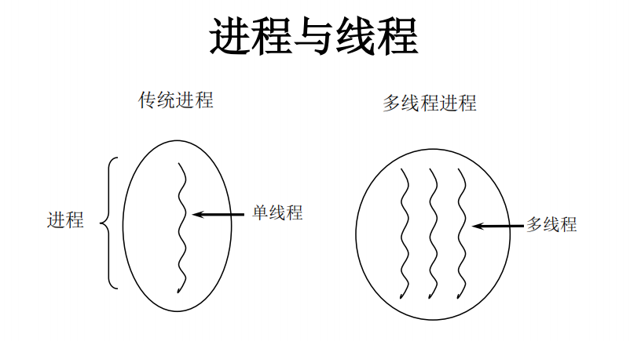

- 线程作为调度和执行的单位，每个线程拥有独立的运行栈(虚拟机栈)和程序计数器(pc)，线程切换的开销小 

  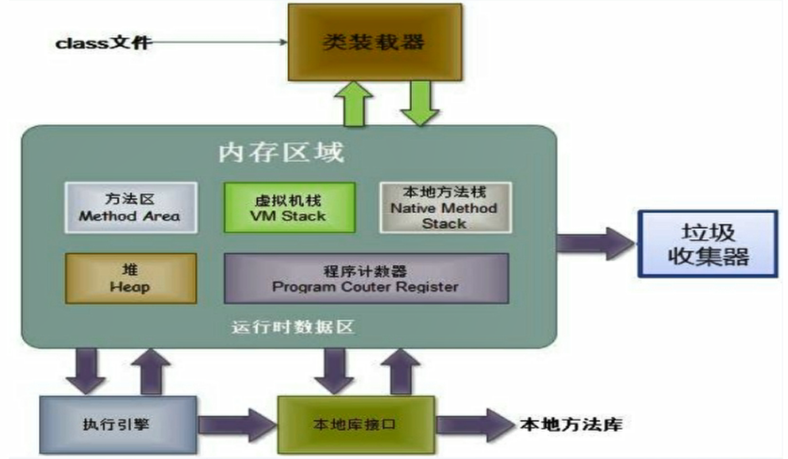

  - 每个线程独占一个虚拟机栈和一个程序计数器
  - 一个进程占用方法区和堆
  - 线程是在进程里面的,所以在JVM的内存结构上来说,多个线程是共享方法区和堆的

- 一个进程中的多个线程共享相同的内存单元/内存地址空间它们从同一堆中分配对象，可以访问相同的变量和对象。这就使得线程间通信更简便、高效。但多个线程操作共享的系统资源可能就会带来安全的隐患。

#### 8.1.2 CPU、并行、并发

**单核CPU和多核CPU的理解**

- 单核CPU，其实是一种假的多线程，因为在一个时间单元内，也只能执行一个线程的任务。
  - 例如：虽然有多车道，但是收费站只有一个工作人员在收费，只有收了费才能通过，那么CPU就好比收费人员。如果有某个人不想交钱，那么收费人员可以把他“挂起”（晾着他，等他想通了，准备好了钱，再去收费）。但是因为CPU时间单元特别短，因此感觉不出来。
- 如果是多核的话，才能更好的发挥多线程的效率。（现在的云服务器都是多核的）
- 一个Java应用程序java.exe，其实至少有三个线程：main()主线程，gc()垃圾回收线程，异常处理线程。当然如果发生异常，会影响主线程。

**并行与并发**

- 并行：多个CPU同时执行多个任务。比如：多个人同时做不同的事。
- 并发：一个CPU(采用时间片)同时执行多个任务。比如：秒杀、多个人做同一件事。

#### 8.1.3 使用多线程的优点

**背景：**以<u>单核CPU</u>为例，只使用单个线程先后完成多个任务（调用多个方法），肯定比用多个线程来完成用的时间更短，为何仍需多线程呢？

**多线程程序的优点：**

1. 提高应用程序的响应。对图形化界面更有意义，可增强用户体验。

2. 提高计算机系统CPU的利用率

3. 改善程序结构。将既长又复杂的进程分为多个线程，独立运行，利于理解和修改

#### 8.1.4 何时需要多线程

1. 程序需要同时执行两个或多个任务。
2. 程序需要实现一些需要等待的任务时，如用户输入、文件读写操作、网络操作、搜索等。
3. 需要一些后台运行的程序时(垃圾回收线程,异常处理线程)。


### 8.2 线程的创建和使用

>  *线程的创建可以有两种方式,一种是继承Thread类来创建线程,一种是实现Runnalble接口来实创建线程*

#### 8.2.1 继承Thread类

##### 8.2.1.1继承Thread类的基本使用

*Java语言的JVM允许程序运行多个线程，它通过[java.lang.Thread](https://tool.oschina.net/apidocs/apidoc?api=jdk-zh)类来体现。*

**Thread类的特性**

- 每个线程都是通过某个特定Thread对象的run()方法来完成操作的，经常把run()方法的主体称为**线程体**
- 通过该Thread对象的start()方法来启动这个线程，而非直接调用run()

**Thread类的构造器**

```java
public class Thread implements Runnable {
	public Thread() {} //创建新的Thread对象
    public Thread(String name){} //创建线程并指定线程实例名
	public Thread(Runnable target){} //指定创建线程的目标对象，它实现了Runnable接口中的run方法
	public Thread(Runnable target, String name){} //创建新的Thread对象
}
```

**继承Thread类创建线程的步骤:**

```
1. 创建一个继承于Thread类的子类
2. 重写Thread类的run() -->将此线程执行的操作声明在run()中,run()中包含执行的逻辑代码
3. 创建Thread类的子类的对象
4．通过创建的子类对象调用start()
```

**例子**: 创建线程,并在线程里面遍历100以内所有的偶数

```java
//1. 创建一个类继承Thread类
class MyThread extends Thread{
    //2·重写Thread类的run（）
    @Override
    public void run() {
        for (int i = 0; i < 100; i++) {
            if(i%2==0){
                System.out.println(i);
            }
        }
    }
}
public class ThreadTest {
    public static void main(String[] args) {
        //main()主线程
        System.out.println("=====main========");
        //3.创建Thread类的子类的对象
        MyThread myThread = new MyThread();
        //4. 通过此对象调用start() ; start()包含两个作用 ①启动当前线程 ②调用当前线程的run()进行执行线程内的逻辑
        myThread.start();
        //myThread.run();
        //main()主线程
        System.out.println("=====main========");
    }
}
```

**需要注意的问题:**

1. 如果自己手动调用run()方法，那么就只是普通方法，没有启动多线程模式。
2. run()方法由JVM调用，什么时候调用，执行的过程控制都有操作系统的CPU调度决定。
3. 想要启动多线程，必须调用start方法。
4. 一个线程对象只能调用一次start()方法启动，如果重复调用了，则将抛出以上的异常“IllegalThreadStateException”。

**练习:** 创建两个分线程,其中一个线程遍历100以内的偶数(even),另一个线程遍历100以内的奇数(odd);使用两种方式

```java
//方式1 : 根据编写步骤一步一步来
public class ThreadDemo {
    public static void main(String[] args) {
        //创建对象
        OddThread oddThread = new OddThread();
        EvenThread evenThread = new EvenThread();

        //开启线程
        evenThread.start();
        oddThread.start();
    }
}

//奇数线程
class OddThread extends Thread{
    @Override
    public void run() {
        for (int i = 0; i < 100; i++) {
            if(i%2 != 0){
                System.out.println("奇数线程:"+i);
            }
        }
    }
}
//偶数线程
class EvenThread extends Thread{
    @Override
    public void run() {
        for (int i = 0; i < 100; i++) {
            if(i%2 == 0){
                System.out.println("偶数线程:"+i);
            }
        }
    }
}
```

```java
//方式2: 通过Thread的匿名子类的方式编写 
/*
Thread(){
	@Override
	public void run(){
	
	}
}.start()
*/
public class ThreadDemo {
    public static void main(String[] args) {
        //奇数线程
        new Thread(){
            @Override
            public void run(){
                for (int i = 0; i < 100; i++) {
                    if(i%2 != 0){
                        System.out.println("奇数线程:"+i);
                    }
                }
            }
        }.start();

        //偶数线程
        new Thread(){
            @Override
            public void run(){
                for (int i = 0; i < 100; i++) {
                    if(i%2 == 0){
                        System.out.println("偶数线程:"+i);
                    }
                }
            }
        }.start();
    }
}
```

##### 8.2.1.2Threa类的常用方法

```java
public class Thread implements Runnable {
    void start() // 启动当前线程，并执行对象的run()方法
	run() // 线程在被调度时执行的操作,将线程将要执行的操作放在此方法中
	String getName() // 返回线程的名称
	void setName(String name) //设置该线程名称.注意:设置线程名字的时候需要在start()之前
	static Thread currentThread() //返回当前线程。在Thread子类中就是this，通常用于主线程和Runnable实现类
	static void yield() //①线程让步 ②暂停当前正在执行的线程，把执行机会让给优先级相同或更高的线程 ③若队列中没有同优先级的线程，忽略此方法
	join() //①当某个程序执行流中调用其他线程的 join() 方法时，调用线程将被阻塞，直到 join() 方法加入的 join 线程执行完为止 ②低优先级的线程也可以获得执行
	static void sleep(long millis) //①(指定时间:毫秒) ②令当前活动线程在指定时间段内放弃对CPU控制,使其他线程有机会被执行,时间到后重排队。③抛出InterruptedException异常
	stop() //强制线程生命期结束，不推荐使用
	boolean isAlive() //返回boolean，判断线程是否还活着
}
```

`start()` 启动当前线程；调用当前线程的run()

`run()` 通常需要重写Thread类中的此方法，将创建的线程要执行的操作声明在此方法中

```java
public class ThreadDemo {
    public static void main(String[] args) {
        TestThread testThread = new TestThread();
        testThread.start();
    }
}
class TestThread extends Thread{
    @Override
    public void run(){
        for (int i = 0; i < 3; i++) {
            System.out.println("run方法中执行的业务逻辑"+i);
        }
    }
}
```

`currentThread()` 静态方法，返回执行当前代码的线程 `Thread[线程名,线程优先级,线程类型]`

```java
public class ThreadDemo {
    public static void main(String[] args) {
        TestThread testThread = new TestThread();
        testThread.start();
    }
}
class TestThread extends Thread{
    @Override
    public void run(){
        System.out.println(currentThread()); //返回当前线程 Thread[Thread-0,5,main]
    }
}
```

`getName()` 获取当前线程的名字

`setName()` 设置当前线程的名字

```java
public class ThreadDemo {
    public static void main(String[] args) {
        TestThread testThread = new TestThread();
        testThread.setName("线程A"); //设置线程名
        testThread.start();
    }
}
class TestThread extends Thread{
    @Override
    public void run(){
        System.out.println(getName()); //获取线程名
    }
}
```

`yield()` 释放当前线程cpu的执行权

```java
public class ThreadDemo {
    public static void main(String[] args) {
        TestThread testThread = new TestThread();
        testThread.start();
    }
}
class TestThread extends Thread{
    @Override
    public void run(){
        for (int i = 0; i < 100; i++) {
            System.out.println(this.currentThread().getName()+":"+i);
            if(i==60){
                yield(); // 释放spu的执行
            }
        }
    }
}
```

`join()` 在线程a中调用线程的join()，此时线程b就进入阻塞状态，直到线程a完全执行完以后，线程才b结束阻塞状态开始执行b中的逻辑代码

```java
public class ThreadDemo {
    public static void main(String[] args) {
        //创建线程对象并开启线程
        TestThread testThread = new TestThread();
        testThread.start();

        //主线程
        Thread.currentThread().setName("主线程");
        for (int i = 0; i < 50; i++) {
            System.out.println(Thread.currentThread().getName()+":"+i);
            if(i==30){
                try {
                    testThread.join();
                } catch (InterruptedException e) {
                    e.printStackTrace();
                }
            }
        }
    }
}
class TestThread extends Thread{
    @Override
    public void run(){
        for (int i = 0; i < 50; i++) {
            System.out.println(this.currentThread().getName()+":"+i);
        }
    }
}
```

~~`stop() `~~ 已过时。当执行此方法时，强制结束当前线程。

`sleep()` 让当前线程“睡眠”指定的millitime毫秒。在指定的millitime毫秒时间内，当前线程是阻塞状态。

```java
public class ThreadDemo {
    public static void main(String[] args) {
        new Thread(){
            @Override
            public void run() {
                for (int i = 0; i < 20; i++) {
                    if(i % 2 == 0){
                        try {
                            sleep(1000); //休眠1秒执行一次
                            System.out.println(Thread.currentThread().getName()+":"+i);
                        } catch (InterruptedException e) {
                            e.printStackTrace();
                        }
                    }
                }
            }
        }.start();
    }
}
```

`isAlive()` 判断当前线程是否存活

```java
public class ThreadDemo {
    public static void main(String[] args) {
        new Thread(){
            @Override
            public void run() {
                for (int i = 0; i < 20; i++) {
                    if(i % 2 == 0){
                        try {
                            sleep(1000); //休眠1秒执行一次
                            System.out.println(isAlive());//当前线程是否存活 , 活着就是true,死了就是false
                            System.out.println(Thread.currentThread().getName()+":"+i);
                        } catch (InterruptedException e) {
                            e.printStackTrace();
                        }
                    }
                }
            }
        }.start();
    }
}
```

##### 8.2.1.3 线程的调度

**调度策略:**

时间片:


抢占式：高优先级的线程抢占CPU

**Java的调度方法**

- 同优先级线程组成先进先出队列（先到先服务），使用时间片策略
- 对高优先级，使用优先调度的抢占式策略


##### 8.2.1.4 线程的优先级设置

**线程的优先级等级**

```
MAX_PRIORITY //10
MIN _PRIORITY //1
NORM_PRIORITY //5 当线程没有设置优先级时,默认的优先级就是5
```

**获取 & 设置线程优先级**

- `getPriority()`  获取当前线程的优先值
- `setPriority(int newPriority)` 设置当前线程的优先级

```java
public class ThreadDemo2 {
    public static void main(String[] args) {
        A a = new A();
        a.setName("A");
        //获取当前线程优先级
        int priority = a.getPriority();
        System.out.println("当前线程:"+ a.getName()+"的优先级为:"+priority);
        //设置线程优先级 如果线程的优先级是 1, 5, 10可以设置为对应的常量 ; 如果是数字就需要编写成具体的数字
        //a.setPriority(10);
        //a.setPriority(Thread.MAX_PRIORITY);
        a.setPriority(7);
        //获取线程优先级
        System.out.println(a.getPriority());
        //启动线程
        a.start();
    }
}
class A extends Thread{
    @Override
    public void run() {
        //分线程内执行的业务代码
    }
}
```


**线程优先级注意点**

1. 线程创建时继承父线程的优先级

2. 低优先级只是获得调度的概率低，低优先级的并非一定是在高优先级线程之后才被调用 (概率的问题)

   ```java
   /**
    * 结果是交替出现的
    	  并非先执行完线程优先级为10的主线程
    	  然后再执行线程优先级为1的A线程
    */
   public class ThreadDemo2 {
       public static void main(String[] args) {
           A a = new A();
           a.setName("A线程");
           a.setPriority(Thread.MIN_PRIORITY); //设置分线程的优先级为1
           a.start(); // 开启分线程
   
   
           //=================== 主线程
           Thread.currentThread().setName("主线程");
           Thread.currentThread().setPriority(Thread.MAX_PRIORITY); //设置主线程的优先级为10
           for (int i = 0; i < 100; i++) {
               if(i%2==0){
                   System.out.println(Thread.currentThread().getName()+":"+Thread.currentThread().getPriority()+":"+i);
               }
           }
       }
   }
   class A extends Thread{
       @Override
       public void run() {
           for (int i = 0; i < 100; i++) {
               if(i%2==0){
                   System.out.println(Thread.currentThread().getName()+":"+Thread.currentThread().getPriority()+":"+i);
               }
           }
       }
   }
   ```

   


##### 8.2.1.5 继承Thread实现多窗口卖票 🚩

创建三个窗口卖票，总票数为100张.使用继承Thread类的方式

```java
// 存在线程的安全问题，待解决。
public class WindowTest {
    public static void main(String[] args) {

        Window wA = new Window();
        Window wB = new Window();
        Window wC = new Window();

        wA.setName("窗口A");
        wB.setName("窗口B");
        wC.setName("窗口C");

        wA.start();
        wB.start();
        wC.start();
        
    }
}
class Window extends Thread{
    private static int ticket = 100;
    @Override
    public void run() {
        while(true){
            if(ticket>0){
                System.out.println(Thread.currentThread().getName()+":卖票,票号为:"+ticket);
                ticket-- ;
            }else{
                break;
            }
        }
    }
}
```

#### 8.2.2 实现Runnable接口

##### 8.2.2.1 实现Runnable接口的基本使用

**使用步骤**

```
 1. 创建一个实现了Runnable接口的类
 2. 实现类去实现Runnable中的抽象方法：run()
 3. 创建实现类的对象
 4. 将此对象作为参数传递到Thread类的构造器中，创建Thread类的对象
 5. 通过Thread类的对象调用start()
```

**例子:**

```java
public class RunnableDemo {
    public static void main(String[] args) {
        //3. 创建实现类的对象
        B b = new B();
        //4. 将此对象作为参数传递到Thread类的构造器中，创建Thread类的对象
        Thread thread = new Thread(b);
        thread.setName("B线程");
        //5. 通过Thread类的对象调用start():① 启动线程 ②调用当前线程的run()-->调用了Runnable类型的target的run()
        
        thread.start();
    }
}
//1. 创建一个实现了Runnable接口的类
class B implements Runnable{
    //2. 实现类去实现Runnable中的抽象方法：run()
    @Override
    public void run() {
        for (int i = 0; i < 100; i++) {
            if (i%2==0){
                System.out.println(Thread.currentThread().getName()+":"+i);
            }
        }
    }
}
```


**继承方式和实现方式的联系与区别**

- 两种方式相同点: 两种方式都需要重写run(),将线程要执行的逻辑声明在run()中。
- 两种方式优先选择: 开发中优先选择使用实现Runnable接口的方式 **原因**: ①实现的方式没有类的单继承性的局限性②实现的方式更适合来处理多个线程有共享数据的情况。
- 两种方式的联系: `public class Thread implements Runnable`

### 8.3 线程的生命周期

```
线程的几种状态
线程的生命周期
```


### 8.4 线程的同步

```
问题的提出
例 题
Synchronized的使用方法
分析同步原理
同步机制中的锁
同步的范围
释放锁的操作
不会释放锁的操作
单例设计模式之懒汉式(线程安全)
线程的死锁问题
Lock(锁)
synchronized 与 Lock 的对比
练 习1
```


### 8.5 线程的通信

```
例 题
wait() 与 notify() 和 notifyAll()
生产者/消费者问题
练 习 2

```


### 8.6 JDK5.0新增线程创建方式

```
新增方式一：实现Callable接口
新增方式二：使用线程池
```


### 多线程面试

1. 创建线程的方式有几种? 4种,5.0前两种,5.0之后两种
2. 有几种方式解决线程安全问题? 3种 同步方法,同步代码块,luck


---
## 第 9 章: Java常用类

```
##  字符串相关的类

## JDK8之前的日期时间API

## JDK8中新日期时间API

## Java比较器

## System类

## Math类

## BigInteger与BigDecimal
```


---
## 第 10 章: 枚举 & 注解

```
##  枚举类的使用

##  注解的使用
```


---
## 第 11 章: Java集合

```
##  Java集合框架概述

##  Collection接口方法

##  Iterator代器接口

##  Collection子接口一: List

##  Collection子接口二: Set

##  Map接口

##  Collections工具类
```


---
## 第 12 章: 泛型

```
##  为什么要有泛型

##  在集合中使用泛型

##  自定义泛型结构

##  泛型在继承上的体现

##  通配符的使用

##  泛型应用举例
```


---
## 第 13 章: IO流 🚩

### 13.1 File类的使用

*java.io.File类：文件和文件目录路径的抽象表示形式，与平台无关*

File 能新建、删除、重命名文件和目录，但 File 不能访问文件内容本身。如果需要访问文件内容本身，则需要使用输入/输出流。

想要在Java程序中表示一个真实存在的文件或目录，那么必须有一个File对 象，但是Java程序中的一个File对象，可能没有一个真实存在的文件或目录。

File对象可以作为参数传递给流的构造器

#### File 类的使用：常用构造器

- public File(String pathname) 以pathname为路径创建File对象，可以是绝对路径或者相对路径，如果pathname是相对路径，则默认的当前路径在系统属性user.dir中存储。
	- 绝对路径：是一个固定的路径,从盘符开始
	- 相对路径：是相对于某个位置开始
- public File(String parent,String child)以parent为父路径，child为子路径创建File对象。 
- public File(File parent,String child)根据一个父File对象和子文件路径创建File对象


#### File 类的使用：路径分隔符

路径中的每级目录之间用一个**路径分隔符**隔开。

路径分隔符和系统有关：

- windows和DOS系统默认使用“\”来表示
- UNIX和URL使用“/”来表示

Java程序支持跨平台运行，因此路径分隔符要慎用。

为了解决这个隐患，File类提供了一个常量：`public static final String separator`。根据操作系统，动态的提供分隔符。

```java
File file1 = new File("d:\\atguigu\\info.txt");
File file2 = new File("d:" + File.separator + "atguigu" + File.separator + "info.txt");
File file3 = new File("d:/atguigu");
```

#### File 类的使用：常用方法

**File类的获取功能**

```java
public String getAbsolutePath()//获取绝对路径
public String getPath() //获取路径
public String getName() //获取名称
public String getParent()//获取上层文件目录路径。若无，返回null
public long length() //获取文件长度（即：字节数）。不能获取目录的长度。  public long lastModified() ：获取最后一次的修改时间，毫秒值
public String[] list() //获取指定目录下的所有文件或者文件目录的名称数组
public File[] listFiles() //获取指定目录下的所有文件或者文件目录的File数组
```

**File类的重命名功能**

```java
public boolean renameTo(File dest)//把文件重命名为指定的文件路径File类的判断功能
public boolean isDirectory()//判断是否是文件目录
public boolean isFile() //判断是否是文件
public boolean exists() //判断是否存在
public boolean canRead() //判断是否可读
public boolean canWrite() //判断是否可写
public boolean isHidden() //判断是否隐藏
```


**File类的创建功能**

```java
public boolean createNewFile()  //创建文件。若文件存在，则不创建，返回false
public boolean mkdir() //创建文件目录。如果此文件目录存在，就不创建了。如果此文件目录的上层目录不存在，也不创建。 
public boolean mkdirs() //创建文件目录。如果上层文件目录不存在，一并创建
		//注意事项：如果你创建文件或者文件目录没有写盘符路径，那么，默认在项目路径下。 
```


**File类的删除功能**

```java
public boolean delete()//删除文件或者文件夹
//删除注意事项：
//Java中的删除不走回收站。 要删除一个文件目录，请注意该文件目录内不能包含文件或者文件目录
```


**练 习**

```markdown
1. 利用File构造器，new 一个文件目录file
	1)在其中创建多个文件和目录
	2)编写方法，实现删除file中指定文件的操作
2. 判断指定目录下是否有后缀名为.jpg的文件，如果有，就输出该文件名称
3. 遍历指定目录所有文件名称，包括子文件目录中的文件。
	拓展1：并计算指定目录占用空间的大小
	拓展2：删除指定文件目录及其下的所有文件
```


### 13.2 IO流原理及流的分类

#### JavaIO原理

- I/O是Input/Output的缩写， I/O技术是非常实用的技术，用于处理设备之间的数据传输。如读/写文件，网络通讯等。

- Java程序中，对于数据的输入/输出操作以“流(stream)” 的方式进行。

- java.io包下提供了各种“流”类和接口，用以获取不同种类的数据，并通过标准的方法输入或输出数据。

- 输入与输出:

  - 输入input：读取外部数据（磁盘、光盘等存储设备的数据）到程序（内存）中。
  - 输出output：将程序（内存）数据输出到磁盘、光盘等存储设备中。

  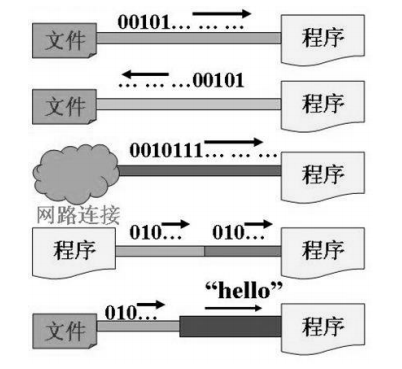


#### 流的分类

按操作数据单位不同分为：字节流(8 bit)，字符流(16 bit)

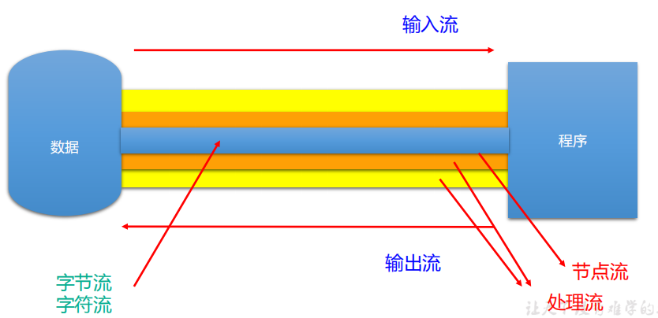

按数据流的流向不同分为：输入流，输出流

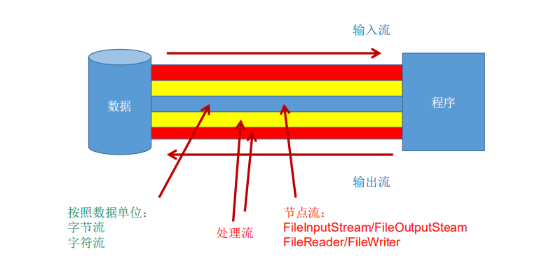

按流的角色的不同分为：节点流，处理流


| (抽象基类) | 字节流       | 字符流 |
| ---------- | ------------ | ------ |
| 输入流     | InputStream  | Reader |
| 输出流     | OutputStream | Writer |

1. Java的IO流共涉及40多个类，实际上非常规则，都是从如下4个抽象基类派生的。
2. 由这四个类派生出来的子类名称都是以其父类名作为子类名后缀。


#### IO流体系

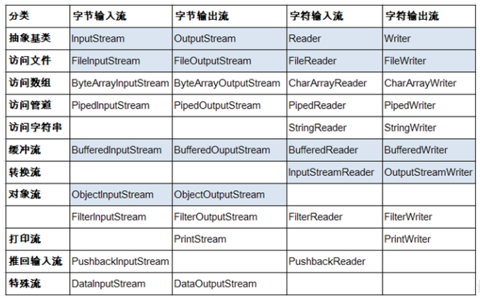

#### 节点流和处理流

节点流：直接从数据源或目的地读写数据


处理流：不直接连接到数据源或目的地，而是“连接”在已存在的流（节点流或处理流）之上，通过对数据的处理为程序提供更为强大的读写功能。


#### InputStream & Reader

- InputStream 和 Reader 是所有输入流的基类。
- InputStream（典型实现：FileInputStream） 
	- int read()
	- int read(byte[] b)
	- int read(byte[] b, int off, int len) 
- Reader（典型实现：FileReader） int read()
	- int read(char [] c)
	- int read(char [] c, int off, int len) 
- 程序中打开的文件 IO 资源不属于内存里的资源，垃圾回收机制无法回收该资源，所以应该显式关闭文件 IO 资源。 
- FileInputStream 从文件系统中的某个文件中获得输入字节。FileInputStream 用于读取非文本数据之类的原始字节流。要读取字符流，需要使用 FileReader

##### InputStream

`int read()`从输入流中读取数据的下一个字节。返回 0 到 255 范围内的 int 字节值。如果因为已经到达流末尾而没有可用的字节，则返回值 -1。 

`int read(byte[] b)` 从此输入流中将最多 b.length 个字节的数据读入一个 byte 数组中。如果因为已经到达流末尾而没有可用的字节，则返回值 -1。否则以整数形式返回实际读取的字节数。 

`int read(byte[] b, int off,int len)`将输入流中最多 len 个数据字节读入 byte 数组。尝试读取 len 个字节，但读取的字节也可能小于该值。以整数形式返回实际读取的字节数。如果因为流位于文件末尾而没有可用的字节，则返回值 -1。 

`public void close() throws IOException` 关闭此输入流并释放与该流关联的所有系统资源。


##### Reader

`int read()`读取单个字符。作为整数读取的字符，范围在 0 到 65535 之间 (0x00-0xffff)（2个字节的Unicode码），如果已到达流的末尾，则返回 -1 


`int read(char[] cbuf)`将字符读入数组。如果已到达流的末尾，则返回 -1。否则返回本次读取的字符数。 


`int read(char[] cbuf,int off,int len)`将字符读入数组的某一部分。存到数组cbuf中，从off处开始存储，最多读len个字
符。如果已到达流的末尾，则返回 -1。否则返回本次读取的字符数。 


`public void close() throws IOException`关闭此输入流并释放与该流关联的所有系统资源。


#### OutputStream & Writer

- OutputStream 和 Writer 也非常相似：
	- void write(int b/int c);
	- void write(byte[] b/char[] cbuf);
	- void write(byte[] b/char[] buff, int off, int len);
	- void flush();
	- void close(); 需要先刷新，再关闭此流
- 因为字符流直接以字符作为操作单位，所以 Writer 可以用字符串来替换字符数组，即以 String 对象作为参数
	- void write(String str);
	- void write(String str, int off, int len);
- FileOutputStream 从文件系统中的某个文件中获得输出字节。FileOutputStream 用于写出非文本数据之类的原始字节流。要写出字符流，需要使用 FileWriter

##### OutputStream 

`void write(int b)` 将指定的字节写入此输出流。write 的常规协定是：向输出流写入一个字节。要写入的字节是参数 b 的八个低位。b 的 24 个高位将被忽略。 即写入0~255范围的。 

`void write(byte[] b)`将 b.length 个字节从指定的 byte 数组写入此输出流。write(b) 的常规协定是：应该与调用write(b, 0, b.length) 的效果完全相同。 

`void write(byte[] b,int off,int len)` 将指定 byte 数组中从偏移量 off 开始的 len 个字节写入此输出流。

`public void flush()throws IOException` 刷新此输出流并强制写出所有缓冲的输出字节，调用此方法指示应将这些字节立即写入它们预期的目标。 

`public void close() throws IOException`关闭此输出流并释放与该流关联的所有系统资源。

##### Writer

`void write(int c)` 写入单个字符。要写入的字符包含在给定整数值的 16 个低位中，16 高位被忽略。 即写入0 到 65535 之间的Unicode码。 

`void write(char[] cbuf)`写入字符数组。 

`void write(char[] cbuf,int off,int len)`写入字符数组的某一部分。从off开始，写入len个字符

`void write(String str)`写入字符串。

`void write(String str,int off,int len)`写入字符串的某一部分。 

`void flush()`刷新该流的缓冲，则立即将它们写入预期目标。

`public void close() throws IOException` 关闭此输出流并释放与该流关联的所有系统资源。


### 13.3 节点流(或文件流)

#### 读取文件

```markdown
# 读取文件步骤
1. 建立一个流对象，将已存在的一个文件加载进流。
	FileReader fr = new FileReader(new File(“Test.txt”));
2. 创建一个临时存放数据的数组。
	char[] ch = new char[1024];
3. 调用流对象的读取方法将流中的数据读入到数组中。
	fr.read(ch);
4. 关闭资源。
	fr.close();
```

```java
FileReader fr = null;
try {
fr = new FileReader(new File("c:\\test.txt"));
char[] buf = new char[1024];
int len;
while ((len = fr.read(buf)) != -1) {
System.out.print(new String(buf, 0, len));
}
} catch (IOException e) {
System.out.println("read-Exception :" + e.getMessage());
} finally {
if (fr != null) {
try {
fr.close();
} catch (IOException e) {
System.out.println("close-Exception :" + e.getMessage());
} } }
```


#### 写入文件

```markdown
# 写入文件步骤
1. 创建流对象，建立数据存放文件
	FileWriter fw = new FileWriter(new File(“Test.txt”));
2. 调用流对象的写入方法，将数据写入流
	fw.write(“atguigu-songhongkang”);
3. 关闭流资源，并将流中的数据清空到文件中。
	fw.close();
```

```java
FileWriter fw = null;
try {
fw = new FileWriter(new File("Test.txt"));
fw.write("atguigu-songhongkang");
} catch (IOException e) {
e.printStackTrace();
} finally {
if (fw != null)
try {
fw.close();
} catch (IOException e) {
e.printStackTrace();
} }
```


#### 节点流(或文件流)：注意点

1. 定义文件路径时，注意：可以用“/”或者“\\”。 
2. 在写入一个文件时，如果使用构造器FileOutputStream(file)，则目录下有同名文件将被覆盖。
3. 如果使用构造器FileOutputStream(file,true)，则目录下的同名文件不会被覆盖，在文件内容末尾追加内容。
4. 在读取文件时，必须保证该文件已存在，否则报异常。 
5. 字节流操作字节，比如：.mp3，.avi，.rmvb，mp4，.jpg，.doc，.ppt
6. 字符流操作字符，只能操作普通文本文件。最常见的文本文件：.txt，.java，.c，.cpp 等语言的源代码。尤其意.doc,excel,ppt这些不是文本文件。


### 13.4  处理流之一：缓冲流

为了提高数据读写的速度，Java API提供了带缓冲功能的流类，在使用这些流类时，会创建一个内部缓冲区数组，缺省使用8192个字节(8Kb)的缓冲区。 

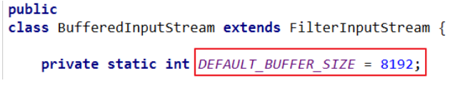

缓冲流要“套接”在相应的节点流之上，根据数据操作单位可以把缓冲流分为：

- **BufferedInputStream** **和** **BufferedOutputStream**
- **BufferedReader** **和** **BufferedWriter**

当读取数据时，数据按块读入缓冲区，其后的读操作则直接访问缓冲区当使用BufferedInputStream读取字节文件时，BufferedInputStream会一次性从文件中读取8192个(8Kb)，存在缓冲区中，直到缓冲区装满了，才重新从文件中读取下一个8192个字节数组。 

向流中写入字节时，不会直接写到文件，先写到缓冲区中直到缓冲区写满，BufferedOutputStream才会把缓冲区中的数据一次性写到文件里。使用方法flush()可以强制将缓冲区的内容全部写入输出流

关闭流的顺序和打开流的顺序相反。只要关闭最外层流即可，关闭最外层流也会相应关闭内层节点流

flush()方法的使用：手动将buffer中内容写入文件

如果是带缓冲区的流对象的close()方法，不但会关闭流，还会在关闭流之前刷新缓冲区，关闭后不能再写出

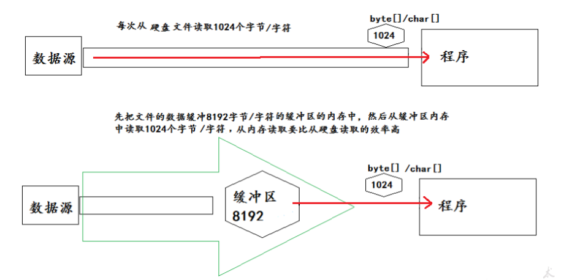

```java
BufferedReader br = null;
BufferedWriter bw = null;
try {
// 创建缓冲流对象：它是处理流，是对节点流的包装
br = new BufferedReader(new FileReader("d:\\IOTest\\source.txt"));
bw = new BufferedWriter(new FileWriter("d:\\IOTest\\dest.txt"));
String str;
while ((str = br.readLine()) != null) { // 一次读取字符文本文件的一行字符
bw.write(str); // 一次写入一行字符串
bw.newLine(); // 写入行分隔符
}
bw.flush(); // 刷新缓冲区
} catch (IOException e) {
e.printStackTrace();
} finally {
// 关闭IO流对象
try {
if (bw != null) {
bw.close(); // 关闭过滤流时,会自动关闭它所包装的底层节点流
}
} catch (IOException e) {
e.printStackTrace();
}
try {
if (br != null) {
br.close();
}
} catch (IOException e) {
e.printStackTrace();
} }
```

**练习:**

1. 分别使用节点流：FileInputStream、FileOutputStream和缓冲流：BufferedInputStream、BufferedOutputStream实现文本文件/图片/视频文件的复制。并比较二者在数据复制方面的效率

2. 实现图片加密操作。

   提示：

   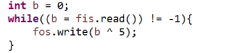

3.  获取文本上每个字符出现的次数

   提示：遍历文本的每一个字符；字符及出现的次数保存在Map中；将Map中数据写入文件


### 13.5 处理流之二：转换流

转换流提供了在字节流和字符流之间的转换
Java API提供了两个转换流：

- InputStreamReader：将InputStream转换为Reader
- OutputStreamWriter：将Writer转换为OutputStream

字节流中的数据都是字符时，转成字符流操作更高效。 

很多时候我们使用转换流来处理文件乱码问题。实现编码和解码的功能。

#### InputStreamReader

实现将字节的输入流按指定字符集转换为字符的输入流。

需要和InputStream“套接”。

构造器

- public InputStreamReader(InputStream in)
- public InputSreamReader(InputStream in,String charsetName)
如： Reader isr = new InputStreamReader(System.in,”gbk”);


#### OutputStreamWriter

实现将字符的输出流按指定字符集转换为字节的输出流。

需要和OutputStream“套接”。

构造器 

-  public OutputStreamWriter(OutputStream out)
- public OutputSreamWriter(OutputStream out,String charsetName)

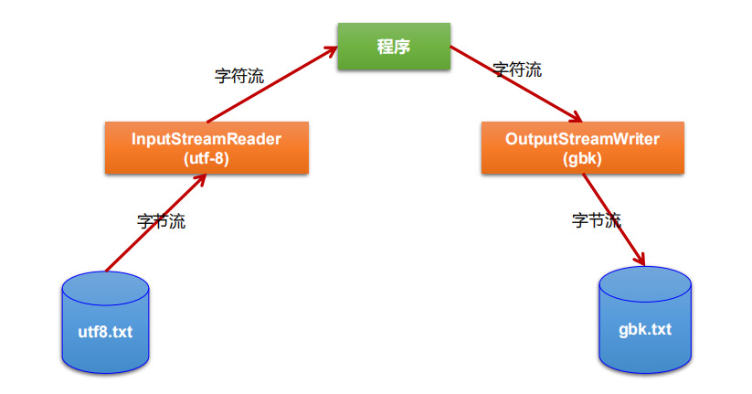

```java
public void testMyInput() throws Exception {
FileInputStream fis = new FileInputStream("dbcp.txt");
FileOutputStream fos = new FileOutputStream("dbcp5.txt");
InputStreamReader isr = new InputStreamReader(fis, "GBK");
OutputStreamWriter osw = new OutputStreamWriter(fos, "GBK");
BufferedReader br = new BufferedReader(isr);
BufferedWriter bw = new BufferedWriter(osw);
String str = null;
while ((str = br.readLine()) != null) {
bw.write(str);
bw.newLine();
bw.flush();
}
bw.close();
br.close();
}
```

##### 补充：字符编码

**编码表的由来**

计算机只能识别二进制数据，早期由来是电信号。为了方便应用计算机，让它可以识别各个国家的文字。就将各个国家的文字用数字来表示，并一一对应，形成一张表。这就是编码表。

**常见的编码表**

ASCII：美国标准信息交换码。 用一个字节的7位可以表示。

ISO8859-1：拉丁码表。欧洲码表 . 用一个字节的8位表示。

GB2312：中国的中文编码表。最多两个字节编码所有字符

GBK：中国的中文编码表升级，融合了更多的中文文字符号。最多两个字节编码

Unicode：国际标准码，融合了目前人类使用的所有字符。为每个字符分配唯一的字符码。所有的文字都用两个字节来表示。

UTF-8：变长的编码方式，可用1-4个字节来表示一个字符。


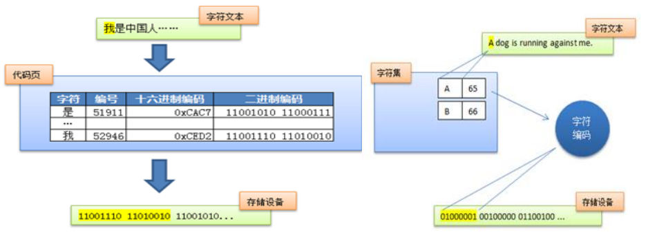

在Unicode出现之前，所有的字符集都是和具体编码方案绑定在一起的（即字符集≈编码方式），都是直接将字符和最终字节流绑定死了。

GBK等双字节编码方式，用最高位是1或0表示两个字节和一个字节。

Unicode不完美，这里就有三个问题，一个是，我们已经知道，英文字母只用一个字节表示就够了，第二个问题是如何才能区别Unicode和ASCII？计算机怎么知道两个字节表示一个符号，而不是分别表示两个符号呢？第三个，如果和GBK等双字节编码方式一样，用最高位是1或0表示两个字节和一个字节，就少了很多值无法用于表示字符，不够表示所有字符。Unicode在很长一段时间内无法推广，直到互联网的出现。 

面向传输的众多 UTF（UCS Transfer Format）标准出现了，顾名思义，UTF- 8就是每次8个位传输数据，而UTF-16就是每次16个位。这是为传输而设计的编码，并使编码无国界，这样就可以显示全世界上所有文化的字符了。

Unicode只是定义了一个庞大的、全球通用的字符集，并为每个字符规定了唯一确定的编号，具体存储成什么样的字节流，取决于字符编码方案。推荐的Unicode编码是UTF-8和UTF-16。


```
Unicode符号范围 | UTF-8编码方式
(十六进制) | （二进制）
—————————————————————–
0000 0000-0000 007F | 0xxxxxxx（兼容原来的ASCII）
0000 0080-0000 07FF | 110xxxxx 10xxxxxx
0000 0800-0000 FFFF | 1110xxxx 10xxxxxx 10xxxxxx
0001 0000-0010 FFFF | 11110xxx 10xxxxxx 10xxxxxx 10xxxxxx
```

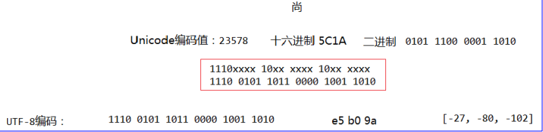

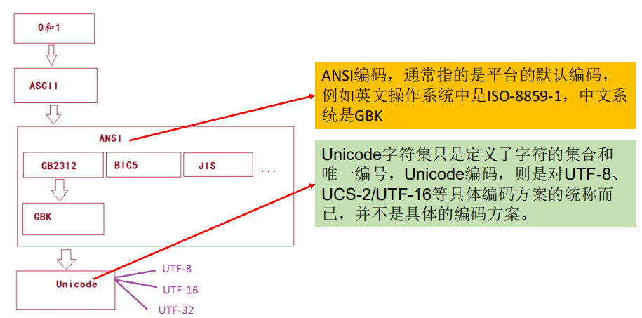

编码：字符串->字节数组

解码：字节数组->字符串

**转换流的编码应用**

- 可以将字符按指定编码格式存储
- 可以对文本数据按指定编码格式来解读
- 指定编码表的动作由构造器完成

### 13.6 处理流之三：标准输入、输出流

System.in和System.out分别代表了系统标准的输入和输出设备

默认输入设备是：键盘，输出设备是：显示器

System.in的类型是InputStream

System.out的类型是PrintStream，其是OutputStream的子类FilterOutputStream 的子类

重定向：通过System类的setIn，setOut方法对默认设备进行改变。

- public static void **setIn**(InputStream in)
- public static void **setOut**(PrintStream out)

**例 题**

从键盘输入字符串，要求将读取到的整行字符串转成大写输出。然后继续进行输入操作，直至当输入“e”或者“exit”时，退出程序。

```java
System.out.println("请输入信息(退出输入e或exit):");
// 把"标准"输入流(键盘输入)这个字节流包装成字符流,再包装成缓冲流
BufferedReader br = new BufferedReader(new InputStreamReader(System.in));
String s = null;
try {
while ((s = br.readLine()) != null) { // 读取用户输入的一行数据 --> 阻塞程序
if ("e".equalsIgnoreCase(s) || "exit".equalsIgnoreCase(s)) {
System.out.println("安全退出!!");
break; }
// 将读取到的整行字符串转成大写输出
System.out.println("-->:" + s.toUpperCase());
System.out.println("继续输入信息");
}
} catch (IOException e) {
e.printStackTrace();
} finally {
try {
if (br != null) {
br.close(); // 关闭过滤流时,会自动关闭它包装的底层节点流
}
} catch (IOException e) {
e.printStackTrace();
} }
```

**练 习**

Create a program named MyInput.java: Contain the methods for reading int, double, float, boolean, short, byte and String values from the keyboard.


### 13.7 处理流之四：打印流

实现将**基本数据类型**的数据格式转化为**字符串**输出

打印流：**PrintStream**和**PrintWriter**

-  提供了一系列重载的print()和println()方法，用于多种数据类型的输出
- PrintStream和PrintWriter的输出不会抛出IOException异常
- PrintStream和PrintWriter有自动flush功能
- PrintStream 打印的所有字符都使用平台的默认字符编码转换为字节。在需要写入字符而不是写入字节的情况下，应该使用 PrintWriter 类。
- System.out返回的是PrintStream的实例

```java
PrintStream ps = null;
try {
FileOutputStream fos = new FileOutputStream(new File("D:\\IO\\text.txt"));
// 创建打印输出流,设置为自动刷新模式(写入换行符或字节 '\n' 时都会刷新输出缓冲区)
ps = new PrintStream(fos, true);
if (ps != null) {// 把标准输出流(控制台输出)改成文件
System.setOut(ps);
}
for (int i = 0; i <= 255; i++) { // 输出ASCII字符
System.out.print((char) i);
if (i % 50 == 0) { // 每50个数据一行
System.out.println(); // 换行
} }
} catch (FileNotFoundException e) {
e.printStackTrace();
} finally {
if (ps != null) {
ps.close();
} }
```


### 13.8 处理流之五：数据流(了解)

为了方便地操作Java语言的基本数据类型和String的数据，可以使用数据流。

数据流有两个类：(用于读取和写出基本数据类型、String类的数据）

- **DataInputStream** 和 **DataOutputStream**
- **分别“套接”在** **InputStream** **和** **OutputStream** **子类的流上** 

DataInputStream中的方法

```
boolean readBoolean() byte readByte()
char readChar() float readFloat()
double readDouble() short readShort()
long readLong() int readInt()
String readUTF() void readFully(byte[] b)
```

DataOutputStream中的方法

*将上述的方法的read改为相应的write即可。*

```
boolean readBoolean() byte readByte()
char readChar() float readFloat()
double readDouble() short readShort()
long readLong() int readInt()
String readUTF() void readFully(byte[] b)
```


```java
DataOutputStream dos = null;
try { // 创建连接到指定文件的数据输出流对象
dos = new DataOutputStream(new FileOutputStream("destData.dat"));
dos.writeUTF("我爱北京天安门"); // 写UTF字符串
dos.writeBoolean(false); // 写入布尔值
dos.writeLong(1234567890L); // 写入长整数
System.out.println("写文件成功!");
} catch (IOException e) {
e.printStackTrace();
} finally { // 关闭流对象
try {
if (dos != null) {
// 关闭过滤流时,会自动关闭它包装的底层节点流
dos.close();
}
} catch (IOException e) {
e.printStackTrace();
} }
```

```java
DataInputStream dis = null;
try {
dis = new DataInputStream(new FileInputStream("destData.dat"));
String info = dis.readUTF();
boolean flag = dis.readBoolean();
long time = dis.readLong();
System.out.println(info);
System.out.println(flag);
System.out.println(time);
} catch (Exception e) {
e.printStackTrace();
} finally {
if (dis != null) {
try {
dis.close();
} catch (IOException e) {
e.printStackTrace();
} } }
```


### 13.9 处理流之六：对象流

ObjectInputStream和OjbectOutputSteam

用于存储和读取**基本数据类型**数据或**对象**的处理流。它的强大之处就是可以把Java中的对象写入到数据源中，也能把对象从数据源中还原回来。

**序列化：**用ObjectOutputStream类**保存**基本类型数据或对象的机制

**反序列化：**用ObjectInputStream类**读取**基本类型数据或对象的机制

ObjectOutputStream和ObjectInputStream不能序列化static和transient修饰的成员变量

#### 对象的序列化

**对象序列化机制**允许把内存中的Java对象转换成平台无关的二进制流，从而允许把这种二进制流持久地保存在磁盘上，或通过网络将这种二进制流传输到另一个网络节点。//当其它程序获取了这种二进制流，就可以恢复成原来的Java对象

序列化的好处在于可将任何实现了Serializable接口的对象转化为**字节数据**，使其在保存和传输时可被还原

序列化是 RMI（Remote Method Invoke – 远程方法调用）过程的参数和返回值都必须实现的机制，而 RMI 是 JavaEE 的基础。因此序列化机制是JavaEE 平台的基础

如果需要让某个对象支持序列化机制，则必须让对象所属的类及其属性是可序列化的，为了让某个类是可序列化的，该类必须实现如下两个接口之一。否则，会抛出NotSerializableException异常

- **Serializable**
- Externalizable

凡是实现Serializable接口的类都有一个表示序列化版本标识符的静态变量：

- **private static final long serialVersionUID;**
- serialVersionUID用来表明类的不同版本间的兼容性。简言之，其目的是以序列化对象进行版本控制，有关各版本反序列化时是否兼容。
- 如果类没有显示定义这个静态常量，它的值是Java运行时环境根据类的内部细节自动生成的。若类的实例变量做了修改，serialVersionUID 可能发生变化。故建议，显式声明。

简单来说，Java的序列化机制是通过在运行时判断类的serialVersionUID来验证版本一致性的。在进行反序列化时，JVM会把传来的字节流中的serialVersionUID与本地相应实体类的serialVersionUID进行比较，如果相同就认为是一致的，可以进行反序列化，否则就会出现序列化版本不一致的异常。(InvalidCastException)

#### 使用对象流序列化对象

若某个类实现了 Serializable 接口，该类的对象就是可序列化的：

- **创建一个** **ObjectOutputStream**
- 调用 ObjectOutputStream 对象的 writeObject(对象) 方法输出可序列化对象
- 注意写出一次，操作flush()一次

反序列化

- 创建一个 ObjectInputStream
- 调用 readObject() 方法读取流中的对象

**强调：**如果某个类的属性不是基本数据类型或 String 类型，而是另一个引用类型，那么这个引用类型必须是可序列化的，否则拥有该类型的Field 的类也不能序列化

```java
//序列化：将对象写入到磁盘或者进行网络传输。
//要求对象必须实现序列化
ObjectOutputStream oos = new ObjectOutputStream(new FileOutputStream(“data.txt"));
Person p = new Person("韩梅梅", 18, "中华大街", new Pet());
oos.writeObject(p);
oos.flush();
oos.close();
//反序列化：将磁盘中的对象数据源读出。
ObjectInputStream ois = new ObjectInputStream(new FileInputStream(“data.txt"));
Person p1 = (Person)ois.readObject();
System.out.println(p1.toString());
ois.close();
```

面试:

谈谈你对java.io.Serializable接口的理解，我们知道它用于序列化，是空方法接口，还有其它认识吗？

```
 实现了Serializable接口的对象，可将它们转换成一系列字节，并可在以后完全恢复回原来的样子。这一过程亦可通过网络进行。这意味着序列化机制能自动补偿操作系统间的差异。换句话说，可以先在Windows机器上创建一个对象，对其序列化，然后通过网络发给一台Unix机器，然后在那里准确无误地重新“装配”。不必关心数据在不同机器上如何表示，也不必关心字节的顺序或者其他任何细节。
 由于大部分作为参数的类如String、Integer等都实现了java.io.Serializable的接口，也可以利用多态的性质，作为参数使接口更
灵活。
```


### 13.10 随机存取文件流

#### RandomAccessFile 类

```
RandomAccessFile 声明在java.io包下，但直接继承于java.lang.Object类。并
且它实现了DataInput、DataOutput这两个接口，也就意味着这个类既可以读也
可以写。
RandomAccessFile 类支持 “随机访问” 的方式，程序可以直接跳到文件的任意
地方来读、写文件
支持只访问文件的部分内容
可以向已存在的文件后追加内容
RandomAccessFile 对象包含一个记录指针，用以标示当前读写处的位置。
RandomAccessFile 类对象可以自由移动记录指针：
long getFilePointer()：获取文件记录指针的当前位置
void seek(long pos)：将文件记录指针定位到 pos 位置
```

```
构造器
public RandomAccessFile(File file, String mode) 
public RandomAccessFile(String name, String mode) 创建 RandomAccessFile 类实例需要指定一个 mode 参数，该参数指
定 RandomAccessFile 的访问模式：
r: 以只读方式打开
rw：打开以便读取和写入
rwd:打开以便读取和写入；同步文件内容的更新
rws:打开以便读取和写入；同步文件内容和元数据的更新
 如果模式为只读r。则不会创建文件，而是会去读取一个已经存在的文件，
如果读取的文件不存在则会出现异常。 如果模式为rw读写。如果文件不
存在则会去创建文件，如果存在则不会创建。
```

我们可以用RandomAccessFile这个类，来实现一个多线程断点下载的功能，用过下载工具的朋友们都知道，下载前都会建立两个临时文件，一个是与被下载文件大小相同的空文件，另一个是记录文件指针的位置文件，每次暂停的时候，都会保存上一次的指针，然后断点下载的时候，会继续从上一次的地方下载，从而实现断点下载或上传的功能，有兴趣的朋友们可以自己实现下。

**读取文件内容**

```java
RandomAccessFile raf = new RandomAccessFile(“test.txt”, “rw”）;
raf.seek(5);
byte [] b = new byte[1024];
int off = 0;
int len = 5;
raf.read(b, off, len);
String str = new String(b, 0, len);
System.out.println(str);
raf.close();
```

**写入文件内容**

```java
RandomAccessFile raf = new RandomAccessFile("test.txt", "rw");
raf.seek(5);
//先读出来
String temp = raf.readLine();
raf.seek(5);
raf.write("xyz".getBytes());
raf.write(temp.getBytes());
raf.close();
```

```java
RandomAccessFile raf1 = new RandomAccessFile("hello.txt", "rw");
raf1.seek(5);
//方式一：
//StringBuilder info = new StringBuilder((int) file.length());
//byte[] buffer = new byte[10];
//int len;
//while((len = raf1.read(buffer)) != -1){
////info += new String(buffer,0,len);
//info.append(new String(buffer,0,len));
//}
//方式二：
ByteArrayOutputStream baos = new ByteArrayOutputStream();
byte[] buffer = new byte[10];
int len;
while((len = raf1.read(buffer)) != -1){
baos.write(buffer, 0, len);
}
raf1.seek(5);
raf1.write("xyz".getBytes());
raf1.write(baos.toString().getBytes());
baos.close();
raf1.close();
```


**流的基本应用小节**

```
 流是用来处理数据的。
 处理数据时，一定要先明确数据源，与数据目的地
 数据源可以是文件，可以是键盘。
 数据目的地可以是文件、显示器或者其他设备。
 而流只是在帮助数据进行传输,并对传输的数据进行处理，比如过滤处理、
转换处理等
```


### 13.11 NIO.2中Path丶Paths丶Files类的使用

#### Java NIO 概述

```
 Java NIO (New IO，Non-Blocking IO)是从Java 1.4版本开始引入的一套新 的IO API，可以替代标准的Java IO API。NIO与原来的IO有同样的作用和目
的，但是使用的方式完全不同，NIO支持面向缓冲区的(IO是面向流的)、基于
通道的IO操作。NIO将以更加高效的方式进行文件的读写操作。
 Java API中提供了两套NIO，一套是针对标准输入输出NIO，另一套就是网
络编程NIO。 
|-----java.nio.channels.Channel
|-----FileChannel:处理本地文件
|-----SocketChannel：TCP网络编程的客户端的Channel
|-----ServerSocketChannel:TCP网络编程的服务器端的Channel
|-----DatagramChannel：UDP网络编程中发送端和接收端的Channel
```

#### NIO. 2

```
 随着 JDK 7 的发布，Java对NIO进行了极大的扩展，增强了对
文件处理和文件系统特性的支持，以至于我们称他们为 NIO.2。
因为 NIO 提供的一些功能，NIO已经成为文件处理中越来越重要
的部分。
```

#### Path、Paths和Files核心API

```
 早期的Java只提供了一个File类来访问文件系统，但File类的功能比较有限，所
提供的方法性能也不高。而且，大多数方法在出错时仅返回失败，并不会提供异
常信息。
 NIO. 2为了弥补这种不足，引入了Path接口，代表一个平台无关的平台路径，描
述了目录结构中文件的位置。Path可以看成是File类的升级版本，实际引用的资
源也可以不存在。
 在以前IO操作都是这样写的:
import java.io.File;
File file = new File("index.html");
 但在Java7 中，我们可以这样写：
import java.nio.file.Path; 
import java.nio.file.Paths; 
Path path = Paths.get("index.html");
 同时，NIO.2在java.nio.file包下还提供了Files、Paths工具类，Files包含
了大量静态的工具方法来操作文件；Paths则包含了两个返回Path的静态
工厂方法。
 Paths 类提供的静态 get() 方法用来获取 Path 对象：
static Path get(String first, String … more) : 用于将多个字符串串连成路径
static Path get(URI uri): 返回指定uri对应的Path路径

```

#### Path接口

```
 Path 常用方法：
 String toString() ： 返回调用 Path 对象的字符串表示形式
 boolean startsWith(String path) : 判断是否以 path 路径开始
 boolean endsWith(String path) : 判断是否以 path 路径结束
 boolean isAbsolute() : 判断是否是绝对路径
 Path getParent() ：返回Path对象包含整个路径，不包含 Path 对象指定的文件路径
 Path getRoot() ：返回调用 Path 对象的根路径
 Path getFileName() : 返回与调用 Path 对象关联的文件名
 int getNameCount() : 返回Path 根目录后面元素的数量
 Path getName(int idx) : 返回指定索引位置 idx 的路径名称
 Path toAbsolutePath() : 作为绝对路径返回调用 Path 对象
 Path resolve(Path p) :合并两个路径，返回合并后的路径对应的Path对象
 File toFile(): 将Path转化为File类的对象
```

#### Files 类

```
 java.nio.file.Files 用于操作文件或目录的工具类。
 Files常用方法：
 Path copy(Path src, Path dest, CopyOption … how) : 文件的复制
 Path createDirectory(Path path, FileAttribute<?> … attr) : 创建一个目录
 Path createFile(Path path, FileAttribute<?> … arr) : 创建一个文件
 void delete(Path path) : 删除一个文件/目录，如果不存在，执行报错
 void deleteIfExists(Path path) : Path对应的文件/目录如果存在，执行删除
 Path move(Path src, Path dest, CopyOption…how) : 将 src 移动到 dest 位置
 long size(Path path) : 返回 path 指定文件的大小
 Files常用方法：用于判断
 boolean exists(Path path, LinkOption … opts) : 判断文件是否存在
 boolean isDirectory(Path path, LinkOption … opts) : 判断是否是目录
 boolean isRegularFile(Path path, LinkOption … opts) : 判断是否是文件
 boolean isHidden(Path path) : 判断是否是隐藏文件
 boolean isReadable(Path path) : 判断文件是否可读
 boolean isWritable(Path path) : 判断文件是否可写
 boolean notExists(Path path, LinkOption … opts) : 判断文件是否不存在
 Files常用方法：用于操作内容
 SeekableByteChannel newByteChannel(Path path, OpenOption…how) : 获取与指定文件的连
接，how 指定打开方式。
 DirectoryStream<Path> newDirectoryStream(Path path) : 打开 path 指定的目录
 InputStream newInputStream(Path path, OpenOption…how):获取 InputStream 对象
 OutputStream newOutputStream(Path path, OpenOption…how) : 获取 OutputStream 对象
```


---
## 第 14 章: 网络编程

```
##  1. 网络编程概述

网络基础

##  2. 网络通信要素概述

如何实现网络中主机相互通信

网络通信协议


##  3. 通信要素1: IP和端口号

##  4. 通信要素2: 网络协议

##  5. TCP网络编程

##  6. UDP网络编程

##  7. URL编程


## 小结


```


---
## 第 15 章: Java反射机制

```
## Java反射机制概述

## 理解Class类并获取Class实例

## 类的加载与ClassLoader的理解

## 创建运行时类的对象

## 获取运行时类的完整结构

## 调用运行时类的指定结构

## 反射的应用: 动态代理
```


---
## 第 16 章: Java8的其他新特性

```
## Lambda表达式

## 函数式Functional接口

## 方法引用与构造器引用

## 强大的StreamAPI

## Optional类
```


---
## 第 17 章: Java9 & 10 & 11新特性

```
##  Java9的新特性


##  Java10的新特性


##  Java11的新特性


## Java12的新特性


## Java13的新特性


## Java14的新特性
```


