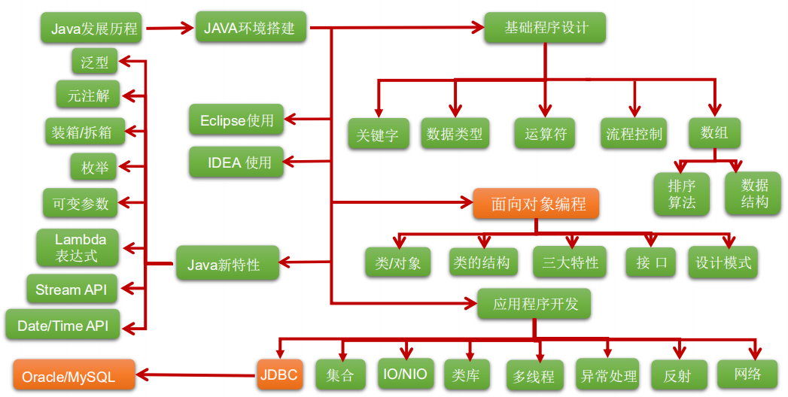

# Java基础编程

> 课程名称: 尚硅谷_Java零基础教程-java入门必备-适合初学者的全套完整版教程(宋红康主讲)
>
> 课程概述: 
>
> - 适合零基础学员： 从Java语言起源开始，循序渐进，知识点剖析细致且每章配备大量随堂练习 
> - 课程内容推陈出新： 基于JDK 11，将Java8、Java9、Java10、Java11新特性一网打尽 课程中，Eclipse和IDEA都使用到
> - 技术讲解更深入、更全面： 课程共30天，715个小节，涉及主流Java方方面面 内容涵盖数据结构、设计模式、JVM内存结构等深度技术 
> - 代码量更大、案例更丰富、更贴近实战
>
> 课程地址: https://www.bilibili.com/video/BV1Kb411W75N
>
> 讲述人 :  宋红康

*JavaSE知识图*




## 第 1 章: Java语言概述

```
##  软件开发介绍

##  计算机编程语言介绍

##  Java语言概述

##  运行机制及运行过程

##  Java的环境搭建

##  开发体验-HelloWorld

##  常见问题及解决方案

##  注释

##  JavaAPI文档

##  良好的编程风格

##  常用的Java开发工具
```


---
## 第 2 章: 基本语法

```
##  关键字和保留字

##  标识符

##  变量

##  运算符

##  程序流程控制
```


---
## 第 3 章: 数组

```
##  数组的概述

##  一维数组的使用

##  多维数组的使用

##  数组中涉及到的常见算法

##  Arrays工具类的使用

##  数组使用中的常见异常
```


---
## 第 4 章: 面向对象(上)

```
## 面向过程与面向对象

## Java基本元素: 类和对象

## 对象的创建和使用

## 类的成员之一: 属性

## 类的成员之二: 方法

## 再谈方法

## OOP特征一: 封装与隐藏

## 类的成员之三: 构造器

## 关键字: this

## 关键字: package、import
```


---
## 第 5 章: 面向对象(中)

```
##  OOP特征二: 继承性

##  方法的重写: override

##  四种访问权限修饰符

##  关键字: super

##  子类对象实例化过程

##  OOP特征三: 多态性

##  Object类的使用

##  包装类的使用


```


---
## 第 6 章: 面向对象(下)

```
##  关键字: static

##  理解main方法的语法

##  类的成员之四: 代码块

##  关键字: final

##  抽象类与抽象方法

##  接口interface

##  类的成员之五: 内部类
```


---
## 第 7 章: 异常处理


---
# Java高级编程

## 第 8 章: 多线程 🚩


---
## 第 9 章: Java常用类


---
## 第 10 章: 枚举 & 注解


---
## 第 11 章: Java集合


---
## 第 12 章: 泛型


---
## 第 13 章: IO流 🚩


---
## 第 14 章: 网络编程


---
## 第 15 章: Java反射机制


---
## 第 16 章: Java8的其他新特性


---
## 第 17 章: Java9 & 10 & 11新特性

```
##  Java9的新特性


##  Java10的新特性


##  Java11的新特性


## Java12的新特性


## Java13的新特性


## Java14的新特性
```


