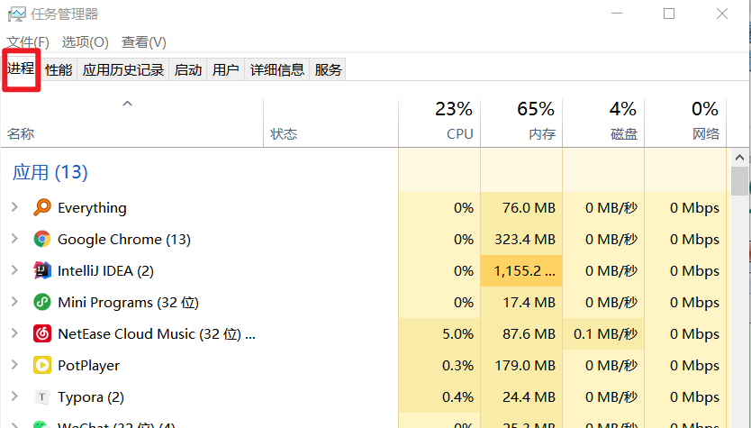

# 多线程

## 1. 基本概念

### 1.1 程序、进程、线程

**程序(program)** 是为完成特定任务、用某种计算机语言编写的一组指令的集合。通常指的是一段静态的代码，静态对象。

**进程(process)** 是程序的一次执行过程，或是正在运行的一个程序,当程序运行起来后,就表示一个进程。进程是一个动态的过程有它自身的产生、存在和消亡的过程。——生命周期

- 例如运行中的QQ程序，运行中的MP3播放器都表示进程

  

- 程序是静态的，进程是动态的

- 进程作为资源分配的单位，系统在运行时会为每个进程分配不同的内存区域

**线程(thread)** ，进程可进一步细化为线程，线程是一个程序内部的一条执行路径.

- 若一个进程同一时间并行执行多个线程，就是支持多线程的

  

- 线程作为调度和执行的单位，每个线程拥有独立的运行栈(虚拟机栈)和程序计数器(pc)，线程切换的开销小 

  

  - 每个线程独占一个虚拟机栈和一个程序计数器
  - 一个进程占用方法区和堆
  - 线程是在进程里面的,所以在JVM的内存结构上来说,多个线程是共享方法区和堆的

- 一个进程中的多个线程共享相同的内存单元/内存地址空间它们从同一堆中分配对象，可以访问相同的变量和对象。这就使得线程间通信更简便、高效。但多个线程操作共享的系统资源可能就会带来安全的隐患。

### 1.2 CPU、并行、并发

**单核CPU和多核CPU的理解**

- 单核CPU，其实是一种假的多线程，因为在一个时间单元内，也只能执行一个线程的任务。
  - 例如：虽然有多车道，但是收费站只有一个工作人员在收费，只有收了费才能通过，那么CPU就好比收费人员。如果有某个人不想交钱，那么收费人员可以把他“挂起”（晾着他，等他想通了，准备好了钱，再去收费）。但是因为CPU时间单元特别短，因此感觉不出来。
- 如果是多核的话，才能更好的发挥多线程的效率。（现在的云服务器都是多核的）
- 一个Java应用程序java.exe，其实至少有三个线程：main()主线程，gc()垃圾回收线程，异常处理线程。当然如果发生异常，会影响主线程。

**并行与并发**

- 并行：多个CPU同时执行多个任务。比如：多个人同时做不同的事。
- 并发：一个CPU(采用时间片)同时执行多个任务。比如：秒杀、多个人做同一件事。

### 1.3 使用多线程的优点

**背景：**以<u>单核CPU</u>为例，只使用单个线程先后完成多个任务（调用多个方法），肯定比用多个线程来完成用的时间更短，为何仍需多线程呢？

**多线程程序的优点：**

1. 提高应用程序的响应。对图形化界面更有意义，可增强用户体验。

2. 提高计算机系统CPU的利用率

3. 改善程序结构。将既长又复杂的进程分为多个线程，独立运行，利于理解和修改

### 1.4 何时需要多线程

1. 程序需要同时执行两个或多个任务。
2. 程序需要实现一些需要等待的任务时，如用户输入、文件读写操作、网络操作、搜索等。
3. 需要一些后台运行的程序时(垃圾回收线程,异常处理线程)。


## 2. 线程的创建和使用

>  *线程的创建可以有两种方式,一种是继承Thread类来创建线程,一种是实现Runnalble接口来实创建线程*

### 2.1 继承Thread类

#### 2.2.1 继承Thread类的基本使用

*Java语言的JVM允许程序运行多个线程，它通过[java.lang.Thread](https://tool.oschina.net/apidocs/apidoc?api=jdk-zh)类来体现。*

**Thread类的特性**

- 每个线程都是通过某个特定Thread对象的run()方法来完成操作的，经常把run()方法的主体称为**线程体**
- 通过该Thread对象的start()方法来启动这个线程，而非直接调用run()

**Thread类的构造器**

```java
public class Thread implements Runnable {
	public Thread() {} //创建新的Thread对象
    public Thread(String name){} //创建线程并指定线程实例名
	public Thread(Runnable target){} //指定创建线程的目标对象，它实现了Runnable接口中的run方法
	public Thread(Runnable target, String name){} //创建新的Thread对象
}
```

**继承Thread类创建线程的步骤:**

```
1. 创建一个继承于Thread类的子类
2. 重写Thread类的run() -->将此线程执行的操作声明在run()中,run()中包含执行的逻辑代码
3. 创建Thread类的子类的对象
4．通过创建的子类对象调用start()
```

**例子**: 创建线程,并在线程里面遍历100以内所有的偶数

```java
//1. 创建一个类继承Thread类
class MyThread extends Thread{
    //2·重写Thread类的run（）
    @Override
    public void run() {
        for (int i = 0; i < 100; i++) {
            if(i%2==0){
                System.out.println(i);
            }
        }
    }
}
public class ThreadTest {
    public static void main(String[] args) {
        //main()主线程
        System.out.println("=====main========");
        //3.创建Thread类的子类的对象
        MyThread myThread = new MyThread();
        //4. 通过此对象调用start() ; start()包含两个作用 ①启动当前线程 ②调用当前线程的run()进行执行线程内的逻辑
        myThread.start();
        //myThread.run();
        //main()主线程
        System.out.println("=====main========");
    }
}
```

**需要注意的问题:**

1. 如果自己手动调用run()方法，那么就只是普通方法，没有启动多线程模式。
2. run()方法由JVM调用，什么时候调用，执行的过程控制都有操作系统的CPU调度决定。
3. 想要启动多线程，必须调用start方法。
4. 一个线程对象只能调用一次start()方法启动，如果重复调用了，则将抛出以上的异常“IllegalThreadStateException”。

**练习:** 创建两个分线程,其中一个线程遍历100以内的偶数(even),另一个线程遍历100以内的奇数(odd);使用两种方式

```java
//方式1 : 根据编写步骤一步一步来
public class ThreadDemo {
    public static void main(String[] args) {
        //创建对象
        OddThread oddThread = new OddThread();
        EvenThread evenThread = new EvenThread();

        //开启线程
        evenThread.start();
        oddThread.start();
    }
}

//奇数
class OddThread extends Thread{
    @Override
    public void run() {
        for (int i = 0; i < 100; i++) {
            if(i%2 != 0){
                System.out.println("奇数线程:"+i);
            }
        }
    }
}
//偶数
class EvenThread extends Thread{
    @Override
    public void run() {
        for (int i = 0; i < 100; i++) {
            if(i%2 == 0){
                System.out.println("偶数线程:"+i);
            }
        }
    }
}
```

```java
//方式2: 通过Thread的匿名子类的方式编写 
/*
Thread(){
	@Override
	public void run(){
	
	}
}.start()
*/
public class ThreadDemo {
    public static void main(String[] args) {
        //奇数线程
        new Thread(){
            @Override
            public void run(){
                for (int i = 0; i < 100; i++) {
                    if(i%2 != 0){
                        System.out.println("奇数线程:"+i);
                    }
                }
            }
        }.start();

        //偶数线程
        new Thread(){
            @Override
            public void run(){
                for (int i = 0; i < 100; i++) {
                    if(i%2 == 0){
                        System.out.println("偶数线程:"+i);
                    }
                }
            }
        }.start();
    }
}
```

#### 2.2.2 Threa类的常用方法

```java
public class Thread implements Runnable {
    void start() // 启动当前线程，并执行对象的run()方法
	run() // 线程在被调度时执行的操作,将线程将要执行的操作放在此方法中
	String getName() // 返回线程的名称
	void setName(String name) //设置该线程名称.注意:设置线程名字的时候需要在start()之前
	static Thread currentThread() //返回当前线程。在Thread子类中就是this，通常用于主线程和Runnable实现类
	static void yield() //①线程让步 ②暂停当前正在执行的线程，把执行机会让给优先级相同或更高的线程 ③若队列中没有同优先级的线程，忽略此方法
	join() //①当某个程序执行流中调用其他线程的 join() 方法时，调用线程将被阻塞，直到 join() 方法加入的 join 线程执行完为止 ②低优先级的线程也可以获得执行
	static void sleep(long millis) //①(指定时间:毫秒) ②令当前活动线程在指定时间段内放弃对CPU控制,使其他线程有机会被执行,时间到后重排队。③抛出InterruptedException异常
	stop() //强制线程生命期结束，不推荐使用
	boolean isAlive() //返回boolean，判断线程是否还活着
}
```

`start()` 启动当前线程；调用当前线程的run()

`run()` 通常需要重写Thread类中的此方法，将创建的线程要执行的操作声明在此方法中

```java
public class ThreadDemo {
    public static void main(String[] args) {
        TestThread testThread = new TestThread();
        testThread.start();
    }
}
class TestThread extends Thread{
    @Override
    public void run(){
        for (int i = 0; i < 3; i++) {
            System.out.println("run方法中执行的业务逻辑"+i);
        }
    }
}
```

`currentThread()` 静态方法，返回执行当前代码的线程 `Thread[线程名,线程优先级,线程类型]`

```java
public class ThreadDemo {
    public static void main(String[] args) {
        TestThread testThread = new TestThread();
        testThread.start();
    }
}
class TestThread extends Thread{
    @Override
    public void run(){
        System.out.println(currentThread()); //返回当前线程 Thread[Thread-0,5,main]
    }
}
```

`getName()` 获取当前线程的名字

`setName()` 设置当前线程的名字

```java
public class ThreadDemo {
    public static void main(String[] args) {
        TestThread testThread = new TestThread();
        testThread.setName("线程A"); //设置线程名
        testThread.start();
    }
}
class TestThread extends Thread{
    @Override
    public void run(){
        System.out.println(getName()); //获取线程名
    }
}
```

`yield()` 释放当ncpu的执行权

```java
public class ThreadDemo {
    public static void main(String[] args) {
        TestThread testThread = new TestThread();
        testThread.start();
    }
}
class TestThread extends Thread{
    @Override
    public void run(){
        for (int i = 0; i < 100; i++) {
            System.out.println(this.currentThread().getName()+":"+i);
            if(i==60){
                yield(); // 释放spu的执行
            }
        }
    }
}
```

`join()` 在线程a中调用线程的join()，此时线程b就进入阻塞状态，直到线程a完全执行完以后，线程才b结束阻塞状态开始执行b中的逻辑代码

```java
public class ThreadDemo {
    public static void main(String[] args) {
        //创建线程对象并开启线程
        TestThread testThread = new TestThread();
        testThread.start();

        //主线程
        Thread.currentThread().setName("主线程");
        for (int i = 0; i < 50; i++) {
            System.out.println(Thread.currentThread().getName()+":"+i);
            if(i==30){
                try {
                    testThread.join();
                } catch (InterruptedException e) {
                    e.printStackTrace();
                }
            }
        }
    }
}
class TestThread extends Thread{
    @Override
    public void run(){
        for (int i = 0; i < 50; i++) {
            System.out.println(this.currentThread().getName()+":"+i);
        }
    }
}
```

~~`stop() `~~ 已过时。当执行此方法时，强制结束当前线程。

`sleep()` 让当前线程“睡眠”指定的millitime毫秒。在指定的millitime毫秒时间内，当前线程是阻塞状态。

```java
public class ThreadDemo {
    public static void main(String[] args) {
        new Thread(){
            @Override
            public void run() {
                for (int i = 0; i < 20; i++) {
                    if(i % 2 == 0){
                        try {
                            sleep(1000); //休眠1秒执行一次
                            System.out.println(Thread.currentThread().getName()+":"+i);
                        } catch (InterruptedException e) {
                            e.printStackTrace();
                        }
                    }
                }
            }
        }.start();
    }
}
```

`isAlive()` 判断当前线程是否存活

```java
public class ThreadDemo {
    public static void main(String[] args) {
        new Thread(){
            @Override
            public void run() {
                for (int i = 0; i < 20; i++) {
                    if(i % 2 == 0){
                        try {
                            sleep(1000); //休眠1秒执行一次
                            System.out.println(isAlive());//当前线程是否存活 , 活着就是true,死了就是false
                            System.out.println(Thread.currentThread().getName()+":"+i);
                        } catch (InterruptedException e) {
                            e.printStackTrace();
                        }
                    }
                }
            }
        }.start();
    }
}
```

#### 2.2.3 线程的调度

**调度策略:**

时间片:


抢占式：高优先级的线程抢占CPU

**Java的调度方法**

- 同优先级线程组成先进先出队列（先到先服务），使用时间片策略
- 对高优先级，使用优先调度的抢占式策略


#### 2.2.4 线程的优先级设置

**线程的优先级等级**

```
MAX_PRIORITY：10
MIN _PRIORITY：1
NORM_PRIORITY：5
```

**涉及的方法**

```java
getPriority()  // 返回线程优先值
setPriority(int newPriority) // 改变线程的优先级
```

**说明**

- 线程创建时继承父线程的优先级
- 低优先级只是获得调度的概率低，低优先级的并非一定是在高优先级线程之后才被调用 (概率的问题)

```java

```


#### 2.2.4 继承Thread实现多窗口卖票


### 2.2 实现Runnable接口

2.1.3 继承方式和实现方式的联系与区别

2.1.4 练 习
线程的调度
线程的优先级
线程的分类

## 3. 线程的生命周期

```
线程的几种状态
线程的生命周期
```


## 4. 线程的同步

```
问题的提出
例 题
Synchronized的使用方法
分析同步原理
同步机制中的锁
同步的范围
释放锁的操作
不会释放锁的操作
单例设计模式之懒汉式(线程安全)
线程的死锁问题
Lock(锁)
synchronized 与 Lock 的对比
练 习1
```


## 5. 线程的通信

```
例 题
wait() 与 notify() 和 notifyAll()
生产者/消费者问题
练 习 2

```


## 6. JDK5.0新增线程创建方式

```
新增方式一：实现Callable接口
新增方式二：使用线程池
```


## 多线程面试

1. 创建线程的方式有几种? 4种,5.0前两种,5.0之后两种
2. 有几种方式解决线程安全问题? 3种 同步方法,同步代码块,luck

