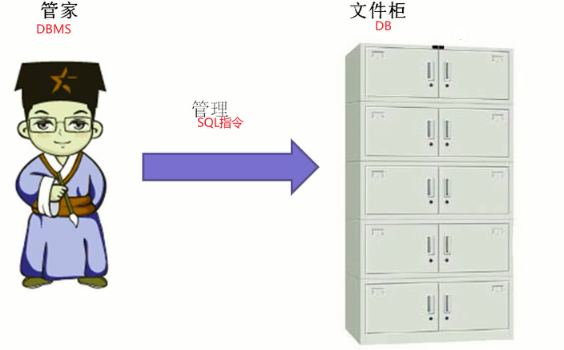

# MySQL5核心技术

> 视频: https://www.bilibili.com/video/BV1xW411u7ax
>
> 说明: 
>
> - 本视频涵盖MySQL核心技术主要知识点，每节知识配套对应练习。
> - 主要包含数据库和表的常用操作、约束、视图、存储过程和函数、流程控制结构以及综合运用各种命令实现数据的增删改查操作。
> - 本课程的目标是“看得懂、学得会、做得出”，为后续的学习打下夯实的基础。MySQL进阶学习教程：[av21334868](https://www.bilibili.com/video/av21334868)。

## 1. SQL概述

### 1. 数据库的好处

**1.1 数据库的使用场景**

- 游戏开发
- web开发(登录注册,商品展示...)

**1.2 使用java保存数据的缺点**

java中保存数据的容器有数组,集合,文件...

- 通过数组,集合保存数据的缺点: 存到内存中,断电数据没了,无法持久化(持久化就是永久保存数据)
- 文件存储的缺点: 文件存储虽软可以持久化,但是查询麻烦(如果查询时添加条件,就无法进行查询了)

**1.3 数据库的好处**

- 实现数据持久化
- 使用完整的管理系统统一管理，易于(条件)查询

### 2. 数据库的基础概念

**DB** 

DB指的是数据库（database）,用于存储数据的“仓库”,DB仓库它保存了一系列有组织的数据。

**DBMS**

DBMS指的是数据库管理系统（DatabaseManagement System）,数据库是通过DBMS(软件)创建和操作的容器

常见的数据库管理系统：MySQL,Oracle,DB2,SqIServer等数据库管理软件

**SQL**

SQL指的是结构化查询语言（Structure Query Language）,SQL专门用来与数据库通信的语言。

SQL的优点:

1. SQL语言不是某个特定数据库供应商专有的语言，几乎所有DBMS都支持SQL
2. SQL语言简单易学
3. SQL语言虽然简单，但实际上是一种强有力的语言，灵活使用其语言元素，可以进行非常复杂和高级的数据库操作。

**DBA**

专门的数据库管理员,用于管理数据库,优化SQL的,一种职位

**图解DB丶DBMS丶SQL三者之间的关系**

### 3. 数据库存的特点

1. 将数据放到表中，表再放到库中
2. 一个数据库中可以有多个表，每个表都有一个的名字，用来标识自己。表名具有唯一性。
3. 表具有一些特性，这些特性定义了数据在表中如何存储，类似java中“类”的设计。
4. 表由列组成，我们也称为字段。所有表都是由一个或多个列组成的，每一列类似java中的"属性"
5. 表中的数据是按行存储的，每一行类似于java中的“对象”

## 2. MySQL安装与使用
## 3. 数据处理之查询
## 4. 常见函数
## 5. 数据处理之增删改
## 6. 子查询
## 7. 创建和管理表
## 8. 数据类型
## 9. 约束和分页
## 10. 事务
## 11. 视图
## 12. 存储过程和函数
## 13. 流程控制结构

## 脚本文件

*视频中出现的脚本文件*

## 练习题

*视频中出现的案例和练习*

