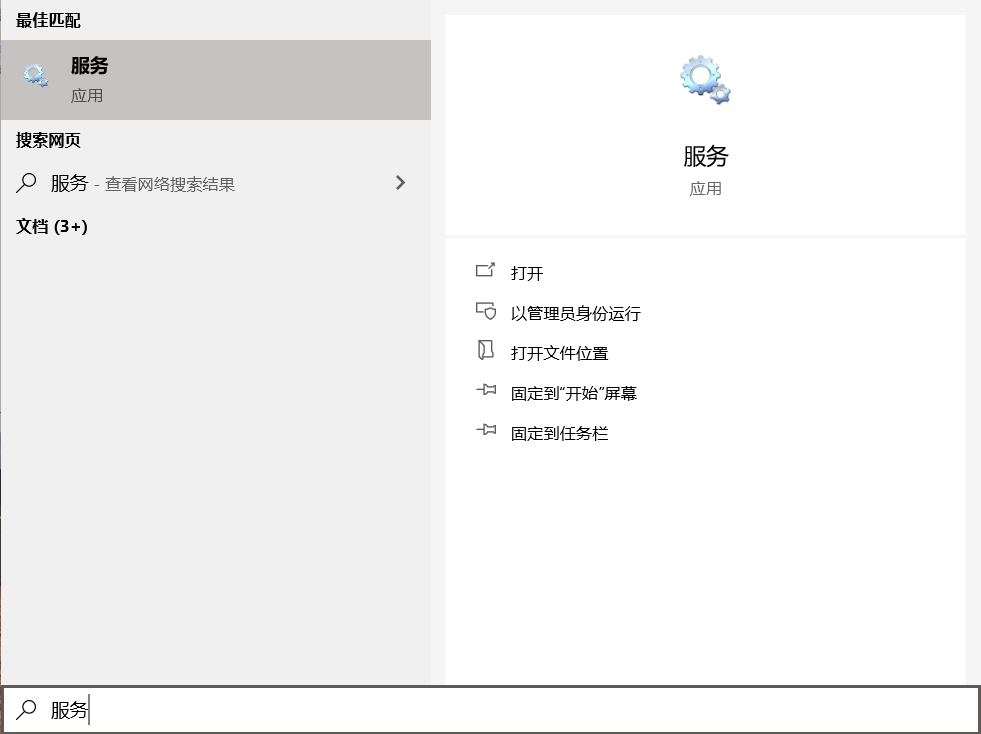

# MySQL5核心技术

> 视频: https://www.bilibili.com/video/BV1xW411u7ax
>
> 说明: 
>
> - 本视频涵盖MySQL核心技术主要知识点，每节知识配套对应练习。
> - 主要包含数据库和表的常用操作、约束、视图、存储过程和函数、流程控制结构以及综合运用各种命令实现数据的增删改查操作。
> - 本课程的目标是“看得懂、学得会、做得出”，为后续的学习打下夯实的基础。MySQL进阶学习教程：[av21334868](https://www.bilibili.com/video/av21334868)。

## 第 1 章: SQL概述

### 1.1 数据库的好处

**1.1.1 数据库的使用场景**

- 游戏开发
- web开发(登录注册,商品展示...)

**1.1.2 使用java保存数据的缺点**

java中保存数据的容器有数组,集合,文件...

- 通过数组,集合保存数据的缺点: 存到内存中,断电数据没了,无法持久化(持久化就是永久保存数据)
- 文件存储的缺点: 文件存储虽软可以持久化,但是查询麻烦(如果查询时添加条件,就无法进行查询了)

**1.1.3 数据库的好处**

- 实现数据持久化
- 使用完整的管理系统统一管理，易于(条件)查询

### 1.2 数据库的基础概念

**DB** 

DB指的是数据库（database）,用于存储数据的“仓库”,DB仓库它保存了一系列有组织的数据。

**DBMS**

DBMS指的是数据库管理系统（DatabaseManagement System）,数据库是通过DBMS(软件)创建和操作的容器

常见的数据库管理系统：MySQL,Oracle,DB2,SqIServer等数据库管理软件

**SQL**

SQL指的是结构化查询语言（Structure Query Language）,SQL专门用来与数据库通信的语言。

SQL的优点:

1. SQL语言不是某个特定数据库供应商专有的语言，几乎所有DBMS都支持SQL
2. SQL语言简单易学
3. SQL语言虽然简单，但实际上是一种强有力的语言，灵活使用其语言元素，可以进行非常复杂和高级的数据库操作。

**DBA**

专门的数据库管理员,用于管理数据库,优化SQL的,一种职位

**图解DB丶DBMS丶SQL三者之间的关系**


小结

```
DQL: 数据查询语言(用于查询数据)
DML: 数据操纵语言(对数据的增删改)
DDL: 关于库和表的定义(如何创建库,删除库)
TCL: 事务控制语言
DCL: 数据控制语言(控制权限的)
```


### 1.3 数据库存的特点

1. 将数据放到表中，表再放到库中
2. 一个数据库中可以有多个表，每个表都有一个的名字，用来标识自己。表名具有唯一性。
3. 表具有一些特性，这些特性定义了数据在表中如何存储，类似java中“类”的设计。
4. 表由列组成，我们也称为字段。所有表都是由一个或多个列组成的，每一列类似java中的"属性"
5. 表中的数据是按行存储的，每一行类似于java中的“对象”


## 第 2 章:  MySQL安装与使用

### 2.1 MySql数据库产品的介绍

Mysql的历史: MySQL数据库隶属于MySQLAB公司，总部位于瑞典，后被oracle收购。

MySQL的优点:

- 成本低：开放源代码，一般可以免费试用
- 性能高：执行很快
- 简单：很容易安装和使用

DBMS分为两类

- 基于共享文件系统的DBMS（Access)
- 基于客户机-服务器的DBMS（MySQL丶Oracle丶SqlServer）

MySQL提供两种版本

- [社区版（免费）](http://dev.mysql.com/downloads/mysql)
- 企业版（收费）


### 2.2 MySQL的卸载与安装

*由于我安装了,所以跳过...对应视频:*

- *07-MySQL软件的安装*

#### MySQL的卸载

- 卸载服务

- 删除安装路径

#### MySQL的安装

- next...next...

### 2.3 MySQL的配置文件my.ini

```ini
#客户端的配置(无需关注)
[mysql]
#服务端的配置
[mysqld] 
# 配置mysql服务的端口号3306
port=3306
#配置mysql存放数据文件的路径
datadir=""
# 设置字符集编码
charcter-set-server=utf8
# 设置数据库的存储引擎
default-storage-engine=INNODB
# 设置最大连接数
max_connection=100
```


### 2.4 MySQL服务的启动与停止

*启动与停止mysql的服务有两种方式*

- *windows上可以通过服务来进行mysql服务的启动与停止*
- *也可以通过cmd命令方式来进行服务的启动与停止*

#### 方式一

1. 按住win+Q后输入服务

   

2. 然后根据选项进行停止和启动服务

   

####  方式二:命令行(推荐使用)

1. 按住win+q输入cmd,然后 <u>以管理员身份打开</u> 进行开启服务

   

2. 停止mysql服务

   ```shell
   # 这里的mysql是自己的服务名,不一定就是mysql,需要看你自己的mysql的服务名字
   net stop mysql
   ```

   

3. 启动服务

   ```bash
   # 同理,启动的服务是名字为mysql的服务
   net start mysql
   ```

   


### 2.5 MySQL服务的登录与退出

*MySQL服务的登录与退出也可以通过两种方式*

- *mysql自带的客户端Client进行登录与退出*
- *直接通过命令行的方式进行登录与退出*

#### 2.5.1 登录mysql

##### 方式一

*点击mysql的客户端后,直接输入密码*

*局限性: 只适用于root用户*


##### 方式二 命令行(推荐使用)

```shell
# 完整的登录命令如下
mysql -h主机名 -p端口 -u用户名 -p密码
# 解释说明
# 主机名: 如果是本机可使用127.0.0.1或localhost,因为后期会连服务器
# 端口: 服务的端口,mysql一般是3306
# 用户名: 之前安装时设置的用户名
# 密码:之前安装时设置的密码 密码可以直接明文跟在p后面,也可以回车后暗文输入

#连接例子:
mysql -hlocalhost -p3306 -uroot -p1234
```

如图显示的就是登录成功后的状态


*可以使用简单的命令进行连接,简化主机和端口的设置,直接通过用户名和密码即可*

```shell
mysql -u用户名 -p密码
```


#### 2.5.2 退出mysql(命令行)

*退出mysql有多种方式*

1. 可使用`exit;`就可直接退出mysql

   ```shell
   exit;
   ```

   

2. 可使用`quit;`退出

   ```shell
   quit;
   ```

   

3. 可使用`\q`退出

   ```shell
   \q
   ```

   


### 2.6 MySQL环境变量的配置

- 新建一个`MYSQL_HOME`的变量名,然后变量值配置成mysql的安装路径;例如`D:\environment\mysql-5.7.19-winx64`

- 然后再到Path中添加`%MYSQL_HOME%\bin`


### 2.7 MySQL的常见命令

#### 2.7.1 查看DBMS中的所有数据库

```shell
show databases;
```


#### 2.7.2 进入到某个数据库中(切换仓库)

```shell
use 数据库名;
# 例如 进入到demo数据库中
use demo;
```


#### 2.7.3 查看某个数据库下所有的表

*提供了两种方式查看仓库中的表*

方式一:

```shell
use 仓库
show tables;
# 注意:通过这种方式一定要线使用这个数据库才可以

#例如:
use demo;
show tables;
```

方式二:

```shell
show tables from 库名;
#  注意: 通过这种方式可以不用先use命令,可直接查看库中的表

# 例如:
show tables from demo;
```


*ps:下面这些命令后面会讲,现在只看看就好了* 

创建一个表

```sql
create table t_user(
id int,
name varchar(20)
);
-- t_user表示表的名字
-- 后面两行,前面表示字段的名字,后面表示字段的类型
```

查看表的结构

```sql
desc 表名;
-- 例如: 查看t_user表的结构
desc t_user;
```

查询表中的数据

```sql
select * from 表名;
-- 例如: 查询t_user表的数据
select * from t_user;
```

向表中插入数据

```sql
insert into 表名(字段1,字段2) values(数据1,数据2);
-- 例如: 插入一个用户
insert into t_user(id,name) values(1,"小明");
```

修改表中的数据

```sql
update 表名 set 字段="值" where 字段="值";
-- 例如: 将小明的名字修改为小红
update t_user set name="小红" where id=1;
```

删除表中的数据

```sql
delete from 表名 where 字段=值;
-- 例如: 将id为1的数据删除
delete from t_user where id=1;
```

#### 2.7.4 查看mysql的版本

*通过命令行方式查看数据库版本*

方式一: mysql环境下查看mysql数据库版本

```sql
select version();
```


方式二: cmd命令行模式下查看mysql版本

```shell
mysql --version
# 简写:
mysql -V
```


### 2.8 MySQL的语法规范

1. 不区分大小写,但建议关键字大写,表名,列名小写
2. 建议每条命令使用`;`结尾
3. 每条命令根据需要,可以进行缩进或换行
4. mysql注释
   - 单行注释: `#注释文字`
   - 单行注释:`-- 注释文字`
   - 多行注释: `/*注释文字*/`

### 2.9 图形界面安装

*已经安装navicate15,所以没有安装sqlyong,视频对应:*

- *16-图形化用户界面客户端的安装*
- *17-图形化用户界面客户端的介绍*


## 第 3 章: 数据处理之查询

> 本章专门做表中数据查询的
>
> DQL查询数据是SQL中的重中之重!!!
>
> 从文末的附录开始看最好,文末有本文中需要的表文件和数据

### 3.1 基础查询-SELECT

```sql
-- 语法:
SELECT 查询列表 FROM 表名
/*
1. 查询列表可以是: 表中的字段丶常量丶表达式丶函数
2. 查询的结果是一个虚拟的表格,不是真实的表格
*/
```

#### 3.1.1 查询表中的单个字段

```sql
-- 查询员工表中的姓名
SELECT last_name FROM employees;
```


#### 3.1.2 查询表中的多个字段

```sql
-- 查询员工表中多个字段的员工信息
SELECT last_name,salary,email FROM employees;
-- 注意: 多个列之间使用逗号连接
```


#### 3.1.3 查询表中的所有字段

```sql
SELECT employee_id,
employee_id,
first_name,
last_name,
email,
phone_number,
job_id,
salary,
commission_pct,
manager_id,
department_id,
hiredate
FROM employees;
-- ---------------------或者使用*,会按照表字段的顺序进行显示
SELECT * FROM employees;
```


#### 3.1.4 查询常量值

```sql
-- 查看100
SELECT 100;
-- 查看字符型的常量值
SELECT "小明";
```


#### 3.1.5 查询表达式

```sql
SELECT 100%99;
```


#### 3.1.6 查询函数

```sql
-- 调用xx()方法返回结果
SELECT VERSION();
```


#### 3.1.7 给字段起别AS

*起别名好处:*

- *给字段起别名方便理解*
- *如果要查询的字段有重名的情况，使用别名可以区分开来*

```sql
SELECT 100%99 AS 结果;
```


```sql
-- 使用AS
SELECT last_name AS 姓,first_name AS 名 FROM employees;
-- AS可以进行省略
SELECT last_name 姓,first_name 名 FROM employees;
```


**【案例】**

```sql
-- 查询salary,显示结果为out put(注意:如果有特殊符号,需要使用""引起来)
SELECT salary AS out put FROM employees; -- 报错
SELECT salary AS 'out put' FROM employees; -- 正确
SELECT salary AS "out put" FROM employees; -- 正确
```


#### 3.1.8 去重-DISTINCT

*去除重复的数据*

```sql
-- 查询员工表中涉及到的所有部门编号
SELECT DISTINCT department_id FROM employees;
```


#### 3.1.9 MySQL`+`的作用

*Mysql中+仅仅只有一个作用: 用于做运算符*

```sql
-- 当两个操作数都是数值型,则做加法运算
SELECT 100+90;
-- 有其中一放为字符型,会试图将字符型数值转换为数值型
	-- 如果转换成功则继续做加法运算
	SELECT "100"+90;
	-- 如果转换失败,则将字符型数值转换为0,再运算
	SELECT '小明'+90;
	-- 只要其中一方为null,结果就是null
	SELECT '90'+NULL;
```


**【案例】**

```sql
-- 员工名和姓连接成一个字段,并显示为姓名
SELECT last_name+first_name AS 姓名
FROM employees; -- 报错(MySQL中的+无法做连接)
-- CONCAT()函数可以做连接
SELECT CONCAT('A',"B","C"); -- 结果就是ABC
-- 使用CONCAT()完成上面的例子
SELECT CONCAT(last_name,first_name) AS 姓名 FROM employees;
```


### 3.2 条件查询-WHERE

```sql
-- 语法
SELECT 查询列表 FROM 表名 WHERE 筛选条件;
-- 执行顺序
/*
1. 先执行FROM
2. 执行WHERE
3. 执行SELECT
先会查看是否有这个表,然后进行数据筛选,最后执行SELECT查出结果
*/
-- 筛选条件的分类
/*
1. 按条件表达式进行筛选 条件运算符: > < = !=(<>) >= <=
2. 按逻辑表达式筛选 逻辑运算符: 
	&&(and) : 如果两个条件都为true,结果为true,只有一个为false,结果就是false
	||(or) : 如果一个条件为true,结果就是true
	!(not): 如果连接的条件本身为false,结果为ture,反之为flase
3. 模糊查询筛选 
	like 
	between and
	in
	is null
*/
```


#### 3.2.1 按条件表达式筛选

`条件运算符: > < = !=(<>) >= <=`

**【案例】**

```sql
-- 案例一: 查询员工工资>12000的员工信息
SELECT * FROM employees WHERE salary>12000;
-- 案例二: 查询部门编号不等于90号的员工名(first_name)和部门编号(department_id)
SELECT first_name,department_id FROM employees WHERE department_id!=90;
SELECT first_name,department_id FROM employees WHERE department_id<>90;
```


#### 3.2.2 按逻辑表达式筛选

`逻辑运算符: &&(and) ||(or) !(not)`

**【案例】**

```sql
-- 案例一: 查询工资在10000到20000之间的员工名丶工资以及奖金
SELECT last_name,salary,commission_pct FROM employees WHERE salary >= 10000 AND salary <= 20000;
-- 案例二: 部门编号不是在90到110之间,或者工资高于15000的员工信息
SELECT * FROM employees WHERE department_id<90 OR department_id>110 OR salary>15000;
SELECT * FROM employees WHERE NOT (department_id>=90 AND department_id<=110) OR salary>15000;
```


#### 3.2.3 模糊查询

##### like 

like一般和通配符搭配使用`%:任意多个字符` `_任意一个字符`

```sql
-- 案例一: 查询员工名中包含字符a的员工信息
SELECT * FROM employees WHERE last_name like '%a%';
-- 案例二: 查询员工名中第3个字符为n,第5个字符为l的员工名和工资
SELECT last_name,salary FROM employees WHERE last_name LIKE '__n_l%';
-- 案例三: 查询员工名中第二个字符为_的员工 (遇到特殊符号可以使用 \ 进行转义)
SELECT last_name FROM employees WHERE last_name like "_\_%";
SELECT last_name FROM employees WHERE last_name like "_Z_%" ESCAPE 'Z'; -- 使用ESCAPE标名z是一个转义字符,并不一定必须使用\

```

##### between and

`between 值1 and  值2`用于模糊查询范围的

使用between and是包含临界值的

between and之间值不可以调整顺序

```sql
-- 案例: 查询员工编号在100到120之间的员工信息
SELECT * FROM employees WHERE employee_id>=100 AND employee_id<=120;
SELECT * FROM employees WHERE employee_id BETWEEN 100 AND 120;
```


##### in

`in` 用于在...里面的

使用in可以提高语句简洁度

in列表的值类型必须一致或兼容

```sql
-- 案例: 查询员工的工种编号是IT_PROG，AD_VP，AD_PRES中的一个员工名和工种编号
SELECT last_name,job_id FROM employees WHERE job_id = "IT_PROG" OR job_id = "AD_VP" OR job_id = "AD_PRES";
SELECT last_name,job_id FROM employees WHERE job_id IN("IT_PROG","AD_VP","AD_PRES");
```


##### is null / is not null

`=或<>`不能用于判断null值

`is null / is not null` 可以用于判断null值

```sql
-- 案例一: 查询没有奖金的员工名和奖金率
SELECT last_name,commission_pct FROM employees WHERE commission_pct IS NULL;
-- 案例二: 查询有奖金的员工名和奖金率
SELECT last_name,commission_pct FROM employees WHERE commission_pct IS NOT NULL;
```

**补充: 安全等于`<=>`** 

可以用于判断null值

可以用于判断具体的值

```sql
-- 案例一: 查询没有奖金的员工名和奖金率
SELECT last_name,commission_pct FROM employees WHERE commission_pct <=> NULL;
-- 案例二: 查询工资为12000的员工信息 
SELECT last_name,commission_pct FROM employees WHERE salary <=> 12000;
```

**IS NULL vs <=>**

IS NULL: 仅仅可以判断null值,不可以判断具体的数值,例如不可以写成 `is 12000` ,但是IS NULL可读性高

<=>: 既可以判断null值,也可以判断普通的数值(不推荐使用)

#### 3.2.4 条件查询-案例讲解

查询员工号为176的员工的姓名和部门号和年薪

```sql
SELECT last_name,department_id,salary*12*(1+IFNULL(commission_pct,0)) AS 年薪 FROM employees WHERE employee_id <=> 176;
```


### 3.3 排序查询 🚩


### 3.4 常见函数


### 3.5 分组函数


### 3.6 连接查询


### 3.7 子查询


### 3.8 分页查询


### 3.9 union联合查询


---


## 第 4 章: 常见函数


### 4.1 字符函数

大小写控制函数

字符控制函数


### 4.2 数学函数


### 4.3 日期函数


### 4.4 其他函数(补充)


### 4.5 流程控制函数(补充)


---

## 第 5 章: 数据处理之增删改


### 5.1 数据操纵语言


### 5.2 插入数据

#### 插入数据

#### INSERT语句语法

#### 向表中插入空值

#### 插入指定的值

#### 从其他表中拷贝数据


### 5.3 更新数据

#### UPDATE语句语法

#### 更新数据

#### 更新中数据的完整性错误

### 5.4 删除数据

#### DELETE语句

#### 删除数据

#### 删除中的数据完整性


---

## 第 6 章:  子查询


### 6.1 子查询概念


### 6.2 子查询类型


### 6.3单行子查询

### 6.4 子查询语法


### 6.5 使用子查询解决问题


### 6.6 执行单行子查询


### 6.7 在子查询中使用组函数


### 6.8 子查询中使用HAVING子句


### 6.9 非法使用子查询


### 6.10 子查询中的空值问题


### 6.11 多行子查询


### 6.12 使用in操作符


### 6.13 在多行子查询中使用ANY操作符


### 6.14 在多行子查询中使用ALL操作符


### 6.15 子查询中的空值问题


---

## 第 7 章: 创建和管理表


### 7.1 创建数据库


命名规则


### 7.2 创建表

CREATE TABLE 语句

常用数据类型

使用子查询创建表

使用子查询创建表举例

ALTER TABLE 语句

追加一个新列

修改一个列

删除一个列

重命名一个列

删除表

清空表

改变对象的名称


---


## 第 8 章: 数据类型


### 8.1 数值类型

整型

小数

位类型


### 8.2 字符类型

char和varchar

binary和varbinary

Enum类型

Set类型


### 8.3 日期类型

datetime和timestamp的区别


## 第 9 章: 约束和分页

### 9.1 什么是约束


### 9.2 约束

#### NOT NULL约束

#### UNIQUE约束

#### PRIMARY KEY约束

#### FOREIGN KEY约束

#### CHECK约束

### 9.3 MySQL使用Limit实现分页

---


## 第 10 章: 事务

### 10.1 事务


### 10.2 MySQL中的存储引擎


### 10.3 事务的特点


### 10.4 事务的使用


### 10.5 数据库的隔离级别


### 10.6 在MySQL中设置隔离级别

---


## 第 11 章: 视图


### 11.1 什么是视图


### 11.2 常见题目


### 11.3 视图的好处


### 11.4 创建或者修改视图


### 11.5 删除视图


### 11.6 查看视图


---

## 第 12 章: 存储过程和函数


### 12.1 什么是存储过程和函数


### 12.2 创建存储过程或函数


### 12.3 调用存储过程或函数


### 12.4 案例


### 12.5 修改储存过程或函数


### 12.6 删除存储过程或函数


### 12.7 查看存储过程或函数


## 第 13 章: 流程控制结构

### 13.1 CASE结构

#### 作为表达式

#### 作为独立的语句


### 13.2 循环结构

## 附: 脚本文件

*视频中出现的脚本文件*

### myemployees.sql(员工)脚本

#### 4张表分析

*这个脚本中包含了4张表*

##### departments表(部门表)

| 字段            | 类型    | 注释               |
| --------------- | ------- | ------------------ |
| department_id   | int     | 部门编号           |
| department_name | varchar | 部门名称           |
| manager_id      | int     | 部门领导的员工编号 |
| location_id     | int     | 位置编号           |


##### employees表(员工表)

| 字段           | 类型     | 注释           |
| -------------- | -------- | -------------- |
| employee_id    | int      | 员工编号       |
| first_name     | varchar  | 员工名         |
| last_name      | varchar  | 员工姓         |
| email          | varchar  | 员工邮箱       |
| phone_number   | varchar  | 员工电话号码   |
| job_id         | varchar  | 员工的工种编号 |
| salary         | double   | 月薪           |
| commission_pct | double   | 奖金率         |
| manager_id     | int      | 上级领导到编号 |
| department_id  | int      | 部门编号       |
| hiredate       | datetime | 入职日期       |

##### jobs表(工种表)

| 字段       | 类型    | 注释     |
| ---------- | ------- | -------- |
| job_id     | varchar | 工种编号 |
| job_title  | varchar | 工种名称 |
| min_salary | int     | 最低工资 |
| max_salary | int     | 最高工资 |


##### locations表(位置表)

| 字段           | 类型    | 注释     |
| -------------- | ------- | -------- |
| location_id    | int     | 位置编号 |
| street_address | varchar | 所属街道 |
| postal_code    | varchar | 邮编     |
| city           | varchar | 城市     |
| state_province | varchar | 州/省    |
| country_id     | varchar | 国家编号 |


#### myemployees.sql执行脚本

```sql
/*
SQLyog Ultimate v10.00 Beta1
MySQL - 5.5.15 : Database - myemployees
*********************************************************************
*/


/*!40101 SET NAMES utf8 */;

/*!40101 SET SQL_MODE=''*/;

/*!40014 SET @OLD_UNIQUE_CHECKS=@@UNIQUE_CHECKS, UNIQUE_CHECKS=0 */;
/*!40014 SET @OLD_FOREIGN_KEY_CHECKS=@@FOREIGN_KEY_CHECKS, FOREIGN_KEY_CHECKS=0 */;
/*!40101 SET @OLD_SQL_MODE=@@SQL_MODE, SQL_MODE='NO_AUTO_VALUE_ON_ZERO' */;
/*!40111 SET @OLD_SQL_NOTES=@@SQL_NOTES, SQL_NOTES=0 */;
CREATE DATABASE /*!32312 IF NOT EXISTS*/`myemployees` /*!40100 DEFAULT CHARACTER SET gb2312 */;

USE `myemployees`;

/*Table structure for table `departments` */

DROP TABLE IF EXISTS `departments`;

CREATE TABLE `departments` (
  `department_id` int(4) NOT NULL AUTO_INCREMENT,
  `department_name` varchar(3) DEFAULT NULL,
  `manager_id` int(6) DEFAULT NULL,
  `location_id` int(4) DEFAULT NULL,
  PRIMARY KEY (`department_id`),
  KEY `loc_id_fk` (`location_id`),
  CONSTRAINT `loc_id_fk` FOREIGN KEY (`location_id`) REFERENCES `locations` (`location_id`)
) ENGINE=InnoDB AUTO_INCREMENT=271 DEFAULT CHARSET=gb2312;

/*Data for the table `departments` */

insert  into `departments`(`department_id`,`department_name`,`manager_id`,`location_id`) values (10,'Adm',200,1700),(20,'Mar',201,1800),(30,'Pur',114,1700),(40,'Hum',203,2400),(50,'Shi',121,1500),(60,'IT',103,1400),(70,'Pub',204,2700),(80,'Sal',145,2500),(90,'Exe',100,1700),(100,'Fin',108,1700),(110,'Acc',205,1700),(120,'Tre',NULL,1700),(130,'Cor',NULL,1700),(140,'Con',NULL,1700),(150,'Sha',NULL,1700),(160,'Ben',NULL,1700),(170,'Man',NULL,1700),(180,'Con',NULL,1700),(190,'Con',NULL,1700),(200,'Ope',NULL,1700),(210,'IT ',NULL,1700),(220,'NOC',NULL,1700),(230,'IT ',NULL,1700),(240,'Gov',NULL,1700),(250,'Ret',NULL,1700),(260,'Rec',NULL,1700),(270,'Pay',NULL,1700);

/*Table structure for table `employees` */

DROP TABLE IF EXISTS `employees`;

CREATE TABLE `employees` (
  `employee_id` int(6) NOT NULL AUTO_INCREMENT,
  `first_name` varchar(20) DEFAULT NULL,
  `last_name` varchar(25) DEFAULT NULL,
  `email` varchar(25) DEFAULT NULL,
  `phone_number` varchar(20) DEFAULT NULL,
  `job_id` varchar(10) DEFAULT NULL,
  `salary` double(10,2) DEFAULT NULL,
  `commission_pct` double(4,2) DEFAULT NULL,
  `manager_id` int(6) DEFAULT NULL,
  `department_id` int(4) DEFAULT NULL,
  `hiredate` datetime DEFAULT NULL,
  PRIMARY KEY (`employee_id`),
  KEY `dept_id_fk` (`department_id`),
  KEY `job_id_fk` (`job_id`),
  CONSTRAINT `dept_id_fk` FOREIGN KEY (`department_id`) REFERENCES `departments` (`department_id`),
  CONSTRAINT `job_id_fk` FOREIGN KEY (`job_id`) REFERENCES `jobs` (`job_id`)
) ENGINE=InnoDB AUTO_INCREMENT=207 DEFAULT CHARSET=gb2312;

/*Data for the table `employees` */

insert  into `employees`(`employee_id`,`first_name`,`last_name`,`email`,`phone_number`,`job_id`,`salary`,`commission_pct`,`manager_id`,`department_id`,`hiredate`) values (100,'Steven','K_ing','SKING','515.123.4567','AD_PRES',24000.00,NULL,NULL,90,'1992-04-03 00:00:00'),(101,'Neena','Kochhar','NKOCHHAR','515.123.4568','AD_VP',17000.00,NULL,100,90,'1992-04-03 00:00:00'),(102,'Lex','De Haan','LDEHAAN','515.123.4569','AD_VP',17000.00,NULL,100,90,'1992-04-03 00:00:00'),(103,'Alexander','Hunold','AHUNOLD','590.423.4567','IT_PROG',9000.00,NULL,102,60,'1992-04-03 00:00:00'),(104,'Bruce','Ernst','BERNST','590.423.4568','IT_PROG',6000.00,NULL,103,60,'1992-04-03 00:00:00'),(105,'David','Austin','DAUSTIN','590.423.4569','IT_PROG',4800.00,NULL,103,60,'1998-03-03 00:00:00'),(106,'Valli','Pataballa','VPATABAL','590.423.4560','IT_PROG',4800.00,NULL,103,60,'1998-03-03 00:00:00'),(107,'Diana','Lorentz','DLORENTZ','590.423.5567','IT_PROG',4200.00,NULL,103,60,'1998-03-03 00:00:00'),(108,'Nancy','Greenberg','NGREENBE','515.124.4569','FI_MGR',12000.00,NULL,101,100,'1998-03-03 00:00:00'),(109,'Daniel','Faviet','DFAVIET','515.124.4169','FI_ACCOUNT',9000.00,NULL,108,100,'1998-03-03 00:00:00'),(110,'John','Chen','JCHEN','515.124.4269','FI_ACCOUNT',8200.00,NULL,108,100,'2000-09-09 00:00:00'),(111,'Ismael','Sciarra','ISCIARRA','515.124.4369','FI_ACCOUNT',7700.00,NULL,108,100,'2000-09-09 00:00:00'),(112,'Jose Manuel','Urman','JMURMAN','515.124.4469','FI_ACCOUNT',7800.00,NULL,108,100,'2000-09-09 00:00:00'),(113,'Luis','Popp','LPOPP','515.124.4567','FI_ACCOUNT',6900.00,NULL,108,100,'2000-09-09 00:00:00'),(114,'Den','Raphaely','DRAPHEAL','515.127.4561','PU_MAN',11000.00,NULL,100,30,'2000-09-09 00:00:00'),(115,'Alexander','Khoo','AKHOO','515.127.4562','PU_CLERK',3100.00,NULL,114,30,'2000-09-09 00:00:00'),(116,'Shelli','Baida','SBAIDA','515.127.4563','PU_CLERK',2900.00,NULL,114,30,'2000-09-09 00:00:00'),(117,'Sigal','Tobias','STOBIAS','515.127.4564','PU_CLERK',2800.00,NULL,114,30,'2000-09-09 00:00:00'),(118,'Guy','Himuro','GHIMURO','515.127.4565','PU_CLERK',2600.00,NULL,114,30,'2000-09-09 00:00:00'),(119,'Karen','Colmenares','KCOLMENA','515.127.4566','PU_CLERK',2500.00,NULL,114,30,'2000-09-09 00:00:00'),(120,'Matthew','Weiss','MWEISS','650.123.1234','ST_MAN',8000.00,NULL,100,50,'2004-02-06 00:00:00'),(121,'Adam','Fripp','AFRIPP','650.123.2234','ST_MAN',8200.00,NULL,100,50,'2004-02-06 00:00:00'),(122,'Payam','Kaufling','PKAUFLIN','650.123.3234','ST_MAN',7900.00,NULL,100,50,'2004-02-06 00:00:00'),(123,'Shanta','Vollman','SVOLLMAN','650.123.4234','ST_MAN',6500.00,NULL,100,50,'2004-02-06 00:00:00'),(124,'Kevin','Mourgos','KMOURGOS','650.123.5234','ST_MAN',5800.00,NULL,100,50,'2004-02-06 00:00:00'),(125,'Julia','Nayer','JNAYER','650.124.1214','ST_CLERK',3200.00,NULL,120,50,'2004-02-06 00:00:00'),(126,'Irene','Mikkilineni','IMIKKILI','650.124.1224','ST_CLERK',2700.00,NULL,120,50,'2004-02-06 00:00:00'),(127,'James','Landry','JLANDRY','650.124.1334','ST_CLERK',2400.00,NULL,120,50,'2004-02-06 00:00:00'),(128,'Steven','Markle','SMARKLE','650.124.1434','ST_CLERK',2200.00,NULL,120,50,'2004-02-06 00:00:00'),(129,'Laura','Bissot','LBISSOT','650.124.5234','ST_CLERK',3300.00,NULL,121,50,'2004-02-06 00:00:00'),(130,'Mozhe','Atkinson','MATKINSO','650.124.6234','ST_CLERK',2800.00,NULL,121,50,'2004-02-06 00:00:00'),(131,'James','Marlow','JAMRLOW','650.124.7234','ST_CLERK',2500.00,NULL,121,50,'2004-02-06 00:00:00'),(132,'TJ','Olson','TJOLSON','650.124.8234','ST_CLERK',2100.00,NULL,121,50,'2004-02-06 00:00:00'),(133,'Jason','Mallin','JMALLIN','650.127.1934','ST_CLERK',3300.00,NULL,122,50,'2004-02-06 00:00:00'),(134,'Michael','Rogers','MROGERS','650.127.1834','ST_CLERK',2900.00,NULL,122,50,'2002-12-23 00:00:00'),(135,'Ki','Gee','KGEE','650.127.1734','ST_CLERK',2400.00,NULL,122,50,'2002-12-23 00:00:00'),(136,'Hazel','Philtanker','HPHILTAN','650.127.1634','ST_CLERK',2200.00,NULL,122,50,'2002-12-23 00:00:00'),(137,'Renske','Ladwig','RLADWIG','650.121.1234','ST_CLERK',3600.00,NULL,123,50,'2002-12-23 00:00:00'),(138,'Stephen','Stiles','SSTILES','650.121.2034','ST_CLERK',3200.00,NULL,123,50,'2002-12-23 00:00:00'),(139,'John','Seo','JSEO','650.121.2019','ST_CLERK',2700.00,NULL,123,50,'2002-12-23 00:00:00'),(140,'Joshua','Patel','JPATEL','650.121.1834','ST_CLERK',2500.00,NULL,123,50,'2002-12-23 00:00:00'),(141,'Trenna','Rajs','TRAJS','650.121.8009','ST_CLERK',3500.00,NULL,124,50,'2002-12-23 00:00:00'),(142,'Curtis','Davies','CDAVIES','650.121.2994','ST_CLERK',3100.00,NULL,124,50,'2002-12-23 00:00:00'),(143,'Randall','Matos','RMATOS','650.121.2874','ST_CLERK',2600.00,NULL,124,50,'2002-12-23 00:00:00'),(144,'Peter','Vargas','PVARGAS','650.121.2004','ST_CLERK',2500.00,NULL,124,50,'2002-12-23 00:00:00'),(145,'John','Russell','JRUSSEL','011.44.1344.429268','SA_MAN',14000.00,0.40,100,80,'2002-12-23 00:00:00'),(146,'Karen','Partners','KPARTNER','011.44.1344.467268','SA_MAN',13500.00,0.30,100,80,'2002-12-23 00:00:00'),(147,'Alberto','Errazuriz','AERRAZUR','011.44.1344.429278','SA_MAN',12000.00,0.30,100,80,'2002-12-23 00:00:00'),(148,'Gerald','Cambrault','GCAMBRAU','011.44.1344.619268','SA_MAN',11000.00,0.30,100,80,'2002-12-23 00:00:00'),(149,'Eleni','Zlotkey','EZLOTKEY','011.44.1344.429018','SA_MAN',10500.00,0.20,100,80,'2002-12-23 00:00:00'),(150,'Peter','Tucker','PTUCKER','011.44.1344.129268','SA_REP',10000.00,0.30,145,80,'2014-03-05 00:00:00'),(151,'David','Bernstein','DBERNSTE','011.44.1344.345268','SA_REP',9500.00,0.25,145,80,'2014-03-05 00:00:00'),(152,'Peter','Hall','PHALL','011.44.1344.478968','SA_REP',9000.00,0.25,145,80,'2014-03-05 00:00:00'),(153,'Christopher','Olsen','COLSEN','011.44.1344.498718','SA_REP',8000.00,0.20,145,80,'2014-03-05 00:00:00'),(154,'Nanette','Cambrault','NCAMBRAU','011.44.1344.987668','SA_REP',7500.00,0.20,145,80,'2014-03-05 00:00:00'),(155,'Oliver','Tuvault','OTUVAULT','011.44.1344.486508','SA_REP',7000.00,0.15,145,80,'2014-03-05 00:00:00'),(156,'Janette','K_ing','JKING','011.44.1345.429268','SA_REP',10000.00,0.35,146,80,'2014-03-05 00:00:00'),(157,'Patrick','Sully','PSULLY','011.44.1345.929268','SA_REP',9500.00,0.35,146,80,'2014-03-05 00:00:00'),(158,'Allan','McEwen','AMCEWEN','011.44.1345.829268','SA_REP',9000.00,0.35,146,80,'2014-03-05 00:00:00'),(159,'Lindsey','Smith','LSMITH','011.44.1345.729268','SA_REP',8000.00,0.30,146,80,'2014-03-05 00:00:00'),(160,'Louise','Doran','LDORAN','011.44.1345.629268','SA_REP',7500.00,0.30,146,80,'2014-03-05 00:00:00'),(161,'Sarath','Sewall','SSEWALL','011.44.1345.529268','SA_REP',7000.00,0.25,146,80,'2014-03-05 00:00:00'),(162,'Clara','Vishney','CVISHNEY','011.44.1346.129268','SA_REP',10500.00,0.25,147,80,'2014-03-05 00:00:00'),(163,'Danielle','Greene','DGREENE','011.44.1346.229268','SA_REP',9500.00,0.15,147,80,'2014-03-05 00:00:00'),(164,'Mattea','Marvins','MMARVINS','011.44.1346.329268','SA_REP',7200.00,0.10,147,80,'2014-03-05 00:00:00'),(165,'David','Lee','DLEE','011.44.1346.529268','SA_REP',6800.00,0.10,147,80,'2014-03-05 00:00:00'),(166,'Sundar','Ande','SANDE','011.44.1346.629268','SA_REP',6400.00,0.10,147,80,'2014-03-05 00:00:00'),(167,'Amit','Banda','ABANDA','011.44.1346.729268','SA_REP',6200.00,0.10,147,80,'2014-03-05 00:00:00'),(168,'Lisa','Ozer','LOZER','011.44.1343.929268','SA_REP',11500.00,0.25,148,80,'2014-03-05 00:00:00'),(169,'Harrison','Bloom','HBLOOM','011.44.1343.829268','SA_REP',10000.00,0.20,148,80,'2014-03-05 00:00:00'),(170,'Tayler','Fox','TFOX','011.44.1343.729268','SA_REP',9600.00,0.20,148,80,'2014-03-05 00:00:00'),(171,'William','Smith','WSMITH','011.44.1343.629268','SA_REP',7400.00,0.15,148,80,'2014-03-05 00:00:00'),(172,'Elizabeth','Bates','EBATES','011.44.1343.529268','SA_REP',7300.00,0.15,148,80,'2014-03-05 00:00:00'),(173,'Sundita','Kumar','SKUMAR','011.44.1343.329268','SA_REP',6100.00,0.10,148,80,'2014-03-05 00:00:00'),(174,'Ellen','Abel','EABEL','011.44.1644.429267','SA_REP',11000.00,0.30,149,80,'2014-03-05 00:00:00'),(175,'Alyssa','Hutton','AHUTTON','011.44.1644.429266','SA_REP',8800.00,0.25,149,80,'2014-03-05 00:00:00'),(176,'Jonathon','Taylor','JTAYLOR','011.44.1644.429265','SA_REP',8600.00,0.20,149,80,'2014-03-05 00:00:00'),(177,'Jack','Livingston','JLIVINGS','011.44.1644.429264','SA_REP',8400.00,0.20,149,80,'2014-03-05 00:00:00'),(178,'Kimberely','Grant','KGRANT','011.44.1644.429263','SA_REP',7000.00,0.15,149,NULL,'2014-03-05 00:00:00'),(179,'Charles','Johnson','CJOHNSON','011.44.1644.429262','SA_REP',6200.00,0.10,149,80,'2014-03-05 00:00:00'),(180,'Winston','Taylor','WTAYLOR','650.507.9876','SH_CLERK',3200.00,NULL,120,50,'2014-03-05 00:00:00'),(181,'Jean','Fleaur','JFLEAUR','650.507.9877','SH_CLERK',3100.00,NULL,120,50,'2014-03-05 00:00:00'),(182,'Martha','Sullivan','MSULLIVA','650.507.9878','SH_CLERK',2500.00,NULL,120,50,'2014-03-05 00:00:00'),(183,'Girard','Geoni','GGEONI','650.507.9879','SH_CLERK',2800.00,NULL,120,50,'2014-03-05 00:00:00'),(184,'Nandita','Sarchand','NSARCHAN','650.509.1876','SH_CLERK',4200.00,NULL,121,50,'2014-03-05 00:00:00'),(185,'Alexis','Bull','ABULL','650.509.2876','SH_CLERK',4100.00,NULL,121,50,'2014-03-05 00:00:00'),(186,'Julia','Dellinger','JDELLING','650.509.3876','SH_CLERK',3400.00,NULL,121,50,'2014-03-05 00:00:00'),(187,'Anthony','Cabrio','ACABRIO','650.509.4876','SH_CLERK',3000.00,NULL,121,50,'2014-03-05 00:00:00'),(188,'Kelly','Chung','KCHUNG','650.505.1876','SH_CLERK',3800.00,NULL,122,50,'2014-03-05 00:00:00'),(189,'Jennifer','Dilly','JDILLY','650.505.2876','SH_CLERK',3600.00,NULL,122,50,'2014-03-05 00:00:00'),(190,'Timothy','Gates','TGATES','650.505.3876','SH_CLERK',2900.00,NULL,122,50,'2014-03-05 00:00:00'),(191,'Randall','Perkins','RPERKINS','650.505.4876','SH_CLERK',2500.00,NULL,122,50,'2014-03-05 00:00:00'),(192,'Sarah','Bell','SBELL','650.501.1876','SH_CLERK',4000.00,NULL,123,50,'2014-03-05 00:00:00'),(193,'Britney','Everett','BEVERETT','650.501.2876','SH_CLERK',3900.00,NULL,123,50,'2014-03-05 00:00:00'),(194,'Samuel','McCain','SMCCAIN','650.501.3876','SH_CLERK',3200.00,NULL,123,50,'2014-03-05 00:00:00'),(195,'Vance','Jones','VJONES','650.501.4876','SH_CLERK',2800.00,NULL,123,50,'2014-03-05 00:00:00'),(196,'Alana','Walsh','AWALSH','650.507.9811','SH_CLERK',3100.00,NULL,124,50,'2014-03-05 00:00:00'),(197,'Kevin','Feeney','KFEENEY','650.507.9822','SH_CLERK',3000.00,NULL,124,50,'2014-03-05 00:00:00'),(198,'Donald','OConnell','DOCONNEL','650.507.9833','SH_CLERK',2600.00,NULL,124,50,'2014-03-05 00:00:00'),(199,'Douglas','Grant','DGRANT','650.507.9844','SH_CLERK',2600.00,NULL,124,50,'2014-03-05 00:00:00'),(200,'Jennifer','Whalen','JWHALEN','515.123.4444','AD_ASST',4400.00,NULL,101,10,'2016-03-03 00:00:00'),(201,'Michael','Hartstein','MHARTSTE','515.123.5555','MK_MAN',13000.00,NULL,100,20,'2016-03-03 00:00:00'),(202,'Pat','Fay','PFAY','603.123.6666','MK_REP',6000.00,NULL,201,20,'2016-03-03 00:00:00'),(203,'Susan','Mavris','SMAVRIS','515.123.7777','HR_REP',6500.00,NULL,101,40,'2016-03-03 00:00:00'),(204,'Hermann','Baer','HBAER','515.123.8888','PR_REP',10000.00,NULL,101,70,'2016-03-03 00:00:00'),(205,'Shelley','Higgins','SHIGGINS','515.123.8080','AC_MGR',12000.00,NULL,101,110,'2016-03-03 00:00:00'),(206,'William','Gietz','WGIETZ','515.123.8181','AC_ACCOUNT',8300.00,NULL,205,110,'2016-03-03 00:00:00');

/*Table structure for table `jobs` */

DROP TABLE IF EXISTS `jobs`;

CREATE TABLE `jobs` (
  `job_id` varchar(10) NOT NULL,
  `job_title` varchar(35) DEFAULT NULL,
  `min_salary` int(6) DEFAULT NULL,
  `max_salary` int(6) DEFAULT NULL,
  PRIMARY KEY (`job_id`)
) ENGINE=InnoDB DEFAULT CHARSET=gb2312;

/*Data for the table `jobs` */

insert  into `jobs`(`job_id`,`job_title`,`min_salary`,`max_salary`) values ('AC_ACCOUNT','Public Accountant',4200,9000),('AC_MGR','Accounting Manager',8200,16000),('AD_ASST','Administration Assistant',3000,6000),('AD_PRES','President',20000,40000),('AD_VP','Administration Vice President',15000,30000),('FI_ACCOUNT','Accountant',4200,9000),('FI_MGR','Finance Manager',8200,16000),('HR_REP','Human Resources Representative',4000,9000),('IT_PROG','Programmer',4000,10000),('MK_MAN','Marketing Manager',9000,15000),('MK_REP','Marketing Representative',4000,9000),('PR_REP','Public Relations Representative',4500,10500),('PU_CLERK','Purchasing Clerk',2500,5500),('PU_MAN','Purchasing Manager',8000,15000),('SA_MAN','Sales Manager',10000,20000),('SA_REP','Sales Representative',6000,12000),('SH_CLERK','Shipping Clerk',2500,5500),('ST_CLERK','Stock Clerk',2000,5000),('ST_MAN','Stock Manager',5500,8500);

/*Table structure for table `locations` */

DROP TABLE IF EXISTS `locations`;

CREATE TABLE `locations` (
  `location_id` int(11) NOT NULL AUTO_INCREMENT,
  `street_address` varchar(40) DEFAULT NULL,
  `postal_code` varchar(12) DEFAULT NULL,
  `city` varchar(30) DEFAULT NULL,
  `state_province` varchar(25) DEFAULT NULL,
  `country_id` varchar(2) DEFAULT NULL,
  PRIMARY KEY (`location_id`)
) ENGINE=InnoDB AUTO_INCREMENT=3201 DEFAULT CHARSET=gb2312;

/*Data for the table `locations` */

insert  into `locations`(`location_id`,`street_address`,`postal_code`,`city`,`state_province`,`country_id`) values (1000,'1297 Via Cola di Rie','00989','Roma',NULL,'IT'),(1100,'93091 Calle della Testa','10934','Venice',NULL,'IT'),(1200,'2017 Shinjuku-ku','1689','Tokyo','Tokyo Prefecture','JP'),(1300,'9450 Kamiya-cho','6823','Hiroshima',NULL,'JP'),(1400,'2014 Jabberwocky Rd','26192','Southlake','Texas','US'),(1500,'2011 Interiors Blvd','99236','South San Francisco','California','US'),(1600,'2007 Zagora St','50090','South Brunswick','New Jersey','US'),(1700,'2004 Charade Rd','98199','Seattle','Washington','US'),(1800,'147 Spadina Ave','M5V 2L7','Toronto','Ontario','CA'),(1900,'6092 Boxwood St','YSW 9T2','Whitehorse','Yukon','CA'),(2000,'40-5-12 Laogianggen','190518','Beijing',NULL,'CN'),(2100,'1298 Vileparle (E)','490231','Bombay','Maharashtra','IN'),(2200,'12-98 Victoria Street','2901','Sydney','New South Wales','AU'),(2300,'198 Clementi North','540198','Singapore',NULL,'SG'),(2400,'8204 Arthur St',NULL,'London',NULL,'UK'),(2500,'Magdalen Centre, The Oxford Science Park','OX9 9ZB','Oxford','Oxford','UK'),(2600,'9702 Chester Road','09629850293','Stretford','Manchester','UK'),(2700,'Schwanthalerstr. 7031','80925','Munich','Bavaria','DE'),(2800,'Rua Frei Caneca 1360 ','01307-002','Sao Paulo','Sao Paulo','BR'),(2900,'20 Rue des Corps-Saints','1730','Geneva','Geneve','CH'),(3000,'Murtenstrasse 921','3095','Bern','BE','CH'),(3100,'Pieter Breughelstraat 837','3029SK','Utrecht','Utrecht','NL'),(3200,'Mariano Escobedo 9991','11932','Mexico City','Distrito Federal,','MX');

/*!40101 SET SQL_MODE=@OLD_SQL_MODE */;
/*!40014 SET FOREIGN_KEY_CHECKS=@OLD_FOREIGN_KEY_CHECKS */;
/*!40014 SET UNIQUE_CHECKS=@OLD_UNIQUE_CHECKS */;
/*!40111 SET SQL_NOTES=@OLD_SQL_NOTES */;
```


## 附: SQL案例及练习

*本教程中出现的案例和练习*


### 1. 基本SQL-SELECT语句

1. 下面的语句是否可以执行成功

  ```sql
  select last_name , job_id , salary as sal
  from employees; -- 答案: 可以执行
  ```

  

2. 下面的语句是否可以执行成功 

  ```sql
  select * from employees; -- 答案: 可以执行
  ```

  

3. 找出下面语句中的错误

  ```sql
  select employee_id , last_name，
  salary * 12 “ANNUAL SALARY”
  from employees;
  -- 答案: 符号错误 ,注意中英文状态的符号就可以了
  ```

  

4. 显示表 departments 的结构，并查询其中的全部数据

   ```sql
   -- 答案:
   DESC departments; -- 显示表的结构
   SELECT * FROM departments; -- 查询全部数据
   ```

   

5. 显示出表 employees 中的全部 job_id（不能重复）

   ```sql
   -- 答案:
   SELECT DISTINCT job_id FROM employees;
   ```

   

6. 显示出表 employees 的全部列，各个列之间用逗号连接，列头显示成 OUT_PUT

   ```sql
   -- 答案
   SELECT CONCAT(last_name,",",first_name,",",job_id) AS "OUT PUT" FROM employees;
   ```

   

### 2. 过滤数据

1. 查询工资大于 12000 的员工姓名和工资

   ```sql
   SELECT last_name,
   ```

   

2. 查询员工号为 176 的员工的姓名和部门号和年薪

3. 选择工资不在 5000 到 12000 的员工的姓名和工资

4. 选择在 20 或 50 号部门工作的员工姓名和部门号

5. 选择公司中没有管理者的员工姓名及 job_id

6. 选择公司中有奖金的员工姓名，工资和奖金级别

7. 选择员工姓名的第三个字母是 a 的员工姓名

8. 选择姓名中有字母 a 和 e 的员工姓名

9. 显示出表 employees 表中 first_name 以 'e'结尾的员工信息

10. 显示出表 employees 部门编号在 80-100 之间 的姓名、职位

11. 显示出表 employees 的 manager_id 是 100,101,110 的员工姓名、职位

### 3. 排序数据

1. 查询员工的姓名和部门号和年薪，按年薪降序 按姓名升序
2. 选择工资不在 8000 到 17000 的员工的姓名和工资，按工资降序
3. 查询邮箱中包含 e 的员工信息，并先按邮箱的字节数降序，再按部门号升序

### 4. 单行函数

1. 显示系统时间(注：日期+时间)

   ```sql
   
   ```

   

2. 查询员工号，姓名，工资，以及工资提高百分之 20%后的结果（new salary）

   ```sql
   
   ```

   

3. 将员工的姓名按首字母排序，并写出姓名的长度（length）

   ```sql
   
   ```

   

4. 做一个查询，产生下面的结果

   `<last_name> earns <salary> monthly but wants <salary*3>`

   

   ```sql
   
   ```

   

5. 使用 case-when，按照下面的条件：

   

   ```sql
   
   ```

   

### 5. 分组函数

1. 查询各 job_id 的员工工资的最大值，最小值，平均值，总和，并按 job_id 升序
2. 查询员工最高工资和最低工资的差距（DIFFERENCE）
3. 查询各个管理者手下员工的最低工资，其中最低工资不能低于 6000，没有管理者的员
工不计算在内
4. 查询所有部门的编号，员工数量和工资平均值,并按平均工资降序
5. 选择具有各个 job_id 的员工人数

### 6. 分组查询

1. 查询公司员工工资的最大值，最小值，平均值，总和
2. 查询员工表中的最大入职时间和最小入职时间的相差天数 （DIFFRENCE）
3. 查询部门编号为 90 的员工个数

### 7. SQL99语法连接查询

一、查询编号>3 的女神的男朋友信息，如果有则列出详细，如果没有，用 null 填充
二、查询哪个城市没有部门
三、查询部门名为 SAL 或 IT 的员工信息

### 8. SQL99语法连接查询

```
1. 显示所有员工的姓名，部门号和部门名称。
2. 查询 90 号部门员工的 job_id 和 90 号部门的 location_id
3. 选择所有有奖金的员工的
last_name , department_name , location_id , city
4. 选择city在Toronto工作的员工的
last_name , job_id , department_id , department_name 
5.查询每个工种、每个部门的部门名、工种名和最低工资
6.查询每个国家下的部门个数大于 2 的国家编号
7、选择指定员工的姓名，员工号，以及他的管理者的姓名和员工号，结果类似于下面的格
式
employees Emp# manager Mgr#
kochhar 101 king 100
```

### 9. 子查询

1. 查询和 Zlotkey 相同部门的员工姓名和工资
2. 查询工资比公司平均工资高的员工的员工号，姓名和工资。
3. 查询各部门中工资比本部门平均工资高的员工的员工号, 姓名和工资
4. 查询和姓名中包含字母 u 的员工在相同部门的员工的员工号和姓名
5. 查询在部门的 location_id 为 1700 的部门工作的员工的员工号
6. 查询管理者是 King 的员工姓名和工资
7. 查询工资最高的员工的姓名，要求 first_name 和 last_name 显示为一列，列名为 姓.名

### 10. 数据处理

1. 运行以下脚本创建表 my_employees

   ```sql
   Create table my_employees(
       Id int(10),
       First_name varchar(10),
       Last_name varchar(10),
       Userid varchar(10),
       Salary double(10,2) 
   )
   create table users(
       id int,
       userid varchar(10),
       department_id int
   )
   ```

2. 显示表 my_employees 的结构

3. 向 my_employees 表中插入下列数据

   | ID   | FIRST_NAME | LAST_NAME | USERID   | SALARY |
   | ---- | ---------- | --------- | -------- | ------ |
   | 1    | patel      | Ralph     | Rpatel   | 895    |
   | 2    | Dancs      | Betty     | Bdancs   | 860    |
   | 3    | Biri       | Ben       | Bbiri    | 1100   |
   | 4    | Newman     | Chad      | Cnewman  | 750    |
   | 5    | Ropeburn   | Audrey    | Aropebur | 1550   |
   |      |            |           |          |        |

4. 向 users 表中插入数据

   |      |          |      |
   | ---- | -------- | ---- |
   | 1    | Rpatel   | 10   |
   | 2    | Bdancs   | 10   |
   | 3    | Bbiri    | 20   |
   | 4    | Cnewman  | 30   |
   | 5    | Aropebur | 40   |

5. 将 3 号员工的 last_name 修改为“drelxer”

6. 将所有工资少于 900 的员工的工资修改为 1000
7. 将 userid 为 Bbiri 的 user 表和 my_employees 表的记录全部删除
8. 删除所有数据
9. 检查所作的修正
10. 清空表 my_employees

### 11. 创建和管理表

1. 创建表 dept1

   | name | Null? | type        |
   | ---- | ----- | ----------- |
   | id   |       | int(7)      |
   | name |       | varchar(25) |

2. 将表 departments 中的数据插入新表 dept2 中

3. 创建表 emp5

   | name       | Null? | type         |
   | ---------- | ----- | ------------ |
   | id         |       | int(7)       |
   | First_name |       | Varchar (25) |
   | Last_name  |       | Varchar(25)  |
   | Dept_id    |       | int(7)       |

4. 将列 Last_name 的长度增加到 50

5. 根据表 employees 创建 employees2

6. 删除表 emp5

7. 将表 employees2 重命名为 emp5 

8. 在表 dept 和 emp5 中添加新列 test_column，并检查所作的操作

9. 直接删除表 emp5 中的列 dept_id

### 12. 约束

1. 向表 emp2 的 id 列中添加 PRIMARY KEY 约束（my_emp_id_pk）
2. 向表 dept2 的 id 列中添加 PRIMARY KEY 约束（my_dept_id_pk）
3. 向表 emp2 中添加列 dept_id，并在其中定义 FOREIGN KEY 约束，与之相关联的列是
dept2 表中的 id 列。

### 13. 事务

1. 创建一个表，里面有 id 为主键，stuname 唯一键，seat 座位号，要求将 id 设置成自增
2. 要求用事务的方式插入 3 行数据
3. 要求用事务的方式删除数据，并回滚

### 14. 视图

一、创建视图 emp_v1,要求查询电话号码以‘011’开头的员工姓名和工资、邮箱
二、要求将视图 emp_v1 修改为查询电话号码以‘011’开头的并且邮箱中包含 e 字符的员
工姓名和邮箱、电话号码
三、向 emp_v1 插入一条记录，是否可以？
四、修改刚才记录中的电话号码为‘0119’
五、删除刚才记录
六、创建视图 emp_v2，要求查询部门的最高工资高于 12000 的部门信息
七、向 emp_v2 中插入一条记录，是否可以？
八、删除刚才的 emp_v2 和 emp_v1

### 15. 视图

1、创建视图 emp_v1,要求查询电话号码以‘011’开头的员工姓名和工资、邮箱
2、要求将视图 emp_v1 修改为查询电话号码以‘011’开头的并且邮箱中包含 e 字符的员工
姓名和邮箱、电话号码
3、向 emp_v1 插入一条记录，是否可以？
4、修改刚才记录中的电话号码为‘0119’ 5、删除刚才记录
6、创建视图 emp_v2，要求查询部门的最高工资高于 12000 的部门信息
7、向 emp_v2 中插入一条记录，是否可以？
8、删除刚才的 emp_v2 和 emp_v1

### 16. 存储过程

1、创建存储过程或函数实现传入用户名和密码，插入到 admin 表中
2、创建存储过程或函数实现传入女神编号，返回女神名称和女神电话
3、创建存储存储过程或函数实现歘人两个女神生日，返回大小
4、创建存储过程或函数实现传入一个日期，格式化成 xx 年 xx 月 xx 日并返回
5、创建存储过程或函数实现传入女神名称，返回：女神 and 男神 格式的字符串
如 传入 ：小昭
返回： 小昭 and 张无忌
6、创建存储过程或函数，根据传入的条目数和起始索引，查询 beauty 表的记录

### 17. 函数

1、创建函数，实现传入两个 float，返回二者之和
2、创建函数，实现传入工种名，返回该工种的员工人数
3、创建函数，实现传入员工名，返回该员工的领导名

### 18. 流程控制结构

1、已知表 stringcontent
其中字段：
id 自增长
content varchar(20)
向该表插入指定个数的，随机的字符串

### 子查询经典案例题目

1. 查询工资最低的员工信息: last_name, salary
2. 查询平均工资最低的部门信息
3. 查询平均工资最低的部门信息和该部门的平均工资
4. 查询平均工资最高的 job 信息
5. 查询平均工资高于公司平均工资的部门有哪些?
6. 查询出公司中所有 manager 的详细信息.
7. 各个部门中 最高工资中最低的那个部门的 最低工资是多少
8. 查询平均工资最高的部门的 manager 的详细信息: last_name, department_id, email, salary

### 作业

一、查询每个专业的学生人数
二、查询参加考试的学生中，每个学生的平均分、最高分
三、查询姓张的每个学生的最低分大于60的学号、姓名
四、查询专业生日在“1988-1-1”后的学生姓名、专业名称
五、查询每个专业的男生人数和女生人数分别是多少
六、查询专业和张翠山一样的学生的最低分
七、查询大于60分的学生的姓名、密码、专业名
八、按邮箱位数分组，查询每组的学生个数
九、查询学生名、专业名、分数
十、查询哪个专业没有学生，分别用左连接和右连接实现
十一、查询没有成绩的学生人数


