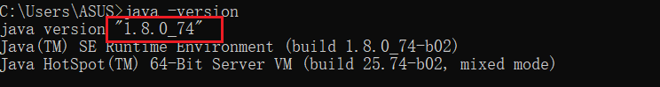
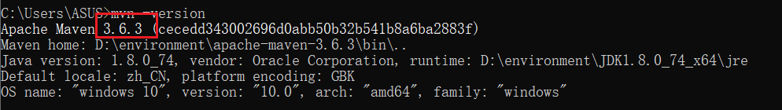

# SpringBoot2


## 笔记

### SpringBoot2核心技术

- [x] [Spring与SpringBoot](尚硅谷学习笔记/尚硅谷-雷丰阳-SpringBoot2/SpringBoot2核心技术/01-Spring与SpringBoot.md)
- [x] [SpringBoot2入门](尚硅谷学习笔记/尚硅谷-雷丰阳-SpringBoot2/SpringBoot2核心技术/02-SpringBoot2入门.md)
- [x] [自动装配原理](尚硅谷学习笔记/尚硅谷-雷丰阳-SpringBoot2/SpringBoot2核心技术/03-了解自动装配原理.md)
- [x] [配置文件](尚硅谷学习笔记/尚硅谷-雷丰阳-SpringBoot2/SpringBoot2核心技术/04-配置文件.md)
- [ ] [Web开发](尚硅谷学习笔记/尚硅谷-雷丰阳-SpringBoot2/SpringBoot2核心技术/05-Web开发.md)
- [ ] [数据访问](尚硅谷学习笔记/尚硅谷-雷丰阳-SpringBoot2/SpringBoot2核心技术/06-数据访问.md)
- [ ] [单元测试](尚硅谷学习笔记/尚硅谷-雷丰阳-SpringBoot2/SpringBoot2核心技术/07-单元测试.md)
- [ ] [指标监控](尚硅谷学习笔记/尚硅谷-雷丰阳-SpringBoot2/SpringBoot2核心技术/08-指标监控.md)
- [ ] [原理解析](尚硅谷学习笔记/尚硅谷-雷丰阳-SpringBoot2/SpringBoot2核心技术/09-原理解析.md)

### SpringBoot2响应式编程

```
- [ ] [](尚硅谷学习笔记/尚硅谷-雷丰阳-SpringBoot2/SpringBoot2响应式编程/.md)
- [ ] [](尚硅谷学习笔记/尚硅谷-雷丰阳-SpringBoot2/SpringBoot2响应式编程/.md)
- [ ] [](尚硅谷学习笔记/尚硅谷-雷丰阳-SpringBoot2/SpringBoot2响应式编程/.md)
- [ ] [](尚硅谷学习笔记/尚硅谷-雷丰阳-SpringBoot2/SpringBoot2响应式编程/.md)
- [ ] [](尚硅谷学习笔记/尚硅谷-雷丰阳-SpringBoot2/SpringBoot2响应式编程/.md)
- [ ] [](尚硅谷学习笔记/尚硅谷-雷丰阳-SpringBoot2/SpringBoot2响应式编程/.md)
- [ ] [](尚硅谷学习笔记/尚硅谷-雷丰阳-SpringBoot2/SpringBoot2响应式编程/.md)
- [ ] [](尚硅谷学习笔记/尚硅谷-雷丰阳-SpringBoot2/SpringBoot2响应式编程/.md)

```


## 参考

> 视频地址: https://www.bilibili.com/video/BV19K4y1L7MT
>
> 文档地址: https://www.yuque.com/atguigu/springboot
>
> 代码地址:https://gitee.com/leifengyang/springboot2

## 前置知识和环境说明

> SpringBoot2的学习要求:
>
> - 熟悉Spring基础
> - 熟悉Maven使用
>
> 环境要求:
>
> - Java8及以上
>
>   
>
> - Maven 3.3及以上：https://docs.spring.io/spring-boot/docs/current/reference/html/getting-started.html#getting-started-system-requirements
>
>   
>
>   