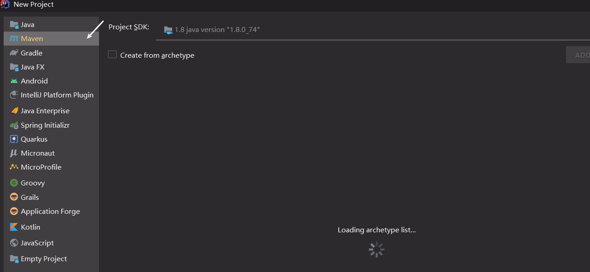

# SpringBoot2入门

## 1. 系统要求

- [Java 8](https://www.java.com/) & 兼容java14 .
- Maven 3.3+
- idea 2019.1.2

### 1.1 maven设置

maven的*setting.xml*配置

```xml
<!--阿里云镜像-->
<mirrors>
      <mirror>
        <id>nexus-aliyun</id>
        <mirrorOf>central</mirrorOf>
        <name>Nexus aliyun</name>
        <url>http://maven.aliyun.com/nexus/content/groups/public</url>
      </mirror>
  </mirrors>
```

```xml
<!--jdk1.8-->
<profiles>
    <profile>
        <id>jdk-1.8</id>
        <activation>
            <activeByDefault>true</activeByDefault>
            <jdk>1.8</jdk>
        </activation>
        <properties>
            <maven.compiler.source>1.8</maven.compiler.source>
            <maven.compiler.target>1.8</maven.compiler.target>
            <maven.compiler.compilerVersion>1.8</maven.compiler.compilerVersion>
        </properties>
    </profile>
</profiles>
```


## 2. HelloWorld

**【需求】**：浏览发送`http://localhost:8888/hello`请求，响应 Hello，Spring Boot 2 

### 2.1 创建maven工程




### 2.2 引入依赖

*pomx.ml文件中引入下面的配置*

```xml
<!--父工程-->
<parent>
    <groupId>org.springframework.boot</groupId>
    <artifactId>spring-boot-starter-parent</artifactId>
    <version>2.3.4.RELEASE</version>
</parent>
```

```xml
<dependencies>
    <!--springbootWeb场景启动器-->
    <dependency>
        <groupId>org.springframework.boot</groupId>
        <artifactId>spring-boot-starter-web</artifactId>
    </dependency>
</dependencies>
```


### 2.3 创建主程序

```java
/**
 * 主程序类
 * @SpringBootApplication：这是一个SpringBoot应用
 */
@SpringBootApplication
public class MainApplication {
    public static void main(String[] args) {
        SpringApplication.run(MainApplication.class,args);
    }
}
```

### 2.4 编写业务

```java
/**
 * @Controller: 表明这是一个controller
 * @ResponseBody: 可以用在方法上,可以用在类上,返回到浏览器的是字符串
 * @Controller+@ResponseBody 等价于 @RestController
 */
@RestController
public class HelloController {
    @RequestMapping("/hello")
    public String handl01(){
        return "Hello,Spring Boot2";
    }
}
```


### 2.5 测试

*直接运行主程序类的main方法即可*

服务运行端口: 


测试结果:


### 2.6 简化配置

spring的配置都是在一个名字固定的`application.properties`文件中进行配置,这个文件中可以对spring的常用功能进行自己配置如果没有配置,就是默认自带的


**application.properties**

```properties
# 配置端口号
server.port=8888
```

将端口配置为8888后重新启动端口后,通过8888端口访问hello请求


官方文档的配置: https://docs.spring.io/spring-boot/docs/current/reference/html/appendix-application-properties.html#common-application-properties


### 2.7 简化部署

*将编写的项目打包成一个jar包*

*官方文档: https://docs.spring.io/spring-boot/docs/current/reference/html/getting-started.html#getting-started-first-application-executable-jar*

把项目打成jar包，直接在目标服务器执行即可。

jar包的依赖: 

```xml
<build>
    <!--打jar包-->
    <plugins>
        <plugin>
            <groupId>org.springframework.boot</groupId>
            <artifactId>spring-boot-maven-plugin</artifactId>
        </plugin>
    </plugins>
</build>
```

idea打jar包操作:


执行结果:


然后我们就可以通过`javar -jar jar文件名`直接运行这个jar包了


注意点：

- 取消掉cmd的快速编辑模式

  

