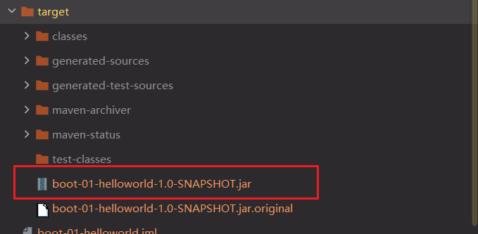
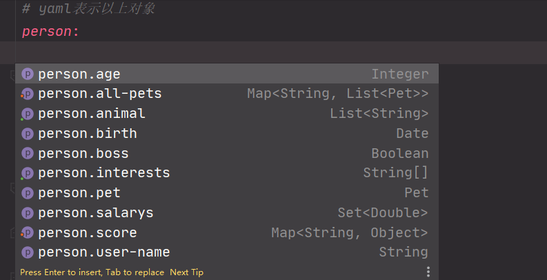

# SpringBoot2.X核心技术与响应式编程

> 视频: https://www.bilibili.com/video/BV19K4y1L7MT 文档: https://www.yuque.com/atguigu/springboot 代码:https://gitee.com/leifengyang/springboot2

## 前置知识和环境说明

**SpringBoot2的学习要求:**

- 熟悉Spring基础
- 熟悉Maven使用

**环境要求:**

- Java8及以上

  

- Maven 3.3及以上：https://docs.spring.io/spring-boot/docs/current/reference/html/getting-started.html#getting-started-system-requirements

  

---

## 第一章: Spring与SpringBoot2

### 1. Spring能做什么

#### 1.1 Spring的能力

**Spring可以做:**

- Micros微服务开发
- 响应式编程(异步非阻塞)
- 分布式云开发
- web开发
- 无服务开发(函数式服务)
- 实践驱动
- 批处理


#### 1.2 Spring的生态

所有的Spring框架构成了Spring的生态圈,统称为Spring

https://spring.io/projects/spring-boot

Spring覆盖了：

- web开发
- 数据访问
- 安全控制
- 分布式
- 消息服务
- 移动开发
- 批处理
- ......

#### 1.3 Spring5的重大升级

##### 1.3.1 响应式编程


##### 1.3.2 内部源码设计

基于Java8的一些新特性,如：接口默认实现。重新设计源码架构。

#### 2. 为什么用SpringBoot

> Spring Boot makes it easy to create stand-alone, production-grade Spring based Applications that you can "just run".
>
> 
>
> - SpirngBoot简化的Spring的配置操作,让我们不再关注配置,而只关注于业务的开发
> - SpringBoot能快速创建出生产级别的Spring应用,让我们以后的开发变得简单

##### 2.1 SpringBoot优点

- Create stand-alone Spring applications

- - 创建独立Spring应用

- Embed Tomcat, Jetty or Undertow directly (no need to deploy WAR files)

- - 内嵌web服务器

- Provide opinionated 'starter' dependencies to simplify your build configuration

- - 自动starter依赖，简化构建配置

- Automatically configure Spring and 3rd party libraries whenever possible

- - 自动配置Spring以及第三方功能

- Provide production-ready features such as metrics, health checks, and externalized configuration

- - 提供生产级别的监控、健康检查及外部化配置

- Absolutely no code generation and no requirement for XML configuration

- - 无代码生成、无需编写XML


> SpringBoot是整合Spring技术栈的一站式框架
>
> SpringBoot是简化Spring技术栈的快速开发脚手架

##### 2.2 SpringBoot缺点

- 人称版本帝，迭代快，需要时刻关注变化

- 封装太深，内部原理复杂，不容易精通

#### 3. 时代背景

##### 3.1 微服务

[James Lewis and Martin Fowler (2014)](https://martinfowler.com/articles/microservices.html)  提出微服务完整概念。https://martinfowler.com/microservices/

> In short, the **microservice architectural style** is an approach to developing a single application as a **suite of small services**, each **running in its own process** and communicating with **lightweight** mechanisms, often an **HTTP** resource API. These services are **built around business capabilities** and **independently deployable** by fully **automated deployment** machinery. There is a **bare minimum of centralized management** of these services, which may be **written in different programming languages** and use different data storage technologies.-- [James Lewis and Martin Fowler (2014)](https://martinfowler.com/articles/microservices.html)

- 微服务是一种架构风格
- 一个应用拆分为一组小型服务
- 每个服务运行在自己的进程内，也就是可独立部署和升级
- 服务之间使用轻量级HTTP交互
- 服务围绕业务功能拆分
- 可以由全自动部署机制独立部署
- 去中心化，服务自治。服务可以使用不同的语言、不同的存储技术

##### 3.2 分布式


**分布式的困难**

- 远程调用
- 服务发现
- 负载均衡
- 服务容错
- 配置管理
- 服务监控
- 链路追踪
- 日志管理
- 任务调度
- ......

**分布式的解决**

- SpringBoot + SpringCloud

  

##### 3.3 云原生

原生应用如何上云。 Cloud Native


**上云的困难**

- 服务自愈
- 弹性伸缩
- 服务隔离
- 自动化部署
- 灰度发布
- 流量治理
- ......

**上云的解决**


### 4. 如何学习SpringBoot

#### 4.1 官网文档架构

https://docs.spring.io/spring-boot/docs/current/reference/html/


查看版本新特性；

https://github.com/spring-projects/spring-boot/wiki#release-notes


---

## 第二章: SpringBoot2入门


### 1. 系统要求

- [Java 8](https://www.java.com/) & 兼容java14 .
- Maven 3.3+
- idea 2019.1.2

#### 1.1 maven设置

maven的*setting.xml*配置

```xml
<!--阿里云镜像-->
<mirrors>
      <mirror>
        <id>nexus-aliyun</id>
        <mirrorOf>central</mirrorOf>
        <name>Nexus aliyun</name>
        <url>http://maven.aliyun.com/nexus/content/groups/public</url>
      </mirror>
  </mirrors>
```

```xml
<!--jdk1.8-->
<profiles>
    <profile>
        <id>jdk-1.8</id>
        <activation>
            <activeByDefault>true</activeByDefault>
            <jdk>1.8</jdk>
        </activation>
        <properties>
            <maven.compiler.source>1.8</maven.compiler.source>
            <maven.compiler.target>1.8</maven.compiler.target>
            <maven.compiler.compilerVersion>1.8</maven.compiler.compilerVersion>
        </properties>
    </profile>
</profiles>
```


### 2. HelloWorld

**【需求】**：浏览发送`http://localhost:8888/hello`请求，响应 Hello，Spring Boot 2 

#### 2.1 创建maven工程


#### 2.2 引入依赖

*pomx.ml文件中引入下面的配置*

```xml
<!--父工程-->
<parent>
    <groupId>org.springframework.boot</groupId>
    <artifactId>spring-boot-starter-parent</artifactId>
    <version>2.3.4.RELEASE</version>
</parent>
```

```xml
<dependencies>
    <!--springbootWeb场景启动器-->
    <dependency>
        <groupId>org.springframework.boot</groupId>
        <artifactId>spring-boot-starter-web</artifactId>
    </dependency>
</dependencies>
```


#### 2.3 创建主程序

```java
/**
 * 主程序类
 * @SpringBootApplication：这是一个SpringBoot应用
 */
@SpringBootApplication
public class MainApplication {
    public static void main(String[] args) {
        SpringApplication.run(MainApplication.class,args);
    }
}
```

#### 2.4 编写业务

```java
/**
 * @Controller: 表明这是一个controller
 * @ResponseBody: 可以用在方法上,可以用在类上,返回到浏览器的是字符串
 * @Controller+@ResponseBody 等价于 @RestController
 */
@RestController
public class HelloController {
    @RequestMapping("/hello")
    public String handl01(){
        return "Hello,Spring Boot2";
    }
}
```


#### 2.5 测试

*直接运行主程序类的main方法即可*

服务运行端口: 


测试结果:


#### 2.6 简化配置

spring的配置都是在一个名字固定的`application.properties`文件中进行配置,这个文件中可以对spring的常用功能进行自己配置如果没有配置,就是默认自带的


**application.properties**

```properties
# 配置端口号
server.port=8888
```

将端口配置为8888后重新启动端口后,通过8888端口访问hello请求


官方文档的配置: https://docs.spring.io/spring-boot/docs/current/reference/html/appendix-application-properties.html#common-application-properties


#### 2.7 简化部署

*将编写的项目打包成一个jar包*

*官方文档: https://docs.spring.io/spring-boot/docs/current/reference/html/getting-started.html#getting-started-first-application-executable-jar*

把项目打成jar包，直接在目标服务器执行即可。

jar包的依赖: 

```xml
<build>
    <!--打jar包-->
    <plugins>
        <plugin>
            <groupId>org.springframework.boot</groupId>
            <artifactId>spring-boot-maven-plugin</artifactId>
        </plugin>
    </plugins>
</build>
```

idea打jar包操作:


执行结果:



然后我们就可以通过`javar -jar jar文件名`直接运行这个jar包了


注意点：

- 取消掉cmd的快速编辑模式

  

---

## 第三章: 了解自动装配原理

### 1. SpringBoot特点

#### 1.1 依赖管理

- 父项目做依赖版本

  通过下面的流程,可以知道为什么使用springboot的时候使用其他依赖不需要编写版本号,就是因为底层自动仲裁好了的

  ```xml
  <!--依赖管理-->
  <parent>
      <groupId>org.springframework.boot</groupId>
      <artifactId>spring-boot-starter-parent</artifactId>
      <version>2.3.4.RELEASE</version>
  </parent>
  ```

  ```xml
  <!--他的父项目-->
  <parent>
      <groupId>org.springframework.boot</groupId>
      <artifactId>spring-boot-dependencies</artifactId>
      <version>2.3.4.RELEASE</version>
  </parent>
  
  ```

  ```xml
  <!--几乎声明了所有开发中常用的依赖的版本号,自动版本仲裁机制-->
  <properties>
      <activemq.version>5.15.13</activemq.version>
      <antlr2.version>2.7.7</antlr2.version>
      <appengine-sdk.version>1.9.82</appengine-sdk.version>
      <artemis.version>2.12.0</artemis.version>
      <aspectj.version>1.9.6</aspectj.version>
      <assertj.version>3.16.1</assertj.version>
      <atomikos.version>4.0.6</atomikos.version>
      <awaitility.version>4.0.3</awaitility.version>
      <bitronix.version>2.1.4</bitronix.version>
      <build-helper-maven-plugin.version>3.1.0</build-helper-maven-plugin.version>
      <byte-buddy.version>1.10.14</byte-buddy.version>
      <caffeine.version>2.8.5</caffeine.version>
      <cassandra-driver.version>4.6.1</cassandra-driver.version>
      <classmate.version>1.5.1</classmate.version>
      <commons-codec.version>1.14</commons-codec.version>
      <commons-dbcp2.version>2.7.0</commons-dbcp2.version>
      <commons-lang3.version>3.10</commons-lang3.version>
      <commons-pool.version>1.6</commons-pool.version>
      <commons-pool2.version>2.8.1</commons-pool2.version>
      <couchbase-client.version>3.0.8</couchbase-client.version>
      <db2-jdbc.version>11.5.4.0</db2-jdbc.version>
      <dependency-management-plugin.version>1.0.10.RELEASE</dependency-management-plugin.version>
      <derby.version>10.14.2.0</derby.version>
      <dropwizard-metrics.version>4.1.12.1</dropwizard-metrics.version>
      <ehcache.version>2.10.6</ehcache.version>
      <ehcache3.version>3.8.1</ehcache3.version>
      <elasticsearch.version>7.6.2</elasticsearch.version>
      <embedded-mongo.version>2.2.0</embedded-mongo.version>
      <exec-maven-plugin.version>1.6.0</exec-maven-plugin.version>
      <flatten-maven-plugin.version>1.2.5</flatten-maven-plugin.version>
      <flyway.version>6.4.4</flyway.version>
      <freemarker.version>2.3.30</freemarker.version>
      <git-commit-id-plugin.version>3.0.1</git-commit-id-plugin.version>
      <glassfish-el.version>3.0.3</glassfish-el.version>
      <glassfish-jaxb.version>2.3.3</glassfish-jaxb.version>
      <groovy.version>2.5.13</groovy.version>
      <gson.version>2.8.6</gson.version>
      <h2.version>1.4.200</h2.version>
      <hamcrest.version>2.2</hamcrest.version>
      <hazelcast.version>3.12.9</hazelcast.version>
      <hazelcast-hibernate5.version>1.3.2</hazelcast-hibernate5.version>
      <hibernate.version>5.4.21.Final</hibernate.version>
      <hibernate-validator.version>6.1.5.Final</hibernate-validator.version>
      <hikaricp.version>3.4.5</hikaricp.version>
      <hsqldb.version>2.5.1</hsqldb.version>
      <htmlunit.version>2.40.0</htmlunit.version>
      <httpasyncclient.version>4.1.4</httpasyncclient.version>
      <httpclient.version>4.5.12</httpclient.version>
      <httpcore.version>4.4.13</httpcore.version>
      <infinispan.version>10.1.8.Final</infinispan.version>
      <influxdb-java.version>2.18</influxdb-java.version>
      <jackson-bom.version>2.11.2</jackson-bom.version>
      <jakarta-activation.version>1.2.2</jakarta-activation.version>
      <jakarta-annotation.version>1.3.5</jakarta-annotation.version>
      <jakarta-jms.version>2.0.3</jakarta-jms.version>
      <jakarta-json.version>1.1.6</jakarta-json.version>
      <jakarta-json-bind.version>1.0.2</jakarta-json-bind.version>
      <jakarta-mail.version>1.6.5</jakarta-mail.version>
      <jakarta-persistence.version>2.2.3</jakarta-persistence.version>
      <jakarta-servlet.version>4.0.4</jakarta-servlet.version>
      <jakarta-servlet-jsp-jstl.version>1.2.7</jakarta-servlet-jsp-jstl.version>
      <jakarta-transaction.version>1.3.3</jakarta-transaction.version>
      <jakarta-validation.version>2.0.2</jakarta-validation.version>
      <jakarta-websocket.version>1.1.2</jakarta-websocket.version>
      <jakarta-ws-rs.version>2.1.6</jakarta-ws-rs.version>
      <jakarta-xml-bind.version>2.3.3</jakarta-xml-bind.version>
      <jakarta-xml-soap.version>1.4.2</jakarta-xml-soap.version>
      <jakarta-xml-ws.version>2.3.3</jakarta-xml-ws.version>
      <janino.version>3.1.2</janino.version>
      <javax-activation.version>1.2.0</javax-activation.version>
      <javax-annotation.version>1.3.2</javax-annotation.version>
      <javax-cache.version>1.1.1</javax-cache.version>
      <javax-jaxb.version>2.3.1</javax-jaxb.version>
      <javax-jaxws.version>2.3.1</javax-jaxws.version>
      <javax-jms.version>2.0.1</javax-jms.version>
      <javax-json.version>1.1.4</javax-json.version>
      <javax-jsonb.version>1.0</javax-jsonb.version>
      <javax-mail.version>1.6.2</javax-mail.version>
      <javax-money.version>1.0.3</javax-money.version>
      <javax-persistence.version>2.2</javax-persistence.version>
      <javax-transaction.version>1.3</javax-transaction.version>
      <javax-validation.version>2.0.1.Final</javax-validation.version>
      <javax-websocket.version>1.1</javax-websocket.version>
      <jaxen.version>1.2.0</jaxen.version>
      <jaybird.version>3.0.9</jaybird.version>
      <jboss-logging.version>3.4.1.Final</jboss-logging.version>
      <jboss-transaction-spi.version>7.6.0.Final</jboss-transaction-spi.version>
      <jdom2.version>2.0.6</jdom2.version>
      <jedis.version>3.3.0</jedis.version>
      <jersey.version>2.30.1</jersey.version>
      <jetty-el.version>8.5.54</jetty-el.version>
      <jetty-jsp.version>2.2.0.v201112011158</jetty-jsp.version>
      <jetty-reactive-httpclient.version>1.1.4</jetty-reactive-httpclient.version>
      <jetty.version>9.4.31.v20200723</jetty.version>
      <jmustache.version>1.15</jmustache.version>
      <johnzon.version>1.2.8</johnzon.version>
      <jolokia.version>1.6.2</jolokia.version>
      <jooq.version>3.13.4</jooq.version>
      <json-path.version>2.4.0</json-path.version>
      <json-smart.version>2.3</json-smart.version>
      <jsonassert.version>1.5.0</jsonassert.version>
      <jstl.version>1.2</jstl.version>
      <jtds.version>1.3.1</jtds.version>
      <junit.version>4.13</junit.version>
      <junit-jupiter.version>5.6.2</junit-jupiter.version>
      <kafka.version>2.5.1</kafka.version>
      <kotlin.version>1.3.72</kotlin.version>
      <kotlin-coroutines.version>1.3.8</kotlin-coroutines.version>
      <lettuce.version>5.3.4.RELEASE</lettuce.version>
      <liquibase.version>3.8.9</liquibase.version>
      <log4j2.version>2.13.3</log4j2.version>
      <logback.version>1.2.3</logback.version>
      <lombok.version>1.18.12</lombok.version>
      <mariadb.version>2.6.2</mariadb.version>
      <maven-antrun-plugin.version>1.8</maven-antrun-plugin.version>
      <maven-assembly-plugin.version>3.3.0</maven-assembly-plugin.version>
      <maven-clean-plugin.version>3.1.0</maven-clean-plugin.version>
      <maven-compiler-plugin.version>3.8.1</maven-compiler-plugin.version>
      <maven-dependency-plugin.version>3.1.2</maven-dependency-plugin.version>
      <maven-deploy-plugin.version>2.8.2</maven-deploy-plugin.version>
      <maven-enforcer-plugin.version>3.0.0-M3</maven-enforcer-plugin.version>
      <maven-failsafe-plugin.version>2.22.2</maven-failsafe-plugin.version>
      <maven-help-plugin.version>3.2.0</maven-help-plugin.version>
      <maven-install-plugin.version>2.5.2</maven-install-plugin.version>
      <maven-invoker-plugin.version>3.2.1</maven-invoker-plugin.version>
      <maven-jar-plugin.version>3.2.0</maven-jar-plugin.version>
      <maven-javadoc-plugin.version>3.2.0</maven-javadoc-plugin.version>
      <maven-resources-plugin.version>3.1.0</maven-resources-plugin.version>
      <maven-shade-plugin.version>3.2.4</maven-shade-plugin.version>
      <maven-source-plugin.version>3.2.1</maven-source-plugin.version>
      <maven-surefire-plugin.version>2.22.2</maven-surefire-plugin.version>
      <maven-war-plugin.version>3.2.3</maven-war-plugin.version>
      <micrometer.version>1.5.5</micrometer.version>
      <mimepull.version>1.9.13</mimepull.version>
      <mockito.version>3.3.3</mockito.version>
      <mongodb.version>4.0.5</mongodb.version>
      <mssql-jdbc.version>7.4.1.jre8</mssql-jdbc.version>
      <mysql.version>8.0.21</mysql.version>
      <nekohtml.version>1.9.22</nekohtml.version>
      <neo4j-ogm.version>3.2.16</neo4j-ogm.version>
      <netty.version>4.1.52.Final</netty.version>
      <netty-tcnative.version>2.0.34.Final</netty-tcnative.version>
      <nio-multipart-parser.version>1.1.0</nio-multipart-parser.version>
      <oauth2-oidc-sdk.version>7.1.1</oauth2-oidc-sdk.version>
      <nimbus-jose-jwt.version>8.19</nimbus-jose-jwt.version>
      <ojdbc.version>19.3.0.0</ojdbc.version>
      <okhttp3.version>3.14.9</okhttp3.version>
      <oracle-database.version>19.3.0.0</oracle-database.version>
      <pooled-jms.version>1.1.2</pooled-jms.version>
      <postgresql.version>42.2.16</postgresql.version>
      <prometheus-pushgateway.version>0.9.0</prometheus-pushgateway.version>
      <quartz.version>2.3.2</quartz.version>
      <querydsl.version>4.3.1</querydsl.version>
      <r2dbc-bom.version>Arabba-SR7</r2dbc-bom.version>
      <rabbit-amqp-client.version>5.9.0</rabbit-amqp-client.version>
      <reactive-streams.version>1.0.3</reactive-streams.version>
      <reactor-bom.version>Dysprosium-SR12</reactor-bom.version>
      <rest-assured.version>3.3.0</rest-assured.version>
      <rsocket.version>1.0.2</rsocket.version>
      <rxjava.version>1.3.8</rxjava.version>
      <rxjava-adapter.version>1.2.1</rxjava-adapter.version>
      <rxjava2.version>2.2.19</rxjava2.version>
      <saaj-impl.version>1.5.2</saaj-impl.version>
      <selenium.version>3.141.59</selenium.version>
      <selenium-htmlunit.version>2.40.0</selenium-htmlunit.version>
      <sendgrid.version>4.4.8</sendgrid.version>
      <servlet-api.version>4.0.1</servlet-api.version>
      <slf4j.version>1.7.30</slf4j.version>
      <snakeyaml.version>1.26</snakeyaml.version>
      <solr.version>8.5.2</solr.version>
      <spring-amqp.version>2.2.11.RELEASE</spring-amqp.version>
      <spring-batch.version>4.2.4.RELEASE</spring-batch.version>
      <spring-data-releasetrain.version>Neumann-SR4</spring-data-releasetrain.version>
      <spring-framework.version>5.2.9.RELEASE</spring-framework.version>
      <spring-hateoas.version>1.1.2.RELEASE</spring-hateoas.version>
      <spring-integration.version>5.3.2.RELEASE</spring-integration.version>
      <spring-kafka.version>2.5.6.RELEASE</spring-kafka.version>
      <spring-ldap.version>2.3.3.RELEASE</spring-ldap.version>
      <spring-restdocs.version>2.0.5.RELEASE</spring-restdocs.version>
      <spring-retry.version>1.2.5.RELEASE</spring-retry.version>
      <spring-security.version>5.3.4.RELEASE</spring-security.version>
      <spring-session-bom.version>Dragonfruit-SR1</spring-session-bom.version>
      <spring-ws.version>3.0.10.RELEASE</spring-ws.version>
      <sqlite-jdbc.version>3.31.1</sqlite-jdbc.version>
      <sun-mail.version>1.6.5</sun-mail.version>
      <thymeleaf.version>3.0.11.RELEASE</thymeleaf.version>
      <thymeleaf-extras-data-attribute.version>2.0.1</thymeleaf-extras-data-attribute.version>
      <thymeleaf-extras-java8time.version>3.0.4.RELEASE</thymeleaf-extras-java8time.version>
      <thymeleaf-extras-springsecurity.version>3.0.4.RELEASE</thymeleaf-extras-springsecurity.version>
      <thymeleaf-layout-dialect.version>2.4.1</thymeleaf-layout-dialect.version>
      <tomcat.version>9.0.38</tomcat.version>
      <unboundid-ldapsdk.version>4.0.14</unboundid-ldapsdk.version>
      <undertow.version>2.1.4.Final</undertow.version>
      <versions-maven-plugin.version>2.7</versions-maven-plugin.version>
      <webjars-hal-browser.version>3325375</webjars-hal-browser.version>
      <webjars-locator-core.version>0.45</webjars-locator-core.version>
      <wsdl4j.version>1.6.3</wsdl4j.version>
      <xml-maven-plugin.version>1.0.2</xml-maven-plugin.version>
      <xmlunit2.version>2.7.0</xmlunit2.version>
  </properties>
  ```

  

- 开发导入starter场景启动器

  - 1、见到很多` spring-boot-starter-* ` ： *就某种场景

  - 2、只要引入starter，这个场景的所有常规需要的依赖我们都自动引入

  - 3、SpringBoot所有支持的场景启动器
    https://docs.spring.io/spring-boot/docs/current/reference/html/using-spring-boot.html#using-boot-starter

  - 4、见到的  `*-spring-boot-starter`： 第三方为我们提供的简化开发的场景启动器。

  - 5、所有场景启动器最底层的依赖

    ```xml
    <dependency>
      <groupId>org.springframework.boot</groupId>
      <artifactId>spring-boot-starter</artifactId>
      <version>2.3.4.RELEASE</version>
      <scope>compile</scope>
    </dependency>
    ```

    

- 无需关注版本号，自动版本仲裁

  - 1、引入依赖默认都可以不写版本
  - 2、引入非版本仲裁的jar，要写版本号。

- 可以修改默认版本号

  - 1、查看spring-boot-dependencies里面规定当前依赖的版本 用的 key。

  - 2、在当前项目里面重写配置

    ```xml
    <!--非springboot自动仲裁的jar的版本配置-->
    <properties>
        <mysql.version>5.1.43</mysql.version>
    </properties>
    ```

- idea中的依赖分析

  

  

  

  

  

#### 1.2 自动配置

*主程序中项目中引入的组件*

```java
@SpringBootApplication
public class MainApplaction {
    public static void main(String[] args) {
        //1. 返回到我们的IOC容器中
        ConfigurableApplicationContext run = SpringApplication.run(MainApplaction.class, args);
        //2. 通过名字查看容器里面的组件
        String[] beanName = run.getBeanDefinitionNames();
        for(String names: beanName){
            System.out.println(names);
        }
    }
}
```

- 自动配好Tomcat

  - 引入Tomcat依赖。

    ```xml
    <dependency>
        <groupId>org.springframework.boot</groupId>
        <artifactId>spring-boot-starter-tomcat</artifactId>
        <version>2.3.4.RELEASE</version>
        <scope>compile</scope>
    </dependency>
    ```

  - 配置Tomcat

- 自动配好SpringMVC

- - 引入SpringMVC全套组件
  - 自动配好SpringMVC常用组件（功能）

- 自动配好Web常见功能，如：字符编码问题

- - SpringBoot帮我们配置好了所有web开发的常见场景

- 默认的包结构 *无法在主程序外面编写请求接口的原因*

- - 主程序所在包及其下面的所有子包里面的组件都会被默认扫描进来
  - 无需以前的包扫描配置
  - 想要改变扫描路径
    - `@SpringBootApplication(scanBasePackages="com.atguigu")`

- - - 或者`@ComponentScan` 指定扫描路径

  - ```java
    @SpringBootApplication
    // 等同于
    	@SpringBootConfiguration
    	@EnableAutoConfiguration
    	@ComponentScan("com.atguigu")
    ```

- 各种配置拥有默认值

- - 默认配置最终都是映射到某个类上，如：MultipartProperties
  - 配置文件的值最终会绑定每个类上，这个类会在容器中创建对象

- 按需加载所有自动配置项

- - 非常多的starter
  - 引入了哪些场景这个场景的自动配置才会开启
  - SpringBoot所有的**自动配置**功能都在 `spring-boot-autoconfigure` 包里面 

- ......

### 2. 容器功能

#### 2.1 组件添加

*将介绍SpringBoot中的几个基础组件注解的使用*

##### 2.1.1 @Configuration+@Bean

*@Configuration*注解用于标识这个类是一个配置类,一般会搭配 *@Bean*一起使用;@Configuration等同于springmvc中的配置文件,@Bean注解等同于Springmvc配置文件中的`<bean>`标签

###### 1. @Configuration与@Bean的基本使用

创建实体bean : user类和pet类

```java
public class User {
    private String name;
    private Integer age;
    private Pet pet;
    public User() {
    }
    public User(String name,Integer age){
        this.name = name;
        this.age = age;
    }
    public String getName() {
        return name;
    }
    public void setName(String name) {
        this.name = name;
    }
    public Integer getAge() {
        return age;
    }
    public void setAge(Integer age) {
        this.age = age;
    }
    public Pet getPet() {
        return pet;
    }
    public void setPet(Pet pet) {
        this.pet = pet;
    }
    @Override
    public String toString() {
        return "User{" +
                "name='" + name + '\'' +
                ", age=" + age +
                ", pet=" + pet +
                '}';
    }
}
```

```java
public class Pet {
    private String name;
    public String getName() {
        return name;
    }
    public Pet() {
    }
    public void setName(String name) {
        this.name = name;
    }
    public Pet(String name) {
        this.name = name;
    }
    @Override
    public String toString() {
        return "Pet{" +
                "name='" + name + '\'' +
                '}';
    }
}
```

编写config配置类

```java
/**
 * @Configuration: 告诉SpringBoot这是一个配置类,等同于以前的xx.xml配置文件
 * @Bean: 等同于xx.xml配置文件中的<bean>标签,
 */
@Configuration
public class MyConfig {
    @Bean
    public User user01(){ //以方法名作为组件的id , 返回类型就是组件类型 , 返回的对象就是组件在容器中保存的实例
        return new User("zhangsan",18);
    }

    @Bean("tom") //别名tom,不取别名就是方法名tomcat
    public Pet tomcat(){
        return new Pet("tomcat");
    }
}
```

主函数测试

```java
@SpringBootApplication
public class MainApplaction {
    public static void main(String[] args) {
        //1. 返回到我们的IOC容器中
        ConfigurableApplicationContext run = SpringApplication.run(MainApplaction.class, args);
        //2. 通过名字查看容器里面的组件
        String[] beanName = run.getBeanDefinitionNames();
        for(String names: beanName){
            System.out.println(names);
        }
    }
}
```

测试结果: 可以发现在容器中我们的config里面的bean已经被注册到Spring容器中了

###### 2. @Configuration注意点

1. 配置类里面使用@Bean标注在方法上给容器注册组件，默认也是单实例的

2. 配置类本身也是组件

3. Full模式与Lite模式

   最佳实践

   - 配置 类组件之间无依赖关系用Lite模式加速容器启动过程，减少判断
   - 配置类组件之间有依赖关系，方法会被调用得到之前单实例组件，用Full模式

- ```java
  #############################Configuration使用示例######################################################
  /**
   * 1、配置类里面使用@Bean标注在方法上给容器注册组件，默认也是单实例的
   * 2、配置类本身也是组件
   * 3、proxyBeanMethods：代理bean的方法
   *      Full(proxyBeanMethods = true)、【保证每个@Bean方法被调用多少次返回的组件都是单实例的】
   *      Lite(proxyBeanMethods = false)【每个@Bean方法被调用多少次返回的组件都是新创建的】
   *      组件依赖必须使用Full模式默认。其他默认是否Lite模式
   *
   *
   *
   */
  @Configuration(proxyBeanMethods = false) //告诉SpringBoot这是一个配置类 == 配置文件
  public class MyConfig {
  
      /**
       * Full:外部无论对配置类中的这个组件注册方法调用多少次获取的都是之前注册容器中的单实例对象
       * @return
       */
      @Bean //给容器中添加组件。以方法名作为组件的id。返回类型就是组件类型。返回的值，就是组件在容器中的实例
      public User user01(){
          User zhangsan = new User("zhangsan", 18);
          //user组件依赖了Pet组件
          zhangsan.setPet(tomcatPet());
          return zhangsan;
      }
  
      @Bean("tom")
      public Pet tomcatPet(){
          return new Pet("tomcat");
      }
  }
  
  
  
  ```

- ```java
  ################################@Configuration测试代码如下########################################
  @SpringBootConfiguration
  @EnableAutoConfiguration
  @ComponentScan("com.atguigu.boot")
  public class MainApplication {
  
      public static void main(String[] args) {
          //1、返回我们IOC容器
          ConfigurableApplicationContext run = SpringApplication.run(MainApplication.class, args);
  
          //2、查看容器里面的组件
          String[] names = run.getBeanDefinitionNames();
          for (String name : names) {
              System.out.println(name);
          }
  
          //3、从容器中获取组件
  
          Pet tom01 = run.getBean("tom", Pet.class);
  
          Pet tom02 = run.getBean("tom", Pet.class);
  
          System.out.println("组件："+(tom01 == tom02));
  
  
          //4、com.atguigu.boot.config.MyConfig$$EnhancerBySpringCGLIB$$51f1e1ca@1654a892
          MyConfig bean = run.getBean(MyConfig.class);
          System.out.println(bean);
  
          //如果@Configuration(proxyBeanMethods = true)代理对象调用方法。SpringBoot总会检查这个组件是否在容器中有。
          //保持组件单实例
          User user = bean.user01();
          User user1 = bean.user01();
          System.out.println(user == user1);
  
  
          User user01 = run.getBean("user01", User.class);
          Pet tom = run.getBean("tom", Pet.class);
  
          System.out.println("用户的宠物："+(user01.getPet() == tom));
  
  
  
      }
  }
  ```

##### 2.1.2 MVC层级组件注解

*这几个注解都是使用在类上面,在mvc三层架构中会分成不同的层; 这几个注解就是用于告诉SpringBoot表示不同层级关系的注解*

- **@Component**:基础注解

- **@Controller**: 标识这个类是controller层

- **@Service**:标识这个类是service层

- **@Repository**:标识这个类是数据持久层

##### 2.1.3 @ComponentScan、@Import

###### 1. @Import

 *给容器中自动创建出这两个类型的组件、默认组件的名字就是全类名*

```java
 * 4、@Import({User.class, DBHelper.class})
 *      给容器中自动创建出这两个类型的组件、默认组件的名字就是全类名
 *
 *
 *
 */

@Import({User.class, DBHelper.class})
@Configuration(proxyBeanMethods = false) //告诉SpringBoot这是一个配置类 == 配置文件
public class MyConfig {
}
```

@Import 高级用法： https://www.bilibili.com/video/BV1gW411W7wy?p=8

###### 2. @ComponentScan


##### 2.2.4 @Conditional

条件装配：满足Conditional指定的条件，则进行组件注入,否则无法注入

@Conditional的派生注解如下


###### 1. 测试@ConditionalOnMissingBean注解

```java
=====================测试条件装配==========================
@Configuration(proxyBeanMethods = false) //告诉SpringBoot这是一个配置类 == 配置文件
//@ConditionalOnBean(name = "tom")
@ConditionalOnMissingBean(name = "tom")
public class MyConfig {


    /**
     * Full:外部无论对配置类中的这个组件注册方法调用多少次获取的都是之前注册容器中的单实例对象
     * @return
     */

    @Bean //给容器中添加组件。以方法名作为组件的id。返回类型就是组件类型。返回的值，就是组件在容器中的实例
    public User user01(){
        User zhangsan = new User("zhangsan", 18);
        //user组件依赖了Pet组件
        zhangsan.setPet(tomcatPet());
        return zhangsan;
    }

    @Bean("tom22")
    public Pet tomcatPet(){
        return new Pet("tomcat");
    }
}

public static void main(String[] args) {
        //1、返回我们IOC容器
        ConfigurableApplicationContext run = SpringApplication.run(MainApplication.class, args);

        //2、查看容器里面的组件
        String[] names = run.getBeanDefinitionNames();
        for (String name : names) {
            System.out.println(name);
        }

        boolean tom = run.containsBean("tom");
        System.out.println("容器中Tom组件："+tom);

        boolean user01 = run.containsBean("user01");
        System.out.println("容器中user01组件："+user01);

        boolean tom22 = run.containsBean("tom22");
        System.out.println("容器中tom22组件："+tom22);


    }
```


#### 2.2 原生配置文件引入

##### 2.2.1 @ImportResource

*用于引入其他资源的,在一些传统的项目中,会存在一些bean的配置是使用xml文件进行编写的;如果我们不想手动的将这些xml配置文件转换成@Bean重新编写一次;我们可以通过@ImportResource导入xml配置资源*

beans.xml文件如下

```xml
<?xml version="1.0" encoding="UTF-8"?>
<beans xmlns="http://www.springframework.org/schema/beans"
       xmlns:xsi="http://www.w3.org/2001/XMLSchema-instance"
       xmlns:context="http://www.springframework.org/schema/context"
       xsi:schemaLocation="http://www.springframework.org/schema/beans http://www.springframework.org/schema/beans/spring-beans.xsd http://www.springframework.org/schema/context https://www.springframework.org/schema/context/spring-context.xsd">

    <bean id="haha" class="com.atguigu.boot.bean.User">
        <property name="name" value="zhangsan"></property>
        <property name="age" value="18"></property>
    </bean>

    <bean id="hehe" class="com.atguigu.boot.bean.Pet">
        <property name="name" value="tomcat"></property>
    </bean>
</beans>
```

MyConfig.java

```java
/**
 * @ImportResource("classpath:beans.xml") 导入老项目中的的xml
 */
@Configuration
@ImportResource("classpath:beans.xml")
public class MyConfig {
    
}
```

测试结果: 可以发现beans中的bean已经被注册到了容器中

```java
@SpringBootApplication
public class MainApplaction {
    public static void main(String[] args) {
        //1. 返回到我们的IOC容器中
        ConfigurableApplicationContext run = SpringApplication.run(MainApplaction.class, args);
        //2. 判断
        boolean haha = run.containsBean("haha");
        boolean hehe = run.containsBean("hehe");
        System.out.println("haha:"+haha); //haha: true
        System.out.println("hehe:"+hehe); //hehe: true
    }
}
```


```java
@ImportResource("classpath:beans.xml")
public class MyConfig {}

======================测试=================
        boolean haha = run.containsBean("haha");
        boolean hehe = run.containsBean("hehe");
        System.out.println("haha："+haha);//true
        System.out.println("hehe："+hehe);//true
```


#### 2.3 配置绑定

场景: 如何使用Java读取到properties文件中的内容，并且把它封装到JavaBean中，以供随时使用；

application.properties

```properties
server.port=8888
```

```java
public class getProperties {
     public static void main(String[] args) throws FileNotFoundException, IOException {
         Properties pps = new Properties();
         pps.load(new FileInputStream("a.properties"));
         Enumeration enum1 = pps.propertyNames();//得到配置文件的名字
         while(enum1.hasMoreElements()) {
             String strKey = (String) enum1.nextElement();
             String strValue = pps.getProperty(strKey);
             System.out.println(strKey + "=" + strValue);
             //封装到JavaBean。
         }
     }
 }
```

##### 2.3.1 @ConfigurationProperties

*用于将properties中配置的属性和javabean进行绑定;搭配@Component一起使用*

application.propertiex

```properties
# 配置spring的端口
server.port=8888
# 文件上传的最大限制配置
spring.servlet.multipart.max-file-size=10MB

# 自定义的maycar
mycar.brand=BYD
mycar.price=100000
```

javabean类

```java
/**
 * @Component: 只有在容器中的组件，才会拥有SpringBoot提供的强大功能
 */
@Component
@ConfigurationProperties(prefix = "mycar") //prefix指定配置中的前缀
public class Car {
    private String brand;
    private Integer price;
    public Car() {
    }
    public Car(String brand, Integer price) {
        this.brand = brand;
        this.price = price;
    }
    public String getBrand() {
        return brand;
    }
    public void setBrand(String brand) {
        this.brand = brand;
    }
    public Integer getPrice() {
        return price;
    }
    public void setPrice(Integer price) {
        this.price = price;
    }
    @Override
    public String toString() {
        return "Car{" +
                "brand='" + brand + '\'' +
                ", price=" + price +
                '}';
    }
}
```

测试类

```java
@RestController
public class HelloController {
    @Autowired
    Car car;
    @RequestMapping("/car")
    public Car car(){
        return car;
    }
}
```

测试结果:


##### 2.3.2 @EnableConfigurationProperties + @ConfigurationProperties

*也可用于将properties中配置的属性和javabean进行绑定;需要搭配@Configuration三者一起使用;和上面的方式区别在于不需要借助@Conmment放在容器中*

@EnableConfigurationProperties有两个作用: 

1. 开启配置绑定功能

2. 把这个组件自动注册到容器中

javabean

```java
//@Component
@ConfigurationProperties(prefix = "mycar") //prefix指定配置中的前缀
public class Car {
    private String brand;
    private Integer price;
    public Car() {
    }
    public Car(String brand, Integer price) {
        this.brand = brand;
        this.price = price;
    }
    public String getBrand() {
        return brand;
    }
    public void setBrand(String brand) {
        this.brand = brand;
    }
    public Integer getPrice() {
        return price;
    }
    public void setPrice(Integer price) {
        this.price = price;
    }
    @Override
    public String toString() {
        return "Car{" +
                "brand='" + brand + '\'' +
                ", price=" + price +
                '}';
    }
}
```

myconfig.java

```java
@Configuration
@EnableConfigurationProperties(Car.class)
/*
@EnableConfigurationProperties
1、开启Car配置绑定功触
2、把这个Car这个组件自动注册到容器中
*/
public class MyConfig {

}
```

测试

```java
@RestController
public class HelloController {
    @Autowired
    Car car;
    @RequestMapping("/car")
    public Car car(){
        return car;
    }
}
```


测试结果:


##### 2.3.3 @Component + @ConfigurationProperties

```java
@EnableConfigurationProperties(Car.class)
//1、开启Car配置绑定功能
//2、把这个Car这个组件自动注册到容器中
public class MyConfig {
}
```


### 3. 自动配置原理入门

#### 3.1 引导加载自动配置类

@SpringBootApplication启动注解由以下三个合成注解合成

```java
@SpringBootConfiguration
@EnableAutoConfiguration
@ComponentScan(excludeFilters = { @Filter(type = FilterType.CUSTOM, classes = TypeExcludeFilter.class),
		@Filter(type = FilterType.CUSTOM, classes = AutoConfigurationExcludeFilter.class) })
public @interface SpringBootApplication{}
```

##### 3.1.1 @SpringBootConfiguration

@SpringBootConfiguration由以下注解合成

```java
@Target(ElementType.TYPE)
@Retention(RetentionPolicy.RUNTIME)
@Documented
@Configuration //代表当前类是一个配置类
public @interface SpringBootConfiguration {}
```

##### 3.1.2 @ComponentScan

指定扫描哪些，Spring注解；


##### 3.1.3 @EnableAutoConfiguration

```java
@AutoConfigurationPackage
@Import(AutoConfigurationImportSelector.class)
public @interface EnableAutoConfiguration {}
```

###### 1. @AutoConfigurationPackage

作用: 自动配置包,指定了默认的包规则

```java
@Import(AutoConfigurationPackages.Registrar.class)  //给容器中导入一个组件
public @interface AutoConfigurationPackage {}
//利用Registrar给容器中导入一系列组件
//将指定的一个包下的所有组件导入进来？MainApplication 所在包下。
```

###### 2. @Import(AutoConfigurationImportSelector.class)

```java
/*
1、利用getAutoConfigurationEntry(annotationMetadata);给容器中批量导入一些组件
2、调用List<String> configurations = getCandidateConfigurations(annotationMetadata, attributes)获取到所有需要导入到容器中的配置类
3、利用工厂加载 Map<String, List<String>> loadSpringFactories(@Nullable ClassLoader classLoader)；得到所有的组件
4、从META-INF/spring.factories位置来加载一个文件。
	默认扫描我们当前系统里面所有META-INF/spring.factories位置的文件
    spring-boot-autoconfigure-2.3.4.RELEASE.jar包里面也有META-INF/spring.factories
*/
```

```
文件里面写死了spring-boot一启动就要给容器中加载的所有配置类
spring-boot-autoconfigure-2.3.4.RELEASE.jar/META-INF/spring.factories
# Auto Configure
org.springframework.boot.autoconfigure.EnableAutoConfiguration=\
org.springframework.boot.autoconfigure.admin.SpringApplicationAdminJmxAutoConfiguration,\
org.springframework.boot.autoconfigure.aop.AopAutoConfiguration,\
org.springframework.boot.autoconfigure.amqp.RabbitAutoConfiguration,\
org.springframework.boot.autoconfigure.batch.BatchAutoConfiguration,\
org.springframework.boot.autoconfigure.cache.CacheAutoConfiguration,\
org.springframework.boot.autoconfigure.cassandra.CassandraAutoConfiguration,\
org.springframework.boot.autoconfigure.context.ConfigurationPropertiesAutoConfiguration,\
org.springframework.boot.autoconfigure.context.LifecycleAutoConfiguration,\
org.springframework.boot.autoconfigure.context.MessageSourceAutoConfiguration,\
org.springframework.boot.autoconfigure.context.PropertyPlaceholderAutoConfiguration,\
org.springframework.boot.autoconfigure.couchbase.CouchbaseAutoConfiguration,\
org.springframework.boot.autoconfigure.dao.PersistenceExceptionTranslationAutoConfiguration,\
org.springframework.boot.autoconfigure.data.cassandra.CassandraDataAutoConfiguration,\
org.springframework.boot.autoconfigure.data.cassandra.CassandraReactiveDataAutoConfiguration,\
org.springframework.boot.autoconfigure.data.cassandra.CassandraReactiveRepositoriesAutoConfiguration,\
org.springframework.boot.autoconfigure.data.cassandra.CassandraRepositoriesAutoConfiguration,\
org.springframework.boot.autoconfigure.data.couchbase.CouchbaseDataAutoConfiguration,\
org.springframework.boot.autoconfigure.data.couchbase.CouchbaseReactiveDataAutoConfiguration,\
org.springframework.boot.autoconfigure.data.couchbase.CouchbaseReactiveRepositoriesAutoConfiguration,\
org.springframework.boot.autoconfigure.data.couchbase.CouchbaseRepositoriesAutoConfiguration,\
org.springframework.boot.autoconfigure.data.elasticsearch.ElasticsearchDataAutoConfiguration,\
org.springframework.boot.autoconfigure.data.elasticsearch.ElasticsearchRepositoriesAutoConfiguration,\
org.springframework.boot.autoconfigure.data.elasticsearch.ReactiveElasticsearchRepositoriesAutoConfiguration,\
org.springframework.boot.autoconfigure.data.elasticsearch.ReactiveElasticsearchRestClientAutoConfiguration,\
org.springframework.boot.autoconfigure.data.jdbc.JdbcRepositoriesAutoConfiguration,\
org.springframework.boot.autoconfigure.data.jpa.JpaRepositoriesAutoConfiguration,\
org.springframework.boot.autoconfigure.data.ldap.LdapRepositoriesAutoConfiguration,\
org.springframework.boot.autoconfigure.data.mongo.MongoDataAutoConfiguration,\
org.springframework.boot.autoconfigure.data.mongo.MongoReactiveDataAutoConfiguration,\
org.springframework.boot.autoconfigure.data.mongo.MongoReactiveRepositoriesAutoConfiguration,\
org.springframework.boot.autoconfigure.data.mongo.MongoRepositoriesAutoConfiguration,\
org.springframework.boot.autoconfigure.data.neo4j.Neo4jDataAutoConfiguration,\
org.springframework.boot.autoconfigure.data.neo4j.Neo4jRepositoriesAutoConfiguration,\
org.springframework.boot.autoconfigure.data.solr.SolrRepositoriesAutoConfiguration,\
org.springframework.boot.autoconfigure.data.r2dbc.R2dbcDataAutoConfiguration,\
org.springframework.boot.autoconfigure.data.r2dbc.R2dbcRepositoriesAutoConfiguration,\
org.springframework.boot.autoconfigure.data.r2dbc.R2dbcTransactionManagerAutoConfiguration,\
org.springframework.boot.autoconfigure.data.redis.RedisAutoConfiguration,\
org.springframework.boot.autoconfigure.data.redis.RedisReactiveAutoConfiguration,\
org.springframework.boot.autoconfigure.data.redis.RedisRepositoriesAutoConfiguration,\
org.springframework.boot.autoconfigure.data.rest.RepositoryRestMvcAutoConfiguration,\
org.springframework.boot.autoconfigure.data.web.SpringDataWebAutoConfiguration,\
org.springframework.boot.autoconfigure.elasticsearch.ElasticsearchRestClientAutoConfiguration,\
org.springframework.boot.autoconfigure.flyway.FlywayAutoConfiguration,\
org.springframework.boot.autoconfigure.freemarker.FreeMarkerAutoConfiguration,\
org.springframework.boot.autoconfigure.groovy.template.GroovyTemplateAutoConfiguration,\
org.springframework.boot.autoconfigure.gson.GsonAutoConfiguration,\
org.springframework.boot.autoconfigure.h2.H2ConsoleAutoConfiguration,\
org.springframework.boot.autoconfigure.hateoas.HypermediaAutoConfiguration,\
org.springframework.boot.autoconfigure.hazelcast.HazelcastAutoConfiguration,\
org.springframework.boot.autoconfigure.hazelcast.HazelcastJpaDependencyAutoConfiguration,\
org.springframework.boot.autoconfigure.http.HttpMessageConvertersAutoConfiguration,\
org.springframework.boot.autoconfigure.http.codec.CodecsAutoConfiguration,\
org.springframework.boot.autoconfigure.influx.InfluxDbAutoConfiguration,\
org.springframework.boot.autoconfigure.info.ProjectInfoAutoConfiguration,\
org.springframework.boot.autoconfigure.integration.IntegrationAutoConfiguration,\
org.springframework.boot.autoconfigure.jackson.JacksonAutoConfiguration,\
org.springframework.boot.autoconfigure.jdbc.DataSourceAutoConfiguration,\
org.springframework.boot.autoconfigure.jdbc.JdbcTemplateAutoConfiguration,\
org.springframework.boot.autoconfigure.jdbc.JndiDataSourceAutoConfiguration,\
org.springframework.boot.autoconfigure.jdbc.XADataSourceAutoConfiguration,\
org.springframework.boot.autoconfigure.jdbc.DataSourceTransactionManagerAutoConfiguration,\
org.springframework.boot.autoconfigure.jms.JmsAutoConfiguration,\
org.springframework.boot.autoconfigure.jmx.JmxAutoConfiguration,\
org.springframework.boot.autoconfigure.jms.JndiConnectionFactoryAutoConfiguration,\
org.springframework.boot.autoconfigure.jms.activemq.ActiveMQAutoConfiguration,\
org.springframework.boot.autoconfigure.jms.artemis.ArtemisAutoConfiguration,\
org.springframework.boot.autoconfigure.jersey.JerseyAutoConfiguration,\
org.springframework.boot.autoconfigure.jooq.JooqAutoConfiguration,\
org.springframework.boot.autoconfigure.jsonb.JsonbAutoConfiguration,\
org.springframework.boot.autoconfigure.kafka.KafkaAutoConfiguration,\
org.springframework.boot.autoconfigure.availability.ApplicationAvailabilityAutoConfiguration,\
org.springframework.boot.autoconfigure.ldap.embedded.EmbeddedLdapAutoConfiguration,\
org.springframework.boot.autoconfigure.ldap.LdapAutoConfiguration,\
org.springframework.boot.autoconfigure.liquibase.LiquibaseAutoConfiguration,\
org.springframework.boot.autoconfigure.mail.MailSenderAutoConfiguration,\
org.springframework.boot.autoconfigure.mail.MailSenderValidatorAutoConfiguration,\
org.springframework.boot.autoconfigure.mongo.embedded.EmbeddedMongoAutoConfiguration,\
org.springframework.boot.autoconfigure.mongo.MongoAutoConfiguration,\
org.springframework.boot.autoconfigure.mongo.MongoReactiveAutoConfiguration,\
org.springframework.boot.autoconfigure.mustache.MustacheAutoConfiguration,\
org.springframework.boot.autoconfigure.orm.jpa.HibernateJpaAutoConfiguration,\
org.springframework.boot.autoconfigure.quartz.QuartzAutoConfiguration,\
org.springframework.boot.autoconfigure.r2dbc.R2dbcAutoConfiguration,\
org.springframework.boot.autoconfigure.rsocket.RSocketMessagingAutoConfiguration,\
org.springframework.boot.autoconfigure.rsocket.RSocketRequesterAutoConfiguration,\
org.springframework.boot.autoconfigure.rsocket.RSocketServerAutoConfiguration,\
org.springframework.boot.autoconfigure.rsocket.RSocketStrategiesAutoConfiguration,\
org.springframework.boot.autoconfigure.security.servlet.SecurityAutoConfiguration,\
org.springframework.boot.autoconfigure.security.servlet.UserDetailsServiceAutoConfiguration,\
org.springframework.boot.autoconfigure.security.servlet.SecurityFilterAutoConfiguration,\
org.springframework.boot.autoconfigure.security.reactive.ReactiveSecurityAutoConfiguration,\
org.springframework.boot.autoconfigure.security.reactive.ReactiveUserDetailsServiceAutoConfiguration,\
org.springframework.boot.autoconfigure.security.rsocket.RSocketSecurityAutoConfiguration,\
org.springframework.boot.autoconfigure.security.saml2.Saml2RelyingPartyAutoConfiguration,\
org.springframework.boot.autoconfigure.sendgrid.SendGridAutoConfiguration,\
org.springframework.boot.autoconfigure.session.SessionAutoConfiguration,\
org.springframework.boot.autoconfigure.security.oauth2.client.servlet.OAuth2ClientAutoConfiguration,\
org.springframework.boot.autoconfigure.security.oauth2.client.reactive.ReactiveOAuth2ClientAutoConfiguration,\
org.springframework.boot.autoconfigure.security.oauth2.resource.servlet.OAuth2ResourceServerAutoConfiguration,\
org.springframework.boot.autoconfigure.security.oauth2.resource.reactive.ReactiveOAuth2ResourceServerAutoConfiguration,\
org.springframework.boot.autoconfigure.solr.SolrAutoConfiguration,\
org.springframework.boot.autoconfigure.task.TaskExecutionAutoConfiguration,\
org.springframework.boot.autoconfigure.task.TaskSchedulingAutoConfiguration,\
org.springframework.boot.autoconfigure.thymeleaf.ThymeleafAutoConfiguration,\
org.springframework.boot.autoconfigure.transaction.TransactionAutoConfiguration,\
org.springframework.boot.autoconfigure.transaction.jta.JtaAutoConfiguration,\
org.springframework.boot.autoconfigure.validation.ValidationAutoConfiguration,\
org.springframework.boot.autoconfigure.web.client.RestTemplateAutoConfiguration,\
org.springframework.boot.autoconfigure.web.embedded.EmbeddedWebServerFactoryCustomizerAutoConfiguration,\
org.springframework.boot.autoconfigure.web.reactive.HttpHandlerAutoConfiguration,\
org.springframework.boot.autoconfigure.web.reactive.ReactiveWebServerFactoryAutoConfiguration,\
org.springframework.boot.autoconfigure.web.reactive.WebFluxAutoConfiguration,\
org.springframework.boot.autoconfigure.web.reactive.error.ErrorWebFluxAutoConfiguration,\
org.springframework.boot.autoconfigure.web.reactive.function.client.ClientHttpConnectorAutoConfiguration,\
org.springframework.boot.autoconfigure.web.reactive.function.client.WebClientAutoConfiguration,\
org.springframework.boot.autoconfigure.web.servlet.DispatcherServletAutoConfiguration,\
org.springframework.boot.autoconfigure.web.servlet.ServletWebServerFactoryAutoConfiguration,\
org.springframework.boot.autoconfigure.web.servlet.error.ErrorMvcAutoConfiguration,\
org.springframework.boot.autoconfigure.web.servlet.HttpEncodingAutoConfiguration,\
org.springframework.boot.autoconfigure.web.servlet.MultipartAutoConfiguration,\
org.springframework.boot.autoconfigure.web.servlet.WebMvcAutoConfiguration,\
org.springframework.boot.autoconfigure.websocket.reactive.WebSocketReactiveAutoConfiguration,\
org.springframework.boot.autoconfigure.websocket.servlet.WebSocketServletAutoConfiguration,\
org.springframework.boot.autoconfigure.websocket.servlet.WebSocketMessagingAutoConfiguration,\
org.springframework.boot.autoconfigure.webservices.WebServicesAutoConfiguration,\
org.springframework.boot.autoconfigure.webservices.client.WebServiceTemplateAutoConfiguration
```


#### 3.2 按需开启自动配置项

- 虽然我们127个场景的所有自动配置启动的时候默认全部加载。xxxxAutoConfiguration
- 按照条件装配规则（@Conditional），最终会按需配置。


#### 3.3 修改默认配置

```java
@Bean
@ConditionalOnBean(MultipartResolver.class)  //容器中有这个类型组件
@ConditionalOnMissingBean(name = DispatcherServlet.MULTIPART_RESOLVER_BEAN_NAME) //容器中没有这个名字 multipartResolver 的组件
public MultipartResolver multipartResolver(MultipartResolver resolver) {
    //给@Bean标注的方法传入了对象参数，这个参数的值就会从容器中找。
    //SpringMVC multipartResolver。防止有些用户配置的文件上传解析器不符合规范
    // Detect if the user has created a MultipartResolver but named it incorrectly
    return resolver;
}
//给容器中加入了文件上传解析器；
```

SpringBoot默认会在底层配好所有的组件。但是如果用户自己配置了以用户的优先

```java
@Bean
	@ConditionalOnMissingBean
	public CharacterEncodingFilter characterEncodingFilter() {
    }
```

总结：

- SpringBoot先加载所有的自动配置类  xxxxxAutoConfiguration
- 每个自动配置类按照条件进行生效，默认都会绑定配置文件指定的值。xxxxProperties里面拿。xxxProperties和配置文件进行了绑定
- 生效的配置类就会给容器中装配很多组件
- 只要容器中有这些组件，相当于这些功能就有了
- 定制化配置

  - 用户直接自己@Bean替换底层的组件
  - 用户去看这个组件是获取的配置文件什么值就去修改。

<u>**xxxxxAutoConfiguration ---> 组件  --->** **xxxxProperties里面拿值  ----> application.properties**</u>

#### 3.4 最佳实践

*使用SpringBoot的进行开发的步骤*

- 引入场景依赖

  - https://docs.spring.io/spring-boot/docs/current/reference/html/using-spring-boot.html#using-boot-starter

- 查看自动配置了哪些（选做）

  - 自己分析，引入场景对应的自动配置一般都生效了
  - 配置文件中debug=true开启自动配置报告。Negative（不生效）\Positive（生效）

- 是否需要修改

  - 参照文档修改配置项

    - https://docs.spring.io/spring-boot/docs/current/reference/html/appendix-application-properties.html#common-application-properties
  - 自己分析。xxxxProperties绑定了配置文件的哪些。

  - 自定义加入或者替换组件

    - @Bean、@Component。。。

  - 自定义器  **XXXXXCustomizer**；
  - ......

### 4. 开发小技巧

#### 4.1 Lombok

*Lombok可以简化JavaBean开发,使用lombok后添加几个注解就可以省略get/set/...等方法* 

首先需要导入lombok的依赖

```xml
<dependency>
    <groupId>org.projectlombok</groupId>
    <artifactId>lombok</artifactId>
</dependency>
```

然后需要在idea中下载lombok插件


javabean类

```java
@NoArgsConstructor //相当于无参构造器
@AllArgsConstructor //相当于全参构造器
@Data // 为实体类添加了 get() / set()方法
@ToString //重写toString()
@EqualsAndHashCode //重写HashCode()
public class User {
    private String name;
    private Integer age;
    private Pet pet;
    //自定义的构造器
    public User(String name,Integer age){
        this.name = name;
        this.age = age;
    }
}
```

`@slfj`

```java
@Slf4j //lombok中也提供了slf4j,可以用于日志打印后台输出就可以不使用sout来进行输出了
@RestController
public class HelloController {
    @RequestMapping("/hello")
    public String handle01(@RequestParam("name") String name){
        log.info("请求进来了....");
        return "Hello, Spring Boot 2!"+"你好："+name;
    }
}
```

测试结果

- 前台

  

- 后台


#### 4.2 dev-tools

*web开发热更新,不用每次重启项目实现代码修改自动更新;其原理就是一个重新启动的过程*

```xml
<dependency>
    <groupId>org.springframework.boot</groupId>
    <artifactId>spring-boot-devtools</artifactId>
    <optional>true</optional>
</dependency>
```

项目或者页面修改以后：Ctrl+F9；

ps:

- shift+f10手动重启效果一样
- 可以使用官方推荐的需要付费的`JRebel`实现真正的热更新

#### 4.3 Spring Initailizr(项目初始化)

*idea中如何快速的创建springboot*

1. 创建项目

   

   

   

2. 选择我们需要的开发场景

   

3. 自动依赖引入: 会自动导入你勾选的依赖

   

4. 自动创建项目结构

   

5. 自动编写好主配置类

   

---

## 第四章:  配置文件


*springboot应有除了使用application.properties文件,还可以使用application.yml文件*

*这种文件的好处在于结构更加的清楚~*

### 1. 文件类型

#### 1.1 properties

同以前的properties用法

#### 1.2 yaml

##### 1.2.1 简介

YAML 是 "YAML Ain't Markup Language"（YAML 不是一种标记语言）的递归缩写。在开发的这种语言时，YAML 的意思其实是："Yet Another Markup Language"（仍是一种标记语言）。 

非常适合用来做以数据为中心的配置文件

##### 1.2.2 基本语法

- key: value；kv之间有空格
- 大小写敏感
- 使用缩进表示层级关系
- 缩进不允许使用tab，只允许空格
- 缩进的空格数不重要，只要相同层级的元素左对齐即可
- '#'表示注释
- 字符串无需加引号，如果要加，''与""表示字符串内容 会被 转义/不转义

##### 1.2.3 数据类型

- 字面量：单个的、不可再分的值。date、boolean、string、number、null

  ```yaml
  k: v
  ```

- 对象：键值对的集合。map、hash、set、object 

  ```yaml
  # 行内写法： 
  k: {k1:v1,k2:v2,k3:v3}
  
  # 或
  
  # 非行内写法
  k: 
    k1: v1
    k2: v2
    k3: v3
  ```

- 数组：一组按次序排列的值。array、list、queue

  ```yaml
  # 行内写法：  
  k: [v1,v2,v3]
  
  #或
  
  #非行内写法
  k:
   - v1
   - v2
   - v3
  ```

  

##### 1.2.4 yaml编写示例

**需求**: 在配置文件application.yml文件中编写一些数据,将数据关联到javabean对象中,然后将yml中的数据显示到浏览器

javabean对象 : Person 丶Pet

```java
@ConfigurationProperties(prefix = "person")
@Component
@Data
@ToString
public class Person {
    private String userName;
    private Boolean boss;
    private Date birth;
    private Integer age;
    private Pet pet;
    private String[] interests;
    private List<String> animal;
    private Map<String, Object> score;
    private Set<Double> salarys;
    private Map<String, List<Pet>> allPets;
}
```

```java
@Component
@ToString
@Data
public class Pet {
    private String name;
    private Double weight;
}
```


applcation.xml

```yaml
# yaml表示以上对象
person:
  userName: zhangsan #生日
  boss: false #是否是老板
  birth: 2019/12/12 20:12:33 #生日
  age: 18 #年龄
  pet: #宠物
    name: tomcat #猫
    weight: 23.4 #体重
  interests: [篮球,游泳] #兴趣爱好
  animal:
    - jerry
    - mario
  score: # 成绩
    english: #英语成绩
      first: 30
      second: 40
      third: 50
    math: [131,140,148] # 分数成绩
    chinese: {first: 128,second: 136} # 语文成绩
  salarys: [3999,4999.98,5999.99]
  allPets:
    sick: # 生病的动物
      - {name: tom}
      - {name: jerry,weight: 47}
    health: [{name: mario,weight: 47}] #健康的动物
```

测试结果:


**ps:** yml语法格式简单,体积更小,结构化更清楚,所以SpringBoot的一些配置就推荐使用yml来进行配置

##### 1.2.5 两种配置文件

直接创建springboot项目,默认会有一个application.properties文件,我们为了编写方便一般会新建一个application.yml文件,他们都可以用于做应用的配置;他们的注意点如下

1. 会加载两个application文件,properties文件和yml文件中的内容都会合并加载
2. 如果properties和yml中的配置冲突了,会议properties中的配置为准

### 2. 配置提示

*在使用原生的spring相关的配置的时候是有提示的,但是我们自定义的类和配置文件绑定一般没有提示。可以引入一些依赖,编写的时候就有提示了*


导入依赖

```xml
<dependency>
    <groupId>org.springframework.boot</groupId>
    <artifactId>spring-boot-configuration-processor</artifactId>
    <optional>true</optional>
</dependency>
```

```xml
<build>
    <plugins>
        <plugin>
            <groupId>org.springframework.boot</groupId>
            <artifactId>spring-boot-maven-plugin</artifactId>
            <configuration>
                <excludes>
                    <!--默认需要添加,打包使用的,防止一些冗余的对功能无效的bean类也被打包,减少jvm的开支-->
                    <exclude>
                        <groupId>org.springframework.boot</groupId>
                        <artifactId>spring-boot-configuration-processor</artifactId>
                    </exclude>
                </excludes>
            </configuration>
        </plugin>
    </plugins>
</build>
```

需要先启动一次程序,然后关闭程序,编写yml的提示效果如下




---

## 第五章: Web开发


### 1. SpringMVC自动配置概览


### 2. 简单功能分析

#### 2.1 静态资源访问

##### 2.1.1 静态资源目录

##### 2.1.2 静态资源访问前缀

##### 2.1.3 webjar

#### 2.2 欢迎页支持

#### 2.3 自定义Favicon

#### 2.4 静态资源配置原理

##### 2.4.1 配置类只有一个有参构造器

##### 2.4.2 资源处理得默认规则

##### 2.4.3 欢迎页的处理规则

##### 2.4.4 favicon

### 3. 请求参数处理

#### 3.1 请求映射

##### 3.1.1 rest使用与原理

##### 3.1.2 请求映射原理

#### 3.2 普通参数与基本注解

##### 3.2.1 注解

##### 3.2.2 Servlet API

##### 3.2.3 复杂参数

##### 3.2.4 自定义对象参数

#### 3.3 POJO封装过程

#### 3.4 参数处理原理

##### 3.4.1 HandlerAdapter

##### 3.4.2 执行目标方法

##### 3.4.3 参数解析器-HandlerMethodArgument

##### 3.4.4 返回值处理器

##### 3.4.5 如何确定目标方法每一个参数的值

1. 挨个判断所有参数解析器那个支持解
2. 解析这个参数的值
3. 自定义类型参数封装pojo

##### 3.4.6 目标方法执行完成

##### 3.4.7 处理派发结果

### 4. 数据响应与内容协商

#### 4.1 响应JSON

##### 4.1.1 jackson+@ResponseBody

1. 返回值解析器
2. 返回值解析器原理

##### 4.1.2 SpringMVC到底支持哪些返回值

##### 4.1.3 HTTPMessageConverter原理

1. MessageConverter规范
2. 默认的MessageConverter

#### 4.2 内容协商

##### 4.2.1 引入xml依赖

##### 4.2.2 postman分别测试返回json和xml

##### 4.2.3 开启浏览器参数方式内容协商功能

##### 4.2.4 内容协商原理

##### 4.2.5 自定义MessageConverter

### 5. 视图解析与模板引擎

#### 5.1 视图解析器

#### 5.2 模板引擎-Thymeleaf

#### 5.3 thymeleaf使用

#### 5.4 构建后台管理系统

### 6. 拦截器

#### 6.1 HandlerInterceptor

#### 6.2 配置拦截器

#### 6.3 拦截器原理

### 7. 文件上传

#### 7.1 页面表单

#### 7.2 文件上传代码

#### 7.3 自动配置原理

### 8. 异常处理

#### 8.1 默认错误

### 9. web原生组件注入

#### 9.1 使用Servlet API

#### 9.2 使用RegistrationBean

### 10. 嵌入式Servlet容器

#### 10.1 切换嵌入式Servlet容器

#### 10.2 定制Servlet容器

### 11. 定制化原理

#### 11.1 定制化的常见方式

#### 11.2 原理分析套路


---

## 第六章: 数据访问

### 1. SQL

#### 1.1 数据源的自动配置-HikariDataSource

#### 1.2 使用Druid数据源

#### 1.3 整合MyBatis操作

#### 1.4 整合MyBatis-Plus完成CRUD

### 2. NoSQL

#### 2.1 Redis自动配置


#### 2.2 RedisTemplate与Lettuce


#### 2.3 切换至jedis


---

## 第七章: 单元测试


### 1. JUnit5的变化


### 2. JUnit5的常用注解


### 3. 断言(assertions)


#### 3.1 简单断言


#### 3.2 数组断言


#### 3.3 组合断言


#### 3.4 异常断言


#### 3.5 超时断言


#### 3.6 快速失败


### 4. 前置条件(assumpitions)


### 5. 嵌套测试


### 6. 参数化测试


### 7. 迁移指南

---

## 第八章: 指标监控

### 1. SpringBoot Actuator


### 2. Actuator Endpoint


### 3. 定制Endpoint


---

## 第九章: 原理解析


### 1. Profile功能

#### 1.1 application-profile功能

#### 1.2 @Profile条件装配功能

#### 1.3 profile分组

### 2. 外部化配置

#### 2.1 外部配置源

#### 2.2 配置文件查找位置

#### 2.3 配置文件加载顺序

#### 2.4 指定环境优先,外部优先,后面的可以覆盖

### 3. 自定义starter

#### 3.1 starter启动原理


#### 3.2 自定义starter

### 4. SpringBoot原理

#### 4.1 SpringBoot启动过程


#### 4.2 Application Events and Listeners


#### 4.3 ApplicationRunner 与 CommandLineRunner


