# Netty4

## 课程介绍

> 课程名称: 尚硅谷Netty视频教程
>
> 课程概述: 
>
> - Netty是当前非常流行的网络通讯框架，当程序对网络数据处理时，需要保证高并发和高可靠，底层就可以用Netty支撑
> - 本套课程详细讲解了Netty核心技术点，同时进行底层机制和源码剖析，并编写了大量的应用实例。
> - 通过学习可以快速掌握Netty的底层实现机制，熟练运用Netty解决网络高并发问题。
>
> Netty版本: 4.1.20
>
> 讲述人: 韩顺平
>
> 课程地址: https://www.bilibili.com/video/BV1DJ411m7NR

## 第 1 章: Netty介绍和应用场景

### 1.1 本课程学习要求 

1. 本课程不适用于 0 基础的学员 
2. 要求已经掌握了 Java 编程， 主要技术构成： Java OOP 编程、Java 多线程编程、Java IO 编程 、Java 网络编程、常用的 Java设计模式(比如 观察者模式 ，命令模式，职责链模式 )、常用的数据结构(比如 链表) 
3. 本课程的 <<Netty 核心源码剖析章节>> 要求学员最好有项目开发和阅读源码的经历

### 1.2 Netty 的介绍

1. Netty 是由 JBOSS 提供的一个 Java开源框架，现为 Github 上的独立项目。[github地址](https://github.com/netty/netty)

2. Netty 是一个**异步**的、**基于事件驱动**的网络应用框架，用以快速开发高性能、高可靠性的网络 IO 程序。

   

3. Netty 主要针对在 TCP 协议下，面向 Clients 端的高并发应用，或者 Peer-to-Peer 场景下的大量数据持续传输的应用。

4. Netty 本质是一个 NIO 框架，适用于服务器通讯相关的多种应用场景

   

5. 要透彻理解 Netty ， 需要先学习 NIO ， 这样我们才能阅读 Netty 的源码。


### 1.3 Netty 的应用场景

#### 1.3.1 互联网行业  

1. 互联网行业：在分布式系统中，各个节点之间需要远程服务调用，高性能的 RPC 框架必不可少，Netty 作为 异步高性能的通信框架，往往作为基础通信组件被这些 RPC 框架使用。 
2. 典型的应用有：阿里分布式服务框架 Dubbo 的 RPC 框架使用 Dubbo 协议进行节点间通信，Dubbo 协议默 认使用 Netty 作为基础通信组件，用于实现各进程节点之间的内部通信 

#### 1.3.2 游戏行业

1. 无论是手游服务端还是大型的网络游戏，Java 语言得到了越来越广泛的应用
2. Netty 作为高性能的基础通信组件，提供了 TCP/UDP 和 HTTP 协议栈，方便定制和开发私有协议栈，账号登录服务器 
3. 地图服务器之间可以方便的通过 Netty 进行高性能的通信

#### 1.3.3 大数据领域 

1. 经典的 Hadoop 的高性能通信和序列化组件 Avro 的 RPC 框架，默认采用 Netty 进行跨界点通信

2. 它的 Netty Service 基于 Netty 框架二次封装实现。

   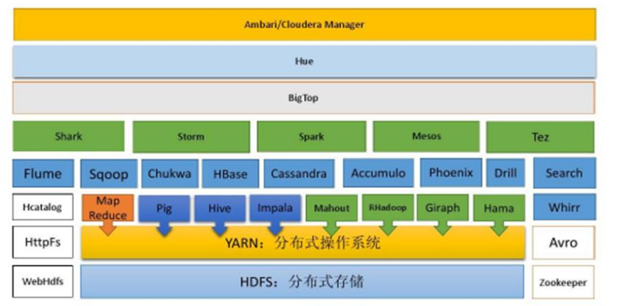

#### 1.3.4 其它开源项目使用到 Netty 

网址: https://netty.io/wiki/related-projects.html


### 1.4 Netty 的学习参考资料

- [Netty IN ACTION](https://book.douban.com/subject/27038538/): 作者参与了nety4的内核开发,实战方面可以使用这本书
- [Netty 权威指南](https://book.douban.com/subject/26373138/): 基于Netty5的,原理和理论方面的东西比较透彻,但是netty5已经被废弃了

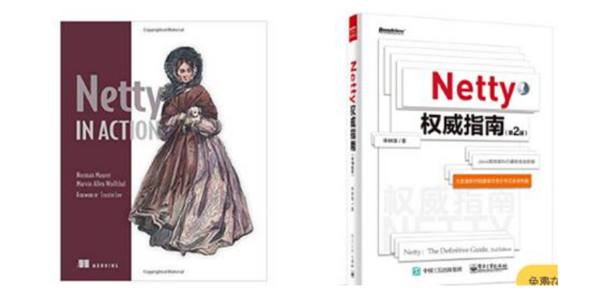

---

## 第 2 章: JavaBIO编程

*BIO就是阻塞IO,java的原生IO知识*

### 2.1 I/O模型

1. I/O 模型简单的理解：就是用什么样的通道进行数据的发送和接收，很大程度上决定了程序通信的性能

2. Java 共支持 3 种网络编程模型/IO 模式：BIO、NIO、AIO

3. Java BIO ： **同步并阻塞(传统阻塞型)** ，服务器实现模式为一个连接一个线程，即客户端有连接请求时服务器端就需要启动一个线程进行处理，如果这个连接不做任何事情会造成不必要的线程开销 【简单示意图】 

   **一个线程维护一个连接(socket)**

   

4. Java NIO ： **同步非阻塞**，服务器实现模式为一个线程处理多个请求(连接/客户端)，即客户端发送的连接请求都会注册到多路复用器上，多路复用器轮询到连接有 I/O 请求就进行处理 【简单示意图】

   **一个线程维护多个连接(socket)**

   

5. Java AIO(NIO.2) ： **异步非阻塞**，AIO 引入异步通道的概念，采用了 Proactor 模式，简化了程序编写，有效的请求才启动线程，它的特点是先由操作系统完成后才通知服务端程序启动线程去处理，一般适用于连接数较 多且连接时间较长的应用 【了解】

6. 我们依次展开讲解 

### 2.2 BIO、NIO、AIO 适用场景分析

1. <u>BIO 方式适用于连接数目比较小且固定的架构</u>，这种方式对服务器资源要求比较高，并发局限于应用中，JDK1.4 以前的唯一选择，但程序简单易理解。
2. <u>NIO 方式适用于连接数目多且连接比较短（轻操作）的架构</u>，比如聊天服务器，弹幕系统，服务器间通讯等。 编程比较复杂，JDK1.4 开始支持。netty框架就是基于NIO的
3. <u>AIO 方式使用于连接数目多且连接比较长（重操作）的架构</u>，比如相册服务器，充分调用 OS 参与并发操作，编程比较复杂，JDK7 开始支持。但是AIO目前还没有得到广泛的应用

### 2.3 Java BIO 基本介绍

1. **Java BIO** 就是传统的 **Java IO** **编程**，其相关的类和接口在 java.io
2. BIO(blocking I/O) ： 同步阻塞，服务器实现模式为一个连接一个线程，即客户端有连接请求时服务器端就需要启动一个线程进行处理，如果这个连接不做任何事情会造成不必要的线程开销，可以通过线程池机制改善(实现多个客户连接服务器)。 【后有应用实例】
3. BIO 方式适用于连接数目比较小且固定的架构，这种方式对服务器资源要求比较高，并发局限于应用中，JDK1.4 以前的唯一选择，程序简单易理解

### 2.4 Java BIO工作机制


**对BIO编程流程的回顾梳理:**

1. 服务器端启动一个 ServerSocket 
2. 客户端启动 Socket 对服务器进行通信，默认情况下服务器端需要对每个客户 建立一个线程与之通讯
3. 客户端发出请求后, 先咨询服务器是否有线程响应，如果没有则会等待，或者被拒绝
4. 如果有响应，客户端线程会等待请求结束后，在继续执行

### 2.5 Java BIO 应用实例 🚩

**实例说明:** 

1. 使用 BIO 模型编写一个服务器端，监听 6666 端口，当有客户端连接时，就启动一个线程与之通讯。
2. 要求使用线程池机制改善，可以连接多个客户端.
3. 服务器端可以接收客户端发送的数据(telnet 方式即可)。

**代码演示:**


```java
package com.atguigu.bio; 
import java.io.InputStream; 
import java.net.ServerSocket;
import java.net.Socket; 
import java.util.concurrent.ExecutorService; 
import java.util.concurrent.Executors;
public class BIOServer {
    public static void main(String[] args) throws Exception { 
        //线程池机制
        //思路 
        //1. 创建一个线程池 
        //2. 如果有客户端连接，就创建一个线程，与之通讯(单独写一个方法)
        ExecutorService newCachedThreadPool = Executors.newCachedThreadPool(); //创建ServerSocket 
        ServerSocket serverSocket = new ServerSocket(6666); 
        System.out.println("服务器启动了"); 
        while (true) { 
            System.out.println(" 线 程 信 息 id =" + Thread.currentThread().getId() + " 名 字 =" + Thread.currentThread().getName()); 
            //监听，等待客户端连接 
            System.out.println("等待连接...."); 
            final Socket socket = serverSocket.accept();
            System.out.println("连接到一个客户端");
            //就创建一个线程，与之通讯(单独写一个方法) 
            newCachedThreadPool.execute(new Runnable() { 
                public void run() { //我们重写 
                    //可以和客户端通讯 
                    handler(socket);
                }});
        } 
    }
    //编写一个 handler 方法，和客户端通讯 
    public static void handler(Socket socket) {
        try { 
            System.out.println(" 线 程 信 息 id =" + Thread.currentThread().getId() + " 名 字 =" + Thread.currentThread().getName());
            byte[] bytes = new byte[1024];
            //通过 socket 获取输入流 
            InputStream inputStream = socket.getInputStream();
            //循环的读取客户端发送的数据 
            while (true) { 
                System.out.println(" 线 程 信 息 id =" + Thread.currentThread().getId() + " 名 字 =" + Thread.currentThread().getName()); 
                System.out.println("read...."); int read = inputStream.read(bytes); 
                if(read != -1) {
                    System.out.println(new String(bytes, 0, read )); //输出客户端发送的数据 
                } else {
                    break; 
                } 
            } 
        }catch (Exception e) {
            e.printStackTrace();
        }finally {
            System.out.println("关闭和 client 的连接"); 
            try { socket.close(); 
                }catch (Exception e) { 
                e.printStackTrace(); 
            }
        } 
    }
}
```


### 2.6 Java BIO问题分析

1. 每个请求都需要创建独立的线程，与对应的客户端进行数据 Read，业务处理，数据 Write 。
2. 当并发数较大时，需要创建大量线程来处理连接，系统资源占用较大。 
3. 连接建立后，如果当前线程暂时没有数据可读，则线程就阻塞在 Read 操作上，造成线程资源浪费


---

## 第 3 章: Java NIO编程

### 3.1 Java NIO基本介绍

1. Java NIO 全称 **java non-blocking IO**，是指 JDK 提供的新 API。从 JDK1.4 开始，Java 提供了一系列改进的输入/输出的新特性，被统称为 NIO(即 New IO)，是同步非阻塞的
2. NIO 相关类都被放在 **java.nio** 包及子包下，并且对原 java.io 包中的很多类进行改写。【基本案例】
3. NIO 有三大核心部分：**Channel(通道)，Buffer(缓冲区), Selector(选择器)**
4. **NIO** **是 面向缓冲区** ，**或者面向 块 编程的**。数据读取到一个它稍后处理的缓冲区，需要时可在缓冲区中前后移动，这就增加了处理过程中的灵活性，使用它可以提供非阻塞式的高伸缩性网络 
5. Java NIO 的非阻塞模式，使一个线程从某通道发送请求或者读取数据，但是它仅能得到目前可用的数据，如果 目前没有数据可用时，就什么都不会获取，而不是保持线程阻塞，所以直至数据变的可以读取之前，该线程可 以继续做其他的事情。 非阻塞写也是如此，一个线程请求写入一些数据到某通道，但不需要等待它完全写入， 这个线程同时可以去做别的事情。【后面有案例说明】
6. 通俗理解：NIO 是可以做到用一个线程来处理多个操作的。假设有 10000 个请求过来,根据实际情况，可以分配 50 或者 100 个线程来处理。不像之前的阻塞 IO 那样，非得分配 10000 个。
7. HTTP2.0 使用了多路复用的技术，做到同一个连接并发处理多个请求，而且并发请求的数量比 HTTP1.1 大了好 几个数量级 

**案例说明 NIO 的 Buffer** 

```java
package com.atguigu.nio;
import java.nio.IntBuffer;
public class BasicBuffer {
    public static void main(String[] args) { 
        //举例说明 Buffer 的使用 (简单说明) 
        //创建一个 Buffer, 大小为 5, 即可以存放 5 个 int 
        IntBuffer intBuffer = IntBuffer.allocate(5); 
        //向 buffer 存放数据 
        // intBuffer.put(10); 
        // intBuffer.put(11); 
        // intBuffer.put(12); 
        // intBuffer.put(13);
        // intBuffer.put(14);
        for(int i = 0; i < intBuffer.capacity(); i++) {
            intBuffer.put( i * 2);
        }
        //如何从 buffer 读取数据 
        //将 buffer 转换，读写切换(!!!) 
        intBuffer.flip(); 
        while (intBuffer.hasRemaining()) { 
            System.out.println(intBuffer.get());
        } 
    }
}
```


### 3.2 NIO和BIO的比较

1. BIO 以流的方式处理数据,而 NIO 以块的方式处理数据,块 I/O 的效率比流 I/O 高很多
2. BIO 是阻塞的，NIO 则是非阻塞的
3. BIO 基于字节流和字符流进行操作，而 NIO 基于 Channel(通道)和 Buffer(缓冲区)进行操作，数据总是从通道 读取到缓冲区中，或者从缓冲区写入到通道中。Selector(选择器)用于监听多个通道的事件（比如：连接请求， 数据到达等），因此使用单个线程就可以监听多个客户端通道 

### 3.3 NIO三大核心原理示意图

一张图描述 NIO 的 Selector 、 Channel 和 Buffer 的关系

Selector 、 Channel 和 Buffer 的关系图(简单版)


关系图的说明:

1. 每个 channel 都会对应一个 Buffer 
2. Selector 对应一个线程， 一个线程对应多个 channel(连接) 
3. 该图反应了有三个 channel 注册到 该 selector //程序
4. 程序切换到哪个 channel 是有事件决定的, Event 就是一个重要的概念 
5. Selector 会根据不同的事件，在各个通道上切换 
6. Buffer 就是一个内存块 ， 底层是有一个数组
7. 数据的读取写入是通过 Buffer, 这个和 BIO , BIO 中要么是输入流，或者是 输出流, 不能双向，但是 NIO 的 Buffer 是可以读也可以写, 需要 flip 方法切换 channel 是双向的, 可以返回底层操作系统的情况, 比如 Linux ， 底层的操作系统通道就是双向的


### 3.4 缓冲区(Buffer)

#### 3.4.1 基本介绍

缓冲区（Buffer）：缓冲区本质上是一个可以读写数据的内存块，可以理解成是一个容器对象(含数组)，该对 象提供了一组方法，可以更轻松地使用内存块，，缓冲区对象内置了一些机制，能够跟踪和记录缓冲区的状态变化情况。Channel 提供从文件、网络读取数据的渠道，但是读取或写入的数据都必须经由 Buffer，如图: 【后面举 例说明】


#### 3.4.2 Buffer类及其子类

1. 在 NIO 中，Buffer 是一个顶层父类，它是一个抽象类, 类的层级关系图:
2. Buffer 类定义了所有的缓冲区都具有的四个属性来提供关于其所包含的数据元素的信息:
3. Buffer 类相关方法一览

#### 3.4.3 ByteBuffer

从前面可以看出对于 Java 中的基本数据类型(boolean 除外)，都有一个 Buffer 类型与之相对应，最常用的自然是 ByteBuffer 类（二进制数据），该类的主要方法如下：

```java
//源码中的API
public abstract class ByteBuffer extends Buffer implements Comparable<ByteBuffer>{
    	//缓冲区创建相关api
    	public static ByteBuffer allocateDirect(int capacity)//创建直接缓冲区
    	public static ByteBuffer allocate(int capacity)//设置缓冲区的初始容量
        public static ByteBuffer wrap(byte[] array)//把一个数组放到缓冲区中使用
        //构造初始化位置offset和上界length的缓冲区
        public static ByteBuffer wrap(byte[] array,int offset, int length)

        //缓存区存取相关API
        public abstract byte get() //从当前位置position上get， get之后， position会自动+1
        public abstract byte get(int index) //从绝对位置get
        public abstract ByteBuffer put(byte b)//从当前位置上添加， put之后， position会自动+1
        public abstract ByteBuffer put(int index, byte b)//从绝对位置上put
}
```


### 3.5. 通道(Channel)

### 3.6 基本介绍

1. NIO 的通道类似于流，但有些区别如下：

   - 通道可以同时进行读写，而流只能读或者只能写
   - 通道可以实现异步读写数据 
   - 通道可以从缓冲读数据，也可以写数据到缓冲;

2. BIO 中的 stream 是单向的，例如 FileInputStream 对象只能进行读取数据的操作，而 NIO 中的通道(Channel) 是双向的，可以读操作，也可以写操作。

3. Channel 在 NIO 中是一个接口

   ```java
   //源码
   public interface Channel extends Closeable {}
   ```

4. 常 用 的 Channel 类 有 ：

   ```java
   public class FileChannel{}  //FileChannel 用于文件的数据读写
   public class DatagramChannel{} //DatagramChannel 用于 UDP 的数据读写
   public class ServerSocketChannel{} //ServerSocketChannel 和 SocketChannel 用于 TCP 的数据读写
   public class SocketChannel{}
   
   // 【ServerSocketChanne 类似 ServerSocket , SocketChannel 类似 Socket】
   ```


#### 3.6.1 FileChannel 类

```java
//FileChannel类常用API
public abstract class FileChannel
    extends AbstractInterruptibleChannel
    implements SeekableByteChannel, GatheringByteChannel, ScatteringByteChannel
{
    public int read(ByteBuffer dst) //从通道读取数据并放到缓冲区中
    public int write(ByteBuffer src) //把缓冲区的数据写到通道中 
    public long transferFrom(ReadableByteChannel src, long position, long count)//从目标通道中复制数据到当前通道 
    public long transferTo(long position, long count, WritableByteChannel target)//把数据从当前通道复制给目标通道
}
```


#### 3.6.2 应用实例 1-本地文件写数据

使用前面学习后的 ByteBuffer(缓冲) 和 FileChannel(通道)， 将 "hello,尚硅谷" 写入到 file01.txt 中 

```java

```


#### 3.6.3 应用实例 2-本地文件读数据 

实例要求:

1. 使用前面学习后的 ByteBuffer(缓冲) 和 FileChannel(通道)， 将 file01.txt 中的数据读入到程序，并显示在控制 台屏幕
2. 假定文件已经存在

```java

```


#### 3.6.4 应用实例 3-使用一个 Buffer 完成文件读取、写入

实例要求:

1. 使用 FileChannel(通道) 和 方法 read , write，完成文件的拷贝

2. 拷贝一个文本文件 1.txt , 放在项目下即可

   

```java

```


#### 3.6.5 应用实例 4-拷贝文件 transferFrom 方法 

实例要求:

1. 使用 FileChannel(通道) 和 方法 transferFrom ，完成文件的拷贝
2. 拷贝一张图片

```java

```


#### 3.6.6 关于 Buffer 和 Channel 的注意事项和细节 

1. ByteBuffer 支持类型化的 put 和 get, put 放入的是什么数据类型，get 就应该使用相应的数据类型来取出，否 则可能有 BufferUnderflowException 异常。[举例说明]
2. 可以将一个普通 Buffer 转成只读 Buffer [举例说明]
3. NIO 还提供了 MappedByteBuffer， 可以让文件直接在内存（堆外的内存）中进行修改， 而如何同步到文件 由 NIO 来完成. [举例说明] 
4. 前面我们讲的读写操作，都是通过一个 Buffer 完成的，NIO 还支持 通过多个 Buffer (即 Buffer 数组) 完成读 写操作，即 Scattering 和 Gathering 【举例说明】 


### 3.7 Selector(选择器)

#### 3.7.1 基本介绍

1. Java 的 NIO，用非阻塞的 IO 方式。可以用一个线程，处理多个的客户端连接，就会使用到 Selector(选择器)
2. Selector 能够检测多个注册的通道上是否有事件发生(注意:多个 Channel 以事件的方式可以注册到同一个 Selector)，如果有事件发生，便获取事件然后针对每个事件进行相应的处理。这样就可以只用一个单线程去管 理多个通道，也就是管理多个连接和请求。【示意图】 
3. 只有在 连接/通道 真正有读写事件发生时，才会进行读写，就大大地减少了系统开销，并且不必为每个连接都 创建一个线程，不用去维护多个线程 
4. 避免了多线程之间的上下文切换导致的开销

#### 3.7.2 Selector示意图和特点说明

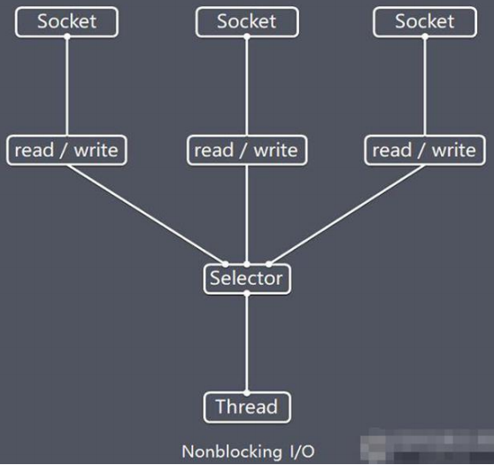

说明如下: 

1. Netty 的 IO 线程 NioEventLoop 聚合了 Selector(选择器，也叫多路复用器)，可以同时并发处理成百上千个客 户端连接。 
2. 当线程从某客户端 Socket 通道进行读写数据时，若没有数据可用时，该线程可以进行其他任务。 
3. 线程通常将非阻塞 IO 的空闲时间用于在其他通道上执行 IO 操作，所以单独的线程可以管理多个输入和输出 通道。 
4. 由于读写操作都是非阻塞的，这就可以充分提升 IO 线程的运行效率，避免由于频繁 I/O 阻塞导致的线程挂 起。 
5. 一个 I/O 线程可以并发处理 N 个客户端连接和读写操作，这从根本上解决了传统同步阻塞 I/O 一连接一线 程模型，架构的性能、弹性伸缩能力和可靠性都得到了极大的提升。

#### 3.7.3 Selector相关方法

```java
public abstract class Selector implements Closeable {
public static Selector open（）：//得到一个选择器对象
public int select（long timeout）；//监控所有注册的通道，当其
中有10操作可以进行时，将
对应的SelectionKey加入到内部集合中并返回，参数用来
设置超时时间
public Set<SelectionKey> selectedKeysl）；//从内部集合中得
到所有的SelectionKey
}
```


#### 3.7.4 注意事项

1. NIO 中的 ServerSocketChannel 功能类似 ServerSocket，SocketChannel 功能类似 Socket

2. selector 相关方法说明

   ```java
   selector.select();//阻塞 
   selector.select(1000);//阻塞 1000 毫秒，在 1000 毫秒后返回 
   selector.wakeup();//唤醒 
   selector selector.selectNow();//不阻塞，立马返还
   ```

   


### 3.8 NIO非阻塞网络编程原理分析图

*NIO 非阻塞 网络编程相关的(Selector、SelectionKey、ServerScoketChannel 和 SocketChannel) 关系梳理图*


对上图的说明:

1. 当客户端连接时，会通过 ServerSocketChannel 得到 SocketChannel
2. Selector 进行监听 select 方法, 返回有事件发生的通道的个数
3. 将 socketChannel 注册到 Selector 上, register(Selector sel, int ops), 一个 selector 上可以注册多个 SocketChannel
4. 注册后返回一个 SelectionKey, 会和该 Selector 关联(集合)
5. 进一步得到各个 SelectionKey (有事件发生) 
6. 在通过 SelectionKey 反向获取 SocketChannel , 方法 channel()
7. 可以通过 得到的 channel , 完成业务处理
8. 代码撑腰。。。 

### 3.9 NIO非阻塞网络编程快速入门

案例要求: 

1. 编写一个 NIO 入门案例，实现服务器端和客户端之间的数据简单通讯（非阻塞） 

2. 目的：理解 NIO 非阻塞网络编程机制

```java

```


### 3.10 SelectionKey

1. SelectionKey，表示 **Selector** **和网络通道的注册关系**, 共四种:

   - int OP_ACCEPT：有新的网络连接可以 accept，值为 16
   - int OP_CONNECT：代表连接已经建立，值为 8
   - int OP_READ：代表读操作，值为 1 
   - int OP_WRITE：代表写操作，值为 4 

   源码中:

   ```java
   public static final int OP_READ = 1 << 0; 
   public static final int OP_WRITE = 1 << 2; 
   public static final int OP_CONNECT = 1 << 3;
   public static final int OP_ACCEPT = 1 << 4;
   ```

2. SelectionKey 相关方法

   ```java
   publicabstract class SelectionKey {
       public abstract Selector selector（）：//得到与之关联的Selector对象
       public abstract SelectableChannel channel）：//得到与之关联的通道据
       public final Objectattachment（）：//得到与之关联的共享数
       public abstract SelectionKey interestOps（int ops）；//设置或改变监听事件
       public final boolean isAcceptable（）：//是否可以accept
       public final boolean isReadable（）；//是否可以读
       public final boolean isWritable（）：//是否可以写
   }
   ```

   

### 3.11 ServerSocketChannel

1. ServerSocketChannel 在服务器端监听新的客户端 Socket 连接

2. 相关方法如下

   ```java
   public abstract class ServerSocketChannel
   extends AbstractSelectableChannel
   implements NetworkChannel{
   public static ServerSocketChannel open（），得到一个ServerSocketChannel通道
   public final ServerSocketChannel bind（SocketAddress locall，设置服务器端端口
   号
   public final Selectablechannel configure Blocking（boolean block），设置阻塞或非
   阻塞模式，取值false表示采用非阻塞模式
   public SocketChannel accept），接受一个连接，返回代表这个连接的通道对
   象
   public final Selectionke register（Selector sel， int ops），注册一个选择器并设置
   监听事件
   1
   ```

   

### 3.12 SocketChannel

1. SocketChannel，网络 IO 通道，具体负责进行读写操作。NIO 把缓冲区的数据写入通道，或者把通道里的数 据读到缓冲区.

2. 相关方法如下

   ```java
   public abstract class SocketChannel
   extends AbstractSelectableChannel
   implements ByteChannel， Scattering ByteChannel， Gathering ByteChannel，
   NetworkChannel
   public static SocketChannel open（）：//得到一个SocketChannel通道
   public final SelectableChannel configureBlocking（boolean block）：//设置阻塞或非阻塞
   模式，取值false表示采用非阻塞模式
   public boolean connect（SocketAddress remote）：//连接服务器
   public boolean finishConnect）/如果上面的方法连接失败，接下来就要通过该方法
   完成连接操作
   public int write（ByteBuffer src）：//往通道里写数据
   public int read（ByteBuffer dst）：//从通道里读数据
   public final SelectionKey register（Selector sel， int ops， Object att）：/注册一个选择器并
   设置监听事件，最后一个参数可以设置共享数据
   public final void close（）：//关闭通道
   ```

   

### 3.13 NIO网络编程应用实例-群聊系统

实例要求:

1. 编写一个 NIO 群聊系统，实现服务器端和客户端之间的数据简单通讯（非阻塞） 

2. 实现多人群聊 

3. 服务器端：可以监测用户上线，离线，并实现消息转发功能 

4. 客户端：通过 channel 可以无阻塞发送消息给其它所有用户，同时可以接受其它用户发送的消息(有服务器转发 得到) 

目的：进一步理解 NIO 非阻塞网络编程机制 

示意图分析和代码


```java

```


### 3.14 NIO与零拷贝

#### 3.14.1 零拷贝介绍

1. 零拷贝是网络编程的关键，很多性能优化都离不开。
2. 在 Java 程序中，常用的零拷贝有 mmap(内存映射) 和 sendFile。那么，他们在 OS 里，到底是怎么样的一个 的设计？我们分析 mmap 和 sendFile 这两个零拷贝
3. 另外我们看下 NIO 中如何使用零拷贝 

#### 3.14.2 传统IO数据读写

Java 传统 IO 和 网络编程的一段代码

```java
File file = new File("test. txt");
RandomAccessFile raf = new RandomAccess File (file, "rw");
byte[] arr = new byte(int) file. length()]:
raf. read(arr);
Socket socket = new ServerSocket(8080). accept();
socket. getOutputStream(). write(arr);
```

#### 3.14.3 传统IO模型

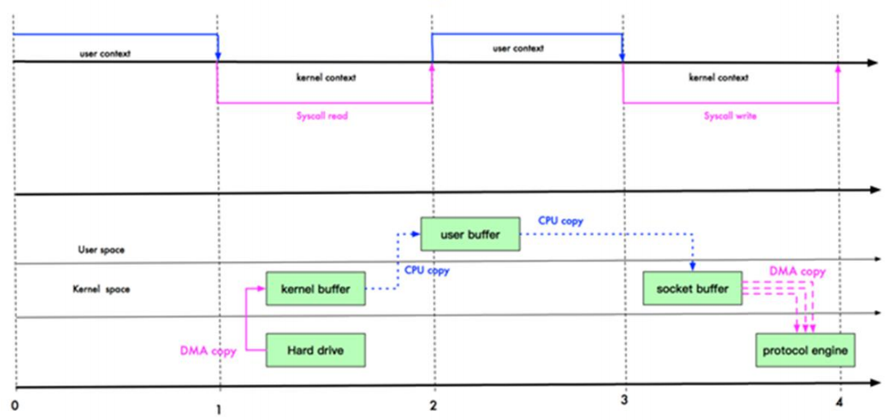

DMA: direct memory access 直接内存拷贝(不使用 CPU)

#### 3.14.4 mmap 优化

mmap 通过内存映射，将**文件映射到内核缓冲区**，同时，**用户空间可以共享内核空间的数据**。这样，在进行网 络传输时，就可以减少内核空间到用户空间的拷贝次数。如下图 


#### 3.14.5 sendFile 优化

1. Linux 2.1 版本 提供了 sendFile 函数，其基本原理如下：数据根本不经过用户态，直接从内核缓冲区进入到 Socket Buffer，同时，由于和用户态完全无关，就减少了一次上下文切换 ;如下示意图

   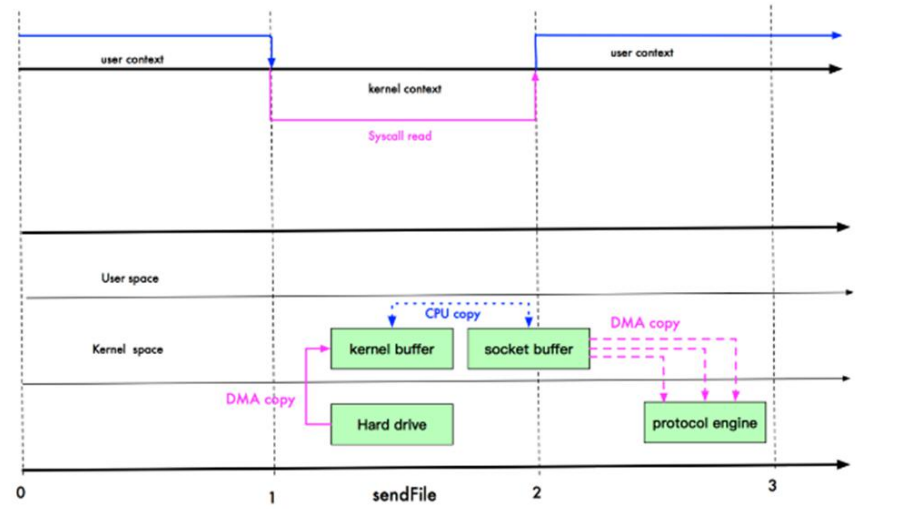

2. 提示：零拷贝从操作系统角度，是没有 cpu 拷贝

3. Linux 在 2.4 版本中，做了一些修改，避免了从**内核缓冲区**拷贝到 **Socket buffer** 的操作，直接拷贝到协议栈， 从而再一次减少了数据拷贝。具体如下图和小结：

   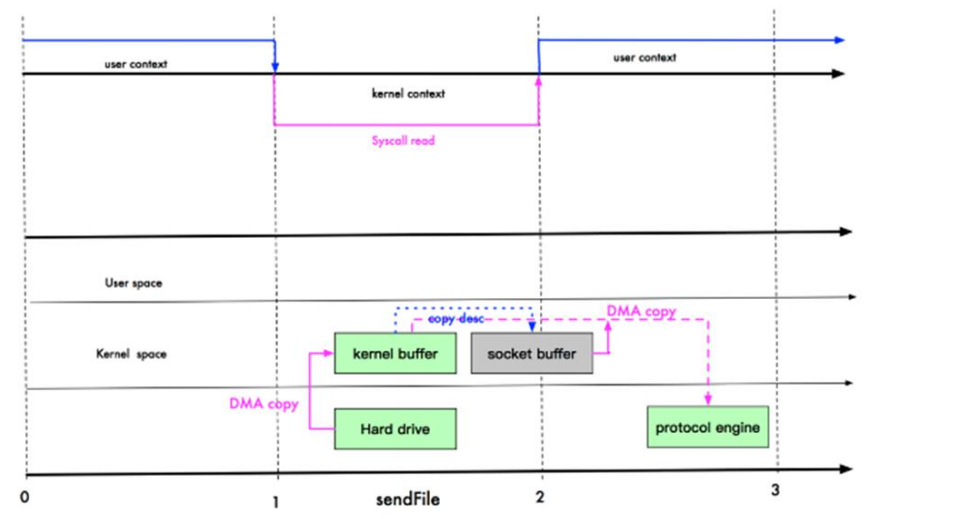

   这里其实有 一次 cpu 拷贝 

   kernel buffer -> socket buffer

   但是，拷贝的信息很少，比如 lenght , offset , 消耗低，可以忽略

#### 3.14.6 零拷贝的再次理解 

1. 我们说零拷贝，是从**操作系统的角度**来说的。因为内核缓冲区之间，没有数据是重复的（只有 kernel buffer 有 一份数据）。
2. 零拷贝不仅仅带来更少的数据复制，还能带来其他的性能优势，例如更少的上下文切换，更少的 CPU 缓存伪 共享以及无 CPU 校验和计算。

#### 3.14.7 mmap 和 sendFile 的区别

1. mmap 适合小数据量读写，sendFile 适合大文件传输。
2. mmap 需要 4 次上下文切换，3 次数据拷贝；sendFile 需要 3 次上下文切换，最少 2 次数据拷贝。
3. sendFile 可以利用 DMA 方式，减少 CPU 拷贝，mmap 则不能（必须从内核拷贝到 Socket 缓冲区）。

#### 3.14.8 NIO 零拷贝案例

案例要求：

1. 使用传统的 IO 方法传递一个大文件
2. 使用 NIO 零拷贝方式传递(transferTo)一个大文件 
3. 看看两种传递方式耗时时间分别是多少

```java

```


### 3.15 Java AIO 基本介绍

1. JDK 7 引入了 Asynchronous I/O，即 AIO。在进行 I/O 编程中，常用到两种模式：Reactor 和 Proactor。Java 的 NIO 就是 Reactor，当有事件触发时，服务器端得到通知，进行相应的处理
2. AIO 即 NIO2.0，叫做异步不阻塞的 IO。AIO 引入异步通道的概念，采用了 Proactor 模式，简化了程序编写， 有效的请求才启动线程，它的特点是先由操作系统完成后才通知服务端程序启动线程去处理，一般适用于连接 数较多且连接时间较长的应用
3. 目前 AIO 还没有广泛应用，Netty 也是基于 NIO, 而不是 AIO， 因此我们就不详解 AIO 了，有兴趣的同学可 以 参 考 [Java 新 一 代 网 络 编 程 模 型 AIO 原 理 及 Linux 系 统 AIO 介 绍 ](http://www.52im.net/thread-306-1-1.html) 

### 3.16 BIO NIO AIO 对比表

|          | BIO      | NIO                  | AIO        |
| -------- | -------- | -------------------- | ---------- |
| IO模型   | 同步阻塞 | 同步非阻塞(多路复用) | 异步非阻塞 |
| 编程难度 | 简单     | 复杂                 | 复杂       |
| 可靠性   | 差       | 好                   | 好         |
| 吞吐量   | 低       | 高                   | 高         |

**举例说明:** 

1. 同步阻塞：到理发店理发，就一直等理发师，直到轮到自己理发。
2. 同步非阻塞：到理发店理发，发现前面有其它人理发，给理发师说下，先干其他事情，一会过来看是否轮到自己.
3. 异步非阻塞：给理发师打电话，让理发师上门服务，自己千其它事情，理发师自己来家给你理发

---

## 第 4 章: Netty概述


### 4.1 原生 NIO 存在的问题 

*学习成本高,开发效率低*

1. NIO 的类库和 API 繁杂，使用麻烦：需要熟练掌握 Selector、ServerSocketChannel、SocketChannel、ByteBuffer 等。
2. 需要具备其他的额外技能：要熟悉 Java 多线程编程，因为 NIO 编程涉及到 Reactor 模式，你必须对多线程 和网络编程非常熟悉，才能编写出高质量的 NIO 程序。 
3. 开发工作量和难度都非常大：例如客户端面临断连重连、网络闪断、半包读写、失败缓存、网络拥塞和异常流 的处理等等。
4. JDK NIO 的 Bug：例如臭名昭著的 Epoll Bug，它会导致 Selector 空轮询，最终导致 CPU 100%。直到 JDK 1.7 版本该问题仍旧存在，没有被根本解决。

### 4.2 Netty 官网说明

官网：https://netty.io/ 

Netty is an asynchronous event-driven network application framework 

for rapid development of maintainable high performance protocol servers & clients


### 4.3 Netty 的优点

Netty 对 JDK 自带的 NIO 的 API 进行了封装，解决了上述问题。

1. 设计优雅：适用于各种传输类型的统一 API 阻塞和非阻塞 Socket；基于灵活且可扩展的事件模型，可以清晰 地分离关注点；高度可定制的线程模型 - 单线程，一个或多个线程池.
2. 使用方便：详细记录的 Javadoc，用户指南和示例；没有其他依赖项，JDK 5（Netty 3.x）或 6（Netty 4.x）就 足够了。
3. 高性能、吞吐量更高：延迟更低；减少资源消耗；最小化不必要的内存复制。
4. 安全：完整的 SSL/TLS 和 StartTLS 支持。
5. 社区活跃、不断更新：社区活跃，版本迭代周期短，发现的 Bug 可以被及时修复，同时，更多的新功能会被 加入

### 4.4 Netty 版本说明

1. netty 版本分为 netty3.x(太老) 和 netty4.x、netty5.x(重大bug被官方抛弃了) 
2. 因为 Netty5 出现重大 bug，已经被官网废弃了，目前推荐使用的是 Netty4.x 的稳定版本 
3. 目前在官网可下载的版本 netty3.x netty4.0.x 和 netty4.1.x 
4. 在本套课程中，我们讲解 Netty4.1.x 版本 
5. netty 下载地址： https://bintray.com/netty/downloads/netty/


---


## 第 5 章:  Netty高性能架构设计

### 5.1 线程模型基本介绍

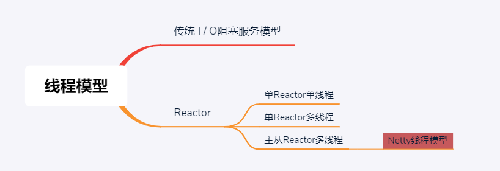

1. 不同的线程模式，对程序的性能有很大影响，为了搞清 Netty 线程模式，我们来系统的讲解下 各个线程模式， 最后看看 Netty 线程模型有什么优越性.
2. 目前存在的线程模型有：
   - 传统阻塞 I/O 服务模型 
   - Reactor 模式 
3. 根据 Reactor 的数量和处理资源池线程的数量不同，有 3 种典型的实现 
   - 单 Reactor 单线程；
   - 单 Reactor 多线程；
   - 主从 Reactor 多线程
4. Netty 线程模式(Netty 主要基于主从 Reactor 多线程模型做了一定的改进，其中主从 Reactor 多线程模型有多 个 Reactor) 

### 5.2 传统阻塞 I/O 服务模型 

**传统阻塞I/O服务模型工作原理图**

*ps: 黄色的框表示对象， 蓝色的框表示线程,白色的框表示方法(API)*

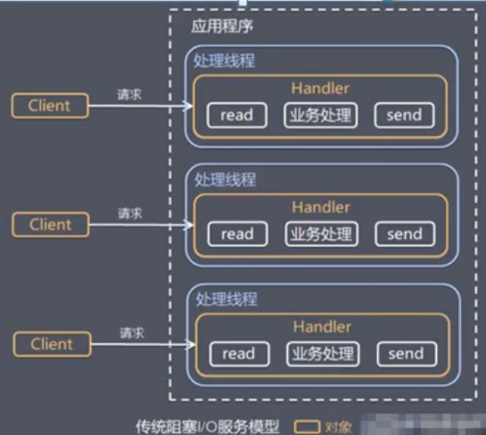

**模型特点**

1. 采用阻塞 IO 模式获取输入的数据 
2. 每个连接都需要独立的线程完成数据的输入，业务处理, 数据返回

**问题分析**

1. 当并发数很大，就会创建大量的线程，占用很大系统资源 
2. 连接创建后，如果当前线程暂时没有数据可读，该线程 会阻塞在 read 操作，造成线程资源浪费

### 5.3 Reactor 模式

**针对传统阻塞 I/O 服务模型的 2 个缺点，解决方案：**

1. 基于 I/O 复用模型：多个连接共用一个阻塞对象，应用程序只需要在一个阻塞对象等待，无需阻塞等待所有连接。当某个连接有新的数据可以处理时，操作系统通知应用程序，线程从阻塞状态返回，开始进行业务处理Reactor 对应的叫法: 1. 反应器模式 2. 分发者模式(Dispatcher) 3. 通知者模式(notifier)
2. 基于线程池复用线程资源：不必再为每个连接创建线程，将连接完成后的业务处理任务分配给线程进行处理,一个线程可以处理多个连接的业务。 

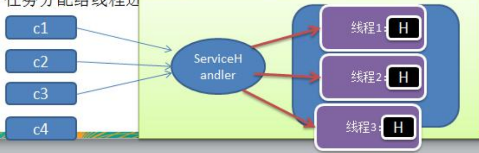

**I/O 复用结合线程池，就是 Reactor 模式基本设计思想，如图**


**对上图解读:**

1. Reactor 模式，通过一个或多个输入同时传递给服务处理器的模式(基于事件驱动) 
2. 服务器端程序处理传入的多个请求,并将它们同步分派到相应的处理线程， 因此 Reactor 模式也叫 Dispatcher模式
3. Reactor 模式使用 IO 复用监听事件, 收到事件后，分发给某个线程(进程), 这点就是网络服务器高并发处理关键 

**Reactor 模式中 核心组成：**

1. Reactor：Reactor 在一个单独的线程中运行，负责监听和分发事件，分发给适当的处理程序来对 IO 事件做出反应。 它就像公司的电话接线员，它接听来自客户的电话并将线路转移到适当的联系人；
2. Handlers：处理程序执行 I/O 事件要完成的实际事件，类似于客户想要与之交谈的公司中的实际官员。Reactor通过调度适当的处理程序来响应 I/O 事件，处理程序执行非阻塞操作。


**Reactor 模式分类：**

*根据 Reactor 的数量和处理资源池线程的数量不同，有 3 种典型的实现*

- 单 Reactor 单线程
- 单 Reactor 多线程
- 主从 Reactor 多线程

#### 5.3.1 单 Reactor 单线程 

*原理图，并使用 NIO 群聊系统验证*

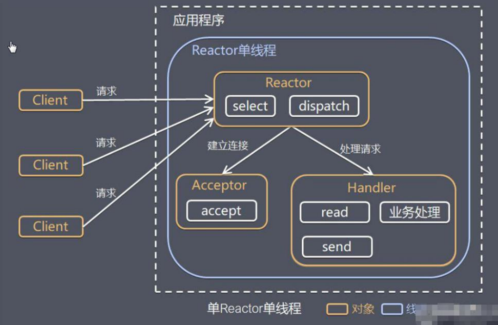

**对上图解读**

1. Select 是前面 I/O 复用模型介绍的标准网络编程 API，可以实现应用程序通过一个阻塞对象监听多路连接请求
2. Reactor 对象通过 Select 监控客户端请求事件，收到事件后通过 Dispatch 进行分发 
3. 如果是建立连接请求事件，则由 Acceptor 通过 Accept 处理连接请求，然后创建一个 Handler 对象处理连接完成后的后续业务处理 
4. 如果不是建立连接事件，则 Reactor 会分发调用连接对应的 Handler 来响应
5. Handler 会完成 Read→业务处理→Send 的完整业务流程

结合实例：服务器端用一个线程通过多路复用搞定所有的 IO 操作（包括连接，读、写等），编码简单，清晰明了,但是如果客户端连接数量较多，将无法支撑，前面的 NIO 案例就属于这种模型。


**单Reactor单线程模型优缺点分析**

优点：模型简单，没有多线程、进程通信、竞争的问题，全部都在一个线程中完成 

缺点：性能问题，只有一个线程，无法完全发挥多核 CPU 的性能。Handler 在处理某个连接上的业务时，整个进程无法处理其他连接事件，很容易导致性能瓶颈

缺点：可靠性问题，线程意外终止，或者进入死循环，会导致整个系统通信模块不可用，不能接收和处理外部消息，造成节点故障 

使用场景：客户端的数量有限，业务处理非常快速，比如 Redis 在业务处理的时间复杂度 O(1) 的情况

#### 5.3.2 单 Reactor 多线程 🚩

**单Reactor多线程原理图**

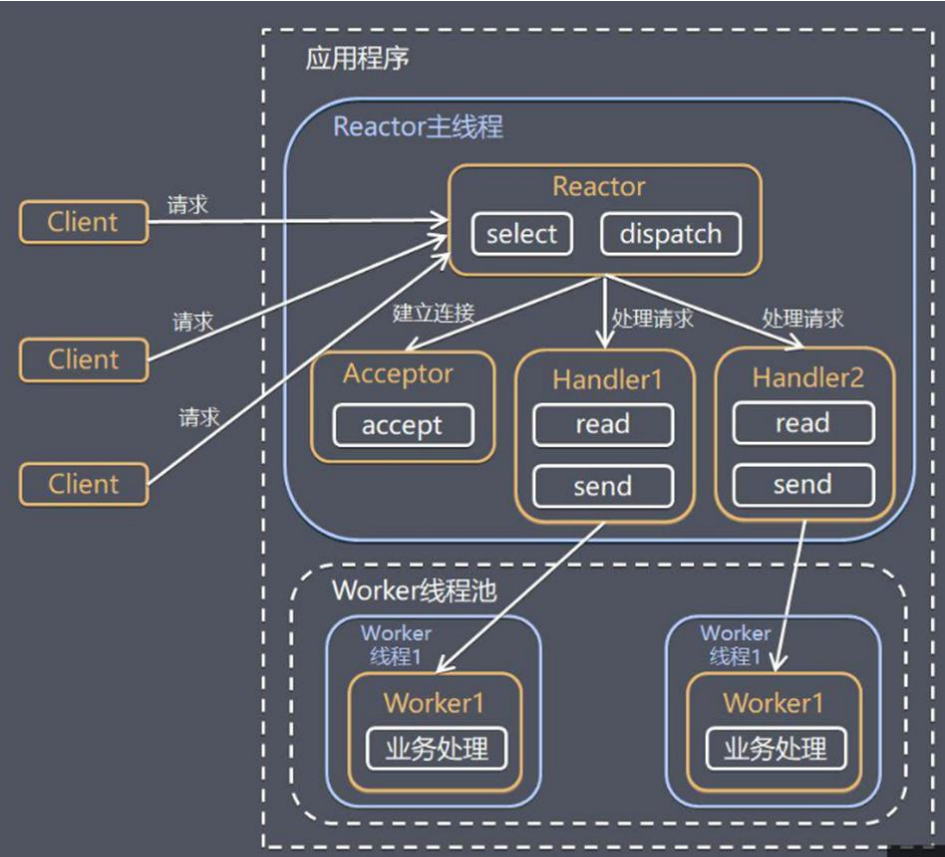

**对上图解读**

1. Reactor 对象通过 select 监控客户端请求 事件, 收到事件后，通过 dispatch 进行分发 
2. 如果建立连接请求, 则由 Acceptor 通过 accept 处理连接请求, 然后创建一个 Handler 对象处理完成连接后的各种事件 
3. 如果不是连接请求，则由 reactor 分发调用连接对应的 handler 来处理
4. handler 只负责响应事件，不做具体的业务处理, 通过 read 读取数据后，会分发给后面的 worker 线程池的某个 线程处理业务 
5. worker 线程池会分配独立线程完成真正的业务，并将结果返回给 handler 
6. handler 收到响应后，通过 send 将结果返回给 client


**单Reactor多线程优缺点分析：**

优点：可以充分的利用多核 cpu 的处理能力

缺点：多线程数据共享和访问比较复杂， reactor 处理所有的事件的监听和响应，在单线程运行， 在高并发场景容易出现性能瓶颈


#### 5.3.3 主从 Reactor 多线程

**主从Reactor多线程原理图**

针对单 Reactor 多线程模型中，Reactor 在单线程中运行，高并发场景下容易成为性能瓶颈，可以让 Reactor 在多线程中运行


**对上图解读**

1. Reactor 主线程 MainReactor 对象通过 select 监听连接事件, 收到事件后，通过 Acceptor 处理连接事件 
2. 当 Acceptor 处理连接事件后，MainReactor 将连接分配给 SubReactor 
3. subreactor 将连接加入到连接队列进行监听,并创建 handler 进行各种事件处理 
4. 当有新事件发生时， subreactor 就会调用对应的 handler 处理 
5. handler 通过 read 读取数据，分发给后面的 worker 线程处理 
6. worker 线程池分配独立的 worker 线程进行业务处理，并返回结果
7. handler 收到响应的结果后，再通过 send 将结果返回给 client 
8. Reactor 主线程可以对应多个 Reactor 子线程, 即 MainRecator 可以关联多个 SubReactor


**Scalable IO in Java 对 Multiple Reactors 的原理图解：**


**主重Reactor多线程优缺点分析**

优点：父线程与子线程的数据交互简单职责明确，父线程只需要接收新连接，子线程完成后续的业务处理。 
优点：父线程与子线程的数据交互简单，Reactor 主线程只需要把新连接传给子线程，子线程无需返回数据。 
缺点：编程复杂度较高
结合实例：这种模型在许多项目中广泛使用，包括 Nginx 主从 Reactor 多进程模型，Memcached 主从多线程， Netty 主从多线程模型的支持


### 5.4 Reactor 模式小结

**3种模式用生活案例来理解**

1. 单 Reactor 单线程，前台接待员和服务员是同一个人，全程为顾客服 
2. 单 Reactor 多线程，1 个前台接待员，多个服务员，接待员只负责接待 
3. 主从 Reactor 多线程，多个前台接待员，多个服务生

**Reactor 模式具有如下的优点：**

1. 响应快，不必为单个同步时间所阻塞，虽然 Reactor 本身依然是同步的 
2. 可以最大程度的避免复杂的多线程及同步问题，并且避免了多线程/进程的切换开销 
3. 扩展性好，可以方便的通过增加 Reactor 实例个数来充分利用 CPU 资源 
4. 复用性好，Reactor 模型本身与具体事件处理逻辑无关，具有很高的复用性


### 5.5 Netty 模型

#### 5.5.1 工作原理示意图 1-简单版 

*Netty 主要基于主从 Reactors 多线程模型（如图）做了一定的改进，其中主从 Reactor 多线程模型有多个 Reactor*

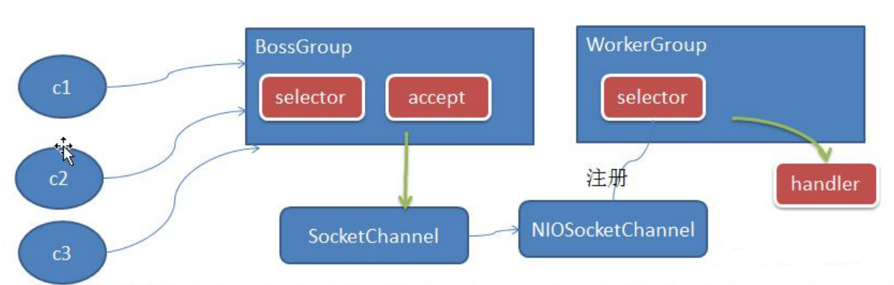

**对上图分析**

1. BossGroup 线程维护 Selector , 只关注 Accecpt 
2. 当接收到 Accept 事件，获取到对应的 SocketChannel, 封装成 NIOScoketChannel 并注册到 Worker 线程(事件循 环), 并进行维护 
3. 当 Worker 线程监听到 selector 中通道发生自己感兴趣的事件后，就进行处理(就由 handler)， 注意 handler 已 经加入到通道


#### 5.5.2 工作原理示意图 2-进阶版

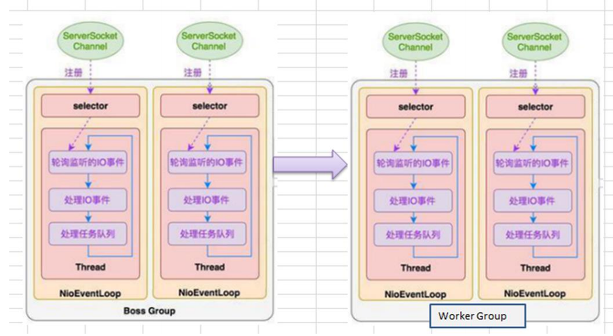

#### 5.5.3 工作原理示意图-详细版

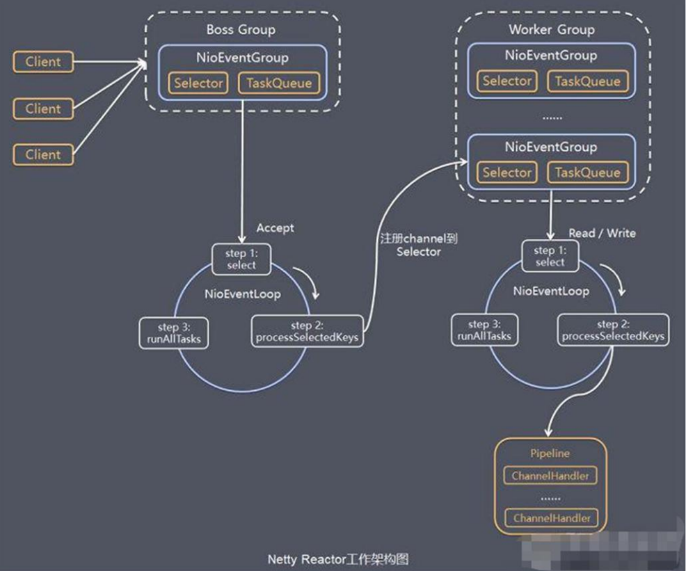

**对上图的分析**

1. Netty 抽象出两组线程池 BossGroup 专门负责接收客户端的连接, WorkerGroup 专门负责网络的读写 
2. BossGroup 和 WorkerGroup 类型都是 NioEventLoopGroup 
3. NioEventLoopGroup 相当于一个事件循环组, 这个组中含有多个事件循环 ，每一个事件循环是 NioEventLoop 
4. NioEventLoop 表示一个不断循环的执行处理任务的线程， 每个 NioEventLoop 都有一个 selector , 用于监听绑 定在其上的 socket 的网络通讯 
5. NioEventLoopGroup 可以有多个线程, 即可以含有多个 NioEventLoop 
6. 每个 Boss NioEventLoop 循环执行的步骤有 3 步
	- 轮询 accept 事件 
	- 处理 accept 事件 , 与 client 建立连接 , 生成 NioScocketChannel , 并将其注册到某个 worker NIOEventLoop 上 的 selector 
	- 处理任务队列的任务 ， 即 runAllTasks 
7. 每个 Worker NIOEventLoop 循环执行的步骤
	-  轮询 read, write 事件 
	- 处理 i/o 事件， 即 read , write 事件，在对应 NioScocketChannel 处理 
	- 处理任务队列的任务 ， 即 runAllTasks
8. 每个Worker NIOEventLoop 处理业务时，会使用pipeline(管道), pipeline 中包含了 channel , 即通过pipeline 可以获取到对应通道, 管道中维护了很多的 处理器


#### 5.5.4 Netty 快速入门实例-TCP 服务

```markdown
实例要求：使用 IDEA 创建 Netty 项目
说明: 创建 Maven 项目，并引入 Netty 包*

1. Netty 服务器在 6668 端口监听，客户端能发送消息给服务器 "hello, 服务器~"
2. 服务器可以回复消息给客户端 "hello, 客户端~"
3. 目的：对 Netty 线程模型 有一个初步认识, 便于理解 Netty 模型理论
```


```java
NettyServer.java package com.atguigu.netty.simple;import io.netty.bootstrap.ServerBootstrap; import io.netty.channel.ChannelFuture; import io.netty.channel.ChannelInitializer; import io.netty.channel.ChannelOption; import io.netty.channel.EventLoopGroup; import io.netty.channel.nio.NioEventLoopGroup; import io.netty.channel.socket.SocketChannel; import io.netty.channel.socket.nio.NioServerSocketChannel; import io.netty.channel.socket.nio.NioSocketChannel; public class NettyServer { public static void main(String[] args) throws Exception { //创建 BossGroup 和 WorkerGroup //说明 //1. 创建两个线程组 bossGroup 和 workerGroup //2. bossGroup 只是处理连接请求 , 真正的和客户端业务处理，会交给 workerGroup 完成 //3. 两个都是无限循环 //4. bossGroup 和 workerGroup 含有的子线程(NioEventLoop)的个数 // 默认实际 cpu 核数 * 2 EventLoopGroup bossGroup = new NioEventLoopGroup(1); EventLoopGroup workerGroup = new NioEventLoopGroup(); try {//创建服务器端的启动对象，配置参数 ServerBootstrap bootstrap = new ServerBootstrap(); //使用链式编程来进行设置 bootstrap.group(bossGroup, workerGroup) //设置两个线程组 .channel(NioServerSocketChannel.class) //使用 NioSocketChannel 作为服务器的通道实现 .option(ChannelOption.SO_BACKLOG, 128) // 设置线程队列得到连接个数 .childOption(ChannelOption.SO_KEEPALIVE, true) //设置保持活动连接状态 .childHandler(new ChannelInitializer<SocketChannel>() {//创建一个通道测试对象(匿名对象) //给 pipeline 设置处理器 @Override protected void initChannel(SocketChannel ch) throws Exception { ch.pipeline().addLast(new NettyServerHandler()); } }); // 给我们的 workerGroup 的 EventLoop 对应的管道设置处理器 System.out.println(".....服务器 is ready..."); //绑定一个端口并且同步, 生成了一个 ChannelFuture 对象 //启动服务器(并绑定端口) ChannelFuture cf = bootstrap.bind(6668).sync(); //对关闭通道进行监听 cf.channel().closeFuture().sync(); }finally { bossGroup.shutdownGracefully();workerGroup.shutdownGracefully(); } } }
```

```java
NettyServerHandler.java package com.atguigu.netty.simple; import io.netty.buffer.ByteBuf; import io.netty.buffer.Unpooled; import io.netty.channel.Channel; import io.netty.channel.ChannelHandlerContext; import io.netty.channel.ChannelInboundHandlerAdapter; import io.netty.channel.ChannelPipeline; import io.netty.util.CharsetUtil; /*说明1. 我们自定义一个 Handler 需要继续 netty 规定好的某个 HandlerAdapter(规范) 2. 这时我们自定义一个 Handler , 才能称为一个 handler */ public class NettyServerHandler extends ChannelInboundHandlerAdapter { //读取数据实际(这里我们可以读取客户端发送的消息)/*1. ChannelHandlerContext ctx:上下文对象, 含有 管道 pipeline , 通道 channel, 地址 2. Object msg: 就是客户端发送的数据 默认 Object */ @Override public void channelRead(ChannelHandlerContext ctx, Object msg) throws Exception { System.out.println("服务器读取线程 " + Thread.currentThread().getName()); System.out.println("server ctx =" + ctx); System.out.println("看看 channel 和 pipeline 的关系"); Channel channel = ctx.channel(); ChannelPipeline pipeline = ctx.pipeline(); //本质是一个双向链接, 出站入站 //将 msg 转成一个 ByteBuf //ByteBuf 是 Netty 提供的，不是 NIO 的 ByteBuffer. ByteBuf buf = (ByteBuf) msg; System.out.println("客户端发送消息是:" + buf.toString(CharsetUtil.UTF_8)); System.out.println("客户端地址:" + channel.remoteAddress()); }//数据读取完毕 @Override public void channelReadComplete(ChannelHandlerContext ctx) throws Exception { //writeAndFlush 是 write + flush//将数据写入到缓存，并刷新 //一般讲，我们对这个发送的数据进行编码 ctx.writeAndFlush(Unpooled.copiedBuffer("hello, 客户端~(>^ω^<)喵", CharsetUtil.UTF_8)); }//处理异常, 一般是需要关闭通道 @Override public void exceptionCaught(ChannelHandlerContext ctx, Throwable cause) throws Exception { ctx.close(); } }
```

```java
NettyClient.java package com.atguigu.netty.simple; import io.netty.bootstrap.Bootstrap; import io.netty.channel.ChannelFuture; import io.netty.channel.ChannelInitializer; import io.netty.channel.EventLoopGroup; import io.netty.channel.nio.NioEventLoopGroup; import io.netty.channel.socket.SocketChannel; import io.netty.channel.socket.nio.NioSocketChannel; public class NettyClient { public static void main(String[] args) throws Exception {//客户端需要一个事件循环组 EventLoopGroup group = new NioEventLoopGroup(); try { //创建客户端启动对象 //注意客户端使用的不是 ServerBootstrap 而是 Bootstrap Bootstrap bootstrap = new Bootstrap(); //设置相关参数 bootstrap.group(group) //设置线程组 .channel(NioSocketChannel.class) // 设置客户端通道的实现类(反射) .handler(new ChannelInitializer<SocketChannel>() { @Override protected void initChannel(SocketChannel ch) throws Exception { ch.pipeline().addLast(new NettyClientHandler()); //加入自己的处理器 } }); System.out.println("客户端 ok.."); //启动客户端去连接服务器端 //关于 ChannelFuture 要分析，涉及到 netty 的异步模型 ChannelFuture channelFuture = bootstrap.connect("127.0.0.1", 6668).sync(); //给关闭通道进行监听channelFuture.channel().closeFuture().sync(); }finally { group.shutdownGracefully(); } } }
```

```java
NettyClientHandler.java package com.atguigu.netty.simple; import io.netty.buffer.ByteBuf; import io.netty.buffer.Unpooled; import io.netty.channel.ChannelHandlerContext; import io.netty.channel.ChannelInboundHandlerAdapter; import io.netty.util.CharsetUtil; public class NettyClientHandler extends ChannelInboundHandlerAdapter { //当通道就绪就会触发该方法 @Override public void channelActive(ChannelHandlerContext ctx) throws Exception { System.out.println("client " + ctx); ctx.writeAndFlush(Unpooled.copiedBuffer("hello, server: (>^ω^<)喵", CharsetUtil.UTF_8)); }//当通道有读取事件时，会触发 @Override public void channelRead(ChannelHandlerContext ctx, Object msg) throws Exception { ByteBuf buf = (ByteBuf) msg; System.out.println("服务器回复的消息:" + buf.toString(CharsetUtil.UTF_8)); System.out.println("服务器的地址： "+ ctx.channel().remoteAddress()); }@Override public void exceptionCaught(ChannelHandlerContext ctx, Throwable cause) throws Exception { cause.printStackTrace(); ctx.close(); } }
```


#### 5.5.5 任务队列中的 Task 有 3 种典型使用场景 

```markdown
1) 用户程序自定义的普通任务 [举例说明] 
2) 用户自定义定时任务 
3) 非当前 Reactor 线程调用 Channel 的各种方法 
例如在推送系统的业务线程里面，根据用户的标识，找到对应的 Channel 引用，然后调用 Write 类方法向该用户推送消息，就会进入到这种场景。最终的 Write 会提交到任务队列中后被异步消费
```

```java
package com.atguigu.netty.simple; import io.netty.buffer.ByteBuf; import io.netty.buffer.Unpooled; import io.netty.channel.Channel; import io.netty.channel.ChannelHandlerContext; import io.netty.channel.ChannelInboundHandlerAdapter; import io.netty.channel.ChannelPipeline; import io.netty.util.CharsetUtil; import java.util.concurrent.TimeUnit; /*说明1. 我们自定义一个 Handler 需要继续 netty 规定好的某个 HandlerAdapter(规范) 2. 这时我们自定义一个 Handler , 才能称为一个 handler */ public class NettyServerHandler extends ChannelInboundHandlerAdapter { //读取数据实际(这里我们可以读取客户端发送的消息) /*1. ChannelHandlerContext ctx:上下文对象, 含有 管道 pipeline , 通道 channel, 地址 2. Object msg: 就是客户端发送的数据 默认 Object */@Override public void channelRead(ChannelHandlerContext ctx, Object msg) throws Exception { //比如这里我们有一个非常耗时长的业务-> 异步执行 -> 提交该 channel 对应的 //NIOEventLoop 的 taskQueue 中, //解决方案 1 用户程序自定义的普通任务 ctx.channel().eventLoop().execute(new Runnable() { @Override public void run() { try {Thread.sleep(5 * 1000); ctx.writeAndFlush(Unpooled.copiedBuffer("hello, 客户端~(>^ω^<)喵 2", CharsetUtil.UTF_8)); System.out.println("channel code=" + ctx.channel().hashCode()); } catch (Exception ex) { System.out.println("发生异常" + ex.getMessage()); } } }); ctx.channel().eventLoop().execute(new Runnable() { @Override public void run() {try {Thread.sleep(5 * 1000); ctx.writeAndFlush(Unpooled.copiedBuffer("hello, 客户端~(>^ω^<)喵 3", CharsetUtil.UTF_8)); System.out.println("channel code=" + ctx.channel().hashCode()); } catch (Exception ex) { System.out.println("发生异常" + ex.getMessage()); } } }); //解决方案 2 : 用户自定义定时任务 -》 该任务是提交到 scheduledTaskQueue 中 ctx.channel().eventLoop().schedule(new Runnable() { @Override public void run() { try {Thread.sleep(5 * 1000); ctx.writeAndFlush(Unpooled.copiedBuffer("hello, 客户端~(>^ω^<)喵 4", CharsetUtil.UTF_8)); System.out.println("channel code=" + ctx.channel().hashCode()); } catch (Exception ex) { System.out.println("发生异常" + ex.getMessage()); } } }, 5, TimeUnit.SECONDS);System.out.println("go on ..."); // System.out.println("服务器读取线程 " + Thread.currentThread().getName()); // System.out.println("server ctx =" + ctx); // System.out.println("看看 channel 和 pipeline 的关系"); // Channel channel = ctx.channel(); // ChannelPipeline pipeline = ctx.pipeline(); //本质是一个双向链接, 出站入站 ////// //将 msg 转成一个 ByteBuf // //ByteBuf 是 Netty 提供的，不是 NIO 的 ByteBuffer. // ByteBuf buf = (ByteBuf) msg; // System.out.println("客户端发送消息是:" + buf.toString(CharsetUtil.UTF_8)); // System.out.println("客户端地址:" + channel.remoteAddress()); }//数据读取完毕 @Override public void channelReadComplete(ChannelHandlerContext ctx) throws Exception { //writeAndFlush 是 write + flush //将数据写入到缓存，并刷新//一般讲，我们对这个发送的数据进行编码 ctx.writeAndFlush(Unpooled.copiedBuffer("hello, 客户端~(>^ω^<)喵 1", CharsetUtil.UTF_8)); }//处理异常, 一般是需要关闭通道 @Override public void exceptionCaught(ChannelHandlerContext ctx, Throwable cause) throws Exception { ctx.close(); } }
```


#### 5.5.6 方案再说明

1. Netty 抽象出两组线程池，BossGroup 专门负责接收客户端连接，WorkerGroup 专门负责网络读写操作。
2. NioEventLoop 表示一个不断循环执行处理任务的线程，每个 NioEventLoop 都有一个 selector，用于监听绑定 在其上的 socket 网络通道。 
3. NioEventLoop 内部采用串行化设计，从消息的读取->解码->处理->编码->发送，始终由 IO 线程 NioEventLoop 负责

NioEventLoopGroup 下包含多个 NioEventLoop

- 每个 NioEventLoop 中包含有一个 Selector，一个 taskQueue 
- 每个 NioEventLoop 的 Selector 上可以注册监听多个 NioChannel
- 每个 NioChannel 只会绑定在唯一的 NioEventLoop 上
- 每个 NioChannel 都绑定有一个自己的 ChannelPipeline


### 5.6 异步模型

#### 5.6.1 基本介绍

1. 异步的概念和同步相对。当一个异步过程调用发出后，调用者不能立刻得到结果。实际处理这个调用的组件在 完成后，通过状态、通知和回调来通知调用者。
2. Netty 中的 I/O 操作是异步的，包括 Bind、Write、Connect 等操作会简单的返回一个 ChannelFuture。 
3. 调用者并不能立刻获得结果，而是通过 Future-Listener 机制，用户可以方便的主动获取或者通过通知机制获得 IO 操作结果
4. Netty 的异步模型是建立在 future 和 callback 的之上的。callback 就是回调。重点说 Future，它的核心思想 是：假设一个方法 fun，计算过程可能非常耗时，等待 fun 返回显然不合适。那么可以在调用 fun 的时候，立 马返回一个 Future，后续可以通过 Future 去监控方法 fun 的处理过程(即 ： Future-Listener 机制) 

#### 5.6.2 Future 说明 

1. 表示**异步的执行结果**, 可以通过它提供的方法来检测执行是否完成，比如检索计算等等
2. ChannelFuture 是一个接口 ： `public interface ChannelFuture extends Future<Void>` 我们可以添**加监听器，当监听的事件发生时，就会通知到监听器**. 案例说明 

#### 5.6.3 工作原理示意图


说明:

1. 在使用 Netty 进行编程时，拦截操作和转换出入站数据只需要您提供 callback 或利用 future 即可。这使得链 式操作简单、高效, 并有利于编写可重用的、通用的代码。
2. Netty 框架的目标就是让你的业务逻辑从网络基础应用编码中分离出来、解脱出来 

#### 5.6.4 Future-Listener 机制

1. 当 Future 对象刚刚创建时，处于非完成状态，调用者可以通过返回的 ChannelFuture 来获取操作执行的状态， 注册监听函数来执行完成后的操作。
2. 常见有如下操作
   - 通过 isDone 方法来判断当前操作是否完成；
   - 通过 isSuccess 方法来判断已完成的当前操作是否成功；
   - 通过 getCause 方法来获取已完成的当前操作失败的原因；
   - 通过 isCancelled 方法来判断已完成的当前操作是否被取消； 
   - 通过 addListener 方法来注册监听器，当操作已完成(isDone 方法返回完成)，将会通知指定的监听器；如果 Future 对象已完成，则通知指定的监听器 

```markdown
# 绑定端口是异步操作，当绑定操作处理完，将会调用相应的监听器处理逻辑
```

```java
//绑定一个端口并且同步, 生成了一个 ChannelFuture 对象 //启动服务器(并绑定端口) ChannelFuture cf = bootstrap.bind(6668).sync(); //给 cf 注册监听器，监控我们关心的事件 cf.addListener(new ChannelFutureListener() { @Override public void operationComplete(ChannelFuture future) throws Exception { if (cf.isSuccess()) { System.out.println("监听端口 6668 成功"); } else {System.out.println("监听端口 6668 失败"); } } });
```


### 5.7 快速入门实例-HTTP 服务

**实验要求:**

```markdown
1) 使用 IDEA 创建 Netty 项目 
2) Netty 服务器在 6668 端口监听，浏览器发出请求 "http://localhost:6668/ " 
3) 服务器可以回复消息给客户端 "Hello! 我是服务器 5 " , 并对特定请求资源进行过滤.
4) 目的：Netty 可以做 Http 服务开发，并且理解 Handler 实例和客户端及其请求的关系.
```

**idea引入nettyjar包**

1. ctrl+shift+al+s

   

2. 然后从maven下载netty; 注意第2个图需要勾选上lib

   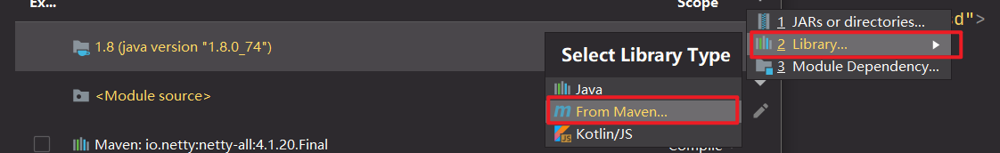

   

   

```java
//TestServer.java 
package com.atguigu.netty.http;
import io.netty.bootstrap.ServerBootstrap;
import io.netty.channel.ChannelFuture;
import io.netty.channel.EventLoopGroup;
import io.netty.channel.nio.NioEventLoopGroup;
import io.netty.channel.socket.nio.NioServerSocketChannel;
public class TestServer {
    public static void main(String[] args) throws Exception {
        EventLoopGroup bossGroup = new NioEventLoopGroup(1);
        EventLoopGroup workerGroup = new NioEventLoopGroup();
        try {
            ServerBootstrap serverBootstrap = new ServerBootstrap();
            serverBootstrap.group(bossGroup, workerGroup)
                           .channel(NioServerSocketChannel.class)
                           .childHandler(new TestServerInitializer());

            ChannelFuture channelFuture = serverBootstrap.bind(6668).sync();
            channelFuture.channel().closeFuture().sync();
        } finally {
            bossGroup.shutdownGracefully();
            workerGroup.shutdownGracefully();
        }
    }
}
```

```java
//TestServerInitializer.java 
package com.atguigu.netty.http; 
import io.netty.channel.ChannelInitializer;
import io.netty.channel.ChannelPipeline;
import io.netty.channel.socket.SocketChannel;
import io.netty.handler.codec.http.HttpServerCodec; 
public class TestServerInitializer extends ChannelInitializer<SocketChannel> {
    @Override 
    protected void initChannel(SocketChannel ch) throws Exception { 
        //向管道加入处理器 
        //得到管道
        ChannelPipeline pipeline = ch.pipeline(); 
        //加入一个 netty 提供的 httpServerCodec codec =>[coder - decoder] //HttpServerCodec 说明 //1. HttpServerCodec 是 netty 提供的处理 http 的 编-解码器 pipeline.addLast("MyHttpServerCodec",new HttpServerCodec()); //2. 增加一个自定义的 handler pipeline.addLast("MyTestHttpServerHandler", new TestHttpServerHandler()); } }
```

```java
//TestHttpServerHandler.java 
package com.atguigu.netty.http; 
import io.netty.buffer.ByteBuf; 
import io.netty.buffer.Unpooled; 
import io.netty.channel.ChannelHandlerContext; 
import io.netty.channel.SimpleChannelInboundHandler;
import io.netty.handler.codec.http.*; 
import io.netty.util.CharsetUtil; 
import java.net.URI; 
/*说明
1. SimpleChannelInboundHandler 是 ChannelInboundHandlerAdapter
2. HttpObject 客户端和服务器端相互通讯的数据被封装成 HttpObject */ 
public class TestHttpServerHandler extends SimpleChannelInboundHandler<HttpObject> { 
    //channelRead0 读取客户端数据 
    @Override protected void channelRead0(ChannelHandlerContext ctx, HttpObject msg) throws Exception { //判断 msg 是不是 httprequest 请求 if(msg instanceof HttpRequest) { System.out.println("pipeline hashcode" + ctx.pipeline().hashCode() + " TestHttpServerHandler hash=" + this.hashCode()); System.out.println("msg 类型=" + msg.getClass()); System.out.println("客户端地址" + ctx.channel().remoteAddress());//获取到 HttpRequest httpRequest = (HttpRequest) msg; //获取 uri, 过滤指定的资源 URI uri = new URI(httpRequest.uri()); if("/favicon.ico".equals(uri.getPath())) { System.out.println("请求了 favicon.ico, 不做响应"); return; }//回复信息给浏览器 [http 协议] ByteBuf content = Unpooled.copiedBuffer("hello, 我是服务器", CharsetUtil.UTF_8); //构造一个 http 的相应，即 httpresponse FullHttpResponse response = new DefaultFullHttpResponse(HttpVersion.HTTP_1_1, HttpResponseStatus.OK, content); response.headers().set(HttpHeaderNames.CONTENT_TYPE, "text/plain"); response.headers().set(HttpHeaderNames.CONTENT_LENGTH, content.readableBytes()); //将构建好 response 返回 ctx.writeAndFlush(response); } }}
```


---

## 第 6 章: Netty核心模块组件

### 6.1 Bootstrap、ServerBootstrap

1. Bootstrap 意思是引导，一个 Netty 应用通常由一个 Bootstrap 开始，主要作用是配置整个 Netty 程序，串联 各个组件，Netty 中 Bootstrap 类是客户端程序的启动引导类，ServerBootstrap 是服务端启动引导类

2. 常见的方法有

   ```java
   public ServerBootstrap group(EventLoopGroup parentGroup, EventLoopGroup childGroup)//该方法用于服务器端， 用来设置两个 EventLoop 
   public B group(EventLoopGroup group) //该方法用于客户端，用来设置一个 EventLoop 
   public B channel(Class<? extends C> channelClass)//该方法用来设置一个服务器端的通道实现 
   public <T> B option(ChannelOption<T> option, T value)//用来给 ServerChannel 添加配置 
   public <T> ServerBootstrap childOption(ChannelOption<T> childOption, T value)//用来给接收到的通道添加配置 
   public ServerBootstrap childHandler(ChannelHandler childHandler)//该方法用来设置业务处理类（自定义的 handler）public ChannelFuture bind(int inetPort) ，该方法用于服务器端，用来设置占用的端口号 
   public ChannelFuture connect(String inetHost, int inetPort) //该方法用于客户端，用来连接服务器端
   ```

   

### 6.2 Future、ChannelFuture 

1. Netty 中所有的 IO 操作都是异步的，不能立刻得知消息是否被正确处理。但是可以过一会等它执行完成或 者直接注册一个监听，具体的实现就是通过 Future 和 ChannelFutures，他们可以注册一个监听，当操作执行成功 或失败时监听会自动触发注册的监听事件 

2. 常见的方法有

   ```java
   Channel channel()//返回当前正在进行 IO 操作的通道
   ChannelFuture sync()//等待异步操作执行完毕
   ```

   

### 6.3 Channel

1. Netty 网络通信的组件，能够用于执行网络 I/O 操作。 

2. 通过 Channel 可获得当前网络连接的通道的状态 

3. 通过 Channel 可获得 网络连接的配置参数 （例如接收缓冲区大小） 

4. Channel 提供异步的网络 I/O 操作(如建立连接，读写，绑定端口)，异步调用意味着任何 I/O 调用都将立即返 回，并且不保证在调用结束时所请求的 I/O 操作已完成 

5. 调用立即返回一个 ChannelFuture 实例，通过注册监听器到 ChannelFuture 上，可以 I/O 操作成功、失败或取 消时回调通知调用方

6. 支持关联 I/O 操作与对应的处理程序 

7. 不同协议、不同的阻塞类型的连接都有不同的 Channel 类型与之对应，常用的 Channel 类型:

   ```java
   NioSocketChannel//异步的客户端 TCP Socket 连接。 
   NioServerSocketChannel//异步的服务器端 TCP Socket 连接。 
   NioDatagramChannel//异步的 UDP 连接。 
   NioSctpChannel//异步的客户端 Sctp 连接。 
   NioSctpServerChannel//异步的 Sctp 服务器端连接，这些通道涵盖了 UDP 和 TCP网络 IO 以及文件 IO。
   ```

   


### 6.4 Selector 

1. Netty 基于 Selector 对象实现 I/O 多路复用，通过 Selector 一个线程可以监听多个连接的 Channel 事件。
2. 当向一个 Selector 中注册 Channel 后，Selector 内部的机制就可以自动不断地查询(Select) 这些注册的 Channel 是否有已就绪的 I/O 事件（例如可读，可写，网络连接完成等），这样程序就可以很简单地使用一个 线程高效地管理多个 Channel

### 6.5 ChannelHandler 及其实现类

1. ChannelHandler 是一个接口，处理 I/O 事件或拦截 I/O 操作，并将其转发到其 ChannelPipeline(业务处理链) 中的下一个处理程序。 
2. ChannelHandler 本身并没有提供很多方法，因为这个接口有许多的方法需要实现，方便使用期间，可以继承它 的子类
3. ChannelHandler 及其实现类一览图(后) 

### 6.6 Pipeline 和 ChannelPipeline

*ChannelPipeline 是一个重点：*

1. ChannelPipeline 是一个 Handler 的集合，它负责处理和拦截 inbound 或者 outbound 的事件和操作，相当于 一个贯穿 Netty 的链。(也可以这样理解：ChannelPipeline 是 保存 ChannelHandler 的 List，用于处理或拦截 Channel 的入站事件和出站操作) 

2. ChannelPipeline 实现了一种高级形式的拦截过滤器模式，使用户可以完全控制事件的处理方式，以及 Channel 中各个的 ChannelHandler 如何相互交互 

3. 在 Netty 中每个 Channel 都有且仅有一个 ChannelPipeline 与之对应，它们的组成关系如下

   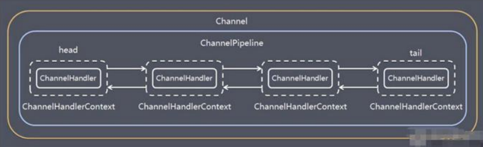

   > - 一个Channel包含了一个ChannelPipeline，而ChannelPipeline中又维护了一个由ChannelHandlerContex组成的双向链表，并且每个ChannelHandlerContext中又关联着一个ChannelHandler
   > - 入站事件和出站事件在一个双向链表中，入站事件会从链表head往后传递到最后一个入站的handler，出站事件会从链表tail往前传递到最前一个出站的handler，两种类型的handler互不干扰

4. 常用方法

   ```java
   ChannelPipeline addFirst(ChannelHandler... handlers)//把一个业务处理类（handler）添加到链中的第一个位置 
   ChannelPipeline addLast(ChannelHandler... handlers)//把一个业务处理类（handler）添加到链中的最后一个位置
   ```

   

### 6.7 ChannelHandlerContext

1. 保存 Channel 相关的所有上下文信息，同时关联一个 ChannelHandler 对象

2. 即 ChannelHandlerContext 中 包 含 一 个 具 体 的 事 件 处 理 器 ChannelHandler ， 同 时 ChannelHandlerContext 中也绑定了对应的 pipeline 和 Channel 的信息，方便对 ChannelHandler 进行调用.

3. 常用方法

   ```java
   ChannelFuture closel()//关闭通道
   Channeloutboundlnvoker flush() //刷新
   ChannelFuture writeAndFlush(Object msg)//将数据写到ChannelPipeline中当前ChannelHandler的下一个ChannelHandler开始处理（出站）
   ```

   

### 6.8 ChannelOption

1. Netty 在创建 Channel 实例后,一般都需要设置 ChannelOption 参数。

2. ChannelOption 参数如下:

   ```java
   ChannelOption.So BACKLOG // 对应TCP/IP协议listen函数中的backlog参数，用来初始化服务器可连接队列大小。服务端处理客户端连接请求是顺序处理的，所以同一时间只能处理一个客户端连接。多个客户端来的时候，服务端将不能处理的客户端连接请求放在队列中等待处理，backlog参数指定了队列的大小。
   ChannelOption.SO KEEPALIVE // 一直保持连接活动状态
   ```

   

### 6.9 EventLoopGroup 和其实现类 NioEventLoopGroup

1. EventLoopGroup 是一组 EventLoop 的抽象，Netty 为了更好的利用多核 CPU 资源，一般会有多个 EventLoop 同时工作，每个 EventLoop 维护着一个 Selector 实例。

2. EventLoopGroup 提供 next 接口，可以从组里面按照一定规则获取其中一个 EventLoop 来处理任务。在 Netty 服 务 器 端 编 程 中 ， 我 们 一 般 都 需 要 提 供 两 个 EventLoopGroup ， 例 如 ： BossEventLoopGroup 和 WorkerEventLoopGroup。

3. 通常一个服务端口即一个 ServerSocketChannel 对应一个 Selector 和一个 EventLoop 线程。BossEventLoop 负责 接收客户端的连接并将 SocketChannel 交给 WorkerEventLoopGroup 来进行 IO 处理，如下图所示

   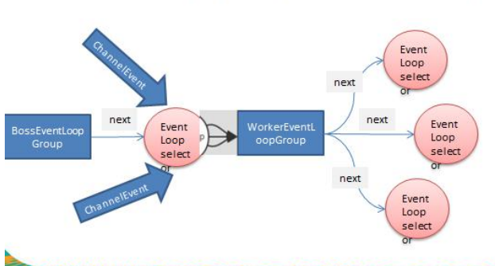

   ```markdown
   # 对上图解读
   - BossEventLoopGroup通常是一个单线程的EventLoop，EventLoop维护着一个注册了ServerSocketChannel的Selector实例BossEventloop不断轮询Selector将连接事件分离出来
   - 通常是OPACCEPT事件，然后将接收到的SocketChannel交给WorkerEventLoopGroup 
   - WorkerEventLoopGroup会由next选择其中一个EventLoop来将这个SocketChannel注册到其维护的Selector并对其后续的10事件进行处理
   ```

4. 常用方法

   ```java
   public NioEventLoopGroup()//构造方法 
   public Future<?> shutdownGracefully()//断开连接，关闭线程
   ```

   


### 6.10 Unpooled 类

1. Netty 提供一个专门用来操作缓冲区(即 Netty 的数据容器)的工具类

2. 常用方法如下

   ```java
   public static ByteBuf copiedBuffer(CharSequence string, Charset charset)//通过给定的数据和字符编码返回一个ByteBuf对象（类似于NO中的ByteBuffer但有区别）
   ```

举例说明 Unpooled 获取 Netty 的数据容器 ByteBuf 的基本使用 【案例演示】

- 案例一

  ```java
  package com.atguigu.netty.buf; import io.netty.buffer.ByteBuf; import io.netty.buffer.Unpooled; public class NettyByteBuf01 { public static void main(String[] args) { //创建一个 ByteBuf //说明 //1. 创建 对象，该对象包含一个数组 arr , 是一个 byte[10] //2. 在 netty 的 buffer 中，不需要使用 flip 进行反转 // 底层维护了 readerindex 和 writerIndex //3. 通过 readerindex 和 writerIndex 和 capacity， 将 buffer 分成三个区域 // 0---readerindex 已经读取的区域 // readerindex---writerIndex ， 可读的区域 // writerIndex -- capacity, 可写的区域 ByteBuf buffer = Unpooled.buffer(10); for(int i = 0; i < 10; i++) { buffer.writeByte(i); }System.out.println("capacity=" + buffer.capacity());//10 //输出// for(int i = 0; i<buffer.capacity(); i++) { // System.out.println(buffer.getByte(i)); // }for(int i = 0; i < buffer.capacity(); i++) { System.out.println(buffer.readByte()); }System.out.println("执行完毕"); } }
  
  ```

- 案例二

  ```java
  package com.atguigu.netty.buf; import io.netty.buffer.ByteBuf; import io.netty.buffer.Unpooled; import java.nio.charset.Charset; public class NettyByteBuf02 { public static void main(String[] args) { //创建 ByteBuf ByteBuf byteBuf = Unpooled.copiedBuffer("hello,world!", Charset.forName("utf-8")); //使用相关的方法if(byteBuf.hasArray()) { // true byte[] content = byteBuf.array(); //将 content 转成字符串 System.out.println(new String(content, Charset.forName("utf-8"))); System.out.println("byteBuf=" + byteBuf); System.out.println(byteBuf.arrayOffset()); // 0 System.out.println(byteBuf.readerIndex()); // 0 System.out.println(byteBuf.writerIndex()); // 12 System.out.println(byteBuf.capacity()); // 36 //System.out.println(byteBuf.readByte()); // System.out.println(byteBuf.getByte(0)); // 104 int len = byteBuf.readableBytes(); //可读的字节数 12 System.out.println("len=" + len); //使用 for 取出各个字节 for(int i = 0; i < len; i++) { System.out.println((char) byteBuf.getByte(i)); }//按照某个范围读取System.out.println(byteBuf.getCharSequence(0, 4, Charset.forName("utf-8"))); System.out.println(byteBuf.getCharSequence(4, 6, Charset.forName("utf-8"))); } } }
  ```

  

### 6.11 Netty 应用实例-群聊系统

```markdown
# 实例要求:
1) 编写一个 Netty 群聊系统，实现服务器端和客户端之间的数据简单通讯（非阻塞） 
2) 实现多人群聊 
3) 服务器端：可以监测用户上线，离线，并实现消息转发功能 
4) 客户端：通过 channel 可以无阻塞发送消息给其它所有用户，同时可以接受其它用户发送的消息(有服务器转发 得到) 
5) 目的：进一步理解 Netty 非阻塞网络编程机制 
6) 看老师代码演示
```

```java
package com.atguigu.netty.groupchat; import io.netty.bootstrap.ServerBootstrap; import io.netty.channel.*; import io.netty.channel.nio.NioEventLoopGroup; import io.netty.channel.socket.SocketChannel; import io.netty.channel.socket.nio.NioServerSocketChannel; import io.netty.handler.codec.string.StringDecoder; import io.netty.handler.codec.string.StringEncoder; public class GroupChatServer { private int port; //监听端口public GroupChatServer(int port) { this.port = port; }//编写 run 方法，处理客户端的请求 public void run() throws Exception{ //创建两个线程组 EventLoopGroup bossGroup = new NioEventLoopGroup(1); EventLoopGroup workerGroup = new NioEventLoopGroup(); //8 个 NioEventLoop try { ServerBootstrap b = new ServerBootstrap(); b.group(bossGroup, workerGroup) .channel(NioServerSocketChannel.class) .option(ChannelOption.SO_BACKLOG, 128) .childOption(ChannelOption.SO_KEEPALIVE, true) .childHandler(new ChannelInitializer<SocketChannel>() { @Override protected void initChannel(SocketChannel ch) throws Exception { //获取到 pipelineChannelPipeline pipeline = ch.pipeline(); //向 pipeline 加入解码器 pipeline.addLast("decoder", new StringDecoder()); //向 pipeline 加入编码器 pipeline.addLast("encoder", new StringEncoder()); //加入自己的业务处理 handler pipeline.addLast(new GroupChatServerHandler()); } }); System.out.println("netty 服务器启动"); ChannelFuture channelFuture = b.bind(port).sync(); //监听关闭 channelFuture.channel().closeFuture().sync(); }finally { bossGroup.shutdownGracefully(); workerGroup.shutdownGracefully(); } }public static void main(String[] args) throws Exception { new GroupChatServer(7000).run();} }
```

```java
package com.atguigu.netty.groupchat; import io.netty.channel.Channel; import io.netty.channel.ChannelHandlerContext; import io.netty.channel.SimpleChannelInboundHandler; import io.netty.channel.group.ChannelGroup; import io.netty.channel.group.DefaultChannelGroup; import io.netty.util.concurrent.GlobalEventExecutor; import java.text.SimpleDateFormat; import java.util.ArrayList; import java.util.HashMap; import java.util.List; import java.util.Map; public class GroupChatServerHandler extends SimpleChannelInboundHandler<String> { //public static List<Channel> channels = new ArrayList<Channel>(); //使用一个 hashmap 管理 //public static Map<String, Channel> channels = new HashMap<String,Channel>(); //定义一个 channle 组，管理所有的 channel//GlobalEventExecutor.INSTANCE) 是全局的事件执行器，是一个单例 private static ChannelGroup channelGroup = new DefaultChannelGroup(GlobalEventExecutor.INSTANCE); SimpleDateFormat sdf = new SimpleDateFormat("yyyy-MM-dd HH:mm:ss"); //handlerAdded 表示连接建立，一旦连接，第一个被执行 //将当前 channel 加入到 channelGroup @Override public void handlerAdded(ChannelHandlerContext ctx) throws Exception { Channel channel = ctx.channel(); //将该客户加入聊天的信息推送给其它在线的客户端 /*该方法会将 channelGroup 中所有的 channel 遍历，并发送 消息， 我们不需要自己遍历 */ channelGroup.writeAndFlush("[ 客 户 端 ]" + channel.remoteAddress() + " 加 入 聊 天 " + sdf.format(new java.util.Date()) + " \n"); channelGroup.add(channel); }//断开连接, 将 xx 客户离开信息推送给当前在线的客户 @Overridepublic void handlerRemoved(ChannelHandlerContext ctx) throws Exception { Channel channel = ctx.channel(); channelGroup.writeAndFlush("[客户端]" + channel.remoteAddress() + " 离开了\n"); System.out.println("channelGroup size" + channelGroup.size()); }//表示 channel 处于活动状态, 提示 xx 上线 @Override public void channelActive(ChannelHandlerContext ctx) throws Exception { System.out.println(ctx.channel().remoteAddress() + " 上线了~"); }//表示 channel 处于不活动状态, 提示 xx 离线了 @Override public void channelInactive(ChannelHandlerContext ctx) throws Exception { System.out.println(ctx.channel().remoteAddress() + " 离线了~"); }//读取数据 @Override protected void channelRead0(ChannelHandlerContext ctx, String msg) throws Exception {//获取到当前 channel Channel channel = ctx.channel(); //这时我们遍历 channelGroup, 根据不同的情况，回送不同的消息 channelGroup.forEach(ch -> { if(channel != ch) { //不是当前的 channel,转发消息 ch.writeAndFlush("[客户]" + channel.remoteAddress() + " 发送了消息" + msg + "\n"); }else {//回显自己发送的消息给自己 ch.writeAndFlush("[自己]发送了消息" + msg + "\n"); } }); }@Override public void exceptionCaught(ChannelHandlerContext ctx, Throwable cause) throws Exception { //关闭通道 ctx.close(); } }
```

```java
package com.atguigu.netty.groupchat; import io.netty.bootstrap.Bootstrap; import io.netty.channel.*; import io.netty.channel.nio.NioEventLoopGroup; import io.netty.channel.socket.SocketChannel;import io.netty.channel.socket.nio.NioSocketChannel; import io.netty.handler.codec.string.StringDecoder; import io.netty.handler.codec.string.StringEncoder; import java.util.Scanner; public class GroupChatClient { //属性 private final String host; private final int port; public GroupChatClient(String host, int port) { this.host = host; this.port = port; }public void run() throws Exception{ EventLoopGroup group = new NioEventLoopGroup(); try { Bootstrap bootstrap = new Bootstrap() .group(group).channel(NioSocketChannel.class) .handler(new ChannelInitializer<SocketChannel>() { @Override protected void initChannel(SocketChannel ch) throws Exception { //得到 pipeline ChannelPipeline pipeline = ch.pipeline(); //加入相关 handler pipeline.addLast("decoder", new StringDecoder()); pipeline.addLast("encoder", new StringEncoder()); //加入自定义的 handler pipeline.addLast(new GroupChatClientHandler()); } }); ChannelFuture channelFuture = bootstrap.connect(host, port).sync(); //得到 channel Channel channel = channelFuture.channel(); System.out.println("-------" + channel.localAddress()+ "--------"); //客户端需要输入信息，创建一个扫描器 Scanner scanner = new Scanner(System.in); while (scanner.hasNextLine()) { String msg = scanner.nextLine(); //通过 channel 发送到服务器端 channel.writeAndFlush(msg + "\r\n");} }finally { group.shutdownGracefully(); } }public static void main(String[] args) throws Exception { new GroupChatClient("127.0.0.1", 7000).run(); } }
```

```java
package com.atguigu.netty.groupchat; import io.netty.channel.ChannelHandlerContext; import io.netty.channel.SimpleChannelInboundHandler; public class GroupChatClientHandler extends SimpleChannelInboundHandler<String> { @Override protected void channelRead0(ChannelHandlerContext ctx, String msg) throws Exception { System.out.println(msg.trim()); } }
```


### 6.12 Netty 心跳检测机制案例

```markdown
# 实例要求:
1) 编写一个 Netty 心跳检测机制案例, 当服务器超过 3 秒没有读时，就提示读空闲 
2) 当服务器超过 5 秒没有写操作时，就提示写空闲 
3) 实现当服务器超过 7 秒没有读或者写操作时，就提示读写空闲
```

```java
//MyServer.java package com.atguigu.netty.heartbeat; import io.netty.bootstrap.ServerBootstrap; import io.netty.channel.ChannelFuture; import io.netty.channel.ChannelInitializer; import io.netty.channel.ChannelPipeline; import io.netty.channel.EventLoopGroup; import io.netty.channel.nio.NioEventLoopGroup; import io.netty.channel.socket.SocketChannel; import io.netty.channel.socket.nio.NioServerSocketChannel; import io.netty.handler.logging.LogLevel; import io.netty.handler.logging.LoggingHandler; import io.netty.handler.timeout.IdleStateHandler; import java.util.concurrent.TimeUnit; public class MyServer { public static void main(String[] args) throws Exception{//创建两个线程组 EventLoopGroup bossGroup = new NioEventLoopGroup(1); EventLoopGroup workerGroup = new NioEventLoopGroup(); //8 个 NioEventLoop try { ServerBootstrap serverBootstrap = new ServerBootstrap(); serverBootstrap.group(bossGroup, workerGroup); serverBootstrap.channel(NioServerSocketChannel.class); serverBootstrap.handler(new LoggingHandler(LogLevel.INFO)); serverBootstrap.childHandler(new ChannelInitializer<SocketChannel>() { @Override protected void initChannel(SocketChannel ch) throws Exception { ChannelPipeline pipeline = ch.pipeline(); //加入一个 netty 提供 IdleStateHandler /*说明1. IdleStateHandler 是 netty 提供的处理空闲状态的处理器 2. long readerIdleTime : 表示多长时间没有读, 就会发送一个心跳检测包检测是否连接 3. long writerIdleTime : 表示多长时间没有写, 就会发送一个心跳检测包检测是否连接 4. long allIdleTime : 表示多长时间没有读写, 就会发送一个心跳检测包检测是否连接 5. 文档说明triggers an {@link IdleStateEvent} when a {@link Channel} has not performed * read, write, or both operation for a while. * 6. 当 IdleStateEvent 触发后 , 就会传递给管道 的下一个 handler 去处理 * 通过调用(触发)下一个 handler 的 userEventTiggered , 在该方法中去处理 IdleStateEvent(读 空闲，写空闲，读写空闲) */ pipeline.addLast(new IdleStateHandler(13,5,2, TimeUnit.SECONDS)); //加入一个对空闲检测进一步处理的 handler(自定义) pipeline.addLast(new MyServerHandler()); } }); //启动服务器 ChannelFuture channelFuture = serverBootstrap.bind(7000).sync(); channelFuture.channel().closeFuture().sync(); }finally { bossGroup.shutdownGracefully(); workerGroup.shutdownGracefully(); } } }
```

```java
MyServerHandler.java package com.atguigu.netty.heartbeat;import io.netty.channel.ChannelHandlerContext; import io.netty.channel.ChannelInboundHandlerAdapter; import io.netty.handler.timeout.IdleStateEvent; public class MyServerHandler extends ChannelInboundHandlerAdapter { /**** @param ctx 上下文 * @param evt 事件 * @throws Exception */ @Override public void userEventTriggered(ChannelHandlerContext ctx, Object evt) throws Exception { if(evt instanceof IdleStateEvent) { //将 evt 向下转型 IdleStateEvent IdleStateEvent event = (IdleStateEvent) evt; String eventType = null; switch (event.state()) { case READER_IDLE: eventType = "读空闲"; break; case WRITER_IDLE: eventType = "写空闲";break; case ALL_IDLE: eventType = "读写空闲"; break; }System.out.println(ctx.channel().remoteAddress() + "--超时时间--" + eventType); System.out.println("服务器做相应处理.."); //如果发生空闲，我们关闭通道 // ctx.channel().close(); } } }
```


### 6.13 Netty 通过 WebSocket 编程实现服务器和客户端长连接

```markdown
# 实例要求: 
1) Http 协议是无状态的, 浏览器和服务器间的请求响应一次，下一次会重新创建连接. 
2) 要求：实现基于 webSocket 的长连接的全双工的交互 
3) 改变 Http 协议多次请求的约束，实现长连接了， 服务器可以发送消息给浏览器 
4) 客户端浏览器和服务器端会相互感知，比如服务器关闭了，浏览器会感知，同样浏览器关闭了，服务器会感知 
```

```java
package com.atguigu.netty.websocket; import com.atguigu.netty.heartbeat.MyServerHandler; import io.netty.bootstrap.ServerBootstrap; import io.netty.channel.ChannelFuture; import io.netty.channel.ChannelInitializer; import io.netty.channel.ChannelPipeline; import io.netty.channel.EventLoopGroup; import io.netty.channel.nio.NioEventLoopGroup; import io.netty.channel.socket.SocketChannel; import io.netty.channel.socket.nio.NioServerSocketChannel; import io.netty.handler.codec.http.HttpObjectAggregator;import io.netty.handler.codec.http.HttpServerCodec; import io.netty.handler.codec.http.websocketx.WebSocketServerProtocolHandler; import io.netty.handler.logging.LogLevel; import io.netty.handler.logging.LoggingHandler; import io.netty.handler.stream.ChunkedWriteHandler; import io.netty.handler.timeout.IdleStateHandler; import java.util.concurrent.TimeUnit; public class MyServer { public static void main(String[] args) throws Exception{ //创建两个线程组 EventLoopGroup bossGroup = new NioEventLoopGroup(1); EventLoopGroup workerGroup = new NioEventLoopGroup(); //8 个 NioEventLoop try { ServerBootstrap serverBootstrap = new ServerBootstrap(); serverBootstrap.group(bossGroup, workerGroup); serverBootstrap.channel(NioServerSocketChannel.class); serverBootstrap.handler(new LoggingHandler(LogLevel.INFO)); serverBootstrap.childHandler(new ChannelInitializer<SocketChannel>() { @Overrideprotected void initChannel(SocketChannel ch) throws Exception { ChannelPipeline pipeline = ch.pipeline(); //因为基于 http 协议，使用 http 的编码和解码器 pipeline.addLast(new HttpServerCodec()); //是以块方式写，添加 ChunkedWriteHandler 处理器 pipeline.addLast(new ChunkedWriteHandler()); /*说明1. http 数据在传输过程中是分段, HttpObjectAggregator ，就是可以将多个段聚合 2. 这就就是为什么，当浏览器发送大量数据时，就会发出多次 http 请求 */ pipeline.addLast(new HttpObjectAggregator(8192)); /*说明1. 对应 websocket ，它的数据是以 帧(frame) 形式传递 2. 可以看到 WebSocketFrame 下面有六个子类 3. 浏览器请求时 ws://localhost:7000/hello 表示请求的 uri 4. WebSocketServerProtocolHandler 核心功能是将 http 协议升级为 ws 协议 , 保持长连接 5. 是通过一个 状态码 101 */ pipeline.addLast(new WebSocketServerProtocolHandler("/hello2")); //自定义的 handler ，处理业务逻辑 pipeline.addLast(new MyTextWebSocketFrameHandler());} }); //启动服务器 ChannelFuture channelFuture = serverBootstrap.bind(7000).sync(); channelFuture.channel().closeFuture().sync(); }finally { bossGroup.shutdownGracefully(); workerGroup.shutdownGracefully(); } } }
```

```java
package com.atguigu.netty.websocket; import io.netty.channel.ChannelHandlerContext; import io.netty.channel.SimpleChannelInboundHandler; import io.netty.handler.codec.http.websocketx.TextWebSocketFrame; import java.time.LocalDateTime; //这里 TextWebSocketFrame 类型，表示一个文本帧(frame) public class MyTextWebSocketFrameHandler extends SimpleChannelInboundHandler<TextWebSocketFrame>{ @Override protected void channelRead0(ChannelHandlerContext ctx, TextWebSocketFrame msg) throws Exception {System.out.println("服务器收到消息 " + msg.text()); //回复消息 ctx.channel().writeAndFlush(new TextWebSocketFrame(" 服 务 器 时 间 " + LocalDateTime.now() + " " + msg.text())); }//当 web 客户端连接后， 触发方法 @Override public void handlerAdded(ChannelHandlerContext ctx) throws Exception { //id 表示唯一的值，LongText 是唯一的 ShortText 不是唯一 System.out.println("handlerAdded 被调用" + ctx.channel().id().asLongText()); System.out.println("handlerAdded 被调用" + ctx.channel().id().asShortText()); }@Override public void handlerRemoved(ChannelHandlerContext ctx) throws Exception { System.out.println("handlerRemoved 被调用" + ctx.channel().id().asLongText()); }@Override public void exceptionCaught(ChannelHandlerContext ctx, Throwable cause) throws Exception { System.out.println("异常发生 " + cause.getMessage());ctx.close(); //关闭连接 } }
```

```html
hello.html <!DOCTYPE html> <html lang="en"> <head><meta charset="UTF-8"> <title>Title</title> </head> <body> <script> var socket; //判断当前浏览器是否支持 websocket if(window.WebSocket) { //go on socket = new WebSocket("ws://localhost:7000/hello2"); //相当于 channelReado, ev 收到服务器端回送的消息 socket.onmessage = function (ev) { var rt = document.getElementById("responseText"); rt.value = rt.value + "\n" + ev.data; }//相当于连接开启(感知到连接开启)socket.onopen = function (ev) { var rt = document.getElementById("responseText"); rt.value = "连接开启了.." }//相当于连接关闭(感知到连接关闭) socket.onclose = function (ev) { var rt = document.getElementById("responseText"); rt.value = rt.value + "\n" + "连接关闭了.." } } else {alert("当前浏览器不支持 websocket") }//发送消息到服务器 function send(message) { if(!window.socket) { //先判断 socket 是否创建好 return; }if(socket.readyState == WebSocket.OPEN) { //通过 socket 发送消息 socket.send(message) } else {alert("连接没有开启"); }} </script> <form onsubmit="return false"> <textarea name="message" style="height: 300px; width: 300px"></textarea> <input type="button" value="发生消息" onclick="send(this.form.message.value)"> <textarea id="responseText" style="height: 300px; width: 300px"></textarea> <input type="button" value="清空内容" onclick="document.getElementById('responseText').value=''"> </form> </body> </html>
```


---

## 第 7 章: Google-Protobuf

### 7.1 编码和解码的基本介绍

### 7.2 Netty 本身的编码解码的机制和问题分析

### 7.3 Protobuf

### 7.4 Protobuf 快速入门实例

### 7.5 Protobuf 快速入门实例 2 


---

## 第 8 章: Netty编码器和handler的调用机制

### 8.1 基本说明 

### 8.2 编码解码器

### 8.3 解码器-ByteToMessageDecoder

### 8.4 Netty 的 handler 链的调用机制 

### 8.5 解码器-ReplayingDecoder

### 8.6 其它编解码器

### 8.7 Log4j 整合到 Netty


---

## 第 9 章: TCP粘包和拆包及解决方案

### 9.1 TCP 粘包和拆包基本介绍

### 9.2 TCP 粘包和拆包现象实例

### 9.3 TCP 粘包和拆包解决方案

### 9.4 看一个具体的实例


---

## 第 10 章: Netty核心源码剖析

### 10.1 基本说明

### 10.2  Netty 启动过程源码剖析

### 10.3 Netty 接受请求过程源码剖析

### 10.4 Pipeline Handler HandlerContext 创建源码剖析

### 10.5 ChannelPipeline 调度 handler 的源码剖析

### 10.6 Netty 心跳(heartbeat)服务源码剖析 

### 10.7 Netty 核心组件 EventLoop 源码剖析 

### 10.8 handler 中加入线程池和 Context 中添加线程池的源码剖析


---

## 第 11 章: 用Netty自己实现dubb-RPC

### 11.1 RPC 基本介绍

### 11.2 RPC 调用流程图

### 11.3 RPC 调用流程说明

### 11.4 自己实现 dubbo RPC(基于 Netty)

