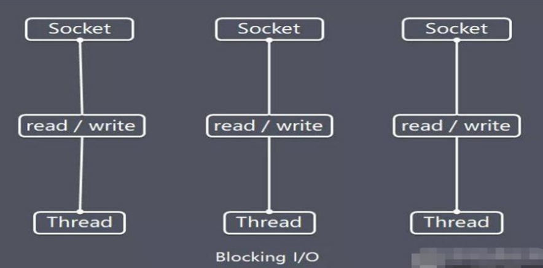
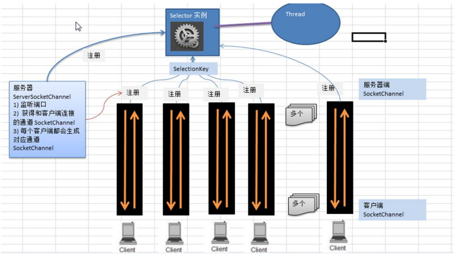
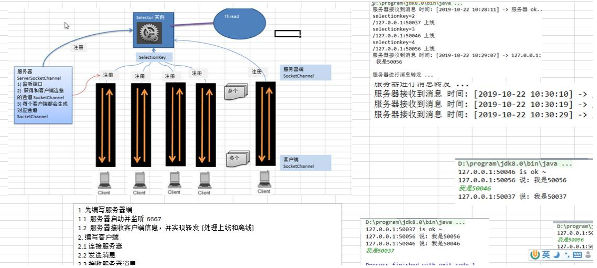
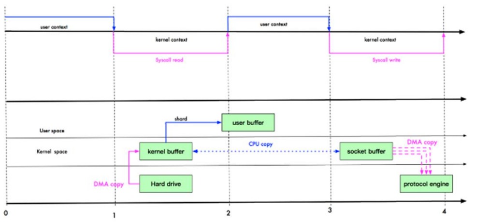

# Netty4

> 视频: https://www.bilibili.com/video/BV1DJ411m7NR
>
> 说明: 
>
> - Netty是当前非常流行的网络通讯框架，当程序对网络数据处理时，需要保证高并发和高可靠，底层就可以用Netty支撑
> - 本套课程详细讲解了Netty核心技术点，同时进行底层机制和源码剖析，并编写了大量的应用实例。通过学习可以快速掌握Netty的底层实现机制，熟练运用Netty解决网络高并发问题。

## 第 1 章: Netty介绍和应用场景

### 1.1 本课程学习要求 

1. 本课程不适用于 0 基础的学员 
2. 要求已经掌握了 Java 编程， 主要技术构成： Java OOP 编程、Java 多线程编程、Java IO 编程 、Java 网络编程、常用的 Java设计模式(比如 观察者模式 ，命令模式，职责链模式 )、常用的数据结构(比如 链表) 
3. 本课程的 <<Netty 核心源码剖析章节>> 要求学员最好有项目开发和阅读源码的经历

### 1.2 Netty 的介绍

1. Netty 是由 JBOSS 提供的一个 Java开源框架，现为 Github 上的独立项目。[github地址](https://github.com/netty/netty)

2. Netty 是一个**异步**的、**基于事件驱动**的网络应用框架，用以快速开发高性能、高可靠性的网络 IO 程序。

   

3. Netty 主要针对在 TCP 协议下，面向 Clients 端的高并发应用，或者 Peer-to-Peer 场景下的大量数据持续传输的应用。

4. Netty 本质是一个 NIO 框架，适用于服务器通讯相关的多种应用场景

   

5. 要透彻理解 Netty ， 需要先学习 NIO ， 这样我们才能阅读 Netty 的源码。


### 1.3 Netty 的应用场景

#### 1.3.1 互联网行业  

1. 互联网行业：在分布式系统中，各个节点之间需要远程服务调用，高性能的 RPC 框架必不可少，Netty 作为 异步高性能的通信框架，往往作为基础通信组件被这些 RPC 框架使用。 
2. 典型的应用有：阿里分布式服务框架 Dubbo 的 RPC 框架使用 Dubbo 协议进行节点间通信，Dubbo 协议默 认使用 Netty 作为基础通信组件，用于实现各进程节点之间的内部通信 

#### 1.3.2 游戏行业

1. 无论是手游服务端还是大型的网络游戏，Java 语言得到了越来越广泛的应用
2. Netty 作为高性能的基础通信组件，提供了 TCP/UDP 和 HTTP 协议栈，方便定制和开发私有协议栈，账号登录服务器 
3. 地图服务器之间可以方便的通过 Netty 进行高性能的通信

#### 1.3.3 大数据领域 

1. 经典的 Hadoop 的高性能通信和序列化组件 Avro 的 RPC 框架，默认采用 Netty 进行跨界点通信

2. 它的 Netty Service 基于 Netty 框架二次封装实现。

   

#### 1.3.4 其它开源项目使用到 Netty 

网址: https://netty.io/wiki/related-projects.html


### 1.4 Netty 的学习参考资料

- [Netty IN ACTION](https://book.douban.com/subject/27038538/): 作者参与了nety4的内核开发,实战方面可以使用这本书
- [Netty 权威指南](https://book.douban.com/subject/26373138/): 基于Netty5的,原理和理论方面的东西比较透彻,但是netty5已经被废弃了


---

## 第 2 章: JavaBIO编程

*BIO就是阻塞IO,java的原生IO知识*

### 2.1 I/O模型

1. I/O 模型简单的理解：就是用什么样的通道进行数据的发送和接收，很大程度上决定了程序通信的性能

2. Java 共支持 3 种网络编程模型/IO 模式：BIO、NIO、AIO

3. Java BIO ： **同步并阻塞(传统阻塞型)** ，服务器实现模式为一个连接一个线程，即客户端有连接请求时服务器端就需要启动一个线程进行处理，如果这个连接不做任何事情会造成不必要的线程开销 【简单示意图】 

   **一个线程维护一个连接(socket)**

   

4. Java NIO ： **同步非阻塞**，服务器实现模式为一个线程处理多个请求(连接/客户端)，即客户端发送的连接请求都会注册到多路复用器上，多路复用器轮询到连接有 I/O 请求就进行处理 【简单示意图】

   **一个线程维护多个连接(socket)**

   

5. Java AIO(NIO.2) ： **异步非阻塞**，AIO 引入异步通道的概念，采用了 Proactor 模式，简化了程序编写，有效的请求才启动线程，它的特点是先由操作系统完成后才通知服务端程序启动线程去处理，一般适用于连接数较 多且连接时间较长的应用 【了解】

6. 我们依次展开讲解 

### 2.2 BIO、NIO、AIO 适用场景分析

1. <u>BIO 方式适用于连接数目比较小且固定的架构</u>，这种方式对服务器资源要求比较高，并发局限于应用中，JDK1.4 以前的唯一选择，但程序简单易理解。
2. <u>NIO 方式适用于连接数目多且连接比较短（轻操作）的架构</u>，比如聊天服务器，弹幕系统，服务器间通讯等。 编程比较复杂，JDK1.4 开始支持。netty框架就是基于NIO的
3. <u>AIO 方式使用于连接数目多且连接比较长（重操作）的架构</u>，比如相册服务器，充分调用 OS 参与并发操作，编程比较复杂，JDK7 开始支持。但是AIO目前还没有得到广泛的应用

### 2.3 Java BIO 基本介绍

1. **Java BIO** 就是传统的 **Java IO** **编程**，其相关的类和接口在 java.io
2. BIO(blocking I/O) ： 同步阻塞，服务器实现模式为一个连接一个线程，即客户端有连接请求时服务器端就需要启动一个线程进行处理，如果这个连接不做任何事情会造成不必要的线程开销，可以通过线程池机制改善(实现多个客户连接服务器)。 【后有应用实例】
3. BIO 方式适用于连接数目比较小且固定的架构，这种方式对服务器资源要求比较高，并发局限于应用中，JDK1.4 以前的唯一选择，程序简单易理解

### 2.4 Java BIO工作机制



**对BIO编程流程的回顾梳理:**

1. 服务器端启动一个 ServerSocket 
2. 客户端启动 Socket 对服务器进行通信，默认情况下服务器端需要对每个客户 建立一个线程与之通讯
3. 客户端发出请求后, 先咨询服务器是否有线程响应，如果没有则会等待，或者被拒绝
4. 如果有响应，客户端线程会等待请求结束后，在继续执行

### 2.5 Java BIO 应用实例 🚩

**实例说明:** 

1. 使用 BIO 模型编写一个服务器端，监听 6666 端口，当有客户端连接时，就启动一个线程与之通讯。
2. 要求使用线程池机制改善，可以连接多个客户端.
3. 服务器端可以接收客户端发送的数据(telnet 方式即可)。

**代码演示:**


```java
package com.atguigu.bio; 
import java.io.InputStream; 
import java.net.ServerSocket;
import java.net.Socket; 
import java.util.concurrent.ExecutorService; 
import java.util.concurrent.Executors;
public class BIOServer {
    public static void main(String[] args) throws Exception { 
        //线程池机制
        //思路 
        //1. 创建一个线程池 
        //2. 如果有客户端连接，就创建一个线程，与之通讯(单独写一个方法)
        ExecutorService newCachedThreadPool = Executors.newCachedThreadPool(); //创建ServerSocket 
        ServerSocket serverSocket = new ServerSocket(6666); 
        System.out.println("服务器启动了"); 
        while (true) { 
            System.out.println(" 线 程 信 息 id =" + Thread.currentThread().getId() + " 名 字 =" + Thread.currentThread().getName()); 
            //监听，等待客户端连接 
            System.out.println("等待连接...."); 
            final Socket socket = serverSocket.accept();
            System.out.println("连接到一个客户端");
            //就创建一个线程，与之通讯(单独写一个方法) 
            newCachedThreadPool.execute(new Runnable() { 
                public void run() { //我们重写 
                    //可以和客户端通讯 
                    handler(socket);
                }});
        } 
    }
    //编写一个 handler 方法，和客户端通讯 
    public static void handler(Socket socket) {
        try { 
            System.out.println(" 线 程 信 息 id =" + Thread.currentThread().getId() + " 名 字 =" + Thread.currentThread().getName());
            byte[] bytes = new byte[1024];
            //通过 socket 获取输入流 
            InputStream inputStream = socket.getInputStream();
            //循环的读取客户端发送的数据 
            while (true) { 
                System.out.println(" 线 程 信 息 id =" + Thread.currentThread().getId() + " 名 字 =" + Thread.currentThread().getName()); 
                System.out.println("read...."); int read = inputStream.read(bytes); 
                if(read != -1) {
                    System.out.println(new String(bytes, 0, read )); //输出客户端发送的数据 
                } else {
                    break; 
                } 
            } 
        }catch (Exception e) {
            e.printStackTrace();
        }finally {
            System.out.println("关闭和 client 的连接"); 
            try { socket.close(); 
                }catch (Exception e) { 
                e.printStackTrace(); 
            }
        } 
    }
}
```


### 2.6 Java BIO问题分析

1. 每个请求都需要创建独立的线程，与对应的客户端进行数据 Read，业务处理，数据 Write 。
2. 当并发数较大时，需要创建大量线程来处理连接，系统资源占用较大。 
3. 连接建立后，如果当前线程暂时没有数据可读，则线程就阻塞在 Read 操作上，造成线程资源浪费


---

## 第 3 章: Java NIO编程

### 3.1 Java NIO基本介绍

1. Java NIO 全称 **java non-blocking IO**，是指 JDK 提供的新 API。从 JDK1.4 开始，Java 提供了一系列改进的输入/输出的新特性，被统称为 NIO(即 New IO)，是同步非阻塞的
2. NIO 相关类都被放在 **java.nio** 包及子包下，并且对原 java.io 包中的很多类进行改写。【基本案例】
3. NIO 有三大核心部分：**Channel(通道)，Buffer(缓冲区), Selector(选择器)**
4. **NIO** **是 面向缓冲区** ，**或者面向 块 编程的**。数据读取到一个它稍后处理的缓冲区，需要时可在缓冲区中前后移动，这就增加了处理过程中的灵活性，使用它可以提供非阻塞式的高伸缩性网络 
5. Java NIO 的非阻塞模式，使一个线程从某通道发送请求或者读取数据，但是它仅能得到目前可用的数据，如果 目前没有数据可用时，就什么都不会获取，而不是保持线程阻塞，所以直至数据变的可以读取之前，该线程可 以继续做其他的事情。 非阻塞写也是如此，一个线程请求写入一些数据到某通道，但不需要等待它完全写入， 这个线程同时可以去做别的事情。【后面有案例说明】
6. 通俗理解：NIO 是可以做到用一个线程来处理多个操作的。假设有 10000 个请求过来,根据实际情况，可以分配 50 或者 100 个线程来处理。不像之前的阻塞 IO 那样，非得分配 10000 个。
7. HTTP2.0 使用了多路复用的技术，做到同一个连接并发处理多个请求，而且并发请求的数量比 HTTP1.1 大了好 几个数量级 

**案例说明 NIO 的 Buffer** 

```java
package com.atguigu.nio;
import java.nio.IntBuffer;
public class BasicBuffer {
    public static void main(String[] args) { 
        //举例说明 Buffer 的使用 (简单说明) 
        //创建一个 Buffer, 大小为 5, 即可以存放 5 个 int 
        IntBuffer intBuffer = IntBuffer.allocate(5); 
        //向 buffer 存放数据 
        // intBuffer.put(10); 
        // intBuffer.put(11); 
        // intBuffer.put(12); 
        // intBuffer.put(13);
        // intBuffer.put(14);
        for(int i = 0; i < intBuffer.capacity(); i++) {
            intBuffer.put( i * 2);
        }
        //如何从 buffer 读取数据 
        //将 buffer 转换，读写切换(!!!) 
        intBuffer.flip(); 
        while (intBuffer.hasRemaining()) { 
            System.out.println(intBuffer.get());
        } 
    }
}
```


### 3.2 NIO和BIO的比较

1. BIO 以流的方式处理数据,而 NIO 以块的方式处理数据,块 I/O 的效率比流 I/O 高很多
2. BIO 是阻塞的，NIO 则是非阻塞的
3. BIO 基于字节流和字符流进行操作，而 NIO 基于 Channel(通道)和 Buffer(缓冲区)进行操作，数据总是从通道 读取到缓冲区中，或者从缓冲区写入到通道中。Selector(选择器)用于监听多个通道的事件（比如：连接请求， 数据到达等），因此使用单个线程就可以监听多个客户端通道 

### 3.3 NIO三大核心原理示意图

一张图描述 NIO 的 Selector 、 Channel 和 Buffer 的关系

Selector 、 Channel 和 Buffer 的关系图(简单版)


关系图的说明:

1. 每个 channel 都会对应一个 Buffer 
2. Selector 对应一个线程， 一个线程对应多个 channel(连接) 
3. 该图反应了有三个 channel 注册到 该 selector //程序
4. 程序切换到哪个 channel 是有事件决定的, Event 就是一个重要的概念 
5. Selector 会根据不同的事件，在各个通道上切换 
6. Buffer 就是一个内存块 ， 底层是有一个数组
7. 数据的读取写入是通过 Buffer, 这个和 BIO , BIO 中要么是输入流，或者是 输出流, 不能双向，但是 NIO 的 Buffer 是可以读也可以写, 需要 flip 方法切换 channel 是双向的, 可以返回底层操作系统的情况, 比如 Linux ， 底层的操作系统通道就是双向的


### 3.4 缓冲区(Buffer)

#### 3.4.1 基本介绍

缓冲区（Buffer）：缓冲区本质上是一个可以读写数据的内存块，可以理解成是一个容器对象(含数组)，该对 象提供了一组方法，可以更轻松地使用内存块，，缓冲区对象内置了一些机制，能够跟踪和记录缓冲区的状态变化情况。Channel 提供从文件、网络读取数据的渠道，但是读取或写入的数据都必须经由 Buffer，如图: 【后面举 例说明】


#### 3.4.2 Buffer类及其子类

1. 在 NIO 中，Buffer 是一个顶层父类，它是一个抽象类, 类的层级关系图:
2. Buffer 类定义了所有的缓冲区都具有的四个属性来提供关于其所包含的数据元素的信息:
3. Buffer 类相关方法一览

#### 3.4.3 ByteBuffer

从前面可以看出对于 Java 中的基本数据类型(boolean 除外)，都有一个 Buffer 类型与之相对应，最常用的自然是 ByteBuffer 类（二进制数据），该类的主要方法如下：

```java
//源码中的API
public abstract class ByteBuffer extends Buffer implements Comparable<ByteBuffer>{
    	//缓冲区创建相关api
    	public static ByteBuffer allocateDirect(int capacity)//创建直接缓冲区
    	public static ByteBuffer allocate(int capacity)//设置缓冲区的初始容量
        public static ByteBuffer wrap(byte[] array)//把一个数组放到缓冲区中使用
        //构造初始化位置offset和上界length的缓冲区
        public static ByteBuffer wrap(byte[] array,int offset, int length)

        //缓存区存取相关API
        public abstract byte get() //从当前位置position上get， get之后， position会自动+1
        public abstract byte get(int index) //从绝对位置get
        public abstract ByteBuffer put(byte b)//从当前位置上添加， put之后， position会自动+1
        public abstract ByteBuffer put(int index, byte b)//从绝对位置上put
}
```


### 3.5. 通道(Channel)

### 3.6 基本介绍

1. NIO 的通道类似于流，但有些区别如下：

   - 通道可以同时进行读写，而流只能读或者只能写
   - 通道可以实现异步读写数据 
   - 通道可以从缓冲读数据，也可以写数据到缓冲;

2. BIO 中的 stream 是单向的，例如 FileInputStream 对象只能进行读取数据的操作，而 NIO 中的通道(Channel) 是双向的，可以读操作，也可以写操作。

3. Channel 在 NIO 中是一个接口

   ```java
   //源码
   public interface Channel extends Closeable {}
   ```

4. 常 用 的 Channel 类 有 ：

   ```java
   public class FileChannel{}  //FileChannel 用于文件的数据读写
   public class DatagramChannel{} //DatagramChannel 用于 UDP 的数据读写
   public class ServerSocketChannel{} //ServerSocketChannel 和 SocketChannel 用于 TCP 的数据读写
   public class SocketChannel{}
   
   // 【ServerSocketChanne 类似 ServerSocket , SocketChannel 类似 Socket】
   ```


#### 3.6.1 FileChannel 类

```java
//FileChannel类常用API
public abstract class FileChannel
    extends AbstractInterruptibleChannel
    implements SeekableByteChannel, GatheringByteChannel, ScatteringByteChannel
{
    public int read(ByteBuffer dst) //从通道读取数据并放到缓冲区中
    public int write(ByteBuffer src) //把缓冲区的数据写到通道中 
    public long transferFrom(ReadableByteChannel src, long position, long count)//从目标通道中复制数据到当前通道 
    public long transferTo(long position, long count, WritableByteChannel target)//把数据从当前通道复制给目标通道
}
```


#### 3.6.2 应用实例 1-本地文件写数据

使用前面学习后的 ByteBuffer(缓冲) 和 FileChannel(通道)， 将 "hello,尚硅谷" 写入到 file01.txt 中 

```java

```


#### 3.6.3 应用实例 2-本地文件读数据 

实例要求:

1. 使用前面学习后的 ByteBuffer(缓冲) 和 FileChannel(通道)， 将 file01.txt 中的数据读入到程序，并显示在控制 台屏幕
2. 假定文件已经存在

```java

```


#### 3.6.4 应用实例 3-使用一个 Buffer 完成文件读取、写入

实例要求:

1. 使用 FileChannel(通道) 和 方法 read , write，完成文件的拷贝

2. 拷贝一个文本文件 1.txt , 放在项目下即可

   

```java

```


#### 3.6.5 应用实例 4-拷贝文件 transferFrom 方法 

实例要求:

1. 使用 FileChannel(通道) 和 方法 transferFrom ，完成文件的拷贝
2. 拷贝一张图片

```java

```


#### 3.6.6 关于 Buffer 和 Channel 的注意事项和细节 

1. ByteBuffer 支持类型化的 put 和 get, put 放入的是什么数据类型，get 就应该使用相应的数据类型来取出，否 则可能有 BufferUnderflowException 异常。[举例说明]
2. 可以将一个普通 Buffer 转成只读 Buffer [举例说明]
3. NIO 还提供了 MappedByteBuffer， 可以让文件直接在内存（堆外的内存）中进行修改， 而如何同步到文件 由 NIO 来完成. [举例说明] 
4. 前面我们讲的读写操作，都是通过一个 Buffer 完成的，NIO 还支持 通过多个 Buffer (即 Buffer 数组) 完成读 写操作，即 Scattering 和 Gathering 【举例说明】 


### 3.7 Selector(选择器)

#### 3.7.1 基本介绍

1. Java 的 NIO，用非阻塞的 IO 方式。可以用一个线程，处理多个的客户端连接，就会使用到 Selector(选择器)
2. Selector 能够检测多个注册的通道上是否有事件发生(注意:多个 Channel 以事件的方式可以注册到同一个 Selector)，如果有事件发生，便获取事件然后针对每个事件进行相应的处理。这样就可以只用一个单线程去管 理多个通道，也就是管理多个连接和请求。【示意图】 
3. 只有在 连接/通道 真正有读写事件发生时，才会进行读写，就大大地减少了系统开销，并且不必为每个连接都 创建一个线程，不用去维护多个线程 
4. 避免了多线程之间的上下文切换导致的开销

#### 3.7.2 Selector示意图和特点说明


说明如下: 

1. Netty 的 IO 线程 NioEventLoop 聚合了 Selector(选择器，也叫多路复用器)，可以同时并发处理成百上千个客 户端连接。 
2. 当线程从某客户端 Socket 通道进行读写数据时，若没有数据可用时，该线程可以进行其他任务。 
3. 线程通常将非阻塞 IO 的空闲时间用于在其他通道上执行 IO 操作，所以单独的线程可以管理多个输入和输出 通道。 
4. 由于读写操作都是非阻塞的，这就可以充分提升 IO 线程的运行效率，避免由于频繁 I/O 阻塞导致的线程挂 起。 
5. 一个 I/O 线程可以并发处理 N 个客户端连接和读写操作，这从根本上解决了传统同步阻塞 I/O 一连接一线 程模型，架构的性能、弹性伸缩能力和可靠性都得到了极大的提升。

#### 3.7.3 Selector相关方法

```java
public abstract class Selector implements Closeable {
public static Selector open（）：//得到一个选择器对象
public int select（long timeout）；//监控所有注册的通道，当其
中有10操作可以进行时，将
对应的SelectionKey加入到内部集合中并返回，参数用来
设置超时时间
public Set<SelectionKey> selectedKeysl）；//从内部集合中得
到所有的SelectionKey
}
```


#### 3.7.4 注意事项

1. NIO 中的 ServerSocketChannel 功能类似 ServerSocket，SocketChannel 功能类似 Socket

2. selector 相关方法说明

   ```java
   selector.select();//阻塞 
   selector.select(1000);//阻塞 1000 毫秒，在 1000 毫秒后返回 
   selector.wakeup();//唤醒 
   selector selector.selectNow();//不阻塞，立马返还
   ```

   


### 3.8 NIO非阻塞网络编程原理分析图

*NIO 非阻塞 网络编程相关的(Selector、SelectionKey、ServerScoketChannel 和 SocketChannel) 关系梳理图*



对上图的说明:

1. 当客户端连接时，会通过 ServerSocketChannel 得到 SocketChannel
2. Selector 进行监听 select 方法, 返回有事件发生的通道的个数
3. 将 socketChannel 注册到 Selector 上, register(Selector sel, int ops), 一个 selector 上可以注册多个 SocketChannel
4. 注册后返回一个 SelectionKey, 会和该 Selector 关联(集合)
5. 进一步得到各个 SelectionKey (有事件发生) 
6. 在通过 SelectionKey 反向获取 SocketChannel , 方法 channel()
7. 可以通过 得到的 channel , 完成业务处理
8. 代码撑腰。。。 

### 3.9 NIO非阻塞网络编程快速入门

案例要求: 

1. 编写一个 NIO 入门案例，实现服务器端和客户端之间的数据简单通讯（非阻塞） 

2. 目的：理解 NIO 非阻塞网络编程机制

```java

```


### 3.10 SelectionKey

1. SelectionKey，表示 **Selector** **和网络通道的注册关系**, 共四种:

   - int OP_ACCEPT：有新的网络连接可以 accept，值为 16
   - int OP_CONNECT：代表连接已经建立，值为 8
   - int OP_READ：代表读操作，值为 1 
   - int OP_WRITE：代表写操作，值为 4 

   源码中:

   ```java
   public static final int OP_READ = 1 << 0; 
   public static final int OP_WRITE = 1 << 2; 
   public static final int OP_CONNECT = 1 << 3;
   public static final int OP_ACCEPT = 1 << 4;
   ```

2. SelectionKey 相关方法

   ```java
   publicabstract class SelectionKey {
       public abstract Selector selector（）：//得到与之关联的Selector对象
       public abstract SelectableChannel channel）：//得到与之关联的通道据
       public final Objectattachment（）：//得到与之关联的共享数
       public abstract SelectionKey interestOps（int ops）；//设置或改变监听事件
       public final boolean isAcceptable（）：//是否可以accept
       public final boolean isReadable（）；//是否可以读
       public final boolean isWritable（）：//是否可以写
   }
   ```

   

### 3.11 ServerSocketChannel

1. ServerSocketChannel 在服务器端监听新的客户端 Socket 连接

2. 相关方法如下

   ```java
   public abstract class ServerSocketChannel
   extends AbstractSelectableChannel
   implements NetworkChannel{
   public static ServerSocketChannel open（），得到一个ServerSocketChannel通道
   public final ServerSocketChannel bind（SocketAddress locall，设置服务器端端口
   号
   public final Selectablechannel configure Blocking（boolean block），设置阻塞或非
   阻塞模式，取值false表示采用非阻塞模式
   public SocketChannel accept），接受一个连接，返回代表这个连接的通道对
   象
   public final Selectionke register（Selector sel， int ops），注册一个选择器并设置
   监听事件
   1
   ```

   

### 3.12 SocketChannel

1. SocketChannel，网络 IO 通道，具体负责进行读写操作。NIO 把缓冲区的数据写入通道，或者把通道里的数 据读到缓冲区.

2. 相关方法如下

   ```java
   public abstract class SocketChannel
   extends AbstractSelectableChannel
   implements ByteChannel， Scattering ByteChannel， Gathering ByteChannel，
   NetworkChannel
   public static SocketChannel open（）：//得到一个SocketChannel通道
   public final SelectableChannel configureBlocking（boolean block）：//设置阻塞或非阻塞
   模式，取值false表示采用非阻塞模式
   public boolean connect（SocketAddress remote）：//连接服务器
   public boolean finishConnect）/如果上面的方法连接失败，接下来就要通过该方法
   完成连接操作
   public int write（ByteBuffer src）：//往通道里写数据
   public int read（ByteBuffer dst）：//从通道里读数据
   public final SelectionKey register（Selector sel， int ops， Object att）：/注册一个选择器并
   设置监听事件，最后一个参数可以设置共享数据
   public final void close（）：//关闭通道
   ```

   

### 3.13 NIO网络编程应用实例-群聊系统

实例要求:

1. 编写一个 NIO 群聊系统，实现服务器端和客户端之间的数据简单通讯（非阻塞） 

2. 实现多人群聊 

3. 服务器端：可以监测用户上线，离线，并实现消息转发功能 

4. 客户端：通过 channel 可以无阻塞发送消息给其它所有用户，同时可以接受其它用户发送的消息(有服务器转发 得到) 

目的：进一步理解 NIO 非阻塞网络编程机制 

示意图分析和代码



```java

```


### 3.14 NIO与零拷贝

#### 3.14.1 零拷贝介绍

1. 零拷贝是网络编程的关键，很多性能优化都离不开。
2. 在 Java 程序中，常用的零拷贝有 mmap(内存映射) 和 sendFile。那么，他们在 OS 里，到底是怎么样的一个 的设计？我们分析 mmap 和 sendFile 这两个零拷贝
3. 另外我们看下 NIO 中如何使用零拷贝 

#### 3.14.2 传统IO数据读写

Java 传统 IO 和 网络编程的一段代码

```java
File file = new File("test. txt");
RandomAccessFile raf = new RandomAccess File (file, "rw");
byte[] arr = new byte(int) file. length()]:
raf. read(arr);
Socket socket = new ServerSocket(8080). accept();
socket. getOutputStream(). write(arr);
```

#### 3.14.3 传统IO模型


DMA: direct memory access 直接内存拷贝(不使用 CPU)

#### 3.14.4 mmap 优化

mmap 通过内存映射，将**文件映射到内核缓冲区**，同时，**用户空间可以共享内核空间的数据**。这样，在进行网 络传输时，就可以减少内核空间到用户空间的拷贝次数。如下图 



#### 3.14.5 sendFile 优化

1. Linux 2.1 版本 提供了 sendFile 函数，其基本原理如下：数据根本不经过用户态，直接从内核缓冲区进入到 Socket Buffer，同时，由于和用户态完全无关，就减少了一次上下文切换 ;如下示意图

   

2. 提示：零拷贝从操作系统角度，是没有 cpu 拷贝

3. Linux 在 2.4 版本中，做了一些修改，避免了从**内核缓冲区**拷贝到 **Socket buffer** 的操作，直接拷贝到协议栈， 从而再一次减少了数据拷贝。具体如下图和小结：

   

   这里其实有 一次 cpu 拷贝 

   kernel buffer -> socket buffer

   但是，拷贝的信息很少，比如 lenght , offset , 消耗低，可以忽略

#### 3.14.6 零拷贝的再次理解 

1. 我们说零拷贝，是从**操作系统的角度**来说的。因为内核缓冲区之间，没有数据是重复的（只有 kernel buffer 有 一份数据）。
2. 零拷贝不仅仅带来更少的数据复制，还能带来其他的性能优势，例如更少的上下文切换，更少的 CPU 缓存伪 共享以及无 CPU 校验和计算。

#### 3.14.7 mmap 和 sendFile 的区别

1. mmap 适合小数据量读写，sendFile 适合大文件传输。
2. mmap 需要 4 次上下文切换，3 次数据拷贝；sendFile 需要 3 次上下文切换，最少 2 次数据拷贝。
3. sendFile 可以利用 DMA 方式，减少 CPU 拷贝，mmap 则不能（必须从内核拷贝到 Socket 缓冲区）。

#### 3.14.8 NIO 零拷贝案例

案例要求：

1. 使用传统的 IO 方法传递一个大文件
2. 使用 NIO 零拷贝方式传递(transferTo)一个大文件 
3. 看看两种传递方式耗时时间分别是多少

```java

```


### 3.15 Java AIO 基本介绍

1. JDK 7 引入了 Asynchronous I/O，即 AIO。在进行 I/O 编程中，常用到两种模式：Reactor 和 Proactor。Java 的 NIO 就是 Reactor，当有事件触发时，服务器端得到通知，进行相应的处理
2. AIO 即 NIO2.0，叫做异步不阻塞的 IO。AIO 引入异步通道的概念，采用了 Proactor 模式，简化了程序编写， 有效的请求才启动线程，它的特点是先由操作系统完成后才通知服务端程序启动线程去处理，一般适用于连接 数较多且连接时间较长的应用
3. 目前 AIO 还没有广泛应用，Netty 也是基于 NIO, 而不是 AIO， 因此我们就不详解 AIO 了，有兴趣的同学可 以 参 考 [Java 新 一 代 网 络 编 程 模 型 AIO 原 理 及 Linux 系 统 AIO 介 绍 ](http://www.52im.net/thread-306-1-1.html) 

### 3.16 BIO NIO AIO 对比表

|          | BIO      | NIO                  | AIO        |
| -------- | -------- | -------------------- | ---------- |
| IO模型   | 同步阻塞 | 同步非阻塞(多路复用) | 异步非阻塞 |
| 编程难度 | 简单     | 复杂                 | 复杂       |
| 可靠性   | 差       | 好                   | 好         |
| 吞吐量   | 低       | 高                   | 高         |

**举例说明:** 

1. 同步阻塞：到理发店理发，就一直等理发师，直到轮到自己理发。
2. 同步非阻塞：到理发店理发，发现前面有其它人理发，给理发师说下，先干其他事情，一会过来看是否轮到自己.
3. 异步非阻塞：给理发师打电话，让理发师上门服务，自己千其它事情，理发师自己来家给你理发

---

## 第 4 章: Netty概述


### 4.1 原生 NIO 存在的问题 

1. NIO 的类库和 API 繁杂，使用麻烦：需要熟练掌握 Selector、ServerSocketChannel、SocketChannel、ByteBuffer 等。
2. 需要具备其他的额外技能：要熟悉 Java 多线程编程，因为 NIO 编程涉及到 Reactor 模式，你必须对多线程 和网络编程非常熟悉，才能编写出高质量的 NIO 程序。 
3. 开发工作量和难度都非常大：例如客户端面临断连重连、网络闪断、半包读写、失败缓存、网络拥塞和异常流 的处理等等。
4. JDK NIO 的 Bug：例如臭名昭著的 Epoll Bug，它会导致 Selector 空轮询，最终导致 CPU 100%。直到 JDK 1.7 版本该问题仍旧存在，没有被根本解决。

### 4.2 Netty 官网说明

官网：https://netty.io/ 

Netty is an asynchronous event-driven network application framework 

for rapid development of maintainable high performance protocol servers & clients


### 4.3 Netty 的优点

Netty 对 JDK 自带的 NIO 的 API 进行了封装，解决了上述问题。

1. 设计优雅：适用于各种传输类型的统一 API 阻塞和非阻塞 Socket；基于灵活且可扩展的事件模型，可以清晰 地分离关注点；高度可定制的线程模型 - 单线程，一个或多个线程池.
2. 使用方便：详细记录的 Javadoc，用户指南和示例；没有其他依赖项，JDK 5（Netty 3.x）或 6（Netty 4.x）就 足够了。
3. 高性能、吞吐量更高：延迟更低；减少资源消耗；最小化不必要的内存复制。
4. 安全：完整的 SSL/TLS 和 StartTLS 支持。
5. 社区活跃、不断更新：社区活跃，版本迭代周期短，发现的 Bug 可以被及时修复，同时，更多的新功能会被 加入

### 4.4 Netty 版本说明

1. netty 版本分为 netty3.x 和 netty4.x、netty5.x 
2. 因为 Netty5 出现重大 bug，已经被官网废弃了，目前推荐使用的是 Netty4.x 的稳定版本 
3. 目前在官网可下载的版本 netty3.x netty4.0.x 和 netty4.1.x 
4. 在本套课程中，我们讲解 Netty4.1.x 版本 
5. netty 下载地址： https://bintray.com/netty/downloads/netty/


---


## 第 5 章:  Netty高性能架构设计

### 5.1 线程模型基本介绍

1. 不同的线程模式，对程序的性能有很大影响，为了搞清 Netty 线程模式，我们来系统的讲解下 各个线程模式， 最后看看 Netty 线程模型有什么优越性.
2. 目前存在的线程模型有：
   - 传统阻塞 I/O 服务模型 
   - Reactor 模式 
3. 根据 Reactor 的数量和处理资源池线程的数量不同，有 3 种典型的实现 
   - 单 Reactor 单线程；
   - 单 Reactor 多线程；
   - 主从 Reactor 多线程
4. Netty 线程模式(Netty 主要基于主从 Reactor 多线程模型做了一定的改进，其中主从 Reactor 多线程模型有多 个 Reactor) 

### 5.2 传统阻塞 I/O 服务模型 🚩

### 5.3 Reactor 模式

### 5.4 单 Reactor 单线程 

### 5.5 单 Reactor 多线程

### 5.6 主从 Reactor 多线程

### 5.7 Reactor 模式小结

### 5.8 Netty 模型

### 5.9 异步模型

### 5.10 快速入门实例-HTTP 服务


---

## 第 6 章: Netty核心模块组件


### 6.1 Bootstrap、ServerBootstrap

### 6.2 Future、ChannelFuture 

### 6.3 Channel

### 6.4 Selector 

### 6.5 ChannelHandler 及其实现类

### 6.6 Pipeline 和 ChannelPipeline

### 6.7 ChannelHandlerContext

### 6.8 ChannelOption

### 6.9 EventLoopGroup 和其实现类 NioEventLoopGroup

### 6.10 Unpooled 类

### 6.11 Netty 应用实例-群聊系统

### 6.12 Netty 心跳检测机制案例

### 6.13 Netty 通过 WebSocket 编程实现服务器和客户端长连接


---

## 第 7 章: Google-Protobuf

### 7.1 编码和解码的基本介绍

### 7.2 Netty 本身的编码解码的机制和问题分析

### 7.3 Protobuf

### 7.4 Protobuf 快速入门实例

### 7.5 Protobuf 快速入门实例 2 


---

## 第 8 章: Netty编码器和handler的调用机制

### 8.1 基本说明 

### 8.2 编码解码器

### 8.3 解码器-ByteToMessageDecoder

### 8.4 Netty 的 handler 链的调用机制 

### 8.5 解码器-ReplayingDecoder

### 8.6 其它编解码器

### 8.7 Log4j 整合到 Netty


---

## 第 9 章: TCP粘包和拆包及解决方案

### 9.1 TCP 粘包和拆包基本介绍

### 9.2 TCP 粘包和拆包现象实例

### 9.3 TCP 粘包和拆包解决方案

### 9.4 看一个具体的实例


---

## 第 10 章: Netty核心源码剖析

### 10.1 基本说明

### 10.2  Netty 启动过程源码剖析

### 10.3 Netty 接受请求过程源码剖析

### 10.4 Pipeline Handler HandlerContext 创建源码剖析

### 10.5 ChannelPipeline 调度 handler 的源码剖析

### 10.6 Netty 心跳(heartbeat)服务源码剖析 

### 10.7 Netty 核心组件 EventLoop 源码剖析 

### 10.8 handler 中加入线程池和 Context 中添加线程池的源码剖析


---

## 第 11 章: 用Netty自己实现dubb-RPC

### 11.1 RPC 基本介绍

### 11.2 RPC 调用流程图

### 11.3 RPC 调用流程说明

### 11.4 自己实现 dubbo RPC(基于 Netty)

