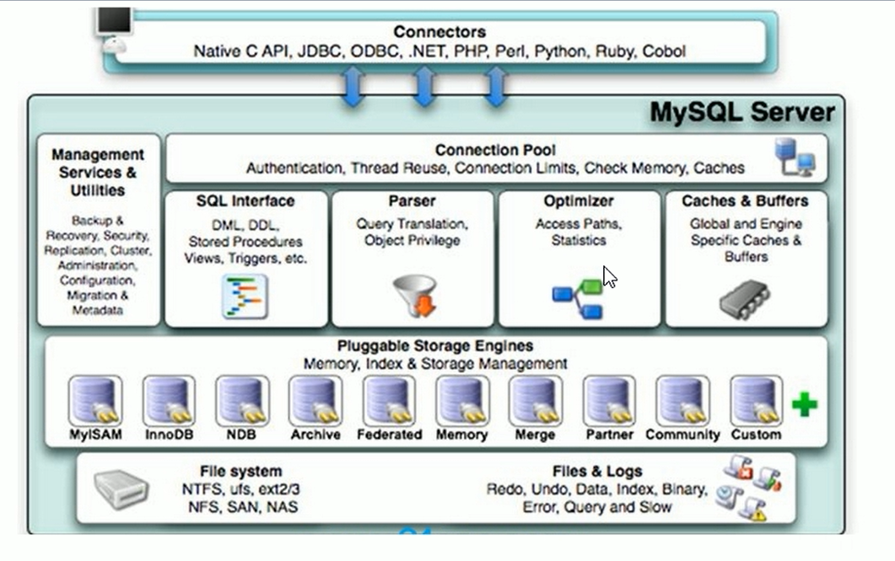

# MySQL架构介绍


## 1. MySQL简介

### 1.1 MySQL概述

MySQL是一个关系型数据库管理系统，由瑞典MySQL AB公司开发，目前属于Oracle公司。

MySQL是一种关联数据库管理系统，将数据察存在不同的表中，而不是将所有数据放在一个大仓库内，这样就增加了速度并提高了灵活性。

Mysql是开源的，所以你不需要支付额外的费用。

Mysql支持大型的数据库。可以处理拥有上千万条记录的大型数据库。

MySQL使用标准的SQL数据语言形式。

Mysql可以允许于多个系统上，并且支持多种语言。这些编程语言包括C、C++、Python.Java、Perl、PHP、Eiffel、Ruby和Tcl等。

Mysql对PHP有很好的支持，PHP是目前最流行的Web开发语言。

MySQL支持大型数据库，支持5000万条记录的数据仓库，32位系统表文件最大可支持4GB，64位系统支持最大的表文件为8TB。

Mysql是可以定制的，采用了GPL协议，你可以修改源码来开发自己的Mysql系统。


### 1.2 MySQL高手需要会下面这些

- mysql内核
- sq优化攻城师
- mysql服务器的优化
- 各种参数常量设定
- 查询语句优化
- 主从复制
- 软硬件升级
- 容灾备份
- sql编程

## 2. Linux7.6安装MySQL5.5

### 2.1 下载

下载地址: https://dev.mysql.com/downloads/mysql/

百度网盘提取地址: 

### 2.2 上传到linux服务器

将下载下来的mysql服务端-server和客户端-client的rpm文件通过xftp上传到服务器的/opt目录上(opt一般用于放软件安装包的)


### 2.3 安装mysql

#### 2.3.1 rpm安装

#### 2.3.2 设置Root密码

#### 2.3.3. 设置开机启动

#### 2.3.5 安装位置

#### 2.3.6 修改字符集


## 3. MySQL配置文件


## 4. MySQL逻辑架构

> MySQL的逻辑架构分为4层: **逻辑层** **服务层** **引擎层** **存储层**

### 连接层

最上层是一些客户端和连接服务,包含本地sock通信和大多数基于客户端/服务端工具实现的类似于 tcp/ip的通信。主要完成一些类似于连接处理、授权认证、及相关的安全方案。在该层上引入了线程池的概念,为通过认证安全接入的客户端提供线程。同样在该层上可以实现基于SSL的安全链接。服务器也会为安全接入的每个客户端验证它所具有的操作权限。

### 服务层

第二层架构主要完成大多少的核心服务功能,如SQL接口,并完成缓存的查询,SQL的分析和优化及部分内置函数的执行。所有跨存储引擎的功能也在这一层实现,如过程、函数等。在该层,服务器会解析查询并创建相应的内部解析树,并对其完成相应的优化如确定查询表的顺序,是否利用素引等,最后生成相应的执行操作。如果是 select语句,服务器还会查询内部的缓存。如果缓存空间足够大,这样在解决大量读操作的环境中能够很好的提升系统的性能

### 引擎层

存储引擎层,存储引擎真正的负责了 MYSQL中数据的存储和提取,服务器通过API与存储引擎进行通信。不同的存储引擎具有的功能不同,这样我们可以根据自己的实际需要进行选取。后面介绍 MYISAM和 INNODB两种引擎(这两种引擎常用)

### 存储层

数据存储层,主要是将数据存储在运行于裸设各的文件系统之上,并完成与存储引擎的交互


**架构图**



<span style="color:red">PS:</span> 和其它数据库相比, MYSQL有点与众不同,它的架构可以在多种不同场景中应用并发挥良好作用。主要体现在存储引副擎的架构上,**插件式的存储引擎架构将查询处理和其它的系统任务以及数据的存储提取相分离**,这种架构可以根据业务的需求和实际需要选择合适的存情引擎。


## 5. MySQL存储引擎

查看MySQL支持的存储引擎

```mysql
show engines;
```

查看当前默认的存储引擎

```mysql
show variables like '%storage_engine%';
```

```mysql
+----------------------------+--------+
| Variable_name              | Value  |
+----------------------------+--------+
| default_storage_engine     | InnoDB | -- 当前默认存储引擎
| default_tmp_storage_engine | InnoDB |
| storage_engine             | InnoDB | -- 当前存储引擎
+----------------------------+--------+
```

InnoDB引擎和MyISAM引擎的对比

| 对比项   | MyISAM                                                       | InnoDB                                                       |
| -------- | ------------------------------------------------------------ | ------------------------------------------------------------ |
| 主外键   | 不支持                                                       | 支持                                                         |
| 事务     | 不支持                                                       | 支持                                                         |
| 行表锁   | **表锁**,即时操作一条记录也会锁住整个表,<u>不适合高并发操作</u> | **行锁**,操作时只锁某一行,不对其他行有影响,<u>适合高并发的操作</u> |
| 缓存     | 只缓存索引,不缓存真实数据                                    | 不仅缓存索引还缓存真实数据,对内存要求较高,而且内存大小对性能有决定性的影响 |
| 表空间   | 小                                                           | 大                                                           |
| 关注点   | 性能                                                         | 事务                                                         |
| 默认安装 | Y                                                            | Y                                                            |

