# 索引优化分析

## 1. 性能下降SQL慢

> 性能下降SQL慢出现的结果: **执行时间长,等待时间长**
>
> 出现性能下降有如下几种原因(不仅仅只有这几种原因)

**1. 查询语句写得烂**: 没有创建索引,或者其他垃圾sql

**2. 索引失效**: 建了索引但是没有用上;非没有索引;索引失效分为单值索引失效或复合索引失效

- 单值索引: 给某一个字段创建索引

  ```sql
  # user表假设字段如下
  # id name email weixinNumber
  # 如果这个表的数据量非常大
  
  -- 查询user表的name字段 
  select * from user where name='';
  
  -- 创建单值索引
  create index idx_user_name on user(name);
  ```

- 复合索引: 给多个字段创建索引

  ```sql
  -- 根据多个字段查询user表
  select * from user where name='' and email='';
  
  -- 创建复合索引
  create index idx_user_nameEmail on user(name,email);
  ```

  

**3. 关联查询太多join(设计缺陷或不得已的需求)**:  过多的join连接太多的表会导致执行时间长,等待时间长

**4. 服务器调优及各个参数设置(缓冲丶线程数等)** : 调优时,参数设置不合理,比例不恰当


## 2. JOIN查询回顾

### 2.1 JOIN查询的SQL执行顺序

**手写顺序**: 人编写MySQL顺序

```sql
SELECT DISTINCT
	<select_list>
FROM
	<left_table> <join_type>
JOIN <right_table> ON <join_condition>
WHERE
	<where_condition>
GROUP BY
	<group_by_list>
HAVING
	<having_condition>
ORDER BY
	<order_by_condition>
LIMIT <limit number>
-- ps: 编写的时候是从SELECT开始
```

**机读顺序**: 机器解析SQL的顺序

```sql
FROM <left_table>
ON <join_condition>
<join_type> JOIN <right_table>
WHERE <where_condition>
GROUP BY <group_by_list>
HAVING <having_condition>
SELECT
DISTINCT <select_list>
ORDER BY <order_by_condition>
LIMIT <limit_number>
-- ps: 机度的时候,是从FROM开始
```

**机器解析sql过程**

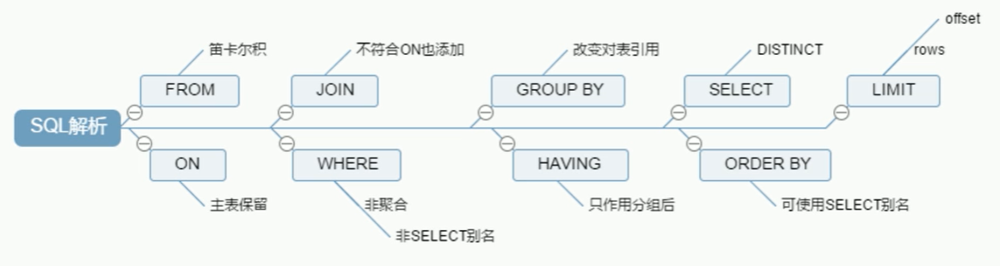

### 2.2 JOIN七种理论

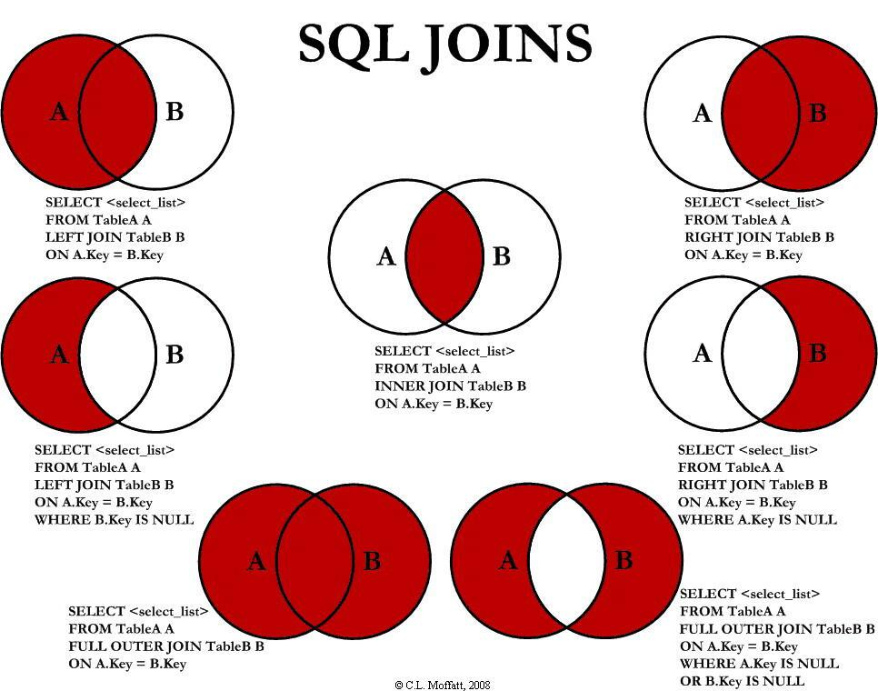

### 2.3 JOIN七种SQL编写

#### 2.3.1 准备工作

创建表插入数据

```sql
-- 部门表
CREATE TABLE tbl_dept(
	id INT(11) NOT NULL AUTO_INCREMENT,
	deptName VARCHAR(30) DEFAULT NULL,
	locAdd VARCHAR(40) DEFAULT NULL,
	PRIMARY KEY(id)
)ENGINE=INNODB AUTO_INCREMENT=1 DEFAULT CHARSET=utf8;

-- 员工表
CREATE TABLE tbl_emp (
	id INT(11) NOT NULL AUTO_INCREMENT,
	NAME VARCHAR(20) DEFAULT NULL,
	deptId INT(11) DEFAULT NULL,
	PRIMARY KEY (id),
	KEY fk_dept_Id (deptId)
	#CONSTRAINT 'fk_dept_Id' foreign key ('deptId') references 'tbl_dept'('Id')
)ENGINE=INNODB AUTO_INCREMENT=1 DEFAULT CHARSET=utf8;

-- 数据插入
INSERT INTO tbl_dept(deptName,locAdd) VALUES('RD',11);
INSERT INTO tbl_dept(deptName,locAdd) VALUES('HR',12);
INSERT INTO tbl_dept(deptName,locAdd) VALUES('MK',13);
INSERT INTO tbl_dept(deptName,locAdd) VALUES('MIS',14);
INSERT INTO tbl_dept(deptName,locAdd) VALUES('FD',15);

INSERT INTO tbl_emp(NAME,deptId) VALUES('z3',1);
INSERT INTO tbl_emp(NAME,deptId) VALUES('z4',1);
INSERT INTO tbl_emp(NAME,deptId) VALUES('z5',1);
INSERT INTO tbl_emp(NAME,deptId) VALUES('w5',2);
INSERT INTO tbl_emp(NAME,deptId) VALUES('w6',2);
INSERT INTO tbl_emp(NAME,deptId) VALUES('s7',3);
INSERT INTO tbl_emp(NAME,deptId) VALUES('s8',4);
INSERT INTO tbl_emp(NAME,deptId) VALUES('s9',51);
```

表结构如下

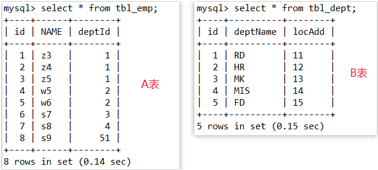

#### 2.3.2 JOIN七种SQL编写

##### 2.3.2.1 ab表共有数据

表a和表b之间相互交叉的数据,即表a表b同时拥有的数据

`inner join` 

```sql
SELECT * FROM tbl_emp a 
INNER JOIN tbl_dept b
ON a.deptId = b.id;
```

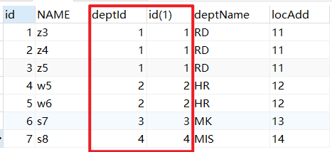

##### 2.3.2.2  a表所有数据

a表的全部数据(指的是共有数据和a表特有数据)

`left join`

```sql
SELECT * FROM tbl_emp a 
LEFT JOIN tbl_dept b
ON a.deptId = b.id;
```

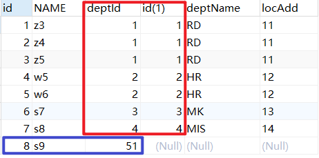

##### 2.3.2.3 b表所有数据

b表的所有数据(指的是共有数据与b表特有数据)

`right join` 

```sql
SELECT * FROM tbl_emp a 
RIGHT JOIN tbl_dept b
ON a.deptId = b.id;
```

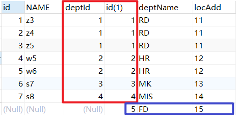

##### 2.3.2.4 a表独有数据

a表有而b表没有的数据,可对b表添加键为空的条件实现

`LEFT JOIN` 

```sql
SELECT * FROM tbl_emp a 
LEFT JOIN tbl_dept b
ON a.deptId = b.id
WHERE b.id IS NULL;
```

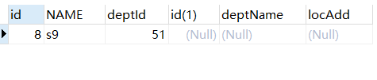


##### 2.3.2.5 b表独有数据

b表有而a表没有的数据,可对添加a表添加条件为空实现

`RIGHT JOIN`

```sql
SELECT * FROM tbl_emp a 
RIGHT JOIN tbl_dept b
ON a.deptId = b.id
WHERE a.deptId IS NULL;
```

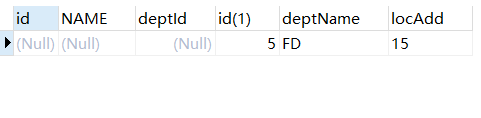


##### 2.3.2.6 ab表所有数据

a表特有的数据+共有的数据+b表特有的数据

`FULL OUTER` 全连接,ab表的所有数据;但是mysql是不支持FULL OUTTER的,oracle数据库支持

```sql
SELECT * FROM tbl_emp a 
FULL OUTER JOIN tbl_dept b
ON a.deptId = b.id;
```

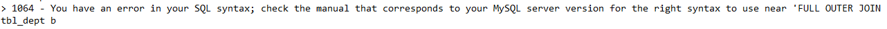

当需要查询ab表中的所有数据的时候,mysql又不支持full outer 可以通过ab表共有的数据和a表独有的数据和b表独有的数据来实现;  `a表特有数据+ab表共有数据+ab表共有数据+b表特有数据`  这样一来,会多一块相交的ab表共有数据,需要使用`union`进行自动去重

```sql
-- a表所有数据
SELECT * FROM tbl_emp a 
LEFT JOIN tbl_dept b
ON a.deptId = b.id

-- -----
UNION  -- 去除重复的共有数据
-- -----

-- b表所有数据
SELECT * FROM tbl_emp a 
RIGHT JOIN tbl_dept b
ON a.deptId = b.id
```

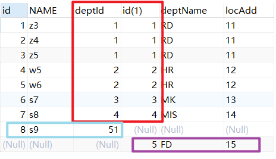

##### 2.3.2.7 ab表各自的独有数据

实现思路就是a表独有数据与b表独有数据拼接`a表独有数据+b表独有数据`   

```sql
-- a表独有数据
SELECT * FROM tbl_emp a 
LEFT JOIN tbl_dept b
ON a.deptId = b.id
WHERE b.id IS NULL
-- -----
UNION
-- -----

-- b表独有数据
SELECT * FROM tbl_emp a 
RIGHT JOIN tbl_dept b
ON a.deptId = b.id
WHERE a.deptId IS NULL;
```

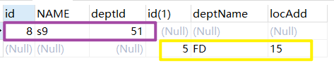

## 3. 索引简介

### 3.1 索引是什么

>  MySQL官方对索引的定义为: 索引(Index)是帮助MySQL高效获取数据的数据结构.可以得到索引的本质: **索引是数据结构**

- 索引的目的在于<u>提高查询效率</u>,可以类比字典,如果要查"MySQL"这个单词,我们肯定需要定位到m字母,然后从下往下找到y字母,再找到剩下的sql

- 如果没有索引,那么你可能需要a---->z,如果我想找到Java开头的单词呢?或者Oracle开头的单词呢?是不是觉得如果没有索引,这个事情根本无法完成

> 你可以将索引简单理解为<span style='color:red'>"排好序的快速查找数据结构"</span>

- **索引数据结构详解**: 在数据之外,数据库系统还维护着满足特定査找算法的数据结构,这些数据结构以某种方式引用(指向)数据,
  这样就可以在这些数据结构上实现高级查找算法。这种数据结构,就是索引。下图就是一种可能的索引方式示例:

  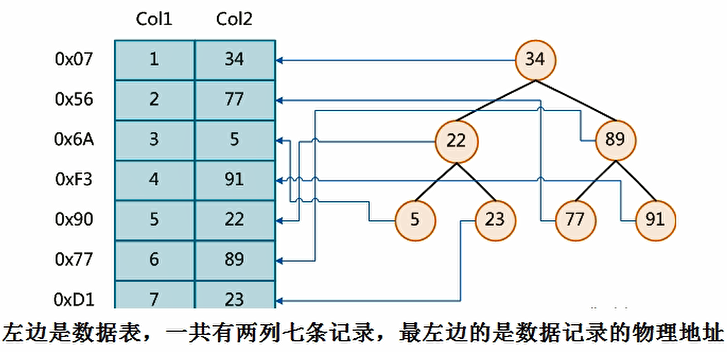

  为了加快Col2的查找,可以维护一个右边所示的二又査找树,每个节点分别包含素引键值和一个指向对应数据记录物理地址的指针,这样就可以运用二叉査找在一定的复杂度内获取到相应数据,从而快速的检素出符合条件的记录

- **结论**: 数据本身之外,数据库还维护着一个满足特定査找算法的数据结构,这些数据结构以某种方式指向数据,这样就可以在这些数据结构的基础上实现高级查找算法,这种数据结构就是索引(BTREE索引)

- **索引科普**: 

  -  一般来说索引本身也很大，不可能全部存储在内存中，因此*<u>索引往往以索引文件的形式存储的磁盘上</u>*
  - <span style="color:red">我们平常所说的索引，如果没有特别指明，都是指B树（多路搜索树，并不一定是二叉的）结构组织的索引</span>。其中聚集索引，次要索引，覆盖索引，复合索引，前缀索引，唯一索引默认都是使用B+树索引，统称索引。当然，除了B+树这种类型的索引之外，还有哈稀索引（hash index）等。

### 3.2 索引的优势

类似大学图书馆建书目索引，**提高数据检索的效率**，**降低数据库的IO成本**

通过索引列对数据进行排序，**降低数据排序的成本**，**降低了CPU的消耗**

### 3.3 索引的劣势

实际上索引也是一张表，该表保存了主键与索引字段，并指向实体表的记录，所以**索引列也是要占用空间**的

虽然索引大大提高了查询速度，同时却**会降低更新表的速度**，如对表进行INSERT、UPDATE和DELETE。因为更新表时，MySQL不仅要保存数据，还要保存一下索引文件每次更新添加了索引列的字段，都会调整因为更新所带来的键值变化后的索引信息

索引只是提高效率的一个因素，如果你的MySQL有大数据量的表，就**需要花时间研究建立最优秀的索引**，或优化索引

### 3.4 索引分类

| 类别     | 概述                                             |
| -------- | ------------------------------------------------ |
| 单值索引 | 即一个索引只包含单个列，一个表可以有多个单列索引 |
| 唯一索引 | 索引列的值必须唯一，但允许有空值                 |
| 复合索引 | 即一个索引包含多个列                             |


### 3.5 索引的基本语法

创建索引

```sql
-- 第一种创建方式
CREATE [UNIQUE] INDEX indexName ON mytable(columnname(length))
-- 第二种方式
ALTER mytable ADD [UNIQUE] INDEX [indexName] ON (columnname(length))
```

删除索引

```sql
DROP INDEX [indexName] ON mytable;
```

查看索引

```sql
SHOW INDEX FROM table_name;
```

有四种方式来添加数据表的索引

```sql
-- 该语句添加一个主键，这意味着索引值必须是唯一的，且不能为NULL。
ALTER TABLE tbl_name ADD PRIMARY KEY（column_list)；
-- 这条语句创建索引的值必须是唯一的（除了NULL外，NULL可能会出现多次）。
ALTER TABLE tbl_name ADD UNIQUE index_name（column_list);
-- 添加普通索引，索引值可出现多次。
ALTER TABLE tbl_name ADD INDEX index_name（column_list);
-- 该语句指定了索引为FULLTEXT，用于全文索引。
ALTER TABLE tbl_name ADD FULLTEXT index_name（column_list);
```

### 3.6 MySQL索引结构

> MySQL索引结构有: `BTree索引 , Hash索引,full-text全文索引,R-Tree索引` java开发党目前只需要掌握BTree索引即可;后续想转型做DBA需要对其他几种索引进行学习

**BTree索引的检索原理**

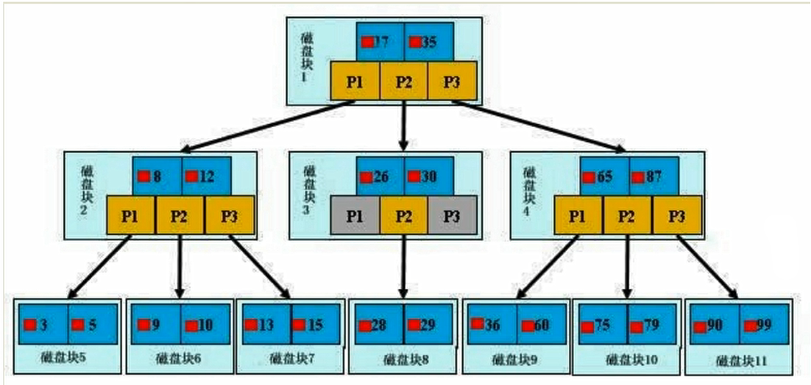

**【初始化介绍】**

一颗b+树，浅蓝色的块我们称之为一个磁盘块，可以看到每个磁盘块包含几个数据项（深蓝色所示）和指针（黄色所示），如磁盘块1包含数据项17和35，包含指针P1、P2、P3，

P1表示小于17的磁盘块，P2表示在17和35之间的磁盘块，P3表示大于35的磁盘块。

<span style="color:red">真实的数据存在于叶子节点中</span>即3、5、9、10、13、15、28、29、36、60、75、79、90、99。 

<span style="color:red">非叶子节点不存储真实的数据，只存储指引搜索方向的数据项</span>，如17、35并不真实存在于数据表中。

**【查找过程】**

如果要查找数据项29，那么首先会把磁盘块1由磁盘加载到内存，此时发生一次IO，在内存中用二分查找确定29在17和35之间，锁定磁盘块1的P2指针，内存时间因为非常短（相比磁盘的IO）可以忽略不计，通过磁盘块1的P2指针的磁盘地址把磁盘块3由磁盘加载到内存，发生第二次IO，29在26和30之间，锁定磁盘块3的P2指针，通过指针加载磁盘块8到内存，发生第三次IO，同时内存中做二分查找找到29，结束查询，总计三次lO。

真实的情况是，3层的b+树可以表示上百万的数据，如果上百万的数据查找只需要三次lO，性能提高将是巨大的，如果没有索引，每个数据项都要发生一次IO，那么总共需要百万次的IO，显然成本非常非常高。


### 3.7 哪些情况需要创建索引

1. 主键自动建立唯一索引
2. 频繁作为查询条件的字段应该创建索引
3. 查询中与其它表关联的字段，外键关系建立索引
4. 频繁更新的字段不适合创建索引     (因为每次更新不单单是更新了记录还会更新索引)
5. Where条件里用不到的字段不创建索引
6. 单键/组合索引的选择问题，who？（在高并发下倾向创建组合索引）
7. 查询中排序的字段，排序字段若通过索引去访问将大大提高排序速度
8. 查询中统计或者分组字段

### 3.8 哪些情况不需要创建索引

1. 表记录太少
2. 经常增删改查的表
   - Why：提高了查询速度，同时却会降低更新表的速度，如对表进行INSERT、UPDATE和DELETE。
     因为更新表时，MySOL不仅要保存数据，还要保存一下索引文件
3. 数据重复且分布平均的表字段，因此应该只为最经常查询和最经常排序的数据列建立索引。
   注意，如果某个数据列包含许多重复的内容，为它建立索引就没有太大的实际效果。
   - 假如一个表有10万行记录，有一个字段A只有T和F两种值，且每个值的分布概率大约为50%，那么对这种表A字段建索引一般不会提高数据库的查询速度。
     索引的选择性是指索引列中不同值的数目与表中记录数的比。如果一个表中有2000条记录，表索引列有1980个不同的值，那么这个索引的选择性就是1980/2000=0.99。
     一个索引的选择性越接近于1，这个索引的效率就越高。

## 4. 性能分析

### 4.1 MySQL Query Optimizer

1. Mysql中有专门负责优化SELECT语句的优化器模块，主要功能：通过计算分析系统中收集到的统计信息，为客户端请求的Query提供他认为最优的执行计划（他认为最优的数据检索方式，但不见得是DBA认为是最优的，这部分最耗费时间），
2. 当客户端向MySQL 请求一条Query，命令解析器模块完成请求分类，区别出是SELECT 并转发给MySQL Query Optimizer时，MySQL Query Optimizer 首先会对整条Query进行优化，处理掉一些常量表达式的预算，直接换算成常量值。并对Query中的查询条件进行简化和转换，如去掉一些无用或显而易见的条件、结构调整等。然后分析 Query中的Hint信息（如果有），看显示Hint信息是否可以完全确定该Query的执行计划。如果没有Hint 或Hint信息还不足以完全确定执行计划，则会读取所涉及对象的统计信息，根据Query进行写相应的计算分析，然后再得出最后的执行计划。

### 4.2 MySQL常见瓶颈

**CPU** : CPU在饱和的时候一般发生在数据装入内存或从磁盘上读取数据时候

**IO**：磁盘I/O瓶颈发生在装入数据远大于内存容量的时候

**服务器硬件的性能瓶颈**：top，free，iostat和vmstat来查看系统的性能状态


### 4.3 Explain

#### 4.3.1 Explain是什么

Explain简称执行计划

使用**EXPLAIN关键字**可以模拟优化器执行SQL查询语句，从而知道MySQL是如何处理你的SQL语句的。分析你的查询语句或是表结构的性能瓶颈

#### 4.3.2 Explain能干嘛

1. 表的读取顺序(id)

2. 数据读取操作的操作类型(select_type)

3. 哪些索引可以使用()

4. 哪些索引被实际使用

5. 表之间的引用

6. 每张表有多少行被优化器查询

#### 4.3.3 Explain基本使用

语法格式: `Explain + SQL语句`

执行计划包含的信息如下图

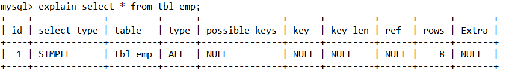

#### 4.3.4 执行计划字段解释

##### 4.3.4.1 id

**id字段表示:** select查询的序列号，包含一组数字，表示查询中执行select子句或操作表的顺序

**id的值有三种:**

- id相同，执行顺序由上至下

  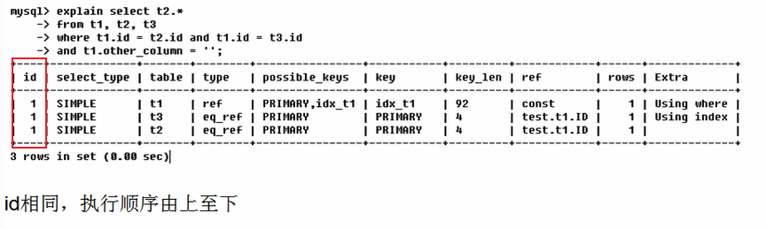

- id不同，如果是子查询，id的序号会递增，id值越大优先级越高，越先被执行

  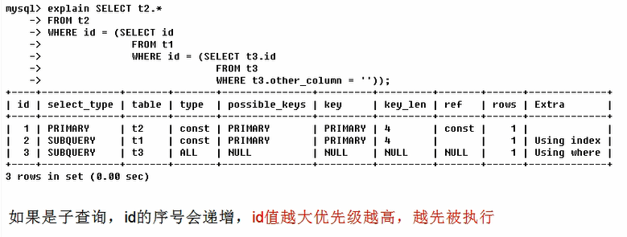

- id相同不同，同时存在

  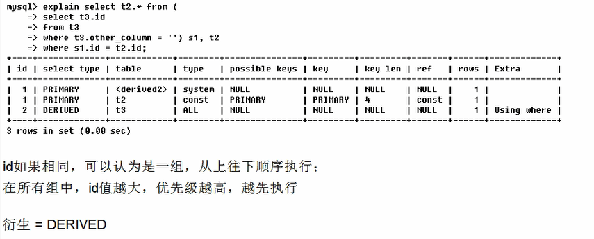

##### 4.3.4.2 select_type

select_type表示**查询的类型**，主要是用于区别普通查询、联合查询、子查询等的复杂查询

| select_type    | 解释                                                         |
| -------------- | ------------------------------------------------------------ |
| `SIMPLE`       | 简单的select查询，查询中不包含子查询或者UNION                |
| `PRIMARY`      | 查询中若包含任何复杂的子部分，最外层查询则被标记为PRIMARY(就是最后被被加载的查询语句会被标记为PRIMARY) |
| `SUBQUERY`     | 在SELECT或WHERE列表中包含了子查询                            |
| `DERIVED`      | 在FROM列表中包含的子查询被标记为DERIVED（衍生）MySQL会递归执行这些子查询，把结果放在临时表里。 |
| `UNION`        | 若第二个SELECT出现在UNION之后，则被标记为UNION；若UNION包含在FROM子句的子查询中，外层SELECT将被标记为：DERIVED |
| `UNION RESULT` | 从UNION表获取结果的SELECT                                    |

**类型解释:**


##### 4.3.4.3 table

表的名字,显示这一行的数据是关于哪张表的.

##### 4.3.4.4 type

type用来反应sql是否是优化过,是否是最佳状态

type的值有如下几种

| type     | 解释                                                         |
| -------- | ------------------------------------------------------------ |
| `system` | 表只有一行记录（等于系统表），这是const类型的特列，平时不会出现，这个也可以忽略不计 **[无意义]** |
| `const`  | 表示通过索引一次就找到了，const用于比较primary key或者unique索引。因为只匹配一行数据，所以很快如将主键置于where列表中，MySOL就能将该查询转换为一个常量 **[常量]** |
| `eq_ref` | 唯一性索引扫描，对于每个索引键，表中只有一条记录与之匹配。常见于主键或唯一索引扫描 **[单值]** |
| `ref`    | 非唯一性索引扫描，返回匹配某个单独值的所有行。本质上也是一种索引访问，它返回所有匹配某个单独值的行，然而，它可能会找到多个符合条件的行，所以他应该属于查找和扫描的混合体 **[多值]** |
| `range`  | 只检索给定范围的行，使用一个索引来选择行。key列显示使用了哪个索引一般就是在你的where语句中出现了between、<、>、in等的查询这种范围扫描索引扫描比全表扫描要好，因为它只需要开始于索引的某一点，而结束语另一点，不用扫描全部索引。**[范围]** |
| `index`  | Full Index Scan，index与ALL区别为index类型只遍历索引树。这通常比ALL快，因为索引文件通常比数据文件小（也就是说虽然all和Index都是读全表，但index是从索引中读取的，而all是从硬盘中读的） **[全索引扫描]** |
| `ALL`    | Full Table Scan，将遍历全表以找到匹配的行 **[全表扫描]**     |
| `NULL`   |                                                              |

type用于显示查询语句使用了何种类型，从最好到最差依次是：`system>const>eq_ref>ref>range>index>ALL` 

**注意**: 一般来说，得保证查询的`type`值至少达到range级别，最好能达到ref。

##### 4.3.4.5 possible_keys

显示可能应用在这张表中的索引，一个或多个。查询涉及到的字段上若存在索引，则该索引将被列出，**但不一定被查询实际使用**;possible_key只是一个理论上可能用到的索引,key是实际使用到的索引

##### 4.3.4.6 key

**实际使用的索引**。如果为NULL，则没有使用索引

查询中若使用了覆盖索引，则该索引仅出现在key列表中;

- **什么是覆盖索引**: 查询的字段个数和顺序和建立索引的字段和顺序完全对应,例如下图

  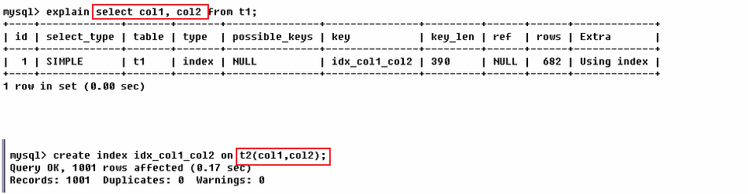

索引失效: 索引失效的情况有两种,要么没有创建索引,要么创建了索引没有使用

##### 4.3.4.7 key_len

**key_len** 字段表示索引中使用的字节数，可通过该列计算查询中使用的索引的长度。在不损失精确性的情况下，长度越短越好

key_len显示的值为索引字段的<u>最大可能长度，并非实际使用长度</u>，即key_len是根据表定义计算而得，不是通过表内检索出的

同样的查询结果`key_len`的值越少越好.

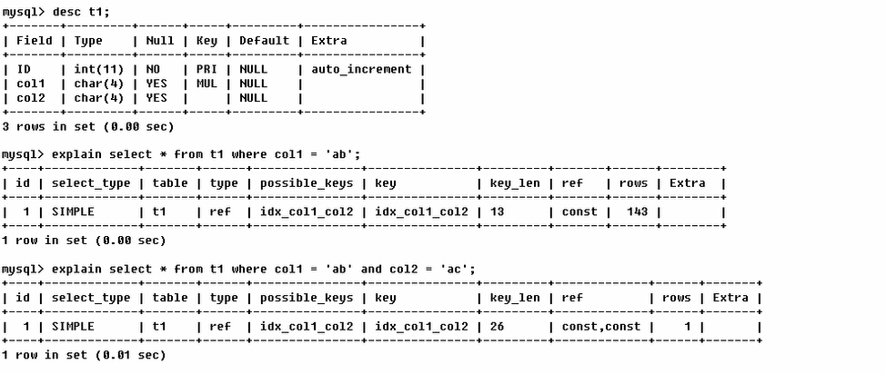

##### 4.3.4.8 ref

ref字段显示索引的哪一列被使用了，如果可能的话，是一个常数。哪些列或常量被用于查找索引列上的值

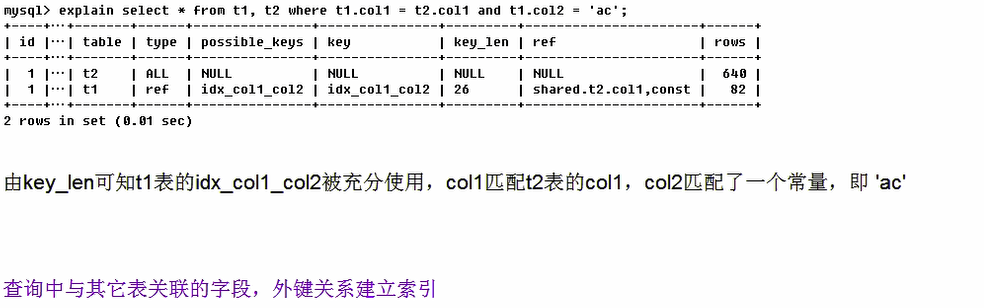


##### 4.3.4.9 rows

根据表统计信息及索引选用情况，大致估算出找到所需的记录所需要读取的行数

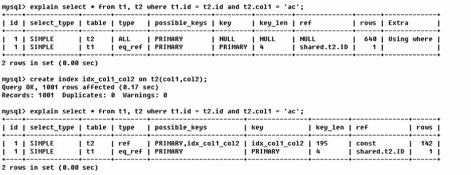

##### 4.3.4.10 Extra

**Extra**字段包含不适合在其他列中显示但十分重要的额外信息

- `Using filesort` 说明mysql会对数据使用一个外部的索引排序，而不是按照表内的索引顺序进行读取。MySQL中无法利用索引完成的排序操作称为“文件排序"

  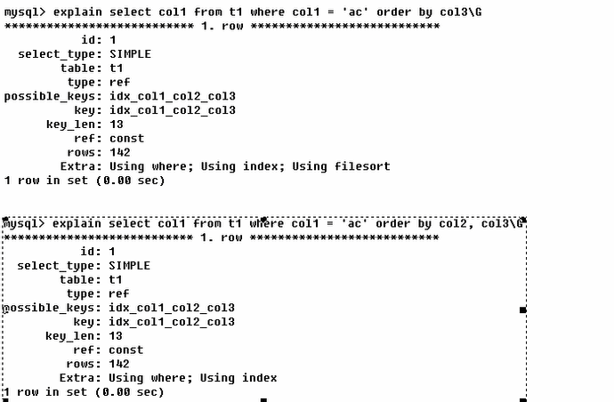

- `Using temporary` 使了用临时表保存中间结果，MySQL在对查询结果排序时使用临时表。常见于排序order by和分组查询 group by。

  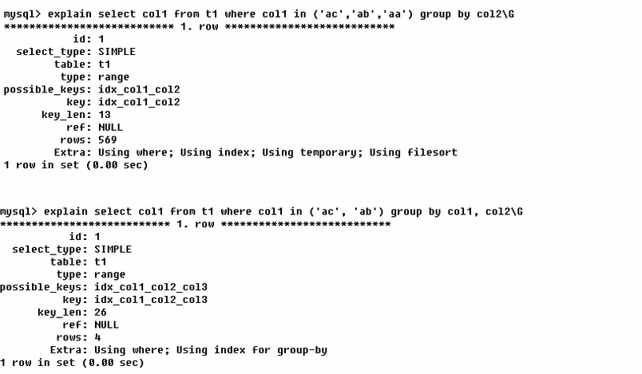

- `USING index` 表示相应的select操作中使用了覆盖索引（Covering Index），避免访问了表的数据行，效率不错！
  如果同时出现using where，表明索引被用来执行索引键值的查找；如果没有同时出现using where，表明索引用来读取数据而非执行查找动作。

  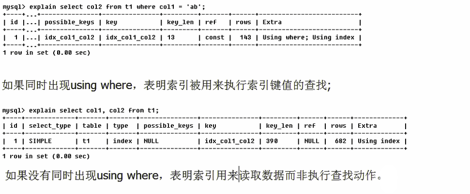

  **PS: 索引覆盖官方解读**

  覆盖索引（Covering Index），一说为索引覆盖。

  - 理解方式一：就是select的数据列只用从索引中就能够取得，不必读取数据行，MySQL可以利用索引返回select列表中的字段，而不必根据索引再次读取数据文件，换句话说查询列要被所建的索引覆盖。
  - 理解方式二：索引是高效找到行的一个方法，但是一般数据库也能使用索引找到一个列的数据，因此它不必读取整个行。毕竟索引叶子节点存储了它们索引的数据；当能通过读取索引就可以得到想要的数据，那就不需要读取行了。一个索引包含了（或覆盖了）满足查询结果的数据就叫做覆盖索引。

- `Using where` 表明使用了where过滤

- `using join buffer` 使用了连接缓存

- `impossible where` where子句的值总是false，不能用来获取任何元组

  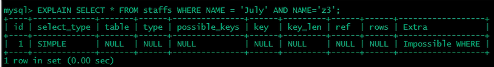

- `select tables optimized away` 在没有GROUPBY子句的情况下，基于索引优化MIN/MAX操作或者对于MyISAM存储引擎优化COUNT（*）操作，不必等到执行阶段再进行计算，查询执行计划生成的阶段即完成优化。

- `distinct` 优化distinct操作，在找到第一匹配的元组后即停止找同样值的动作

#### 4.3.5 Explain热身Case

请写出下图中sql的执行顺序

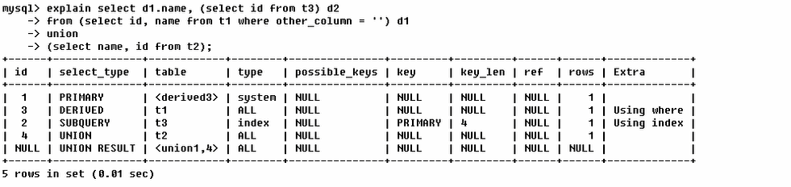

**SQL执行顺序解析:**

`4,3,2,1,NULL`


第一行（执行顺序4）：id列为1，表示是union里的第一个select，select_type列的primary表示该查询为外层查询，table列被标记为<derived3>，表示查询结果来自一个衍生表，其中derived3中3代表该查询衍生自第三个select查询，即id为3的select。【
select d1.name.....】

第二行（执行顺序2）：id为3，是整个查询中第三个select的一部分。因查询包含在from中，所以为derived。【select id，name from t1 where other_column="】

第三行（执行顺序3）：select列表中的子查询select_type为subquery，为整个查询中的第二个select。【select id from t3】

第四行（执行顺序1）：select_type为union，说明第四个select是union里的第二个select，最先执行【select name，id from t2】

第五行（执行顺序5）：代表从union的临时表中读取行的阶段，table列的<union1，4>表示用第一个和第四个select的结果进行union操作。【两个结果union操作】

## 5. 索引优化

### 5.1 单表索引优化

**【建表】**

```sql
-- 创建article表(文章表)
CREATE TABLE IF NOT EXISTS article(
	id INT(10) UNSIGNED NOT NULL PRIMARY KEY AUTO_INCREMENT COMMENT '文章ID',
	author_id INT(10) UNSIGNED NOT NULL COMMENT '作者id',
	category_id INT(10) UNSIGNED NOT NULL COMMENT '类别id',
	views INT(10) UNSIGNED NOT NULL COMMENT '新闻',
	comments INT(10) UNSIGNED NOT NULL COMMENT '评论',
	title VARCHAR(255) NOT NULL COMMENT '标题',
	content TEXT NOT NULL COMMENT '内容'
);

-- 插入数据
INSERT INTO article(author_id,category_id,views,comments,title,content)
VALUES
(1,1,1,1,'1','1'),
(2,2,2,2,'2','2'),
(1,1,3,3,'3','3');
```

**【案例】**

查询 category_id为1且comments大于1的情况下，views最多的article_id。

```sql
select * from article where category_id=1 and comments>1 and views
```


### 5.2 两表索引优化

**【建表】**

```sql
-- 创建表
CREATE TABLE IF NOT EXISTS class(
	id INT(10) UNSIGNED NOT NULL AUTO_INCREMENT,
	card INT(10) UNSIGNED NOT NULL,
	PRIMARY KEY(id)
);

-- 创建表
CREATE TABLE IF NOT EXISTS book(
	bookid INT(10) UNSIGNED NOT NULL AUTO_INCREMENT,
	card INT(10) UNSIGNED NOT NULL,
	PRIMARY KEY(bookid)
);

-- class表插入数据
INSERT INTO class(card) VALUES(FLOOR(1+(RAND()*20)));
INSERT INTO class(card) VALUES(FLOOR(1+(RAND()*20)));
INSERT INTO class(card) VALUES(FLOOR(1+(RAND()*20)));
INSERT INTO class(card) VALUES(FLOOR(1+(RAND()*20)));
INSERT INTO class(card) VALUES(FLOOR(1+(RAND()*20)));
INSERT INTO class(card) VALUES(FLOOR(1+(RAND()*20)));
INSERT INTO class(card) VALUES(FLOOR(1+(RAND()*20)));
INSERT INTO class(card) VALUES(FLOOR(1+(RAND()*20)));
INSERT INTO class(card) VALUES(FLOOR(1+(RAND()*20)));
INSERT INTO class(card) VALUES(FLOOR(1+(RAND()*20)));
INSERT INTO class(card) VALUES(FLOOR(1+(RAND()*20)));
INSERT INTO class(card) VALUES(FLOOR(1+(RAND()*20)));
INSERT INTO class(card) VALUES(FLOOR(1+(RAND()*20)));
INSERT INTO class(card) VALUES(FLOOR(1+(RAND()*20)));
INSERT INTO class(card) VALUES(FLOOR(1+(RAND()*20)));
INSERT INTO class(card) VALUES(FLOOR(1+(RAND()*20)));
INSERT INTO class(card) VALUES(FLOOR(1+(RAND()*20)));
INSERT INTO class(card) VALUES(FLOOR(1+(RAND()*20)));
INSERT INTO class(card) VALUES(FLOOR(1+(RAND()*20)));
INSERT INTO class(card) VALUES(FLOOR(1+(RAND()*20)));
INSERT INTO class(card) VALUES(FLOOR(1+(RAND()*20)));

-- book表插入数据
INSERT INTO book(card) VALUES(FLOOR(1+(RAND()*20)));
INSERT INTO book(card) VALUES(FLOOR(1+(RAND()*20)));
INSERT INTO book(card) VALUES(FLOOR(1+(RAND()*20)));
INSERT INTO book(card) VALUES(FLOOR(1+(RAND()*20)));
INSERT INTO book(card) VALUES(FLOOR(1+(RAND()*20)));
INSERT INTO book(card) VALUES(FLOOR(1+(RAND()*20)));
INSERT INTO book(card) VALUES(FLOOR(1+(RAND()*20)));
INSERT INTO book(card) VALUES(FLOOR(1+(RAND()*20)));
INSERT INTO book(card) VALUES(FLOOR(1+(RAND()*20)));
INSERT INTO book(card) VALUES(FLOOR(1+(RAND()*20)));
INSERT INTO book(card) VALUES(FLOOR(1+(RAND()*20)));
INSERT INTO book(card) VALUES(FLOOR(1+(RAND()*20)));
INSERT INTO book(card) VALUES(FLOOR(1+(RAND()*20)));
INSERT INTO book(card) VALUES(FLOOR(1+(RAND()*20)));
INSERT INTO book(card) VALUES(FLOOR(1+(RAND()*20)));
INSERT INTO book(card) VALUES(FLOOR(1+(RAND()*20)));
INSERT INTO book(card) VALUES(FLOOR(1+(RAND()*20)));
INSERT INTO book(card) VALUES(FLOOR(1+(RAND()*20)));
INSERT INTO book(card) VALUES(FLOOR(1+(RAND()*20)));
INSERT INTO book(card) VALUES(FLOOR(1+(RAND()*20)));
```

**【案例】**


### 5.3 三表索引优化

**【建表】**

```sql
-- 创建phone表
CREATE TABLE IF NOT EXISTS phone(
	phoneid INT(10) UNSIGNED NOT NULL AUTO_INCREMENT,
	card INT(10) UNSIGNED NOT NULL,
	PRIMARY KEY(phoneid)
)ENGINE=INNODB;

-- 插入数据
INSERT INTO phone(card) VALUES(FLOOR(1+(RAND()*20)));
INSERT INTO phone(card) VALUES(FLOOR(1+(RAND()*20)));
INSERT INTO phone(card) VALUES(FLOOR(1+(RAND()*20)));
INSERT INTO phone(card) VALUES(FLOOR(1+(RAND()*20)));
INSERT INTO phone(card) VALUES(FLOOR(1+(RAND()*20)));
INSERT INTO phone(card) VALUES(FLOOR(1+(RAND()*20)));
INSERT INTO phone(card) VALUES(FLOOR(1+(RAND()*20)));
INSERT INTO phone(card) VALUES(FLOOR(1+(RAND()*20)));
INSERT INTO phone(card) VALUES(FLOOR(1+(RAND()*20)));
INSERT INTO phone(card) VALUES(FLOOR(1+(RAND()*20)));
INSERT INTO phone(card) VALUES(FLOOR(1+(RAND()*20)));
INSERT INTO phone(card) VALUES(FLOOR(1+(RAND()*20)));
INSERT INTO phone(card) VALUES(FLOOR(1+(RAND()*20)));
INSERT INTO phone(card) VALUES(FLOOR(1+(RAND()*20)));
INSERT INTO phone(card) VALUES(FLOOR(1+(RAND()*20)));
INSERT INTO phone(card) VALUES(FLOOR(1+(RAND()*20)));
INSERT INTO phone(card) VALUES(FLOOR(1+(RAND()*20)));
INSERT INTO phone(card) VALUES(FLOOR(1+(RAND()*20)));
INSERT INTO phone(card) VALUES(FLOOR(1+(RAND()*20)));
INSERT INTO phone(card) VALUES(FLOOR(1+(RAND()*20)));
```

**【案例】**


