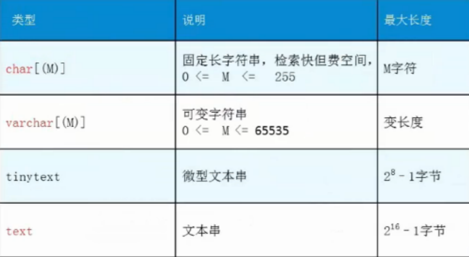
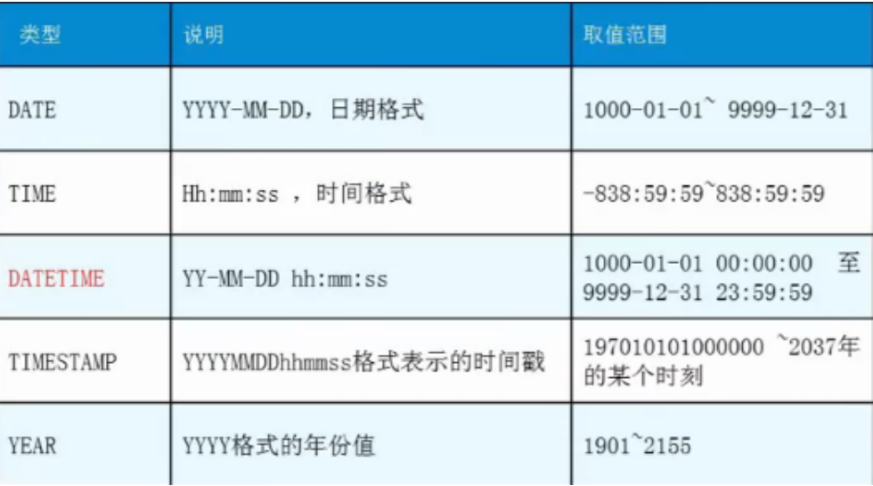

# 操作数据库

本章的本质就是对数据库的CRUD(增,删,改,查)操作

## 1. 结构化查询语句分类

| 名称                 | 解释                                       | 命令                    |
| -------------------- | ------------------------------------------ | ----------------------- |
| DDL （数据定义语言） | **定义**和管理数据对象，如数据库，数据表等 | CREATE、DROP、ALTER     |
| DML （数据操作语言） | 用于**操作**数据库对象中所包含的数据       | INSERT、UPDATE、DELETE  |
| DQL （数据查询语言） | 用于**查询**数据库数据                     | SELECT                  |
| DCL （数据控制语言） | 用于管理数据库的语言，包括管理权限及数     | GRANT、commit、rollback |


## 2. 数据库操作

*操作数据库>操作数据库中的表>操作数据库中表的数据*

创建数据库：`create database [if not exists] 数据库名;`

```sql
-- 创建一个westos数据库
CREATE DATABASE IF NOT EXISTS westos;
```


删除数据库：`drop database [if exists]数据库名;`

```sql
-- 删除westos数据库
DROP DATABASE IF EXISTS westos;
```

使用数据库：`use 数据库名;`

```sql
-- 使用school数据库
USE school;
```

查看数据库：`show databases;`

```sql
SHOW DATABASES;
```

## 3. 数据值和列类型

列类型 : 规定数据库中该列存放的数据类型

*mysql的数据类型,其概念和java中的数据类型相同*

### 3.1 数值类型


### 3.2 字符串类型



### 3.3 日期和时间型数值类型



### 3.4 NULL值

理解为 "没有值" 或 "未知值"

不要用NULL进行算术运算 , 结果仍为NULL


## 4. 数据字段属性(约束)

*用于约束数据的*

**UnSigned**

- 无符号的
- 声明该数据列不允许负数 

**ZEROFILL**

- 0填充的
- 不足位数的用0来填充 , 如int(3),5则为005

**Auto_InCrement**

- 自动增长的 , 每添加一条数据 , 自动在上一个记录数上加 1(默认)
- 通常用于设置**主键** , 且为整数类型
- 可定义起始值和步长
  - 当前表设置步长(AUTO_INCREMENT=100) : 只影响当前表
  - SET @@auto_increment_increment=5 ; 影响所有使用自增的表(全局)

**NULL** **和** **NOT NULL**

- 默认为NULL , 即没有插入该列的数值
- 如果设置为NOT NULL , 则该列必须有值

**DEFAULT**

- 默认的
- 用于设置默认值
- 例如,性别字段,默认为"男" , 否则为 "女" ; 若无指定该列的值 , 则默认值为"男"的值

*建表小科普*: 在编写项目的时候,创建的表最好应该包含如下这几个字段,用于表示每一个记录存在的意义*

```sql
/*
id 主键
`version` 版本号,设置乐观锁
is_delete 逻辑删除
gmt_create 创建时间
gmt_update 更新时间
*/
```

## 5. 创建数据表

```sql
-- 目标 : 创建一个school数据库 
-- 创建学生表(列,字段) 
-- 学号int 登录密码varchar(20) 姓名,性别varchar(2),出生日期(datatime),家庭住 址,email 
-- ps: 创建表之前 , 一定要先选择数据库
-- 注意点: 使用英文（），表的名称和字段尽量使用``括起来
-- 注意点: PRIMARY KEY 主键，一般一个表只有一个唯一的主键！
CREATE TABLE IF NOT EXISTS `student`(
	`id` INT(4) NOT NULL AUTO_INCREMENT COMMENT '学号',
	`name` VARCHAR(30) NOT NULL DEFAULT '匿名' COMMENT '姓名',
	`pwd` VARCHAR(30) NOT NULL DEFAULT '123456' COMMENT '密码',
	`sex` VARCHAR(2) NOT NULL DEFAULT '男' COMMENT '性别',
	`address` VARCHAR(100) DEFAULT NULL COMMENT '家庭住址',
	`birthday` DATETIME DEFAULT NULL COMMENT '出生日期',
	`email` VARCHAR(50) DEFAULT NULL COMMENT '邮箱',
	PRIMARY KEY (`id`)
) ENGINE=INNODB DEFAULT CHARSET=utf8;

-- -------------------------------------------------------

-- 查看数据库的定义 
SHOW CREATE DATABASE school; 
-- 查看数据表的定义 
SHOW CREATE TABLE student; 
-- 显示表结构 
DESC student; 
-- 设置严格检查模式(不能容错了)
SET sql_mode='STRICT_TRANS_TABLES';
```

建表的语法格式

```sql
create table [if not exists] `表名`( 
    '字段名1' 列类型 [属性] [索引] [注释],
    '字段名2' 列类型 [属性] [索引] [注释],
    -- ... 
    '字段名n' 列类型 [属性] [索引] [注释] 
)[表类型] [表字符集] [注释];
```


## 6. 数据表的类型(引擎)

Mysql有多种数据存储引擎: **MyISAM** , **InnoDB** , HEAP , BOB , CSV

给表设置引擎和字符集

```sql
CREATE TABLE 表名( 
-- 省略一些代码 
-- Mysql注释 
-- 1. # 单行注释 
-- 2. /*...*/ 多行注释 
)ENGINE = MyISAM (or InnoDB) 
-- 查看mysql所支持的引擎类型 (表类型) 
SHOW ENGINES;
```


### 6.1 INNODB和MYISM区别

*mysql常用两种引擎,一种是INNODB,一种是MYISM,两种存储引擎有如下区别*

| **名称**   | **MyISAM** | **InnoDB**                |
| ---------- | ---------- | ------------------------- |
| 事务处理   | 不支持     | 支持                      |
| 数据行锁定 | 不支持     | 支持                      |
| 外键约束   | 不支持     | 支持                      |
| 全文索引   | 支持       | 不支持                    |
| 表空间大小 | 较小       | 较大，约为MyISAM的 2 倍！ |

两种引擎如何去选择?

- 适用 MyISAM : 节约空间及相应速度
- 适用 InnoDB : 安全性搞 , 事务处理及多用户操作数据表

### 6.2 数据表的存储位置

MySQL数据表本质上还是以文件方式存放在磁盘中

- 包括表文件 , 数据文件 , 以及数据库的选项文件

- 位置 : Mysql安装目录\data\下存放数据表 . 目录名对应数据库名 , 该目录下文件名对应数据表

  

  

### 6.3 InnoDB和MyISAM文件类型

**InnoDB类型数据表只有一个 *.frm文件 , 以及上一级目录的ibdata1文件**


**MyISAM类型数据表对应三个文件 **

```sql
-- 创建MyISAM引擎的数据
CREATE TABLE IF NOT EXISTS `teacher`(
	`id` INT(4) NOT NULL AUTO_INCREMENT COMMENT '教师号',
	`email` VARCHAR(50) DEFAULT NULL COMMENT '邮箱',
	PRIMARY KEY (`id`)
) ENGINE=MYISAM DEFAULT CHARSET=utf8;
```


- \* . frm -- 表结构定义文件
- \* . MYD -- 数据文件 ( data )
- \* . MYI -- 索引文件 ( index )

### 6.4 设置数据表字符集

我们可为数据库,数据表,数据列设定不同的字符集，不设置的话，会是mysql默认的字符集编码~（mysql默认的字符编码`Latin1`不支持中文！）

设定方法 :

1. 创建时通过命令来设置 , 如 : 

   ```sql
   CREATE TABLE 表名(
   
   )CHARSET = utf8; -- 设置编码
   ```

2. 如无设定 , 则根据MySQL数据库配置文件 my.ini 中的参数设定

   ```ini
   # 配置编码
   character-set-server=utf8
   ```

   


## 7. 修改删除表以及字段

> 修改删除表,以及修改删除字段

修改表的名字 :` ALTER TABLE 旧表名 RENAME AS 新表名`

```sql
-- 将teacher表名修改为teacher1
ALTER TABLE teacher RENAME AS teacher1;
```

添加表的字段 : `ALTER TABLE 表名 ADD 字段名 列属性[属性]`

```sql
-- 添加一个字段ageage
ALTER TABLE teacher1 add ageage int(10) COMMENT '年龄年龄';
```

修改表的字段的约束 : `ALTER TABLE 表名 MODIFY 字段名 列类型[属性]`

```sql
-- 修改字段ageage的约束int(10) 改为varchar(10)
ALTER TABLE teacher1 MODIFY ageage VARCHAR(10) COMMENT '年龄年龄';
```

对表的字段重新命名:`ALTER TABLE 表名 CHANGE 旧字段名 新字段名 列属性[属性]`

```sql
-- 修改字段ageage为新的名字newage 并添加int(10)约束
ALTER TABLE teacher1 CHANGE ageage newage int(10) COMMENT '年龄年龄';
```

删除表的字段 :` ALTER TABLE 表名 DROP 字段名`

```sql
-- 删除newage字段
ALTER TABLE teacher1 DROP newage;
```

删除整个表: `DROP TABLE [IF EXISTS] 表名`IF EXISTS 为可选 , 判断是否存在该数据表,如删除不存在的数据表会抛出错误

```sql
-- 删除teacher1表
DROP TABLES IF EXISTS teacher1;
```

