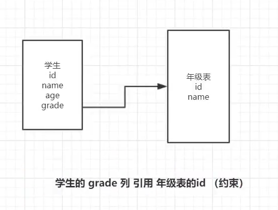
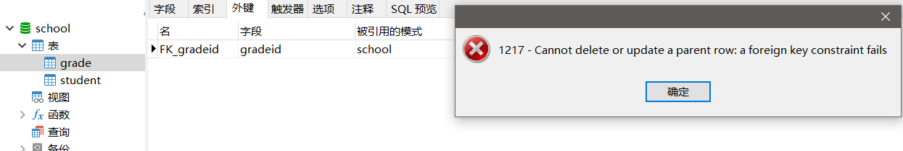

# MySQL数据库管理

## 1. 外键

### 1.1 外键的概念

**什么是外键:** 如果公共关键字在一个关系中是主关键字，那么这个公共关键字被称为另一个关系的外键。由此可见，外键表示了两个关系之间的相关联系。

**什么是主表和从表:** 以另一个关系的外键作主关键字的表被称为<u>主表</u>，具有此外键的表被称为主表的<u>从表</u>。

在实际操作中，将一个表的值放入第二个表来表示关联，所使用的值是第一个表的主键值(在必要时可包括复合主键值)。此时，第二个表中保存这些值的属性称为外键(**foreign key**)。

**外键作用**: 保持数据**一致性**，**完整性**，主要目的是控制存储在外键表中的数据,**约束**。 使两张表形成关联，外键只能

引用外表中的列的值或使用空值。



### 1.2 创建从表的同时创建外键

```sql
-- 创建外键的方式一 : 创建表同时创建外键 
-- 年级表 (id\年级名称) 主表
CREATE TABLE `grade` ( 
    `gradeid` INT(10) NOT NULL AUTO_INCREMENT COMMENT '年级ID', 
    `gradename` VARCHAR(50) NOT NULL COMMENT '年级名称',
    PRIMARY KEY (`gradeid`) 
) ENGINE=INNODB DEFAULT CHARSET=utf8;
-- 学生信息表 (学号,姓名,性别,年级,手机,地址,出生日期,邮箱,身份证号) 从表
CREATE TABLE `student` ( 
    `studentno` INT(4) NOT NULL COMMENT '学号',
    `studentname` VARCHAR(20) NOT NULL DEFAULT '匿名' COMMENT '姓名',
    `sex` TINYINT(1) DEFAULT '1' COMMENT '性别',
    -- 年级表id
    `gradeid` INT(10) DEFAULT NULL COMMENT '年级', 
    `phoneNum` VARCHAR(50) NOT NULL COMMENT '手机', 
    `address` VARCHAR(255) DEFAULT NULL COMMENT '地址', 
    `borndate` DATETIME DEFAULT NULL COMMENT '生日', 
    `email` VARCHAR(50) DEFAULT NULL COMMENT '邮箱', 
    `idCard` VARCHAR(18) DEFAULT NULL COMMENT '身份证号', 
    PRIMARY KEY (`studentno`), 
    KEY `FK_gradeid` (`gradeid`), 
    CONSTRAINT `FK_gradeid` FOREIGN KEY (`gradeid`) REFERENCES `grade` (`gradeid`) 
) ENGINE=INNODB DEFAULT CHARSET=utf8
```


### 1.3 建表后创建外键

```sql
-- 创建外键的方式一 : 创建表同时创建外键 
-- 年级表 (id\年级名称) 主表
CREATE TABLE `grade` ( 
    `gradeid` INT(10) NOT NULL AUTO_INCREMENT COMMENT '年级ID', 
    `gradename` VARCHAR(50) NOT NULL COMMENT '年级名称',
    PRIMARY KEY (`gradeid`) 
) ENGINE=INNODB DEFAULT CHARSET=utf8;
-- 学生信息表 (学号,姓名,性别,年级,手机,地址,出生日期,邮箱,身份证号) 从表
CREATE TABLE `student` ( 
    `studentno` INT(4) NOT NULL COMMENT '学号',
    `studentname` VARCHAR(20) NOT NULL DEFAULT '匿名' COMMENT '姓名',
    `sex` TINYINT(1) DEFAULT '1' COMMENT '性别',
    -- 年级表id
    `gradeid` INT(10) DEFAULT NULL COMMENT '年级', 
    `phoneNum` VARCHAR(50) NOT NULL COMMENT '手机', 
    `address` VARCHAR(255) DEFAULT NULL COMMENT '地址', 
    `borndate` DATETIME DEFAULT NULL COMMENT '生日', 
    `email` VARCHAR(50) DEFAULT NULL COMMENT '邮箱', 
    `idCard` VARCHAR(18) DEFAULT NULL COMMENT '身份证号', 
    PRIMARY KEY (`studentno`)
) ENGINE=INNODB DEFAULT CHARSET=utf8
```

创建外键语法: `ALTER TABLE 表 ADD CONSTRAINT 约束名 FOREIGNKEY（作为外键的列）REFERENCES 哪个表（哪个字段）`

```sql
-- 创建外键方式二 : 创建子表完毕后,修改子表添加外键 
ALTER TABLE `student` ADD CONSTRAINT `FK_gradeid` FOREIGN KEY (`gradeid`) REFERENCES `grade` (`gradeid`);
```


### 1.4 删除外键

```sql
-- 删除外键 
ALTER TABLE student DROP FOREIGN KEY FK_gradeid; 
-- 发现执行完上面的,索引还在,所以还要删除索引 
-- 注:这个索引是建立外键的时候默认生成的 
ALTER TABLE student DROP INDEX FK_gradeid;
```

### 1.5 外键注意点

1. 以上的操作都是物理外键，数据库级别的外键，我们不建议使用！（避免数据库过多造成困扰）

   最佳实践

   - 数据库就是单纯的表，只用来存数据，只有行（数据）和列（字段）
   - 我们想使用多张表的数据，想使用外键（程序去实现）

2. 删除具有主外键关系的表时 , 要先删从表(引用别人的表) , 后删主表(被应用的表),顺序反了会报错

   


## 2. DML语言

**数据库的意义:**  数据存储、数据管理

**管理数据库数据方法**：

- 通过可视化管理工具管理数据库数据(SQLyog,Navicate)
- 通过DML语句管理数据库数据

**DML语言:**  数据操作语言

- 用于操作数据库对象中所包含的数据
- 包括 :`INSERT (添加数据语句)` `UPDATE (更新数据语句) ` `DELETE (删除数据语句) `


### 2.1 添加数据(INSERT)

**语法**: `INSERT INTO 表名[(字段1,字段2,字段3,...)] VALUES('值1'),('值2'),('值3');`

```sql
-- 像年级表grade中插入一条数据
INSERT INTO `grade` (`gradename`) VALUES ('大四');
```

**注意点:**

1. 字段或值之间用英文逗号隔开 .

2. `' 字段1,字段2...' `该部分可省略 , 但添加的值务必与表结构,数据列,顺序相对应,且数量一致 

   ```sql
   -- 向年级表grade中插入一条数据
   INSERT INTO `grade` (`gradeid`,`gradename`) VALUES (2,'大三');
   -- 向学生表中插入一条数据
   INSERT INTO `student` (`studentno`,`studentname`,`email`,`address`,`phoneNum`) VALUES (001,'张三','codexiyang@163.com','重庆观音桥','13132321144');
   ```

3. 可同时插入多条数据 , values 后用英文逗号隔开 .

   ```sql
   -- 向年级表grade中插入多条数据
   INSERT INTO `grade` (`gradename`) VALUES('大一'),('大二');
   -- 向学生表中插入多条数据
   INSERT INTO `student` (`studentno`,`studentname`,`email`,`address`,`phoneNum`) VALUES 
   (002,'张三','codexiyang@163.com','重庆观音桥','13132321144'),
   (003,'李四','codexiyang@qq.com','重庆观音桥','13232321143'),
   (004,'王五','codexiyang@mail.com','重庆观音桥','13332321142');
   ```

   

### 2.2 修改数据

**语法:** `UPDATE 表名 SET column_name=value,[column_name2=value2,...] [WHERE condition]; `

```sql
-- 将年级表grade中的大四修改为大大四
UPDATE `grade` SET `gradename`='大大四' WHERE `gradename` = '大四';
-- 将学生表student中的学号studentno为4的名字修改为王五他爹
UPDATE `student` SET `studentname`='王五他爹' WHERE `studentno` = '4';
```


**注意点:**

1. column_name 为要更改的数据列

2. value 为修改后的数据 , 可以为变量 , 具体指 , 表达式或者嵌套的SELECT结果

3. condition 为筛选条件 , 如不指定则修改该表的所有列数据 !!一定不要这么操作!!

4. 可以同时修改多个字段的值

   ```sql
   -- 将学生表student中的学号studentno为4的名字修改为王五他爹,address改为红旗河沟
   UPDATE `student` SET `studentname`='王五他爹',`address`='红旗河沟' WHERE `studentno` = '4';
   ```

   

**where条件子句**

可以简单的理解为 : 有条件地从表中筛选数据

| 运算符    | 含义           | 范围             | 结果  |
| --------- | -------------- | ---------------- | ----- |
| =         | 等于           | 5=6              | false |
| <> 或  != | 不等于         | 5!=6             | true  |
| \>        | 大于           | 5>6              | false |
| <         | 小于           | 5<6              | true  |
| \>=       | 大于等于       | 5>=6             | false |
| <=        | 小于等于       | 5<=6             | true  |
| BETWEEN   | 在某个范围之间 | BETWEEN 5 AND 10 | false |
| AND       | 并且`&`        | 5 > 1 AND 1 > 2  | false |
| OR        | 或`||`         | 5 > 1 OR 1 > 2   | true  |

### 2.3 删除数据

#### 2.3.1 DELETE

**语法:** `DELETE FROM 表名 [WHERE condition]; `

```sql
-- 将学生表student中的学号studentno为1的数据删除
DELETE FROM `student` WHERE `studentno` = 1;
-- 删除grade表中的最后一个数据 
DELETE FROM grade WHERE gradeid = 4;
```

**注意: **

condition为筛选条件 , 如不指定则删除该表的所有列数据

```sql
-- 删除student表中的所有数据
DELETE FROM student;
```

#### 2.3.2 TRUNCATE

**语法:** `TRUNCATE [TABLE] table_name; `

```sql
-- 清空grade整表的数据
TRUNCATE grade;
```


**注意: **

删除整表数据的时候不要使用delete,应该使用truncate

- `TRUNCATE` 用于完全清空表数据 , 但表结构 , 索引 , 约束等不变 


#### 2.3.3 DELETE和TRUNCATE区别

**相同点:** 都能删除数据 , 不删除表结构, 但TRUNCATE速度更快

**不同点:**

1. 使用TRUNCATE TABLE 重新设置AUTO_INCREMENT计数器

   ```sql
   -- 创建一个测试表 
   CREATE TABLE `test` ( 
   	`id` INT(4) NOT NULL AUTO_INCREMENT, 
   	`coll` VARCHAR(20) NOT NULL, 
   	PRIMARY KEY (`id`) 
   ) ENGINE=INNODB DEFAULT CHARSET=utf8;
   
   -- 插入几个测试数据 
   INSERT INTO test(coll) VALUES('row1'),('row2'),('row3');
   
   -- 删除表数据(不带where条件的delete);然后重新执行插入测试的sql,观察id的变化 
   DELETE FROM test; 
   -- 结论:如不指定Where则删除该表的所有列数据,自增当前值依然从原来基础上进行,会记录日志. 
   
   -- 删除表数据(truncate) ;然后重新执行插入测试的sql,观察id的变化 
   TRUNCATE TABLE test; 
   -- 结论:truncate删除数据,自增当前值会恢复到初始值重新开始;不会记录日志.
   ```

2. 使用TRUNCATE TABLE不会对事务有影响

3. 使用DELETE清空不同引擎的数据库表数据.重启数据库服务后(~8.0后修复~)

   - InnoDB : 自增列从初始值重新开始 (因为是存储在内存中,断电即失) 
   - MyISAM : 自增列依然从上一个自增数据基础上开始 (存在文件中,不会丢失) 

