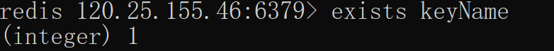
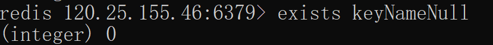
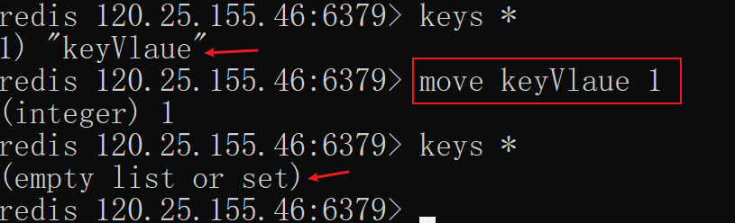
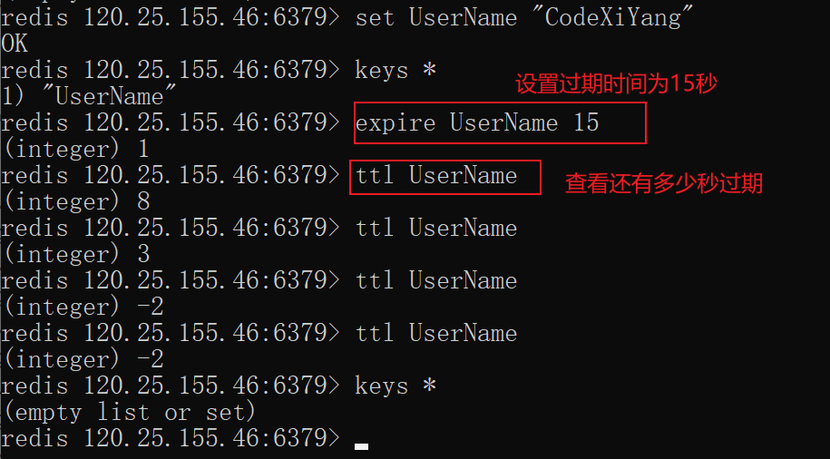
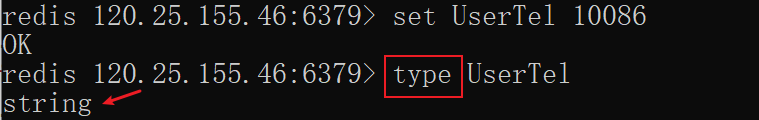

# 五大基本数据类型

## 1. Redis键(key)

### 1.1 set

`set key名 value值` 设置key和key对应的value

```bash
redis 120.25.155.46:6379> set keyUser "codexiyang" # 设置键为keyUser,值为codexiyang的用户名
OK
```

### 1.2 get

`get key` 通过key获取value

```bash

```


### 1.1 *

`key *` 查看所有的key

```bash

```


### 1.2 exists

`exists key名` 判断某个key是否存在

```bash

```






### 1.3 move

`move key名 参数` 移动key,将某个key移动到x号数据库

```bash

```





### 1.4 expire

`expire key名 秒钟 ` 给key设置生存时间, 当 key 过期时(生存时间为 0 )，它会被自动删除。

```bash

```


### 1.5 查看key还有多少时间过期

`ttl key名` -1 表示永不过期，-2 表示已过期 

```bash

```




### 1.6 type

type key名 查看key的数据类型

```bash

```




### 1.7 del

`del key` 移除某个key

```bash

```


## 2. 五大数据类型

### 2.1 String (单值单Value)

#### 2.1.1 append

`APPEND key名` 添加到某个key中,返回字符串的长度;如果key不存在就会直接创建

```bash

```


#### 2.1.2 starlen

starlen key名 根据键名获取值的长度

```bash

```


#### 2.1.3 incr 丶 decr 丶 incrby丶decrby

incr key名   一般用作浏览量,每次访问就执行一次这个就自动加1

decr key名   相反就是减1

incrby key名 x 执行一次增加x个(步长)

decrby key名 x 执行一次减少x个(步长)

```bash

```


#### 2.1.4  range

getrange key名 0,4 截取0-4的字符串

getrange key名 0,-1 截取所有字符串,和get key名是一样的

setrange key名 1 xx 从第一位开始,将后面的全部都修改为xx

```bash

```


#### 2.1.5 setex丶setnx

setex(set width exprice) 设置过期时间

setnx(set if not exist) 不存在设置(在分布式锁中会常用)

```bash

```


#### 2.1.6 mset 丶mget丶msetnx

mset k1 v1 k2 v2 k3 v3 批量设置值

mget k1 k2 k3 批量获取值

msetnx k1 v1 k2 v2 原子性操作,k1 k2必须都成功才能成功

```bash

```


#### 2.1.7 getset 

getset key名 value1  如果不存在值返回null,如果存在值,则获取原来的值并设置新的值

```bash

```


### 2.2 List

> 在redis里面,可以使用list实现栈,堆,阻塞队列
>
> - 栈:  先进后出(米桶)
> - 队列: 先进先出 (水管)


#### 2.2.1 Lpush 丶Rpush

将一个值或多个值,插入到列表的头部(从左边放入)

Lpush list名 list键名 添加到list中

将一个值或多个值,插入到列表的头部(从右边边放入)

Rpush list名 

```bash

```


#### 2.2.2 Lrange丶Rrange

LRANGE list名 -1 获取list中的所有

LRANGE list名 0 1 获取list中0到1的值(倒着来的)

```bash

```


#### 2.2.3 Lpop丶Rpop

Lpop list名 移除第一个元素

Rpop list名 移除最后一个元素

```bash

```


#### 2.2.4 Lindex

 Lindex list名 1 获取list中索引是1的值

```bash

```


#### 2.2.5 Llen

Llen list名 获取list中的长度

```bash

```


#### 2.2.6 Lrem

Lrem list名 1 A 移除一个(多个)指定的值

```bash

```


#### 2.2.7 Ltrim

Ltrim list名 1 2 截断1到2的两个

```bash

```


#### 2.2.8 RpopLpush

RpopLpush 移除列表中的最后一个元素,并将他移动到新的列表中

```bash

```


#### 2.2.9 Lset 

将列表中指定下的值替换为另外一个值,相当于更新的操作

```bash

```


#### 2.2.10 Linsert

Linsert key名 before 往前插入一个值

Linsert key名 after 往后插入一个值

```bash

```


#### 2.2.11 list小结


### 2.3 set

#### 2.3.1 Sadd

sadd set名 value 往set里面添加值

```bash

```


#### 2.3.2 Sismember

Sismember set名 值 判断指定set下面有没有指定的值

```bash

```


#### 2.3.4 Scard 

Scard set名 获取指定set集合下面的元素个数

```bash

```


#### 2.3.5 Srem

移除set中的指定元素

```bash

```


#### 2.3.6 Smembers 

获取set中的所有元素

```bash

```


#### 2.3.7 Srandmember

Srandmember 随机抽取set中的元素

```bash

```


#### 2.3.8 Spop

随机删除一个set集合中的元素

```bash

```


#### 2.3.9 Smove

将一个指定的值移动到另外一个set集合中

```bash

```


#### 2.3.10 Sdiff丶Sinter丶Sunion

差集

交集

并集

```bash

```


### 2.4 Hash

#### 2.4.1 Hset

Hset hash名 字段 值  设置

```bash

```


#### 2.4.2 Hget

Hget 字段 获取

```bash

```


#### 2.4.3 Hmset

Hmset hash名 字段1 值1 字段2 值2 设置多个

```bash

```


#### 2.4.4 Hmget丶Hgetall

Hmget 同时获取多个

Hgetall 获取所有

```bash

```


#### 2.4.5 Hdel

Hdel hash名 字段  删除指定的key字段,对应的value值也就被删除了

```bash

```


#### 2.4.6 Hlen

Hlen hash名 获取Hash表的字段数量(长度)

```bash

```


#### 2.4.7 Hexists

Hexists hash名 字段 判断hash中的某个指定字段是否存在

```bash

```


#### 2.4.8 Hkeys 丶Hvalues

Hkeys hash名 只获得所有的key

Hvalues hash名 只获得所有的value

```bash

```


#### 2.4.9 Hincrby 丶 Hdecby

```bash

```


#### 2.4.10 Hsetnx

如果不存在可以创建赋值,如果不存在无法赋值

```bash

```


### 2.5 Zset (有序集合)

> 在set的基础上,增加了一个值


#### 2.5.1 Zadd 

一次添加一个

一次添加多个

```bash

```


#### 2.5.2 Zrange 

```bash

```


#### 2.5.3 Zrangebyscore

```bash

```


#### 2.5.4 Zrem

```bash

```


#### 2.5.5 Zcard

```bash

```


#### 2.5.6 Zcount

```bash

```


#### 2.5.7 Zrank

```bash

```


#### 2.5.8 Zrevrank

```bash

```


