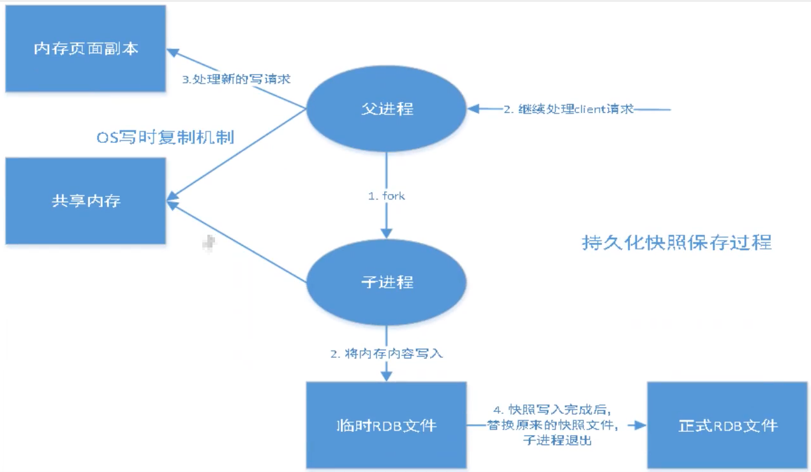

# Redis的持久化

## 1. Redis持久化概念

- Redis是内存数据库,数据是存到内存中的,如果不将内存中的数据保存到磁盘中去,那么一旦出现进程退出,服务器中的数据库状态也会消失.所以Redis提供了持久化功能
- Redis实现持久化是通过RDB和AOF实现的

## 2. RDB(Readis DataBase)

### 2.1 什么是RDB

在指定的时间间隔将内存中的数据集快照写入到磁盘中(Snapshot快照),它恢复时是将快照文件直接读到内存里面的

### 2.2 RDB操作原理

Redis会单独创建(fork) 一个子进程来进行持久化,会将数据写入到一个临时文件中,待持久化过程都结束了,再用这个临时文件替换上次持久化好的文件.整个过程中,主进程是不进行任何IO操作的,这就确保了极高的性能,如果需要进行大规模的数据恢复,且对于数据恢复的完整性不是非常敏感,那RDB方式要比AOF方式更加的高效.**RDB的缺点**是最后一次持久化后的数据可能丢失.**Redis配置中默认的就是RDB**,一般情况下不需要修改这个配置

RDB保存的正式文件是dump.rdb

## 3. AOF

​																																																																																	