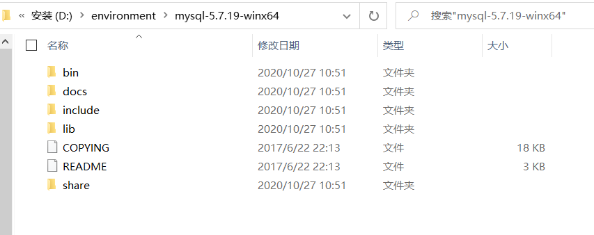
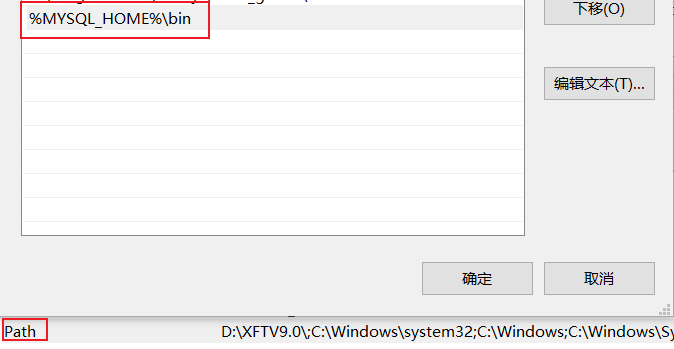
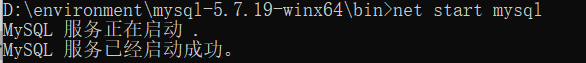
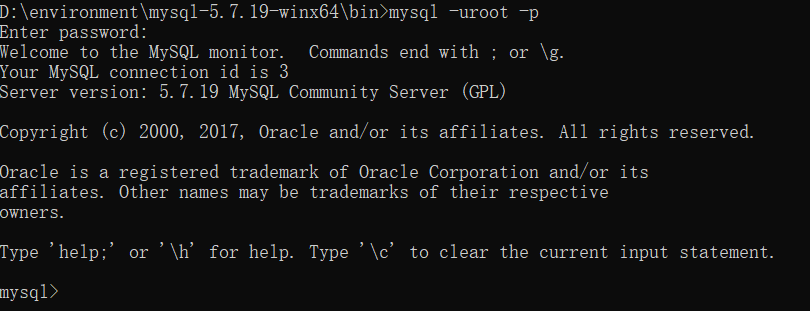
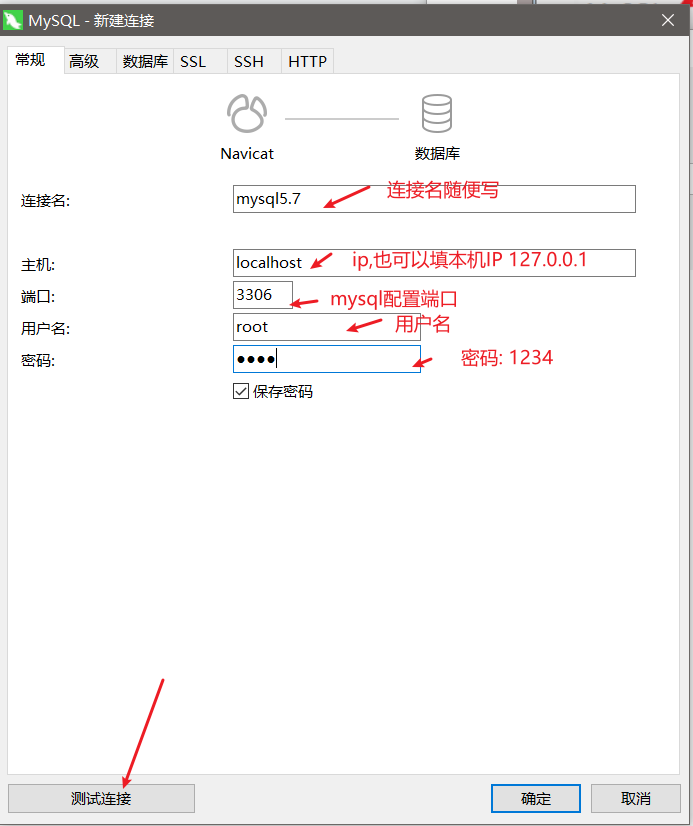
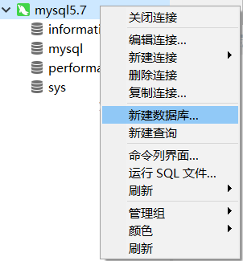

# 初识MySQL

**JavaEE：** 企业级Java开发Web

**前端:** 页面,用于展示数据

**后台:** 连接点,连接数据库例如:JDBC,mybatis，用于链接前端（控制，控制视图跳转，和给前端传递数据））

**数据库:** 用于存数据;存数据的其他方式: Txt，Excel，word

> **计算机科普:** 只会写代码的是码农；学好数据库，基本能混口饭吃；在此基础上再学好<u>操作系统</u>和<u>计算机网络</u>，就能当一个不错的程序员。如果能再把<u>离散数学</u>、<u>数字电路</u>、<u>体系结构</u>、<u>数据结构/算法</u>、<u>编译原理</u>学通透，再加上丰富的实践经验与领域特定知识，就能算是一个优秀的工程师了。

## 1. 为什么学习数据库

1、岗位技能需求

2、现在的世界，得数据者得天下

3、存储数据的方法

4、程序，网站中，大量数据如何长久保存？

5、**数据库是几乎软件体系中最核心的一个存在** DBA(数据库管理员)。

## 2. 什么是数据库

数据库（DataBase，简称DB）

**概念:** 长期存放在计算机内，有组织，可共享的大量数据的集合，是一个数据“仓库”
**作用:** 保存，并能安全管理数据（如：增删改查等），减少冗余.…
**数据库总览:**

- <u>关系型数据库</u>（SQL）
  - MySQL，Oracle，SQL Server，SQLite，DB2，.…
  - 关系型数据库通过外键关联来建立表与表之间的关系
- <u>非关系型数据库</u>（NOSQL）Not only SQL
  - Redis，MongoDB，…
  - 非关系型数据库通常指数据以对象的形式存储在数据库中，而对象之间的关系通过每个对象自身的属性来决定 

## 3. 什么是DBMS

数据库管理系统（**D**ata**B**ase **M**anagement **S**ystem）
数据库管理软件，科学组织和存储数据，高效地获取和维护数据,MySQL应该算是一个数据库管理系统


## 4. MySQL简介

**概念：**是现在流行的开源的，免费的关系型数据库

**历史：**由瑞典MySQL AB公司开发，目前属于Oracle 旗下产品。

**特点：**

- 免费，开源数据库
- 小巧，功能齐全
- 使用便捷
- 可运行于Windows或Linux操作系统
- 可适用于中小型甚至大型网站应用

**官网：**https://www.mysql.com/

## 5. Windows安装MySQL5.7绿色版

建议使用压缩版，安装快，方便.不复杂.建议不要使用exe版本,卸载时不方便

### 5.1 软件下载

mysql5.7 64位下载地址: https://dev.mysql.com/get/Downloads/MySQL-5.7/mysql-5.7.19-winx64.zip

### 5.2 安装步骤

1. 下载后得到zip压缩包. 

2. 解压到自己想要安装到的目录

   - 例如: 解压到的是D:\environment\mysql-5.7.19
   - 友情提示: 最好将所有的开发环境都装到非系统盘的自建环境文件夹下方便管理

   

3. 添加环境变量：我的电脑->属性->高级->环境变量

   > 在DOS命令行窗口进入 **安装目录****\mysql\bin**
   >
   > 可设置环境变量，设置了环境变量，可以在任意目录打开！

   - 创建`MYSQL_HOME`

     

   - 配置`path` ,配置mysql的bin

     

4. mysql安装目录下新建mysql配置文件my.ini添加如下内容

   ```ini
   # mysqld组表示mysql的服务启动参数配置
   [mysqld] 
   # 基础目录,即mysql的解压目录
   basedir=D:\environment\mysql-5.7.19-winx64
   # 数据目录,这样配置后会自动创建data目录
   datadir=D:\environment\mysql-5.7.19-winx64\data\ 
   # 端口号配置
   port=3306  
   # 跳过权限验证(密码验证)
   skip-grant-tables
   ```

5. 启动**管理员模式下的CMD**，并将路径切换至mysql下的bin目录，然后输入`mysqld –install `(安装mysql服务)  *ps: 删除mysql服务: sc delete mysql*

6. 再输入 `mysqld --initialize-insecure --user=mysql` 初始化数据文件

   

7. 启动mysql服务`net start mysql`

   

   

8. 然后再次启动mysql 然后用命令 mysql –u root –p 进入mysql管理界面（密码为空,直接回车）

   

9. 进入界面后更改root密码

   ```sql
   update mysql.user set authentication_string=password('1234') where user='root' and Host = 'localhost';
   ```

10. 刷新权限

    ```sql
    flush privileges;
    ```

11. 注释掉my.ini文件删除最后一句skip-grant-tables

12. 重启mysql即可正常使用

    ```bash
    # 停止mysql服务
    net stop mysql 
    # 开启mysql服务
    net start mysql
    ```

13. 连接上测试出现以下结果就安装好了

    


## 6. SQLyog

可手动操作,管理MySQL数据库的软件工具

特点 : 简洁 , 易用 , 图形化


*ps: 课程用的是sqlyog,我自己用的是navicate15,操作都差不多 ;[Navicate15安装教程]()*

使用~~SQLyog~~ **Navicate15** 管理工具自己完成以下操作 : 

1. 连接本地MySQL数据库

   

   

   

2. 新建school数据库

   

   

3. 新建一张表student

   

   创建列

   

   插入数据

   

   ```sql
   -- 字段 
   GradeID : int(11) , Primary Key (pk)
   GradeName : varchar(50)
   ```

4. 在历史记录中可以看到相对应的数据库操作的语句 


## 7.  MySQL基本常用命令

```sql
-- 1. 查看MySQL版本
select version();
-- 2. 修改密码
update user set password=password('123456')where user='root'; 
-- 3. 刷新数据库
flush privileges;
-- 4. 显示所有数据库
show databases;
-- 5. 打开某个数据库
use dbname； 
-- 6. 显示数据库mysql中所有的表
show tables; 
-- 7. 显示表mysql数据库中user表的列信息
describe student; 
desc student; -- 简写方式
-- 8. 创建数据库
create database school; 
-- 9. 选择数据库
use databasename; 
-- 10. 退出Mysql
exit; 
-- 11. 寻求帮助
? 命令关键词 ;
-- 12. MySQL的表示注释
-- (sql只有单行注释) 其他编辑器中可以使用 # /**/
```


