> 课程名称: [从零玩转HTML5+CSS3精讲①](https://www.it666.com/my/course/96)
>
> 课程概述:
>
> - html的核心基础
> - css的核心属性
>
> 讲述人:李南江

# HTML核心技术

## 第 1 章: HTML核心技术

### 1.1 基础知识

#### 1.1.1 什么是浏览器

- 浏览器是安装在电脑里面的一个软件， 能够将网页内容呈现给用户查看，并让用户与网页交互的一种软件。 就好比QQ一样都是安装在电脑里面的一个软件， 只不过功能不同而已

- 5款主流的浏览器

  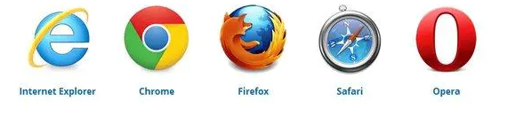

    - [浏览器市场份额-国内统计](https://link.jianshu.com/?t=http%3A%2F%2Ftongji.baidu.com%2Fdata%2Fbrowser)
    - [浏览器市场份额-国外统计](https://link.jianshu.com/?t=http%3A%2F%2Fgs.statcounter.com%2F%23browser-ww-monthly-201507-201607-bar)

- `不同的浏览器`有`不同的浏览器内核`， 浏览器内核也就是浏览器所采用的渲染引擎，渲染引擎决定了浏览器如何显示网页的内容，从而导致了浏览器兼容性问题出现

    - IE内核 `Trident`
    - 谷歌内核 `WebKit / Blink`
    - 火狐内核 `Gecko`
    - Safarri内核 `WebKit`
    - 欧朋内核 `Presto`

*ps: 前期上课以谷歌浏览器为主，后面将专门详细介绍浏览器兼容问题*

#### 1.1.2 什么是服务器

- `服务器也是电脑`，只不过是比我们的电脑`配置更高`的电脑，并且24小时`不断电`，`不关机`的计算机

  

- 服务器是`专门用于存储数据`电脑， 访问者可以`访问服务器`**获得**`服务器上存储的资源`

- 服务器`一旦关机`，访问者就`无法访问`

#### 1.1.3 访问网页原理

##### 浏览器请求数据的原理

我们是如何通过浏览器查看网页上的内容的？以IE为例:查看IE浏览器请求数据的原理

1. 打开IE缓存文件夹`C:\Users\b\AppData\Local\Microsoft\Windows\INetCache`

   ps:[不知道如何打开IE缓存文件夹的点这里](https://jingyan.baidu.com/article/c85b7a64b03182003bac9592.html)

2. 清空该文件夹

3. 用IE打开任意一个网页

4. 发现文件夹下多了很多文件（.html、.css、.js、.png等）， 仔细观察不难发现其实这些文件都是被访问网页上的内容

   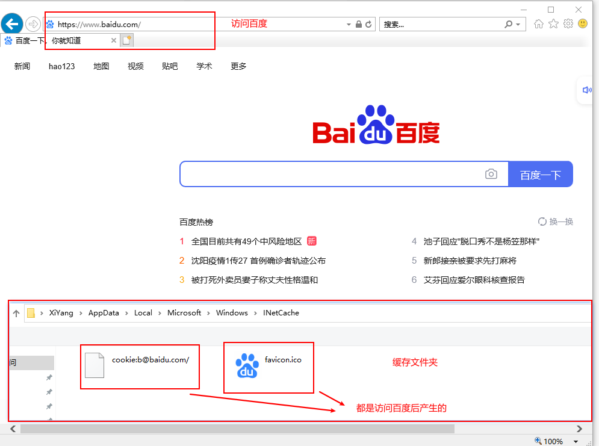

5. 实验结论

    - 访问网页时是有`真实的、物理的文件传输的`
    - 网页`不是一个文件`，而是`一堆文件`组成的
    - 我们之所以平常感觉第二次访问比第一次访问快的原因就是，第一次访问时已经将所有文件`缓存`到了本地;就减少了对资源文件的请求

##### 浏览器请求数据的过程

1. 按下回车时浏览器根据输入的URL地址发送`请求报文`
2. 服务器接收到请求报文，会对`请求报文`进行处理
3. 服务器将处理完的结果通过`响应报文`返回给浏览器
4. 浏览器`解析服务器返回的结果`，将结果显示出来

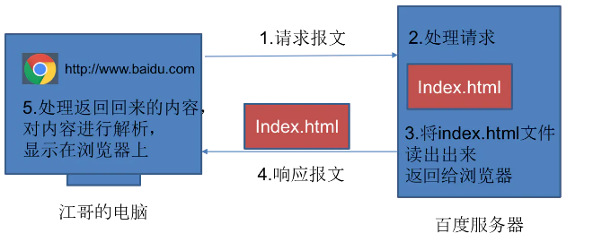

#### 1.1.4 什么是RUL

- URL全称Uniform Resource Locator(统一资源定位符)， 互联网上的每一个资源都有一个唯一的URL地址

- 由于IP地址全都是数字， 没有任何的含义，比较难以记忆。 所以在访问网页时最常见的不是IP地址而是“域名”（一串有含义的字母OR数字）

- 好比： [http://www.baidu.com](https://link.jianshu.com?t=http%3A%2F%2Fwww.baidu.com) AND  http://111.13.100.92:80/

##### 拆分URL

```
http://127.0.0.1:80/index.html
    http://URL协议类型
    127.0.0.1 服务器P地址
    :80服务器的端口号
	index.html -->需要访问的资源名称
```

**ip地址:**  IP地址它相当于我们现实生活中的地址 ; 例如：广州市天河区棠安苑

**端口号**: 端口号它相当于我们现实生活中的门牌号码 ; 例如：9栋909室

那么我们发现只要将地址和门牌号码结合在一起就可以得到一个详细地址广州市天河区棠安苑9栋909室
那么只要我们拿到了一个详细地址，是不是就可以根据这个地址找到对应的位置所以服务器ip地址和端口好的作用就是告诉浏览器我们需要访问的那台服务器的详细地址是什么

**index.html作用** : 当我们通过IP地址和端口号找到对应的服务器之后，需要通过资源名称告诉服务器，我们需要获取服务器上的哪个资源

#### 1.1.5 HTTP协议

1. HTTP是Hypertext Transfer Protocol的缩写, 超文本传输协议
2. 什么是协议?
    - 在现实生活中有很多的协议, 例如租房协议/买卖协议/离婚协议
    - 无论是什么协议他们都是一个共同点, 就是用来规范/约束某一类事物
3. 沟通问题?
    - 沟通最常见的问题就是语言不通, 例如中国人和美国人沟通, 一个人说中文, 一个人说英文, 如果两个人都不懂中文或者英文, 那么就会出现沟通问题
    - 如果要想解决沟通文件, 是不是需要先拟定规定, 两个人都说中文, 或者两个人都说英文, 或者请一个既懂中文又懂英文的翻译
4. HTTP协议是用来规范/约束哪一类事物?
    - 浏览器访问网页其实就是去服务器请求数据, 所以浏览器需要和服务器沟通, 所以也会存在沟通问题
    - HTTP协议就相当于我们让两个人都说中文或者都说英文一样, 就是提前规范两个人之间如何沟通, 也就是规范/约束浏览器和服务器之间如何沟通

#### 1.1.6 其他知识储备

1. 在Windows系统中如何查看文件的扩展名

    - 默认情况下Windows系统是不显示文件的扩展名的, 但是作为一个开发者而言, 查看文件的扩展名是我们的必备技能
    - win10: 随便打开一个文件夹-->点击查看-->将文件扩展名的选项勾选上

   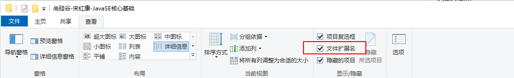

2. 电脑上的一个文件是可以"同时"被多个软件打开的, 不同的软件打开可能会有不同的效果

    - 例如: 同一个index.html文件可以被多个浏览器和记事本一起打开
    - 例如: .html文件通过浏览器打开不可以编辑, 通过记事本打开可以编辑

3. 什么是纯文本文件?

    - 我们Windows电脑上有一款默认安装好的软件叫做记事本. 这款软件就是专门用来打开纯文本文件的, 所以只要`能够被记事本打开, 并且能够正常显示`的文件都是`纯文本文件`
    - `.html的文件可以被记事本打开`, 并且能够正常显示,`所以.html文件是一个纯文本文件`

### 1.2 认识HTML

#### 1.2.1 什么是HTML

HTML其实是HyperText Markup Language的缩写, 超文本标记语言

#### 1.2.1 HTML作用

1. 首先利用记事本保存了一个标题和两段描述, 然后修改纯文本文件的扩展名为.html, 然后再利用浏览器打开

   ```html
   <!DOCTYPE html>
   <html lang="en">
   <head>
       <meta charset="UTF-8">
       <title>Title</title>
   </head>
   <body>
   郑伊健
   
   郑伊健，1967年10月4日出生于中国香港，籍贯广东恩平，香港影视演员、流行男歌手。1988年参加新秀歌唱大赛加入无线电视，因拍摄“阳光柠檬茶”广告而入行，拜罗文为师。[1]
   
   1991年加盟BMG唱片公司以歌手身份出道。1995年开始，凭借在《古惑仔》系列电影中饰演陈浩南一角走红。1996年凭借《古惑仔》主题曲《友情岁月》获得十大中文金曲奖。1996年至1997年连续两次获得”台湾十大偶像”奖。
   </body>
   </html>
   ```


2. 打开之后发现显示的格式不对, 不对的原因是因为在纯文本文件中所有文字都是同级别的, 浏览器不知道哪些文字代表什么意思. 也就是浏览器不知道哪些文字是标题, 哪些文字是段落...., 所以导致了显示的格式不正确

   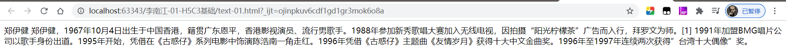

3. 正是因为如此, 所以HTML应用而生. HTML就只有一个作用, **`它是专门用来描述文本的语义的`**. 也就是说我们可以利用HTML来告诉浏览器哪些是标题, 哪些是段落.

    - 这些用于描述其它文本语义的文本, 我们称之为`标签`. 并且这些用于描述文本语义的标签将来在浏览器中是`不会被显示出来`的
    - 所以正是因为HTML的这些标签是专门用来描述其它文本语义的, 并且在浏览器中不会被显示出来, 所以我们称这些文本为`"超文本"`, 而这些文本又叫做`标签`, 所以HTML被称之为`"超文本标记语言"`

   ```html
   <h1>郑伊健</h1>
   
   <p>郑伊健，1967年10月4日出生于中国香港，籍贯广东恩平，香港影视演员、流行男歌手。1988年参加新秀歌唱大赛加入无线电视，因拍摄“阳光柠檬茶”广告而入行，拜罗文为师。[1] </p>
   
   <p>1991年加盟BMG唱片公司以歌手身份出道。1995年开始，凭借在《古惑仔》系列电影中饰演陈浩南一角走红。1996年凭借《古惑仔》主题曲《友情岁月》获得十大中文金曲奖。1996年至1997年连续两次获得”台湾十大偶像”奖。</p>
   ```

   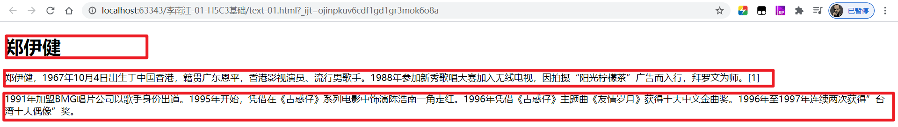

   **注意事项:**

    1. 虽然我们利用H1标签描述一段文本之后, 这段文本在浏览器中显示出来会被放大和加粗, 看上去我们是利用HTML的标签修改了被描述的那段文本的样式. 但是一定要记住, `HTML只有一个作用`, 它是专门用来给文本`添加语义`的,
       而不是用来修改文本的样式的
    2. H1标签它的作用是什么?
        - 错误: H1标签可以用来修改文字的大小, 并且还可以将文字加粗
        - 正确: H1标签的作用是用来告诉浏览器, 哪些文字是标题. 也就是H1标签是专门用于给指定的文字`添加标题语义`的

#### 1.2.2 HTML发展史

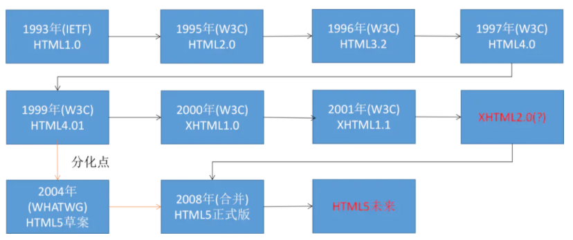

##### IETF简介

- IETF是英文Internet Engineering Task Force的缩写, 翻译过来就是"互联网工程任务组"
- IETF负责定义并管理因特网技术的所有方面。包括用于数据传输的IP协议、让域名与IP地址匹配的域名系统（DNS）、用于发送邮件的简单邮件传输协议（SMTP）等

##### W3C简介

- W3C是英文World Wide Web Consortium的缩写， 翻译过来就是W3C理事会或万维网联盟, W3C是全球互联网最具权威的技术标准化组织.

- W3C于1994年10月在麻省理工学院计算机科学实验室成立。创建者是万维网的发明者Tim Berners-Lee

  Tim
  Berners-Lee（蒂姆·伯纳斯-李），万维网之父、html设计者、w3c创始人 [百度百科](https://link.jianshu.com/?t=https%3A%2F%2Fwww.baidu.com%2Flink%3Furl%3D6FMZkeETBZk2hdslqSIuCQYPNVLhBO54E4vGQStSHJaKdriucEOvAv83PilVXO8TY2-BJYgLEJkNZ2wkJFI5fyKqjHz0cjy8MGXR6Fx-p3xxyiEJZWioAkn6k5CzWxPe1TyuNqB5EZZU77c7gBS9Sq%26wd%3D%26eqid%3D9daa362200041c230000000357a09de2)

- W3C负责web方面标准的制定，像HTML、XHTML、CSS、XML的标准就是由W3C来定制的。

#### 1.2.3 网页固定格式

1. 编写网页和写信一样都有一套规范和要求, 这套规范和要求中规定了写信的固定格式

2. 写信基本结构

   ```
   敬爱的江哥:
         您好!
         正文正文正文正文正文正文正文正文正文正文正文正文
   正文正文正文正文正文正文正文正文正文正文正文正文
         此致
   敬礼!
                                                                 你的朋友 伊健
                                                                 2066年6月6日
   ```

3. 编写网页的步骤:

    - 新建一个文本文档
    - 利用记事本打开
    - 编写THML代码
    - 保存并且修改纯文本文档的扩展名为.html
    - 利用浏览器打开编写好的文件

4. 网页基本结构:

   ```html
   <html>
       <head>
           <title></title>
       </head>
       <body>
       </body>
   </html>
   ```

   通过观察我们发现, HTML基本结构中所有的标签都是成对出现的, 这些成对出现的标签中有一个带`/`有一个不带`/`, 那么这些不带`/`的标签我们称之为开始标签, 这些带/的我们称之为结束标签

   

##### html标签

- 作用: 用于告诉浏览器这是一个网页，也就是说告诉浏览器是一个HTML文档

- 注意点: 其它所有的标签都必须写在html标签里面，也就是写在html开始标签和结束标签中间

##### head标签

- 作用: 用于给网站添加一些配置信息 例如:
    - 指定网站的标题 / 指定网站的小图片
    - 添加网站的SEO相关的信息(指定网站的关键字/指定网站的描述信息)
    - 外挂一些外部的css/js文件
    - 添加一些浏览器适配相关的内容
- 注意点: 一般情况下, 写在head标签内部的内容都<u>不会显示给用户查</u>看, 也就是说一般情况下写在head标签内部的内容我们都看不到

##### body标签

- 作用: 专门用于定义HTML文档中需要显示给用户查看的内容(文字/图片/音频/视频)

- 注意点:

    - 虽然说有时候你可能将内容写到了别的地方在网页中也能看到, 但是千万不要这么干, 一定要将需要显示的内容写在body中
    - 一对html标签中(一个html开始标签和一个html结束标签)只能有一对body标签

##### head内部标签

###### title标签

- 作用: 专门用于指定网站的标题, 并且这个指定的标题将来还会作为用户保存网站的默认标题
- 注意点: title标签必须写在head标签里面

###### meta标签

1. 为什么会有乱码现象?

    - 因为我们在编写网页的时候没有指定字符集

      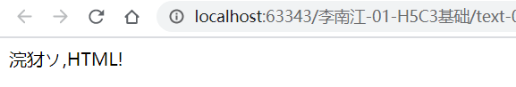

      ```html
      <!DOCTYPE html>
      <html lang="en">
      <head>
          <title>Title</title>
      </head>
      <body>
      你好,HTML!
      </body>
      </html>
      ```

    - 当我们指定字符集后就解决了乱码问题

      ```html
      <!DOCTYPE html>
      <html lang="en">
      <head>
          <meta charset="UTF-8">
          <title>标题</title>
      </head>
      <body>
      你好,HTML!
      </body>
      </html>
      ```

      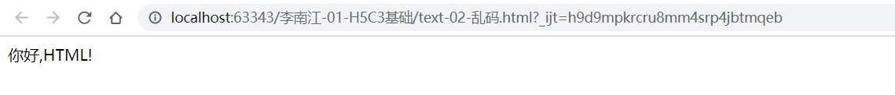

#### 1.2.4 字符集问题

##### 什么是字符集

- 字符集就是字符的集合, 也就是很多字符堆在一起. 其实字符集很像我们古代的"活字印刷术", 在活字印刷术中就是将很多刻有汉字的小章放到一个盒子中, 然后需要印刷文字的时候再去盒子中取这个小章出来用, 正是因为如此, 所以导致了乱码问题
- 假设北方人和南方人都拥有装满小章的盒子, 但是南方人和北方人在盒子中存储小章的顺序不太一样, 那么这个时候如果北方人和南方人都需要去取"李"字, 在南方人记忆中李字在第6个盒子的第6行的第6列中(666),
  在北方人的记忆中李字在第8个盒子的第8行的第8列中(888). 那么此时如果让一个南方人去北方人的盒子中取"李"字的小章, 必然找不到,, 所以就导致了乱码问题
- 这个地方北方人的存储小章的盒子和南方人存储小章的盒子就对应网页中指定的字符集, 在网页中我们常见的字符集有两个GBK/UTF-8, GBK就对应北方人存储的盒子, UTF-8就对应南方人存储的盒子
- 所以在网页中指定字符集的意义就在于告诉浏览器我用的是哪个盒子, 你应该如何去查找才能找到对应的正确的内容

##### GBK(GB2312)和UTF-8区别

- GBK(GB2312)里面存储的字符比较少, 仅仅存储了汉字和一些常用外文; 体积比较小
- UTF-8里面存储的世界上所有的文字; 体积比较大

**那么在企业开发中我们应该使用GBK(GB2312)还是UTF-8呢?**

- 如果你的网站仅仅包含中文, 那么推荐使用GB2312, 因为它的体积更小, 访问速度更快
- 如果你的网站除了中文以外, 还包含了一些其它国家的语言 , 那么推荐使用UTF-8
- 懒人推荐: 不管三七二十一, 一律写UTF-8即可

**注意点:**

- 在HTML文件中指定的字符集必须和保存这个文件的字符集一致, 否则还是会出现乱码

- 所以仅仅指定字符集不一定能解决乱码问题, 还需要保存文件的时候, 文件的保存格式必须和指定的字符集一致才能保证没有乱码问题

  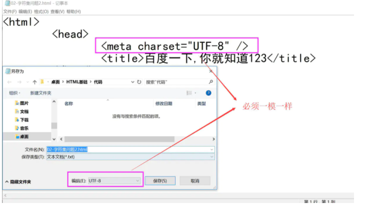

- 所以仅仅指定字符集不一定能解决乱码问题, 还需要保存文件的时候, 文件的保存格式必须和指定的字符集一致才能保证没有乱码问题

#### 1.2.4 标签的分类

**按类别分类**

- 单标签: 只有开始标签没有结束标签, 也就是由一个<>组成的

  ```html
  <meta charset="UTF-8" />
  ```

- 双标签: 有开始标签和结束标签, 也就是由一个<>和一个</>组成的

  ```html
  <html>
  </html>
  ```

**按关系分类**

- 并列关系(兄弟/平级)

  ```html
  <head>
  </head>
  <body>
  </body>
  ```

- 嵌套关系(父子/上下级)

  ```html
  <head>
          <meta charset="UTF-8" />
          <title>百度一下,你就知道123</title>
  </head>
  ```

#### 1.2.6 DTD文档声明

1. 什么是DTD文档声明?

   由于HTML有很多个版本的规范, 每个版本的规范之间又有一定的差异. 所以为了让浏览器能够正确的编译/解析/渲染我们的网页, 我们需要在HTML文件的第一行告诉浏览器, 我们当前这个网页是`用哪一个版本的HTML规范来编写的`.
   浏览器只要知道了我们是用哪一个版本的规范来编写之后, 它就能够正确的编译/解析/渲染我们的网页

2. DTD文档声明格式:

   ```html
   <!DOCTYPE html>
   ```

3. 注意事项:

    - `<!DOCTYPE>声明`必须是 HTML 文档的第一行，位于 <html> 标签之前
    - `<!DOCTYPE> 声明`不是 HTML 标签
    - `<!DOCTYPE> 声明`没有结束标签
    - `<!DOCTYPE> 声明`对大小写不敏感
    - 这个声明浏览器会看, 但是并不是完全依赖于这个声明, 浏览器有一套自己的默认的处理机制
        - 不写也能运行
        - H5网页里面用H4也能运行

4. HTML5`之前`有`2大种规范`, 每种规范中又有`3小种规范`

   | 大规范 |                             小规范 |
      | :----- | ---------------------------------: |
   | HTML   |                    Strict (严格的) |
   | HTML   | Transitional(过度的,普通的,宽松的) |
   | HTML   |           Frameset(带有框架的页面) |
   | XHTML  |                    Strict (严格的) |
   | XHTML  | Transitional(过度的,普通的,宽松的) |
   | XHTML  |           Frameset(带有框架的页面) |

   ```markdown
   ## HTML的DTD文档声明和XHTML的DTD文档声明有何区别?
    	- XHTML本身规定比如标签必须小写、必须严格闭合、必须使用引号引起属性等等, 而HTML会更加松散没有这么严格
   ## Strict表示严格的, 这种模式里面的要求更为严格.这种严格主要体现在有一些标签不能使用
    	- 例如font标签/u标签等
    	- font标签可以修改一个文本的字号、颜色、字体,但这和HTML的本质有冲突,因为HTML只能负责语义,不能负责样式,而font标签是用于修改样式的,所以在Strict中是不能使用font标签
    	- u标签可以给一个文本加上下划线,但这和HTML的本质有冲突,因为HTML只能负责语义,不能负责样式,而u标签是用于添加下划线是样式.所以在Strict中是不能使用u标签
   ## Transitional表示普通的, 这种模式是没有一些别的要求
    	- 例如可以使用font标签、u标签等
    	- 但是在企业开发中不会使用这些标签,因为这违背了HTML的本质, 而是将这些标签作为css的钩子使用
   ## Frameset表示框架, 在框架的页面使用
    	- 后面学到框架/NodeJS 再做详细了解
   ## 常见的DOCTYPE有如下几种
   ​```html
    HTML4.01:
   <!DOCTYPE HTML PUBLIC "-//W3C//DTD HTML 4.01 Transitional//EN"
   "http://www.w3.org/TR/html4/loose.dtd">
   
   XHTML 1.0
   <!DOCTYPE html PUBLIC "-//W3C//DTD XHTML 1.0 Transitional//EN"
   "http://www.w3.org/TR/xhtml1/DTD/xhtml1-transitional.dtd">
   
   HTML5: 
   <!DOCTYPE html>
   ​```
   
   ## 有这么多规范我们学习过程中到底使用哪一种比较合适呢?
   	- 无论是HTML还是XHTML,过去企业级开发中用的比较多的大部分都是Transitional类型的文档声明
   	- 但是HTML5的时代已经到来,以上6中规范仅仅作为了解, 以后都用HTML5类型的文档声明, HTML5向下兼容(求此刻WC3心里阴影面积)
   	- 目前国内一线网站都更新到了HTML5的文档声明, 所以后续授课也是全程使用HTML5的文档声明
   www.baidu.com (B)
   www.taobao.com (A)
   www.qq.com (T)
   www.sohu.com(大奇葩)
   
   ```

#### 1.2.7 HTML-XHTML-XHTML5的区别

1. 在HTML的早期发展中，大部分标准都是所谓的retro-spec，即`先有实现后有标准`。在这种情况下，`HTML标准不是很规范`，`浏览器也对HTML页面中的错误相当宽容`
   。这反过来又导致了HTML开发者写出了`大量含有错误的HTML页面`
2. html语言本身有一些缺陷`（例如： 内容和形式不能分离；标签单一；数据不能复用等等），随着xml的兴起`人们希望xml来弥补html的不足`，但是目前有成千上万的网页都是用html编写的，所以`
   完全使用xml来替代html还为时过早`，于是W3C在2000年推出了xhtml1.0， `建立xhtml的目的就是实现从html向xml的过度
3. `为了规范HTML`，W3C结合XML`制定了XHTML 1.0标准`，这个标准没有增加任何新的标签，只是按照XML的要求来规范HTML，并定义了一个新的MIME type application/xhtml+xml。W3C的`初衷`
   是要求浏览器对这个MIME type`实行强错误检查`，如果页面有HTML错误，就要`显示错误信息`。但是由于已有的web页面中已经有了大量的错误，`很多开发者拒绝使用新的MIME type`。W3C`不得已`，在XHTML
   1.0的标准之后`增加了一个附录C`，`允许`开发者使用XHTML语法来写页面，同时`使用旧的MIME type，application/html`，来分发页面
4. W3C随后`在XHTML 1.1中取消了附录C`，即使用XHTML 1.1标准的页面必须用新的MIME type来分发。`于是这个标准并没有很多人采用`
5. 有了XHTML的教训，W3C在制定下一代HTML标准时（HTML5），就将`向后兼容作为了一个很重要的原则`。HTML5确实引入了许多新的特性，但是`它最重要的一个特性是，不会break已有的网页`
   。你可以将`任何已有的网页的第一行改成<!DOCTYPE html>，它就成也一个HTML5页面`，并且可以照样在浏览器里正常的展示。

**简而言之**

- HTML语法非常宽松容错性强;
- XHTML更为严格,它要求标签必须小写、必须严格闭合、标签中的属性必须使用引号引起等等;
- HTML5是HTML的下一个版本所以除了非常宽松容错性强以外,还增加许多新的特性

**.htm 和 .html扩展名区别**

- DOS操作系统（win95或win98）下**只能支持**`长度为3的后缀名`，所以是htm
- 但在windows后缀长度可以大于3位，所以windows下无所谓htm与html，html是为长文件的格式命名的
- 所以htm是为了兼容过去的DOS命名格式存在的

### 1.3 基础标签

#### 1.3.1 WebStrom安装

[WebStrom下载链接](https://www.jetbrains.com/webstorm/)

[安装参考链接](https://blog.csdn.net/xunciy/article/details/77345663)

#### 1.3.2 H标签和P标签及HR标签

##### H系列标签

作用: 用于给文本添加标题语义

语法格式: `<h1>标题xx</h1>`

注意点:

1. H标签是用来给文本添加标题语义的,而不是用来修改文本样式的
2. H标签一共有6个,从H1~H6,最多只能到6,超过6则无效
3. 被H系列标签报告的内容会独占一行
4. 在H系列的标签中,H1最大,H6最小
5. 在企业开发中，一定要慎用H系列的标等，特别是H1标签.在企业开发中一般情况下一个界面中只能出现一个H1标签（和SEO有关）

##### p标签

作用: 告诉浏览器哪些文字是一个段落

语法格式:  `<p>段落段落</p>`

注意点: 在浏览器中会独占一行

##### HR标签

作用: 在浏览器上显示一条分割线

语法格式: `<hr/>`

注意点:

1. 在浏览器中会独占一行
2. 通过观察发现HR标签可以写/,也可以不写/,如果不写/,那么就是按照HTML的规范来编写,如果写上/那么就是按照XHTML来编写的,但是在HTML5中,由于HTML5是兼容HTML和XHTML所以在HTML5中,结束标签写不写/都可以

##### 测试代码

```html
<!DOCTYPE html>
<html lang="en">
<head>
    <meta charset="UTF-8">
    <title>H系列标签和P标签和Hr标签</title>
</head>
<body>
    <h1>我是标题1</h1>
    <h2>我是标题2</h2>
    <h3>我是标题3</h3>
    <h4>我是标题4</h4>
    <h5>我是标题5</h5>
    <h6>我是标题6</h6>
    <h7>我是标题7</h7>

    我是普通文本

    <hr />
    <hr>

    <p>我是一段文本</p>
    <p>我是一段文本</p>
    
    我是一段普通文本
    我是一段普通文本

</body>
</html>
```

**小练习**

```html
<!DOCTYPE html>
<html lang="en">
<head>
    <meta charset="UTF-8">
    <title>Title</title>
</head>
<body>
<h1>郑伊健</h1>
<hr>
<p>郑伊健，1967年10月4日出生于中国香港，籍贯广东恩平，香港影视演员、流行男歌手。1988年参加新秀歌唱大赛加入无线电视，因拍摄“阳光柠檬茶”广告而入行，拜罗文为师。[1]</p>
<p>1991年加盟BMG唱片公司以歌手身份出道。1995年开始，凭借在《古惑仔》系列电影中饰演陈浩南一角走红。1996年凭借《古惑仔》主题曲《友情岁月》获得十大中文金曲奖。1996年至1997年连续两次获得”台湾十大偶像”奖。[2] 1997年7月主演电影《风云雄霸天下》饰演聂风一角。1997年连续三年获得十大中文金曲十大优秀流行歌手大奖；[3-5] 同年，郑伊健还连续两年获得十大中文金曲全年最高销量歌手奖。[3-4] 1998年在香港红磡体育馆举行8场《22098网上行》演唱会。1999年在红馆主演20场《仲夏夜狂想曲》舞台剧。2001年，凭借《九龙冰室》中的“九纹龙”获得第三十八届电影金马奖最佳男主角提名。[6] 2005年获得“1985年到2005年香港十大最高票房男演员第5名”[7-8] 。2008年凭借电影《第一诫》获得韩国“富川国际电影节”最佳男主角奖。[9] 2009年在红馆举办《郑伊健友情岁月09》个人演唱会。[10] 2011年开始举办《beautiful day2011》世界巡回演唱会。[11] 2012年再次举办《Light and Shadow 2012》世界巡回演唱会。[12-13] 2014年至2016年举办《岁月友情》巡回演唱会 。[14-16] 2015年5月7日郑伊健主演的电影《全力扣杀》于香港上映，香港本土票房过千万。[17]</p>
</body>
</html>
```

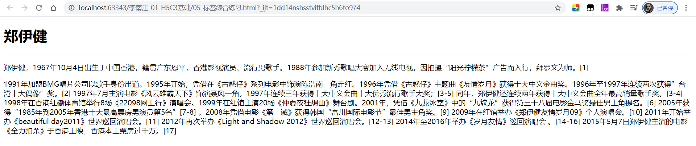

#### 1.3.3 注释 🚩

#### 1.3.4 img标签

#### 1.3.5 br标签

#### 1.3.6 路径问题

#### 1.3.7 a标签

#### 1.3.8 base标签

#### 1.3.9 假链接

#### 1.3.10 锚点

### 1.4 列表标签

```
1.4.1 无序列表
1.4.2 有序列表
1.4.3 定义列表
```

### 1.5 表格标签

```
1.5.1 表格标签基本使用
1.5.2 表格标签的属性
1.5.3 细线表格
1.5.4 表格中的其他标签
```

# CSS核心技术

## 第 2 章: CSS核心技术

### 2.1 体验CSS

### 2.2 CSS属性

### 2.3 CSS选择器

### 2.4 CSS三大特性

### 2.5 CSS显示模式

### 2.6 CSS背景和精灵图

### 2.7 盒模型

### 2.8 浮动

### 2.9 清除浮动

### 2.10 案例-网易实战

### 2.11 定位

### 2.12 过渡模块

### 2.13 2D转换模块

### 2.14 动画模块

### 2.15 3D转换模块

### 2.16 背景相关

# 静态网页实战

## 附: WebStrom快捷键及快捷操作

*这里用于记录WebStrom快捷键的一些操作*

### 文字描述

```
1. 如何在webstorme让光标移动到当前行的末尾 按下键盘上的End键即可
2. 如何在WebStorm中让光标移动到当前行的最前面 按下鍵盘上的Home鍵即可
3. 如何在WebStorm中让光标在多行中闪烁 按住键盘上的Alt键不放，然后再按住鼠标的左鍵不放，然后再拖动鼠标即可
4. 如何在WebStorm中快速的复制光标所在的那一行 按下键盘上的Xtrl+D
5. 如何在WebStrom中快速的删除光标所在的哪一行 按下键盘上的Ctrl+X
6. 如何在WebStorm中让标签包裹一段内容，也就是自动在一段内容前后加上标签  按下键盘上的Ctrl + Alt+T，然后按下回车，然后输入对应的标签即可
```

### 带图设置

1. 代码超过当前编辑区后自动换行设置

   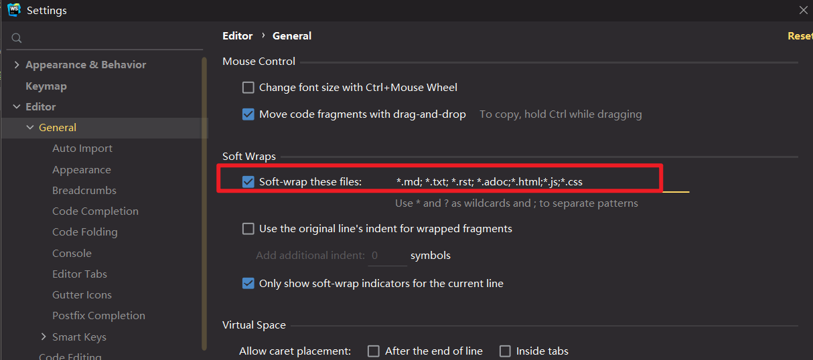

