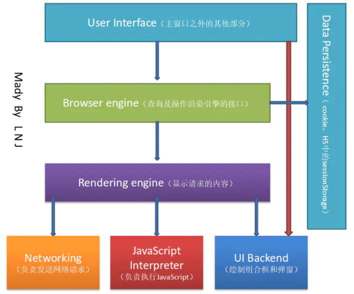
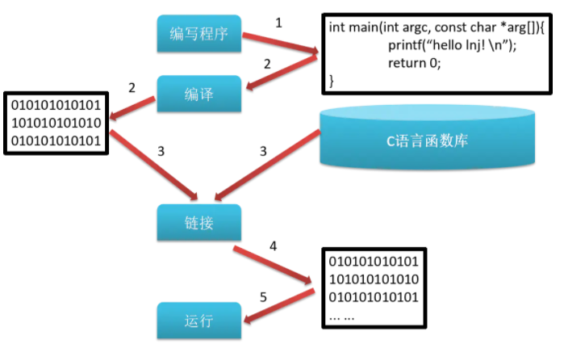
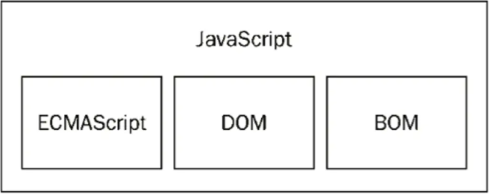
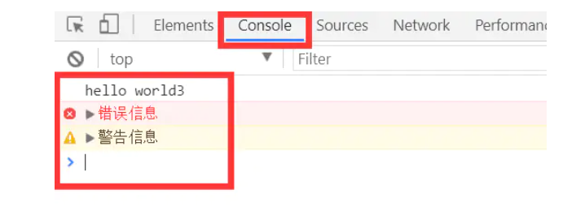

# JavaScript核心+新特性

> 课程名称: [从零玩转JavaScript核心+新特性③](https://www.it666.com/my/course/183)
>
> 课程概述: ECMAScript核心语法, DOM文档对象模型, BOM文档对象模型
>
> 讲述人: 李南江

## 第 1 章: JavaScript开篇

### 1.1 什么是JavaScript

JavaScript简称JS，是前端开发的一门脚本语言(解释型语言)

**解释型语言：**程序执行之前，不需要对代码进行编译，在运行时边解析边执行的语言

[浏览器工作原理](https://www.html5rocks.com/en/tutorials/internals/howbrowserswork/)



**编译型语言：**程序执行之前，需要一个专门的编译过程，把程序编译成机器语言的文件，比如exe文件



### 1.2 JavaScript作用

HTML 提供网页上显示的内容（结构）


CSS 美化网页（样式）


avaScript 控制网页行为（行为）


### 1.3 JavaScript发展史

JavaScript起源于Netscape公司的LiveScript语言

- 1994年网景公司发布历史上第一个比较成熟的浏览器(Navigator 0.9), 但是只能浏览不能***交互\***
- 1995年为了解决表单有效性验证就要与服务器进行多次地往返交互问题，网景公司录用Brendan Eich(布兰登·艾奇)，他在 10 天内开发出 LiveScript 语言
- 在 Netscape Navigator 2.0 即将正式发布前，Netscape 将LiveScript 更名为 JavaScript， 目的是为了蹭Java的热度
- 所以Java和 JavaScript之间的关系就像老婆和老婆饼一样

[参考文献](http://www.w3school.com.cn/js/pro_js_history.asp)


### 1.4 JavaScript组成

**ECMAScript** ：JavaScript的语法标准 *[ECMAScript起源](http://www.w3school.com.cn/js/pro_js_history.asp)*

- ECMA是European Computer Manufacturers Association的缩写，即欧洲计算机制造商协会
- ECMAScript是ECMA制定的脚本语言的标准, 规定了一种脚本语言实现应该包含的基本内容
- JavaScript是脚本语言的一种,所以JavaScript也必须遵守ECMAScript标准,包含ECMAScript标准中规定的基本内容

**DOM(Document Object Model)** ：JavaScript操作网页上的元素(标签)的API

**BOM(Browser Object Model)** ：JavaScript操作浏览器的部分功能的API



## 第 2 章: ECMAScript 🚩

### 2.1 ECMAScript快速入门

#### 2.1.1 书写格式

css书写格式: 

```
1. 行内样式: 写在标签内部
2. 内嵌样式(内联样式) : 写在一对head标签中
3. 外链样式: 写在一个单独的.css文件中, 再导入进来
```

**JavaScript书写格式**

- 行内样式: 写在标签内部

- 内嵌样式(内联样式) : 写在一对head标签中
- 外链样式: 写在一个单独的.js文件中, 再导入进来

##### 行内式格式(不推荐)

```html
<div onclick="alert('hello world');">我是div</div>
```

##### 内嵌式格式

```html
</body>
<!-- ... ... -->
<script type="text/javascript">
       alert("hello world");
</script>
</body>
```

##### 外链式格式

```html
<script type="text/javascript" src="01-js书写格式.js"></script>
```

##### 书写格式注意点

1. 不推荐直接将JavaScript代码书写到标签内部
2. 默认情况下浏览器会从上至下的解析网页, 所以如果将JavaScript写到一对head标签中, 并且需要通过JavaScript代码操作界面上的元素, 那么就不能直接书写JavaScript代码, 否则无效
   - 如果想将JavaScript写到一对head标签中, 并且需要在JavaScript代码中操作界面上的元素, 那么必须加上`window.onload = function(){操作界面元素的JavaScript}`
   - window.onload的含义: 等到界面上所有的内容都加载完毕再执行{}中的代码
   - 由于默认情况下浏览器会从上至下的解析网页, 所以如果想通过JavaScript操作界面上的元素只需要等到元素被加载解析之后操作就可以了, 所以我们还可以将JavaScript代码写到body结束标签的前面
3. 如果通过外链式导入.js文件, 并且需要在.js文件中操作界面上的元素, 那么如果是在head标签中导入的, 必须在.js文件中加上window.onload. 如果是在body结束标签前面导入的, 那么就不用添加window.onload
4. 如果需要在一对script标签中编写JavaScript代码, 那么就不能同时通过script标签再导入其它的.js文件, 否则书写的JavaScript代码无效


#### 2.1.2 常见输出方式

##### 通过弹窗的形式来输出

```javascript
/*
alert(需要输出的内容);
confirm(需要输出的内容);
prompt(需要输出的内容);
*/
alert("hello world");
prompt("请输入内容：");
confirm("你好吗?");
```

**注意点:**

- 如果需要输出的内容不是数字, 那么就必须通过单引号或者双引号括起来
- 在JavaScript中是严格区分大小写的, alert()和ALERT()不是一回事
- 在编写JavaScript代码的时候, 一定要记住每一句代码后面都需要添加一个分号, 并且这个分号必须是英文的分号
- 我们会发现有时候不写分号程序也能够运行, 这里并不是因为不需要分号, 而是浏览器自动帮助我们添加了分号, 浏览器自动添加会消耗一定的性能, 并且有可能会添加错误


##### 页面中显示内容

```javascript
// document.write(需要输出的内容);
document.write("hello world2");
```

注意点: 如果需要输出的内容不是数字, 那么就必须通过单引号或者双引号括起来

##### 通过开发者工具控制台的形式来输出

```javascript
/*
	console.log(需要输出的内容);  // 普通输出
    console.warn(需要输出的内容); // 警告输出
    console.error(需要输出的内容); // 错误输出
*/
console.log("hello world3");
console.error("错误信息");
console.warn("警告信息");
```



注意点: 如果需要输出的内容不是数字, 那么就必须通过单引号或者双引号括起来

#### 2.1.3 常量

##### 什么是常量

- 常量表示一些固定不变的数据
- 现实生活中人的性别其实就可以看做是常量, 生下来是男孩一辈子都是男孩, 生下来是女孩一辈子都是女孩

##### JavaScript中常量的分类

###### 整型常量

整型常量其实就是正数, 在JavaScript中随便写一个整数都是整型常量

```javascript
 1   /   666  /    99
```

###### 实型常量

实型常量其实就是小数, 在JavaScript中随便写一个小数都是实型常量

```javascript
3.14   6.66
```

###### 字符串常量

字符串常量其实就是用单引号或者双引号括起来的内容, 我们就称之为字符串常量

```javascript
'a'
'abc'
"1"
"知播渔教育"
```

注意点: 无论用单引号或者双引号括起来了多少个字符, 在JavaScript中都是字符串常量

###### 布尔常量

布尔常量其实就是真或者假, 在JavaScript中通过true和false来表达

 在JavaScript中布尔常量只有两个取值, 真(true)或者假(false)


###### 自定义常量

在ES6中新增的

`const 常量名称 = 常量取值;`

```javascript
const NUM = 666;
// NUM = 888; //尝试修改NUM这个常量的取值(报错)
console.log(NUM);
```


#### 2.1.4 变量

##### 什么是变量

变量表示一些可以被修改的数据

在现实生活中超市的储物格就是变量, 在不同的时间段里面, 储物格中存储的数据也不一样


##### 如何定义一个变量

在JavaScript中可以通过定义变量的方式来生成储物格, 也就是告诉浏览器, 我们需要一块内存空间

`var 变量名称;`

##### 如何使用变量

使用变量就是往申请的那块内存空间中存储数据, 和获取存储的数据

###### 如何存储数据

`变量名称 = 需要存储的数据;`

可以将等号右边需要存储的数据放到等号左边变量申请的那块存储空间中

###### 如何获取存储在变量中的数据

`变量名称`

```javascript
// 定义一个变量
var num;
// 往变量中存储数据
num = 123;
// 从变量中获取存储的数据
console.log(num);
```

##### 变量的初始化


##### 定义变量的其它格式

##### 初始化变量的其它格式


#### 2.1.5 关键字和保留字

#### 2.1.6 标识符

#### 2.1.7 注释

### 2.2 数据类型

#### 2.2.1 基本数据类型

#### 2.2.2 引用数据类型

### 2.3 数据类型转换

#### 2.3.1 转换为字符串类型

#### 2.3.2 转换为数值类型

#### 2.3.3 转换为布尔类型

### 2.4 运算符

#### 4.1 算数运算符

#### 4.2 赋值运算符

#### 4.3 自增自减运算符

#### 4.4 关系运算符

#### 4.5 逻辑运算符

#### 4.6 逗号运算符

#### 4.7 三目运算符


### 2.5 流程控制

#### 5.1 顺序结构


#### 5.2 选择结构

##### 5.2.1 if

##### 5.2.2 switch

#### 5.3 循环结构

##### 5.3.1 while

##### 5.3.2 dowhile

##### 5.3.3 for


### 2.6 数组

#### 6.1 数组基本使用

#### 6.2 数组遍历

#### 6.3 数组解构赋值

#### 6.4 数组增删改查

#### 6.5 数组常用方法

#### 6.6 二维数组


### 2.7 函数

#### 2.7.1 函数基本使用

#### 2.7.2 函数argments

#### 2.7.3 函数扩展运算符

#### 2.7.4 函数形参默认值

#### 2.7.5 函数作为参数

#### 2.7.6 函数作为返回值

#### 2.7.7 匿名函数

#### 2.7.8 箭头函数

#### 2.7.9 递归函数

#### 2.7.10 函数中变量作用域

#### 2.7.11 作用域链

#### 2.7.12 预解析


### 2.8 面向对象


## 第 3 章: DOM及特效

### 3.1 DOM开篇

## 第 4 章: BOM及特效

### 4.1 BOM开篇


