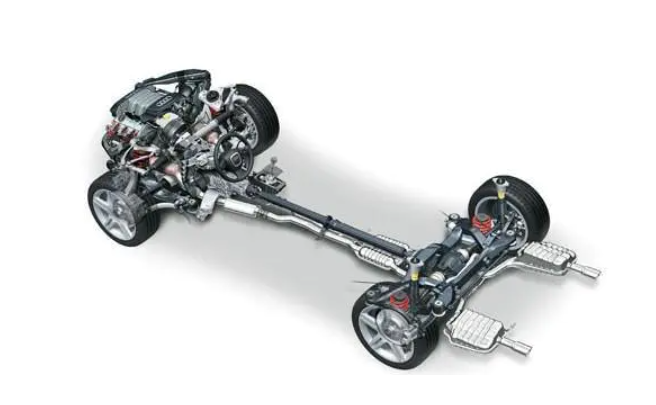

# JavaScript核心+新特性

> 课程名称: [从零玩转JavaScript核心+新特性③](https://www.it666.com/my/course/183)
>
> 课程概述: ECMAScript核心语法, DOM文档对象模型, BOM文档对象模型
>
> 讲述人: 李南江

## 第 1 章: JavaScript开篇

### 1.1 什么是JavaScript

JavaScript简称JS，是前端开发的一门脚本语言(解释型语言)

**解释型语言：**程序执行之前，不需要对代码进行编译，在运行时边解析边执行的语言

[浏览器工作原理](https://www.html5rocks.com/en/tutorials/internals/howbrowserswork/)


**编译型语言：**程序执行之前，需要一个专门的编译过程，把程序编译成机器语言的文件，比如exe文件


### 1.2 JavaScript作用

HTML 提供网页上显示的内容（结构）


CSS 美化网页（样式）


avaScript 控制网页行为（行为）



### 1.3 JavaScript发展史

JavaScript起源于Netscape公司的LiveScript语言

- 1994年网景公司发布历史上第一个比较成熟的浏览器(Navigator 0.9), 但是只能浏览不能***交互\***
- 1995年为了解决表单有效性验证就要与服务器进行多次地往返交互问题，网景公司录用Brendan Eich(布兰登·艾奇)，他在 10 天内开发出 LiveScript 语言
- 在 Netscape Navigator 2.0 即将正式发布前，Netscape 将LiveScript 更名为 JavaScript， 目的是为了蹭Java的热度
- 所以Java和 JavaScript之间的关系就像老婆和老婆饼一样

[参考文献](http://www.w3school.com.cn/js/pro_js_history.asp)


### 1.4 JavaScript组成

**ECMAScript** ：JavaScript的语法标准 *[ECMAScript起源](http://www.w3school.com.cn/js/pro_js_history.asp)*

- ECMA是European Computer Manufacturers Association的缩写，即欧洲计算机制造商协会
- ECMAScript是ECMA制定的脚本语言的标准, 规定了一种脚本语言实现应该包含的基本内容
- JavaScript是脚本语言的一种,所以JavaScript也必须遵守ECMAScript标准,包含ECMAScript标准中规定的基本内容

**DOM(Document Object Model)** ：JavaScript操作网页上的元素(标签)的API

**BOM(Browser Object Model)** ：JavaScript操作浏览器的部分功能的API


## 第 2 章: ECMAScript 

### 2.1 ECMAScript快速入门

#### 2.1.1 书写格式

css书写格式: 

```
1. 行内样式: 写在标签内部
2. 内嵌样式(内联样式) : 写在一对head标签中
3. 外链样式: 写在一个单独的.css文件中, 再导入进来
```

**JavaScript书写格式**

- 行内样式: 写在标签内部

- 内嵌样式(内联样式) : 写在一对head标签中
- 外链样式: 写在一个单独的.js文件中, 再导入进来

##### 行内式格式(不推荐)

```html
<div onclick="alert('hello world');">我是div</div>
```

##### 内嵌式格式

```html
</body>
<!-- ... ... -->
<script type="text/javascript">
       alert("hello world");
</script>
</body>
```

##### 外链式格式

```html
<script type="text/javascript" src="01-js书写格式.js"></script>
```

##### 书写格式注意点

1. 不推荐直接将JavaScript代码书写到标签内部
2. 默认情况下浏览器会从上至下的解析网页, 所以如果将JavaScript写到一对head标签中, 并且需要通过JavaScript代码操作界面上的元素, 那么就不能直接书写JavaScript代码, 否则无效
   - 如果想将JavaScript写到一对head标签中, 并且需要在JavaScript代码中操作界面上的元素, 那么必须加上`window.onload = function(){操作界面元素的JavaScript}`
   - window.onload的含义: 等到界面上所有的内容都加载完毕再执行{}中的代码
   - 由于默认情况下浏览器会从上至下的解析网页, 所以如果想通过JavaScript操作界面上的元素只需要等到元素被加载解析之后操作就可以了, 所以我们还可以将JavaScript代码写到body结束标签的前面
3. 如果通过外链式导入.js文件, 并且需要在.js文件中操作界面上的元素, 那么如果是在head标签中导入的, 必须在.js文件中加上window.onload. 如果是在body结束标签前面导入的, 那么就不用添加window.onload
4. 如果需要在一对script标签中编写JavaScript代码, 那么就不能同时通过script标签再导入其它的.js文件, 否则书写的JavaScript代码无效


#### 2.1.2 常见输出方式

##### 通过弹窗的形式来输出

```javascript
/*
alert(需要输出的内容);
confirm(需要输出的内容);
prompt(需要输出的内容);
*/
alert("hello world");
prompt("请输入内容：");
confirm("你好吗?");
```

**注意点:**

- 如果需要输出的内容不是数字, 那么就必须通过单引号或者双引号括起来
- 在JavaScript中是严格区分大小写的, alert()和ALERT()不是一回事
- 在编写JavaScript代码的时候, 一定要记住每一句代码后面都需要添加一个分号, 并且这个分号必须是英文的分号
- 我们会发现有时候不写分号程序也能够运行, 这里并不是因为不需要分号, 而是浏览器自动帮助我们添加了分号, 浏览器自动添加会消耗一定的性能, 并且有可能会添加错误


##### 页面中显示内容

```javascript
// document.write(需要输出的内容);
document.write("hello world2");
```

注意点: 如果需要输出的内容不是数字, 那么就必须通过单引号或者双引号括起来

##### 通过开发者工具控制台的形式来输出

```javascript
/*
	console.log(需要输出的内容);  // 普通输出
    console.warn(需要输出的内容); // 警告输出
    console.error(需要输出的内容); // 错误输出
*/
console.log("hello world3");
console.error("错误信息");
console.warn("警告信息");
```


注意点: 如果需要输出的内容不是数字, 那么就必须通过单引号或者双引号括起来

#### 2.1.3 常量

##### 什么是常量

- 常量表示一些固定不变的数据
- 现实生活中人的性别其实就可以看做是常量, 生下来是男孩一辈子都是男孩, 生下来是女孩一辈子都是女孩

##### JavaScript中常量的分类

###### 整型常量

整型常量其实就是正数, 在JavaScript中随便写一个整数都是整型常量

```javascript
 1   /   666  /    99
```

###### 实型常量

实型常量其实就是小数, 在JavaScript中随便写一个小数都是实型常量

```javascript
3.14   6.66
```

###### 字符串常量

字符串常量其实就是用单引号或者双引号括起来的内容, 我们就称之为字符串常量

```javascript
'a'
'abc'
"1"
"知播渔教育"
```

注意点: 无论用单引号或者双引号括起来了多少个字符, 在JavaScript中都是字符串常量

###### 布尔常量

布尔常量其实就是真或者假, 在JavaScript中通过true和false来表达

 在JavaScript中布尔常量只有两个取值, 真(true)或者假(false)


###### 自定义常量

在ES6中新增的

`const 常量名称 = 常量取值;`

```javascript
const NUM = 666;
// NUM = 888; //尝试修改NUM这个常量的取值(报错)
console.log(NUM);
```


#### 2.1.4 变量

##### 什么是变量

变量表示一些可以被修改的数据

在现实生活中超市的储物格就是变量, 在不同的时间段里面, 储物格中存储的数据也不一样


##### 如何定义一个变量

在JavaScript中可以通过定义变量的方式来生成储物格, 也就是告诉浏览器, 我们需要一块内存空间

`var 变量名称;`

##### 如何使用变量

使用变量就是往申请的那块内存空间中存储数据, 和获取存储的数据

###### 如何存储数据

`变量名称 = 需要存储的数据;`

可以将等号右边需要存储的数据放到等号左边变量申请的那块存储空间中

###### 如何获取存储在变量中的数据

`变量名称`

###### 如何修改变量中存储的数据

在JavaScript中想要修改变量中存储的数据, 只需要再次给变量直接赋值即可

```javascript
// 定义一个变量
var num;
// 往变量中存储数据
num = 123;
// 从变量中获取存储的数据
console.log(num);
// 修改num的值
num = 666;
console.log(num);
```


##### 变量的初始化

在JavaScript中第一次给变量赋值, 我们称之为"变量的初始化"

```javascript
var num;
num = 321; // "变量的初始化"
num = 888; // 不是"变量的初始化"
```

如果一个变量没有进行初始化, 那么变量中存储的是什么呢? 在JavaScript中如果定义了一个变量,但是没有进行初始化, 那么变量中存储的是undefined

```javascript
var num;
console.log(num);
```

给变量初始化有很多种形式

- 先定义变量, 再对变量进行初始化

  ```javascript
  var num;
  num = 321; // 先定义再初始化
  ```

- 可以在定义变量的同时对变量进行初始化

  ```javascript
  var value = 666; // 定义的同时初始化
  ```

##### 定义变量的其它格式

- 同时定义多个变量的格式

  ```javascript
  //格式: var 变量名称1, 变量名称2, .... ;
  // var num;
  // var value;
  var num, value; // 同时定义两个变量
  var num, value, value2, value3; // 同时定义四个变量
  ```

  

##### 初始化变量的其它格式

如果在企业开发中对多个变量初始化的值都是一样的, 那么我们可以通过`变量名称1 = 变量名称2 = 变量名称... = 初始化值;`

```javascript
var num;
var value;
// num = 123;
// value = 123;
num = value = 123; // 同时对num和value进行初始化, num和value中存储的数据都是123
console.log(num);
console.log(value);
```

定义多个变量的同时给多个变量分别初始化

```javascript
// var num, value;
// num = 123;
// value = 666;
var num = 123, value = 666;
console.log(num);
console.log(value);
```

##### 变量的注意点

1. 在JavaScript中变量之间是可以相互赋值的

   ```javascript
   var num;
   var value;
   num = 123;
   value = num; // 将Num中的值拷贝一份给value
   console.log(num);
   console.log(value);
   ```

2. 在JavaScript中如果定义了同名的变量, 那么后定义的变量会覆盖先定义的变量

   ```javascript
   var num = 666;
   // num = 888; // 如果num前面没有var, 那么就是修改变量中存储的值
   var num = 888;// 如果num前面有var, 那么就不是修改变量中存储的值, 而是重新定义一个新的变量
   console.log(num);
   ```

3. 在老版本的标准的(ES6之前)JavaScript中可以先使用变量, 再定义变量, 并不会报错
   由于JavaScript是一门解释型的语言, 会边解析边执行, 浏览器在解析JavaScript代码之前还会进行一个操作"预解析(预处理)"
   预解析(预处理)步骤:
   将当前JavaScript代码中所有变量的定义和函数的定义放到所有代码的最前面

   ```javascript
   console.log(num);
   var num = 123;
   /*
   预处理之后的代码
   var num;
   console.log(num); // undefined
   num = 123;
   */
   ```

##### ES6定义变量

为了解决老板标准的的两个注意点

- 在JavaScript中如果定义了同名的变量, 那么后定义的变量会覆盖先定义的变量
- 在老版本的标准的(ES6之前)JavaScript中可以先使用变量, 再定义变量, 并不会报错

在ES6中就推出了一种新的定义变量的方式

```javascript
// ES6前后定义变量的语法格式如下
var 变量名称; //ES6之前
let 变量名称; //ES6开始
```

ES6变量使用方式

```javascript
// 定义一个变量
let num;
// 给变量初始化
num = 666;
// 取出存储的数据
console.log(num);
// 修改变量中存储的数据
num = 888;
// 取出存储的数据
console.log(num);
```

ES6定义变量解决了ES6之前存在的两个问题

```javascript
// var num = 123;
// var num = 888;
let num = 123;
let num = 888; //会明确的报错
console.log(num);
```

```javascript
// console.log(num);
// var num = 123;
```


#### 2.1.5 关键字和保留字

什么是关键字？

- 被JavaScript语言赋予了特殊含义的单词

- 关键字在开发工具中会显示特殊颜色

  ```javascript
  var num;
  let num;
  ```

- 关键字不能用作变量名、函数名等

  ```javascript
  var num = 666;
  console.log(num);
  
  var break = 888; //break是关键字,定义变量会报错
  console.log(break); 
  ```

- 关键字严格区分大小写, var和Var前者是关键字, 后者不是

  ```javascript
  var num = 123;
  console.log(num);
  VAR value = 666; //VAR不可定义变量
  console.log(value);
  //只需要记住一点: 在JavaScript中所有的关键字都是小写的
  ```

保留字: 

- 使用特点和关键字都差不多,只是保留下来的可能作为关键字使用

#### 2.1.6 标识符

**什么是标识符?** 用于标识变量函数名称的

标识符命名规则(必须遵守)

- 只能由26个英文字母的大小写、10个阿拉伯数字0~9、下划线_、美元符号$组成

  ```javascript
  var abc123_$ = 678;
  console.log(abc123_$);
  
  var abc#123 = 666; //报错
  console.log(abc#123);
  
  var abc123 = 888;
  console.log(abc123);
  ```

- 不能以数字开头

  ```javascript
  var 123abc = 888; //报错
  console.log(123abc);
  ```

- 严格区分大小写，比如test和Test是2个不同的标识符

  ```javascript
  /*涨停, 张婷*/
  var test = 123;
  var tEst = 321;
  console.log(test);
  console.log(tEst);
  ```

- 不可以使用关键字、保留字作为标识符

  ```javascript
  let fjdsklfjslk = "lnj";
  let name = "lnj"; //报错 name在javascript中是关键字
  let lastname = "Lee";
  let lastName = "Lee";
  ```

- 可以使用中文,但是没人会这么去干!

  ```javascript
  let 哈哈_text = "abc";
  console.log(哈哈_text);
  ```

  

#### 2.1.7 注释

**什么是JS的注释?** 和HTML/CSS的注释一样, 都是用来注解解释某一段程序的含义的, 都是用来提升代码的阅读性的, 都是为了方便程序员之间沟通的

**JS注释的格式**

- 单行注释: `// 被注释的内容`

  注意点: 单行注释的有效范围是从第二个斜杠开始一直直到这一行的末尾, 也就是被注释的内容不能换行

- 多行注释: `/* 被注释的内容 */` 

  多行注释的有效范围是从第一颗`*`开始直到第二颗`*`结束, 也就是说被注释的内容可以换行的

**JS中注释的嵌套规则**

- 单行注释可以嵌套单行注释, 但是必须在一行

  ```javascript
  // 被注释的内容   // 被注释的内容
  ```

- 单行注释可以嵌套多行注释, 但是必须在一行

  ```javascript
   // 被注释的内容 /* 被注释的内容 */
  ```

- 多行注释可以嵌套单行注释

  ```javascript
  /*
  被注释的内容
  // 被注释的内容
  */
  ```

- 多行注释不可以嵌套多行注释

  ```javascript
  /*
  被注释的内容
  /*
  */
  */
  ```

  

### 2.2 数据类型

#### typeof

在JavaScript中为了方便我们检测某一种数据是属于哪一种数据类型的, JavaScript提供了一个名称叫做typeof的操作符

格式: `typeof 需要检测的数据;`

#### 基本数据类型

*javascript中的基本数据类型有5种: Number,String,Boolean,Undefined,NUll*

**Number 数值类型** 在JavaScript中无论是整数还是小数都是属于数值类型的

```javascript
let num = 42;
let num1 = 21.2;

// 利用typeof检测123这个常量是属于哪一种数据类型的, 并且将检测的结果保存到res这个变量中
// let res = typeof 123;
let res = typeof 3.14;
console.log(res);
```

**String 字符串类型** 在JavaScript中无论是通过单引号还是通过双引号括起来的内容都是属于字符串类型的

```javascript
let str = "hello";
let str1 = 'hello';

// let res = typeof 'abc';
let res = typeof "def";
console.log(res);
```

**Boolean 布尔类型** 在JavaScript中布尔类型比较特殊, 只有两个取值true/false

```javascript
let flag = true;
let falg1 = false;

// let res = typeof true;
let res = typeof false;
console.log(res);
```

**Undefined 未定义类型** 在JavaScript中未定义类型比较特殊, 只有一个取值undefined

```javascript
let num;
// 以下代码的含义是输出num变量中保存的数据
// 由于没有给num这个变量进行初始化, 所以这个变量中保存的数据默认是undefined
console.log(num);
// 利用typeof检查num中保存的数据是什么类型的
// 也就是说利用typeof检查undefined是属于什么类型的
let res = typeof num;
console.log(res);
```

**Null 空类型**

```javascript
let n = null;
```


#### 引用数据类型

Object 对象类型

#### 数据类型和常量的关系

猫科动物和狮子老虎豹子的关系

- 今天学习的数据类型就是猫科动物
- 前面学习的常量就是狮子老虎豹子


### 2.3 数据类型转换

javascript中的数据类型可以通过不同的手段来进行相互转换的

#### 转换为字符串类型

将`Number,Boolean,undefined,null`类型转换为字符串类型
在JavaScript中如果想将以上的四种基本数据类型转换为字符串类型, 常用的方法有三种

1. 对于Number类型和Boolean类型来说, 可以通过 `变量名称.toString()`的方式来转换

   ```javascript
   let value = 123;
   console.log(value); // 在谷歌浏览器的控制台中如果是Number类型是蓝色的
   console.log(typeof value);
   // 以下代码的含义: 将value变量中存储的数据拷贝一份, 然后将拷贝的数据转换为字符串之后返回
   let str = value.toString();
   console.log(str); // 在谷歌浏览器的控制台中如果是String类型是灰色的
   console.log(typeof str);
   // 注意点: 变量名称.toString是对拷贝的数据进行转换, 所以不会影响到原有的数据
   console.log(value);
   console.log(typeof value);
   // 注意点: 不能使用常量直接调用toString方法, 因为常量是不能改变的
   let str2 = 123.toString();
   ```

   ```javascript
   let value = true;
   console.log(value);
   console.log(typeof value);
   let str = value.toString();
   console.log(str);
   console.log(typeof str);
   ```

2. 可以通过String(常量or变量);转换为字符串

   ```javascript
   let value = undefined;
   console.log(value);
   console.log(typeof value);
   // 以下代码的含义: 根据传入的数据重新生成一个新的字符串
   let str = String(value);
   console.log(str);
   console.log(typeof str);
   ```

   ```javascript
   let value = null;
   console.log(value);
   console.log(typeof value);
   let str = String(value);
   console.log(str);
   console.log(typeof str);
   ```

   ```javascript
   let value = 123;
   console.log(value);
   console.log(typeof value);
   let str = String(value);
   console.log(str);
   console.log(typeof str);
   ```

   ```javascript
   // 注意点: 变量名称.toString()的方式前面不能是常量, 因为常量不能被改变
   //          String(常量or变量), 因为是根据传入的值重新生成一个新的值, 并不是修改原有的值
   let str = String(123);
   console.log(str);
   console.log(typeof str);
   ```

   ```javascript
   let value = true;
   console.log(value);
   console.log(typeof value);
   let str = String(value);
   console.log(str);
   console.log(typeof str);
   ```

   

3. 还可以通过 变量or常量 + `"" `/ 变量or常量 +` ''`转换为字符串

   ```javascript
   let value = 123;
   // let str = value + '';
   let str = value + "";
   console.log(str);
   console.log(typeof str);
   ```

   ```javascript
   let str = 123 + ''; // +''或者+""底层的本质其实就是调用String()函数
   console.log(str);
   console.log(typeof str);
   ```

   

#### 转换为数值类型 🚩

在JavaScript中如果想将以上的四种基本数据类型转换为数值类型, 常用的方法有三种

1. 通过`Number(常量or变量);`方式来转换

   ```javascript
   let str = "123";
   console.log(str);
   console.log(typeof str);
   let num = Number(str);
   console.log(num);
   console.log(typeof num);
   ```

   ```javascript
   let num = Number("456");
   console.log(num);
   console.log(typeof num);
   ```

2. 还可以通过数学运算中的`+`号和`-`号来转换

   ```javascript
   // 虽然通过+/-都可以将其它类型转换为数值类型, 但是-会改变数值的正负性
   // +/-底层本质上就是调用了Number函数
   let str = "123";
   // let num = +str;
   // let num = -str;
   // let num = +"456";
   // let num = +"";
   // let num = +"    ";
   let num = +"12px";
   console.log(num);
   console.log(typeof num);
   ```

   ```javascript
   // let flag = true;
   let flag = false;
   let num = +flag;
   console.log(num);
   console.log(typeof num);
   ```

   ```javascript
   let value = null;
   let num = +value;
   console.log(num);
   console.log(typeof num);
   ```

   ```javascript
   let value = undefined;
   let num = +value;
   console.log(num);
   console.log(typeof num);
   ```

   ```javascript
   let str = "12px";
   // let num = Number(str);
   let num = +str;
   console.log(num); // NaN
   console.log(typeof num);
   ```

3. 还可以通过`parseInt(需要转换的字符串)/parseFloat(需要转换的字符串)`

   ```javascript
   // let str = "12px";
   let str = "3.14px";
   // let num = parseInt(str);
   let num = parseFloat(str);
   console.log(num);
   console.log(typeof num);
   ```

   ```javascript
   // 注意点: parseInt/parseFloat都会从左至右的提取数值, 一旦遇到非数值就会立即停止
   //         停止的时候如何还没有提取到数值, 那么就返回NaN
   let str = "a3.14px";
   let num = parseFloat(str);
   console.log(num);
   console.log(typeof num);
   ```

   ```javascript
   // 注意点: parseInt/parseFloat都会将传入的数据当做字符串来处理
   let value = true;
   // let num = Number(value);
   // let num = +value;
   let num = parseInt(value); // parseInt("true");
   console.log(num);
   console.log(typeof num);
   ```

**其他类型转换为数值类型的注意点:**

1. 将String类型转换为数值类型

   - 如果字符串中都是数值, 那么就正常转换

     ```javascript
     // 注意点: 如果字符串中没有数据, 那么转换的结果是0
     // let str = "";
     let str = "     ";
     let num = Number(str);
     console.log(num);
     console.log(typeof num);
     ```

   - 如果字符串是一个空串""/"   ", 那么转换之后是0

   - 如果字符串中不仅仅是数字, 那么转换之后是NaN

     ```javascript
     // 注意点: 如果字符串中的数据不仅仅是数值, 那么转换的结果是NaN
     // NaN === Not a Number
     let str = "12px";
     let num = Number(str);
     console.log(num);
     console.log(typeof num);
     ```

2. 将Boolean类型转换为数值类型

   - true转换之后是1
   - false转换之后是0

   ```javascript
   // 如果是布尔类型的true, 那么转换之后的结果是1
   // let flag = true;
   // 如果是布尔类型的false, 那么转换之后的结果是0
   let flag = false;
   let num = Number(flag);
   console.log(num);
   console.log(typeof num);
   ```

3. 将undefined类型转换为数值类型

   - 转换之后是NaN

     ```javascript
     // 如果是未定义类型, 那么转换之后的结果是NaN
     let value = undefined;
     let num = Number(value);
     console.log(num);
     console.log(typeof num);
     ```

4. 将null类型转换为数值类型

   - 转换之后是0

     ```javascript
     // 如果是空类型, 那么转换之后的结果是0
     let value = null;
     let num = Number(value);
     console.log(num);
     console.log(typeof num);
     ```

**小结**

- 空字符串/false/null转换之后都是0
-  字符串中不仅仅是数字/undefined转换之后是NaN
- 其它的正常转换


#### 转换为布尔类型

1. 将String类型转换为布尔类型

   只要字符串中有内容都会转换为true, 只有字符串中没有内容才会转换为false

   ```javascript
   // let str = "abc"; // true
   // let str = "     "; // true
   let str = ""; // false
   let flag = Boolean(str);
   console.log(flag);
   console.log(typeof flag);
   ```

2. 将Number类型转换为布尔类型

   只有数值是0才会转换为false, 其它的都会转换为true
   如果是NaN也会转换为false

   ```javascript
   // let num = 999; // true
   // let num = -123; // true
   // let num = -0; // false
   let num = 0; // false
   let flag = Boolean(num);
   console.log(flag);
   console.log(typeof flag);
   ```

   ```javascript
   // 注意点: 在JavaScript中NaN属于Number类型
   let num = NaN;
   // console.log(typeof num);
   let flag = Boolean(num);
   console.log(flag);
   console.log(typeof flag);
   ```

3. 将undefined类型转换为布尔类型
   undefined会转换为false

   ```javascript
   // let value = undefined; // false
   let value = null; // false
   let flag = Boolean(value);
   console.log(flag);
   console.log(typeof flag);
   ```

4. 将null类型转换为布尔类型
    null会转换为false

### 2.4 运算符

#### 算数运算符

**什么是算术运算符?** `+ - * / %`

```javascript
// let result = 1 + 1;
let num1, num2;
num1 = 3;
num2 = 5;
// let result = num1 + num2;
let result = num1 + 3;
console.log(result);
```

```javascript
// let result = 2 - 1;
// let result = 2 * 5;
let result = 10 / 5;
console.log(result);
```


**算术运算符的优先级和结合性** :

- `* / % `优先级要高于` + -`

  ```javascript
  let result = 1 + 2 * 5;
  console.log(result);
  ```

- 无论是`+ - * / %`都是左结合性(从左至右计算)

  ```javascript
  /*
          被除数 除数 商  余数
          10   ÷ 3  = 3   1
          */
  // let result = 10 % 3;
  let result = 10 % 4;
  console.log(result);
  ```

**算数运算符的注意点:**

1. 加法运算的注意点

   - 任何非数值类型的数据在参与加法运算之前, 都会被自动的转换成数值类型之后, 再参与运算

     ```javascript
     // let res = 1 + true; // let res = 1 + 1;
     // let res = 1 + null; // let res = 1 + 0;
     // let res = 1 + NaN;
     let res = 1 + "123"; // let res = "1" + "123";  字符串相加的本质就是字符串拼接 "1123"
     console.log(res);
     ```

   - 任何数据和NaN进行运算, 结果都是NaN

     ```javascript
     // let res = 1 - true; // let res = 1 - 1;
     // let res = 1 - NaN;
     let res = 1 - "123";  // let res = 1 - 123;   -122
     console.log(res);
     ```

   - 任何数据和字符串相加, 都会被先转换成字符串之后再运算(字符串拼接)

2. 减法运算的注意点

   - 任何非数值类型的数据在参与加法运算之前, 都会被自动的转换成数值类型之后, 再参与运算
   - 任何数据和NaN进行运算, 结果都是NaN
   - 任何数据和字符串相减, 都会先把字符串转换成数值类型之后再运算

3. 乘法和除法运算的注意点

   - 和减法运算的注意点一模一样

4. 取模(取余)运算注意点 `格式: m%n = 余数`

   - 如果m>n的, 那么就正常取余
   - 如果m<n的, 那么结果就是m
   - 如果n是0, 那么结果就是NaN
   - 取余运算结果的正负性, 取决于m而不是n

   ```javascript
   // let res = 3 % 10;
   // let res = 3 % 0;
   // let res = 10 % -3; // 1
   let res = -10 % 3;   // -1
   console.log(res);
   ```

#### 赋值运算符

**什么是赋值运算符?** 赋值运算符就是将等号右边的值存储到等号左边的变量中

**简单类型的赋值运算符** `=`

**复杂类型的赋值运算符** `+= -= *= /= %=`

```javascript
let res = 5;
// 会将等号左边存储的值取出来和右边进行指定的运算, 运算完毕之后再将运算的结果存储到左边
// res += 5; // 相当于 res = res + 5;
res -= 5; // 相当于 res = res - 5;
console.log(res);
```

**赋值运算符的优先级和结合性** 

- 赋值运算符的优先级低于算数运算符

  ```javascript
  // 由于算数运算符的优先级高于赋值运算符所以会先计算1 + 1, 然后再赋值给res
  let res = 1 + 1;
  ```

- 赋值运算符的结合性是右结合性(从右至左的计算)

  ```javascript
  // 由于赋值运算符的结合性是右结合性, 所以会先将3赋值给num2, 然后再将Num2中的值赋值给num1
  let num1, num2;
  num1 = num2 = 3;
  ```

- 赋值运算符的左边只能放变量, 不能放常量

#### 自增自减运算符

**什么是自增自减运算符?**

- 自增运算符: `++`
- 自减运算符: `--`

**自增自减运算符的作用**

- 自增运算符: 可以快速的对一个变量中保存的数据进行+1操作

  ```javascript
  let num = 5;
  // num = num + 1;
  // num += 1; // num = num + 1;
  // num++; // num = num + 1;
  ++num;
  console.log(num);
  ```

- 自减运算符: 可以快速的对一个变量中保存的数据进行-1操作

  ```javascript
  let num = 5;
  // num = num - 1;
  // num -= 1;
  // num--;
  --num;
  console.log(num);
  ```

**自增和自减写在变量的前面和后面的区别?**

- 写在变量的后面, 表示变量先参与其它的运算, 然后再自增或者自减
- 写在变量的前面, 表示变量先自增或者自减, 然后再参与其它的运算

```javascript
let num = 1;
// let res = num++ + 1; // let res = num + 1; num++;
let res = ++num + 1;  // num++; let res = num + 1;
console.log(res); // 2  3
```

**自增自减运算符注意点**

1. 自增自减运算符只能出现在变量的前面或者后面, 不能出现在常量或者表达式的前面或者后面

   - 什么是表达式? 表达式就是用运算符连接在一起有意义有结果的语句, 我们就称之为表达式

     ```javascript
     1 + 1;  表达式
     a * 5;  表达式
     ```

   ```javascript
   let num = 1;
   ++num;
   num--;
   
   // --666; 错误的写法
   // 666++;
   
   // (1 + 1)++; 错误的写法
   // --(1 + 1);
   ```

2. 在企业开发中自增自减运算符最好单独出现, 不要出现在表达式中

   ```javascript
   let a, b;
   a = 10;
   b = 5;
   // 不推荐的写法
   // let res = a++ + b; //  let res = a + b; a++;
   let res = a + b;
   a++;
   console.log(res);
   console.log(a);
   ```

#### 关系运算符

**什么是关系运算符?** `> < >= <= == != === !==`

**关系运算符的返回值** 

- 只有两个, 要么是true, 要么是false
- 如果关系成立, 就返回true
- 如果关系不成立, 就返回false

```javascript
let res = 10 != 5;
console.log(res);
```


**关系运算符的注意点**

1. 对于非数值类型的数据, 会先转换成数值类型, 再进行判断

   ```javascript
   let res = 1 > true; // let res = 1 > 1;
   let res = 1 > false; // let res = 1 > 0;
   let res = 1 > null; // let res = 1 > 0;
   let res = 1 > "10"; // let res = 1 > 10;
   ```

2. 对于关系运算符来说, 任何数据和NaN进行比较, 返回值都是false

   ```javascript
   let res = 666 > NaN;
   let res = 666 > undefined; // let res = 666 > NaN;
   ```

3. 如果参与比较的都是字符串类型, 那么不会转换成数值类型再比较, 而是直接比较字符对应的Unicode编码

   ```javascript
   let res = "a" > "b"; // let res = 0061 > 0062;
   let res = "b" > "a"; // let res = 0062 > 0061;
   // 如果字符串中有多个字符, 那么会从左至右的依次比较, 直到条件不满足为止
   let res = "ab" > "ac";
   ```

4. 特殊比较的结果 `isNaN()`

   ```javascript
   // let res = null == 0; // false
   // let res = undefined == 0; // false
   // let res = null == undefined;  // true
   // 在企业开发中千万不要通过==来判断某一个数据是否是NaN
   // 如果想判断某一个数据是否是NaN那么可以通过isNaN来进行判断
   // let res = NaN == NaN; // false
   let num = NaN;
   let res = isNaN(num);
   console.log(res);
   ```

**===  !==** 与 **== !=**

`=== !==` 会同时判断取值和数据类型

`== !=` 只会判断取值

```javascript
// == 只会判断取值是否相等, 不会判断数据类型是否相等
let res = 123 == "123"; // let res = 123 == 123; true
// === 不仅会判断取值是否相等, 并且还会判断数据类型是否相等
// 只有取值和数据类型都相等, 才会返回true
let res = 123 === "123"; // let res = 123 == 123; false
console.log(res);
```

```javascript
// let res = 123 != "123"; // let res = 123 != 123; false
let res = 123 !== "123"; // let res = 123 != 123; false
console.log(res);
```

**关系运算符的结合性和优先级**

- 关系运算符都是左结合性(从左至右的运算)

  ```javascript
  // 注意点: 正式因为关系运算符是左结合性, 所以不能利用关系运算符来判断区间
  // let res = 10 > 5 > 3; // let res = true > 3;  let res = 1 > 3;
  let res = 10 <= 25 <= 20; // let res = true <= 20; let res = 1 <= 20;
  console.log(res);
  ```

- 关系运算符中` > < >= <=` 的优先级高于 `== != === !==`

  ```javascript
  let res = 10 == 10 > 0; // let res = 10 == true; let res = 10 == 1;
  console.log(res);
  ```

#### 逻辑运算符

**什么是逻辑运算符?** 用于进行逻辑运算的

| 名称   | 符号 | 格式                         | 返回值     | 特点           |
| ------ | ---- | ---------------------------- | ---------- | -------------- |
| 逻辑与 | `&&` | 条件表达式A && 条件表达式B   | true false | 一假则假       |
| 逻辑或 | `||` | 条件表达式A \|\| 条件表达式B | true false | 一真则真       |
| 逻辑非 | `!`  | !条件表达式                  | true false | 真变假, 假变真 |

- 逻辑与 &&

  ```javascript
  //           true  &&    true
  // let res = (10 > 5) && (20 > 10);
  // let res = true && true; // true;
  // let res = false && true; // false;
  // let res = true && false; // false;
  let res = false && false; // false;
  console.log(res);
  ```

- 逻辑或 ||

  ```javascript
  // let res = true || true; // true
  // let res = false || true; // true
  // let res = true || false; // true
  let res = false || false; // false
  console.log(res);
  ```

- 逻辑非 !

  ```javascript
  // let res = !true; // false
  let res = !false; // true
  console.log(res);
  ```

**逻辑运算符的优先级和结合性**

- 逻辑运算符的优先级和结合性
- 在逻辑运算中&&的优先级高于||

```javascript
// let res = true  && false;
// let res = false;

// let res = true || false;
// let res = true;
let res = true || false && false;
console.log(res);
```

**逻辑运算符的注意点**

1. 在逻辑运算中如果不是布尔类型, 那么会先转换成布尔类型, 再参与其它的运算

   ```javascript
   // let res = !0; // let res = !false;
   let res = !1; // let res = !true;
   console.log(res);
   ```

2. 在逻辑与运算中, 如果参与运算的不是布尔类型, 返回值有一个特点

   格式: 条件A && 条件B
   如果条件A不成立, 那么就返回条件A
   如果条件A成立, 无论条件B是否成立, 都会返回条件B

   ```javascript
   // 如果条件A不成立, 那么就返回条件A
   // let res = 0 && 123;
   // let res = null && 123;
   
   // 如果条件A成立, 无论条件B是否成立, 都会返回条件B
   // let res = 1 && 123;
   let res = 1 && null;
   console.log(res);
   ```

3. 在逻辑或运算中, 如果参与运算的不是布尔类型, 返回值有一个特点

   格式: 条件A || 条件B
   如果条件A成立, 那么就返回条件A
   如果条件A不成立, 无论条件B是否成立, 都会返回条件B

   ```javascript
   // 如果条件A成立, 那么就返回条件A
   // let res = 666 || 0;
   // 如果条件A不成立, 无论条件B是否成立, 都会返回条件B
   // let res = 0 || 123;
   let res = 0 || null;
   console.log(res);
   ```

4. 在逻辑与运算中,有一个逻辑短路现象

    格式: 条件A && 条件B
   由于逻辑与运算的规则是一假则假, 所以只要条件A是假, 那么条件B就不会运算

5. 在逻辑或运算中,有一个逻辑短路现象

   格式: 条件A || 条件B
   由于逻辑或运算的规则是一真则真, 所以只要条件A是真, 那么条件B就不会运算

   ```javascript
   let num = 1;
   //          false
   // let res = (10 > 20) && (++num > 0);
   //          true
   let res = (10 < 20) || (++num > 0);
   console.log(num);
   console.log(res);
   ```

#### 逗号运算符

**逗号运算符** 在JavaScript中逗号运算符一般用于简化代码

**逗号运算符优先级和结合性** 

- 逗号运算符的结合性是左结合性(从左至右的运算)
- 逗号运算符的优先级是所有运算符中最低的

**逗号运算符也是一个运算符, 所以也有运算符结果** 逗号运算符的运算符结果就是最后一个表达式的结果

`表达式1, 表达式2, 表达式3, ....;`

```javascript
// 利用逗号运算符同时定义多个变量
let a, b;
// 利用逗号运算符同时给多个变量赋值
a = 10, b = 5;

let res = ((1 + 1), (2 + 2), (3 + 3));
console.log(res);
```

#### 三目运算符

**什么是三目运算符** 三目运算符又称之为条件运算符

**三目运算符格式** `条件表达式 ? 结果A : 结果B;`

- 在三目运算符中当条件为真的时候, 就会返回结果A
- 在三目运算符中当条件为假的时候, 就会返回结果B

**三目运算符注意点**

- 在三目运算符中?:不能单独出现, 要么一起出现, 要么一起不出现

```javascript
// let res = true ? 123 : 456;
// let res = false ? 123 : 456;
let res = (10 > 5) ? 10 : 5;
console.log(res);
```

#### 运算符练习

##### 练习1

```javascript
let value = true;
let res = +value;
console.log(res);
```

```javascript
let str = "123px";
let num = -str;
console.log(num);
```

```javascript
let res = 1 + NaN;
console.log(res);
```

```javascript
let res = 3 % -10;
console.log(res);
```

```javascript
let res = 2 * 2 * undefined;
console.log(res);
```

```javascript
let res = 2 * 2 * null;
console.log(res);
```

```javascript
let res = 5;
res += 2 * 2; // res = 5 + 2 * 2;
console.log(res);
```

```javascript
let res = 5;
res *= 2 + 2; //  res = res * (2 + 2);
console.log(res);
```

```javascript
let a = 5, b, c;
b = a = c;
console.log(a, b, c);
```

```javascript
let res = 6 == 6 == 6; // let res = true == 6; let res = 1 == 6;
console.log(res);
```

```javascript
let res = 1 == 6 >= 3; // let res = 1 == true;  let res = 1 == 1;
console.log(res);
```

```javascript
let res1 = null && 666;
console.log(res1);
let res2 = null || 666;
console.log(res2);
```

```javascript
//两者的区别是什么?
let res = 1 + 1, 2 + 2, 3 + 3;
let res = (1 + 1, 2 + 2, 3 + 3);
console.log(res);
```

```javascript
let a = 5;
//          6  +  7
let res1 = ++a + ++a;
console.log(res1);
//         5   +  6
let res2 = a++ + a++;
console.log(res2);
```

##### 练习2

```javascript
/*需求: 要求用户输入一个整数, 判断这个数是否是100~200之间的数*/
let num = prompt("请输入一个整数");
// console.log(num);
num >= 100 && num <=200 ? alert("是100~200之间的数") : alert("不是100~200之间的数");
```

##### 练习3

```javascript
/*需求: 要求用户输入两个整数, 找出最大的那个数之后输出*/
let num1 = prompt("请输入第一个整数");
let num2 = prompt("请输入第二个整数");
let max = num1 > num2 ? num1 : num2;
alert("最大的那个整数是:" + max);
```

##### 练习4

```javascript
/*需求: 要求用户输入三个整数, 找出最大的那个数之后输出*/
let num1 = prompt("请输入第一个整数");
let num2 = prompt("请输入第二个整数");
let num3 = prompt("请输入第三个整数");
let max1 = num1 > num2 ? num1 : num2;
let max2 = num3 > max1 ? num3 : max1;
alert("最大的那个数是:" + max2);
```

##### 练习5

```javascript
/*需求: 有两个变量, 要求交换两个变量中保存的数据
        * 交换前: a = 10, b = 5  交换后:a = 5, b = 10*/
let a = 10;
let b = 5;
console.log(a, b);
// 1.定义一个临时变量
let temp;
// 2.将a中保存的数据存储到临时变量中
temp = a;
// 3.将b中存储的数据存储到a中
a = b;
// 4.将临时变量中存储的数据存储到b中
b = temp;
console.log(a, b);
```

##### 练习6

```javascript
/*需求: 有两个变量, 要求交换两个变量中保存的数据
        * 交换前: a = 10, b = 5  交换后:a = 5, b = 10*/
let a = 10;
let b = 5;
console.log(a, b);
// a = 10 + 5; a = 15;
a = a + b;
// b = 15 - 5; b = 10;
b = a - b;
// a = 15 - 10; a = 5;
a = a - b;
console.log(a, b);
```


### 2.5 流程控制

流程控制就是用于控制程序的执行顺序的

#### 2.5.1 顺序结构

从上往下依次执行的顺序

```javascript
console.log("a");
console.log(2);
console.log(true);
```

#### 2.5.2 选择结构

选择一条线路执行

##### if

###### if的三种格式

**if第一种形式**

```javascript
if(条件表达式){
    条件满足执行的语句;
}
//if第一个形式的特点
//当条件表达式为真的时候就会执行{}中所有的代码, 并且只会执行一次
```

```javascript
// let age = 19;
let age = 17;
if(age >= 18){
    console.log("开网卡");
}
console.log("卖饮料");
```

**if第二种形式**

```javascript
if(条件表达式){
    条件成立执行的语句;
}else{
    条件不成立执行的语句;
}
//if第二种形式的特点
// 当条件满足就执行if后面{}中的代码
// 当条件不满足就执行else后面{}中的代码
// 并且两个{}只有一个会被执行, 并且只会被执行一次
```

```javascript
// let age = 19;
let age = 17;
if(age >= 18){
    console.log("开网卡");
}else{
    console.log("回家叫家长");
}
console.log("卖饮料");
```

**if第三种形式**

```javascript
if(条件表达式A){
    条件A满足执行的语句;
}else if(条件表达式B){
    条件B满足执行的语句;
}
... ...
else{
    前面所有条件都不满足执行的语句;
}
//if第三种形式的特点
// 会从上至下的依次判断每一个条件表达式, 哪一个条件表达式满足, 就执行哪一个条件表达式后面{}中的代码
// 如果前面所有的条件表达式都不满足, 就会执行else后面{}中的代码
// 并且众多的大括号只有一个会被执行, 并且只会执行一次
```

```javascript
let age = 4;
if(age >= 18){
    console.log("上大学");
}else if(age >= 12){
    console.log("上中学");
}else if(age >= 6){
    console.log("上小学");
}else{
    console.log("在家玩");
}
console.log("选择结构后面的代码");
```

###### if注意点

1. 对于非布尔类型的数据, 会先转换成布尔类型再判断

   ```javascript
   // if(null){
   if(1){
       console.log("语句A");
   }
   console.log("语句B");
   ```

2. 对于==/===判断, 将常量写在前面

   ```javascript
   let num = 10;
   // if(num = 5){
   if(5 == num){
       console.log("语句A");
   }
   console.log("语句B");
   ```

3. if/else if/else后面的大括号都可以省略, 但是省略之后只有紧随其后的语句受到控制

   ```javascript
   if(false)
       console.log("语句A");
   	console.log("语句B");
   ```

4. 在JavaScript中分号(;)也是一条语句(空语句)

   ```javascript
   if(false);
   {
       console.log("语句A");
       console.log("语句B");
   }
   ```

5. if选择结构可以嵌套使用

   ```javascript
   if(true){
       if(false){
           console.log("语句A1");
       }else{
           console.log("语句B1");
       }
   }else{
       if(false){
           console.log("语句A2");
       }else{
           console.log("语句B2");
       }
   }
   ```

6. 当if选择结构省略大括号时, else if/else会自动和距离最近没有被使用的if匹配

   ```javascript
   if(0)
       if(1)
           console.log("A");
       else
           console.log("B");
   else
       if (1)
           console.log("C");
   	else
       	console.log("D");
   ```

###### if练习

**练习1**

```javascript
/*需求: 接收用户输入的整数, 判断是否是偶数, 偶数输出YES, 奇数输出NO*/
let num = prompt("请输入一个整数");
// num % 2 === 0 ? alert("YES") : alert("NO");
// num % 2 === 0 ? alert("YES") num = 666 : alert("NO") num = 123;
if(num % 2 === 0){
    alert("YES");
    num = 666;
}else{
    alert("NO");
    num = 123;
}

console.log(num);
/*
        在企业开发中, 如果条件满足之后只有一句代码需要执行, 那么就使用三目运算符
        在企业开发中, 如果条件满足之后有多句代码需要执行, 那么就使用选择结构
        */
```

**练习2**

```javascript
/*需求: 接收用户输入的整数, 判断是星期几之后输出*/
// 注意点: prompt返回值是字符串类型
let str = prompt("请输入一个1~7整数");
// console.log(typeof day);
let day = +str;
if(1 === day){
    alert("星期1");
}else if(2 === day){
    alert("星期2");
}else if(3 === day){
    alert("星期3");
}else if(4 === day){
    alert("星期4");
}else if(5 === day){
    alert("星期5");
}else if(6 === day){
    alert("星期6");
}else if(7 === day){
    alert("星期7");
}else{
    alert("回到火星去");
}
```

**练习3**

```javascript
/*需求: 接收用户输入的整数, 判断是什么季节之后输出
        * 3/4/5春季  6/7/8夏季  9/10/11秋季  12/1/2冬季
        * */
let str = prompt("请输入一个1~12的整数");
let month = +str;
/*
        if(3 === month || 4 === month || 5 === month){
            alert("春季");
        }else if(6 === month || 7 === month || 8 === month){
            alert("夏季");
        }else if(9 === month || 10 === month || 11 === month){
            alert("秋季");
        }else if(12 === month || 1 === month || 2 === month){
            alert("冬季");
        }else{
            alert("回到火星去");
        }
        */

if(month <= 0 || month > 12){
    alert("回到火星去");
}else if(3 === month || 4 === month || 5 === month){
    alert("春季");
}else if(6 === month || 7 === month || 8 === month){
    alert("夏季");
}else if(9 === month || 10 === month || 11 === month){
    alert("秋季");
}else{
    alert("冬季");
}
```

**练习4**

```javascript
/*需求: 有3个变量a, b, c, 要求至少使用两种方法将升序排序后输出
        * 排序前: a = 5, b = 3, c = 4
        * 排序后: a = 3, b = 4, c = 5
        * */
let a = 5, b = 3, c = 4, temp;
console.log(a, b, c);
// 1.利用a和b进行比较, 如果a>b, 就交换a和b中保存的数据
if(a > b){
    temp = a;
    a = b;
    b = temp;
}
// 2.利用a和c进行比较, 如果a>c, 就交换a和c中保存的数据
if(a > c){
    temp = a;
    a = c;
    c = temp;
}
// 3.利用b和c进行比较, 如果b>c, 就交换b和c中保存的数据
if(b > c){
    temp = b;
    b = c;
    c = temp;
}
console.log(a, b, c);
```

**练习5**

```javascript
/*需求: 有3个变量a, b, c, 要求至少使用两种方法将升序排序后输出
        * 排序前: a = 5, b = 3, c = 4
        * 排序后: a = 3, b = 4, c = 5
        * */
let a = 5, b = 3, c = 4, temp;

console.log(a, b, c);
// 1.利用a和b比较, 如果a>b, 就交换a和b中保存的数据
if(a > b){
    temp = a;
    a = b;
    b = temp;
}
// 1.利用b和c比较, 如果b>c, 就交换b和c中保存的数据
if(b > c){
    temp = b;
    b = c;
    c = temp;
}
// 1.利用a和b比较, 如果a>b, 就交换a和b中保存的数据
if(a > b){
    temp = a;
    a = b;
    b = temp;
}
console.log(a, b, c);
```


##### switch

###### switch格式

```javascript
switch(表达式){
    case 表达式A:
        语句A;
        break;
    case 表达式B:
        语句B;
        break;
        ... ...
        default:
        前面所有case都不匹配执行的代码;
        break;
}
```

###### switch特点

会从上至下的依次判断每一个case是否和()中表达式的结果相等, 如果相等就执行对应case后面的代码, 如果前面所有的case都不匹配, 那么就会执行default后面的代码并且所有的case和default只有一个会被执行, 并且只会被执行一次

```javascript
let day = 7;
switch (day) {
    case 1:
        console.log("星期1");
        break;
    case 2:
        console.log("星期2");
        break;
    case 3:
        console.log("星期3");
        break;
    default:
        console.log("Other");
        break;
}
```

###### switch的注意点

1. case判断的是===, 而不是==

   ```javascript
   let num = 123;
   switch (num) {
       case "123":
           console.log("字符串123");
           break;
       case 123:
           console.log("数值的123");
           break;
       default:
           console.log("Other");
           break;
   }
   ```

2. ()中可以是常量也可以是变量还可以是表达式

   ```javascript
   // let num = 123;
   // switch (num) { // 变量
   // switch (123) { // 常量
   switch (122 + 1) { // 表达式
       case 123:
           console.log("数值的123");
           break;
       default:
           console.log("Other");
           break;
   }
   ```

3. case后面可以是常量也可以是变量还可以是表达式

   ```javascript
   let num = 123;
   switch (123) {
           // case 123: // 常量
           // case num: // 变量
       case 100 + 23: // 变量
           console.log("数值的123");
           break;
       default:
           console.log("Other");
           break;
   }
   ```

4. break的作用是立即结束整个switch语句

   ```javascript
   // 在switch语句中一旦case或者default被匹配, 那么其它的case和default都会失效
   let num = 1;
   switch (num) {
       case 1:
           console.log("1");
           break;
       case 2:
           console.log("2");
           break;
       default:
           console.log("Other");
           break;
   }
   ```

5. default不一定要写在最后

   ```javascript
   // switch中的default无论放到什么位置, 都会等到所有case都不匹配再执行
   let num = 7;
   switch (num) {
           // default:
           //     console.log("Other");
           //     break;
       case 1:
           console.log("1");
           break;
       default:
           console.log("Other");
           break;
       case 2:
           console.log("2");
           break;
   }
   ```

6. 和if/else中的else一样, default也可以省略

   ```javascript
   let num = 7;
   switch (num) {
       case 1:
           console.log("1");
           break;
       case 2:
           console.log("2");
           break;
   }
   ```

###### switch练习

```javascript
/*
         要求用户输入一个分数，根据输入的分数输出对应的等级
        A 90～100
        B 80～89
        C 70～79
        D 60～69
        E 0～59

        100 / 10 = 10
        90 / 10 = 9
        99 / 10 = 9.9
        98 / 10 = 9.8
        */
// 1.接收用户输入的分数
let str = prompt("请输入一个0~100的数");
// let score = +str;
let num = +str;
let score = parseInt(num / 10);
console.log(score);
/*
        // 2.判断用户输入分数的范围
        if(score >= 90 && score <= 100){
            // 3.根据范围输出对应的等级
            alert("A");
        }else if(score >= 80 && score <= 89){
            alert("B");
        }else if(score >= 70 && score <= 79){
            alert("C");
        }else if(score >= 60 && score <= 69){
            alert("D");
        }else if(score >= 0 && score <= 59){
            alert("E");
        }else{
            alert("回到火星去");
        }
        */
switch (score) {
    case 10:
    case 9:
        alert("A");
        break;
    case 8:
        alert("B");
        break;
    case 7:
        alert("C");
        break;
    case 6:
        alert("D");
        break;
    case 5:
    case 4:
    case 3:
    case 2:
    case 1:
    case 0:
        alert("E");
        break;
    default:
        alert("回到火星去");
        break;
}
```

###### switch和if的选择

```javascript
/*需求: 要求判断一个数是否是大于100的数
        *
        * 在企业开发中如果是对区间进行判断, 那么建议使用if
        * 在企业开发中如果是对几个固定的值的判断, 那么建议使用switch
        * 原则: 能用if就用if
        * */
let num = 20;
/*
        if(num > 100){
            alert("大于100的数");
        }else{
            alert("不大于100的数");
        }
        */
switch (num) {
    case 101:
    case 102:
    case 103:
    case 104:
}
```


#### 2.5.3 循环结构

##### while

##### dowhile

##### for


### 2.6 数组

#### 6.1 数组基本使用

#### 6.2 数组遍历

#### 6.3 数组解构赋值

#### 6.4 数组增删改查

#### 6.5 数组常用方法

#### 6.6 二维数组


### 2.7 函数

#### 2.7.1 函数基本使用

#### 2.7.2 函数argments

#### 2.7.3 函数扩展运算符

#### 2.7.4 函数形参默认值

#### 2.7.5 函数作为参数

#### 2.7.6 函数作为返回值

#### 2.7.7 匿名函数

#### 2.7.8 箭头函数

#### 2.7.9 递归函数

#### 2.7.10 函数中变量作用域

#### 2.7.11 作用域链

#### 2.7.12 预解析


### 2.8 面向对象


## 第 3 章: DOM及特效

### 3.1 DOM开篇

## 第 4 章: BOM及特效

### 4.1 BOM开篇


