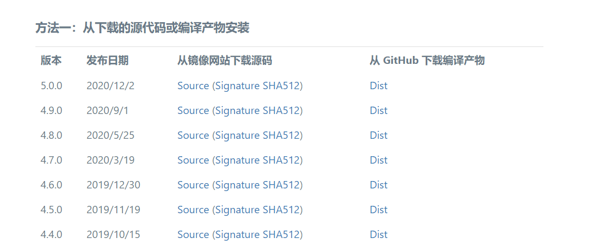
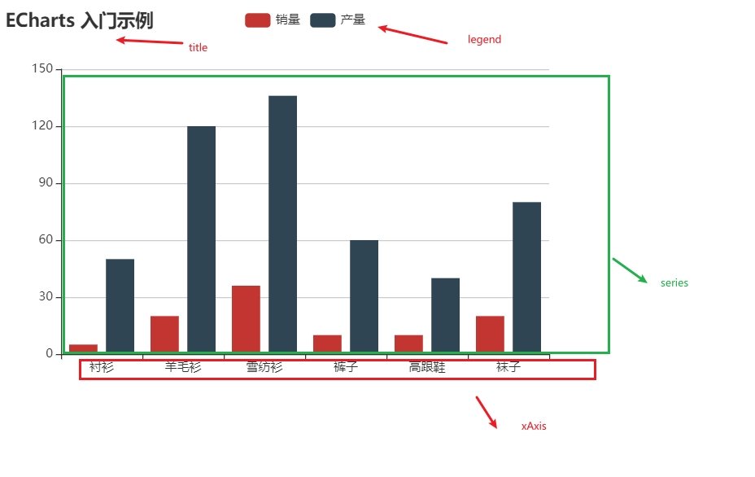
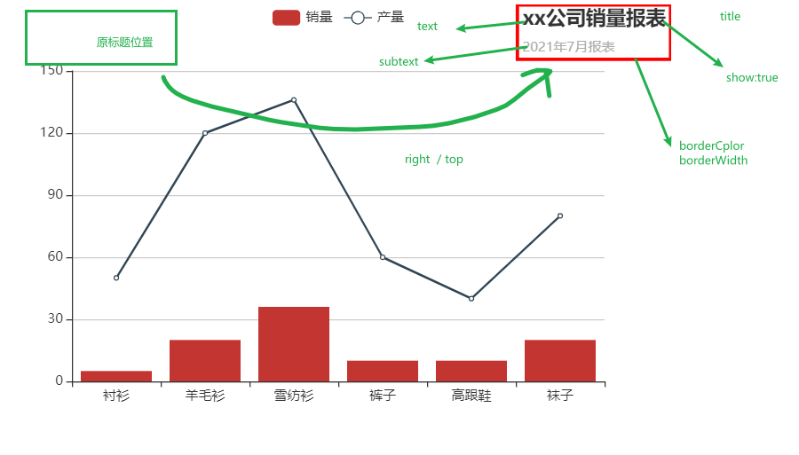
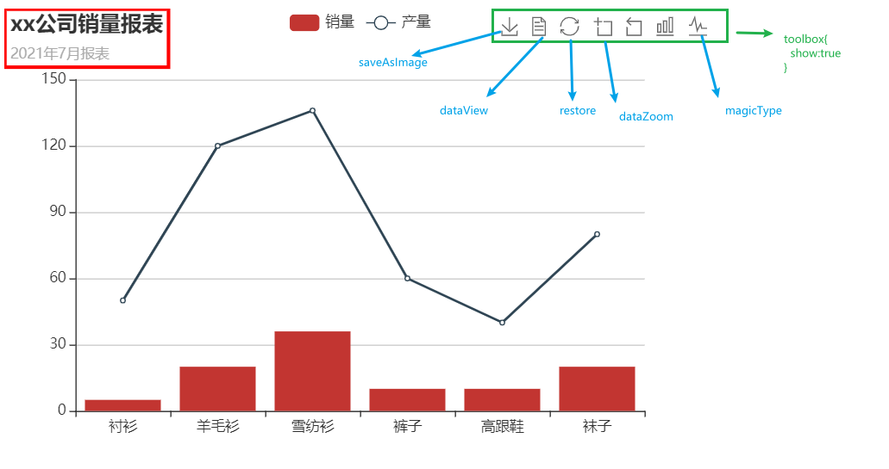
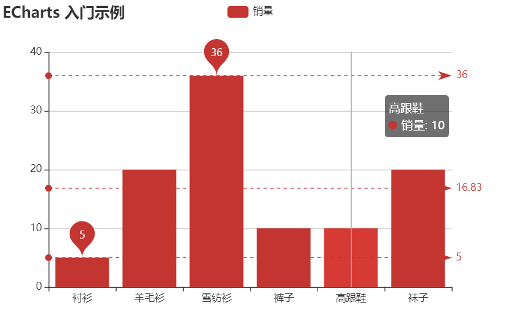
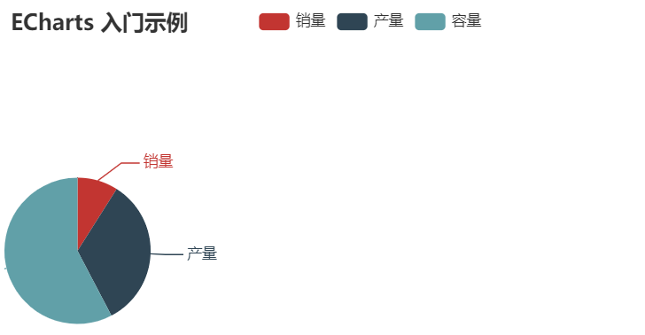
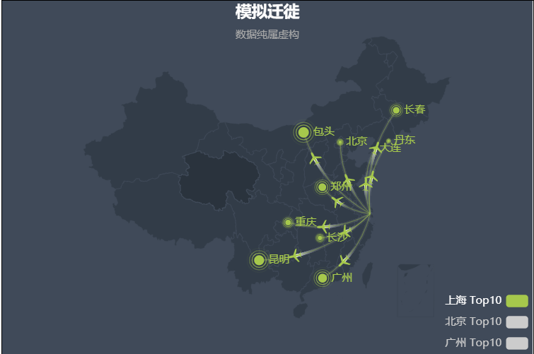

# Echarts

## 1. Echarts简介

### 1.1 什么是ECharts?

ECharts是一个使用 JavaScript 实现的"**数据可视化**"库, 它可以流畅的运行在 PC 和移动设备上

### 1.2 什么是数据可视化?

也就是可以将数据通过图表的形式展示出来，

### 1.3 ECharts提供的图表类型

- ECharts 提供了常见的折线图、柱状图、散点图、饼图、K线图，
- 用于统计的盒形图，
- 用于地理数据可视化的地图、热力图、线图，
- 用于关系数据可视化的关系图、treemap、旭日图，多维数据可视化的平行坐标，
- 还有用于 BI 的漏斗图，仪表盘，
- 并且支持图与图之间的混搭。

### 1.4 ECharts显示图表的原理

ECharts4.0之前, 底层是使用canvas标签来实现图表绘制的

ECharts4.0开始, 为了提升移动端性能, 还支持 SVG 渲染

### 1.5 ECharts官网

https://echarts.baidu.com

## 2. Echarts基本使用

### 2.1 导入ECharts插件

首先将[echarts下载](https://echarts.apache.org/zh/download.html)



*使用ECahrts需要引入`echarts.js`文件*

```html
<head>
    <meta charset="UTF-8">
    <title>02-ECharts基本使用</title>
    <!--1.导入ECharts插件-->
    <script src="js/echarts.js"></script>
</head>
```

### 2.2 为ECharts准备一个容器

编写一个div容器,用于展示可视化数据

```html
<!--2.为ECharts准备一个容器-->
<div style="width: 600px; height: 400px"></div>
```

### 2.3 Echarts的基本使用

使用步骤:

1. 获取到容器
2. 通过 [echarts.init](https://echarts.apache.org/zh/api.html#echarts.init) 方法初始化一个 echarts 实例
3. 通过 [setOption](https://echarts.apache.org/zh/api.html#echartsInstance.setOption) 方法生成一个简单的柱状图

```javascript
/*3.拿到准备好的容器*/
let oDiv = document.querySelector("div");
/*4.创建一个ECharts对象*/
let myCharts = echarts.init(oDiv);
/*5.对ECharts进行一些配置*/
let option = {
    // 设置图表的标题
    title: {
        text: 'ECharts 入门示例'
    },
    // 设置图表的图例
    legend: {
        data:['销量', '产量']
    },
    // 设置X轴上显示的数据
    xAxis: {
        data: ["衬衫","羊毛衫","雪纺衫","裤子","高跟鞋","袜子"]
    },
    // 设置Y轴上显示的数据, 如果没有设置会根据数据自动填充
    yAxis: {},
    // 设置图表的数据
    series: [{
        name: '销量',
        type: 'bar',
        data: [5, 20, 36, 10, 10, 20]
    },{
        name: '产量',
        type: 'bar',//bar line
        data: [50, 120, 136, 60, 40, 80]
    }]
};
/*6.将配置传递给ECharts*/
myCharts.setOption(option);
```

测试结果:



## 3. Echarts标题组件-title

官方文档: https://echarts.apache.org/zh/option.html#title

*配置中的`title`*设置

标题组件(title):

- `show` : 是否显示
- `text`: 标题文字
- `subtext` : 子标题文字
- `left/top/right/bottom`: 标题位置
- `borderColor`: 边框颜色
- `borderWidth`: 边框宽度

```javascript
/*3.拿到准备好的容器*/
let oDiv = document.querySelector("div");
/*4.创建一个ECharts对象*/
let myCharts = echarts.init(oDiv);
/*5.对ECharts进行一些配置*/
let option = {
    // 设置图表的标题
    title: {
        text: 'xx公司销量报表',
        show:true,
        subtext: '2021年7月报表',
        borderColor:"red",
        borderWidth:3
    },
    // 设置图表的图例
    legend: {
        data:['销量', '产量']
    },
    // 设置X轴上显示的数据
    xAxis: {
        data: ["衬衫","羊毛衫","雪纺衫","裤子","高跟鞋","袜子"]
    },
    // 设置Y轴上显示的数据, 如果没有设置会根据数据自动填充
    yAxis: {},
    // 设置图表的数据
    series: [{
        name: '销量',
        type: 'bar',
        data: [5, 20, 36, 10, 10, 20]
    },{
        name: '产量',
        type: 'bar', 
        data: [50, 120, 136, 60, 40, 80]
    }]
};
/*6.将配置传递给ECharts*/
myCharts.setOption(option);
```

测试结果:



## 4. Echarts工具箱组件-toolbox

工具箱组件(toolbox):

- `show` : 是否显示
- `feature`: 具体显示功能
    - saveAsImage: 保存图片
    - dataView: 数据视图
    - restore: 还原
    - dataZoom: 缩放视图
    - magicType: 动态类型切换

```javascript
/*3.拿到准备好的容器*/
let oDiv = document.querySelector("div");
/*4.创建一个ECharts对象*/
let myCharts = echarts.init(oDiv);
/*5.对ECharts进行一些配置*/
let option = {
    toolbox: {
        show: true,
        feature: {
            saveAsImage: {
                show: true
            },
            dataView: {
                show: true
            },
            restore:{
                show: true
            },
            dataZoom:{
                show: true
            },
            magicType:{
                type: ["bar", "line"]
            }
        }
    },
    // 设置图表的标题
    title: {
        text: 'xx公司销量报表',
        show:true,
        subtext: '2021年7月报表',
        borderColor:"red",
        borderWidth:3
    },
    // 设置图表的图例
    legend: {
        data:['销量', '产量']
    },
    // 设置X轴上显示的数据
    xAxis: {
        data: ["衬衫","羊毛衫","雪纺衫","裤子","高跟鞋","袜子"]
    },
    // 设置Y轴上显示的数据, 如果没有设置会根据数据自动填充
    yAxis: {},
    // 设置图表的数据
    series: [{
        name: '销量',
        type: 'bar',
        data: [5, 20, 36, 10, 10, 20]
    },{
        name: '产量',
        type: 'bar',
        data: [50, 120, 136, 60, 40, 80]
    }]
};
/*6.将配置传递给ECharts*/
myCharts.setOption(option);
```

测试结果:



## 5. Echarts弹窗组件和数据标记-tooltip

用于辅助观察数据的

官方地址: https://echarts.apache.org/zh/api.html#action.tooltip

弹窗组件(tooltip):

- show: 是否显示
- trigger:显示方式, axis X轴显示

数据标记

- markLine: 标记线

  最大值/最小值/平均值等

- markPoint: 标记点

  最大值/最小值/平均值等

```javascript
/*3.拿到准备好的容器*/
let oDiv = document.querySelector("div");
/*4.创建一个ECharts对象*/
let myCharts = echarts.init(oDiv);
/*5.对ECharts进行一些配置*/
let option = {
    tooltip:{
        show: true,
        trigger: "axis"
    },
    // 设置图表的标题
    title: {
        show: true,
        text: 'ECharts 入门示例',
    },
    // 设置图表的图例
    legend: {
        data:['销量', '产量']
    },
    // 设置X轴上显示的数据
    xAxis: {
        data: ["衬衫","羊毛衫","雪纺衫","裤子","高跟鞋","袜子"]
    },
    // 设置Y轴上显示的数据, 如果没有设置会根据数据自动填充
    yAxis: {},
    // 设置图表的数据
    series: [{
        name: '销量',
        type: 'bar',
        data: [5, 20, 36, 10, 10, 20],
        //标记点
        markPoint: {
            data: [
                {type:"max", name:"最大值"},
                {type:"min", name:"最小值"},
            ]
        },
        //标记线
        markLine: {
            data: [
                {type:"max", name:"最大值"},
                {type:"min", name:"最小值"},
                {type:"average", name:"平均值"},
            ]
        }
    }]
};
/*6.将配置传递给ECharts*/
myCharts.setOption(option);
```

测试结果:



## 6. Echarts绘制饼状图

```javascript
/*3.拿到准备好的容器*/
let oDiv = document.querySelector("div");
/*4.创建一个ECharts对象*/
let myCharts = echarts.init(oDiv);
/*5.对ECharts进行一些配置*/
let option = {
    // 设置图表的标题
    title: {
        show: true,
        text: 'ECharts 入门示例',
    },
    // 设置图表的图例
    legend: {
        data:['销量', '产量', '容量']
    },
    // 设置图表的数据
    series: [{
        radius: "30%", //修改饼状图的大小
        center: ["10%", "50%"], //修改饼状图的位置	x轴 , y轴
        type: 'pie', //饼状图
        data: [
            // 注意点: 这里的数据需要和图例(legend)中的数据保持一致
            {value: 123, name: "销量"},
            {value: 456, name: "产量"},
            {value: 789, name: "容量"},
        ],
    }]
};
/*6.将配置传递给ECharts*/
myCharts.setOption(option);
```

测试结果:



## 7. Echarts航线图

需要导入`china.js`文件

```html
<head>
    <meta charset="UTF-8">
    <title>Title</title>
    <script src="js/echarts.js"></script>
    <script src="js/china.js"></script>
</head>
```

```javascript
/*3.拿到准备好的容器*/
let oDiv = document.querySelector("div");
/*4.创建一个ECharts对象*/
let myCharts = echarts.init(oDiv);
// 地图上每个城市坐标
let geoCoordMap = {
    '上海': [121.4648,31.2891],
    '东莞': [113.8953,22.901],
    '东营': [118.7073,37.5513],
    '中山': [113.4229,22.478],
    '临汾': [111.4783,36.1615],
    '临沂': [118.3118,35.2936],
    '丹东': [124.541,40.4242],
    '丽水': [119.5642,28.1854],
    '乌鲁木齐': [87.9236,43.5883],
    '佛山': [112.8955,23.1097],
    '保定': [115.0488,39.0948],
    '兰州': [103.5901,36.3043],
    '包头': [110.3467,41.4899],
    '北京': [116.4551,40.2539],
    '北海': [109.314,21.6211],
    '南京': [118.8062,31.9208],
    '南宁': [108.479,23.1152],
    '南昌': [116.0046,28.6633],
    '南通': [121.1023,32.1625],
    '厦门': [118.1689,24.6478],
    '台州': [121.1353,28.6688],
    '合肥': [117.29,32.0581],
    '呼和浩特': [111.4124,40.4901],
    '咸阳': [108.4131,34.8706],
    '哈尔滨': [127.9688,45.368],
    '唐山': [118.4766,39.6826],
    '嘉兴': [120.9155,30.6354],
    '大同': [113.7854,39.8035],
    '大连': [122.2229,39.4409],
    '天津': [117.4219,39.4189],
    '太原': [112.3352,37.9413],
    '威海': [121.9482,37.1393],
    '宁波': [121.5967,29.6466],
    '宝鸡': [107.1826,34.3433],
    '宿迁': [118.5535,33.7775],
    '常州': [119.4543,31.5582],
    '广州': [113.5107,23.2196],
    '廊坊': [116.521,39.0509],
    '延安': [109.1052,36.4252],
    '张家口': [115.1477,40.8527],
    '徐州': [117.5208,34.3268],
    '德州': [116.6858,37.2107],
    '惠州': [114.6204,23.1647],
    '成都': [103.9526,30.7617],
    '扬州': [119.4653,32.8162],
    '承德': [117.5757,41.4075],
    '拉萨': [91.1865,30.1465],
    '无锡': [120.3442,31.5527],
    '日照': [119.2786,35.5023],
    '昆明': [102.9199,25.4663],
    '杭州': [119.5313,29.8773],
    '枣庄': [117.323,34.8926],
    '柳州': [109.3799,24.9774],
    '株洲': [113.5327,27.0319],
    '武汉': [114.3896,30.6628],
    '汕头': [117.1692,23.3405],
    '江门': [112.6318,22.1484],
    '沈阳': [123.1238,42.1216],
    '沧州': [116.8286,38.2104],
    '河源': [114.917,23.9722],
    '泉州': [118.3228,25.1147],
    '泰安': [117.0264,36.0516],
    '泰州': [120.0586,32.5525],
    '济南': [117.1582,36.8701],
    '济宁': [116.8286,35.3375],
    '海口': [110.3893,19.8516],
    '淄博': [118.0371,36.6064],
    '淮安': [118.927,33.4039],
    '深圳': [114.5435,22.5439],
    '清远': [112.9175,24.3292],
    '温州': [120.498,27.8119],
    '渭南': [109.7864,35.0299],
    '湖州': [119.8608,30.7782],
    '湘潭': [112.5439,27.7075],
    '滨州': [117.8174,37.4963],
    '潍坊': [119.0918,36.524],
    '烟台': [120.7397,37.5128],
    '玉溪': [101.9312,23.8898],
    '珠海': [113.7305,22.1155],
    '盐城': [120.2234,33.5577],
    '盘锦': [121.9482,41.0449],
    '石家庄': [114.4995,38.1006],
    '福州': [119.4543,25.9222],
    '秦皇岛': [119.2126,40.0232],
    '绍兴': [120.564,29.7565],
    '聊城': [115.9167,36.4032],
    '肇庆': [112.1265,23.5822],
    '舟山': [122.2559,30.2234],
    '苏州': [120.6519,31.3989],
    '莱芜': [117.6526,36.2714],
    '菏泽': [115.6201,35.2057],
    '营口': [122.4316,40.4297],
    '葫芦岛': [120.1575,40.578],
    '衡水': [115.8838,37.7161],
    '衢州': [118.6853,28.8666],
    '西宁': [101.4038,36.8207],
    '西安': [109.1162,34.2004],
    '贵阳': [106.6992,26.7682],
    '连云港': [119.1248,34.552],
    '邢台': [114.8071,37.2821],
    '邯郸': [114.4775,36.535],
    '郑州': [113.4668,34.6234],
    '鄂尔多斯': [108.9734,39.2487],
    '重庆': [107.7539,30.1904],
    '金华': [120.0037,29.1028],
    '铜川': [109.0393,35.1947],
    '银川': [106.3586,38.1775],
    '镇江': [119.4763,31.9702],
    '长春': [125.8154,44.2584],
    '长沙': [113.0823,28.2568],
    '长治': [112.8625,36.4746],
    '阳泉': [113.4778,38.0951],
    '青岛': [120.4651,36.3373],
    '韶关': [113.7964,24.7028]
};
// 北京航班数据
let BJData = [
    [{name:'北京'}, {name:'上海',value:95}],
    [{name:'北京'}, {name:'广州',value:90}],
    [{name:'北京'}, {name:'大连',value:80}],
    [{name:'北京'}, {name:'南宁',value:70}],
    [{name:'北京'}, {name:'南昌',value:60}],
    [{name:'北京'}, {name:'拉萨',value:50}],
    [{name:'北京'}, {name:'长春',value:40}],
    [{name:'北京'}, {name:'包头',value:30}],
    [{name:'北京'}, {name:'重庆',value:20}],
    [{name:'北京'}, {name:'常州',value:10}]
];
// 上海航班数据
let SHData = [
    [{name:'上海'},{name:'包头',value:95}],
    [{name:'上海'},{name:'昆明',value:90}],
    [{name:'上海'},{name:'广州',value:80}],
    [{name:'上海'},{name:'郑州',value:70}],
    [{name:'上海'},{name:'长春',value:60}],
    [{name:'上海'},{name:'重庆',value:50}],
    [{name:'上海'},{name:'长沙',value:40}],
    [{name:'上海'},{name:'北京',value:30}],
    [{name:'上海'},{name:'丹东',value:20}],
    [{name:'上海'},{name:'大连',value:10}]
];
// 广州航班数据
let GZData = [
    [{name:'广州'},{name:'福州',value:95}],
    [{name:'广州'},{name:'太原',value:90}],
    [{name:'广州'},{name:'长春',value:80}],
    [{name:'广州'},{name:'重庆',value:70}],
    [{name:'广州'},{name:'西安',value:60}],
    [{name:'广州'},{name:'成都',value:50}],
    [{name:'广州'},{name:'常州',value:40}],
    [{name:'广州'},{name:'北京',value:30}],
    [{name:'广州'},{name:'北海',value:20}],
    [{name:'广州'},{name:'海口',value:10}]
];
// 飞机图形路径
let planePath = 'path://M1705.06,1318.313v-89.254l-319.9-221.799l0.073-208.063c0.521-84.662-26.629-121.796-63.961-121.491c-37.332-0.305-64.482,36.829-63.961,121.491l0.073,208.063l-319.9,221.799v89.254l330.343-157.288l12.238,241.308l-134.449,92.931l0.531,42.034l175.125-42.917l175.125,42.917l0.531-42.034l-134.449-92.931l12.238-241.308L1705.06,1318.313z';
// 将指定数据转换为echarts需要的格式
function convertData (data) {
    let res = [];
    for (let i = 0; i < data.length; i++) {
        let dataItem = data[i];
        let fromCoord = geoCoordMap[dataItem[0].name];
        let toCoord = geoCoordMap[dataItem[1].name];
        if (fromCoord && toCoord) {
            res.push([{
                name: dataItem[0].name,
                coord: fromCoord
            }, {
                name: dataItem[1].name,
                coord: toCoord
            }]);
        }
    }
    return res;
};
// 转换数据
let color = ['#a6c84c', '#ffa022', '#46bee9'];
let series = [];
[['上海', SHData], ['北京', BJData], ['广州', GZData]].forEach(function (item, i) {
    series.push({
        name: item[0] + ' Top10',
        type: 'lines',
        zlevel: 1,
        effect: {
            show: true,
            period: 6,
            trailLength: 0.7,
            color: '#fff',
            symbolSize: 3
        },
        lineStyle: {
            normal: {
                color: color[i],
                width: 0,
                curveness: 0.2
            }
        },
        data: convertData(item[1])
    },
                {
        name: item[0] + ' Top10',
        type: 'lines',
        zlevel: 2,
        effect: {
            show: true,
            period: 6,
            trailLength: 0,
            symbol: planePath,
            symbolSize: 15
        },
        lineStyle: {
            normal: {
                color: color[i],
                width: 1,
                opacity: 0.4,
                curveness: 0.2
            }
        },
        data: convertData(item[1])
    },
                {
        name: item[0] + ' Top10',
        type: 'effectScatter',
        coordinateSystem: 'geo',
        zlevel: 2,
        rippleEffect: {
            brushType: 'stroke'
        },
        label: {
            normal: {
                show: true,
                position: 'right',
                formatter: '{b}'
            }
        },
        symbolSize: function (val) {
            return val[2] / 8;
        },
        itemStyle: {
            normal: {
                color: color[i]
            }
        },
        data: item[1].map(function (dataItem) {
            return {
                name: dataItem[1].name,
                value: geoCoordMap[dataItem[1].name].concat([dataItem[1].value])
            };
        })
    });
});

/*5.对ECharts进行一些配置*/
let option = {
    backgroundColor: '#404a59',
    title : {
        text: '模拟迁徙',
        subtext: '数据纯属虚构',
        left: 'center',
        textStyle : {
            color: '#fff'
        }
    },
    tooltip : {
        trigger: 'item'
    },
    legend: {
        orient: 'vertical',
        top: 'bottom',
        left: 'right',
        data:['上海 Top10', '北京 Top10', '广州 Top10'],
        textStyle: {
            color: '#fff'
        },
        selectedMode: 'single'
    },
    geo: {
        map: 'china',
        label: {
            emphasis: {
                show: false
            }
        },
        roam: true,
        itemStyle: {
            normal: {
                areaColor: '#323c48',
                borderColor: '#404a59'
            },
            emphasis: {
                areaColor: '#2a333d'
            }
        }
    },
    series: series
};
/*6.将配置传递给ECharts*/
myCharts.setOption(option);
```

测试结果:

