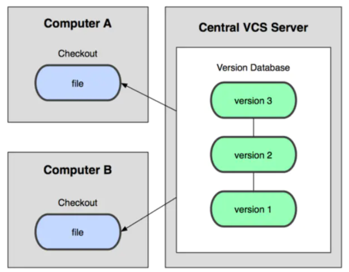
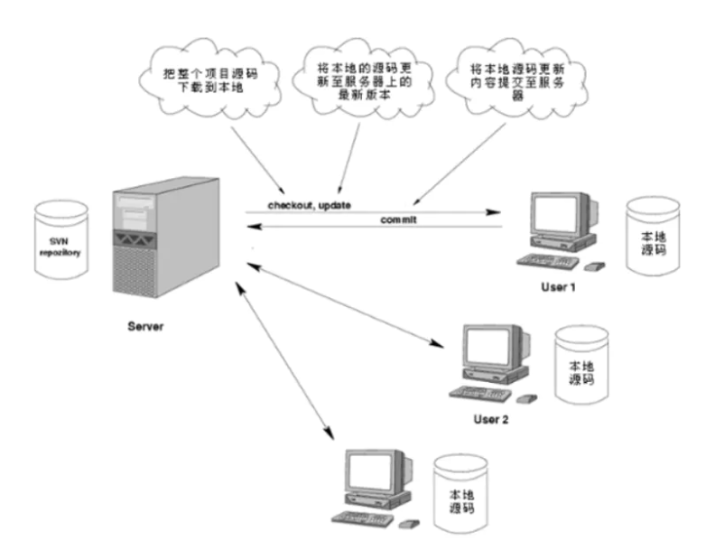
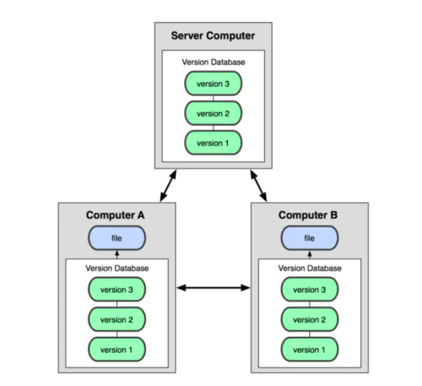
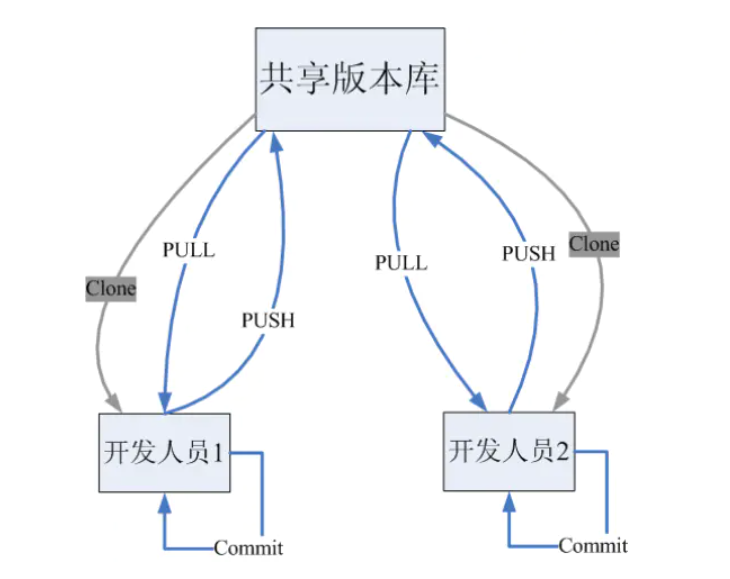
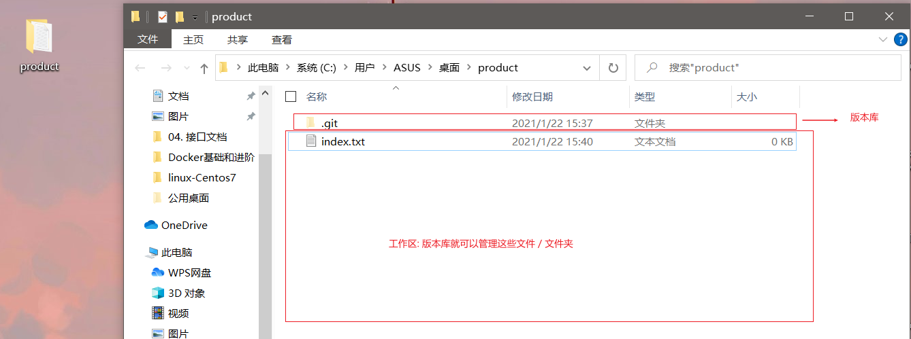
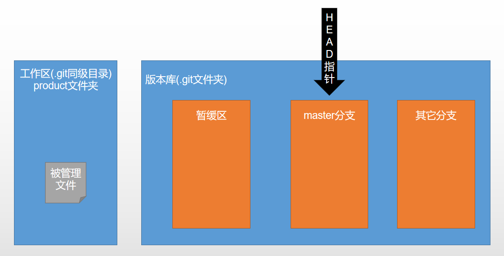
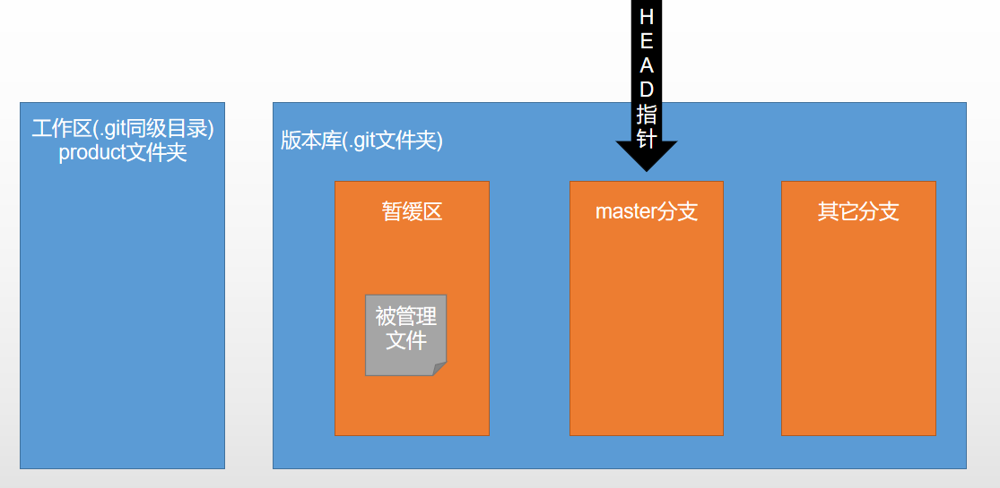
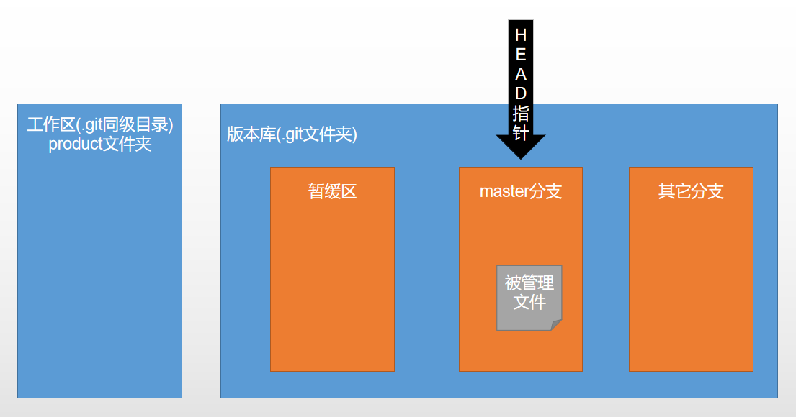
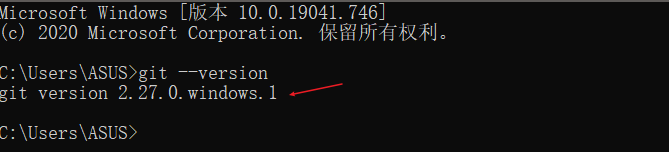
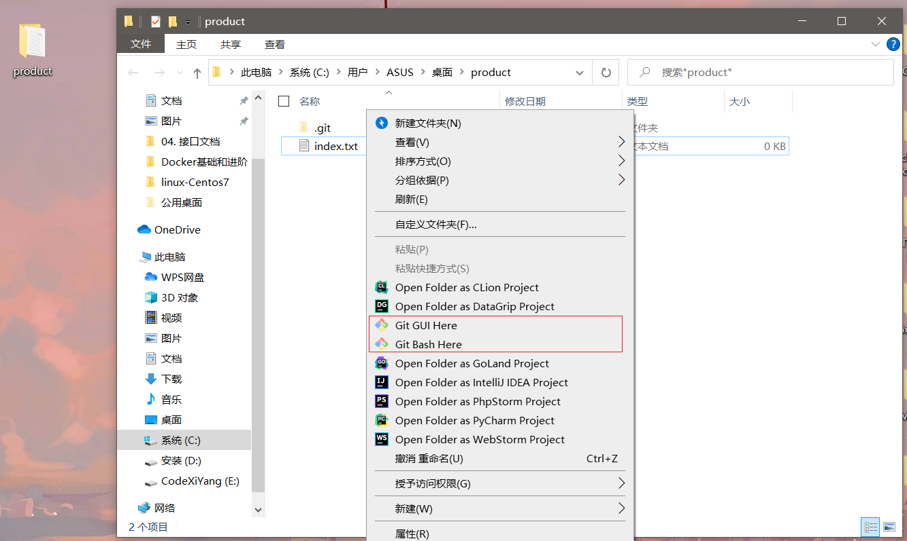

# Git版本控制

> 课程名称: https://www.it666.com/my/course/188
>
> 课程概述: git的基本使用
>
> 讲述人: 李南江

## 第 1 章: GIT入门

### 版本控制的起源

现在的软件项目通常是由一个研发小组共同分析、设计、编码、维护以及测试的
针对团队开发需要解决以下问题：

- 备份多个版本，费空间，费时间
- 难于恢复至以前正确版本
- 容易引发BUG
- 解决代码冲突困难
- 代码管理混乱
- 难于追溯问题代码的修改人和修改时间
- 无法进行权限控制
- 项目版本发布困难

源代码管理工具就是为了解决上述问题应运而生的

### 版本控制(Revision Control)

是维护工程蓝图的标准做法，能追踪工程蓝图从诞生一直到定案的过程。是一种记录若干文件内容变化，以便将来查阅特定版本修订情况的系统

- 如果是开发团队中的一员，使用版本控制是强制性的！
- 如果是单人开发，也强烈建议现在就开始使用版本控制!

使用版本控制可以：

- 不会对现有工作造成任何损害
- 不会增加工作量
- 添加新的功能拓展时，会变得更加容易

### 常见版本控制工具

CVS 开启版本控制之门

- CVS 1990年诞生，远古时代的主流源代码管理工具

SVN 集中式版本控制之王者

- SVN:又称subversion，是CVS的接班人，是一款集中式源代码管理工具。曾经是绝大多数开源软件的代码管理工具(google code)，前几年在国内软件企业使用最为普遍

GIT 分布式版本控制之伟大作品

- GIT:一款分布式源代码管理工具，目前国内企业几乎都已经完成了从SVN到GIT的转换

### 集中式与分布式

集中式源代码管理: 代表有svn





分布式源代码管理: 代表有git





**分布式和集中式的最大区别在于：**

- 在集中式下, 开发者只能将代码提交到服务器, 在分布式下, 开发者可以本地提交
- 在集中式下, 只有远程服务器上有代码数据库, 在分布式下, 每个开发者机器上都有一个代码数据库

**集中式与分布式的对比:** 

速度

- 在很多情况下，git的速度远远比SVN快

结构

- SVN是集中式管理，git是分布式管理

其他

- SVN使用分支比较笨拙，git可以轻松拥有无限个分支
- SVN必须联网才能正常工作，git支持本地版本控制工作
- 旧版本的SVN会在每一个目录置放一个.svn，git只会在根目录拥有一个.git


### GIT简介

GIT是一款自由和开源的分布式版本控制系统，用于敏捷高效地处理任何或小或大的项目

在世界上所有的分布式版本控制工具中，git是最快、最简单、最流行的

是Linux之父李纳斯的第二个伟大作品

- 2005年由于BitKeeper软件公司对Linux社区停止了免费使用权。

- Linus为了辅助Linux内核的开发(管理源代码),迫不得己自己开发了一个分布式版本控制工具，从而Git诞生了


## 第 2 章: GIT单人开发

### GIT工作原理

*如果想学好GIT必须先了解GIT的工作原理!*

**工作区(Working Directory)**: 仓库文件夹里面, 除了.git目录以外的内容

**版本库(Repository)**:.git目录, 用于存储记录版本信息

- 版本库中的**暂缓区(staga)**: 暂时存放的区域

- 版本库中的**分支(master)**: git自动创建的第一个分支

- 版本库中的**HEAD指针**:用于指向当前分支



### ppt演示git是如何做版本管理

1. 首先是在工作区中进行文件处理,例如你增加一个index.html文件

   

2. 然后通过命令将工作区中的内容提交到暂缓区

   

3. 最后会将暂缓区中的内容提交到HEAD指针指向的分支上去

   

### 安装git

git下载地址: https://git-scm.com/downloads

然后全程next...

当在cmd命令窗口中输入`git --version`有git的版本号就表示下载安装成功了



而且git安装成功后,你在某一个文件夹下左击,会出现两个git的特殊图标也表示安装成功了



- Git GUI : 图形化方式操作git
- Git Bash : 命令行方式操作git;如果会使用linux可以在这里面进行一些简单的linux命令操作

*git学习文档: https://backlog.com/git-tutorial/cn/*


### GIT使用环境

多人开发时需要一个共享版本库, 单人开发初始化一个本地库即可

共享版本库的形式:

- 本地共享库: 文件夹/U盘/硬盘
- 远程共享库: 自己搭建git服务器/托管到第三方平台(github/oschina等)

无论是单人开发还是多人开发, 客户端都可以使用命令行或者图形化界面使用git


### git单人开发常用命令

没有对接团队,一个人做版本管理使用git的常用命令大全

#### git help

`git help` 查看git的帮助命令

```shell
ASUS@DESKTOP-6S61DQD MINGW64 ~/Desktop/product (master)
$ git help
usage: git [--version] [--help] [-C <path>] [-c <name>=<value>]
           [--exec-path[=<path>]] [--html-path] [--man-path] [--info-path]
           [-p | --paginate | -P | --no-pager] [--no-replace-objects] [--bare]
           [--git-dir=<path>] [--work-tree=<path>] [--namespace=<name>]
           <command> [<args>]

These are common Git commands used in various situations:

start a working area (see also: git help tutorial)
   clone             Clone a repository into a new directory
   init              Create an empty Git repository or reinitialize an existing
one

work on the current change (see also: git help everyday)
   add               Add file contents to the index
   mv                Move or rename a file, a directory, or a symlink
   restore           Restore working tree files
   rm                Remove files from the working tree and from the index
   sparse-checkout   Initialize and modify the sparse-checkout

examine the history and state (see also: git help revisions)
   bisect            Use binary search to find the commit that introduced a bug
   diff              Show changes between commits, commit and working tree, etc
   grep              Print lines matching a pattern
   log               Show commit logs
   show              Show various types of objects
   status            Show the working tree status

grow, mark and tweak your common history
   branch            List, create, or delete branches
   commit            Record changes to the repository
   merge             Join two or more development histories together
   rebase            Reapply commits on top of another base tip
   reset             Reset current HEAD to the specified state
   switch            Switch branches
   tag               Create, list, delete or verify a tag object signed with GPG


collaborate (see also: git help workflows)
   fetch             Download objects and refs from another repository
   pull              Fetch from and integrate with another repository or a local
 branch
   push              Update remote refs along with associated objects

'git help -a' and 'git help -g' list available subcommands and some
concept guides. See 'git help <command>' or 'git help <concept>'
to read about a specific subcommand or concept.
See 'git help git' for an overview of the system.

```

`git help 其他指令` 如果你某个指令忘了如何使用,可以使用这种方式查看某个命令的具体使用

```shell
git help add
```


## 第 3 章: GIT多人开发


## 第 4 章: gitflow工作流程


## 第 5 章: github & git


## 第 6 章: WebStrom使用git


