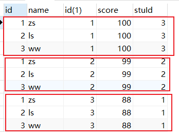

# MySQL+数据迁移

> 课程名称: [从零玩转MySQL+数据迁移(14)](https://www.it666.com/my/course/193)
>
> 课程概述: MySQL基础部分以及高级
>
> 讲述人: 李南江

## 第 1 章: MySQL开篇 🚩

### 1.1 什么是数据库?

- 数据库就是存储数据的仓库
- 数据库和Excel很像, Excel本质是一个文件， 数据库本质上也是一个文件，
- 数据库和Excel很像, Excel文件中可以有很多的表, 一个数据库中也有很多的表
- 数据库和Excel很像, Excel文件的每张表就是用来存储数据的, 数据库文件的每张表也是用来存储数据的
- 所以学习数据库和学习Excel差不多,
  就是学习如何新建数据库文件,如何在数据库中新建表,如何往表中存储数据和操作表中的数据

### 1.2 什么是MySQL?

-  MySQL是由瑞典AB 公司开发"关系型"数据，目前属于 Oracle 旗下产品
-  由于MySQL是开源免费的, 所以现在是市面上最受欢迎的数据库之一

### 1.3 什么是关系型数据库?

**数据库萌芽阶段:**

- 最初程序员们把磁盘上的文件当做数据库来使用,但是由于文件不方便管理和不安全，
  所以后来就有了第一代数据库(层次模型数据库和网状模型数据库)
  + 网状模型数据库是层次模型数据库的升级版
  + 层次模型数据库类似于HTML结构, 是通过树状结构来保存管理数据的
  + 在层次模型数据库中有且仅有一个结点没有父结点，它就是根结点
  + 在层次模型数据库中其它结点只能有一个父结点
  + 在层次模型数据库中所有的子节点不能脱离父节点而单独存在
- 后来由于层次模型和网状模型数据库的结构比较复杂，不利于数据库的维护和重建
  所以就有了第二代数据库(关系型数据库和非关系型数据库)

**第一代数据库:**

- 层次模型数据库
    + 典型代表是IBM公司的IMS（Information Management System）数据库管理系统
- 网状模型数据库
    + 电信代表是HP公司的IMAGE、Cullinet Software公司的 IDMS、Univac公司的 DMS1100

**第二代数据库:**

- 关系型数据库
    + 每个表都是独立的
    + 表与表之间通过公共字段来建立关系(例如ID字段)
    + 多表查询效率低
    + SQL Server/Oracle/MySQL

- 非关系型数据库
    + 解决了关系型数据库多表查询的效率问题
    + Redis、Mongodb等

### 1.4 MySQL的安装

1. 安装包下载地址:
   https://dev.mysql.com/downloads/mysql/

2. 安装过程:
   - 选择自定义安装
   - 选择要安装的版本
   - 修改安装路径
   - 设置数据库密码
   - 其它一律下一步

3. 测试是否安装成功
   - 配置环境变量, 将安装目录中bin文件夹的地址放到环境变量path中
   - 在终端输入 mysql --help 或者 mysql --version

### 1.5 数据库的连接和断开

#### 连接mysql服务器

**基本语法:**

```bash
mysql -h127.0.0.1 -P3306 -uroot -proot
-h 主机地址
-P 端口号
-u 用户名
-p 用户密码
```

注意点:

- 如果MySQL服务器在本地, 主机地址可以省略
- 如果服务器使用默认3306端口, 端口号可以省略

```bash
mysql -h127.0.0.1 -P3306 -uroot -proot   链接远程MySQL服务器
mysql -h127.0.0.1  -uroot -proot  链接远程MySQL服务器, 使用默认端口3306
mysql -uroot -proot 链接本地的MySQL服务器, 使用默认端口3306
mysql -uroot -p  密码采用暗文形式
```

**最常用的方式:**

`mysql -h127.0.0.1  -uroot -p ` 链接远程MySQL服务器, 使用默认端口3306

#### 退出链接

`exit;`

`quit`

`\q`

#### 显示数据库

语法格式: `show databases; ` 注意: 后面有s
**初始表介绍**

- information_schema
  - 保存着关于MySQL服务器所维护的所有其他数据库的信息。
  - 如数据库名，数据库的表，表栏的数据类型与访问权限等
- mysql
  - MySQL系统数据库, 保存了登录用户名,密码,以及每个用户的权限等等
- performance_schema
  - 用来保存数据库服务器性能的参数
- sys
  这个库是通过视图的形式把information_schema和performance_schema结合起来，查询出更加令人容易理解的数据

### 1.6 数据库SQL简介

#### 如何使用MySQL

1. 学习MySQL和学习Excel差不多
   - 使用Excel步骤: 安装Excel-创建Excel文件-创建表-在表中存储数据
   - 使用MySQL步骤: 安装MySQL-创建数据库----创建表-在表中存储数据
2. 学习MySQL本质上就是学习数据库的增删改查(CRUD)
3. 在MySQL中主要有三种类型的增删改查, 分别是:
   - 数据库的增删改查
   - 表的增删改查
   - 数据的增删改查

*MySQL中可以有0~N个数据库, 数据库中可以有0~N个表, 表中可以有0~N个数据*

#### 什么是SQL？

结构化查询语言(Structured Query Language)简称
是用来操作关系型数据库的一门语言
是一个关系型数据库通用的操作语言

**注意点:**
各大厂商为了更多的占用市场份额, 都会在标准的SQL基础上扩展一些自己的东西
例如: 

- SQL Server  使用T-SQL
- Oracle      使用PL/SQL
- MySQL       使用MySQL

#### SQL语句功能划分

- DDL:数据定义语句
	用来定义数据库对象：创建库，表，列等。
- DML：数据操作语句
	用来操作数据库表中的记录
- DQL：数据查询语句
	用来查询数据
- DCL：数据控制语句
	用来定义访问权限和安全级别

#### SQL数据类型

和常见的编程语言一样, 数据库中存储的数据也是区分类型的

MySQL中支持的数据类型大致可以分为三类: 数值类型、字符串类型和日期和时间类型 https://dev.mysql.com/doc/refman/8.0/en/data-types.html
MySQL中常用的数据类型如下:

- double：浮点型，例如double(5,2)表示最多5位，其中必须有2位小数，即最大值为999.99；
- char：固定长度字符串类型； char(10)  'lnj       '
- varchar：可变长度字符串类型；varchar(10) 'lnj'
- text：字符串类型;
- blob：二进制类型；
- date：日期类型，格式为：yyyy-MM-dd；
- time：时间类型，格式为：hh:mm:ss
- datetime:日期时间类型 yyyy-MM-dd hh:mm:ss

注意点: 在mysql中，字符串类型和日期类型都要用单引号括起来。'lnj'  '2022-02-02'

## 第 2 章: 数据库增删改查

### 2.1 创建数据库

语法格式: `create database [if not exists] 数据库名称 [charset=字符集];`

**示例一:**

```sql
create database stu;
-- 注意点: 以上语句, 如果MySQL中已经有了名称叫做stu的数据库, 再执行就会报错
```

**示例二:**

```sql
create database if not exists person;
-- 注意点: 以上语句, 如果MySQL中已经有了名称叫做person的数据库, 并不会报错, 而是跳过这条语句
```

**示例三:**

```sql
create database if not exists it666 charset=utf8;
-- 注意点: 为了避免将来读取的字符集和存储的字符集不一样导致乱码问题,在创建数据库的时候, 我们还需要指定当前创建的数据库将来使用什么编码方式存储数据
```

#### 补充讲解

**如何查看数据库全局默认的编码**

`show variables like 'character_set_%';`

**如何查看某个数据库的编码**

`show create database person;`

**特殊的数据库名称处理**

```sql
create database if not exists `create` charset=utf8;
-- 注意点: 如果数据库的名称是SQL的关键字或者是一些特殊字符#~@*&.., 这个时候就需要用反引号括起来
```


### 2.2 删除数据库

语法格式: `drop database [if exists] 数据库名称;`

**示例一:**

```sql
drop database stu;
-- 注意点: 以上语句, 如果MySQL中没有要删除的数据库, 那么就会报错
```

**示例二:**

```sql
drop database if exists person;
-- 注意点: 以上语句, 如果MySQL中没有要删除的数据库, 那么就会跳过, 并不会报错
```

### 2.3 修改数据库

语法格式: `alter database 数据库名称 charset=字符集; `

```sql
alter database it666 charset=utf8;
```

### 2.4 查看数据库

语法格式: 

- `show create database 数据库名称;`
- `show databases;`

**小结:**

```markdown
# 新建-- C/增加
create database [if not exists] 数据库名称 [charset=字符集];

# 删除-- D/删除
drop database [if exists] 数据库名称;

# 修改-- U/修改
alter database 数据库名称 charset=字符编码

# 读取-- R/查看
show databases;
show create database 数据库名称;
```


## 第 3 章: 表增删改查

**注意点:**

- 在对数据库的表进行操作的时候(增删改查), 都必须先告诉MySQL我们要操作的是哪一个数据库
- `use 数据库名称;`

**查看数据库中有哪些表**

`show tables;`

**查看指定表的结构**

`desc 表名;`

### 3.1 创建表

```sql
create table 表名(
  字段名称 数据类型,
  字段名称 数据类型,
  字段名称 数据类型,
  字段名称 数据类型,
);
```


**示例一:**

```sql
create table stu(
    id int,
    name text
);
-- 注意点: 以上代码创建表, 如果表已经存在了, 那么就会报错
```

**示例二:**

```sql
create table if not exists person(
    id int,
    name text
);
-- 注意点: 以上代码创建表, 没有就会创建一个新的, 有就会自动跳过
```


### 3.2 删除表

`drop table 表名;`

**示例一:**

```sql
drop table stu;
-- 注意点: 以上语句, 如果删除的表不存在, 那么就会报错
```

**示例二:**

```sql
drop table if exists person;
-- 注意点: 以上语句, 如果需要删除的表存在, 那么就直接删除, 如果不存在就跳过
```


### 3.3 修改表

#### 修改表名

`rename table 原始名称 to 新的名称;`

```sql
rename table stu to person;
```


#### 添加字段

`alter table 表名 add 新增字段名称 新增字段数据类型 [位置];`

```sql
alter table person add age int;
-- 注意点: 默认情况下会将新增的字段放到原有字段的后面
```

```sql
alter table person add score float first;
-- 注意点: 我们可以通过指定first将新增的字段放到原有字段的前面
```

```sql
alter table person add phone int after name;
-- 注意点: 我们可以通过after指定将新增的字段放到哪个字段的后面
```


#### 删除字段

`alter table 表名 drop 字段名称;`

```sql
alter table person drop phone;
```


#### 修改字段

**修改字段的数据类型**

`alter table 表名 modify 需要修改的字段名称 新的数据类型`

```sql
alter table person modify score double;
```


**修改字段的名称和数据类型**

`alter table 表名 change 原始字段名称 新的字段名称 新的数据类型;`

```sql
alter table person change age addr text;
```


### 3.4 MySQL存储引擎

#### 什么是存储引擎

MySQL中的存储引擎就好比我们现实生活中的银行, 不同的银行提供的安全级别、服务水平、存储功能不一样

和现实生活中一样在MySQL也有各种各样不同的银行, 这些银行我们称之为存储引擎

和现实生活中一样MySQL中不同的存储引擎提供的安全级别、服务水平、存储功能等也不一样

***MySQL中有三种存储引擎, 分别是:***

+ MyISAM: 安全性低, 但不支持事务和外键, 适合频繁插入和查询的应用
+ InnoDB(默认): 安全性高, 支持事务和外键, 适合对安全性, 数据完整性要求较高的应用
+ Memory: 访问速度极快, 但不会永久存储数据, 适合对读写速度要求较高的应用

#### 指定存储引擎

```sql
-- 创建表时指定
create table stu(
    id int,
    name text
)engine=引擎名称;

-- 创建表后指定
alter table 表名 engine=引擎名称;
alter table stu engine=MyISAM;
```


#### 不同引擎的本质

- 前面我们说过数据库的本质就是文件, 所以我们可以先观察一下
- 通过我们的观察, 我们发现只要创建一个数据库就会自动创建一个文件夹
- 通过我们的观察, 我们发现只要创建一张表就会在指定的数据库文件夹中创建一个文件
- 创建表的时候自动创建的这个文件就保存了这张表的结构

```sql
create table stu(
    id int,
    name varchar(20)
)engine=Memory;
```

**InnoDB:**
   - 如果表的存储引擎是InnoDB, 那么只要创建表就会自动创建一个文件, 这个文件就保存了这张表的结构
   - 如果往InnoDB的表中存储数据, 那么数据会被存储到ibdata1的文件中, 如果存储的数据比较多, 那么系统会自动再创建ibdata2, ibdata3, ...文件

**MyISAM:**
    - 如果表的存储引擎是MyISAM, 那么只要创建表就会自动创建三个文件
        + .sdi这个文件就保存了这张表的结构
        + .MYD这个文件就保存了这张表中存储的数据
        + .MYI这个文件就保存了这张表中的索引

**Memory:**

    - 如果表的存储引擎是Memory, 那么只要创建表就会自动创建一个文件, 这个文件就保存了这张表的结构
        - 注意点: 如果表的存储引擎是Memory, 那么就不会像InnoDB/MyISAM将数据保存到文件中了, 而是直接保存到内存中

## 第 4 章 : 数据增删改查

### 4.1 插入数据

*向指定的表中插入数据*

`insert into 表名 (字段名称1, 字段名称2) values (值1, 值2);`

**示例:**

```sql
create table if not exists stu(
    id int,
    name varchar(20)
);
insert into stu (id, name) values (1, 'lnj');
# 注意点: 在插入数据的时候指定的字段名称的顺序不用和表中的字段名称的顺序一致
insert into stu (name, id) values ('zs', 2);
# 注意点: 在插入数据的时候指定的取值顺序必须和指定的字段名称顺序一致
insert into stu (name, id) values (3, 'ls');
# 注意点: 如果插入数据时指定的取值顺序和表中的字段顺序是一致的, 那么可以不指定字段名称
insert into stu values (3, 'ls');
# 注意点: 我们可以通过values同时插入多条数据
insert into  stu values (4, 'ww'), (5, 'zl');
```


### 4.2 更新数据

*将指定表中的数据进行更新(修改)*

`update 表名 set 字段名称=值 [where 条件];`

**示例:**

```sql
# 注意点: 如果在更新数据的时候没有指定条件, 那么就会更新整张表中的数据
update stu set score=77;
# 注意点: 如果在更新数据的时候指定了条件, 那么只会更新满足条件的数据
update stu set score=88 where name='ls';
# 注意点: 在指定条件的时候, 我们可以通过AND来指定多个条件, AND===&&
update stu set score=100 where name='lnj' AND id=5;
# 注意点: 在指定条件的时候, 我们可以通过OR来指定多个条件, OR===||
update stu set score=66 where name='zs' OR name='ww';
# 注意点: 在更新数据的时候是可以同时更新多个字段的
update stu set name='it666', score=33 where id=5;
```


### 4.3 查看数据

*查看指定表中有哪些数据*

#### 全局查询

`select * from 表名;`

**注意点:** 

- 以上方式会将表中所有的数据都查询出来, 所以性能比较差
- 以上方式会将表中所有的数据都查询出来, 不能查询特定字段的值
- 所有引入了下面这种where查询方式

#### where查询

 `select 字段名称1, 字段名称2 from 表名 [where 条件];`

```sql
# 查询特定字段的数据
select name from stu;
# 查询满足条件的数据
select * from stu where score > 60;
select id, name from stu where score > 60;
select * from stu where score = 77 || score = 88;
select * from stu where score in (77, 88);
select * from stu where score BETWEEN 77 AND 88;
select * from stu where score IS NOT NULL;
select * from stu where score IS NULL;
```

**where支持的运算符**

```
=（等于）、!=（不等于）、<>（不等于）、<（小于）、<=（小于等于）、>（大于）、>=（大于等于）；
IN(set)；固定的范围值
BETWEEN…AND；值在什么范围
IS NULL；（为空） IS NOT NULL（不为空）
AND；与
OR；或
NOT；非
LIKE: 模糊查询
```


### 4.4 删除数据

*删除指定表中的数据*

`delete from 表名 [where 条件];`

```sql
# 删除满足条件的数据
delete from stu where score > 60;
# 删除所有的数据
delete from stu;
```


## 第 5 章: 数据类型

**MySQL为什么要提供数据类型?**如果没有数据类型, 那么MySQL就不知道需要分配多大的存储空间来存储你的数据过大会浪费会造成资源浪费, 体积变大效率变低, 过小可能导致数据溢出不能完整的保存数据所以MySQL提供数据类型的目的是为了让我们合理的分配存储空间, 降低数据库的体积为了让我们合理的分配存储空间, 完整的保存数据为了更好的对数据库进行优化

**MySQL中有哪些数据类型?** 整型类型/浮点类型/定点类型/字符类型/文本类型/枚举类型/集合类型/日期类型/布尔类型

### 5.1 整数类型

整数类型专门用来保存整数的

```
TINYINT	        1 字节	(-128，127)	(0，255)	小整数值
SMALLINT	    2 字节	(-32 768，32 767)	(0，65 535)	大整数值
MEDIUMINT	    3 字节	(-8 388 608，8 388 607)	(0，16 777 215)	大整数值
INT或INTEGER	4 字节	(-2 147 483 648，2 147 483 647)	(0，4 294 967 295)	大整数值
BIGINT	        8 字节	(-9,223,372,036,854,775,808，9 223 372 036 854 775 807)	(0，18 446 744 073 709 551 615)	极大整数值
```

**注意点:**

1. MySQL中的整型和其它编程语言的整型一样, 也区分有符号和无符号

   - 默认情况下整型就是有符号的
   - 可以在数据类型的后面加上 unsigned 来将数据类型变成无符号的

   2. 在设计数据库的时候一定要合理的使用数据类型
                 + 例如: 我们要保存一个人的年龄 (整数)
                         +   
                 我们应该使用TINYINT类型, 因为人最多活到255岁已经上天了, 所以使用最小的整型即可
                 
             
                 如果使用其它的整型, 就会造成资源浪费, 数据库体积变大, 效率变低...

3. 在保存数据的时候, 如果超出了当前数据类型的范围, 那么就会报错
4. 在设置整型的时候, 还可以设置整型数据将来显示的位宽
   - 例如: 现在设置将来显示整型的位宽是2, 现在存储的数据1, 那么将来查询出来的数据就会显示成 1;
   - 2020-2-3 -- 2020-02-03
   - 注意点: 如果存储的数据没有指定的位宽宽, 那么就会自动补空格或者0, 如果大于或者等于了指定的位宽, 那么毛都不做

```sql
create table person(
    id int,
    age tinyint
);
insert into person values (1, -128);
insert into person values (1, 127);
insert into person values (1, 128); #报错

create table person2(
    id int,
    age tinyint unsigned
);
insert into person values (1, -128); #报错
insert into person values (1, 127);
insert into person values (1, 128);

create table person3(
    id int,
    age tinyint(2) zerofill
);
insert into person values (1, 1);   #01
insert into person values (1, 12);  #12
insert into person values (1, 123); #123
```


### 5.2 浮点类型

浮点类型专门用来保存小数的

```
FLOAT(m, d)	    4 字节	单精度
DOUBLE(m, d)	8 字节	双精度
```

*说明: m总位数, d小数位数*

**float和double的区别**

- 占用存储空间大小不一样
- 默认保留的小数位数不同
- 保存数据的有效精度也不同

**浮点类型特点**

- 和其它编程语言中一样, 浮点类型是不准确的
- 所以在企业开发中千万不要使用浮点数来保存用户的准确(珍贵)信息(RMB)

**示例一: 默认保留的小数位数不同**

```sql
create table person(
    id int,
    weight FLOAT,
    height DOUBLE
);
insert into person values (1, 1.12345678901234567890, 1.12345678901234567890);
-- weight: 1.12346
-- height: 1.1234567890123457
```

**示例二: 手动指定小数的总位数和小数部分的位数**

```sql
create table person2(
    id int,
    weight FLOAT(10, 6),
    height DOUBLE(10, 6)
);
insert into person2 values (1, 1.12345678901234567890, 1.12345678901234567890);
-- weight: 1.123457
-- height: 1.123457
```

**示例三: 保存数据的有效精度也不同**

```sql
create table person3(
    id int,
    weight FLOAT(20, 19),
    height DOUBLE(20, 19)
);
insert into person3 values (1, 1.12345678901234567890, 1.12345678901234567890);
weight: 1.123456-8357467651000
height: 1.123456789012345-7000
```


### 5.3 定点类型

定点类型也是用于存储小数的

```
decimal(M, D)
```

*说明: m总位数, d小数位数*

**定点类型的本质**: 是将数据分为两个部分来存储, 每个部分都是整数所以定点数不要滥用, 因为非常消耗资源

```sql
create table person4(
    id int,
    weight decimal(21, 20),
    height decimal(21, 20)
);
insert into person4 values (1, 1.12345678901234567890, 1.12345678901234567890);
-- weight: 1.12345678901234567890
-- height: 1.12345678901234567890
```


### 5.4 字符类型

*字符类型专门用来存储字符的*

```
 CHAR(size)	    0-255  字节	    定长字符串
 VARCHAR(size)	0-65535字节	    变长字符串
```

**char和varchar区别**

- 能够保存数据的容量不一样
- char不会回收多余的字符,  要多少给多少
- varchar会回收多余的字符, 用多少给多少
  - 例如: 通过    char(2)存储存储数据'a', 存储的结果是' a';
  - 例如: 通过 varchar(2)存储存储数据'a', 存储的结果是'a';

**示例一:**

```sql
create table person(
    id int,
    name1 char(2),
    name2 varchar(2)
);
insert into person values (1, 'a', 'b');
insert into person values (1, '12', '34');
insert into person values (1, 'abc', 'def'); #只要超出申请的范围就会报错
```

**示例二:**

```sql
create table person2(
    id int,
    name1 char(255),
    name2 varchar(255)
);
# 65535 / 3 = 21845, 由于utf8一个字符占用3个字节, 所以varchar在utf8的表中最多只能存储21845个字符
# 65535 / 2 = 32767, 由于gbk一个字符占用2个字节,所以varchar在gbk的表中最多只能存储32767个字符
create table person3(
    id int,
    name1 char(255),
    name2 varchar(65535)
)charset=gbk;
Column length too big for column 'name2' (max = 21845); use BLOB or TEXT instead
Column length too big for column 'name2' (max = 32767); use BLOB or TEXT instead
```

注意点: 

- 由于是字符类型, 所以传递值建议用单引号''
- VARCHAR理论上可以存储65535个字符, 但是实际会随着当前数据库的字符集改变

### 5.5 大文本类型

MySQL中每一行存储的数据是有大小限制的, 每一行最多只能存储65534个字节

```sql
 create table person(
     #name1 char(3),
     name2 varchar(21844) #在UTF8中相当于65535个字节
 )charset=utf8;
# Row size too large. The maximum row size for the used table type, not counting BLOBs, is 65535. This includes storage overhead, check the manual. You have to change some columns to TEXT or BLOBs
```

```
 TINYTEXT	0-255字节	        短文本字符串
 TEXT	    0-65535字节	        长文本数据
 MEDIUMTEXT	0-16777215字节	    中等长度文本数据
 LONGTEXT	0-4294967295字节    极大文本数据
```

```sql
 create table person2(
    name1 char(3),
    name2 TEXT #不会报错, 因为没有超出显示, 实际只占用10个字节
)charset=utf8;
```

注意点:

- 大文本类型在表中并不会实际占用所能保存的字节数, 而是利用10个字节引用了实际保存数据的地址

### 5.6 枚举类型

和其它编程语言一样, 如果某个字段的取值只能是几个固定值中的一个, 那么就可以使用枚举

```
enum(值1, 值2, ...);
```

```sql
create table person(
    id int,
    gender enum('男', '女', '妖')
);
insert into person values (1, '火'); #会报错
insert into person values (1, '男'); #不会报错
insert into person values (2, '女'); #不会报错
insert into person values (3, '妖'); #不会报错
```

注意点:

- MySQL中的枚举类型和其它的编程语言一样, 底层都是使用整型来实现的

  - 和其它编程语言不太一样的是, 其它编程语言的枚举都是从0开始的, 而MySQL的枚举是从1开始的select gender+0 from person;

- 由于MySQL的枚举底层是使用整型实现的, 所以我们在赋值的时候除了可以赋值固定的几个值其中的一个意外我们还可以赋值对应的整数

  ```sql
  insert into person values (4, 1); #不会报错
  insert into person values (4, 4); #会报错
  ```

  

### 5.7 集合类型

*和编程开发中一样, 如果某个字段的取值只能是几个固定值中的几个, 那么就可以使用集合类型*

```
set(值1, 值2, ...)
```

```sql
create table person(
    id int,
    hobby set('篮球','足球','高尔夫球','足浴')
);
insert into person values (1, '篮球,足球,高尔夫球'); #不会报错
insert into person values (1, '橄榄球');  #会报错

insert into person values (2, '篮球'); #不会报错  1
insert into person values (3, '足球'); #不会报错  2
insert into person values (4, '高尔夫球'); #不会报错  4
insert into person values (5, '足浴'); #不会报错  8
```

注意点:

- MySQL的集合类型也是使用整型来实现的 select hobby+0 from person;

- MySQL的集合类型是按照2(n)的方式来实现的

  ```
  2(0) = 1
  2(1) = 2
  2(2) = 4
  2(3) = 8
  ```

### 5.8 布尔类型

布尔类型 专门用来保存真假的

```sql
create table person(
    id int,
    flag boolean
);
insert into person values (1, '男'); #会报错
insert into person values (1, true); #不会报错
insert into person values (2, false); #不会报错
```

注意点:

- MySQL中的布尔类型也是使用整型来实现的, 0就表示假, 1就表示真

  - 底层的本质是因为MySQL是使用C/C++来实现的, 所以就是'非零即真'

  ```sql
  insert into person values (3, 1); #不会报错
  insert into person values (4, 0); #不会报错
  insert into person values (5, 2); #不会报错
  ```

  

### 5.9 日期类型

*日期类型 - 专门用来保存时间的*

```
 DATE	    3字节	YYYY-MM-DD	日期值
 TIME	    3字节	HH:MM:SS	时间值或持续时间
 DATETIME	8字节	YYYY-MM-DD HH:MM:SS	混合日期和时间值
```

注意点: 在存储时间的时候, 需要用单引号将时间括起来

```sql
create table person(
    id int,
    filed1 DATE,
    filed2 TIME,
    filed3 DATETIME
);
insert into person values (1, '2020-02-02', '14:18:23', '2020-02-02 14:18:23');
```


## 第 6 章: 数据完整性

**什么是数据的完整性?** 保证保存到数据库中的数据都是正确的。

**如何保证数据完整性?** 

- 数据的完整性可以分为三类: 实体完整性、域完整性、参照完整性
- 无论是哪一种完整性都是在创建表时给表添加约束即可

### 6.1 实体完整性

实体完整性

1. 什么是实体? 表中的一行数据就是一个实体（entity）
2. 如何保证实体完整性? 保证实体完整性就是保证每一行数据的唯一性

实体完整性的约束类型: 

```
	主键约束（primary key）
	唯一约束(unique)
	自动增长列(auto_increment)
```

#### 主键约束（primary key）

主键用于唯一标识表中的每一条数据, 和现实生活中的身份证很像

```sql
create table person2(
    id int primary key,
    name varchar(20)
);
insert into person2 values (1, 'lnj');
insert into person2 values (2, 'lnj');
```

主键的特征:
- 如果将某一个字段设置成了主键, 那么这个字段的取值就不能重复了

- 如果将某一个字段设置成了主键, 那么这个字段的取值就不能是null了

- 一张表中只能有一个主键, 不能出现多个主键

  ```sql
  create table person3(
      id int primary key,
      name varchar(20) primary key
  );
  ```

- 我们除了可以在字段数据类型后面添加primary key, 将这个字段变成主键以外,还可以通过在最后写上primary key(字段名称)的方式来指定主键

  ```sql
  create table person3(
      id int,
      name varchar(20),
      primary key(id)
  );
  insert into person3 values (1, 'lnj');
  insert into person3 values (1, 'lnj');
  ```

##### 联合主键

**什么是联合主键?** 我们通过将表中的某个永远不重复的字段设置为主键, 从而达到保证每一行数据的唯一性(实体完整性)但是在企业开发中有时候我们可能找不到不重复的字段, 此时我们还可以通过联合主键的方式来保证每一行数据的唯一性联合主键就是同时将多个字段作为一个主键来使用

```
 ________
|name| age|
|lnj | 88 |
|zs  | 88 |
|lnj | 33 |
```

```sql
create table person(
    name varchar(20),
    age int,
    primary key(name, age)
);
insert into person values ('lnj', 88);
insert into person values ('lnj', 88);
```

**注意点:** 联合主键并不是添加多个主键, 而是将多个字段的值作为主键来使用也就是过去我们指定id为主键, 那么id的取值不能重复而现在如果我们指定 name和age为主键, 那么name+age的值不能重复


#### 唯一约束(unique)

唯一约束用于保证某个字段的值永远不重复

```sql
create table person(
    id int unique,
    name varchar(20)
);
insert into person values (1, 'lnj');
insert into person values (1, 'lnj');
```

**主键和唯一键异同:**

- 唯一约束和主键约束一样, 被约束的字段的取值都不能够重复

- 主键在一张表中只能有一个, 而唯一约束在一张表中可以有多个

  ```sql
  create table person2(
      id int unique,
      name varchar(20) unique
  );
  insert into person2 values (1, 'lnj');
  insert into person2 values (2, 'lnj');
  ```

- 主键的取值不能为Null, 而唯一约束的取值可以是Null

#### 自动增长约束(auto_increment)

自动增长约束的作用是让某个字段的取值从1开始递增, 从而保证实体完整性

```sql
create table person(
    id int auto_increment,
    name varchar(20)
);
#Incorrect table definition; there can be only one auto column and it must be defined as a key
```

**注意点:** 

- 如果某个字段是自动增长的, 那么这个字段必须是主键才可以

  ```sql
  create table person(
      id int auto_increment primary key,
      name varchar(20)
  );
  insert into person values (1, 'lnj');
  ```

- 如果仅仅是主键, 那么取值不能是null, 但是如果主键还是自动增长的, 那么取值就可以是null或者default

- 在企业开发中我们应该如何选择主键

  - 最少性: 能用一个字段作为主键, 就不要使用多个字段
  - 稳定性: 能用不被操作(修改)的字段作为主键, 就不要使用会被操作的字段作为主键
  - 一般情况下我们会定义一个名称叫做id的字段, 并且这个字段是整型的, 并且这个字段是自动增长的来作为主键


##### 如何修约束

1. 如何修改主键约束

   ```sql
   alter table 表名 add primary key(字段);
   create table person(
       id int,
       name varchar(20)
   );
   alter table person add primary key(id);
   insert into person values (1, 'lnj');
   ```

2. 如何修改唯一约束

   ```sql
   alter table 表名 add unique(字段);
   create table person2(
       id int,
       name varchar(20)
   );
   alter table person2 add unique(name);
   insert into person2 values (1, 'lnj');
   ```

3. 如何修改自动增长约束

   ```sql
   alter table 表名 modify 字段名称 数据类型 auto_increment;
   create table person3(
       id int,
       name varchar(20)
   );
   alter table person3 modify id int auto_increment;
   insert into person3 values (null, 'lnj');
   ```

   


### 6.2 域完整性

**什么是域?** 一行数据中的每个单元格都是一个域

**如何保证域的完整性?**

- 保证域的完整性就是保证每个单元格数据的正确性
- 使用正确的数据类型
  - 例如: 人的年龄不可能超过255岁, 而且不能是负数, 所以我们就可以使用 TINYINT UNSIGNED
  - 例如: 人的性别只能是男/女或者妖, 所以我们就可以使用枚举类型
  - 例如: 要存储比较多的文字, 为了保证不超出每一行最大的存储限制, 我们就可以使用大文本类型
- 使用非空约束（not null）
- 使用默认值约束(default)


**示例:**

```sql
create table person(
    id int,
    name varchar(20) not null
);
insert into person values (1, null);

create table person2(
    id int,
    name varchar(20) default 'it666'
);
insert into person2 values (1, null);
insert into person2 values (1, default);
insert into person2 values (1, 'zs');
-- 注意点: 哪怕设置了默认值, 传入null之后也不会使用默认值
```


### 6.3 参照完整性

**参照完整性** 又称引用完整性, 主要用于保证多表之间引用关系的正确性

**为什么要创建多张表?分析如下**

```bash
示例: 定义一张表保存2个学生3门课程的成绩
|---------------------------------|
| id | name | gender | km | score |
| 1  | 张三 |   男   |语文|  100  |
| 2  | 张三 |   男   |数学|   99  |
| 3  | 张三 |   男   |英语|   98  |
| 4  | 李四 |   女   |语文|   60  |
| 5  | 李四 |   女   |数学|   59  |
| 6  | 李四 |   女   |英语|   58  |
|---------------------------------|
如果将所有的数据都放到一张表中, 会出现大量冗余数据

所以为了降低数据库的体积, 提升数据库的效率, 我们需要根据自身需求对表进行拆分
|--------------------|      |-----------------------|
| id | name | gender |      | id | km | score | uid |
| 1  | 张三 |   男   |      |  1 |语文|  100  |  1  |
| 2  | 李四 |   女   |      |  2 |数学|   99  |  1  |
|--------------------|      |  3 |英语|   98  |  1  |
                            |  4 |语文|   60  |  2  |
                            |  5 |数学|   59  |  2  |
                            |  6 |英语|   58  |  2  |
                            |-----------------------|
```

什么时候会出现冗余数据?会牵扯到数据库中表与表之间的对应关系

#### 表与表的对应关系

*表与表之间的关系可以分为三种: 一对一、一对多、多对多*

##### 一对一(一般不需要拆分): 

- 一夫一妻制

```bash
|-----------------------------|
| id | name | gender | mateId |
| 1  | 张三 |   男   |    2   |
| 2  | 李四 |   女   |    1   |
| 3  | 王五 |   男   |    4   |
| 4  | 赵六 |   女   |    2   |
|-----------------------------|
```

##### 一对多(一般需要拆分):

- 一个人有多个汽车
- 一个班有多个学生
- 一个人有多们成绩

```bash
|---------------------------------|
| id | name | gender | km | score |
| 1  | 张三 |   男   |语文|  100  |
| 2  | 张三 |   男   |数学|   99  |
| 3  | 张三 |   男   |英语|   98  |
| 4  | 李四 |   女   |语文|   60  |
| 5  | 李四 |   女   |数学|   59  |
| 6  | 李四 |   女   |英语|   58  |
|---------------------------------|

|--------------------|      |-----------------------|
| id | name | gender |      | id | km | score | uid |
| 1  | 张三 |   男   |      |  1 |语文|  100  |  1  |
| 4  | 李四 |   女   |      |  2 |数学|   99  |  1  |
|--------------------|      |  3 |英语|   98  |  1  |
                            |  4 |语文|   60  |  2  |
                            |  5 |数学|   59  |  2  |
                            |  6 |英语|   58  |  2  |
                            |-----------------------|
```

##### 多对多(一般需要拆分):

- 一个学生有多个老师, 一个老师有多个学生

```bash
|--------------------------------------------|
| id | stuName | gender | teacherName | 性别 |
| 1  |   张三  |   男   |     王五    |  男  |
| 2  |   张三  |   男   |     赵六    |  女  |
| 3  |   张三  |   男   |     周七    |  男  |
| 4  |   李四  |   女   |     王五    |  男  |
| 5  |   李四  |   女   |     赵六    |  女  |
| 6  |   李四  |   女   |     周七    |  男  |
|--------------------------------------------|

|-----------------------|  |---------------------|   |-----------------------|
| id | stuName | gender |  | stuId  | teacherId  |   | id | stuName | gender |
| 1  |   张三  |   男   |  |    1   |     1      |   | 1  |   王五  |   男   |
| 2  |   李四  |   女   |  |    1   |     2      |   | 2  |   赵六  |   女   |
|-----------------------|  |    1   |     3      |   | 3  |   周七  |   男   |
                           |    2   |     1      |   |-----------------------|
                           |    2   |     2      |
                           |    2   |     3      |
                           |---------------------|
```

#### 外键

##### 如何保证参照完整性

默认情况下表与表之间是独立存在的, 不会相互影响也正是因为如此, 默认情况下也不会检查表与表之间的依赖关系所以为了保证表与表之间参照完整性, 我们可以通过'外键'来保证参照完整性

```sql
create table stu(
    id int auto_increment primary key,
    name varchar(20),
    gender enum('男','女','妖')
);
create table grade(
    id int auto_increment primary key,
    km varchar(20),
    score double,
    uid int
);

insert into stu values (null, 'zs', '男');
insert into stu values (null, 'ls', '女');

insert into grade values (null, '语文', 100, 1);
insert into grade values (null, '数学', 99, 1);
insert into grade values (null, '英语', 98, 1);
insert into grade values (null, '语文', 100, 3);
insert into grade values (null, '数学', 99, 3);
insert into grade values (null, '英语', 98, 3);
```

##### 什么是外键

如果一张表中有一个字段指向了别一张表中的主键，就将该字段叫做外键

```bash
例如: 成绩表中的uid引用了学生表中的id, 那么成绩表中的uid我们就称之为外键
|--------------------|      |-----------------------|
| id | name | gender |      | id | km | score | uid |
| 1  | 张三 |   男   |      |  1 |语文|  100  |  1  |
| 2  | 李四 |   女   |      |  2 |数学|   99  |  1  |
|--------------------|      |  3 |英语|   98  |  1  |
                            |  4 |语文|   60  |  2  |
                            |  5 |数学|   59  |  2  |
                            |  6 |英语|   58  |  2  |
                            |-----------------------|
```

```sql
create table grade2(
    id int auto_increment primary key,
    km varchar(20),
    score double,
    uid int,
    foreign key(uid) references stu(id)
);
insert into grade2 values (null, '语文', 100, 1);
insert into grade2 values (null, '数学', 99, 1);
insert into grade2 values (null, '英语', 98, 1);
insert into grade2 values (null, '语文', 100, 3);
insert into grade2 values (null, '数学', 99, 3);
insert into grade2 values (null, '英语', 98, 3);
```

##### 外键注意点

- 只有InnoDB的存储引擎才支持外键约束
- 外键的数据类型必须和指向的主键一样
- 在一对多的关系中, 外键一般定义在多的一方(一个学生有多门成绩, 那么外键定义在成绩表中)
- 定义外键的表我们称之为从表, 被外键引用的表我们称之为主表

##### 创建表时定义外键

`foreign key(外键字段名称) references 主表名称(主表主键名称);`

##### 如何动态添加外键

```sql
alter table 从表名称 add foreign key(外键字段名称) references 主表名称(主表主键名称);
create table grade(
    id int auto_increment primary key,
    km varchar(20),
    score double,
    uid int
);
insert into grade values (null, '语文', 100, 3);
alter table grade add foreign key(uid) references stu(id);
insert into grade values (null, '语文', 100, 3);
```

##### 如何查看外键是谁

`show create table 从表名称;`

```sql
show create table grade;
CREATE TABLE `grade` (
  `id` int NOT NULL AUTO_INCREMENT,
  `km` varchar(20) DEFAULT NULL,
  `score` double DEFAULT NULL,
  `uid` int DEFAULT NULL,
  PRIMARY KEY (`id`),
  KEY `uid` (`uid`),
  CONSTRAINT `grade_ibfk_1` FOREIGN KEY (`uid`) REFERENCES `stu` (`id`)
) ENGINE=InnoDB AUTO_INCREMENT=3 DEFAULT CHARSET=utf8
注意点:
- CONSTRAINT `grade_ibfk_1` FOREIGN KEY (`uid`) REFERENCES `stu` (`id`)含义
    + 将uid变成外键, 外键的名称是grade_ibfk_1
    + uid的取值引用的是stu这张表中的id字段的值
```


##### 如何动态删除外键 

`alter table 从表名称 drop foreign key 外键名称;`

```sql
alter table grade drop foreign key grade_ibfk_1;
insert into grade values (null, '语文', 100, 3);
```

##### 外键的操作(模式)

###### 严格操作

(前面讲解的都是严格操作)

- 主表不存在对应数据,从表不允许添加

  ```sql
  insert into grade values (null, '语文', 100, 3);
  ```

- 从表引用着数据,主表不允许删除

  ```sql
  delete from stu where id=1;
  ```

- 从表引用这数据, 主表不允许修改

  ```sql
  update stu set id=3 where id=1;
  ```

###### 置空操作(null)

- 在企业开发中, 我们可能必须要删除主表中的数据, 但是如果主表被删除了从表就不完整了
- 所以在企业开发中, 我们可以通过置空操作, 在删除主表数据的同时删除从表关联的数据

```sql
create table grade2(
    id int auto_increment primary key,
    km varchar(20),
    score double,
    uid int,
    foreign key(uid) references stu(id) on delete set null
);
insert into grade values (null, '语文', 100, 1);
delete from stu where id=1;
```

###### 级联操作(cascade)

- 在企业开发中, 我们可能必须要修改主表中的数据, 但是如果主表被修改了从表就不完整了
- 所以在企业开发中, 我们可以通过'级联操作', 在修改主表数据的同时修改从表关联的数据

```sql
create table grade3(
    id int auto_increment primary key,
    km varchar(20),
    score double,
    uid int,
    foreign key(uid) references stu(id) on update cascade
);
insert into grade values (null, '语文', 100, 1);
update stu set id=1 where id=3;

[constraint 外键名称] foreign key(外键字段) references 主表(主键)[主表删除的动作][主表更新的动作]
一般情况下主表删除时从表置空, 主表更新时从表级联
```

##### 多对多外键

```bash
        学生表                     关系表                     教师表
|-----------------------|  |---------------------|   |-----------------------|
| id | stuName | gender |  | stuId  | teacherId  |   | id | stuName | gender |
| 1  |   张三  |   男   |  |    1   |     1      |   | 1  |   王五  |   男   |
| 2  |   李四  |   女   |  |    1   |     2      |   | 2  |   赵六  |   女   |
|-----------------------|  |    1   |     3      |   | 3  |   周七  |   男   |
                           |    2   |     1      |   |-----------------------|
                           |    2   |     2      |
                           |    2   |     3      |
                           |---------------------|
```

```sql
create table stu(
    id int auto_increment primary key,
    name varchar(20),
    gender enum('男','女','妖')
);
insert into stu values (null, '张三', '男');
insert into stu values (null, '李四', '女');

create table teacher(
    id int auto_increment primary key,
    name varchar(20),
    gender enum('男','女','妖')
);
insert into teacher values (null, '王五', '男');
insert into teacher values (null, '赵六', '女');
insert into teacher values (null, '周七', '男');

create table rel(
    stuId int,
    teacherId int
);
insert into rel values (1, 1);
insert into rel values (1, 2);
insert into rel values (1, 3);
insert into rel values (2, 1);
insert into rel values (2, 2);
insert into rel values (2, 3);

insert into rel values (3, 1);#报错
insert into rel values (1, 4);#报错

alter table rel add foreign key(stuId) references stu(id);
alter table rel add foreign key(teacherId) references teacher(id);
```


## 第 7 章: 高级查询

### 7.1 单表查询

```sql
select * from 表名; #查询表中所有数据
select 字段1, 字段2 from 表名; #查询表中指定字段数据
select [* || 字段] from 表名 [where 条件]; #查询表中满足条件的数据
```

#### 基本概念

##### 什么是结果集

通过查询语句查询出来的结果我们就称之为结果集 ; 结果集以表的形式将查询的结果返回给我们

注意点:

- 结果集返回的表和查询的表不是同一张表
- 被查询的表是真实存在的, 是存储在磁盘上的
- 而结果集不是真实存在的, 是存储到内存中的

##### 如何给结果集的字段别名

查询指定字段数据时, 我们可以通过as给指定字段取别名

`SELECT name as MyName, age as MyAge FROM stu;`

##### 什么是字段表达式

查询数据的时候, 除了可以查询指定字段的数据以外, 我们还可以查询表达式的结果

`SELECT 6+6;`

##### 什么是伪表

- 字段表达式虽然能够查询出表达式的结果, 但是不符合MySQL的规范
- 所以我们可以通过伪表(dual)的方式让字段表达式符合MySQL的规范

`SELECT 6+6 from dual;`

#### 模糊查询


#### 排序 order by


#### 函数

##### 聚合函数

`count(); 统计`

```sql
select count(*) from stu;
select count(*) from stu where score >= 60;
```

`sum(); 求和`
```sql
select sum(id) from stu;
```

`avg(); 求平均值`
```sql
select avg(id) from stu; # 21 / 6 = 3.5
select avg(score) from stu;
```

`max(); 获取最大值`
```sql
select max(score) from stu;
```

`min(); 获取最小值`
```sql
select min(score) from stu;
```


##### 数值类函数

`rand()`; 生成随机数

```sql
select rand() from dual;
select * from stu order by rand();
```

`round()`四舍五入

```sql
select round(3.1) from dual;
select round(3.5) from dual;
```

`ceil()`; 向上取整

```sql
select ceil(3.1) from dual;
```

`floor()`; 向下取整

```sql
select floor(3.9) from dual;
```

`truncate()`; 截取小数位

```sql
select truncate(3.1234567, 2) from dual;
```


##### 字符串类函数

`ucase(); 转换为大写`

```sql
select ucase('hello world') from dual;
```

`lcase(); 转换为小写`
```sql
select lcase('HELLO WORLD') from dual;
```

`left(); 从左边开始截取到指定的位置`
```sql
select left('1234567890', 3) from dual;
```

`right(); 从右边开始截取到指定的位置`
```sql
select right('1234567890', 3) from dual;
```

`substring(); 从指定位置开始截取指定个字符`
```sql
select substring('1234567890', 3, 5) from dual;
```


#### 数据分组 group by

`select 分组字段 || 聚合函数 from 表名 group by 分组字段;`

需求: 要求统计表中一共有多少个城市

```sql
select city from stu;
select city from stu group by city;
```

需求: 要求统计每个城市中有多少个人

```sql
select city, count(*) from stu group by city;
```

注意点: 在对数据进行分组的时候, select 后面必须是分组字段或者聚合函数, 否则就只会返回第一条数据

```sql
select city from stu group by city;
select name from stu group by city;
select city, group_concat(name) from stu group by city;
```


#### 条件查询 having

- having和where很像都是用来做条件查询的
- 但是where是去数据库中查询符合条件的数据, 而having是去结果集中查询符合条件的数据

```sql
select * from stu where city='北京';
select * from stu having city='北京';

select name, age from stu where city='北京';
select name, age from stu having city='北京';
#Unknown column 'city' in 'having clause'

需求: select city from stu group by city;
需求: select city, avg(score) from stu group by city;
需求: select city, avg(score) as average from stu group by city;
需求: select city, avg(score) as average from stu group by city having average>=60;
```


#### 分页 limit

`select 字段 from 表 limit 索引, 个数;`

```sql
select * from stu limit 0, 3;
select * from stu limit 3, 3;
```


#### 查询选项

```
select [查询选项] 字段名称 from 表名;
all:      显示所有查询出来的数据[默认]
distinct: 去除结果集中重复的数据之后再显示
```

```sql
select name from stu;
select all name from stu;
select distinct name from stu;
```

注意点:如果是通过distinct来对结果集中重复的数据进行去重;那么只有所有列的数据都相同才会去重

```sql
select name, score from stu;
select distinct name, score from stu;
```


#### 完整的查询语句

```sql
select [查询选项] 字段名称 [from 表名] 
[where 条件] 
[order by 排序] 
[group by 分组] 
[having 条件] 
[limit 分页];
```


### 7.2 多表查询

创建两个表`stu` 和 `gradle`,并插入数据

```sql
CREATE TABLE stu(
	id INT,
	name text
);
INSERT INTO `stu`(`id`, `name`) VALUES (1, 'zs');
INSERT INTO `stu`(`id`, `name`) VALUES (2, 'ls');
INSERT INTO `stu`(`id`, `name`) VALUES (3, 'ww');

CREATE TABLE grade(
	id INT,
	score INT,
	stuId INT
);
INSERT INTO `grade`(`id`, `score`, `stuId`) VALUES (1, 100, 3);
INSERT INTO `grade`(`id`, `score`, `stuId`) VALUES (2, 99, 2);
INSERT INTO `grade`(`id`, `score`, `stuId`) VALUES (3, 88, 1);

CREATE TABLE person(
	id INT,
	name text
);
INSERT INTO `stu`(`id`, `name`) VALUES (1, 'zs');
INSERT INTO `stu`(`id`, `name`) VALUES (2, 'ls');
INSERT INTO `stu`(`id`, `name`) VALUES (3, 'ww');
```

多表查询只需要在单表查询基础上增加一张表即可 `select * from 表名1, 表名2;`

```sql
select * from stu, grade;
```

注意点: 默认情况下多表查询的结果是笛卡尔集

笛卡尔集: 表A的每一列的数据依次和表B的数据组合



#### 合纵查询 union

在<span style="color:red">纵向</span>上将多张表的结果结合起来返回给我们 `select * from 表名1 union select * from 表名2;`

```sql
select id, name from stu union select id, score from grade;
```

注意点:

- 使用union进行多表查询, 返回的结果集的表头的名称是第一张表的名称;例如上面的查语句,返回的结果集表头是`id,name`而不是`id,score`

- 使用union进行多表查询, 必须保证多张表查询的字段个数一致;如果不保证表的字段个数不一致会报错

  ```sql
  select id, name from stu union select id, score, stuId from grade;
  -- The used SELECT statements have a different number of columns
  ```

- 使用union进行多表查询, 默认情况下会自动去重

  ```sql
  select id, name from stu union select id, name from person;
  ```

- 使用union进行多表查询, 如果不想自动去重, 那么可以在union后面加上all

  ```sql
  select id, name from stu union all select id, name from person;
  ```


#### 连接查询 join

- 将多张表中'关联的字段''连接'在一起查询我们称之为'表的连接查询'

- 大白话: 查询多张表中满足条件的数据

- 表的连接分为: 内连接,外连接,交叉连接,全连接

  

##### 内连接 inner join

`select * from 表名1 inner join 表名2 on 条件;`

```sql
select * from stu, grade where stu.id = grade.stuId;
select * from stu inner join grade on stu.id = grade.stuId;
```

注意点:

- 在进行多表查询的时候, 如果想查询指定的字段, 那么必须在字段名称前面加上表名才行

  ```sql
  select stu.id, stu.name, grade.score from stu inner join grade on stu.id = grade.stuId;
  ```

- 在内连接中只会返回满足条件的数据


##### 外连接

###### 左外连接 left join

- 在左外连接中, 左边的表是不看条件的, 无论条件是否满足, 都会返回左边表中所有的数据
- 在左外连接中, 只有右边的表会看条件, 对于右边的表而言, 只有满足条件才会返回对应的数据

```sql
select stu.id, stu.name, grade.score from stu left join grade on stu.id = grade.stuId;
-- 在以上的查询语句中stu表在左边, grade表在右边
-- 所以stu表不看条件, 只有grade表看条件
```


###### 右外连接 right join

- 在右外连接中, 右边的表是不看条件的, 无论条件是否满足, 都会返回右边表中所有的数据
- 在右外连接中, 只有左边的表会看条件, 对于左边的表而言, 只有满足条件才会返回对应的数据

```sql
select stu.id, stu.name, grade.score from stu right join grade on stu.id = grade.stuId;
-- 在以上的查询语句中stu表在左边, grade表在右边
-- 所以grade表不看条件, 只有stu表看条件
```


##### 交叉连接 cross join

如果没有指定条件, 那么返回笛卡尔集

```sql
select stu.id, stu.name, grade.score from stu cross join grade;
```

如果指定了条件, 那么就等价于内连接

```sql
select stu.id, stu.name, grade.score from stu cross join grade on stu.id = grade.stuId;
```

##### 全连接 full join

MySQL不支持全连接

#### 自然连接(natural)

自然连接是用来简化'内连接和外连接'的

如果多张表需要判断的条件字段名称一致, 那么不用编写条件, 自然连接会自动判断

##### 自然内连接

`select * from 表名1 inner join 表名2 on 条件;`

```sql
select * from stu inner join grade on stu.id = grade.stuId;
```

`select * from 表名1 natural join 表名2;`

```sql
select * from stu natural join grade;
```

##### 自然外连接

###### 自然左外连接

```sql
select * from stu natural left join grade;
```

###### 自然右外连接

```sql
select * from stu natural right join grade;
```

注意点:

- 如果没有指定条件, 也没有同名的字段, 那么就会返回笛卡尔集
- 在自然连接中, 返回的结果集会自动优化, 会自动去除重复的判断字段


#### using关键字

如果多张表需要判断的条件字段名称一致, 那么除了可以使用自然连接来简化以外还可以使用using关键字来简化

##### 简化内连接

```sql
select * from stu inner join grade on stu.stuId = grade.stuId;
select * from stu inner join grade using(stuId);
```

##### 简化外连接

###### 左外连接

```sql
select * from stu left join grade on stu.stuId = grade.stuId;
select * from stu left join grade using(stuId);
```

###### 右外连接

```sql
select * from stu right join grade on stu.stuId = grade.stuId;
select * from stu right join grade using(stuId);
```

#### 子查询

- 将一个查询语句查询的结果作为另一个查询语句的条件来使用
- 将一个查询语句查询的结果作为另一个查询语句的表来使用

##### 结果作为条件

###### 标准子查询(返回的结果只有一个)

```sql
select stuId from grade where score = 100;
select name from stu where stuId = 3;

select name from stu where stuId = (select stuId from grade where score = 100);
```

###### 非标准子查询(返回的结果有多个)

```sql
select stuId from grade where score >= 60;
select name from stu where stuId = 3 OR stuId = 1;
select name from stu where stuId in(3, 1);

select name from stu where stuId in(select stuId from grade where score >= 60);
```


##### 结果作为表

```sql
select name, city, score from person where score >= 60;
select name, city, score from (select name, city, score from person where score >= 60) as t;
```

注意点: 如果要将一个查询语句查询的结果作为另一个查询的表来使用, 那么必须给子查询起一个别名

## 第 8 章: 事务 

### 8.1 事务基本概念

- MySQL中的事务主要用于处理容易出错的数据。
- 事务可以用来维护数据库的完整性，保证成批的 SQL 语句要么全部执行，要么全部不执行。
- 事务用来管理 insert,update,delete 语句
- MySQL中只有使用了 Innodb 数据库引擎的表才支持事务。

### 8.2 事物语法

```
开启事务: start transaction
提交事务: commit
回滚事务: rollback
```

**示例一:**

```sql
create table bank(
    id  int unsigned auto_increment primary key,
    cardid varchar(4),
    name   varchar(20),
    money int
);
insert into bank values (null, '1001', 'zs', 1000), (null, '1002', 'ls', 1000);
-- 第一种: 先扣再增加
update bank set money=money-1000 where cardid='1002';
update bank set money=money+1000 where cardid='1001';
-- 第二种: 先增加再扣
update bank set money=money+1000 where cardid='1001';
update bank set money=money-1000 where cardid='1002';

start transaction; -- 开启事务
update bank set money=money-1000 where cardid='1002';
rollback; -- 任务失败, 回滚到开启之前状态
update bank set money=money+1000 where cardid='1001';
commit; -- 任务成功, 提交开启事务之后所有操作
```

注意点:

- 事务的本质是开启事务的时候拷贝一张一模一样的表
- 然后执行相关的操作都是在拷贝的这张表中做操作
- 如果失败了, 如果执行了rollback, 那么系统就会自动删除拷贝的这张表
- 所以失败了不会影响到原有的数据
- 如果成功了, 如果执行了commit, 那么系统就会自动利用拷贝表中最新的数据覆盖原有表中的数据
- 所以成功了会影响到原有的数据


### 8.3 事务回滚点

```
savepoint 回滚点名称
rollback to 回滚点名称
```

```sql
start transaction;
insert into bank values (null, '1003', '333', 33333);
savepoint abc;
insert into bank values (null, '1003', '444', 44444);
savepoint def;
insert into bank values (null, '1003', '555', 55555);
rollback to abc;
```


### 8.4 事务特点

**原子性(关注的是状态)：**

- 事务开启后的所有操作，要么全部成功，要么全部失败，不可能出现部分成功的情况
- 事务执行过程中如果出错，哪怕我们不手动回滚, 系统也会自动帮我们回滚

**一致性(关注数据可见性)：**

- 事务开始前和结束后，数据库的完整性约束没有被破坏
- 例如 A向B转账，不可能A扣了钱，B却没收到

**持久性：**

- 事务完成后，事务对数据库的所有操作是永久的, 操作完成之后就不能再回滚

**隔离性：**

- 数据库允许多个并发事务同时对其数据进行读写和修改的能力，
- 隔离性可以防止多个事务并发时由于交叉执行而导致数据的不一致。

### 8.5 事务隔离级别

#### 4种隔离级别

- 读未提交（read uncommitted）: 一个事务可以读取另一个未提交事务的数据
- 读提交（read committed）: 一个事务要等另一个事务提交后才能读取数据
- 可重复读（repeatable read）: 一个事务范围内多个相同的查询返回相同的结果
- 串行化（serializable）: 前面一个事务没有执行完后面一个事务不能执行

#### 查看隔离级别

- 全局的: `select @@global.transaction_isolation;`
- 当前会话的: `select @@transaction_isolation;`

#### 设置隔离级别

- 全局的: `set global transaction isolation level 级别名称;`
- 当前会话: `set session transaction isolation level 级别名称;`

#### 4种结果

##### 脏读

能读取到其它事务没有提交的数据

```sql
-- A客户端:
set session transaction isolation level read uncommitted;
start transaction;
update bank set money=money-1000 where cardId='1002';
select * from bank;
-- B客户端:
set session transaction isolation level read uncommitted;
select * from bank;

-- 解决办法(read committed)
--A客户端:
set session transaction isolation level read committed;
start transaction;
update bank set money=money-1000 where cardId='1002';
select * from bank;
-- B客户端:
set session transaction isolation level read committed;
select * from bank;
```


##### 不可重复读

一个事务范围内多次查询的结果不同

```sql
-- A客户端:
set session transaction isolation level read committed;
start transaction;
select * from bank;
-- B客户端:
set session transaction isolation level read committed;
start transaction;
update bank set money=money-1000 where cardId='1002';
commit;
-- A客户端:
select * from bank;
commit;
-- 解决办法(repeatable read)
```


##### 重复读

一个事务范围内多次查询的结果相同

```sql
-- A客户端:
set session transaction isolation level repeatable read;
start transaction;
select * from bank;
-- B客户端:
set session transaction isolation level repeatable read;
start transaction;
update bank set money=money-1000 where cardid='1002';
commit;
-- A客户端:
select * from bank;
commit;
-- 解决办法(serializable)
```


##### 幻读

读到到的结果并不是最终的结果

```sql
-- A客户端:
set session transaction isolation level serializable;
start transaction;
select * from bank;
-- B客户端:
set session transaction isolation level serializable;
start transaction;
update bank set money=money-1000 where cardid='1002';
commit;
-- A客户端:
select * from bank;
commit;
```


#### 4种结果与4种隔离级别的对应关系

| 事务隔离级别                 | 脏读 | 不可重复读 | 幻读 |
| ---------------------------- | ---- | ---------- | ---- |
| 读未提交（read-uncommitted） | 是   | 是         | 是   |
| 不可重复读（read-committed） | 否   | 是         | 是   |
| 可重复读（repeatable-read）  | 否   | 否         | 是   |
| 串行化（serializable）       | 否   | 否         | 否   |


## 第 9 章: 视图 🚩

9.1 视图基本概念


9.2 视图的作用


9.3 创建视图语法


9.4 视图数据操作


9.5 修改视图内容


9.6 删除视图


9.7 视图完整语句


9.8 视图算法


9.9 视图限制(with check option)


9.10 预处理


## 第 10 章: 存储过程和函数


## 第 11 章: 索引


## 第 12 章: NodeJS操作MySQL

 